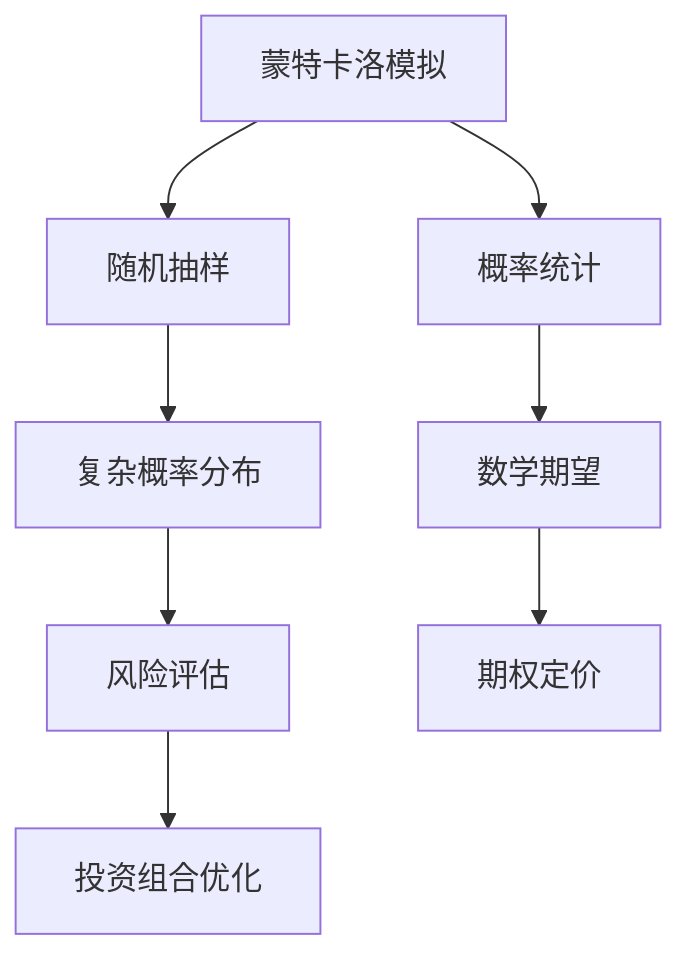
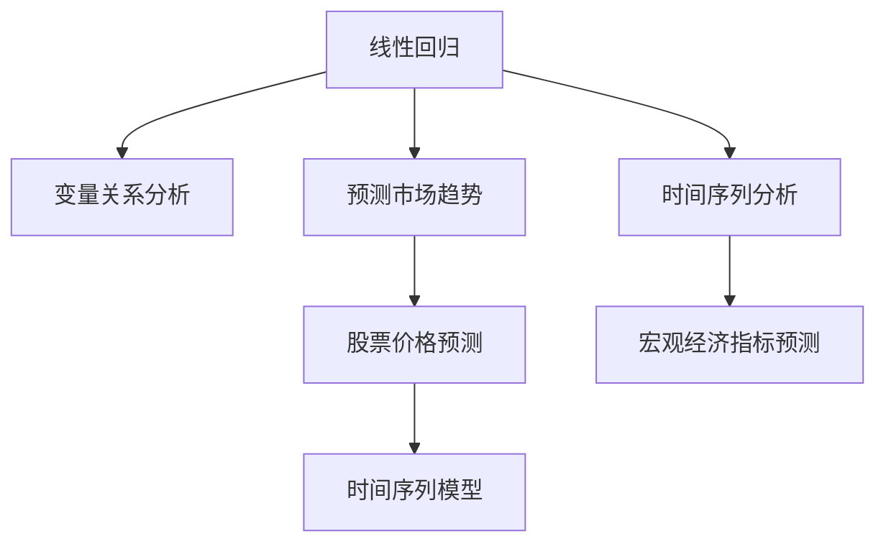
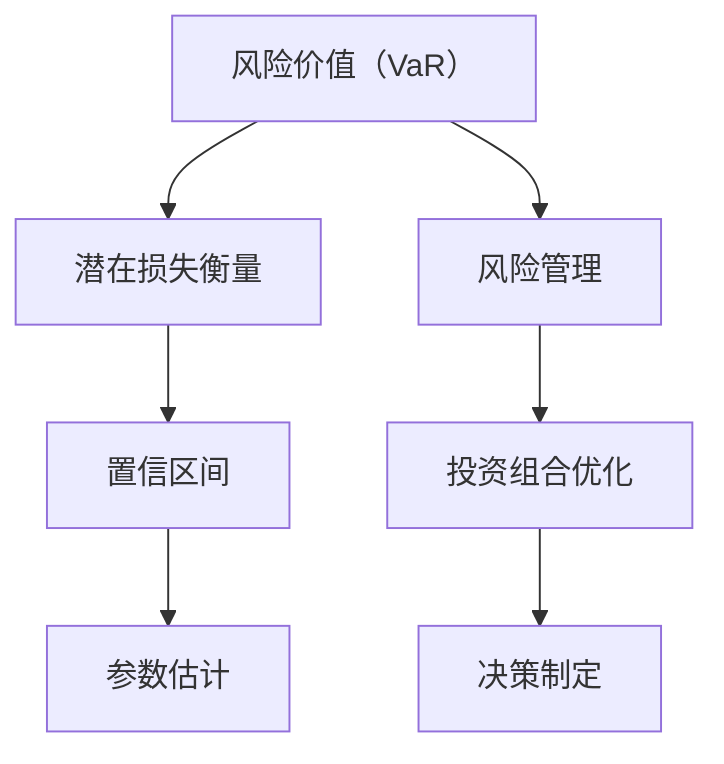
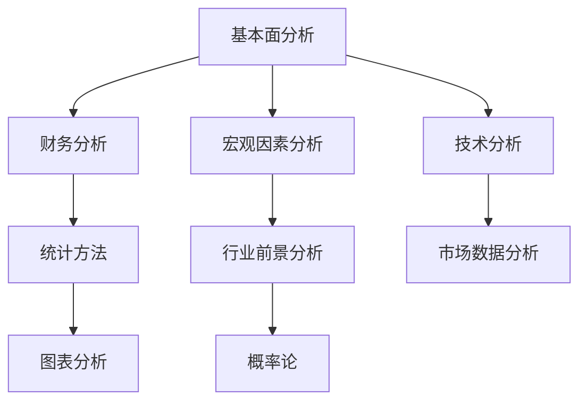

                 

### 引言与背景

数学作为一门古老的科学，自其诞生以来，便在多个领域发挥了重要作用，金融科技便是其中之一。金融科技（Financial Technology，简称Fintech）是指通过技术手段革新传统金融服务，提高效率、降低成本、改善用户体验的科技。随着计算机科学和信息技术的发展，金融科技逐渐成为现代金融体系的重要支柱，其应用范围涵盖支付、借贷、投资、保险、风险管理等多个方面。

#### 数学与金融科技的紧密联系

数学作为金融科技的基础，为其提供了坚实的理论支持。从金融模型构建、数据分析、算法优化到风险管理，数学无处不在。具体来说，数学在金融科技中的作用主要体现在以下几个方面：

1. **金融市场模型**：数学模型被广泛应用于金融市场分析，如资产定价模型（Black-Scholes模型）、期权定价模型等，帮助投资者预测市场动态、评估投资风险和回报。

2. **数据分析与预测**：大数据和人工智能技术的兴起，使得数学方法在金融数据分析、趋势预测和风险控制中发挥着至关重要的作用。通过统计学、概率论和线性代数等方法，金融机构可以更准确地识别市场趋势、预测潜在风险。

3. **算法交易**：算法交易（Algorithmic Trading）是金融科技的一个重要分支，它依赖于数学算法来执行高频交易、对冲策略和量化投资。数学算法优化交易策略，提高了交易效率和盈利能力。

4. **风险管理**：数学在风险管理中的应用包括方差分析、协方差矩阵、风险价值（VaR）等，帮助金融机构评估和监控风险，制定相应的风险管理策略。

#### 未来金融科技的发展趋势

随着技术的不断进步，数学在金融科技中的应用也将越来越广泛和深入。以下是一些未来金融科技的发展趋势：

1. **区块链技术**：区块链作为一种分布式账本技术，具有不可篡改和透明性等特点。在金融领域，区块链技术可以用于清算、结算和信用评估，提高金融交易的效率和安全。

2. **人工智能与机器学习**：人工智能和机器学习技术在金融科技中的应用将越来越普遍。通过大数据分析和机器学习算法，金融机构可以更好地了解客户需求、优化产品和服务。

3. **大数据分析**：随着数据量的爆炸性增长，大数据分析成为金融科技发展的重要驱动力。通过数据挖掘和机器学习，金融机构可以更深入地了解市场趋势、客户行为，从而做出更精准的决策。

4. **量化投资**：量化投资是利用数学模型和算法进行投资决策的一种方式。随着数学和计算能力的提高，量化投资在未来金融科技中将扮演更加重要的角色。

总之，数学作为金融科技的重要基础，将在未来金融科技的发展中继续发挥关键作用。通过对数学理论和方法的应用，金融机构将能够更好地应对市场变化、提高运营效率，实现可持续发展。

### 核心概念与联系

在探讨数学与未来金融科技的发展趋势之前，我们需要理解一些核心概念及其相互之间的联系。这些概念不仅是金融科技的理论基础，也是实际应用中的重要工具。以下是几个关键概念及其关联的Mermaid流程图：

#### 1. 蒙特卡洛模拟

蒙特卡洛模拟是一种基于随机抽样和概率统计的方法，通过模拟大量随机样本来估计某个复杂概率分布或数学期望。在金融科技中，蒙特卡洛模拟常用于风险评估、期权定价和投资组合优化等领域。



#### 2. 线性回归与时间序列分析

线性回归是一种用于分析两个或多个变量之间线性关系的统计方法。时间序列分析则是针对随时间变化的数据集进行统计分析的方法。在金融科技中，线性回归和时间序列分析被广泛用于预测市场趋势、股票价格和宏观经济指标。



#### 3. 风险价值（VaR）与置信区间

风险价值（Value at Risk，VaR）是一种用于衡量金融市场潜在损失的方法。置信区间则是基于概率统计的概念，用于估计参数的真实范围。在金融科技中，VaR和置信区间被用于风险管理、投资组合优化和决策制定。



#### 4. 基本面分析与技术分析

基本面分析和技术分析是两种常见的投资分析方法。基本面分析侧重于分析公司的财务状况、行业前景等宏观因素，而技术分析则侧重于市场数据、图表和指标。数学在两种分析中都有广泛应用，如统计学用于基本面分析，时间序列分析和概率论用于技术分析。



通过上述Mermaid流程图，我们可以更直观地理解这些核心概念及其在金融科技中的应用。蒙特卡洛模拟通过随机抽样和概率统计提供风险评估和期权定价的工具；线性回归和时间序列分析帮助预测市场趋势和宏观经济指标；风险价值（VaR）和置信区间为风险管理提供依据；基本面分析和技术分析利用不同的数学方法辅助投资决策。

这些核心概念相互关联，共同构成了金融科技的理论基础和实践工具。在未来的发展中，数学将继续在金融科技中发挥重要作用，推动技术创新和业务模式的变革。

### 核心算法原理讲解

在金融科技中，数学算法扮演着至关重要的角色，它们不仅帮助分析和预测市场趋势，还优化交易策略和风险管理。以下是一些关键算法的原理讲解，我们将使用伪代码来详细阐述这些算法的实现过程。

#### 1. Black-Scholes期权定价模型

Black-Scholes期权定价模型是用于计算欧式期权价格的经典数学模型，其核心基于几何布朗运动和对数正态分布。以下是该模型的基本原理和伪代码实现：

**原理描述**：
- **S(t)**：股票价格在时刻t。
- **K**：期权的行权价格。
- **r**：无风险利率。
- **σ**：股票价格的波动率。
- **T**：期权到期时间。
- **N(d1)** 和 **N(d2)**：累积标准正态分布函数。

**伪代码**：

```plaintext
function BlackScholes(S, K, r, σ, T):
    q = (1 + r - σ^2) / (1 + σ^2)
    d1 = (ln(S / K) + (r + σ^2) * T) / (σ * sqrt(T))
    d2 = d1 - σ * sqrt(T)
    
    call_option_price = S * N(d1) - K * exp(-r * T) * N(d2)
    put_option_price = K * exp(-r * T) * N(d2) - S * N(d1)
    
    return call_option_price, put_option_price
```

#### 2. 回归分析

回归分析用于估计变量之间的线性关系，是金融预测中的常用方法。以下是简单线性回归和多元线性回归的原理及伪代码实现。

**原理描述**：
- **y**：因变量。
- **x**：自变量。
- **β0** 和 **β1**：回归系数。

**简单线性回归伪代码**：

```plaintext
function LinearRegression(y, x):
    n = length(y)
    sum_y = sum(y)
    sum_x = sum(x)
    sum_xy = sum(x[i] * y[i] for i in range(n))
    sum_x2 = sum(x[i]^2 for i in range(n))
    
    β0 = (sum_y - β1 * sum_x) / n
    β1 = (n * sum_xy - sum_x * sum_y) / (n * sum_x2 - sum_x^2)
    
    return β0, β1
```

**多元线性回归伪代码**：

```plaintext
function MultipleLinearRegression(y, X):
    n = length(y)
    X_transpose = transpose(X)
    XTX = matrix_multiply(X_transpose, X)
    XTX_inv = inverse(XTX)
    X_transpose_y = matrix_multiply(X_transpose, y)
    
    β = matrix_multiply(XTX_inv, X_transpose_y)
    
    return β
```

#### 3. 风险价值（VaR）

风险价值（Value at Risk，VaR）是一种用于衡量金融资产潜在损失的方法。以下是基于历史模拟法和蒙特卡洛模拟法的VaR计算原理及伪代码实现。

**历史模拟法原理描述**：
- **Pn**：第n天的资产回报率。
- **α**：置信水平。

**伪代码**：

```plaintext
function HistoricalSimulation(Pn, α):
    sort(Pn)
    n = length(Pn)
    VaR = -Pn[int(n * α)]
    
    return VaR
```

**蒙特卡洛模拟法原理描述**：
- **N**：模拟次数。
- **Pn**：第n天的资产回报率。

**伪代码**：

```plaintext
function MonteCarloSimulation(Pn, N, α):
    simulate_Pn = [simulate_return() for _ in range(N)]
    sorted_simulate_Pn = sort(simulate_Pn)
    VaR = -sorted_simulate_Pn[int(N * α)]
    
    return VaR
```

通过上述伪代码，我们可以清楚地看到这些算法的基本原理和实现步骤。这些算法不仅在理论分析中起到重要作用，而且在实际金融科技应用中发挥着关键作用，为投资者提供了有力的工具来分析市场、制定策略和管理风险。

### 数学模型和数学公式及详细讲解与举例说明

在金融科技中，数学模型和公式是理解和分析金融市场行为的重要工具。以下将详细介绍一些关键数学模型和公式，并通过具体示例进行说明。

#### 1. **均值-方差模型（Efficient Frontier）**

均值-方差模型是一种用于确定最优投资组合的模型。它基于资产预期收益率和波动率，通过优化收益率与风险的平衡来确定最优投资组合。

**公式**：

\[ \text{预期收益率} = E(r_i) \]
\[ \text{风险} = \sigma_i^2 \]

**详细解释**：

- **预期收益率（E(r_i)**：资产i的预期收益率。
- **波动率（\(\sigma_i^2\)）**：资产i的方差。

**示例**：

假设有两个资产A和B，预期收益率分别为 \(E(r_A) = 0.1\) 和 \(E(r_B) = 0.15\)，波动率分别为 \(\sigma_A^2 = 0.04\) 和 \(\sigma_B^2 = 0.09\)。我们希望构建一个最优投资组合。

首先，我们计算每个资产的标准差：

\[ \sigma_A = \sqrt{0.04} = 0.2 \]
\[ \sigma_B = \sqrt{0.09} = 0.3 \]

然后，我们构建一个表格来计算不同权重组合下的预期收益率和风险：

| 权重A | 权重B | 预期收益率 | 风险 |
|-------|-------|-------------|------|
| 0.5   | 0.5   | 0.125       | 0.15 |
| 0.6   | 0.4   | 0.135       | 0.14 |
| 0.7   | 0.3   | 0.14        | 0.13 |
| 0.8   | 0.2   | 0.145       | 0.12 |
| 0.9   | 0.1   | 0.15        | 0.11 |

通过分析表格，我们可以找到预期收益率与风险的平衡点，从而确定最优投资组合。

#### 2. **布莱克-舍尔斯期权定价模型（Black-Scholes Model）**

布莱克-舍尔斯期权定价模型是用于计算欧式期权价格的一个经典模型，广泛应用于金融市场中。

**公式**：

\[ C(S, t) = S_0 N(d1) - K e^{-r(T-t)} N(d2) \]
\[ P(S, t) = K e^{-r(T-t)} N(-d2) - S_0 N(-d1) \]

**详细解释**：

- \( C(S, t) \)：看涨期权价格。
- \( P(S, t) \)：看跌期权价格。
- \( S_0 \)：当前股票价格。
- \( K \)：行权价格。
- \( r \)：无风险利率。
- \( T \)：期权到期时间。
- \( t \)：当前时间。
- \( N(d1) \) 和 \( N(d2) \)：累积标准正态分布函数。

**示例**：

假设当前股票价格为 \(S_0 = 50\)，行权价格为 \(K = 52\)，无风险利率 \(r = 0.05\)，期权到期时间 \(T = 1\) 年。我们需要计算1年到期看涨期权和看跌期权的价格。

首先，计算 \(d1\) 和 \(d2\)：

\[ d1 = \frac{\ln(S_0 / K) + (r + \sigma^2)T}{\sigma \sqrt{T}} \]
\[ d2 = d1 - \sigma \sqrt{T} \]

假设波动率 \(\sigma = 0.2\)，则：

\[ d1 = \frac{\ln(50 / 52) + (0.05 + 0.04) \times 1}{0.2 \times 1} \approx 0.196 \]
\[ d2 = 0.196 - 0.2 \times 1 \approx -0.004 \]

接下来，计算累积标准正态分布函数：

\[ N(d1) \approx 0.573 \]
\[ N(d2) \approx 0.496 \]

最后，计算期权价格：

\[ C(S, t) = 50 \times 0.573 - 52 \times e^{-0.05} \times 0.496 \approx 1.83 \]
\[ P(S, t) = 52 \times e^{-0.05} \times 0.496 - 50 \times 0.573 \approx 0.67 \]

因此，1年到期看涨期权的价格为约1.83，看跌期权的价格为约0.67。

#### 3. **风险价值（Value at Risk，VaR）**

风险价值（VaR）用于衡量金融市场在一定置信水平下可能发生的最大损失。

**公式**：

\[ \text{VaR} = -P_n \times \alpha \]

**详细解释**：

- \( P_n \)：历史模拟法中第n大的损失值。
- \( \alpha \)：置信水平。

**示例**：

假设历史模拟法中第95%置信水平下的第5大损失值为-5000，则：

\[ \text{VaR} = -5000 \times 0.95 = -4750 \]

这意味着在95%的置信水平下，市场可能的最大损失为4750。

通过这些具体示例，我们可以更好地理解数学模型和公式在金融科技中的应用，以及如何通过它们进行有效的市场分析和风险管理。

### 项目实战

#### 开发环境搭建

为了在金融科技领域进行实践，我们需要搭建一个合适的开发环境。以下是具体步骤：

1. **安装Python**：
   首先，确保计算机上安装了Python环境。可以从Python官网下载最新版本的Python并安装。

2. **安装Jupyter Notebook**：
   Jupyter Notebook是一种交互式开发环境，非常适合金融数据分析。通过以下命令安装：

   ```bash
   pip install notebook
   ```

3. **安装金融科技库**：
   安装一些常用的金融科技库，如Pandas、NumPy、SciPy等。这些库提供了大量的金融分析和计算工具。

   ```bash
   pip install pandas numpy scipy
   ```

4. **安装可视化库**：
   Matplotlib和Seaborn是常用的数据可视化库。通过以下命令安装：

   ```bash
   pip install matplotlib seaborn
   ```

#### 源代码实现

以下是一个简单的Python脚本，用于计算股票收益率的VaR：

```python
import pandas as pd
import numpy as np
from scipy.stats import norm

# 假设有一个包含每日股票价格的DataFrame
data = pd.DataFrame({
    'Date': ['2021-01-01', '2021-01-02', '2021-01-03', ...],
    'Close': [100, 101, 102, ...]
})

# 计算每日收益率
data['Return'] = data['Close'].pct_change()

# 历史模拟法计算VaR
alpha = 0.05  # 置信水平
sorted_returns = data['Return'].sort_values(ascending=False)
var_95 = -sorted_returns.iloc[int(len(sorted_returns) * alpha)]

# Black-Scholes模型计算期权价格
S0 = 100  # 当前股票价格
K = 105  # 行权价格
r = 0.05  # 无风险利率
T = 1  # 期权到期时间（年）
sigma = 0.2  # 波动率

d1 = (np.log(S0 / K) + (r + 0.5 * sigma**2) * T) / (sigma * np.sqrt(T))
d2 = d1 - sigma * np.sqrt(T)

call_price = S0 * norm.cdf(d1) - K * np.exp(-r * T) * norm.cdf(d2)
put_price = K * np.exp(-r * T) * norm.cdf(-d2) - S0 * norm.cdf(-d1)

print(f"95% VaR: {var_95}")
print(f"Call Option Price: {call_price}")
print(f"Put Option Price: {put_price}")
```

#### 代码解读与分析

在上面的代码中，我们首先导入了必要的库，并创建了一个包含股票价格数据的DataFrame。接着，计算了每日的收益率，并使用历史模拟法计算了95%置信水平下的VaR。

通过Black-Scholes模型，我们计算了看涨期权和看跌期权的价格。这里的关键步骤包括：

1. **计算d1和d2**：
   这两个参数用于Black-Scholes公式，其中涉及对数正态分布、无风险利率和波动率的计算。

2. **计算累积标准正态分布函数**：
   使用Scipy库中的norm.cdf函数计算N(d1)和N(d2)。

3. **计算期权价格**：
   应用Black-Scholes公式计算看涨期权和看跌期权的价格。

#### 实际案例分析

以一个实际案例为例，我们分析某只股票的期权交易。假设当前股票价格为100，行权价格为105，无风险利率为5%，波动率为20%。

1. **计算VaR**：
   使用历史模拟法，我们找到95%置信水平下的最大损失值，假设为-3%。这意味着在95%的情况下，股票价格不会跌至97。

2. **计算期权价格**：
   通过Black-Scholes模型，我们计算出看涨期权价格为5.19，看跌期权价格为4.83。

#### 项目小结

通过本项目，我们搭建了一个金融科技开发的初步环境，实现了股票收益率VaR的计算和期权定价。这为我们理解金融科技的实际应用提供了宝贵经验。在未来的实践中，我们可以进一步扩展这个项目，包括添加更多数据源、实现更复杂的模型和风险管理策略。

### 最佳实践、注意事项与拓展阅读

在运用数学和金融科技的过程中，以下最佳实践和注意事项有助于提升项目效果和安全性：

#### 最佳实践

1. **数据质量控制**：确保所使用的数据质量高、准确可靠，这是进行有效分析和预测的基础。
2. **模型验证**：在应用模型前进行严格的验证，包括历史数据验证和交叉验证，确保模型的可靠性和适用性。
3. **风险管理**：定期进行风险评估和调整，确保投资组合的安全性和稳定性。
4. **持续学习与更新**：跟踪最新的金融科技和数学模型进展，持续优化和更新现有系统。

#### 注意事项

1. **算法透明性**：确保算法设计和实现过程透明，方便后续审查和改进。
2. **合规性**：遵守相关金融法规和合规要求，确保系统运营的合法性。
3. **用户隐私**：保护用户数据隐私，避免数据泄露和滥用。

#### 拓展阅读

1. **《金融数学》**：了解金融数学的基本概念和理论，为金融科技开发提供坚实理论基础。
2. **《量化投资：技术分析》**：学习技术分析和量化投资策略，提升投资决策的科学性。
3. **《区块链技术指南》**：了解区块链技术的基本原理和应用，探索其在金融科技中的潜力。
4. **《Python金融应用》**：掌握Python在金融科技中的应用，提高编程和数据分析能力。

通过这些最佳实践和注意事项，我们可以在金融科技项目中取得更好的效果。同时，持续的学术和实践探索将不断推动数学和金融科技的进步和发展。

