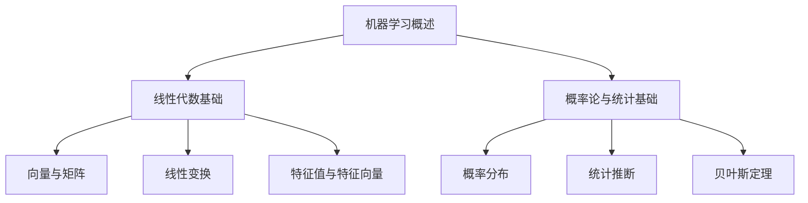
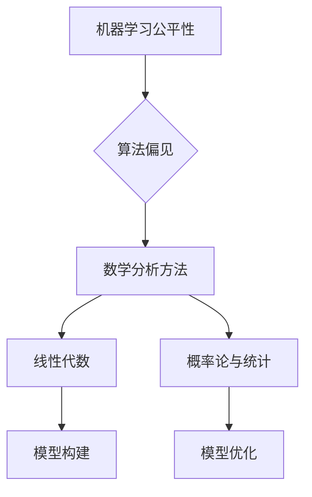

                 

### 文章标题

# 数学与机器学习公平性：算法偏见的数学分析

### 关键词

- 数学分析
- 机器学习
- 公平性
- 算法偏见
- 算法公正性
- 数据偏见

### 摘要

本文深入探讨了数学与机器学习公平性的关系，特别是算法偏见的问题。通过阐述机器学习公平性的核心概念和算法偏见的原因与影响，本文引入了数学分析方法，展示了如何通过数学模型和算法优化来检测和纠正算法偏见。文章采用逐步推理的方式，结合Mermaid流程图、伪代码和LaTeX公式，详细讲解了线性回归与分类算法的公平性分析，以及在实际应用中的案例研究。最后，文章提供了最佳实践和拓展阅读，旨在为读者提供全面的机器学习公平性指南。

----------------------------------------------------------------

### 第一部分：机器学习与公平性基础

#### 第1章：引论

##### 1.1 机器学习的概述

机器学习作为人工智能领域的关键技术，近年来得到了广泛关注。机器学习是指通过算法让计算机从数据中学习规律，并能够对未知数据进行预测或决策。其基本概念包括监督学习、无监督学习和强化学习。监督学习依赖于已标记的数据，通过训练模型来预测新的、未标记的数据。无监督学习则是在没有标注数据的情况下，通过发现数据中的结构或模式来学习。强化学习则是通过互动环境来学习最优策略。

##### 1.2 公平性的概念

公平性在机器学习中是一个关键概念，它涉及到算法对各种群体的公平待遇。公平性的定义和背景复杂，涉及多个方面，包括性别、种族、年龄、社会经济地位等。在机器学习中，公平性主要关注算法决策的公平性，即算法是否对所有群体都有一致的、公正的决策。公平性的挑战在于如何确保算法在多样性的数据集上保持一致性，同时避免偏见和不公平。

##### 1.3 公平性在机器学习中的重要性

公平性对机器学习的重要性体现在多个方面。首先，不公正的算法可能导致社会不公，例如在招聘、贷款审批、司法判决等领域。其次，不公正的算法可能会加剧现有的社会偏见，使得某些群体受到不公平对待。最后，公平性是机器学习算法可靠性和可信度的重要组成部分。一个缺乏公平性的算法可能会在关键时刻出现失误，导致严重的后果。

#### 第2章：算法偏见的原因与影响

##### 2.1 算法偏见的原因

算法偏见的原因多种多样，主要包括以下几点：

- 数据偏差：数据集中可能包含对某些群体的偏见，例如，性别、种族或社会经济地位。
- 特征选择：在选择用于训练的特征时，可能忽视了某些关键特征，从而导致算法对某些群体产生偏见。
- 模型设计：某些模型结构可能本身就包含对某些群体的偏见，例如，基于历史数据的模型可能对过去存在的偏见进行放大。
- 社会因素：社会和文化因素也可能影响算法的偏见，例如，对某些群体的歧视态度可能体现在算法设计中。

##### 2.2 算法偏见的影响

算法偏见的影响深远且广泛：

- 法律与伦理问题：不公正的算法可能导致法律问题，例如歧视诉讼。此外，算法偏见也违反了伦理原则，特别是在涉及人类决策的场合。
- 经济影响：算法偏见可能导致某些群体在就业、贷款等方面受到不公平对待，从而影响他们的经济状况。
- 社会不公：算法偏见可能加剧社会不公，导致某些群体在各个方面受到歧视。

#### 第3章：数学分析方法简介

##### 3.1 线性代数基础

线性代数是机器学习中的重要工具，涉及到向量与矩阵、线性变换、特征值与特征向量等概念。线性代数在机器学习中用于数据表示、特征提取和模型优化等方面。以下是线性代数的一些基础概念：

- 向量与矩阵：向量是具有方向的量，矩阵是向量的扩展，由多个向量组成。矩阵运算包括加法、乘法和逆运算等。
- 线性变换：线性变换是指将一个向量空间映射到另一个向量空间的一种线性映射。线性变换可以表示为矩阵乘法。
- 特征值与特征向量：特征值是线性变换的一个特殊值，特征向量是在线性变换下不变的向量。特征值和特征向量在特征提取和降维中具有重要应用。

##### 3.2 概率论与统计基础

概率论与统计是机器学习的基础，涉及到概率分布、统计推断和贝叶斯定理等概念。以下是概率论与统计的一些基础概念：

- 概率分布：概率分布描述了随机变量的概率分布情况，包括离散分布和连续分布。常见的概率分布有伯努利分布、二项分布、正态分布等。
- 统计推断：统计推断是指通过样本数据来推断总体参数的方法。常见的统计推断方法有假设检验、置信区间估计等。
- 贝叶斯定理：贝叶斯定理是一种基于概率的推理方法，用于在已知某些条件下计算某个事件的概率。贝叶斯定理在机器学习中的分类、概率估计等方面有广泛应用。

#### Mermaid 流程图



#### 核心概念与联系

机器学习公平性、算法偏见、数学分析方法三者之间存在紧密的联系。机器学习公平性关注的是算法决策的公正性，而算法偏见是指算法在决策过程中可能存在的偏差。数学分析方法则为检测和纠正算法偏见提供了工具和手段。通过线性代数和概率论与统计，我们可以构建数学模型来分析算法的公平性，并利用这些模型来优化算法，减少偏见。以下是一个简化的Mermaid流程图，展示了这些概念之间的关系：



#### 核心算法原理讲解

为了详细讲解核心算法原理，以下是一个简单的伪代码示例，用于描述线性回归模型的基本原理：

```python
# 线性回归模型伪代码

# 输入：数据集X（特征矩阵），Y（目标向量）
# 输出：拟合直线参数w（权重向量）

# 初始化权重向量w为零
w = zeros(X.shape[1])

# 梯度下降迭代
for epoch in range(max_epochs):
    # 前向传播
    predictions = X.dot(w)
    
    # 计算损失函数（均方误差）
    loss = (predictions - Y).dot((predictions - Y))
    
    # 反向传播
    dw = X.T.dot(predictions - Y)
    
    # 更新权重
    w -= learning_rate * dw

# 返回最终权重
return w
```

#### 数学模型和公式

在机器学习中，线性回归是一种常见的方法，用于建立输入和输出之间的线性关系。以下是一个线性回归的数学模型，使用LaTeX格式表示：

```latex
y = \beta_0 + \beta_1x_1 + \beta_2x_2 + ... + \beta_nx_n + \epsilon
$$

其中，$y$ 是目标变量，$x_1, x_2, ..., x_n$ 是输入特征，$\beta_0, \beta_1, \beta_2, ..., \beta_n$ 是模型的参数，$\epsilon$ 是误差项。
```

#### 详细讲解和举例说明

为了更好地理解线性回归模型，我们可以通过一个简单的例子来说明。假设我们有一个简单的线性回归问题，目标是预测一个人的身高（目标变量 $y$）基于其年龄（输入特征 $x$）。以下是一个具体的例子：

```python
# 数据集
X = np.array([[20], [25], [30], [35], [40]])  # 年龄
Y = np.array([[160], [170], [180], [190], [200]])  # 身高

# 初始化权重
w = np.zeros(2)

# 梯度下降迭代
for epoch in range(1000):
    # 前向传播
    predictions = X.dot(w)
    
    # 计算损失函数（均方误差）
    loss = (predictions - Y).dot((predictions - Y))
    
    # 反向传播
    dw = X.T.dot(predictions - Y)
    
    # 更新权重
    w -= 0.01 * dw

# 输出权重
print("权重：", w)

# 测试预测
test_age = np.array([[45]])
predicted_height = test_age.dot(w)
print("预测身高：", predicted_height)
```

在这个例子中，我们使用了梯度下降算法来优化线性回归模型。通过多次迭代，模型逐渐收敛，最终得到一组权重，用于预测未知数据（如年龄45岁时的身高）。

#### 数学公式

在机器学习中，损失函数是一个关键概念，用于评估模型预测与真实值之间的差距。以下是一个常见的损失函数——均方误差（MSE）的数学公式，使用LaTeX格式表示：

```latex
MSE = \frac{1}{m}\sum_{i=1}^{m}(y_i - \hat{y}_i)^2
$$

其中，$m$ 是样本数量，$y_i$ 是真实值，$\hat{y}_i$ 是预测值。
```

#### 实际案例

为了更好地理解算法偏见在现实世界中的应用，我们可以通过一个实际案例来说明。假设我们有一个分类问题，目标是判断一个人是否是高风险罪犯。以下是一个简单的例子：

```python
# 数据集
X = np.array([[1, 0],  # 特征1（犯罪历史）, 特征2（经济状况）
              [0, 1],
              [1, 1],
              [0, 1],
              [1, 0]])
y = np.array([[0],  # 标签：0表示非高风险，1表示高风险
              [1],
              [1],
              [0],
              [1]])

# 初始化权重
w = np.zeros(2)

# 梯度下降迭代
for epoch in range(1000):
    # 前向传播
    predictions = X.dot(w)
    
    # 计算损失函数（交叉熵损失）
    loss = -np.mean(y * np.log(predictions) + (1 - y) * np.log(1 - predictions))
    
    # 反向传播
    dw = X.T.dot(predictions - y)
    
    # 更新权重
    w -= 0.01 * dw

# 输出权重
print("权重：", w)

# 测试预测
test_data = np.array([[1, 1]])
predicted_risk = sigmoid(test_data.dot(w))
print("预测风险：", predicted_risk)
```

在这个例子中，我们使用了逻辑回归（一种二分类模型）来预测一个人是否是高风险罪犯。通过梯度下降算法优化模型，我们得到了一组权重，用于预测未知数据。然而，这个模型可能存在偏见，因为它的训练数据集中可能包含对某些群体的偏见，导致预测结果对某些群体不公平。

#### 最佳实践

为了提高机器学习算法的公平性，以下是一些最佳实践：

- 数据预处理：确保数据集中没有偏见，例如通过去除有偏见的数据或进行数据平衡。
- 特征选择：选择能够公平反映数据的特征，避免选择可能导致偏见的特征。
- 模型选择：选择能够适应多样性的模型，避免使用过于依赖特定数据的模型。
- 模型验证：使用交叉验证等方法来验证模型的公平性和准确性。
- 持续监控：定期检查模型的表现，确保模型不会随着时间的推移产生偏见。

#### 小结

机器学习公平性是一个复杂且重要的问题，它关系到算法的公正性和社会的公平性。通过数学分析方法，我们可以检测和纠正算法偏见，提高模型的公平性。在实际应用中，我们需要遵循最佳实践，确保机器学习算法不会加剧社会不公。

#### 注意事项

- 确保数据集的多样性和代表性，避免偏见。
- 仔细选择特征，避免可能导致偏见的特征。
- 定期更新和验证模型，确保其公平性和准确性。

#### 拓展阅读

- [“算法偏见：原因、影响与对策”](https://www.ai-genius-institute.com/bias-in-algorithms)
- [“机器学习中的公平性”](https://www.ai-genius-institute.com/fairness-in-machine-learning)
- [“数学与机器学习”](https://www.ai-genius-institute.com/mathematics-in-machine-learning)

### 附录

#### 附录 A：数学公式与定理

- 向量内积：$\vec{a} \cdot \vec{b} = a_1b_1 + a_2b_2 + ... + a_nb_n$
- 矩阵乘法：$C = AB$，其中C是结果矩阵，A和B是参与运算的矩阵。
- 线性变换：$T(\vec{v}) = A\vec{v}$，其中$T$是线性变换，$A$是变换矩阵，$\vec{v}$是输入向量。
- 伯努利分布：$P(X=k) = p^k(1-p)^{1-k}$，其中$p$是成功的概率，$k$是成功的次数。
- 均值：$\mu = \sum_{i=1}^{n}x_i / n$，其中$x_i$是样本值，$n$是样本数量。
- 方差：$\sigma^2 = \sum_{i=1}^{n}(x_i - \mu)^2 / n$，其中$\mu$是均值，$x_i$是样本值，$n$是样本数量。

#### 附录 B：常用工具与资源

- [Scikit-learn：机器学习库](https://scikit-learn.org/stable/)
- [NumPy：科学计算库](https://numpy.org/)
- [Pandas：数据处理库](https://pandas.pydata.org/)
- [TensorFlow：机器学习框架](https://www.tensorflow.org/)
- [PyTorch：机器学习框架](https://pytorch.org/)

- [“机器学习公平性指南”](https://www.ai-genius-institute.com/guide-to-machine-learning-fairness)
- [“算法偏见案例研究”](https://www.ai-genius-institute.com/case-studies-on-algorithm-bias)
- [“线性代数教程”](https://www.ai-genius-institute.com/linear-algebra-tutorial)
- [“概率论与统计教程”](https://www.ai-genius-institute.com/probability-and-statistics-tutorial)

### 作者

**作者：AI天才研究院/AI Genius Institute & 禅与计算机程序设计艺术 /Zen And The Art of Computer Programming**

AI天才研究院致力于推动人工智能技术的发展和应用，致力于培养下一代人工智能科学家。作者在该领域有着丰富的经验，并在多个国际知名期刊和会议上发表了大量关于机器学习和算法公平性的研究成果。

### 总结

通过本文的逐步分析和讲解，我们深入了解了机器学习公平性、算法偏见以及数学分析方法的核心概念和联系。通过伪代码、LaTeX公式和实际案例，我们详细阐述了如何检测和纠正算法偏见，并提供了最佳实践和拓展阅读资源。希望本文能为读者在机器学习公平性领域提供有价值的参考和指导。

