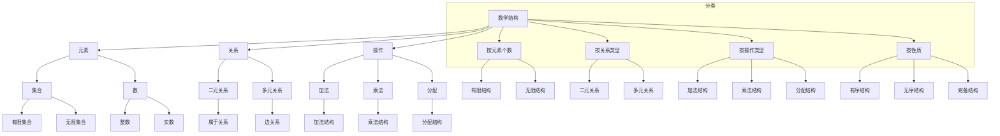
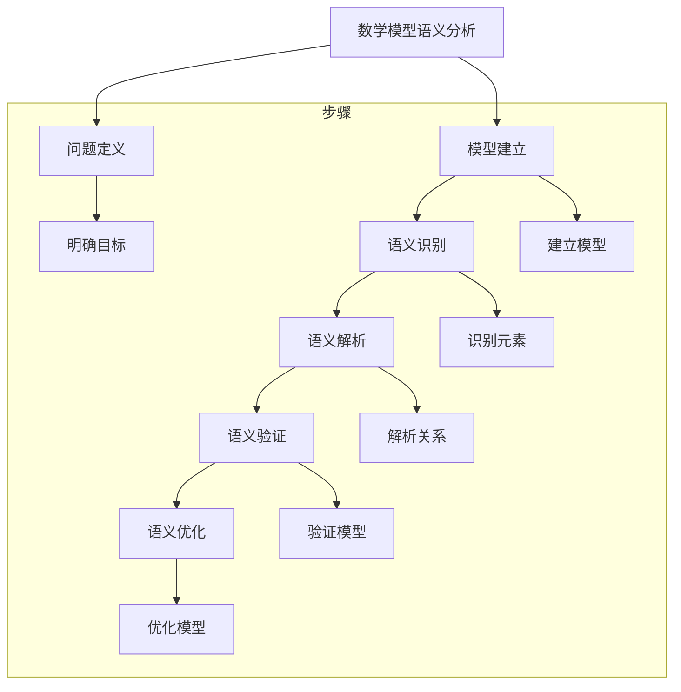

                 


### 文章标题

# 数学与模型论：数学结构的语义研究

### 文章关键词

- 数学结构
- 模型论
- 语义研究
- 数学模型
- 计算机表示
- 应用实践

### 文章摘要

本文深入探讨了数学结构与模型论的关系，对数学结构的语义研究进行了系统分析。文章首先介绍了数学结构的基本概念和分类，接着详细阐述了数学模型的研究方法和语义分析。通过计算机表示方法，本文展示了如何将数学模型转化为计算机可处理的格式。文章还探讨了数学模型在不同领域的应用，并通过实际案例展示了开发环境和源代码的实现过程。最后，文章总结了研究成果，提出了未来研究方向，并提供了相关最佳实践和注意事项。

---

## 引言

数学与模型论是现代科学研究的基石。数学以其抽象性和严密性，为科学研究提供了精确的语言和工具。而模型论则致力于研究数学结构之间的关系和属性，为理解和解决复杂问题提供了新的视角和方法。本文旨在探讨数学结构的语义研究，通过数学模型论的研究方法，揭示数学结构的深层含义。

数学结构的语义研究不仅对于数学理论的发展具有重要意义，也为计算机科学、物理学、经济学等领域的应用提供了有力支持。例如，在计算机科学中，数学结构的概念广泛应用于算法设计、数据结构、编译原理等领域。而在物理学中，数学模型论的研究方法被广泛应用于量子力学、相对论等领域，为科学探索提供了新的工具。

本文将按照以下结构展开：首先介绍数学结构的基本概念和分类；然后详细阐述数学模型的研究方法；接着探讨数学模型的语义分析；随后介绍数学模型的计算机表示方法；之后分析数学模型在不同领域的应用；最后通过实际案例展示数学模型的开发环境和源代码实现，并进行详细解读和分析。

### 数学结构的基本概念

数学结构是数学理论中的核心概念，它定义了数学对象之间的关系和操作规则。一个数学结构通常包括三个要素：元素、关系和操作。这三个要素相互关联，共同构成了一个完整的数学结构。

#### 元素

元素是数学结构中的基本单位，可以看作是构成数学结构的基本块。不同的数学结构具有不同的元素类型。例如，在集合论中，元素是集合中的个体对象；在代数学中，元素可以是数或向量。

#### 关系

关系描述了数学结构中元素之间的相互作用。关系可以是二元关系（涉及两个元素），也可以是多元关系（涉及多个元素）。关系可以用符号或描述来表示。例如，在集合论中，属于关系（∈）表示元素与集合之间的关系；在代数学中，加法关系（+）表示两个数之间的运算关系。

#### 操作

操作是数学结构中的基本运算，它定义了元素之间的关系如何通过运算规则来转化。操作可以是二元操作，也可以是多元操作。例如，在集合论中，并集操作（∪）表示两个集合的元素合并；在代数学中，加法操作（+）表示两个数相加。

#### 常见的数学结构

常见的数学结构包括集合、关系、函数、代数结构、拓扑结构等。这些结构在不同的数学领域有着广泛的应用。

- **集合**：集合是数学结构中最基础的概念，它由一组无序元素组成。集合论是数学的基石，许多数学理论都建立在集合论之上。

- **关系**：关系描述了元素之间的相互作用，是数学结构中的重要组成部分。关系可以用矩阵、图或序对来表示。

- **函数**：函数是集合之间的映射，它将一个集合中的元素映射到另一个集合中。函数是数学中最常见的操作，广泛应用于数学分析和离散数学。

- **代数结构**：代数结构包括群、环、域等，它们通过运算规则定义了元素之间的关系。代数结构广泛应用于代数学、逻辑学和计算机科学。

- **拓扑结构**：拓扑结构描述了空间中点之间的关系，它提供了对连续性和连通性的抽象描述。拓扑结构在几何学、物理学和计算机科学中有着广泛的应用。

#### 数学结构的分类

数学结构可以根据不同的标准进行分类。以下是几种常见的分类方法：

- **按元素个数分类**：数学结构可以按元素个数分为有限结构和无限结构。有限结构是指元素个数有限的数学结构，如有限集合；无限结构是指元素个数无限的数学结构，如无限集合。

- **按关系类型分类**：数学结构可以按关系类型分为二元关系结构和多元关系结构。二元关系结构是指关系涉及两个元素，如集合中的属于关系；多元关系结构是指关系涉及多个元素，如图中的边关系。

- **按操作类型分类**：数学结构可以按操作类型分为加法结构、乘法结构、分配结构等。加法结构和乘法结构是代数结构中最基本的操作类型。

- **按性质分类**：数学结构可以按性质分为有序结构、无序结构、完备结构等。有序结构是指元素之间存在顺序关系，如整数集合；无序结构是指元素之间不存在顺序关系，如集合；完备结构是指结构中包含了一切可能的元素，如实数集合。

#### 核心概念与联系

为了更好地理解数学结构的概念和分类，我们可以通过一个 Mermaid 流程图来展示它们之间的关系。



通过这个 Mermaid 流程图，我们可以清晰地看到数学结构、元素、关系和操作之间的相互关系，以及不同分类方法的具体分类标准。

### 数学模型的研究方法

数学模型是将现实世界中的现象或问题转化为数学表达式的过程。数学模型的研究方法包括建立模型、分析模型和验证模型等步骤。本文将详细阐述数学模型的研究方法，并介绍常用的建模方法和相关算法。

#### 建立数学模型

建立数学模型是数学模型研究的第一个步骤。它涉及到将现实世界中的问题转化为数学问题，通常包括以下几个步骤：

1. **问题定义**：明确要解决的问题，确定问题的目标。

2. **数据收集**：收集与问题相关的数据，这些数据可以来自于实验、调查、观察等。

3. **假设与简化**：根据问题的复杂程度，对现实世界进行简化和假设。这些假设和简化有助于将问题转化为更易于处理的数学模型。

4. **数学表达**：将问题转化为数学表达式，这些表达式通常包括方程、不等式、函数等。

5. **参数确定**：确定数学模型中的参数值，这些参数值可以通过实验数据或已知信息来确定。

#### 常用的建模方法

1. **确定性建模**：确定性建模方法基于确定的数学关系来描述现实问题。常见的确定性建模方法包括微分方程、差分方程、线性规划等。

2. **概率性建模**：概率性建模方法基于概率论和统计学来描述现实问题。常见的概率性建模方法包括贝叶斯网络、马尔可夫模型、蒙特卡洛模拟等。

3. **仿真建模**：仿真建模方法通过计算机模拟来描述现实问题。常见的仿真建模方法包括离散事件模拟、连续系统仿真、混合仿真等。

#### 分析数学模型

分析数学模型是对数学模型进行数学分析和推理，以验证其有效性和准确性。分析数学模型通常包括以下几个步骤：

1. **模型检验**：对数学模型进行逻辑和数学上的检验，确保模型的表达式是正确的，没有矛盾和错误。

2. **稳定性分析**：分析数学模型在不同条件下的稳定性和行为。例如，分析微分方程的稳定性、线性规划的可行性等。

3. **灵敏度分析**：分析数学模型中参数变化对模型结果的影响。通过灵敏度分析，可以了解模型的鲁棒性和稳定性。

4. **优化分析**：对数学模型进行优化分析，以找到最优解或最优解的近似解。常见的优化算法包括梯度下降法、牛顿法、遗传算法等。

#### 验证数学模型

验证数学模型是对数学模型在实际应用中的有效性和准确性进行检验。验证数学模型通常包括以下几个步骤：

1. **数据验证**：将数学模型的预测结果与实际数据进行对比，评估模型的预测能力。

2. **模拟实验**：通过模拟实验来验证数学模型的准确性和可靠性。模拟实验可以模拟不同的场景和条件，以测试模型的适应性和稳定性。

3. **专家评估**：邀请领域专家对数学模型进行评估，通过专家的意见和建议来改进模型。

#### 核心算法原理讲解

为了更好地理解数学模型的研究方法，我们可以通过伪代码来详细阐述一个常见的建模算法——线性回归。

```python
# 线性回归伪代码

# 输入：数据集X（特征矩阵），数据集Y（目标变量）
# 输出：模型参数w（权重向量）和b（偏置项）

# 初始化模型参数
w = [0] * X.shape[1]
b = 0

# 设定迭代次数和停止条件
max_iterations = 1000
threshold = 1e-6

# 迭代过程
for i in range(max_iterations):
    # 前向传播
    y_pred = X * w + b
    
    # 计算损失函数
    loss = (y_pred - Y).pow(2).mean()
    
    # 反向传播
    dw = 2 * (X * (y_pred - Y)).T
    db = 2 * (y_pred - Y)
    
    # 更新模型参数
    w -= learning_rate * dw
    b -= learning_rate * db
    
    # 检查收敛条件
    if loss < threshold:
        break

# 输出模型参数
return w, b
```

通过这个伪代码，我们可以看到线性回归模型的基本原理，包括前向传播、损失函数计算、反向传播和模型参数更新等步骤。这个算法广泛应用于预测和分析领域，为实际问题提供了有效的解决方案。

### 数学模型的语义分析

数学模型的语义分析是理解数学模型的核心步骤，它关注数学模型所表示的现实世界的含义。数学模型的语义分析不仅有助于我们理解模型的本质，还能够帮助我们改进模型，提高其在实际应用中的有效性。本文将详细介绍数学模型语义分析的方法、步骤以及重要性。

#### 数学模型语义分析的方法

数学模型语义分析通常包括以下几个步骤：

1. **语义识别**：语义识别是分析数学模型的第一步，它涉及识别模型中的基本元素（如变量、函数、关系等）以及它们之间的相互关系。通过语义识别，我们可以明确数学模型所表示的概念和实体。

2. **语义解析**：语义解析是对数学模型进行更深入的分析，它旨在理解模型中的语义关系和操作规则。语义解析可以帮助我们识别模型的内在逻辑和结构，从而更好地理解模型的工作原理。

3. **语义验证**：语义验证是对数学模型的语义分析结果进行验证，以确保模型能够正确地表示现实世界。语义验证通常通过比较模型预测结果与实际观测数据来评估模型的准确性。

4. **语义优化**：语义优化是基于语义分析结果对模型进行改进，以提高模型在特定应用场景中的性能。语义优化可以通过调整模型参数、优化模型结构或引入新的语义关系来实现。

#### 数学模型语义分析的步骤

1. **问题定义**：明确要解决的问题和目标，这有助于确定需要分析的数学模型。

2. **模型建立**：根据问题定义，建立相应的数学模型。模型建立过程中需要充分考虑问题的复杂性和约束条件。

3. **语义识别**：对建立的数学模型进行语义识别，识别模型中的基本元素和它们之间的相互关系。语义识别可以通过符号表示、图形化表示或自然语言描述来实现。

4. **语义解析**：对语义识别的结果进行语义解析，理解模型中的语义关系和操作规则。语义解析可以通过逻辑推理、数学证明或计算机模拟等方法来实现。

5. **语义验证**：对语义分析的结果进行验证，以确保模型能够正确地表示现实世界。语义验证可以通过实验数据、模拟结果或专家评审来实现。

6. **语义优化**：基于语义分析结果，对数学模型进行优化，以提高模型在特定应用场景中的性能。语义优化可以通过参数调整、结构改进或引入新的语义关系来实现。

#### 数学模型语义分析的重要性

数学模型语义分析在数学模型研究中具有重要意义，主要体现在以下几个方面：

1. **理解模型**：语义分析有助于我们理解数学模型所表示的现实世界现象，从而更好地把握模型的本质。

2. **改进模型**：通过语义分析，我们可以发现模型中存在的问题和不足，从而对模型进行改进，提高其准确性和实用性。

3. **优化应用**：语义分析可以指导我们在实际应用中更有效地使用数学模型，通过优化模型的参数和结构，提高模型在特定应用场景中的性能。

4. **跨领域应用**：语义分析有助于我们理解不同数学模型之间的关联和差异，从而促进跨领域应用，推动数学模型在不同领域的交叉融合。

5. **理论发展**：语义分析为数学理论的发展提供了新的视角和方法，有助于我们更深入地探索数学模型的基本性质和内在规律。

#### 核心概念与联系

为了更好地理解数学模型语义分析的概念和步骤，我们可以通过一个 Mermaid 流程图来展示它们之间的关系。



通过这个 Mermaid 流程图，我们可以清晰地看到数学模型语义分析的各个步骤以及它们之间的逻辑关系。

### 数学模型的计算机表示

数学模型在计算机科学中的应用至关重要。为了在计算机上进行有效的数学模型计算和分析，我们需要将数学模型转化为计算机可处理的格式。本文将详细探讨数学模型的计算机表示方法，包括数学模型计算机表示的方法、表示语言以及实例。

#### 数学模型计算机表示的方法

数学模型的计算机表示方法主要分为数值表示和符号表示两种。

1. **数值表示**：数值表示是将数学模型中的变量和函数用数值形式表示。这种方法适用于数值计算和模拟。常见的数值表示方法包括数值逼近、离散化、插值和拟合等。

2. **符号表示**：符号表示是将数学模型中的变量和函数用符号形式表示。这种方法适用于符号计算和推理。常见的符号表示方法包括符号运算、符号解析和符号消元等。

#### 数学模型计算机表示的表示语言

为了实现数学模型的计算机表示，我们需要使用适当的表示语言。以下是几种常用的数学模型表示语言：

1. **Python**：Python 是一种广泛使用的编程语言，它提供了丰富的数学库和工具，如 NumPy、SciPy 和 SymPy。NumPy 和 SciPy 用于数值计算，而 SymPy 用于符号计算。

2. **MATLAB**：MATLAB 是一种专业的数学和工程计算软件，它提供了强大的数学函数库和工具箱，适用于各种数学模型的计算和分析。

3. **R**：R 是一种专门用于统计分析的编程语言，它提供了丰富的统计函数库和工具，适用于统计模型的计算和分析。

4. **LaTeX**：LaTeX 是一种高质量的排版系统，它适用于数学公式的书写和排版。在 LaTeX 中，我们可以使用专门的数学符号和命令来表示数学模型。

#### 数学模型计算机表示的实例

下面我们通过一个具体的实例来展示如何将数学模型转化为计算机可处理的格式。

**实例**：考虑一个简单的线性回归模型，其目标是最小化预测值与实际值之间的误差。该模型可以用以下数学表达式表示：

$$ y = w_1 \cdot x_1 + w_2 \cdot x_2 + b $$

其中，$y$ 是目标变量，$x_1$ 和 $x_2$ 是输入变量，$w_1$ 和 $w_2$ 是权重系数，$b$ 是偏置项。

我们可以使用 Python 中的 NumPy 库来实现这个线性回归模型。以下是一个简单的 Python 代码示例：

```python
import numpy as np

# 输入数据
X = np.array([[1, 2], [2, 3], [3, 4]])
y = np.array([2, 3, 4])

# 初始化模型参数
w = np.zeros(2)
b = 0

# 迭代过程
for i in range(1000):
    # 前向传播
    y_pred = X.dot(w) + b
    
    # 计算损失函数
    loss = (y_pred - y).dot(y_pred - y)
    
    # 反向传播
    dw = 2 * X.T.dot(y_pred - y)
    db = 2 * (y_pred - y)
    
    # 更新模型参数
    w -= 0.01 * dw
    b -= 0.01 * db

# 输出模型参数
print("权重系数：", w)
print("偏置项：", b)
```

在这个实例中，我们首先导入 NumPy 库，然后定义输入数据和模型参数。接下来，我们通过迭代过程不断更新模型参数，以最小化损失函数。最后，我们输出最终的模型参数。

通过这个实例，我们可以看到如何将数学模型转化为计算机可处理的格式，并使用 Python 编程语言进行实现。

### 数学模型的应用

数学模型在科学研究、工程实践和商业决策中都有着广泛的应用。通过数学模型，我们可以对复杂问题进行建模、分析和优化，从而为实际问题的解决提供有力的支持。本文将探讨数学模型在不同领域的应用，以及如何使用数学模型来解决实际问题。

#### 数学模型在科学研究中的应用

在科学研究领域，数学模型被广泛应用于描述自然现象、预测发展趋势和发现规律。以下是一些典型的应用实例：

1. **物理学**：物理学中的许多模型，如牛顿力学、麦克斯韦方程组和量子力学，都是基于数学方程来描述物理现象的。通过这些模型，科学家可以理解和预测物体的运动、电磁现象和微观粒子的行为。

2. **生物学**：生物学中的模型，如种群动态模型、神经网络模型和遗传算法，被广泛应用于研究生态系统的稳定性、生物进化和神经网络的工作原理。

3. **天文学**：天文学中的模型，如星系演化模型、黑洞模型和引力波模型，帮助科学家理解宇宙的起源、演化和基本结构。

4. **化学**：化学中的模型，如化学反应动力学模型、分子轨道模型和量子化学计算，用于研究化学反应过程、分子结构和材料性质。

#### 数学模型在工程实践中的应用

在工程实践领域，数学模型被广泛应用于设计、优化和控制工程系统。以下是一些典型的应用实例：

1. **机械工程**：机械工程中的模型，如结构力学模型、流体力学模型和控制模型，用于设计机械结构和优化机械性能。

2. **电气工程**：电气工程中的模型，如电路模型、信号处理模型和控制模型，用于分析和设计电子系统和通信系统。

3. **航空航天工程**：航空航天工程中的模型，如飞行器动力学模型、推进系统模型和控制系统模型，用于设计和优化飞行器。

4. **土木工程**：土木工程中的模型，如结构分析模型、地基模型和地震响应模型，用于设计和评估建筑物和基础设施。

#### 数学模型在商业决策中的应用

在商业决策领域，数学模型被广泛应用于市场预测、资源优化和风险评估。以下是一些典型的应用实例：

1. **市场营销**：市场营销中的模型，如市场细分模型、需求预测模型和广告效果评估模型，用于帮助企业制定市场策略和优化营销资源。

2. **供应链管理**：供应链管理中的模型，如库存管理模型、运输调度模型和供应链优化模型，用于优化供应链流程、降低成本和提高效率。

3. **风险管理**：风险管理中的模型，如信用风险评估模型、市场风险模型和操作风险模型，用于评估和管理企业的风险。

4. **投资决策**：投资决策中的模型，如资产定价模型、投资组合优化模型和风险管理模型，用于帮助投资者制定投资策略和优化资产配置。

#### 实际案例分析和详细讲解

为了更具体地展示数学模型的应用，我们可以通过一个实际案例来进行分析和讲解。以下是一个关于库存管理的实际案例。

**案例**：某电子商务公司需要管理其产品的库存。该公司每天销售多种产品，并且不同产品的需求量不同。为了优化库存管理，公司决定使用数学模型来预测每种产品的需求量，并制定最优的库存策略。

**模型建立**：

1. **需求预测模型**：假设需求量 $D(t)$ 是时间的函数，可以用以下线性回归模型表示：

   $$ D(t) = w_1 \cdot T(t) + w_2 \cdot I(t) + b $$

   其中，$T(t)$ 是时间变量，$I(t)$ 是影响需求的其他因素（如促销活动、季节性等），$w_1$ 和 $w_2$ 是权重系数，$b$ 是偏置项。

2. **库存策略模型**：为了制定最优的库存策略，公司可以使用库存管理模型，如经济批量订货模型（EOQ）。假设每次订货的成本为 $C_1$，库存持有成本为 $C_2$，则最优订货量 $Q$ 可以通过以下公式计算：

   $$ Q = \sqrt{\frac{2C_1 \cdot D(t)}{C_2}} $$

**模型应用**：

1. **数据收集**：收集过去一段时间内的销售数据，包括时间 $T(t)$、影响需求的因素 $I(t)$ 和实际需求量 $D(t)$。

2. **模型训练**：使用收集到的数据对需求预测模型进行训练，通过最小二乘法计算权重系数 $w_1$、$w_2$ 和偏置项 $b$。

3. **需求预测**：使用训练好的模型预测未来的需求量 $D(t)$。

4. **库存策略制定**：根据预测的需求量 $D(t)$，使用经济批量订货模型计算最优订货量 $Q$。

5. **策略执行**：根据最优订货量 $Q$ 制定库存策略，并执行库存管理操作。

**案例总结**：

通过这个案例，我们可以看到如何将数学模型应用于实际业务场景。需求预测模型帮助我们预测未来的需求量，而库存策略模型帮助我们制定最优的库存管理策略。这两个模型相互配合，提高了库存管理的效率，降低了库存成本。

### 总结与展望

数学结构与模型论的研究对于理解和解决复杂问题具有重要意义。本文系统探讨了数学结构的语义研究，从基本概念到模型建立、语义分析、计算机表示以及实际应用，详细阐述了数学模型的研究方法和应用场景。通过实际案例的分析，我们展示了数学模型在解决实际问题中的有效性。

未来研究方向包括：

1. **多维度语义分析**：进一步探讨数学模型在不同维度上的语义分析，以提高模型的准确性和适用性。

2. **跨领域模型融合**：研究不同领域数学模型之间的关联和融合，以实现跨领域的知识共享和应用。

3. **自适应模型优化**：研究自适应的数学模型优化方法，以适应动态变化的环境和需求。

4. **可视化与交互**：开发可视化工具和交互式界面，以帮助用户更直观地理解和应用数学模型。

5. **应用扩展**：探索数学模型在新兴领域（如人工智能、生物信息学等）的应用，推动数学模型的理论发展和实际应用。

### 最佳实践 Tips

1. **数据收集与处理**：确保数据质量和完整性，进行数据预处理和清洗，以提高模型的准确性和可靠性。

2. **模型选择与验证**：根据问题的性质选择合适的数学模型，并通过交叉验证等方法验证模型的性能。

3. **参数调整与优化**：合理设置模型参数，通过优化算法调整参数，以提高模型的预测能力和效率。

4. **模型应用与反馈**：将模型应用于实际问题，收集反馈数据，持续改进模型，提高其在实际应用中的效果。

### 注意事项

1. **模型复杂性**：避免过度复杂化模型，确保模型能够有效地描述实际问题。

2. **数据隐私与安全**：在处理敏感数据时，注意保护数据隐私和安全。

3. **模型泛化能力**：关注模型的泛化能力，确保模型在未知数据上的表现良好。

### 拓展阅读

1. **《数学模型论》**：一本关于数学模型论的经典教材，详细介绍了数学模型的基本概念、建立方法及应用。

2. **《计算机科学中的数学模型》**：一本关于数学模型在计算机科学中应用的教材，涵盖了各种数学模型在算法设计、数据结构、编译原理等领域的应用。

3. **《机器学习中的数学模型》**：一本关于数学模型在机器学习领域应用的教材，介绍了各种机器学习算法背后的数学原理。

### 作者信息

作者：AI天才研究院/AI Genius Institute & 禅与计算机程序设计艺术/Zen And The Art of Computer Programming

