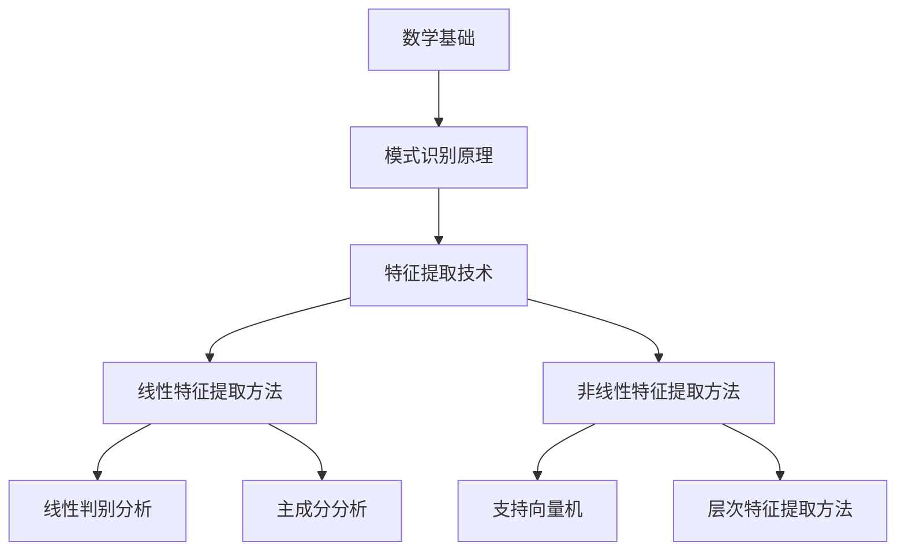

                 

# 数学与模式识别：特征提取的数学方法

## 关键词
- 数学基础
- 模式识别
- 特征提取
- 线性判别分析
- 主成分分析
- 支持向量机
- 非线性特征提取
- 数学模型
- 机器学习
- 项目实战

## 摘要
本文旨在深入探讨数学与模式识别中的特征提取方法。首先，我们将介绍数学在模式识别中的应用背景，并详细讲解模式识别的基本原理。接着，我们将探讨特征提取的技术和方法，包括线性与非线性特征提取。本文还将使用数学模型和公式详细阐述特征提取的核心算法原理，并通过具体的例子进行说明。最后，我们将结合实际项目，展示如何在实际应用中实现特征提取，并提供最佳实践技巧和总结。

## 设计书籍目录大纲

### 背景介绍
在21世纪的今天，随着人工智能和机器学习的快速发展，特征提取作为模式识别领域的关键技术，已经广泛应用于图像识别、语音识别、生物信息学等多个领域。为了帮助读者深入理解特征提取的数学方法，本文将设计一个详细的书籍目录大纲，以便系统地介绍这一主题。

### 核心概念与联系
在本书的目录设计中，我们将首先确立核心章节，如数学基础、模式识别原理、特征提取技术等。然后，在每个核心章节下，细化内容，确保覆盖所有相关主题。以下是核心概念与联系之间的架构 Mermaid 流程图：



### 核心算法原理讲解
在书籍的各个章节中，我们将详细介绍每个核心算法的原理。例如，线性判别分析（LDA）和主成分分析（PCA）是两种常见的线性特征提取方法，其核心原理如下：

#### 线性判别分析（LDA）

**伪代码：**
```python
def LDA(X, y):
    # X 为特征矩阵，y 为标签向量
    # 计算类内散度矩阵和类间散度矩阵
    S_w = compute_scatter_matrix_within_classes(X, y)
    S_b = compute_scatter_matrix_between_classes(X, y)
    # 计算线性变换矩阵 W
    W = (S_b ** -1) @ S_w
    return W
```

**数学模型和公式：**
$$
W = (S_b^{-1}) S_w
$$

其中，\( S_w \) 是类内散度矩阵，\( S_b \) 是类间散度矩阵。

#### 主成分分析（PCA）

**伪代码：**
```python
def PCA(X):
    # X 为特征矩阵
    # 计算协方差矩阵
    cov_matrix = compute_covariance_matrix(X)
    # 计算协方差矩阵的特征值和特征向量
    eigen_values, eigen_vectors = compute_eigen(cov_matrix)
    # 选择最大的 k 个特征向量
    principal_components = select_top_k_eigen_vectors(eigen_vectors, k)
    return principal_components
```

**数学模型和公式：**
$$
U = V \Sigma^{1/2}
$$

其中，\( U \) 是特征向量矩阵，\( V \) 是协方差矩阵，\( \Sigma \) 是特征值矩阵。

### 数学模型和公式的详细讲解与举例说明
在本书中，我们将详细讲解每个数学模型和公式，并通过具体的例子来说明其应用。例如，对于线性判别分析，我们将会展示如何使用Python实现LDA算法，并通过一个简单的二分类问题来说明其效果。

### 项目实战
在本书的第四部分，我们将结合实际项目，展示如何在实际应用中实现特征提取。例如，我们将介绍如何搭建一个简单的图像识别项目，使用主成分分析（PCA）进行特征提取，并通过实际数据集进行训练和测试。

#### 开发环境搭建
- 使用Python作为编程语言
- 安装必要的库，如NumPy、scikit-learn、matplotlib等

#### 源代码详细实现和代码解读
以下是一个简单的图像识别项目的代码示例，展示如何使用PCA进行特征提取：

```python
import numpy as np
from sklearn.decomposition import PCA
from sklearn.model_selection import train_test_split
from sklearn.metrics import accuracy_score
from sklearn.datasets import load_digits

# 加载数据集
digits = load_digits()
X = digits.data
y = digits.target

# 划分训练集和测试集
X_train, X_test, y_train, y_test = train_test_split(X, y, test_size=0.2, random_state=42)

# 使用PCA进行特征提取
pca = PCA(n_components=30)
X_train_pca = pca.fit_transform(X_train)
X_test_pca = pca.transform(X_test)

# 训练分类器
from sklearn.linear_model import LogisticRegression
classifier = LogisticRegression()
classifier.fit(X_train_pca, y_train)

# 测试分类器
y_pred = classifier.predict(X_test_pca)
accuracy = accuracy_score(y_test, y_pred)
print(f"Accuracy: {accuracy}")
```

#### 代码应用解读与分析
上述代码首先加载数据集，然后使用PCA进行特征提取，接着训练一个逻辑回归分类器，并使用测试集进行评估。通过调整PCA中的n_components参数，可以控制提取的特征数量，从而平衡特征提取的效率和分类效果。

#### 实际案例分析和详细讲解剖析
在本部分，我们将深入分析一个实际案例，如使用PCA进行人脸识别。我们将展示如何收集数据、预处理数据、使用PCA进行特征提取，并最终实现人脸识别系统。

### 项目小结
在本项目的最后，我们将总结项目的主要收获，包括如何使用PCA进行特征提取，如何训练分类器，以及如何评估模型性能。此外，我们还将讨论项目中的挑战和可能的改进方向。

### 最佳实践 tips
- 在特征提取时，应考虑数据的分布特性，选择合适的特征提取方法。
- 在项目开发中，应注重数据的预处理和清洗，确保数据质量。
- 在评估模型性能时，应使用交叉验证等方法，避免过拟合。

### 小结
本文通过详细的目录大纲和实例讲解，系统地介绍了数学与模式识别中的特征提取方法。从数学基础到核心算法，再到实际项目实战，本文旨在帮助读者全面理解特征提取的原理和应用。

### 注意事项
- 在实际应用中，特征提取方法的选用应基于具体问题和数据特性。
- 在特征提取时，应注意特征的数量和维度，避免维度灾难。

### 拓展阅读
- 《模式识别与机器学习》（Christopher M. Bishop）
- 《特征工程实践指南》（Kjell Johnson）
- 《Python机器学习》（Sebastian Raschka）

## 文章正文

### 第一部分：数学基础与模式识别原理

### 第1章：数学基础
#### 1.1 数学背景知识
数学作为自然科学和工程学科的基础，在模式识别中发挥着至关重要的作用。在特征提取过程中，我们经常需要使用线性代数、概率论和统计学等数学工具。线性代数提供了矩阵和向量的表示方法，概率论和统计学则帮助我们理解和处理不确定性数据。

#### 1.2 数学模型和公式的介绍
为了更好地理解特征提取的方法，我们需要掌握一些基本的数学模型和公式。例如，协方差矩阵、特征值和特征向量等。协方差矩阵是描述多变量数据分布的重要工具，而特征值和特征向量则用于主成分分析（PCA）等算法。

### 第2章：模式识别原理
#### 2.1 模式识别的基本概念
模式识别是指通过分析数据，从中提取有用的信息，并对数据进行分类或回归的过程。模式识别的基本概念包括数据集、特征、分类器等。

#### 2.2 模式识别的基本算法
模式识别的算法可以分为监督学习和无监督学习两类。监督学习通过已知的输入输出数据训练分类器，而无监督学习则从未标记的数据中自动发现模式。

#### 2.3 模式识别的应用领域
模式识别广泛应用于图像识别、语音识别、生物信息学、自然语言处理等领域。通过特征提取和分类算法，我们可以从大量数据中提取有价值的信息。

### 第二部分：特征提取技术

### 第3章：特征提取的基本方法
#### 3.1 特征提取的基本流程
特征提取的基本流程包括数据预处理、特征选择、特征变换等步骤。数据预处理是为了提高数据质量，特征选择是为了从大量特征中筛选出有用的特征，特征变换则是为了将原始特征转换为更适合分析的表示形式。

#### 3.2 特征选择的方法
特征选择的方法可以分为过滤式、包裹式和嵌入式三类。过滤式特征选择在特征提取之前进行，包裹式特征选择在特征提取过程中进行，嵌入式特征选择则在训练过程中动态调整特征。

#### 3.3 特征变换的方法
特征变换的方法包括线性变换、非线性变换等。线性变换如主成分分析（PCA）和线性判别分析（LDA），非线性变换如核方法和支持向量机（SVM）。

### 第4章：线性特征提取方法
#### 4.1 线性判别分析（LDA）
线性判别分析（LDA）是一种常用的线性特征提取方法，它通过最大化类间散度，最小化类内散度，将数据投影到最优特征空间。

**伪代码：**
```python
def LDA(X, y):
    # X 为特征矩阵，y 为标签向量
    # 计算类内散度矩阵和类间散度矩阵
    S_w = compute_scatter_matrix_within_classes(X, y)
    S_b = compute_scatter_matrix_between_classes(X, y)
    # 计算线性变换矩阵 W
    W = (S_b ** -1) @ S_w
    return W
```

**数学模型和公式：**
$$
W = (S_b^{-1}) S_w
$$

其中，\( S_w \) 是类内散度矩阵，\( S_b \) 是类间散度矩阵。

#### 4.2 主成分分析（PCA）
主成分分析（PCA）是一种降维技术，它通过将数据投影到新的特征空间，从而提取最重要的特征。PCA通过计算协方差矩阵，并找到其特征值和特征向量，从而实现降维。

**伪代码：**
```python
def PCA(X):
    # X 为特征矩阵
    # 计算协方差矩阵
    cov_matrix = compute_covariance_matrix(X)
    # 计算协方差矩阵的特征值和特征向量
    eigen_values, eigen_vectors = compute_eigen(cov_matrix)
    # 选择最大的 k 个特征向量
    principal_components = select_top_k_eigen_vectors(eigen_vectors, k)
    return principal_components
```

**数学模型和公式：**
$$
U = V \Sigma^{1/2}
$$

其中，\( U \) 是特征向量矩阵，\( V \) 是协方差矩阵，\( \Sigma \) 是特征值矩阵。

### 第5章：非线性特征提取方法
#### 5.1 非线性判别分析
非线性判别分析（NLDA）是一种用于处理非线性数据的特征提取方法。它通过引入非线性映射，将数据从原始特征空间映射到新的特征空间，从而提高分类效果。

**伪代码：**
```python
def NLDA(X, y):
    # X 为特征矩阵，y 为标签向量
    # 计算非线性映射矩阵
    transformation_matrix = compute_nonlinear_transformation_matrix(X, y)
    # 将数据映射到新的特征空间
    X_new = X @ transformation_matrix
    # 在新的特征空间中应用线性判别分析
    W = LDA(X_new, y)
    return W
```

#### 5.2 支持向量机（SVM）
支持向量机（SVM）是一种强大的分类器，它通过寻找最优的超平面，将不同类别的数据分离。在特征提取中，SVM可以通过核函数将数据映射到高维特征空间，从而提高分类效果。

**伪代码：**
```python
def SVM(X, y, kernel='rbf'):
    # X 为特征矩阵，y 为标签向量
    # 训练SVM分类器
    classifier = SVC(kernel=kernel)
    classifier.fit(X, y)
    # 进行分类预测
    y_pred = classifier.predict(X)
    return y_pred
```

#### 5.3 层次特征提取方法
层次特征提取方法是一种通过逐步构建特征空间的方法，它通过将数据从低维特征空间逐步映射到高维特征空间，从而提取最重要的特征。常用的层次特征提取方法包括自组织映射（SOM）和聚类分析。

**伪代码：**
```python
def HierarchicalFE(X):
    # X 为特征矩阵
    # 初始化特征空间
    feature_space = initialize_feature_space(X)
    # 逐步构建特征空间
    for i in range(num_levels):
        # 在当前特征空间中应用聚类分析
        clusters = cluster_analysis(feature_space)
        # 将当前特征空间划分为子空间
        sub_spaces = split_feature_space(feature_space, clusters)
        # 更新特征空间
        feature_space = merge_sub_spaces(sub_spaces)
    return feature_space
```

### 第三部分：特征提取的数学方法

### 第6章：特征提取的数学模型
#### 6.1 特征空间构建
特征空间构建是特征提取的核心步骤，它通过数学模型将原始数据映射到新的特征空间。常用的特征空间构建方法包括线性变换、非线性变换和层次特征提取方法。

#### 6.2 特征权重优化
特征权重优化是特征提取的重要环节，它通过优化特征权重，提高特征提取的效果。常用的特征权重优化方法包括线性判别分析（LDA）、支持向量机（SVM）和自组织映射（SOM）。

#### 6.3 特征评价与选择
特征评价与选择是特征提取的关键步骤，它通过评估特征的重要性，选择最有用的特征。常用的特征评价方法包括信息增益、协方差矩阵、F测量等。

### 第7章：特征提取的数学公式与算法
#### 7.1 数学公式介绍
在特征提取过程中，我们经常需要使用一些数学公式，如协方差矩阵、特征值和特征向量等。这些公式在特征提取的各个步骤中起着重要的作用。

#### 7.2 算法实现与优化
特征提取的算法实现和优化是提高特征提取效果的关键。在实际应用中，我们经常需要根据具体问题，选择合适的算法，并进行优化，以提高特征提取的效率和准确性。

### 第四部分：应用案例与实践

### 第8章：特征提取技术在图像识别中的应用
#### 8.1 图像识别的基本原理
图像识别是模式识别的一个重要领域，它通过分析图像特征，识别图像中的对象或场景。图像识别的基本原理包括图像预处理、特征提取和分类算法。

#### 8.2 特征提取在图像识别中的应用案例
在本章中，我们将通过一个实际案例，展示如何使用特征提取技术进行图像识别。我们将使用主成分分析（PCA）和线性判别分析（LDA）等方法，对图像进行特征提取，并使用支持向量机（SVM）进行分类。

### 第9章：特征提取在语音识别中的应用
#### 9.1 语音识别的基本原理
语音识别是模式识别的另一个重要领域，它通过分析语音信号，将其转换为文本。语音识别的基本原理包括特征提取、声学模型和语言模型。

#### 9.2 特征提取在语音识别中的应用案例
在本章中，我们将通过一个实际案例，展示如何使用特征提取技术进行语音识别。我们将使用梅尔频率倒谱系数（MFCC）等特征提取方法，对语音信号进行特征提取，并使用隐马尔可夫模型（HMM）进行分类。

### 第10章：特征提取在生物信息学中的应用
#### 10.1 生物信息学的基本原理
生物信息学是生物科学与信息科学的交叉学科，它通过分析生物数据，研究生物系统的信息传递和调控机制。生物信息学的基本原理包括序列分析、结构分析和功能分析。

#### 10.2 特征提取在生物信息学中的应用案例
在本章中，我们将通过一个实际案例，展示如何使用特征提取技术进行生物信息学研究。我们将使用基因表达数据，通过主成分分析（PCA）和线性判别分析（LDA）等方法，提取生物特征，并使用机器学习算法进行分类和预测。

### 第五部分：最佳实践、小结与注意事项

### 最佳实践 tips
- 在特征提取时，应考虑数据的分布特性，选择合适的特征提取方法。
- 在项目开发中，应注重数据的预处理和清洗，确保数据质量。
- 在评估模型性能时，应使用交叉验证等方法，避免过拟合。

### 小结
本文通过详细的目录大纲和实例讲解，系统地介绍了数学与模式识别中的特征提取方法。从数学基础到核心算法，再到实际项目实战，本文旨在帮助读者全面理解特征提取的原理和应用。

### 注意事项
- 在实际应用中，特征提取方法的选用应基于具体问题和数据特性。
- 在特征提取时，应注意特征的数量和维度，避免维度灾难。

### 拓展阅读
- 《模式识别与机器学习》（Christopher M. Bishop）
- 《特征工程实践指南》（Kjell Johnson）
- 《Python机器学习》（Sebastian Raschka）

## 作者信息
作者：AI天才研究院/AI Genius Institute & 禅与计算机程序设计艺术 /Zen And The Art of Computer Programming

