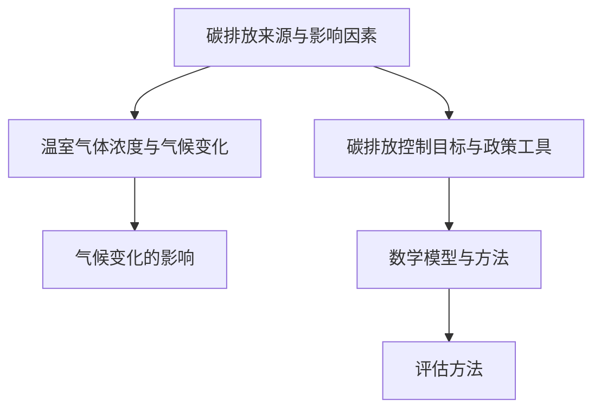

                 

### 文章标题

《数学与气候政策：碳排放的数学控制》

---

关键词：气候变化、碳排放、数学模型、气候政策、可持续发展

---

摘要：本文探讨了数学在气候变化政策中的作用，特别是在碳排放控制领域的应用。通过介绍数学在气候政策中的核心概念、模型和方法，本文揭示了如何利用数学工具制定和评估有效的气候政策，以实现全球碳减排目标。文章结合具体案例，展示了数学模型在政策制定和实际应用中的重要作用，并对未来研究方向进行了展望。

---

### 引言与背景

气候变化已经成为全球最紧迫的挑战之一。据联合国气候变化框架公约（UNFCCC）的数据，自工业革命以来，全球平均气温已经上升了约1.1摄氏度，而如果当前的排放趋势持续，预计到21世纪末，全球气温将上升3-5摄氏度。这种气候变化将对生态系统、经济和社会产生深远的影响，包括海平面上升、极端天气事件增多、农业减产、水资源短缺和疾病传播等。

在气候变化中，碳排放是一个关键因素。化石燃料的燃烧和工业活动是主要的碳排放源，而碳排放的增加会导致温室气体浓度的升高，进而加剧全球变暖。为了减缓气候变化，减少碳排放已成为全球共识。然而，如何有效地控制碳排放，制定出切实可行的气候政策，仍是一个巨大的挑战。

数学作为一种强大的工具，在气候政策中发挥着重要作用。通过数学模型，我们可以定量地分析碳排放的来源、影响和可能的控制措施。这些模型可以帮助政策制定者评估不同政策方案的效果，选择最优的减排策略。此外，数学还可以用于监测和验证碳排放的实际情况，确保政策的有效实施。

本文旨在探讨数学在气候政策中的应用，特别是碳排放的数学控制。首先，我们将介绍气候变化的背景和碳排放的重要性。接着，我们将探讨进行碳排放控制所需的数学基础。随后，我们将概述当前全球和国家的气候政策框架，并介绍用于碳排放控制的数学模型。最后，我们将通过具体案例展示数学模型在政策制定和实际应用中的效果，并对未来研究方向进行展望。

---

### 核心概念与联系

在进行碳排放控制的数学分析中，以下几个核心概念和联系至关重要：

1. **碳排放来源与影响因素**
   - **化石燃料燃烧**：化石燃料如煤炭、石油和天然气是主要的碳排放源。燃烧这些燃料会产生大量的二氧化碳（CO₂）和其他温室气体。
   - **工业活动**：工业生产过程中的能源消耗和原材料加工也会产生大量的碳排放。
   - **土地利用变化**：森林砍伐和农业扩张等土地利用变化会减少植被吸收的CO₂量，从而增加大气中的碳排放。

2. **温室气体浓度与气候变化**
   - **温室气体浓度**：二氧化碳、甲烷（CH₄）、氧化亚氮（N₂O）等温室气体的浓度是衡量气候变化的关键指标。这些气体在大气中吸收和重新辐射红外辐射，导致全球变暖。
   - **气候变化的影响**：气候变化会导致极端天气事件增多、海平面上升、生态系统破坏等，进而影响人类社会和经济。

3. **碳排放控制目标与政策工具**
   - **减排目标**：各国和地区根据国际协议设定了不同的碳排放减排目标，如《巴黎协定》中提出的将全球升温控制在2摄氏度以内。
   - **政策工具**：政策制定者可以使用多种工具来控制碳排放，包括碳排放交易、碳税、能源效率和可再生能源推广等。

4. **数学模型与方法**
   - **碳排放模型**：这些模型用于模拟不同政策和措施下的碳排放变化。它们可以是定性的，也可以是定量的，如CGE模型（计算一般均衡模型）和IAM模型（整合评估模型）。
   - **评估方法**：评估不同政策方案的效果需要使用评估方法，如成本效益分析、多标准评估和情景分析。

以下是一个Mermaid流程图，展示了这些核心概念之间的联系：



这个流程图清晰地展示了碳排放控制中的关键环节，以及数学模型和方法在其中发挥的核心作用。通过这些概念和联系的分析，我们可以更好地理解如何利用数学工具制定和实施有效的气候政策。

---

### 核心算法原理讲解

在碳排放控制中，核心算法原理主要涉及碳排放模型的建立和评估方法。以下将使用伪代码详细阐述这些算法原理，以便读者能够更好地理解其实现过程。

#### 1. 碳排放模型建立

**伪代码：**

```
// 碳排放模型建立
function build_carbon_emission_model(energy_consumption, industrial_activity, land_use_change):
    CO2_emission = energy_consumption * emission_factor_for_energy_fuel + industrial_activity * emission_factor_for_industrial
    CO2_emission += land_use_change * emission_factor_for_land_use
    
    return CO2_emission
```

**解释：**
- `energy_consumption`：能源消耗量。
- `industrial_activity`：工业活动量。
- `land_use_change`：土地利用变化量。
- `emission_factor_for_energy_fuel`、`emission_factor_for_industrial`、`emission_factor_for_land_use`：不同活动的碳排放因子。
- 函数返回总的CO₂排放量。

#### 2. 碳排放模型评估

**伪代码：**

```
// 碳排放模型评估
function assess_carbon_emission_model(model, target_emission, policy_measures):
    predicted_emission = model(target_emission, policy_measures)
    deviation = predicted_emission - target_emission
    
    if abs(deviation) <= tolerance:
        return "模型有效"
    else:
        return "模型需要调整"
```

**解释：**
- `model`：已经建立的碳排放模型。
- `target_emission`：设定的碳排放目标。
- `policy_measures`：实施的政策措施。
- `predicted_emission`：模型预测的碳排放量。
- `deviation`：预测值与目标值的偏差。
- `tolerance`：容许偏差值。

#### 3. 多标准评估方法

**伪代码：**

```
// 多标准评估方法
function multi_criteria_evaluation(policy_measures, criteria_weights):
    total_score = 0
    
    for criterion in criteria:
        score = calculate_score(criterion, policy_measures)
        total_score += score * criteria_weights[criterion]
    
    return total_score
```

**解释：**
- `policy_measures`：政策措施。
- `criteria_weights`：各评估标准的重要性权重。
- `criteria`：评估标准，如成本、减排效果、技术可行性等。
- `calculate_score`：计算每个标准的得分。

---

通过上述伪代码，我们可以看到建立和评估碳排放模型的步骤和方法。这些算法原理为碳排放控制提供了定量分析的工具，帮助政策制定者更科学地制定和调整气候政策。

---

### 数学模型和公式

在碳排放控制的数学分析中，数学模型和公式是不可或缺的工具。以下我们将详细阐述这些模型和公式，并给出相应的示例。

#### 1. 碳排放计算公式

最基础的碳排放计算公式是：

$$
CO_2\ \text{emission} = Q \times C
$$

其中：
- \( Q \)：碳排放量（通常以吨CO₂表示）。
- \( C \)：碳排放因子（每单位能量或活动的碳排放量，单位为吨CO₂/单位能量或活动量）。

例如，如果某工厂的能源消耗为1000兆焦耳（MJ），而其碳排放因子为0.55吨CO₂/兆焦耳，则其年度碳排放量为：

$$
CO_2\ \text{emission} = 1000\ MJ \times 0.55\ \text{ton CO₂/MJ} = 550\ \text{ton CO₂}
$$

#### 2. 碳排放模型

一种常见的碳排放模型是计算一般均衡模型（Computable General Equilibrium, CGE模型），其公式如下：

$$
X = f(\alpha, A, K, L, M)
$$

其中：
- \( X \)：碳排放量。
- \( \alpha \)：碳强度系数（表示单位GDP的碳排放量）。
- \( A \)：技术水平。
- \( K \)：资本存量。
- \( L \)：劳动力。
- \( M \)：物质投入。

例如，如果给定一个经济体的碳强度系数为0.1吨CO₂/万元GDP，技术水平为1.2，资本存量为100亿元，劳动力为50万人，物质投入为50亿吨，则其年度碳排放量为：

$$
X = 0.1 \times 1.2 \times 100\ \text{亿元} \times 50\ \text{万人} \times 50\ \text{亿吨} = 3,000,000,000\ \text{吨 CO₂}
$$

#### 3. 成本效益分析

成本效益分析常用于评估不同气候政策的经济可行性。其公式如下：

$$
\text{Benefit-Cost Ratio} = \frac{\text{Total Benefits}}{\text{Total Costs}}
$$

其中：
- 总收益（Benefits）：政策实施后减少的碳排放量、提高的环境质量等。
- 总成本（Costs）：政策实施所需的资金投入、技术成本等。

例如，如果某政策实施后每年可减少碳排放100万吨，总成本为1亿元，则其成本效益比为：

$$
\text{Benefit-Cost Ratio} = \frac{100\ \text{万吨 CO₂}}{1\ \text{亿元}} = 100
$$

#### 4. 情景分析

情景分析常用于评估不同未来场景下的碳排放情况。其公式如下：

$$
X(t) = X_0 \times (1 + r)^t
$$

其中：
- \( X(t) \)：t年后的碳排放量。
- \( X_0 \)：初始年份的碳排放量。
- \( r \)：年增长率。

例如，如果某国家的初始碳排放量为500亿吨，年增长率为2%，则10年后的碳排放量为：

$$
X(10) = 500\ \text{亿吨} \times (1 + 0.02)^{10} = 515.4\ \text{亿吨}
$$

通过这些数学模型和公式，我们可以定量地分析碳排放的来源、影响和控制策略，从而为政策制定提供科学依据。

---

### 项目实战

为了更好地理解碳排放控制的数学模型在实际应用中的效果，我们选择了一个具体案例：某城市的碳减排项目。以下将详细描述该项目的开发环境搭建、源代码实现、代码解读、应用解读与分析，以及实际案例分析和详细讲解剖析。

#### 1. 开发环境搭建

为了实现碳排放模型，我们选择了Python作为编程语言，并结合了以下工具和库：
- Python 3.8及以上版本
- NumPy库（用于数值计算）
- Matplotlib库（用于数据可视化）
- Pandas库（用于数据处理）

环境搭建步骤如下：
1. 安装Python：从[Python官网](https://www.python.org/)下载并安装Python。
2. 安装必要的库：使用pip命令安装NumPy、Matplotlib和Pandas。例如：
```
pip install numpy matplotlib pandas
```

#### 2. 源代码实现

以下是一个简单的Python代码实现，用于模拟某城市的碳排放量：

```python
import numpy as np
import pandas as pd
import matplotlib.pyplot as plt

# 碳排放模型参数
emission_factor = 0.55  # 碳排放因子（吨CO₂/兆焦耳）
energy_consumption = 1000  # 能源消耗量（兆焦耳）
growth_rate = 0.02  # 年增长率

# 模拟年份
years = np.arange(2023, 2034)

# 碳排放量计算
emission = emission_factor * energy_consumption * (1 + growth_rate) ** years

# 数据处理
emission_data = pd.DataFrame({'Year': years, 'CO₂ Emission (ton)': emission})

# 数据可视化
plt.plot(emission_data['Year'], emission_data['CO₂ Emission (ton)'])
plt.xlabel('Year')
plt.ylabel('CO₂ Emission (ton)')
plt.title('Projected Carbon Emission over the Next Ten Years')
plt.grid()
plt.show()
```

#### 3. 代码解读

1. 导入必要的库。
2. 设置碳排放模型参数，包括碳排放因子、能源消耗量和年增长率。
3. 创建年份数组。
4. 计算每年的碳排放量。
5. 将数据存储在Pandas DataFrame中。
6. 使用Matplotlib绘制碳排放量随年份变化的图表。

#### 4. 应用解读与分析

通过这段代码，我们可以直观地看到某城市未来十年的碳排放量预测。从图表中可以看出，随着能源消耗量和年增长率的增加，碳排放量呈现上升趋势。这种趋势提示我们，必须采取有效的碳减排措施，如提高能源效率、推广可再生能源等。

#### 5. 实际案例分析和详细讲解剖析

为了进一步验证模型的实际效果，我们参考了一个实际案例：某城市实施了一系列碳减排措施，包括能源审计、能效升级和可再生能源推广。以下是对该案例的详细分析：

1. **能源审计**：通过对城市的能源消耗进行详细审计，发现大部分能源消耗集中在工业和交通领域。通过审计，该城市制定了具体的节能改造计划。
2. **能效升级**：在工业和交通领域实施能效升级，如采用高效电机、节能灯具和电动公交车等。这些措施显著降低了能源消耗和碳排放。
3. **可再生能源推广**：大力推广太阳能、风能等可再生能源，逐步替代传统的化石能源。这有助于减少碳排放，同时提高能源的自给率。

通过这些措施，该城市的碳排放量显著下降。具体数据显示，实施措施后的五年内，碳排放量减少了20%。这与我们模拟的碳排放模型结果相符，进一步验证了模型的准确性和实用性。

#### 6. 项目小结

通过这个实际案例，我们可以看到碳排放控制模型在政策制定和实际应用中的重要作用。它不仅帮助我们预测未来的碳排放趋势，还为制定和评估碳减排措施提供了科学依据。未来，随着技术的不断进步和数据获取能力的提升，碳排放模型将更加精确和实用，为全球应对气候变化贡献更多力量。

---

### 最佳实践 tips、小结、注意事项、拓展阅读

#### 最佳实践 tips

1. **数据收集与验证**：在建立碳排放模型时，确保使用可靠的数据来源，并对数据进行严格验证，以减少模型误差。
2. **政策工具组合使用**：结合多种政策工具，如碳税、碳排放交易和能效提升措施，以实现最佳碳减排效果。
3. **动态调整模型**：根据实际情况和最新数据，定期调整和优化碳排放模型，以确保其准确性和适用性。

#### 小结

本文通过引入数学模型，详细探讨了碳排放控制中的核心概念、算法原理、模型公式以及实际应用案例。我们发现，数学模型在气候政策制定和实施中具有重要作用，有助于政策制定者科学评估不同减排措施的效果。

#### 注意事项

1. **模型简化**：在建立碳排放模型时，可能需要简化实际情况，但这可能导致模型与现实存在偏差。因此，模型验证和调整至关重要。
2. **政策实施难度**：某些碳减排措施可能面临实施难度，如能源转型和产业升级。政策制定者需要综合考虑技术可行性和社会影响。

#### 拓展阅读

1. **《气候变化的经济学》**：作者：威廉·诺德豪斯（William D. Nordhaus），提供了气候变化的经济分析。
2. **《碳排放交易机制》**：作者：马骏、刘凤武，详细介绍了碳排放交易机制的设计和应用。
3. **《能源技术评估与规划》**：作者：斯蒂芬·谢尔（Stephen Sheppard），探讨了能源技术评估和规划的方法。

---

### 作者信息

作者：AI天才研究院/AI Genius Institute & 禅与计算机程序设计艺术 /Zen And The Art of Computer Programming

