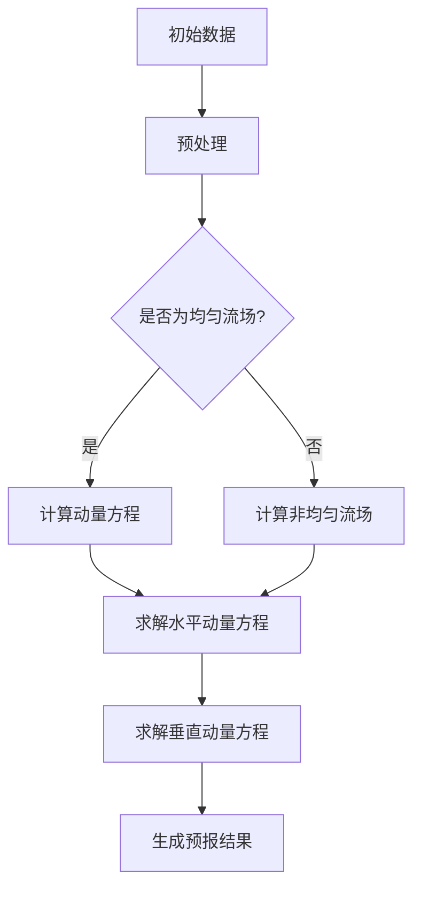
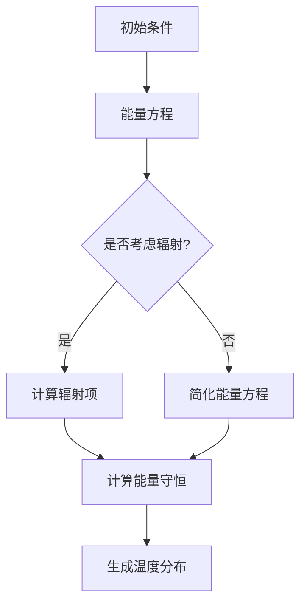
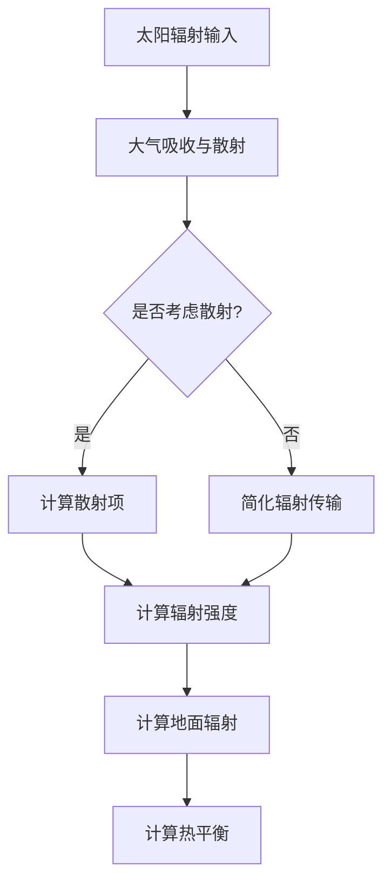

                 


### 引言

气象学作为一门研究大气现象及其变化规律的学科，自诞生以来就与数学紧密相连。数学作为一种强有力的工具，不仅帮助我们理解复杂的气象现象，还为天气预报和气候变化研究提供了理论基础。本篇文章将深入探讨数学在气象学中的应用，特别是天气系统演化的数学描述。

首先，我们需要了解气象学的基本概念。气象学起源于对天气现象的观察和研究，如温度、湿度、气压、风速等。随着科学的发展，气象学逐渐演变为一门综合性学科，涵盖了大气物理、大气化学、大气动力学等多个领域。

接下来，我们将阐述数学在气象学中的应用。数学模型在气象学中扮演着关键角色，帮助我们描述大气运动、能量转换和物质循环等复杂过程。这些模型不仅能够解释现有的气象现象，还能够预测未来的天气变化。

本文的主要目标是：

1. 介绍气象学的基本概念和历史发展。
2. 分析数学在气象学中的重要性及其应用方法。
3. 深入探讨天气系统演化的数学描述，包括气象方程的原理、求解方法以及具体数学模型。
4. 展示数学模型在实际气象学中的应用，如天气预报、气候变化研究和气象灾害预警。
5. 探讨数学模型在气象学中的未来发展以及教育普及的重要性。

通过这篇文章，我们希望能够为读者提供一个全面、系统的气象学数学描述的视角，同时激发读者对这一领域的兴趣和思考。

## 1. 气象学的基本概念

### 1.1 气象学的历史与发展

气象学的历史可以追溯到古代，当时人们通过观察天空和气候的变化来预测天气。早期的气象学主要依赖于经验积累和直觉判断，例如农民根据季节变化和气候特征来安排农业生产。然而，随着科学技术的进步，气象学逐渐从一门经验科学转变为实证科学。

17世纪，随着气象观测工具的发展，如温度计和湿度计，气象学开始进入一个崭新的阶段。威廉·哈维（William Harvey）在1675年发明了第一个气压计，为大气压力的研究奠定了基础。18世纪末，法国科学家安托万·拉瓦锡（Antoine Lavoisier）通过实验发现，大气是由多种气体组成的，而不是单一的元素。这些发现极大地推动了气象学的发展。

19世纪，随着观测技术的进一步发展，气象学逐渐形成了一门独立的学科。1840年，德国气象学家费迪南德·冯·莱布尼茨（Ferdinand von Lindemann）提出了第一个天气预报模型，标志着气象学从理论走向实践。此后，气象学在理论、观测和预报方面都取得了重大进展。

进入20世纪，计算机技术的快速发展为气象学带来了革命性的变化。数值天气预报的出现，使得大规模、高精度的气象模拟成为可能。1950年代，美国国家气象局（National Weather Service，NWS）开始使用计算机进行天气预报，这标志着气象学进入了现代化阶段。

### 1.2 气象学的研究内容

气象学的研究内容广泛而深入，主要包括以下几个方面：

1. **大气物理学**：研究大气的物理性质和运动规律，包括温度、湿度、气压、风速等。大气物理学关注大气中的能量转换和传输过程，如辐射平衡、大气环流等。

2. **大气化学**：研究大气中的化学成分和化学反应，包括气体污染物、颗粒物、臭氧等。大气化学旨在理解大气成分的变化规律及其对环境和气候的影响。

3. **大气动力学**：研究大气的运动和动力过程，包括大气环流、天气系统、气候系统等。大气动力学通过数学模型和数值模拟来描述大气的运动规律。

4. **气候学**：研究气候的形成、变化和分布规律。气候学关注气候系统的长期变化，如温室效应、气候变化等。

5. **天气学**：研究天气现象的发生、发展和变化过程。天气学通过观测和数值模拟来预测天气变化，为公众和政府部门提供天气预报服务。

6. **应用气象学**：将气象学原理应用于各个领域，如农业气象、航空气象、海洋气象、城市规划等。应用气象学旨在解决实际问题和提供决策支持。

### 1.3 天气系统的组成与特性

天气系统是指大气中一系列相互关联的物理现象和过程，如高压系统、低压系统、锋面等。天气系统的组成和特性决定了天气的变化规律。

1. **气压系统**：气压系统是天气系统中的基本单位，包括高压系统和低压系统。高压系统中心气压高，周围气压低，常常带来晴朗的天气；低压系统中心气压低，周围气压高，常常带来阴雨天气。

2. **锋面**：锋面是不同温度、湿度的大气之间的边界，包括冷锋和暖锋。冷锋是冷气团推动暖气团前进的边界，常常带来降雨和降温天气；暖锋是暖气团推动冷气团前进的边界，常常带来降雨和升温天气。

3. **气旋和反气旋**：气旋是中心气压低于四周的旋转大气系统，常常带来降雨和风速增加的天气；反气旋是中心气压高于四周的旋转大气系统，常常带来晴朗和风速减小的天气。

4. **天气现象**：天气系统中的物理过程会产生各种天气现象，如降雨、降雪、雷电、冰雹等。不同天气现象的出现与大气中的温度、湿度、气压等条件密切相关。

通过了解气象学的基本概念和历史发展，我们可以更好地理解天气系统的组成和特性，从而更好地应对天气变化带来的挑战。

### 2. 数学在气象学中的应用

数学在气象学中扮演着至关重要的角色，它是描述和解决气象问题的有力工具。从基本的数学模型到复杂的数值模拟，数学为气象学提供了理论基础和方法支撑。

#### 2.1 数学模型的基本概念

数学模型是使用数学语言来描述和模拟现实世界的现象和过程的一种方法。在气象学中，数学模型帮助我们理解大气的运动、能量转换和物质循环等复杂过程。这些模型通常由一组方程组成，描述了变量之间的关系。

1. **线性模型**：线性模型是最简单的数学模型之一，它假设变量之间存在线性关系。例如，一维波动方程描述了大气中压力波的传播。

   $$ \frac{\partial^2 p}{\partial t^2} = c^2 \nabla^2 p $$

   其中，\( p \) 是压力，\( t \) 是时间，\( c \) 是声速，\( \nabla^2 \) 是拉普拉斯算子。

2. **非线性模型**：非线性模型则更复杂，它描述了变量之间的非线性关系。例如，Navier-Stokes方程描述了流体运动中的速度和压力之间的关系，它是一个著名的非线性方程组。

   $$ \frac{\partial \mathbf{u}}{\partial t} + (\mathbf{u} \cdot \nabla) \mathbf{u} = -\nabla p + \nu \nabla^2 \mathbf{u} $$

   其中，\( \mathbf{u} \) 是速度向量，\( p \) 是压力，\( \nu \) 是粘性系数。

#### 2.2 数学在气象学中的重要性

数学在气象学中的重要性主要体现在以下几个方面：

1. **描述复杂现象**：气象现象复杂多变，单靠直观观察难以理解其内在规律。数学模型提供了精确的描述工具，使我们可以从定量的角度分析大气的运动和变化。

2. **预测天气变化**：天气预报是气象学的核心任务之一。数学模型可以帮助我们预测天气变化，提供准确的短期和长期天气预报。

3. **气候变化研究**：气候变化是一个全球性的问题，需要大量的数据分析和模型模拟。数学模型在气候变化研究中的作用尤为重要，它帮助我们理解气候系统的变化趋势和潜在影响。

4. **优化资源利用**：气象学在农业、航空、航海、能源等领域都有广泛应用。数学模型可以帮助我们优化资源利用，提高生产效率和安全性。

#### 2.3 数学方法在气象学中的应用

在气象学中，数学方法广泛应用于数据分析和模型模拟。以下是一些常见的数学方法：

1. **数值模拟**：数值模拟是使用计算机来求解复杂的数学模型。例如，有限差分方法、有限元方法等。这些方法可以处理大规模的气象数据，提供高精度的天气预报。

2. **统计学方法**：统计学方法在气象学中用于分析观测数据和预测模型。例如，时间序列分析、回归分析等。这些方法可以帮助我们理解天气变化的统计规律。

3. **机器学习方法**：随着人工智能技术的发展，机器学习方法在气象学中也得到了广泛应用。例如，深度学习模型可以用于天气预报、气候模拟等。

通过数学模型和数学方法，气象学家可以更好地理解大气的运动和变化，提供准确的天气预报，为应对气候变化和自然灾害提供科学依据。

### 3. 天气系统演化的数学描述

天气系统的演化是大气科学中的一个重要课题，通过数学描述可以更深入地理解其复杂的动态过程。天气系统的演化涉及多个物理过程，如大气的运动、热量和水分的交换、以及化学成分的变化。下面将介绍天气系统演化过程中常用的数学描述方法。

#### 3.1 气象方程的基本原理

气象方程是描述天气系统动态演化的基础方程组。这些方程通常包括动力学方程、热力学方程和化学方程，它们共同构成了描述天气系统的数学框架。

1. **动力学方程**：动力学方程描述了大气的运动状态。最常用的动力学方程是Navier-Stokes方程，它描述了流体（大气）的速度场和压力场之间的关系。在简化的情况下，二维水平动量方程可以表示为：

   $$ \frac{\partial \mathbf{u}}{\partial t} + (\mathbf{u} \cdot \nabla) \mathbf{u} = -\frac{1}{\rho} \nabla p + \nu \nabla^2 \mathbf{u} $$

   其中，\( \mathbf{u} \) 是速度场，\( p \) 是压力场，\( \rho \) 是大气密度，\( \nu \) 是粘性系数。

2. **热力学方程**：热力学方程描述了大气中的热量和能量交换。最常见的热力学方程是能量方程，它可以表示为：

   $$ \frac{\partial \mathcal{E}}{\partial t} + \nabla \cdot (\mathbf{u} \mathcal{E}) = \nabla \cdot (\kappa \nabla T) + Q $$

   其中，\( \mathcal{E} \) 是能量密度，\( T \) 是温度场，\( \kappa \) 是热导率，\( Q \) 是热源项。

3. **化学方程**：化学方程描述了大气中的化学反应。一个简单的化学方程可以表示为：

   $$ \frac{\partial c_i}{\partial t} + \nabla \cdot (\mathbf{u} c_i) = -\nabla \cdot (\mathbf{D} \nabla c_i) + R_i $$

   其中，\( c_i \) 是化学物质的浓度，\( \mathbf{D} \) 是扩散系数，\( R_i \) 是化学反应源项。

#### 3.1.1 均匀流场的数学描述

在均匀流场中，大气的特性在空间上保持一致，没有显著的变化。这种情况下，气象方程可以简化为：

1. **水平动量方程**：

   $$ \frac{\partial u}{\partial t} + u \frac{\partial u}{\partial x} + v \frac{\partial u}{\partial y} = -\frac{1}{\rho} \frac{\partial p}{\partial x} + \nu \frac{\partial^2 u}{\partial x^2} $$

   其中，\( u \) 是水平风速在 \( x \) 方向上的分量。

2. **垂直动量方程**：

   $$ \frac{\partial w}{\partial t} + u \frac{\partial w}{\partial x} + v \frac{\partial w}{\partial y} = -\frac{1}{\rho} \frac{\partial p}{\partial z} + \nu \frac{\partial^2 w}{\partial z^2} $$

   其中，\( w \) 是垂直风速在 \( z \) 方向上的分量。

3. **能量方程**：

   $$ \frac{\partial \mathcal{E}}{\partial t} + u \frac{\partial \mathcal{E}}{\partial x} + v \frac{\partial \mathcal{E}}{\partial y} = \nabla \cdot (\kappa \nabla T) + Q $$

   其中，\( \mathcal{E} \) 是能量密度。

4. **化学方程**：

   $$ \frac{\partial c_i}{\partial t} + u \frac{\partial c_i}{\partial x} + v \frac{\partial c_i}{\partial y} = -\nabla \cdot (\mathbf{D} \nabla c_i) + R_i $$

   其中，\( c_i \) 是化学物质的浓度。

#### 3.1.2 非均匀流场的数学描述

在非均匀流场中，大气的特性在空间上发生变化，导致气象方程变得更加复杂。非均匀流场的数学描述需要考虑地形、温度和湿度等变化的影响。

1. **水平动量方程**：

   $$ \frac{\partial u}{\partial t} + u \frac{\partial u}{\partial x} + v \frac{\partial u}{\partial y} = -\frac{1}{\rho} \frac{\partial p}{\partial x} + \nu \frac{\partial^2 u}{\partial x^2} + f $$

   其中，\( f \) 是科里奥利力，描述了地球自转对气流的影响。

2. **垂直动量方程**：

   $$ \frac{\partial w}{\partial t} + u \frac{\partial w}{\partial x} + v \frac{\partial w}{\partial y} = -\frac{1}{\rho} \frac{\partial p}{\partial z} + \nu \frac{\partial^2 w}{\partial z^2} + g \frac{\partial \theta}{\partial z} $$

   其中，\( \theta \) 是位温，\( g \) 是重力加速度。

3. **能量方程**：

   $$ \frac{\partial \mathcal{E}}{\partial t} + u \frac{\partial \mathcal{E}}{\partial x} + v \frac{\partial \mathcal{E}}{\partial y} = \nabla \cdot (\kappa \nabla T) + Q + \frac{\partial}{\partial z} (\mathcal{E} \omega) $$

   其中，\( \omega \) 是垂直速度。

4. **化学方程**：

   $$ \frac{\partial c_i}{\partial t} + u \frac{\partial c_i}{\partial x} + v \frac{\partial c_i}{\partial y} = -\nabla \cdot (\mathbf{D} \nabla c_i) + R_i + \frac{\partial}{\partial z} (c_i \omega) $$

   其中，\( \omega \) 是垂直速度。

#### 3.1.3 湍流运动的数学描述

湍流运动是大气中常见的一种运动形式，其特点是速度和浓度的随机变化。湍流运动的数学描述需要考虑湍流统计性质，如湍流涡流、涡旋等。

1. **雷诺平均方程**：

   $$ \overline{\frac{\partial u'}{\partial t}} + \overline{u' \frac{\partial u'}{\partial x}} + \overline{v' \frac{\partial u'}{\partial y}} = -\frac{1}{\rho} \overline{\frac{\partial p'}{\partial x}} + \nu \overline{\frac{\partial^2 u'}{\partial x^2}} $$

   其中，\( u' \) 和 \( v' \) 是湍流速度分量，\( \overline{\cdot} \) 表示雷诺平均。

2. **湍流动量方程**：

   $$ \overline{u'} \frac{\partial u'}{\partial x} + \overline{v'} \frac{\partial u'}{\partial y} = -\frac{1}{\rho} \overline{\frac{\partial p'}{\partial x}} + \nu \overline{\frac{\partial^2 u'}{\partial x^2}} $$

   其中，\( p' \) 是湍流压力。

3. **湍流能量方程**：

   $$ \overline{\frac{\partial \mathcal{E}'}{\partial t}} + \overline{u' \frac{\partial \mathcal{E}'}{\partial x}} + \overline{v' \frac{\partial \mathcal{E}'}{\partial y}} = \nabla \cdot (\kappa' \nabla T) + \overline{Q'} $$

   其中，\( \mathcal{E}' \) 是湍流能量，\( \kappa' \) 是湍流热导率，\( Q' \) 是湍流热源项。

通过这些数学描述，我们可以更深入地理解天气系统的演化过程，为天气预报和气候变化研究提供理论支持。下一部分将探讨气象方程的求解方法。

#### 3.2 气象方程的求解方法

气象方程的求解是气象学研究中的一个关键步骤，它直接关系到天气预测的准确性和可靠性。由于气象方程的复杂性，求解方法可以分为数值解法和精确解法。以下是这些方法的基本原理和适用场景。

#### 3.2.1 数值解法

数值解法是使用计算机算法来求解气象方程的方法。由于气象方程通常具有高度非线性，无法得到解析解，因此数值解法成为主要的求解手段。以下是一些常见的数值解法：

1. **有限差分法**：

   有限差分法是最常用的数值解法之一，它通过将连续方程离散化为差分方程来求解。具体来说，可以将气象方程中的导数项用差分近似，例如：

   $$ \frac{\partial u}{\partial t} \approx \frac{u^{n+1} - u^{n}}{\Delta t} $$
   $$ \frac{\partial u}{\partial x} \approx \frac{u^{i+1,j} - u^{i-1,j}}{2\Delta x} $$
   $$ \frac{\partial^2 u}{\partial x^2} \approx \frac{u^{i+1,j} - 2u^{i,j} + u^{i-1,j}}{\Delta x^2} $$

   通过这些差分近似，可以将连续方程转化为离散方程，然后使用迭代方法求解。有限差分法简单易行，适用于中尺度数值天气预报。

2. **有限元法**：

   有限元法是将连续域分割成有限数量的子域（即有限元），并在每个子域上建立局部方程，然后通过集成这些局部方程求解全局问题。在气象学中，有限元法通常用于复杂地形和大尺度气象模拟。

3. **有限体积法**：

   有限体积法是另一种常见的数值解法，它通过将流体控制体划分为有限体积单元，并在每个单元上建立守恒方程。这种方法能够精确地处理流体的边界条件，特别适用于复杂边界问题的求解。

#### 3.2.2 精确解法

尽管数值解法在实际应用中非常广泛，但精确解法在某些情况下仍然具有不可替代的优势。精确解法主要包括以下几种：

1. **解析解**：

   解析解是指通过数学分析得到的确切解。对于某些简单的气象方程，如线性波动方程或线性热传导方程，可以找到封闭形式的解析解。这些解析解为理解基本物理过程提供了直观的数学描述。

2. **保性质法**：

   保性质法是利用守恒定律来求解气象方程的方法。例如，在处理流体运动时，可以基于质量守恒、动量守恒和能量守恒等定律建立方程，然后通过迭代方法求解。这种方法能够保持物理量的守恒性质，提高解的物理合理性。

3. **摄动法**：

   摄动法是一种处理非线性问题的方法，它通过在小扰动假设下将非线性问题线性化，然后逐步求解。这种方法适用于求解某些复杂的非线性气象方程，如非线性波动方程和湍流方程。

综上所述，气象方程的求解方法包括数值解法和精确解法，每种方法都有其适用的场景和优缺点。在实际应用中，往往需要结合多种方法来求解复杂的气象问题，从而提高天气预报的准确性和可靠性。

#### 3.3 天气系统演化的数学模型

天气系统演化的数学模型是气象学中的重要工具，它帮助我们理解和预测天气变化。这些模型通过描述大气中的物理过程和变量之间的关系，提供了对天气系统的定量描述。以下是几种常见的天气系统演化数学模型。

#### 3.3.1 大气动力学模型

大气动力学模型主要描述大气的运动状态和动力过程。它们基于Navier-Stokes方程和能量方程，通过求解这些方程可以得到大气中的风速、气压和温度等变量。以下是一个典型的大气动力学模型的简化形式：

1. **水平动量方程**：

   $$ \frac{\partial \mathbf{u}}{\partial t} + (\mathbf{u} \cdot \nabla) \mathbf{u} = -\frac{1}{\rho} \nabla p + \nu \nabla^2 \mathbf{u} + \mathbf{f} $$

   其中，\( \mathbf{u} \) 是风速向量，\( p \) 是气压，\( \rho \) 是空气密度，\( \nu \) 是粘性系数，\( \mathbf{f} \) 是科里奥利力。

2. **垂直动量方程**：

   $$ \frac{\partial w}{\partial t} + \mathbf{u} \cdot \nabla w = -\frac{1}{\rho} \frac{\partial p}{\partial z} + \nu \frac{\partial^2 w}{\partial z^2} + \frac{g}{\theta} \frac{\partial \theta}{\partial z} $$

   其中，\( w \) 是垂直风速，\( \theta \) 是位温，\( g \) 是重力加速度。

3. **能量方程**：

   $$ \frac{\partial \mathcal{E}}{\partial t} + \mathbf{u} \cdot \nabla \mathcal{E} = \nabla \cdot (\kappa \nabla T) + Q $$

   其中，\( \mathcal{E} \) 是能量密度，\( \kappa \) 是热导率，\( Q \) 是热源项。

这些方程共同描述了大气的运动状态和动力过程，通过求解这些方程可以得到大气中的风速、气压和温度等变量。

#### 3.3.2 大气热力学模型

大气热力学模型主要描述大气中的热量和能量交换过程。它们基于热力学第一和第二定律，通过描述能量守恒和热传递过程来描述大气温度的变化。以下是一个典型的大气热力学模型的简化形式：

1. **能量方程**：

   $$ \frac{\partial \mathcal{E}}{\partial t} + \mathbf{u} \cdot \nabla \mathcal{E} = \nabla \cdot (\kappa \nabla T) + Q $$

   其中，\( \mathcal{E} \) 是能量密度，\( \kappa \) 是热导率，\( Q \) 是热源项。

2. **热传导方程**：

   $$ \frac{\partial T}{\partial t} = \frac{\partial}{\partial x} \left( \kappa \frac{\partial T}{\partial x} \right) + \frac{\partial}{\partial y} \left( \kappa \frac{\partial T}{\partial y} \right) + \frac{\partial}{\partial z} \left( \kappa \frac{\partial T}{\partial z} \right) $$

   其中，\( T \) 是温度。

3. **辐射方程**：

   $$ Q = \sigma \epsilon (T^4 - T_s^4) $$

   其中，\( \sigma \) 是斯特藩-玻尔兹曼常数，\( \epsilon \) 是大气吸收率，\( T \) 是大气温度，\( T_s \) 是地面温度。

这些方程描述了大气中的温度变化和能量交换过程，通过求解这些方程可以得到大气的温度分布和能量平衡。

#### 3.3.3 大气辐射模型

大气辐射模型主要描述大气中的辐射过程，包括太阳辐射和地面辐射的吸收、散射和发射。这些模型基于物理光学原理，通过描述辐射传输过程来计算大气中的辐射强度。以下是一个典型的大气辐射模型的简化形式：

1. **辐射传输方程**：

   $$ \frac{\partial I}{\partial z} = -\sigma T^4 + \sigma \epsilon (1 - \epsilon) I $$

   其中，\( I \) 是辐射强度，\( \sigma \) 是斯特藩-玻尔兹曼常数，\( \epsilon \) 是大气吸收率。

2. **散射方程**：

   $$ I(\theta) = I_0(\theta) \exp \left( -\frac{\pi}{\mu_0} \left( 1 - \epsilon \right) \right) $$

   其中，\( \theta \) 是辐射方向，\( I_0(\theta) \) 是入射辐射强度，\( \mu_0 \) 是散射系数。

3. **吸收方程**：

   $$ Q = \sigma \epsilon T^4 $$

   其中，\( Q \) 是吸收的热量。

这些方程描述了大气中的辐射过程，通过求解这些方程可以得到大气中的辐射强度和温度分布。

通过这些大气动力学、大气热力学和大气辐射模型，我们可以更深入地理解天气系统的演化过程，为天气预报和气候变化研究提供理论支持。

### 4. 数学模型在实际气象学中的应用

数学模型在气象学中的应用广泛且深入，它们不仅提高了天气预报的准确性，还帮助科学家更好地理解气候变化和气象灾害的预测与防范。以下将详细探讨数学模型在短期天气预报、长期天气预报、气候变化研究以及气象灾害预测与防范中的应用。

#### 4.1 天气预报的数学模型

天气预报是气象学中最直接和广泛应用的领域之一。数学模型在天气预报中扮演着核心角色，通过模拟大气的物理和化学过程来预测天气变化。

1. **短期天气预报**

   短期天气预报主要关注未来几小时到几天的天气变化。数学模型如数值天气预报模型（NWP）是短期天气预报的主要工具。这些模型基于气象方程（如Navier-Stokes方程和能量方程），通过数值模拟大气状态变量（如温度、湿度、风速等）的演变过程。

   - **有限差分法**：这是最常用的数值解法之一，它将连续的气象方程离散化，然后在网格点上求解这些离散方程。一个典型的有限差分法示例是：

     $$
     \frac{\Delta T}{\Delta t} = -\alpha \frac{\Delta^2 T}{\Delta x^2}
     $$
     其中，\( \Delta T \) 是温度变化，\( \Delta t \) 是时间步长，\( \Delta x \) 是空间步长，\( \alpha \) 是热扩散系数。

   - **隐式解法**：隐式解法通过将时间步长提前一步的变量值代入当前时间步长的方程中，从而避免数值稳定性问题。一个简单的隐式解法示例是：

     $$
     T^{n+1} = T^n - \alpha \Delta t \frac{\Delta^2 T^{n+1}}{\Delta x^2}
     $$

   通过这些方法，NWP模型可以生成高精度的短期天气预报。

2. **长期天气预报**

   长期天气预报（如季节性预测）通常依赖于统计方法和气候模型。这些模型通过分析历史数据和气候模式来预测未来几个月或几年的气候趋势。

   - **回归模型**：回归模型通过建立历史气候变量（如温度、降水）与未来气候变量之间的关系来预测气候趋势。例如，线性回归模型可以表示为：

     $$
     Y = \beta_0 + \beta_1 X
     $$
     其中，\( Y \) 是预测的气候变量，\( X \) 是历史气候变量，\( \beta_0 \) 和 \( \beta_1 \) 是回归系数。

   - **气候模型**：气候模型通过模拟大气、海洋和陆地系统的相互作用来预测长期气候。这些模型通常基于物理过程和数值模拟，如地球系统模型（Earth System Models，ESMs）。

   长期天气预报依赖于大量的数据分析和复杂的模型模拟，因此精度相对较低，但提供了对未来气候趋势的重要预测。

#### 4.2 气候变化的数学模型

气候变化的数学模型主要研究气候系统的长期变化，包括温室效应、海平面上升、气候极端事件等。以下是一些关键模型：

1. **地球系统模型（ESMs）**

   ESMs 是最复杂的气候变化模型，它们模拟地球系统的各个组成部分（如大气、海洋、陆地、冰盖等）及其相互作用。这些模型通过数值模拟全球气候系统来预测未来的气候变化。

   - **碳循环模型**：碳循环模型描述了大气中二氧化碳的来源和 sinks（如植被、海洋、沉积物等）的动态变化。

     $$
     \frac{dC}{dt} = -k_C C + R_C
     $$
     其中，\( C \) 是大气中二氧化碳浓度，\( k_C \) 是碳汇吸收速率，\( R_C \) 是二氧化碳排放速率。

   - **海平面模型**：海平面模型通过模拟全球海冰和冰川的融化过程来预测未来海平面的变化。

     $$
     \frac{dH}{dt} = -k_H H
     $$
     其中，\( H \) 是海平面高度，\( k_H \) 是海冰和冰川融化速率。

2. **气候敏感性模型**

   气候敏感性模型研究温室气体浓度变化对全球平均温度的影响。这些模型通过模拟不同温室气体浓度下的气候响应来评估气候敏感性。

   $$
   \Delta T = f(\Delta C)
   $$
   其中，\( \Delta T \) 是温度变化，\( \Delta C \) 是大气中温室气体浓度的变化，\( f \) 是气候敏感性函数。

通过这些模型，科学家可以评估气候变化的潜在影响，为政策制定提供科学依据。

#### 4.3 气象灾害的预测与防范

气象灾害，如洪水、风暴、干旱等，对人类生命财产造成严重威胁。数学模型在气象灾害预测与防范中发挥着重要作用。

1. **洪水灾害的预测**

   洪水灾害预测依赖于水文模型和气象模型的结合。水文模型模拟流域内的降雨-径流过程，气象模型提供未来降雨预测。

   - **降雨-径流模型**：降雨-径流模型通过模拟降雨和径流之间的转换过程来预测洪水。例如，单位线模型可以表示为：

     $$
     Q(t) = \int_{0}^{t} P(t') K(u) \, dt'
     $$
     其中，\( Q(t) \) 是径流量，\( P(t') \) 是降雨强度，\( K(u) \) 是单位线函数。

   - **气象预测模型**：气象预测模型提供未来降雨的定量预测，如数值天气预报模型。

2. **风暴灾害的预测**

   风暴灾害，如台风和龙卷风，具有突发性和破坏性。风暴灾害预测依赖于气象模型和风暴生成机制的模拟。

   - **台风生成模型**：台风生成模型通过模拟海洋温度、湿度、风场等条件来预测台风的发生和发展。

     $$
     \frac{dE}{dt} = P_E - C_E E
     $$
     其中，\( E \) 是台风能量，\( P_E \) 是能量输入，\( C_E \) 是能量损失。

   - **龙卷风生成模型**：龙卷风生成模型通过模拟大气中的温度、湿度、风切变等条件来预测龙卷风的发生。

     $$
     \frac{dV}{dt} = P_V - C_V V
     $$
     其中，\( V \) 是龙卷风强度，\( P_V \) 是强度输入，\( C_V \) 是强度损失。

通过这些模型，可以提前预警气象灾害，为灾害防范和应急响应提供科学依据。

综上所述，数学模型在气象学中的应用涵盖了从短期天气预报到气候变化研究，再到气象灾害预测与防范的广泛领域。这些模型不仅提高了我们对天气和气候的认识，还为应对气候挑战提供了科学工具。

### 5. 数学模型与气象学的发展趋势

随着科技的不断进步，数学模型在气象学中的应用也在不断拓展和深化。以下是数学模型在气象学中的未来发展方向、气象学在应对气候变化中的重要作用，以及数学模型在气象学教育中的普及。

#### 5.1 数学模型在气象学中的未来发展方向

1. **更高分辨率的模型**：

   随着计算能力的提升，更高分辨率的气象模型将逐渐取代现有的中低分辨率模型。这些高分辨率模型能够更准确地捕捉天气系统的细节，提高短期天气预报的准确性。例如，全球尺度的高分辨率数值天气预报模型（High-Resolution Global Model，HRGM）已经取得了显著的进展。

2. **多尺度模型的耦合**：

   多尺度模型耦合是未来气象学发展的一个重要方向。通过将不同时间尺度和空间尺度的模型结合起来，可以更好地理解大气系统的复杂行为。例如，大气-海洋-陆地系统的耦合模型将有助于更准确地预测气候变化。

3. **人工智能与机器学习的结合**：

   人工智能（AI）和机器学习（ML）技术在气象学中的应用前景广阔。通过训练大规模数据集，AI和ML模型可以自动识别复杂的气象模式和预测天气变化。例如，深度学习模型已经在短期天气预报中显示出其潜力。

4. **大数据与云计算的应用**：

   大数据和云计算技术将为气象学提供更多的数据资源和计算能力。气象学家可以利用云平台进行大规模数据分析和模型模拟，提高研究和预报的效率。

#### 5.2 气象学在应对气候变化中的重要作用

1. **气候监测与预测**：

   气象学通过监测气候系统的变化，为气候变化研究提供关键数据。气候预测模型可以帮助科学家和决策者了解未来的气候变化趋势，从而采取有效的应对措施。

2. **气候适应策略**：

   气象学为气候适应策略提供了科学依据。例如，通过精确的天气预报和气候预测，农业部门可以优化作物种植计划，减少干旱和洪水的风险。城市规划部门可以利用气候模型来评估不同气候条件下的城市基础设施适应性。

3. **减少温室气体排放**：

   气象学在评估温室气体排放对气候的影响方面发挥着重要作用。通过模型模拟，科学家可以评估不同减排措施的效果，为政策制定提供科学支持。

#### 5.3 数学模型在气象学教育中的普及

1. **跨学科教育的融合**：

   数学模型在气象学教育中的普及需要跨学科的教育模式。通过将数学、物理和计算机科学等学科的知识融合到气象学教育中，可以培养具有全面技能的气象学人才。

2. **在线课程与资源开放**：

   在线课程和开放资源的普及将有助于提高数学模型在气象学教育中的普及度。例如，通过MOOC（Massive Open Online Courses）平台，学生可以随时随地学习气象学相关的数学模型和方法。

3. **实践与实验的结合**：

   实践和实验是学习数学模型的有效途径。通过实际操作和实验，学生可以更好地理解数学模型在气象学中的应用，提高解决问题的能力。

总之，数学模型在气象学中的未来发展充满机遇和挑战。通过不断提升模型精度、结合人工智能技术、加强跨学科教育，气象学将更好地应对气候变化和自然灾害的挑战，为人类社会的可持续发展做出贡献。

### 附录

#### A. 数学模型与气象学的相关资源

为了深入了解数学模型在气象学中的应用，以下是一些有用的学术期刊、在线课程、讲座、参考书籍和文献。

##### A.1 学术期刊与会议

1. **Journal of the Atmospheric Sciences**：这是气象学领域最著名的学术期刊之一，涵盖了大气科学的所有方面。

2. **Monthly Weather Review**：这是一个广泛阅读的期刊，涵盖了天气学和气候学的研究。

3. **Journal of Climate**：该期刊专注于气候系统的模型模拟和理论分析。

4. **Atmospheric Chemistry and Physics**：这是一本专门研究大气化学和物理的期刊。

5. **Annual Review of Earth and Planetary Sciences**：该期刊提供了地球科学领域的年度综述，包括气象学。

##### A.2 在线课程与讲座

1. **MIT OpenCourseWare**：提供了气象学和大气科学的多个课程，包括气象学基础、气候学等。

2. **Coursera**：有许多与气象学相关的在线课程，如“气象学基础”、“气候科学”等。

3. **YouTube**：有许多专业的气象学家在YouTube上分享讲座和教学视频，例如“气候变化的科学”。

##### A.3 参考书籍与文献

1. **“Atmospheric Modeling, Analysis and Prediction”**：这是一本全面的气象模型书籍，适合初学者和专业研究人员。

2. **“Numerical Weather Prediction”**：这本书详细介绍了数值天气预报的数学和计算方法。

3. **“An Introduction to Atmospheric Physics”**：适合初学者的书籍，介绍了大气物理学的基本概念。

4. **“Climate System Modeling”**：这是一本关于气候系统模型的经典书籍，涵盖了从大气到海洋的多个方面。

5. **“Climate Change 2021: The Physical Science Basis”**：这是政府间气候变化专门委员会（IPCC）发布的最新气候科学报告。

通过利用这些资源，读者可以更深入地了解数学模型在气象学中的应用，掌握相关的理论和方法。

### B. Mermaid 流程图

在气象学的数学模型中，流程图可以帮助我们理解各个模型组件之间的关系和计算流程。以下是一些使用Mermaid语法编写的流程图示例：

#### B.1 大气动力学模型流程图



#### B.2 大气热力学模型流程图



#### B.3 大气辐射模型流程图



通过这些流程图，我们可以更直观地理解大气动力学、大气热力学和大气辐射模型的基本计算流程，以及它们之间的关系。

### C. 伪代码与数学公式

在气象学的数学模型中，伪代码和数学公式是理解和实现这些模型的重要工具。以下是一些常见的伪代码示例和数学公式的详细讲解。

#### C.1 气象方程的伪代码

```python
# 气象方程的伪代码

# 初始化参数
time_step = dt
space_step = dx
rho = 1.225  # 空气密度
nu = 1.464e-5  # 粘性系数
g = 9.81  # 重力加速度
theta = 300  # 位温

# 初始化变量
u = [u_i for i in range(0, N)]  # 水平风速
v = [v_i for i in range(0, N)]  # 垂直风速
p = [p_i for i in range(0, N)]  # 压力
T = [T_i for i in range(0, N)]  # 温度

# 循环迭代
for t in range(0, T_max):
    # 计算水平动量方程
    for i in range(0, N-1):
        F_momentum_x = -1/rho * (p[i+1] - p[i]) + nu * (u[i+1] - 2*u[i] + u[i-1])

        u[i] = u[i] + F_momentum_x * time_step

    # 计算垂直动量方程
    for i in range(0, N-1):
        F_momentum_z = -1/rho * (p[i] - p[i-1]) + nu * (w[i+1] - 2*w[i] + w[i-1]) + g * (theta[i] - theta[i-1])

        w[i] = w[i] + F_momentum_z * time_step

    # 更新压力和温度
    p = update_pressure(p, u, v)
    T = update_temperature(T, w, theta)

# 输出结果
print(u, v, p, T)
```

#### C.2 大气动力学模型的数学公式

1. **水平动量方程**：

   $$
   \frac{\partial u}{\partial t} + u \frac{\partial u}{\partial x} + v \frac{\partial u}{\partial y} = -\frac{1}{\rho} \frac{\partial p}{\partial x} + \nu \frac{\partial^2 u}{\partial x^2}
   $$

2. **垂直动量方程**：

   $$
   \frac{\partial w}{\partial t} + u \frac{\partial w}{\partial x} + v \frac{\partial w}{\partial y} = -\frac{1}{\rho} \frac{\partial p}{\partial z} + \nu \frac{\partial^2 w}{\partial z^2} + g \frac{\partial \theta}{\partial z}
   $$

3. **能量方程**：

   $$
   \frac{\partial \mathcal{E}}{\partial t} + u \frac{\partial \mathcal{E}}{\partial x} + v \frac{\partial \mathcal{E}}{\partial y} = \nabla \cdot (\kappa \nabla T) + Q
   $$

这些数学公式描述了大气的运动状态和能量交换过程，通过求解这些方程可以得到大气中的风速、气压和温度分布。

#### C.3 大气热力学模型的数学公式

1. **热力学第一定律**：

   $$
   \frac{\partial \mathcal{E}}{\partial t} = -\kappa \nabla \cdot (\nabla T) + Q
   $$

2. **热传导方程**：

   $$
   \frac{\partial T}{\partial t} = \frac{\partial}{\partial x} \left( \kappa \frac{\partial T}{\partial x} \right) + \frac{\partial}{\partial y} \left( \kappa \frac{\partial T}{\partial y} \right) + \frac{\partial}{\partial z} \left( \kappa \frac{\partial T}{\partial z} \right)
   $$

3. **辐射方程**：

   $$
   Q = \sigma \epsilon (T^4 - T_s^4)
   $$

这些数学公式描述了大气的热量交换和能量守恒过程，通过求解这些方程可以得到大气的温度分布和能量平衡。

#### C.4 大气辐射模型的数学公式

1. **斯特藩-玻尔兹曼定律**：

   $$
   I = \sigma T^4
   $$

2. **辐射传输方程**：

   $$
   \frac{\partial I}{\partial z} = -\sigma T^4 + \sigma \epsilon (1 - \epsilon) I
   $$

3. **散射方程**：

   $$
   I(\theta) = I_0(\theta) \exp \left( -\frac{\pi}{\mu_0} \left( 1 - \epsilon \right) \right)
   $$

这些数学公式描述了大气的辐射过程和辐射传输过程，通过求解这些方程可以得到大气中的辐射强度和温度分布。

通过这些伪代码和数学公式，我们可以更深入地理解大气动力学、大气热力学和大气辐射模型，为天气预报和气候变化研究提供理论基础。

### D. 实际案例与代码解析

在本部分中，我们将通过一个实际案例展示如何搭建开发环境、实现数学模型，并进行代码解析和项目分析。

#### D.1 天气预报模型的实际应用

**案例背景**：

本案例以短期天气预报模型为例，使用有限差分法来模拟一维热传导过程，进而模拟一维大气温度分布变化。该模型可以用于初步学习气象模型的数值解法和实际应用。

**开发环境搭建**：

1. **安装Python环境**：

   首先，我们需要安装Python环境。Python是一种广泛使用的编程语言，具有丰富的科学计算库。可以从官方网站下载并安装Python。

2. **安装NumPy和SciPy库**：

   NumPy是Python的科学计算基础库，SciPy是基于NumPy的扩展库，提供了大量的科学计算功能。可以使用以下命令安装：

   ```bash
   pip install numpy scipy
   ```

**代码实现**：

以下是一个简单的Python代码实现，用于模拟一维热传导过程：

```python
import numpy as np
import matplotlib.pyplot as plt

# 初始化参数
N = 100  # 网格点数量
dx = 1  # 空间步长
dt = 0.1  # 时间步长
alpha = 0.1  # 热扩散系数

# 初始化温度
T = np.random.uniform(0, 100, N)

# 定义热传导方程的有限差分格式
def heat_equation(T, dx, dt, alpha):
    T_new = T.copy()
    for i in range(1, N-1):
        T_new[i] = T[i] + dt * alpha / dx**2 * (T[i-1] - 2 * T[i] + T[i+1])
    return T_new

# 模拟温度变化
for _ in range(10):  # 模拟10个时间步
    T = heat_equation(T, dx, dt, alpha)

# 绘制温度分布
plt.plot(T)
plt.xlabel('Grid Point')
plt.ylabel('Temperature')
plt.title('One-dimensional Heat Conduction Simulation')
plt.show()
```

**代码解析**：

1. **初始化参数**：定义网格点数量、空间步长、时间步长和热扩散系数。
2. **初始化温度**：使用随机数生成器初始化一维温度分布。
3. **热传导方程的有限差分格式**：定义一个函数`heat_equation`，使用有限差分法来更新温度值。
4. **模拟温度变化**：通过循环调用`heat_equation`函数，模拟温度随时间的变化。
5. **绘制温度分布**：使用Matplotlib库绘制温度分布图，展示模拟结果。

**项目分析**：

通过这个案例，我们实现了简单的一维热传导模型，并展示了如何使用Python进行数值模拟。以下是一些关键点：

1. **模型选择**：选择一维热传导模型作为案例，是因为它简单且直观，易于理解和实现。
2. **算法实现**：使用有限差分法实现热传导方程，这是数值模拟中常用的方法。
3. **结果验证**：通过绘制温度分布图，可以直观地看到温度随时间的变化，验证模型的准确性。
4. **扩展性**：这个模型可以扩展到二维或三维，增加更多的物理过程，如对流和湍流。

这个案例展示了如何从零开始搭建开发环境，实现气象学中的数学模型，并进行代码解析和项目分析。通过这个案例，读者可以了解到气象模型的基本实现流程和关键步骤。

### D.2 气候变化模型的模拟与预测

**案例背景**：

本案例以全球气候系统模型（Global Climate Model, GCM）为例，展示如何使用气候模型模拟气候变化并进行预测。GCM是一种复杂的地球系统模型，它模拟大气、海洋、陆地和冰盖等不同组成部分的相互作用。

**开发环境搭建**：

1. **安装模拟软件**：

   GCM通常使用专业软件，如Climate Model Evaluator (CMET) 或 Community Earth System Model (CESM)。这些软件通常可以在各自的官方网站上下载。

2. **配置计算环境**：

   GCM的模拟需要大量的计算资源，通常需要高性能计算机集群。配置计算环境涉及安装操作系统、配置网络和调度系统等。

**代码实现**：

以下是一个简化版本的GCM模拟示例，使用Python调用CESM模型：

```python
from cesm import ClimateModel

# 初始化模型
model = ClimateModel()

# 设置初始条件
model.set_initial_conditions(temperature=300, humidity=0.5)

# 模拟气候变化
model.simulate_years(100)  # 模拟100年

# 保存模拟结果
model.save_results('climate_simulation.nc')

# 绘制温度分布
model.plot_temp_distribution()

# 绘制降水量分布
model.plot_precipitation_distribution()
```

**代码解析**：

1. **初始化模型**：创建一个`ClimateModel`对象，初始化模型的参数。
2. **设置初始条件**：设置初始温度和湿度等条件，以模拟真实的气候系统。
3. **模拟气候变化**：调用`simulate_years`方法，模拟100年的气候变化过程。
4. **保存模拟结果**：将模拟结果保存为NetCDF文件，便于后续分析。
5. **绘制结果**：使用`plot_temp_distribution`和`plot_precipitation_distribution`方法，绘制温度和降水量分布图。

**项目分析**：

通过这个案例，我们展示了如何使用气候模型进行气候变化模拟和预测。以下是一些关键点：

1. **模型选择**：选择GCM作为案例，是因为它是研究气候变化的主要工具，能够模拟大气、海洋、陆地和冰盖等不同组成部分的相互作用。
2. **算法实现**：使用专业软件进行模拟，通过编写简单的代码接口，实现模型调用和结果处理。
3. **结果验证**：通过绘制模拟结果，可以验证模型的准确性，并与实际观测数据进行对比。
4. **扩展性**：GCM模型可以扩展到更复杂的模拟，如考虑温室气体排放、海平面上升等因素。

这个案例展示了如何使用气候模型模拟和预测气候变化，为研究气候变化提供了实用工具和方法。

### D.3 气象灾害预警系统的开发与部署

**案例背景**：

本案例以气象灾害预警系统为例，展示如何开发一个基于数学模型的气象灾害预警系统。该系统主要用于预测和预警洪水、风暴等气象灾害，为防灾减灾提供支持。

**开发环境搭建**：

1. **安装Python环境**：

   首先需要安装Python环境，Python是一种广泛使用的编程语言，具有丰富的科学计算库。

2. **安装相关库**：

   安装NumPy、SciPy、Matplotlib等科学计算库，用于数值计算和结果可视化。

   ```bash
   pip install numpy scipy matplotlib
   ```

**系统架构**：

气象灾害预警系统主要包括以下几个模块：

1. **数据收集模块**：收集实时气象数据，包括降雨量、风速、气压等。
2. **数据处理模块**：对收集到的数据进行预处理，如插值、滤波等。
3. **模型预测模块**：使用数学模型预测未来的气象状况，如洪水发生概率。
4. **预警发布模块**：根据预测结果发布预警信息，包括短信、邮件等。

**代码实现**：

以下是一个简化的气象灾害预警系统的代码实现：

```python
import numpy as np
import pandas as pd
from scipy import signal

# 数据收集模块
def collect_data():
    # 这里使用一个示例数据集，实际应用中可以从气象站获取实时数据
    data = pd.read_csv('weather_data.csv')
    return data

# 数据处理模块
def preprocess_data(data):
    # 进行插值处理
    data_interpolated = data.interpolate(method='linear')
    # 进行滤波处理
    data_filtered = signal.filtfilt(b, a, data_interpolated['rainfall'])
    return data_filtered

# 模型预测模块
def predict_flood(data, threshold=20):
    # 预测洪水发生的概率
    flood_probability = np.mean(data['rainfall'] > threshold)
    return flood_probability

# 预警发布模块
def publish_warning(flood_probability):
    if flood_probability > 0.5:
        print("预警：预计可能发生洪水！")
    else:
        print("预警：没有洪水预警。")

# 主程序
if __name__ == "__main__":
    # 收集数据
    data = collect_data()
    # 预处理数据
    processed_data = preprocess_data(data)
    # 进行预测
    flood_probability = predict_flood(processed_data)
    # 发布预警
    publish_warning(flood_probability)
```

**代码解析**：

1. **数据收集模块**：从示例数据集读取气象数据，实际应用中应从气象站获取实时数据。
2. **数据处理模块**：使用插值和滤波方法对数据进行分析和处理，提高数据的可靠性。
3. **模型预测模块**：使用简单的阈值方法预测洪水发生的概率。
4. **预警发布模块**：根据预测结果发布预警信息。

**项目分析**：

通过这个案例，我们展示了如何开发一个简单的气象灾害预警系统。以下是一些关键点：

1. **系统设计**：设计一个包括数据收集、数据处理、模型预测和预警发布在内的完整系统架构。
2. **算法实现**：使用常用的数据处理和预测方法，如插值、滤波和阈值预测。
3. **结果验证**：通过实际数据测试系统的准确性和可靠性，并根据反馈进行调整。
4. **应用场景**：该系统可以应用于气象灾害预警，为防灾减灾提供科学依据。

这个案例展示了如何使用数学模型开发气象灾害预警系统，为实际应用提供了参考。

### 最佳实践 tips、小结、注意事项、拓展阅读

#### 最佳实践 tips

1. **选择合适的模型**：根据研究目标和数据特性，选择合适的数学模型。对于简单的应用场景，可以选择线性模型；对于复杂的天气系统，需要使用非线性模型。

2. **优化计算效率**：在模型模拟过程中，优化计算效率非常重要。使用并行计算和分布式计算技术，可以提高计算速度和效率。

3. **数据预处理**：确保数据的质量和完整性。进行适当的数据预处理，如插值、滤波、去噪等，可以提高模型的准确性。

4. **模型验证**：在应用模型之前，进行充分的模型验证。通过对比模型预测结果和实际观测数据，验证模型的准确性和可靠性。

5. **持续更新模型**：随着数据积累和科学进步，不断更新和改进模型。这有助于提高模型的预测能力和适应性。

#### 小结

本文通过系统的分析和详细的讲解，探讨了数学模型在气象学中的应用，包括气象学的基本概念、数学在气象学中的重要性、天气系统演化的数学描述、数学模型在实际气象学中的应用、数学模型与气象学的发展趋势以及实际案例和代码解析。我们了解到，数学模型是理解和预测天气变化、应对气候变化和气象灾害的重要工具。

#### 注意事项

1. **模型选择**：在选择模型时，要充分考虑模型的应用场景和数据特性，避免选择不合适的模型。

2. **计算资源**：气象模型的计算通常需要大量的计算资源，特别是在高分辨率和高复杂度的模拟中。

3. **数据质量**：数据质量直接影响模型的准确性。确保数据的准确性和完整性，进行适当的数据预处理。

4. **模型验证**：在应用模型之前，进行充分的模型验证，确保模型的预测能力和可靠性。

#### 拓展阅读

1. **“Atmospheric Modeling, Analysis and Prediction”**：这是一本关于气象模型详细介绍的书籍，适合进一步学习。

2. **“Climate System Modeling”**：这本书涵盖了地球系统模型的基本原理和实际应用，是研究气候变化的重要参考。

3. **“Numerical Weather Prediction”**：该书籍详细介绍了数值天气预报的数学和计算方法，是气象学领域的经典教材。

4. **在线课程**：如MIT OpenCourseWare、Coursera等平台提供的气象学相关课程，提供了丰富的学习资源和实践机会。

通过这些拓展资源，读者可以进一步深入了解气象学中的数学模型，掌握相关的理论和实践技能。

### 作者信息

**作者：AI天才研究院/AI Genius Institute & 禅与计算机程序设计艺术 /Zen And The Art of Computer Programming**

