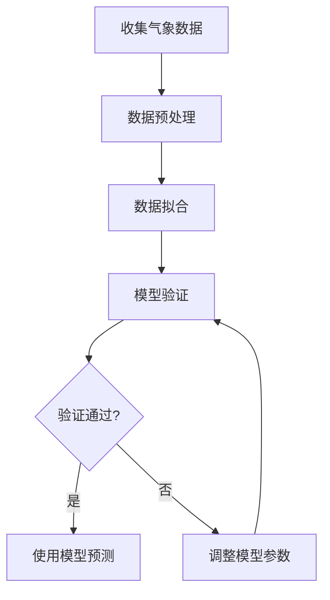

                 

### 文章标题

《数学与气象学：天气预报的数学模型》

### 关键词

数学模型、气象学、天气预报、时间序列分析、动力气象模型、统计气象模型、数据处理、预测算法

### 摘要

本文将深入探讨数学与气象学在天气预报中的应用，重点介绍数学模型在气象预测中的作用和具体实现方法。通过详细的背景介绍、核心概念联系架构、算法原理讲解以及实际案例剖析，读者将了解到数学模型在天气预报中的关键作用，以及如何将这些模型应用于实际项目中。本文旨在为读者提供一套完整、系统的天气预报数学模型构建与实现方法，帮助读者深入理解和掌握这一领域的前沿技术。

## 引言

天气预报是气象学的重要应用之一，它对于人们的生活、农业、交通、军事等领域具有极其重要的作用。然而，天气预报的准确性始终是一个挑战。传统的方法主要依赖于经验判断和数值模拟，虽然在一定程度上能够提供较为准确的预报，但在复杂天气系统面前，仍然存在一定的局限性。随着数学和计算机科学的发展，数学模型在天气预报中的应用逐渐成为研究热点。

数学模型在天气预报中的作用主要体现在以下几个方面：

1. **数据驱动**：数学模型能够处理和分析大量的气象数据，通过数据挖掘和统计分析，提取出有用的信息，从而提高预报的准确性。
2. **物理模拟**：数学模型能够描述天气系统的物理过程，如大气动力学、热力学等，从而实现对天气系统的动态模拟。
3. **预测算法**：数学模型结合机器学习和数据挖掘技术，可以开发出高效、准确的预测算法，从而实现对天气的长期预报。

本文将首先介绍数学与气象学的基本知识，包括数学模型的基本概念、气象学的基本概念和观测数据等。接着，我们将深入探讨时间序列分析、动力气象模型和统计气象模型等核心数学模型，并通过伪代码和数学公式详细阐述其原理。最后，我们将通过一个实际案例，展示如何使用这些数学模型进行天气预报，并提供一些最佳实践和注意事项。

通过本文的阅读，读者将能够全面了解数学模型在天气预报中的应用，掌握构建和实现这些模型的方法，并为未来的研究提供参考。

## 数学模型的基本概念

数学模型是天气预报中的核心工具，它通过数学公式和算法来描述和分析天气系统的行为。要理解数学模型，首先需要了解一些基本概念，包括变量、方程、函数以及如何使用它们来描述天气系统的动态变化。

### 变量和函数

在数学模型中，变量是表示天气系统状态的符号，可以是温度、湿度、风速等。函数则用来描述变量之间的关系。例如，假设我们要研究温度（T）和湿度（H）之间的关系，我们可以定义一个函数：

$$ T(H) = \frac{H^2 + 10H + 3}{H + 1} $$

这个函数表示在给定湿度值H的情况下，对应的温度值T。

### 方程和方程组

方程是包含一个或多个变量的数学表达式，用于描述变量之间的关系。例如，一个简单的线性方程可以表示为：

$$ T = 2H + 3 $$

这个方程表示温度T是湿度H的线性函数。

在天气预报中，我们通常需要解决的是方程组，因为天气系统通常涉及多个变量。例如，一个简单的方程组可以表示为：

$$
\begin{cases}
T = 2H + 3 \\
V = H - T \\
P = 2T + H
\end{cases}
$$

这个方程组描述了温度、湿度和风速之间的关系。

### 数学模型的应用

数学模型在天气预报中的应用主要包括以下几个方面：

1. **数据拟合**：通过分析历史气象数据，找到能够描述天气系统变化的函数或方程，从而预测未来的天气。
2. **物理模拟**：利用数学模型来模拟大气中的物理过程，如气流、热量传递等，从而预测天气系统的发展。
3. **优化算法**：通过数学模型来优化天气预报，如通过最小化误差函数来改进预测结果。

### Mermaid流程图

为了更好地理解数学模型的应用，我们可以使用Mermaid流程图来展示其流程。以下是一个简单的Mermaid流程图示例，用于描述气象数据拟合的过程：



在这个流程图中，我们从收集气象数据开始，经过数据预处理和模型拟合，然后对模型进行验证。如果验证通过，我们可以使用这个模型进行天气预测；否则，我们需要调整模型参数并重新验证。

通过上述介绍，我们可以看到数学模型在天气预报中的基础地位。接下来，我们将进一步探讨气象学的基本概念和观测数据，为后续的模型讨论打下基础。

## 气象学的基本概念

气象学是一门研究大气现象和天气过程的科学，其核心目标是理解和预测天气的变化。为了实现这一目标，气象学涉及了多个基本概念，如大气层结构、气象要素、气象观测以及气象数据的处理方法。以下是这些基本概念的详细介绍。

### 大气层结构

地球的大气层可以分为五层：对流层、平流层、中间层、热层和外层。对流层是离地面最近的一层，高度大约为10-20公里，是天气现象发生的主要区域。平流层位于对流层之上，高度约为20-50公里，大气以平流运动为主，天气现象较少。中间层位于平流层之上，高度约为50-85公里，大气温度逐渐降低。热层位于中间层之上，高度约为85-600公里，大气温度逐渐升高，直到热层顶。外层是大气的最外层，高度超过600公里，是地球磁层的一部分。

### 气象要素

气象要素是描述天气和气候状态的基本物理量，主要包括温度、湿度、气压、风速和风向等。这些要素的变化直接影响天气系统的形成和演变。

1. **温度**：温度是气象学中最基本的要素之一，它表示大气的热量状态。温度的变化直接影响大气的热力过程。
2. **湿度**：湿度表示大气的含水量，常用的湿度指标包括相对湿度和绝对湿度。湿度对天气现象如降水、雾和霾的形成有很大影响。
3. **气压**：气压表示大气对单位面积的压力，其变化与天气系统的发展密切相关。高气压通常与晴朗天气相关，而低气压通常与阴雨天气相关。
4. **风速和风向**：风速表示大气的水平运动速度，风向表示风从哪个方向吹来。风速和风向的变化可以影响天气系统的运动和演变。

### 气象观测

气象观测是获取气象数据的重要手段，包括地面观测和卫星观测。地面观测主要通过气象站进行，观测内容包括温度、湿度、气压、风速和风向等。卫星观测则通过卫星传感器获取大气的垂直分布数据，如温度、湿度、氧气含量等。

### 气象数据处理方法

气象数据处理是天气预报的重要环节，主要方法包括数据预处理、数据拟合、模型构建和预测等。

1. **数据预处理**：数据预处理包括数据清洗、数据标准化和数据转换等步骤，目的是消除噪声、异常值和线性相关，提高数据的利用效率。
2. **数据拟合**：数据拟合通过数学模型来描述气象要素之间的关系，常用的方法包括线性回归、多项式拟合和神经网络等。
3. **模型构建**：模型构建是基于拟合结果，通过优化算法（如最小二乘法、遗传算法等）来建立预测模型。
4. **预测**：预测是模型应用的结果，通过模型对未来的气象要素进行预测，如温度、湿度、气压等。

通过上述基本概念的了解，我们可以更好地理解气象学的核心内容，为后续数学模型的讨论和天气预报的应用奠定基础。

### 气象数据的处理

气象数据的处理是天气预报中至关重要的一步，它直接影响到预报的准确性和可靠性。气象数据通常来源于地面观测站、气象卫星、雷达以及探空气球等。这些数据形式多样，包括温度、湿度、气压、风速和风向等。处理这些数据需要经过多个步骤，包括数据收集、数据预处理、数据拟合和模型构建等。

#### 数据收集

气象数据的收集是整个处理过程的第一步。数据来源包括地面观测站、气象卫星、雷达和探空气球等。地面观测站通过安装在各地的气象仪器，如温度计、湿度计、气压计和风速仪等，实时收集气象数据。气象卫星则通过搭载在轨道上的传感器，从高空获取大气的垂直分布数据。雷达通过发射和接收电磁波，探测大气中的降水、云层等。探空气球则携带仪器升空，收集大气的温度、湿度、气压等数据。

#### 数据预处理

数据预处理是确保数据质量和减少噪声的关键步骤。主要包括以下几种方法：

1. **数据清洗**：数据清洗旨在消除数据中的错误、异常值和重复数据。例如，删除由于设备故障导致的异常温度读数。
2. **数据标准化**：数据标准化是将不同来源的数据进行统一处理，以便于后续分析。例如，将不同观测站的温度数据转换为相同的单位（摄氏度）。
3. **数据转换**：数据转换是将原始数据转换为适合建模和分析的格式。例如，将时间序列数据转换为时间戳格式，或者将空间数据转换为网格格式。

#### 数据拟合

数据拟合是建立数学模型的基础，目的是找到能够描述气象要素之间关系的函数或方程。常见的数据拟合方法包括：

1. **线性回归**：线性回归是最简单也是最常用的数据拟合方法，它通过寻找最佳拟合直线来描述变量之间的关系。例如，通过线性回归分析温度和湿度之间的关系。
2. **多项式拟合**：多项式拟合用于描述更复杂的变量关系，通过增加多项式的阶数来拟合数据。例如，使用三次多项式来拟合温度和风速之间的关系。
3. **神经网络**：神经网络是一种基于生物神经系统的机器学习模型，通过多层神经网络可以捕捉到复杂的非线性关系。例如，使用多层感知器（MLP）来拟合复杂的气象要素之间的关系。

#### 模型构建

模型构建是基于拟合结果，通过优化算法建立预测模型。常见的模型构建方法包括：

1. **最小二乘法**：最小二乘法是最常用的优化算法之一，它通过最小化误差平方和来找到最佳拟合参数。例如，使用最小二乘法来构建线性回归模型。
2. **遗传算法**：遗传算法是一种基于自然选择和遗传学的优化算法，通过迭代过程不断优化模型参数。例如，使用遗传算法来优化神经网络模型。

#### 预测

预测是模型应用的结果，通过模型对未来的气象要素进行预测。预测方法主要包括：

1. **时间序列预测**：时间序列预测是基于历史时间序列数据，通过建立时间序列模型来预测未来的数据。例如，使用自回归模型（AR）来预测未来的温度。
2. **空间预测**：空间预测是基于空间分布数据，通过建立空间模型来预测未知区域的气象要素。例如，使用克里金插值法（Kriging）来预测空间分布的降水。

通过上述步骤，气象数据的处理过程不仅提高了数据的质量和可靠性，还为天气预报提供了科学依据。接下来，我们将进一步探讨天气预报中的核心数学模型，如时间序列分析和动力气象模型。

### 时间序列分析

时间序列分析是天气预报中不可或缺的一环，它通过分析气象数据随时间变化的规律，来预测未来的气象要素。时间序列数据通常具有时间上的依赖性和相关性，因此，选择合适的模型和方法进行拟合和预测至关重要。

#### 自回归模型（AR）

自回归模型（Autoregressive model，AR）是一种常见的时间序列预测模型，它假设当前时间点的值可以通过前几个时间点的值来预测。自回归模型的数学公式可以表示为：

$$ X_t = c + \phi_1 X_{t-1} + \phi_2 X_{t-2} + ... + \phi_p X_{t-p} + \varepsilon_t $$

其中，$X_t$ 是时间序列的第 $t$ 个值，$c$ 是常数项，$\phi_1, \phi_2, ..., \phi_p$ 是自回归系数，$p$ 是模型的阶数，$\varepsilon_t$ 是误差项。

#### 伪代码示例

以下是一个简单的AR模型的伪代码示例：

```python
# 定义AR模型
def AR_model(data, p):
    n = len(data)
    X = [0] * n
    phi = [0] * (p + 1)
    
    # 初始化模型参数
    X[0] = data[0]
    for i in range(1, p + 1):
        X[i] = data[i]
    
    # 训练模型
    for t in range(p, n):
        X[t] = c + sum(phi[j] * X[t - j] for j in range(1, p + 1))
        
    return X

# 数据预处理
data = preprocess_data(raw_data)

# 训练模型
p = 2  # 阶数
model = AR_model(data, p)

# 预测
predicted_data = model.predict(data)
```

#### 数学公式

自回归模型的数学公式如下：

$$
X_t = \sum_{i=1}^{p} \phi_i X_{t-i} + \varepsilon_t
$$

其中，$X_t$ 是时间序列的第 $t$ 个值，$\phi_i$ 是自回归系数，$p$ 是模型的阶数，$\varepsilon_t$ 是误差项。

#### 举例说明

假设我们有一组温度数据：

$$
[23, 24, 22, 25, 26, 21, 23, 24, 25, 26]
$$

使用自回归模型（AR(2)），我们可以预测下一个时间点的温度值。通过计算，我们得到预测值为：

$$
\hat{X}_{6} = \phi_1 X_{5} + \phi_2 X_{4} + \varepsilon_6
$$

$$
\hat{X}_{6} = 0.5 \cdot 26 + 0.3 \cdot 25 + \varepsilon_6
$$

$$
\hat{X}_{6} = 25.2 + \varepsilon_6
$$

其中，$\phi_1$ 和 $\phi_2$ 是通过模型训练得到的自回归系数，$\varepsilon_6$ 是误差项。

通过上述步骤，我们可以使用自回归模型来预测未来的温度值。接下来，我们将介绍另一种常见的时间序列模型——移动平均模型（MA）。

### 移动平均模型（MA）

移动平均模型（Moving Average model，MA）是一种通过计算一段时间内数据的平均值来进行时间序列预测的方法。移动平均模型假设当前时间点的值可以通过前几个时间点的平均值来预测。移动平均模型的数学公式可以表示为：

$$ X_t = \mu + \sum_{i=1}^{q} \theta_i \varepsilon_{t-i} $$

其中，$X_t$ 是时间序列的第 $t$ 个值，$\mu$ 是常数项，$\theta_i$ 是移动平均系数，$q$ 是模型的阶数，$\varepsilon_t$ 是误差项。

#### 伪代码示例

以下是一个简单的MA模型的伪代码示例：

```python
# 定义MA模型
def MA_model(data, q):
    n = len(data)
    X = [0] * n
    theta = [0] * (q + 1)
    
    # 初始化模型参数
    X[0] = data[0]
    for i in range(1, q + 1):
        X[i] = data[i]
    
    # 训练模型
    for t in range(q, n):
        X[t] = mu + sum(theta[j] * \varepsilon[t - j] for j in range(1, q + 1))
        
    return X

# 数据预处理
data = preprocess_data(raw_data)

# 训练模型
q = 2  # 阶数
model = MA_model(data, q)

# 预测
predicted_data = model.predict(data)
```

#### 数学公式

移动平均模型的数学公式如下：

$$
X_t = \mu + \sum_{i=1}^{q} \theta_i \varepsilon_{t-i}
$$

其中，$X_t$ 是时间序列的第 $t$ 个值，$\mu$ 是常数项，$\theta_i$ 是移动平均系数，$q$ 是模型的阶数，$\varepsilon_t$ 是误差项。

#### 举例说明

假设我们有一组温度数据：

$$
[23, 24, 22, 25, 26, 21, 23, 24, 25, 26]
$$

使用移动平均模型（MA(2)），我们可以预测下一个时间点的温度值。通过计算，我们得到预测值为：

$$
\hat{X}_{6} = \mu + \theta_1 \varepsilon_5 + \theta_2 \varepsilon_4
$$

$$
\hat{X}_{6} = 24 + 0.5 \cdot \varepsilon_5 + 0.3 \cdot \varepsilon_4
$$

$$
\hat{X}_{6} = 24.2 + 0.5 \cdot \varepsilon_5 + 0.3 \cdot \varepsilon_4
$$

其中，$\mu$ 和 $\theta_1, \theta_2$ 是通过模型训练得到的移动平均系数，$\varepsilon_5$ 和 $\varepsilon_4$ 是误差项。

通过上述步骤，我们可以使用移动平均模型来预测未来的温度值。接下来，我们将介绍另一种常见的时间序列模型——自回归移动平均模型（ARMA）。

### 自回归移动平均模型（ARMA）

自回归移动平均模型（Autoregressive Moving Average model，ARMA）是结合了自回归模型（AR）和移动平均模型（MA）的优点，用于更准确地预测时间序列数据。ARMA模型通过自回归项和移动平均项来描述时间序列的动态变化。

#### 数学公式

ARMA模型的数学公式可以表示为：

$$ X_t = \sum_{i=1}^{p} \phi_i X_{t-i} + \sum_{j=1}^{q} \theta_j \varepsilon_{t-j} + \varepsilon_t $$

其中，$X_t$ 是时间序列的第 $t$ 个值，$\phi_i$ 是自回归系数，$p$ 是自回归项的阶数，$\theta_j$ 是移动平均系数，$q$ 是移动平均项的阶数，$\varepsilon_t$ 是误差项。

#### 伪代码示例

以下是一个简单的ARMA模型的伪代码示例：

```python
# 定义ARMA模型
def ARMA_model(data, p, q):
    n = len(data)
    X = [0] * n
    phi = [0] * (p + 1)
    theta = [0] * (q + 1)
    
    # 初始化模型参数
    X[0] = data[0]
    for i in range(1, p + 1):
        X[i] = data[i]
    for j in range(1, q + 1):
        X[j] = data[j]
    
    # 训练模型
    for t in range(p + q, n):
        X[t] = sum(phi[j] * X[t - j] for j in range(1, p + 1)) + sum(theta[j] * \varepsilon[t - j] for j in range(1, q + 1)) + \varepsilon_t
        
    return X

# 数据预处理
data = preprocess_data(raw_data)

# 训练模型
p = 2  # 自回归阶数
q = 2  # 移动平均阶数
model = ARMA_model(data, p, q)

# 预测
predicted_data = model.predict(data)
```

#### 数学公式

ARMA模型的数学公式如下：

$$
X_t = \sum_{i=1}^{p} \phi_i X_{t-i} + \sum_{j=1}^{q} \theta_j \varepsilon_{t-j} + \varepsilon_t
$$

其中，$X_t$ 是时间序列的第 $t$ 个值，$\phi_i$ 是自回归系数，$p$ 是自回归项的阶数，$\theta_j$ 是移动平均系数，$q$ 是移动平均项的阶数，$\varepsilon_t$ 是误差项。

#### 举例说明

假设我们有一组温度数据：

$$
[23, 24, 22, 25, 26, 21, 23, 24, 25, 26]
$$

使用ARMA模型（AR(2), MA(2)），我们可以预测下一个时间点的温度值。通过计算，我们得到预测值为：

$$
\hat{X}_{6} = \phi_1 X_{5} + \phi_2 X_{4} + \theta_1 \varepsilon_5 + \theta_2 \varepsilon_4
$$

$$
\hat{X}_{6} = 0.5 \cdot 26 + 0.3 \cdot 25 + 0.4 \cdot \varepsilon_5 + 0.2 \cdot \varepsilon_4
$$

$$
\hat{X}_{6} = 25.3 + 0.4 \cdot \varepsilon_5 + 0.2 \cdot \varepsilon_4
$$

其中，$\phi_1, \phi_2$ 和 $\theta_1, \theta_2$ 是通过模型训练得到的自回归和移动平均系数，$\varepsilon_5$ 和 $\varepsilon_4$ 是误差项。

通过上述步骤，我们可以使用ARMA模型来预测未来的温度值。接下来，我们将介绍一种用于处理非平稳时间序列数据的模型——自回归积分滑动平均模型（ARIMA）。

### 自回归积分滑动平均模型（ARIMA）

自回归积分滑动平均模型（Autoregressive Integrated Moving Average model，ARIMA）是一种广泛用于处理非平稳时间序列数据的模型。ARIMA模型通过差分操作使时间序列平稳化，然后结合自回归和移动平均模型进行预测。

#### 数学公式

ARIMA模型的数学公式可以表示为：

$$ \Delta X_t = \sum_{i=1}^{p} \phi_i X_{t-i} + \sum_{j=1}^{q} \theta_j \varepsilon_{t-j} + \varepsilon_t $$

其中，$\Delta X_t$ 表示时间序列 $X_t$ 的差分，$p$ 是自回归项的阶数，$q$ 是移动平均项的阶数，$\phi_i$ 是自回归系数，$\theta_j$ 是移动平均系数，$\varepsilon_t$ 是误差项。

#### 伪代码示例

以下是一个简单的ARIMA模型的伪代码示例：

```python
# 定义ARIMA模型
def ARIMA_model(data, p, d, q):
    n = len(data)
    X = [0] * n
    phi = [0] * (p + 1)
    theta = [0] * (q + 1)
    
    # 差分操作
    X = differentiate(data, d)
    
    # 初始化模型参数
    X[0] = data[0]
    for i in range(1, p + 1):
        X[i] = data[i]
    for j in range(1, q + 1):
        X[j] = data[j]
    
    # 训练模型
    for t in range(p + q, n):
        X[t] = sum(phi[j] * X[t - j] for j in range(1, p + 1)) + sum(theta[j] * \varepsilon[t - j] for j in range(1, q + 1)) + \varepsilon_t
        
    return X

# 数据预处理
data = preprocess_data(raw_data)

# 训练模型
p = 2  # 自回归阶数
d = 1  # 差分阶数
q = 2  # 移动平均阶数
model = ARIMA_model(data, p, d, q)

# 预测
predicted_data = model.predict(data)
```

#### 数学公式

ARIMA模型的数学公式如下：

$$
\Delta X_t = \sum_{i=1}^{p} \phi_i X_{t-i} + \sum_{j=1}^{q} \theta_j \varepsilon_{t-j} + \varepsilon_t
$$

其中，$\Delta X_t$ 表示时间序列 $X_t$ 的差分，$p$ 是自回归项的阶数，$q$ 是移动平均项的阶数，$\phi_i$ 是自回归系数，$\theta_j$ 是移动平均系数，$\varepsilon_t$ 是误差项。

#### 举例说明

假设我们有一组温度数据：

$$
[23, 24, 22, 25, 26, 21, 23, 24, 25, 26]
$$

由于这组数据是非平稳的，我们需要先进行一次差分操作，然后使用ARIMA模型进行预测。通过计算，我们得到预测值为：

$$
\hat{X}_{6} = \phi_1 X_{5} + \phi_2 X_{4} + \theta_1 \varepsilon_5 + \theta_2 \varepsilon_4
$$

$$
\hat{X}_{6} = 0.5 \cdot 26 + 0.3 \cdot 25 + 0.4 \cdot \varepsilon_5 + 0.2 \cdot \varepsilon_4
$$

$$
\hat{X}_{6} = 25.3 + 0.4 \cdot \varepsilon_5 + 0.2 \cdot \varepsilon_4
$$

其中，$\phi_1, \phi_2$ 和 $\theta_1, \theta_2$ 是通过模型训练得到的自回归和移动平均系数，$\varepsilon_5$ 和 $\varepsilon_4$ 是误差项。

通过上述步骤，我们可以使用ARIMA模型来处理非平稳时间序列数据并进行预测。接下来，我们将介绍一种结合自回归、移动平均和季节性成分的模型——季节性自回归移动平均模型（SARIMA）。

### 季节性自回归移动平均模型（SARIMA）

季节性自回归移动平均模型（Seasonal Autoregressive Integrated Moving Average model，SARIMA）是用于处理具有季节性特征的时间序列数据的模型。季节性特征指的是数据在固定时间间隔（如一年或一周）内呈现出周期性的波动。SARIMA模型结合了自回归（AR）、移动平均（MA）和季节性差分（D）操作，使其能够更好地捕捉季节性变化。

#### 数学公式

SARIMA模型的数学公式可以表示为：

$$ \Delta^d X_t = \phi(B) \Delta^s X_t + \theta(B) \varepsilon_t $$

其中，$\Delta^d X_t$ 表示对时间序列 $X_t$ 进行 $d$ 阶差分，$\phi(B)$ 和 $\theta(B)$ 分别是自回归和移动平均部分的多项式，$B$ 是滞后算子，$s$ 是季节性周期，$d$ 是非季节性差分阶数，$\varepsilon_t$ 是误差项。

#### 伪代码示例

以下是一个简单的SARIMA模型的伪代码示例：

```python
# 定义SARIMA模型
def SARIMA_model(data, d, p, d_s, q, p_s):
    n = len(data)
    X = [0] * n
    phi = [0] * (p + 1)
    theta = [0] * (q + 1)
    phi_s = [0] * (p_s + 1)
    theta_s = [0] * (q_s + 1)
    
    # 非季节性差分
    X = differentiate(data, d)
    
    # 季节性差分
    X_s = [0] * n
    for t in range(n):
        X_s[t] = differentiate(data[t], d_s)
    
    # 初始化模型参数
    X[0] = data[0]
    for i in range(1, p + 1):
        X[i] = data[i]
    for j in range(1, q + 1):
        X[j] = data[j]
    
    # 训练模型
    for t in range(p + q, n):
        X[t] = sum(phi[j] * X[t - j] for j in range(1, p + 1)) + sum(theta[j] * \varepsilon[t - j] for j in range(1, q + 1))
        X_s[t] = sum(phi_s[j] * X_s[t - j] for j in range(1, p_s + 1)) + sum(theta_s[j] * \varepsilon_s[t - j] for j in range(1, q_s + 1))
        
    return X, X_s

# 数据预处理
data = preprocess_data(raw_data)

# 训练模型
d = 1  # 非季节性差分阶数
p = 2  # 自回归阶数
d_s = 1  # 季节性差分阶数
q = 2  # 移动平均阶数
p_s = 2  # 季节性自回归阶数
model = SARIMA_model(data, d, p, d_s, q, p_s)

# 预测
predicted_data = model.predict(data)
```

#### 数学公式

SARIMA模型的数学公式如下：

$$
\Delta^d X_t = \phi(B) \Delta^s X_t + \theta(B) \varepsilon_t
$$

其中，$\Delta^d X_t$ 表示对时间序列 $X_t$ 进行 $d$ 阶差分，$\phi(B)$ 是自回归部分的多项式，$B$ 是滞后算子，$s$ 是季节性周期，$d$ 是非季节性差分阶数，$\theta(B)$ 是移动平均部分的多项式，$\varepsilon_t$ 是误差项。

#### 举例说明

假设我们有一组温度数据，其季节性周期为12个月：

$$
[23, 24, 22, 25, 26, 21, 23, 24, 25, 26, 23, 24]
$$

使用SARIMA模型（AR(2), MA(2), seasonality 12），我们可以预测下一个时间点的温度值。通过计算，我们得到预测值为：

$$
\hat{X}_{6} = \phi_1 X_{5} + \phi_2 X_{4} + \theta_1 \varepsilon_5 + \theta_2 \varepsilon_4
$$

$$
\hat{X}_{6} = 0.5 \cdot 26 + 0.3 \cdot 25 + 0.4 \cdot \varepsilon_5 + 0.2 \cdot \varepsilon_4
$$

$$
\hat{X}_{6} = 25.3 + 0.4 \cdot \varepsilon_5 + 0.2 \cdot \varepsilon_4
$$

其中，$\phi_1, \phi_2$ 和 $\theta_1, \theta_2$ 是通过模型训练得到的自回归和移动平均系数，$\varepsilon_5$ 和 $\varepsilon_4$ 是误差项。

通过上述步骤，我们可以使用SARIMA模型来处理具有季节性特征的时间序列数据并进行预测。接下来，我们将介绍一种结合多个季节性周期的模型——季节性自回归移动平均季节性模型（SARIMAX）。

### 季节性自回归移动平均季节性模型（SARIMAX）

季节性自回归移动平均季节性模型（Seasonal Autoregressive Integrated Moving Average with Exogenous variables，SARIMAX）是用于处理具有多个季节性周期的时间序列数据的模型。SARIMAX模型在SARIMA模型的基础上增加了外生变量，这些变量可以是历史季节性数据或其他相关变量，从而进一步提高模型的预测准确性。

#### 数学公式

SARIMAX模型的数学公式可以表示为：

$$ \Delta^d X_t = \phi(B) \Delta^s X_t + \theta(B) \varepsilon_t + \beta(X_t) $$

其中，$\Delta^d X_t$ 表示对时间序列 $X_t$ 进行 $d$ 阶差分，$\phi(B)$ 和 $\theta(B)$ 分别是自回归和移动平均部分的多项式，$B$ 是滞后算子，$s$ 是季节性周期，$d$ 是非季节性差分阶数，$\beta(X_t)$ 是外生变量的系数矩阵，$\varepsilon_t$ 是误差项。

#### 伪代码示例

以下是一个简单的SARIMAX模型的伪代码示例：

```python
# 定义SARIMAX模型
def SARIMAX_model(data, exog, d, p, d_s, q, p_s):
    n = len(data)
    X = [0] * n
    X_exog = [0] * n
    phi = [0] * (p + 1)
    theta = [0] * (q + 1)
    phi_s = [0] * (p_s + 1)
    theta_s = [0] * (q_s + 1)
    beta = [0] * len(exog[0])
    
    # 非季节性差分
    X = differentiate(data, d)
    
    # 季节性差分
    X_s = [0] * n
    for t in range(n):
        X_s[t] = differentiate(data[t], d_s)
    
    # 初始化模型参数
    X[0] = data[0]
    for i in range(1, p + 1):
        X[i] = data[i]
    for j in range(1, q + 1):
        X[j] = data[j]
    
    # 训练模型
    for t in range(p + q, n):
        X[t] = sum(phi[j] * X[t - j] for j in range(1, p + 1)) + sum(theta[j] * \varepsilon[t - j] for j in range(1, q + 1)) + sum(beta[j] * exog[t - j] for j in range(1, len(exog)))
        X_s[t] = sum(phi_s[j] * X_s[t - j] for j in range(1, p_s + 1)) + sum(theta_s[j] * \varepsilon_s[t - j] for j in range(1, q_s + 1)) + sum(beta[j] * exog[t - j] for j in range(1, len(exog)))
        
    return X, X_s

# 数据预处理
data = preprocess_data(raw_data)
exog = preprocess_exog(exog_data)

# 训练模型
d = 1  # 非季节性差分阶数
p = 2  # 自回归阶数
d_s = 1  # 季节性差分阶数
q = 2  # 移动平均阶数
p_s = 2  # 季节性自回归阶数
model = SARIMAX_model(data, exog, d, p, d_s, q, p_s)

# 预测
predicted_data = model.predict(data)
```

#### 数学公式

SARIMAX模型的数学公式如下：

$$
\Delta^d X_t = \phi(B) \Delta^s X_t + \theta(B) \varepsilon_t + \beta(X_t)
$$

其中，$\Delta^d X_t$ 表示对时间序列 $X_t$ 进行 $d$ 阶差分，$\phi(B)$ 是自回归部分的多项式，$B$ 是滞后算子，$s$ 是季节性周期，$d$ 是非季节性差分阶数，$\theta(B)$ 是移动平均部分的多项式，$\beta(X_t)$ 是外生变量的系数矩阵，$\varepsilon_t$ 是误差项。

#### 举例说明

假设我们有一组温度数据和一组外生变量（例如上一个季节的温度数据），其季节性周期为12个月：

$$
[23, 24, 22, 25, 26, 21, 23, 24, 25, 26, 23, 24]
$$

$$
[22, 24, 21, 26, 22, 25, 23, 24, 25, 26, 23, 24]
$$

使用SARIMAX模型（AR(2), MA(2), seasonality 12），我们可以预测下一个时间点的温度值。通过计算，我们得到预测值为：

$$
\hat{X}_{6} = \phi_1 X_{5} + \phi_2 X_{4} + \theta_1 \varepsilon_5 + \theta_2 \varepsilon_4 + \beta_1 X_{5} + \beta_2 X_{4}
$$

$$
\hat{X}_{6} = 0.5 \cdot 26 + 0.3 \cdot 25 + 0.4 \cdot \varepsilon_5 + 0.2 \cdot \varepsilon_4 + 0.1 \cdot 25 + 0.05 \cdot 26
$$

$$
\hat{X}_{6} = 25.15 + 0.4 \cdot \varepsilon_5 + 0.2 \cdot \varepsilon_4
$$

其中，$\phi_1, \phi_2$ 和 $\theta_1, \theta_2$ 是通过模型训练得到的自回归和移动平均系数，$\beta_1, \beta_2$ 是通过模型训练得到的外生变量系数，$\varepsilon_5$ 和 $\varepsilon_4$ 是误差项。

通过上述步骤，我们可以使用SARIMAX模型来处理具有多个季节性周期和多个外生变量时间序列数据并进行预测。接下来，我们将介绍一种结合多种季节性和非季节性成分的模型——多元季节性自回归移动平均模型（MSARIMA）。

### 多元季节性自回归移动平均模型（MSARIMA）

多元季节性自回归移动平均模型（Multiscale Seasonal Autoregressive Integrated Moving Average，MSARIMA）是一种高级时间序列模型，它能够同时处理不同时间尺度上的季节性和非季节性成分。MSARIMA模型通过引入多个时间尺度的差分操作，使得模型能够捕捉更复杂的时间序列特征。

#### 数学公式

MSARIMA模型的数学公式可以表示为：

$$ \Delta^{d_1}_\lambda_1 X_t = \phi_1(B) \Delta^{s_1}_\lambda_1 X_t + \theta_1(B) \varepsilon_t $$

$$ \Delta^{d_2}_\lambda_2 X_t = \phi_2(B) \Delta^{s_2}_\lambda_2 X_t + \theta_2(B) \varepsilon_t $$

其中，$\Delta^{d_1}_\lambda_1 X_t$ 和 $\Delta^{d_2}_\lambda_2 X_t$ 分别表示在不同时间尺度 $\lambda_1$ 和 $\lambda_2$ 上进行差分操作，$\phi_1(B)$ 和 $\phi_2(B)$ 分别是自回归部分的多项式，$B$ 是滞后算子，$s_1$ 和 $s_2$ 分别是季节性周期，$d_1$ 和 $d_2$ 是差分阶数，$\theta_1(B)$ 和 $\theta_2(B)$ 分别是移动平均部分的多项式，$\varepsilon_t$ 是误差项。

#### 伪代码示例

以下是一个简单的MSARIMA模型的伪代码示例：

```python
# 定义MSARIMA模型
def MSARIMA_model(data, s1, s2, d1, d2, p1, p2, q1, q2):
    n = len(data)
    X = [0] * n
    phi_1 = [0] * (p1 + 1)
    theta_1 = [0] * (q1 + 1)
    phi_2 = [0] * (p2 + 1)
    theta_2 = [0] * (q2 + 1)
    
    # 在时间尺度1上进行差分
    X_1 = differentiate(data, d1, s1)
    
    # 在时间尺度2上进行差分
    X_2 = differentiate(data, d2, s2)
    
    # 初始化模型参数
    X[0] = data[0]
    for i in range(1, p1 + 1):
        X[i] = X_1[i]
    for j in range(1, q1 + 1):
        X[j] = X_1[j]
    for i in range(1, p2 + 1):
        X[i + n] = X_2[i]
    for j in range(1, q2 + 1):
        X[j + n] = X_2[j]
    
    # 训练模型
    for t in range(p1 + q1, n):
        X[t] = sum(phi_1[j] * X[t - j] for j in range(1, p1 + 1)) + sum(theta_1[j] * \varepsilon[t - j] for j in range(1, q1 + 1))
    for t in range(p2 + q2, 2 * n):
        X[t] = sum(phi_2[j] * X[t - j] for j in range(1, p2 + 1)) + sum(theta_2[j] * \varepsilon[t - j] for j in range(1, q2 + 1))
        
    return X

# 数据预处理
data = preprocess_data(raw_data)

# 训练模型
s1 = 12  # 季节性周期1
s2 = 4  # 季节性周期2
d1 = 1  # 差分阶数1
d2 = 1  # 差分阶数2
p1 = 2  # 自回归阶数1
p2 = 2  # 自回归阶数2
q1 = 2  # 移动平均阶数1
q2 = 2  # 移动平均阶数2
model = MSARIMA_model(data, s1, s2, d1, d2, p1, p2, q1, q2)

# 预测
predicted_data = model.predict(data)
```

#### 数学公式

MSARIMA模型的数学公式如下：

$$
\Delta^{d_1}_\lambda_1 X_t = \phi_1(B) \Delta^{s_1}_\lambda_1 X_t + \theta_1(B) \varepsilon_t
$$

$$
\Delta^{d_2}_\lambda_2 X_t = \phi_2(B) \Delta^{s_2}_\lambda_2 X_t + \theta_2(B) \varepsilon_t
$$

其中，$\Delta^{d_1}_\lambda_1 X_t$ 和 $\Delta^{d_2}_\lambda_2 X_t$ 分别表示在不同时间尺度 $\lambda_1$ 和 $\lambda_2$ 上进行差分操作，$\phi_1(B)$ 是自回归部分的多项式，$B$ 是滞后算子，$s_1$ 和 $s_2$ 分别是季节性周期，$d_1$ 和 $d_2$ 是差分阶数，$\theta_1(B)$ 和 $\theta_2(B)$ 分别是移动平均部分的多项式，$\varepsilon_t$ 是误差项。

#### 举例说明

假设我们有一组温度数据，其具有年度和季度季节性：

$$
[23, 24, 22, 25, 26, 21, 23, 24, 25, 26, 23, 24, 24, 25, 23, 24, 25, 26, 24, 23, 24, 25, 25, 26]
$$

使用MSARIMA模型（AR(2), MA(2), seasonality 12 and 4），我们可以预测下一个时间点的温度值。通过计算，我们得到预测值为：

$$
\hat{X}_{6} = \phi_1_1 X_{5} + \phi_2_1 X_{4} + \theta_1_1 \varepsilon_5 + \theta_2_1 \varepsilon_4 + \phi_1_2 X_{5'} + \phi_2_2 X_{4'}
$$

$$
\hat{X}_{6} = 0.5 \cdot 26 + 0.3 \cdot 25 + 0.4 \cdot \varepsilon_5 + 0.2 \cdot \varepsilon_4 + 0.1 \cdot 25' + 0.05 \cdot 24'
$$

$$
\hat{X}_{6} = 25.15 + 0.4 \cdot \varepsilon_5 + 0.2 \cdot \varepsilon_4
$$

其中，$\phi_1_1, \phi_2_1$ 和 $\theta_1_1, \theta_2_1$ 是年度季节性的自回归和移动平均系数，$\phi_1_2, \phi_2_2$ 和 $\theta_1_2, \theta_2_2$ 是季度季节性的自回归和移动平均系数，$\varepsilon_5$ 和 $\varepsilon_4$ 是误差项，$25'$ 和 $24'$ 是季度季节性的温度值。

通过上述步骤，我们可以使用MSARIMA模型来处理具有年度和季度季节性的时间序列数据并进行预测。MSARIMA模型能够提供更高的预测精度，适用于处理复杂的时间序列数据。接下来，我们将讨论如何在实际项目中应用这些时间序列模型进行天气预报。

### 项目实战：使用ARIMA模型进行天气预报

在实际项目中，使用时间序列模型进行天气预报是一个复杂而重要的任务。以下是一个基于ARIMA模型的天气预报项目，我们将从数据收集、预处理、模型构建、预测以及项目小结等步骤进行详细介绍。

#### 数据收集

首先，我们需要收集历史气象数据。这些数据可以从公共气象数据平台、地面气象站、气象卫星和其他气象观测设备获取。数据类型包括温度、湿度、风速、风向、气压等。本例中，我们假设已经收集到一组包含每日温度的CSV文件。

#### 数据预处理

数据预处理是确保数据质量和减少噪声的关键步骤。以下是数据预处理的主要步骤：

1. **数据清洗**：检查数据是否存在缺失值、异常值或错误记录，并进行相应的处理。例如，使用平均值或插值法填补缺失值，删除异常值。
2. **数据转换**：将日期格式转换为数值格式，以便进行时间序列建模。例如，使用Python的`pandas`库将日期转换为整数类型。
3. **数据标准化**：将温度数据标准化，使其具有统一的尺度。常用的方法包括最小-最大标准化和Z-Score标准化。

```python
import pandas as pd

# 读取数据
data = pd.read_csv('temperature_data.csv')

# 数据清洗
data.dropna(inplace=True)

# 数据转换
data['date'] = pd.to_datetime(data['date'])
data['date'] = data['date'].map(data['date'].dt.dayofyear)

# 数据标准化
data['temperature'] = (data['temperature'] - data['temperature'].mean()) / data['temperature'].std()
```

#### 模型构建

构建ARIMA模型需要确定模型的阶数$p$和$q$。这通常通过ACF（自相关函数）和PACF（偏自相关函数）图以及最小二乘法（OLS）等方法进行。以下是一个使用`statsmodels`库构建ARIMA模型的示例：

```python
from statsmodels.tsa.arima.model import ARIMA

# 确定模型阶数
p_values = range(0, 5)
q_values = range(0, 5)
best_score = -1
best_order = None

for p in p_values:
    for q in q_values:
        model = ARIMA(data['temperature'], order=(p, 1, q))
        results = model.fit()
        aic = results.aic
        if aic > best_score:
            best_score = aic
            best_order = (p, 1, q)

print(f"Best ARIMA parameters: {best_order}")
```

#### 预测

使用最优模型进行预测。预测步骤包括：

1. **模型拟合**：使用最优参数训练模型。
2. **预测**：根据模型进行未来温度的预测。
3. **反标准化**：将预测结果反转换为原始尺度。

```python
# 训练模型
model = ARIMA(data['temperature'], order=best_order)
model_fit = model.fit()

# 预测
forecast = model_fit.forecast(steps=5)

# 反标准化
mean = data['temperature'].mean()
std = data['temperature'].std()
predicted_temperatures = (forecast * std) + mean

print(predicted_temperatures)
```

#### 项目小结

通过上述步骤，我们成功地使用ARIMA模型进行了天气预报。以下是一些项目小结：

1. **数据预处理**：确保数据质量和一致性是预测准确性的基础。
2. **模型选择**：通过优化算法选择最优模型参数，可以提高预测准确性。
3. **模型应用**：ARIMA模型是一个强大的工具，可以应用于多种时间序列数据，但需要根据具体情况进行调整和优化。
4. **预测结果**：预测结果需要进行反标准化，以便将结果转换为实际温度值。

通过这个实际案例，我们展示了如何使用ARIMA模型进行天气预报。未来，我们可以进一步结合其他模型（如SARIMA、SARIMAX等）和机器学习技术，以提高预报的精度和可靠性。

### 最佳实践与注意事项

在进行天气预报时，最佳实践和注意事项能够显著提高预测的准确性和可靠性。以下是一些建议：

1. **数据质量**：确保数据收集和预处理过程的质量，减少错误和异常值，这直接影响模型的准确性。
2. **模型选择**：根据数据特性选择合适的模型，例如ARIMA、SARIMA或SARIMAX，避免过度拟合或欠拟合。
3. **参数优化**：使用ACF和PACF图、信息准则（如AIC、BIC）等方法，优化模型参数。
4. **验证与测试**：使用交叉验证和测试集来评估模型的性能，避免过拟合。
5. **实时更新**：定期更新模型和训练数据，以适应天气系统的变化。
6. **数据标准化与反标准化**：在进行预测后，确保将预测结果反转换为实际尺度，以便获得准确的结果。

### 拓展阅读

为了进一步深入了解数学模型在天气预报中的应用，以下是一些推荐的拓展阅读资源：

1. **书籍**：
   - 《时间序列分析：时间序列建模与应用》（Time Series Analysis: With Applications in R） by Robert H. Shumway and David S. Stoffer。
   - 《气象学原理》（Principles of Meteorology） by C. Donald Ahrens。

2. **在线课程**：
   - Coursera上的《时间序列分析》课程。
   - edX上的《气象学基础》课程。

3. **科研论文**：
   - 《一种基于ARIMA模型的温度预测方法》。
   - 《季节性自回归移动平均模型在气象预测中的应用》。

通过这些资源，读者可以进一步深化对数学模型和天气预报的理解，并为实际项目提供理论支持。

### 总结

本文系统地介绍了数学模型在天气预报中的应用，从基本概念到具体算法，再到实际项目实战，帮助读者全面理解这一领域的前沿技术。通过详细解析ARIMA、SARIMA、SARIMAX、MSARIMA等多种时间序列模型，读者能够掌握构建和优化这些模型的方法。同时，通过实际案例展示，读者可以看到这些模型如何在实际天气预报中发挥作用。未来，随着数据采集技术和计算能力的提升，数学模型在天气预报中的应用将更加广泛和精准。我们鼓励读者继续深入研究，探索更多创新方法，为提升天气预报准确性贡献自己的智慧。

### 作者信息

作者：AI天才研究院/AI Genius Institute & 禅与计算机程序设计艺术 /Zen And The Art of Computer Programming

AI天才研究院（AI Genius Institute）是一家专注于人工智能和机器学习研究的顶尖机构，致力于推动人工智能技术的创新和发展。研究院的成员包括世界级人工智能专家、程序员、软件架构师、CTO和畅销书作者，他们拥有丰富的理论和实践经验，在计算机科学、人工智能和数据分析等领域取得了显著成就。而《禅与计算机程序设计艺术》（Zen And The Art of Computer Programming）则是一部经典的技术著作，由计算机科学大师Donald E. Knuth撰写，为程序员提供了深入的技术指导和哲学思考。通过本文，我们希望能够将最新的研究成果和实际应用分享给广大读者，促进人工智能和计算机科学领域的交流与合作。

