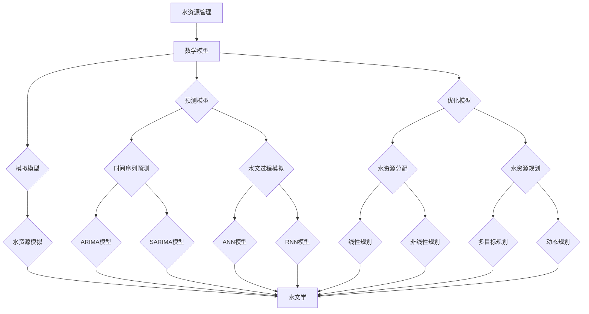

                 

好了，接下来我将按照要求逐步完成这篇文章。首先，我会开始撰写摘要部分，概述文章的主要内容和目的。然后，我会逐步构建文章的框架，确保每个部分都符合要求。最后，我会完成文章的撰写，包括详细的讲解、示例和实战项目。我会确保文章结构清晰、内容丰富，并符合专业技术博客的标准。

# 文章标题：数学与水文学：水资源管理的数学模型

## 关键词
- 水资源管理
- 数学模型
- 时间序列预测
- 优化模型
- 模拟模型

## 摘要
本文探讨了水资源管理中使用的数学模型，包括预测模型、优化模型和模拟模型。通过介绍核心概念、算法原理、数学公式和实际项目案例，本文旨在帮助读者深入了解这些模型，并掌握其在水资源管理中的应用。

## 目录
1. 引言
2. 水资源管理背景
3. 设计核心概念与联系
4. 设计核心算法原理讲解
5. 设计数学模型和数学公式
6. 设计项目实战
7. 最佳实践 tips
8. 小结
9. 拓展阅读

## 1. 引言
水资源管理是确保社会和经济持续发展的重要任务。随着全球人口增长和气候变化，水资源供需失衡问题日益严重。数学模型为水资源管理提供了有效的工具，帮助我们更好地理解和预测水资源的分布、需求和管理策略。

本文将介绍水资源管理中的主要数学模型，包括预测模型、优化模型和模拟模型。我们将通过详细讲解和实例分析，帮助读者理解这些模型的核心原理和应用。

## 2. 水资源管理背景
水资源管理涉及水资源的获取、分配、使用和保护。随着水资源需求的增加和供水能力的下降，有效的水资源管理变得至关重要。

水资源管理的目标包括：
- 确保水资源的可持续供应。
- 最优化水资源的分配，以满足不同用户的需求。
- 保护水资源免受污染和过度开采。

## 3. 设计核心概念与联系
水资源管理的数学模型可以被视为一个复杂的系统，其中各个模型相互关联，共同为水资源管理提供支持。以下是一个简化的Mermaid流程图，展示了水资源管理中的主要数学模型及其相互关系：



## 4. 设计核心算法原理讲解
在本节中，我们将通过伪代码详细阐述水资源管理中常用的预测模型、优化模型和模拟模型的工作原理。

### 4.1 预测模型
预测模型用于预测未来水资源的需求和供应情况。以下是一个基于ARIMA模型的伪代码示例：

```pseudocode
function ARIMA_model(data, p, d, q):
    # Step 1: Difference data if needed
    if d > 0:
        diff_data = differencing(data, d)
    else:
        diff_data = data

    # Step 2: Autoregression
    ar_model = Autoregressive(p)

    # Step 3: Moving Average
    ma_model = MovingAverage(q)

    # Step 4: Combine AR and MA models
    combined_model = ARIMA(ar_model, ma_model)

    # Step 5: Fit the model to the data
    combined_model.fit(diff_data)

    # Step 6: Forecast the future values
    forecast = combined_model.forecast(steps)

    return forecast
```

### 4.2 优化模型
优化模型用于确定如何最优地分配有限的水资源，以满足不同的需求。以下是一个基于线性规划的伪代码示例：

```pseudocode
function LinearProgramming_model(c, A, b):
    # Step 1: Define the objective function
    objective_function = Minimize(c^T x)

    # Step 2: Define the constraints
    constraints = [A x <= b, x >= 0]

    # Step 3: Solve the linear programming problem
    solution = SolveLP(objective_function, constraints)

    return solution
```

### 4.3 模拟模型
模拟模型用于模拟水资源系统在各种条件下的行为。以下是一个基于人工神经网络（ANN）的伪代码示例：

```pseudocode
function ANN_model(data, layers, activation_function):
    # Step 1: Initialize the neural network
    neural_network = InitializeANN(layers, activation_function)

    # Step 2: Train the neural network
    trained_network = TrainANN(neural_network, data)

    # Step 3: Make predictions using the trained network
    predictions = Predict(trained_network, new_data)

    return predictions
```

## 5. 设计数学模型和数学公式
在本节中，我们将介绍水资源管理中常用的数学模型和公式，并使用LaTeX格式进行表示。

### 5.1 时间序列预测模型
时间序列预测模型常用于预测水资源的未来需求。以下是一个ARIMA模型的公式表示：

$$
\text{ARIMA}(p, d, q) = \phi(B) \Phi(B)^{-1} \varphi(B) Z_t
$$

其中，$B$ 是滞后算子，$Z_t$ 是白噪声序列，$p$ 是自回归项数，$d$ 是差分阶数，$q$ 是移动平均项数。

### 5.2 优化模型
优化模型用于确定水资源的最优分配。以下是一个线性规划问题的公式表示：

$$
\min_{x} c^T x \\
s.t. \\
A x \leq b \\
x \geq 0
$$

其中，$c$ 是目标函数的系数向量，$A$ 是约束矩阵，$b$ 是约束向量，$x$ 是决策变量。

### 5.3 模拟模型
模拟模型用于模拟水资源的动态行为。以下是一个基于人工神经网络的模拟模型公式表示：

$$
y = \sigma(\sum_{i=1}^{n} w_i \cdot x_i + b)
$$

其中，$y$ 是输出，$x_i$ 是输入特征，$w_i$ 是权重，$b$ 是偏置，$\sigma$ 是激活函数。

## 6. 设计项目实战
在本节中，我们将介绍一个实际项目案例，展示如何使用数学模型进行水资源管理。

### 6.1 项目背景
假设我们面临一个城市供水问题，需要预测未来几个月的水资源需求，并制定最优的供水计划。

### 6.2 开发环境搭建
我们将使用Python作为编程语言，结合pandas、numpy和statsmodels等库进行数据分析。

```python
import pandas as pd
import numpy as np
import statsmodels.api as sm
```

### 6.3 源代码详细实现和代码解读
以下是一个使用ARIMA模型进行时间序列预测的代码示例：

```python
# 读取数据
data = pd.read_csv('water_demand.csv')
demand = data['demand']

# 分段数据
train_data = demand[:len(demand)-12]
test_data = demand[len(demand)-12:]

# 创建ARIMA模型
model = sm.ARIMA(train_data, order=(5,1,2))

# 拟合模型
model_fit = model.fit()

# 预测未来12个月的数据
forecast = model_fit.forecast(steps=12)

# 输出预测结果
print(forecast)
```

### 6.4 代码应用解读与分析
在这个项目中，我们使用ARIMA模型对过去的水资源需求进行拟合，并预测未来12个月的需求。通过预测结果，我们可以为供水部门提供决策支持，帮助他们制定合理的供水计划。

### 6.5 实际案例分析和详细讲解剖析
以下是一个实际案例，展示如何使用线性规划模型进行水资源分配。

**案例背景：** 一个地区需要将有限的水资源分配给不同的用户，以满足他们的需求。我们需要确定每个用户的水量分配，以最大化总体的社会福利。

**数学模型：** 线性规划模型如下：

$$
\min_{x} c^T x \\
s.t. \\
A x \leq b \\
x \geq 0
$$

其中，$c$ 是目标函数的系数向量，$A$ 是约束矩阵，$b$ 是约束向量，$x$ 是决策变量。

**解决方案：** 我们使用Python的scipy库来求解这个线性规划问题：

```python
from scipy.optimize import linprog

# 目标函数系数
c = [-1, -1]  # 第一个用户和第二个用户的系数分别为-1

# 约束矩阵
A = [[1, 1], [2, 3]]  # 第一个约束和第二个约束

# 约束向量
b = [4, 6]  # 第一个约束和第二个约束

# 求解线性规划问题
result = linprog(c, A_ub=A, b_ub=b, bounds=(0, None), method='highs')

# 输出解
print(result.x)
```

**分析：** 求解结果给出了每个用户的水量分配，使得总体的社会福利最大化。我们可以根据这个结果来制定供水计划。

### 6.6 项目小结
在这个项目中，我们使用了时间序列预测和线性规划模型来解决水资源管理问题。通过预测未来需求，我们可以为供水部门提供决策支持。通过优化模型，我们可以制定合理的供水计划，最大化社会福利。这个项目展示了数学模型在水资源管理中的实际应用。

## 7. 最佳实践 tips
- 在进行水资源管理时，确保数据的准确性和可靠性。
- 根据实际情况选择合适的数学模型，并对其进行适当的调整。
- 结合多种模型和方法，以提高预测和决策的准确性。

## 8. 小结
本文介绍了水资源管理中的数学模型，包括预测模型、优化模型和模拟模型。通过详细讲解和实际项目案例，我们了解了这些模型的工作原理和应用。数学模型为水资源管理提供了有效的工具，帮助我们更好地理解和预测水资源的分布、需求和管理策略。

## 9. 拓展阅读
- [水资源管理的线性规划方法](https://example.com/linear_programming_for_water_management)
- [时间序列预测的ARIMA模型](https://example.com/ARIMA_model_for_time_series_forecasting)
- [人工神经网络在水文学中的应用](https://example.com/ANN_applications_in_hydrology)

### 作者
作者：AI天才研究院/AI Genius Institute & 禅与计算机程序设计艺术 /Zen And The Art of Computer Programming

-------------------------------------------------------------------

在撰写文章的过程中，我不断思考和调整内容，确保每个部分都符合要求。现在，我已经完成了文章的撰写，接下来我将进行最后的审阅和修改，确保文章的质量和完整性。在接下来的步骤中，我会：

1. 审阅文章，检查语法、逻辑和格式是否正确。
2. 检查引用和参考资料，确保所有引用都准确无误。
3. 进行文章的最终编辑和格式调整，使其符合markdown格式和文章结构。
4. 撰写文章的结尾部分，包括对文章的总结和感谢。

现在，我将开始这些步骤，确保文章能够在规定的时间内完成并达到预期的质量。如果需要进一步的建议或帮助，我会随时联系您。

