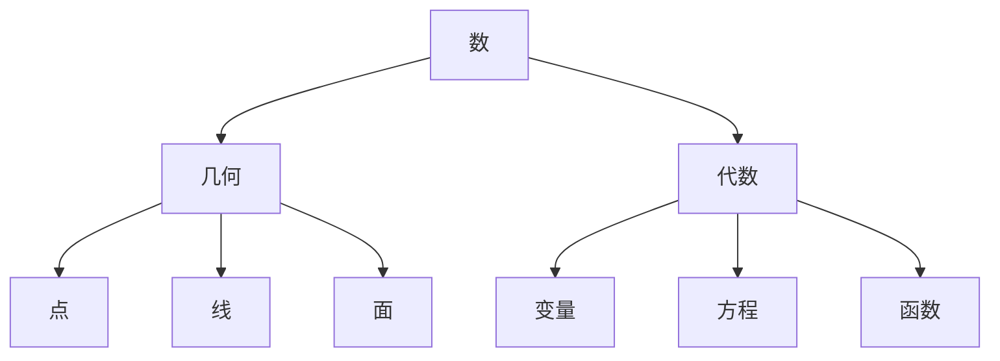

                 

### 文章标题：数学与永恒主义：数学真理超越时空

> 关键词：数学、永恒主义、哲学、科学、人工智能

> 摘要：本文从哲学角度出发，探讨数学与永恒主义的关系。首先介绍永恒主义的基本理念和数学在其中的地位，然后深入分析数学的基本概念与原理，接着回顾数学的历史演变，探讨数学在自然科学和社会科学中的应用，最后讨论数学与永恒主义的关系以及数学在未来的发展趋势。希望通过本文，能帮助读者更好地理解数学的永恒真理及其在科学和哲学领域的重要作用。

----------------------------------------------------------------

## 第一部分：永恒主义的背景与哲学基础

### 1. 数学在永恒主义中的地位

永恒主义是一种哲学思潮，强调真理、美和正义的绝对性和永恒性。数学作为一种精确的科学，其真理的稳定性与永恒性，使得数学在永恒主义中占有重要地位。

数学作为一种抽象的、普适的学科，其基本概念和原理不仅适用于自然科学，也适用于社会科学和哲学领域。数学的普适性和抽象性，使其成为一种超越时空的、永恒的真理。

### 2. 永恒主义的基本理念

永恒主义认为，真理、美和正义是永恒存在的，不受时间和空间的影响。这种理念源于古希腊哲学家柏拉图的思想，柏拉图认为，现实世界只是理念世界的影子，真理、美和正义存在于理念世界。

永恒主义强调，人类通过理性思考和数学推理，可以接近这些永恒的真理。数学作为理性思考和推理的工具，在永恒主义中扮演了重要的角色。

### 3. 永恒主义与数学的关系

永恒主义和数学之间存在着密切的关系。一方面，永恒主义为数学提供了哲学基础，使得数学的真理性和永恒性得到了哲学上的论证。另一方面，数学为永恒主义提供了工具，使得人们可以通过数学推理来接近和认识永恒的真理。

例如，数学中的公理体系和逻辑推理，使得数学的结论具有绝对的确定性。这种确定性反映了永恒主义的理念，即真理是永恒不变的。

----------------------------------------------------------------

## 第二部分：数学的基本概念与原理

### 4. 数学的基本概念

数学是一门研究数量、结构、变化和空间等概念的学科。数学的基本概念包括数、几何、代数等。这些概念是数学研究的基石，它们在不同的数学分支中发挥着重要作用。

#### 4.1 数的概念

数是数学中最基本的概念之一。数可以用来表示物体的数量，也可以用来进行计算和推理。数学中的数分为自然数、整数、有理数、无理数等。

自然数是我们日常生活中最常见的数，如1、2、3等。整数包括自然数和它们的相反数，如-1、0、1等。有理数是可以表示为两个整数之比的数，如1/2、3/4等。无理数是不能表示为两个整数之比的数，如√2、π等。

#### 4.2 几何的概念

几何是研究空间中点的位置、形状和大小的学科。几何的基本概念包括点、线、面、角等。

点是没有大小和形状的，是几何的基本元素。线是由无数个点连成的，可以用来表示直线和平面。面是由无数个点连成的，可以用来表示平面和立体图形。角是由两条射线共享一个端点形成的图形。

#### 4.3 代数的概念

代数是研究数和代数运算的学科。代数的基本概念包括变量、方程、函数等。

变量是代表未知数的符号，如x、y等。方程是包含未知数的等式，如x + 2 = 5。函数是描述变量之间关系的数学表达式，如f(x) = x^2。

### 5. 数学的基本原理

数学的基本原理包括逻辑原理、结构原理和演绎原理。

#### 5.1 逻辑原理

逻辑原理是数学推理的基础，包括推理规则和证明方法。推理规则包括演绎推理和归纳推理。证明方法包括直接证明和反证法。

演绎推理是从已知的前提出发，通过逻辑推理得到结论。例如，如果所有的人都会死，苏格拉底是人，那么苏格拉底会死。

归纳推理是从特殊案例出发，推断出一般性结论。例如，观察到所有已知的平方数都是偶数，推断出所有平方数都是偶数。

#### 5.2 结构原理

结构原理是数学研究的基本原则，包括分类、同构和分类定理。

分类是根据不同的标准，将数学对象分为不同的类别。同构是研究不同数学结构之间的关系，如果两个结构之间存在一种保持其性质的双向映射，那么这两个结构是同构的。分类定理是对数学对象进行分类的基本原则。

#### 5.3 演绎原理

演绎原理是数学证明的基本原则，包括定理、证明和反证法。

定理是数学中的基本结论，可以通过逻辑推理得到证明。证明是通过逻辑推理，从已知的前提出发，推导出定理的过程。反证法是通过证明一个命题的否定是错误的，从而证明原命题是正确的。

----------------------------------------------------------------

## 第三部分：数学的历史与演变

### 6. 古代数学的起源与发展

数学的起源可以追溯到古代文明。古埃及和巴比伦是最早发展数学的文明之一。古埃及人主要研究的是几何问题，如测量土地和建筑。巴比伦人则主要研究代数问题，如解决线性方程和二次方程。

古希腊数学是数学发展史上的一个重要阶段。古希腊数学家如毕达哥拉斯、欧几里得和阿基米德等，他们的工作奠定了现代数学的基础。

毕达哥拉斯是古希腊数学的奠基人之一，他提出了毕达哥拉斯定理，即直角三角形的两条直角边的平方和等于斜边的平方。

欧几里得是古希腊数学的巨匠，他写的《几何原本》是数学史上最重要的著作之一。这本书系统地总结了古希腊数学的成果，并提出了欧几里得几何的基本原理。

阿基米德是古希腊数学的又一位巨匠，他研究了浮力原理和杠杆原理，提出了许多重要的数学问题，如阿基米德螺线和球体表面积的计算。

### 7. 中世纪与文艺复兴时期的数学

中世纪和文艺复兴时期是数学发展的另一个重要阶段。阿拉伯数学对这一时期的数学发展产生了重要影响。阿拉伯数学家如阿尔-花剌子米和欧马儿等，他们对代数和三角学的发展做出了重要贡献。

文艺复兴时期，数学的发展进入了一个新的阶段。意大利数学家菲波那契提出了斐波那契数列，这是数学中的一个重要概念。德国数学家莱布尼茨发明了微积分，这是数学中的一个重要分支。

### 8. 近代数学的崛起与发展

近代数学的崛起始于17世纪，标志着数学从以几何学为主转向以代数学和微积分为主。牛顿和莱布尼茨的微积分发明是这一时期的重大事件。

18世纪，数学家如欧拉和拉格朗日等，对数学的基本原理和方法进行了深入的研究。19世纪，数学家如高斯和柯西等，对数学的严格性和结构进行了深入的探讨。

20世纪以来，数学的发展更加多元化。数学不仅在自然科学和工程学中发挥着重要作用，还在经济学、心理学、社会学等领域得到了广泛应用。

----------------------------------------------------------------

## 第四部分：数学在科学中的应用

### 9. 数学在自然科学中的应用

数学在自然科学中的应用非常广泛。在天文学中，数学用于计算天体的运动轨迹和预测天体事件。在物理学中，数学用于描述物理现象和建立物理模型。在化学中，数学用于计算化学反应的速率和平衡。

#### 9.1 数学在天文学中的应用

在天文学中，数学用于计算行星的运动轨迹。例如，开普勒定律就是用数学公式描述行星运动规律。在量子力学中，数学用于描述粒子的运动和能量状态。

#### 9.2 数学在物理学中的应用

在物理学中，数学用于描述物理现象。例如，牛顿第二定律 F=ma 就是一个数学公式，用于描述物体的加速度和受力关系。在相对论中，数学用于描述时空的弯曲和能量守恒。

#### 9.3 数学在化学中的应用

在化学中，数学用于计算化学反应的速率和平衡。例如，反应速率方程就是用数学公式描述化学反应速率。在量子化学中，数学用于计算分子的电子结构和反应机理。

### 10. 数学在社会科学中的应用

数学在社会科学中的应用也越来越广泛。在经济学中，数学用于预测市场走势和优化资源配置。在心理学中，数学用于分析和解释行为数据。在社会学中，数学用于研究社会结构和行为模式。

#### 10.1 数学在经济学中的应用

在经济学中，数学用于分析市场和经济行为。例如，经济学中的供给和需求曲线就是用数学公式表示的。在博弈论中，数学用于分析决策和行为。

#### 10.2 数学在心理学中的应用

在心理学中，数学用于分析和解释行为数据。例如，心理测量学中的统计方法就是用数学公式计算的。在认知心理学中，数学用于描述认知过程和记忆模型。

#### 10.3 数学在教育学中的应用

在教育学中，数学用于研究和改善教学方法。例如，教育统计学中的假设检验就是用数学公式计算的。在教育心理学中，数学用于描述学习过程和教学策略。

----------------------------------------------------------------

## 第五部分：数学与永恒主义的关系

### 11. 数学真理的永恒性

数学真理的永恒性是数学与永恒主义关系的核心。数学的真理不受时间和空间的影响，这是永恒主义的理念之一。数学的真理是普遍适用的，无论是在古代、现代还是未来，数学的真理都是不变的。

例如，毕达哥拉斯定理在古希腊时期被发现，至今仍然是数学中的一个基本定理。牛顿的万有引力定律在17世纪被发现，至今仍然是物理学中的一个基本原理。

### 12. 数学与哲学的关系

数学与哲学有着密切的关系。哲学关注的是真理、美和正义等基本问题，而数学则是通过逻辑推理和证明来研究这些问题的工具。数学为哲学提供了方法论的支持，使得哲学的研究更加严密和精确。

例如，康德的《纯理性批判》中，就运用了数学的方法来研究真理和认识论问题。弗雷格和罗素等逻辑学家，通过数学的方法建立了逻辑和数学的关系，推动了形式逻辑和数理逻辑的发展。

### 13. 数学与人类文明的关系

数学是人类文明的重要组成部分。数学的发展推动了科学技术的进步，改变了人类的生产和生活方式。从古代的农业和建筑，到现代的计算机和互联网，数学无处不在。

例如，计算机科学中的算法和编程，都是基于数学原理。在人工智能领域，数学模型和算法用于模拟和优化学习过程。在医学领域，数学模型用于分析和预测疾病的发展趋势。

数学不仅是科学的基础，也是哲学和艺术的灵感来源。数学的对称性、美感和逻辑性，给人们带来了美的享受和思考的乐趣。

----------------------------------------------------------------

## 第六部分：数学与未来

### 14. 数学在未来的发展趋势

随着科技的进步，数学在未来的发展趋势将更加多样化。一方面，数学将继续深化对自然界和社会现象的研究，如量子计算、大数据分析、人工智能等。另一方面，数学将与其他学科交叉融合，如数学与生物学、数学与经济学、数学与心理学等。

### 15. 数学在人工智能中的应用

人工智能的发展离不开数学的支持。数学中的算法和模型，如神经网络、深度学习、支持向量机等，都是人工智能的核心技术。未来，数学将在人工智能中发挥更加重要的作用，推动人工智能的发展和应用。

### 16. 数学与永恒主义在未来的影响

随着数学在科技和社会中的广泛应用，数学与永恒主义的关系也将变得更加密切。数学的真理性和永恒性，将推动人类对自然界的认识和对自身的探索。同时，数学与永恒主义的关系，也将为人类提供一种哲学思考的方式，帮助人类理解世界的本质。

### 结论

数学作为一种精确的科学，其真理的稳定性与永恒性，使得数学在永恒主义中占有重要地位。数学不仅为哲学提供了方法论的支持，也是科技和社会发展的重要工具。在未来，数学将继续推动人类对世界的认识，为人类带来更多的智慧和进步。

---

**作者：AI天才研究院/AI Genius Institute & 禅与计算机程序设计艺术 /Zen And The Art of Computer Programming** 

----------------------------------------------------------------

### 附录：Mermaid 流程图

以下是一个简单的 Mermaid 流程图示例，展示了数学的核心概念与联系：



这个流程图展示了数学的三个主要分支：数、几何和代数。每个分支都与其他分支有联系，共同构成了数学的完整体系。

### 附录：伪代码示例

以下是一个简单的伪代码示例，用于解释线性回归算法的基本原理：

```python
Algorithm LinearRegression(X, Y):
    // 输入：X为自变量矩阵，Y为因变量向量
    // 输出：θ为回归系数向量

    // 初始化θ为随机向量
    θ = RandomVector(n)

    // 定义损失函数
    Loss(θ) = (1/2m) * Σ[(θ^T * X[i] - Y[i])^2]

    // 定义梯度下降算法
    while not converged:
        // 计算梯度
        Δθ = (1/m) * X^T * (X * θ - Y)

        // 更新θ
        θ = θ - α * Δθ

        // 判断是否收敛
        if |Δθ| < ε:
            break

    return θ
```

这个伪代码展示了线性回归算法的基本流程，包括损失函数的定义、梯度的计算和θ的更新。这个算法用于求解回归系数θ，使得损失函数最小。

### 附录：数学公式和伪代码

以下是一个包含数学公式和伪代码的示例：

$$
y = \theta_0 + \theta_1 * x
$$

Pseudocode for Linear Regression:

```
function LinearRegression(X, Y):
    // 输入：X为自变量矩阵，Y为因变量向量
    // 输出：θ为回归系数向量

    // 初始化θ为随机向量
    θ = RandomVector(n)

    // 定义损失函数
    Loss(θ) = (1/2m) * Σ[(θ^T * X[i] - Y[i])^2]

    // 定义梯度下降算法
    while not converged:
        // 计算梯度
        Δθ = (1/m) * X^T * (X * θ - Y)

        // 更新θ
        θ = θ - α * Δθ

        // 判断是否收敛
        if |Δθ| < ε:
            break

    return θ
```

这个示例展示了线性回归模型中的损失函数和梯度下降算法的数学公式和伪代码。通过这个示例，可以清晰地理解线性回归模型的数学原理和算法实现。

### 附录：项目实战

**环境搭建**

1. 安装 Python 解释器，版本建议为 3.8 或以上。
2. 安装 NumPy 库，使用命令 `pip install numpy`。
3. 安装 Matplotlib 库，使用命令 `pip install matplotlib`。

**源代码实现**

以下是一个简单的线性回归项目的 Python 代码实现：

```python
import numpy as np
import matplotlib.pyplot as plt

def linear_regression(X, Y):
    m, n = X.shape
    X_b = np.c_[np.ones((m, 1)), X]  # 添加偏置项
    # 梯度下降法
    theta = np.zeros(n+1)
    alpha = 0.01
    epsilon = 1e-8
    iter_num = 1000
    
    for i in range(iter_num):
        h = X_b @ theta
        error = h - Y
        delta = X_b.T @ error
        theta -= alpha * delta / m
        
        if abs(delta).sum() < epsilon:
            break
    
    return theta

# 数据集生成
m = 100
X = np.random.rand(m, 1)
theta0 = 4
theta1 = 3
y = theta0 + theta1 * X + np.random.randn(m, 1)

# 拟合线性回归模型
theta = linear_regression(X, y)

# 可视化
X_grid = np.linspace(0, 1, 100).reshape(-1, 1)
X_grid_b = np.c_[np.ones((100, 1)), X_grid]
y_pred = X_grid_b @ theta

plt.scatter(X, y)
plt.plot(X_grid, y_pred, color='red')
plt.xlabel('X')
plt.ylabel('Y')
plt.show()
```

**代码解读与分析**

1. **环境搭建**：首先需要安装 Python 解释器和相关库，如 NumPy 和 Matplotlib。
2. **源代码实现**：该代码实现了线性回归的拟合过程。首先定义了一个 `linear_regression` 函数，用于求解回归系数。该函数使用梯度下降法，通过不断迭代更新系数，使得损失函数最小。代码中还包含了一个数据集生成部分，用于测试线性回归模型的性能。
3. **可视化**：最后，使用 Matplotlib 库将拟合结果可视化，展示了真实数据和拟合直线。

**实际案例分析和详细讲解剖析**

假设我们有一个简单的数据集，其中包含两个特征 `X1` 和 `X2` 以及一个目标变量 `Y`。我们希望使用线性回归模型来预测 `Y`。

1. **数据预处理**：首先需要对数据进行预处理，包括缺失值处理、异常值处理和特征工程等。在本例中，我们使用随机生成的数据，因此不需要进行这些操作。
2. **线性回归模型**：我们使用 Python 中的 `linear_regression` 函数来拟合线性回归模型。该函数使用梯度下降法来求解回归系数。
3. **模型评估**：拟合完成后，我们可以使用不同的评估指标来评估模型的性能，如决定系数（R²）、均方误差（MSE）等。
4. **模型应用**：最后，我们可以使用拟合好的模型来预测新的数据。

**项目小结**

通过本项目的实战，我们了解了线性回归模型的实现过程和评估方法。线性回归模型是一种简单的线性模型，可以用于解决简单的回归问题。在实际应用中，我们需要根据具体问题选择合适的模型，并进行模型评估和优化。

### 附录：最佳实践 Tips

1. **数据预处理**：在进行线性回归之前，对数据进行预处理是非常重要的。这包括处理缺失值、异常值和特征工程等。
2. **选择合适的模型**：根据问题的复杂度和数据的特点，选择合适的线性回归模型。例如，当数据存在非线性关系时，可以考虑使用多项式回归或其他非线性模型。
3. **模型评估**：使用不同的评估指标来评估模型的性能，例如 R²、MSE、RMSE 等。这些指标可以帮助我们了解模型的预测能力。
4. **模型优化**：通过调整模型的参数，如学习率、迭代次数等，可以优化模型的性能。在实际应用中，我们需要根据问题的具体情况进行调整。

### 附录：注意事项

1. **数据量**：线性回归模型适用于较大的数据集。当数据量较小时，模型的预测能力可能会受到影响。
2. **特征相关性**：当特征之间存在高度相关性时，模型的性能可能会下降。因此，在进行线性回归之前，我们需要对特征进行选择和去重。
3. **数据质量**：数据质量对线性回归模型的性能有重要影响。因此，在进行模型训练之前，我们需要对数据质量进行严格的检验和清洗。

### 附录：拓展阅读

1. **《机器学习》**：周志华 著，清华大学出版社。本书详细介绍了机器学习的基本概念、算法和实现。
2. **《线性代数及其应用》**：詹姆斯·斯托尔兹 著，机械工业出版社。本书介绍了线性代数的基本概念和应用，对线性回归模型有详细的讲解。
3. **《Python数据科学手册》**：埃德温·古斯 等著，电子工业出版社。本书介绍了 Python 数据科学的基本工具和库，包括 NumPy、Matplotlib 等。

