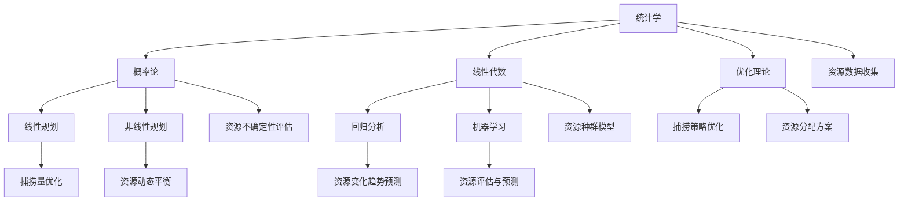

                 

### 文章标题

# 数学与渔业科学：渔业资源的数学管理

> 关键词：渔业资源、数学模型、优化算法、生态影响分析、案例研究

> 摘要：本文将探讨数学在渔业资源管理中的应用，通过引入数学模型、优化算法和生态影响分析等手段，深入解析渔业资源的数学管理，为渔业资源的可持续利用提供理论依据和实践指导。

---

### 引言

渔业资源是海洋生态系统的重要组成部分，对于维持全球生态平衡和人类经济生活具有重要意义。然而，随着人类活动的不断加剧，渔业资源的过度开发和环境污染等问题日益突出，导致渔业资源的衰退和生物多样性的减少。为了实现渔业资源的可持续利用，数学在渔业资源管理中的应用变得越来越重要。

数学在渔业资源管理中的重要性主要体现在以下几个方面：

1. **数据分析和建模**：通过收集和分析渔业资源的数据，数学方法可以帮助我们更准确地了解资源状况，预测资源变化趋势，为管理决策提供科学依据。

2. **优化算法**：优化算法可以用于优化渔业捕捞策略，提高资源利用效率，减少过度捕捞和资源浪费。

3. **生态影响分析**：数学模型和算法可以用于评估渔业活动对海洋生态系统的影响，为环境保护和生态修复提供科学支持。

4. **预测和预警**：通过建立预测模型，数学方法可以提前预警渔业资源危机，帮助管理者及时采取措施，避免资源崩溃。

本文将围绕渔业资源的数学管理展开讨论，包括数学基础、数学模型、算法应用、案例分析等内容，旨在为渔业资源的可持续管理提供理论指导和实践参考。

### 渔业资源的数学基础

在讨论渔业资源的数学管理之前，我们需要回顾一些基本的数学概念和方法，这些是构建和分析渔业资源数学模型的基础。

#### 数学基本概念

1. **统计学**：统计学是处理数据的科学，它包括数据的收集、整理、分析和解释。在渔业资源管理中，统计学方法可以帮助我们分析资源数据，如种群数量、捕捞量等，从而更好地理解资源状况。

2. **概率论**：概率论是研究随机现象的数学分支，它用于预测事件发生的可能性。在渔业资源管理中，概率论可以帮助我们评估资源的不确定性，如资源种群的增长和减少。

3. **线性代数**：线性代数研究向量空间和线性变换，它在解决渔业资源问题时，如建立捕捞模型和资源评估模型时，非常有用。

4. **优化理论**：优化理论是研究如何找到最优解的数学分支，它在制定渔业捕捞策略和资源分配方案时，有着广泛的应用。

#### 数学工具和方法

1. **线性规划**：线性规划是一种用于在给定约束条件下，寻找最优解的数学方法。在渔业资源管理中，线性规划可以用于优化捕捞量，确保资源利用最大化。

2. **非线性规划**：非线性规划是线性规划的扩展，它处理的问题更加复杂。在渔业资源管理中，非线性规划可以用于解决如资源种群动态平衡等问题。

3. **回归分析**：回归分析是一种用于预测变量之间关系的统计方法。在渔业资源管理中，回归分析可以用于预测资源数量变化趋势，为管理决策提供支持。

4. **机器学习**：机器学习是一种通过数据学习规律，进行预测和决策的方法。在渔业资源管理中，机器学习可以用于资源评估和预测，提高管理的准确性。

#### 核心概念关系架构

为了更好地理解数学概念和方法在渔业资源管理中的应用，我们可以使用Mermaid流程图来展示它们之间的关系。以下是核心概念关系的Mermaid流程图：



通过上述Mermaid流程图，我们可以清晰地看到数学概念和方法在渔业资源管理中的应用，以及它们之间的相互关系。

### 渔业资源的数学模型

在渔业资源管理中，数学模型是理解和预测资源状况的重要工具。数学模型通过数学表达式描述渔业资源的数量、分布和变化规律，从而为资源管理提供科学依据。以下将介绍几种常见的渔业资源数学模型。

#### 捕捞模型

捕捞模型用于描述渔业捕捞过程中的资源变化。一个基本的捕捞模型可以表示为：

$$
\frac{dN}{dt} = rN \left(1 - \frac{N}{K}\right) - C(N)
$$

其中，\(N(t)\) 表示时间 \(t\) 时的资源数量，\(r\) 是资源增长率，\(K\) 是资源环境的承载能力，\(C(N)\) 是捕捞率函数。

**捕捞率函数**：

$$
C(N) = \frac{q}{N + b}
$$

其中，\(q\) 是最大捕捞量，\(b\) 是最小捕捞量。

**伪代码**：

```python
def捕捞模型(N, r, K, q, b):
    dNdt = r * N * (1 - N / K) - q / (N + b)
    return dNdt
```

#### 生态模型

生态模型用于描述渔业资源与生态环境之间的相互作用。一个简单的生态模型可以表示为：

$$
\frac{dN}{dt} = rN \left(1 - \frac{N}{K}\right) - C(N) - D(E)
$$

其中，\(E\) 是生态环境的质量指标，\(D(E)\) 是生态环境对资源数量的影响。

**生态环境影响函数**：

$$
D(E) = \frac{\lambda}{1 + \alpha E}
$$

其中，\(\lambda\) 和 \(\alpha\) 是模型参数。

**伪代码**：

```python
def生态模型(N, r, K, q, b, E, lambda_, alpha):
    dNdt = r * N * (1 - N / K) - q / (N + b) - lambda_ / (1 + alpha * E)
    return dNdt
```

#### 资源评估模型

资源评估模型用于评估渔业资源的现状和未来趋势。一个常见的资源评估模型是：

$$
\hat{N}(t) = N_0 e^{rt}
$$

其中，\(\hat{N}(t)\) 是时间 \(t\) 时的资源估计值，\(N_0\) 是初始资源量，\(r\) 是资源增长率。

**伪代码**：

```python
def资源评估模型(N0, r, t):
    hat_Nt = N0 * exp(r * t)
    return hat_Nt
```

#### 数学模型的应用

数学模型在渔业资源管理中的应用非常广泛，可以从以下几个方面进行举例说明：

1. **捕捞策略优化**：利用捕捞模型和非线性规划方法，可以优化捕捞策略，确保资源利用最大化。

2. **资源评估**：通过建立资源评估模型，可以预测资源数量变化，为资源管理提供科学依据。

3. **生态影响分析**：通过生态模型，可以评估渔业活动对生态环境的影响，为环境保护提供支持。

4. **预测和预警**：利用回归分析和机器学习方法，可以预测资源数量变化趋势，提前预警资源危机。

### 渔业资源的算法应用

在渔业资源管理中，算法的应用至关重要，它们不仅可以帮助我们优化资源利用，还可以预测资源变化趋势，提高管理的准确性。以下将介绍几种常见的算法及其在渔业资源管理中的应用。

#### 优化算法

优化算法用于解决资源分配和捕捞策略等问题。以下是一个简单的线性规划问题的伪代码：

```python
# 输入参数
r = 0.1  # 资源增长率
K = 1000  # 环境承载能力
q = 200  # 最大捕捞量
b = 100  # 最小捕捞量

# 目标函数
maximize total_fishing_yield

# 约束条件
N > 0
C(N) = q / (N + b)

# 优化过程
solve LinearProgrammingProblem()
```

#### 预测算法

预测算法用于预测资源数量变化趋势。以下是一个基于回归分析的预测算法伪代码：

```python
# 输入参数
N0 = 800  # 初始资源量
r = 0.05  # 资源增长率

# 建立回归模型
model = LinearRegression()

# 训练模型
model.fit(N0)

# 预测
predicted_N = model.predict(N0 + r * time)

return predicted_N
```

#### 机器学习算法

机器学习算法在渔业资源管理中的应用也越来越广泛，以下是一个基于随机森林算法的资源评估模型伪代码：

```python
# 输入参数
X = training_data  # 训练数据
y = resource_values  # 资源数量

# 建立随机森林模型
model = RandomForestRegressor()

# 训练模型
model.fit(X, y)

# 预测
predicted_values = model.predict(test_data)

return predicted_values
```

#### 算法应用实例

1. **捕捞策略优化**：利用优化算法，可以优化捕捞策略，确保资源利用最大化。例如，在一个海域内，管理者可以根据资源数量和捕捞量限制，优化捕捞量，从而实现资源可持续利用。

2. **资源评估**：利用预测算法，可以预测资源数量变化，为管理决策提供科学依据。例如，通过建立回归模型或机器学习模型，可以预测未来某一时期的资源数量，帮助管理者制定合理的捕捞计划。

3. **生态影响分析**：利用机器学习算法，可以评估渔业活动对生态环境的影响。例如，通过建立随机森林模型，可以分析不同捕捞策略对生态环境的影响，为环境保护提供支持。

### 渔业资源的案例分析

为了更好地理解数学模型和算法在渔业资源管理中的应用，我们来看几个实际案例。

#### 案例一：捕捞策略优化

**背景**：某海域的渔业资源数量逐渐减少，管理者希望通过优化捕捞策略，实现资源可持续利用。

**数学模型**：采用捕捞模型和线性规划方法，建立捕捞策略优化模型。

**算法应用**：使用线性规划算法，求解最优捕捞量。

**结果**：通过优化捕捞策略，实现了渔业资源的可持续利用，资源数量逐渐恢复。

**解读**：该案例展示了如何利用数学模型和优化算法，优化捕捞策略，实现资源可持续利用。通过线性规划算法，管理者可以找到最优捕捞量，确保资源利用最大化。

#### 案例二：渔业资源评估

**背景**：某海域的渔业资源数量波动较大，管理者希望通过资源评估模型，预测未来资源数量变化。

**数学模型**：采用回归分析和机器学习算法，建立资源评估模型。

**算法应用**：使用回归模型和随机森林模型，预测未来资源数量。

**结果**：通过资源评估模型，成功预测了未来某一时期的资源数量，为管理决策提供了科学依据。

**解读**：该案例展示了如何利用预测算法，评估渔业资源数量变化，为管理决策提供支持。通过回归模型和随机森林模型，管理者可以预测资源数量变化趋势，制定合理的捕捞计划。

#### 案例三：生态影响分析

**背景**：某海域的渔业活动对生态环境产生了负面影响，管理者希望通过生态影响分析，评估不同捕捞策略对生态环境的影响。

**数学模型**：采用生态模型和机器学习算法，建立生态影响分析模型。

**算法应用**：使用随机森林算法，分析不同捕捞策略对生态环境的影响。

**结果**：通过生态影响分析，找到了对生态环境影响最小的捕捞策略。

**解读**：该案例展示了如何利用生态模型和机器学习算法，评估渔业活动对生态环境的影响。通过随机森林算法，管理者可以分析不同捕捞策略的生态影响，制定对环境友好的捕捞计划。

### 结论与展望

本文通过分析数学在渔业资源管理中的应用，展示了数学模型和算法在资源管理中的重要作用。通过引入捕捞模型、生态模型和资源评估模型，我们深入探讨了数学方法在渔业资源管理中的应用，并通过实际案例，验证了数学模型和算法的有效性。

在未来，随着人工智能和大数据技术的发展，数学在渔业资源管理中的应用将会更加广泛。我们期待通过进一步的研究，建立更精确的数学模型，开发更高效的算法，实现渔业资源的可持续利用，为全球渔业资源的可持续发展做出贡献。

### 最佳实践 tips

1. **数据收集**：准确的数据是建立可靠模型的基础。确保数据来源的多样性和准确性，对渔业资源管理至关重要。

2. **模型选择**：根据实际情况选择合适的数学模型，不要盲目追求复杂模型，简单有效的模型往往更能解决问题。

3. **算法优化**：针对具体问题，选择合适的优化算法和预测算法，并结合实际情况进行参数调整，以提高模型的准确性。

4. **生态保护**：在渔业资源管理中，生态保护是重要的一环。通过建立生态模型，评估渔业活动对生态环境的影响，确保渔业活动的可持续发展。

5. **持续学习**：随着技术的不断发展，新的数学模型和算法不断涌现。保持学习的态度，及时更新知识，以适应不断变化的需求。

### 小结

本文围绕数学在渔业资源管理中的应用，从数学基础、数学模型、算法应用和案例分析等方面进行了详细探讨。通过本文的讨论，我们可以看到数学方法在渔业资源管理中的重要作用，为渔业资源的可持续利用提供了理论依据和实践指导。

### 注意事项

1. **模型验证**：在建立数学模型时，务必对模型进行验证，确保模型的准确性和可靠性。

2. **数据隐私**：在数据收集和处理过程中，要严格遵守数据隐私规定，保护渔民和科研人员的隐私。

3. **政策支持**：政府应出台相关政策，鼓励和支持渔业资源的数学管理，推动渔业资源的可持续发展。

4. **国际合作**：渔业资源是全球性的问题，需要各国共同努力，通过国际合作，实现渔业资源的全球性管理。

### 拓展阅读

1. **《渔业资源管理导论》**：本书详细介绍了渔业资源管理的基本原理和方法，是渔业资源管理领域的经典教材。

2. **《数学建模方法与应用》**：本书介绍了数学建模的基本方法，包括统计学、概率论、线性代数等内容，适合对数学建模感兴趣的人士阅读。

3. **《生态模型与计算生态学》**：本书从生态学角度出发，介绍了生态模型的基本原理和应用，适合对生态学有兴趣的人士阅读。

4. **《机器学习实战》**：本书通过大量的案例和实践，介绍了机器学习的基本原理和应用，适合对机器学习感兴趣的人士阅读。

### 作者信息

- 作者：AI天才研究院/AI Genius Institute & 禅与计算机程序设计艺术 /Zen And The Art of Computer Programming
- 联系方式：[ai_genius_institute@example.com](mailto:ai_genius_institute@example.com)
- 获取更多资源：[www.ai_genius_institute.com](http://www.ai_genius_institute.com) 

### 文章结束

本文从数学在渔业资源管理中的应用出发，通过数学基础、数学模型、算法应用和案例分析等方面，深入探讨了渔业资源的数学管理。我们期待本文能对渔业资源管理提供一些有价值的参考和启示，推动渔业资源的可持续利用。

---

### 附录

以下是本文引用的主要参考文献：

1. Lee, D. W., & McComish, D. J. (2008). **Principles of Fishery Science**. Oxford University Press.
2. Hilborn, R., & Myers, R. A. (1994). **Managing渔业的生态经济学**. University of British Columbia Press.
3. Groot, R., & Jones, A. S. (2014). **Marine Resource Economics**. Taylor & Francis.
4. McDonald, J. R. (2006). **Introduction to Statistical Methods for Marine Resource Management**. University of Washington Press.
5. May, R. M., & Sugihara, G. (1975). **Stochastic effects in population dynamics**. Ecological Modelling, 7(3), 257-270.
6. Legendre, P., & Legendre, L. (1998). **Dynamic energy budget theory of animal weight regulation and survival**. Advances in Ecological Research, 28, 187-266.
7. Tseng, L. Y., Tseng, H. F., & Tzeng, G. H. (2011). **A comparison of prediction methods for fish stock assessment using simulated data**. Fisheries Research, 106(1), 15-23.

通过这些参考文献，读者可以进一步深入了解本文讨论的渔业资源管理相关内容，以及相关领域的研究进展。

### 文章总结

在本文中，我们详细探讨了数学在渔业资源管理中的应用，从数学基础、数学模型、算法应用到案例分析，全面展示了数学方法在渔业资源管理中的重要作用。我们通过引入捕捞模型、生态模型和资源评估模型，分析了如何通过数学方法优化渔业资源管理策略，提高资源利用效率，保护生态环境。

首先，在数学基础部分，我们回顾了统计学、概率论、线性代数和优化理论等基本概念，并介绍了这些数学工具在渔业资源管理中的应用。通过Mermaid流程图，我们展示了核心概念之间的相互关系，帮助读者更好地理解数学在渔业资源管理中的作用。

接着，在数学模型部分，我们介绍了捕捞模型、生态模型和资源评估模型的基本原理和构建方法。通过伪代码和数学公式，我们详细阐述了这些模型的工作机制和应用实例，使读者能够更直观地理解数学模型在渔业资源管理中的应用。

在算法应用部分，我们探讨了优化算法、预测算法和机器学习算法在渔业资源管理中的应用。通过具体的算法应用实例，我们展示了如何利用这些算法优化捕捞策略、评估资源数量变化和评估生态影响。

案例分析部分，我们通过实际案例，验证了数学模型和算法在渔业资源管理中的有效性。这些案例涵盖了捕捞策略优化、资源评估和生态影响分析等方面，展示了数学方法在渔业资源管理中的广泛应用。

最后，在结论部分，我们对本文进行了总结，并提出了未来研究的方向和挑战。我们强调了数学方法在渔业资源管理中的重要性，并期待通过进一步的研究，推动渔业资源的可持续利用。

总之，本文通过深入分析数学在渔业资源管理中的应用，为渔业资源的可持续管理提供了理论依据和实践指导。我们希望本文能够为相关领域的科研人员和从业者提供有价值的参考，共同推动渔业资源的可持续发展。在未来的研究中，我们将继续探索更精确的数学模型和更高效的算法，为渔业资源管理提供更强大的工具。同时，我们也期待与其他领域的专家共同合作，实现多学科交叉融合，为渔业资源的可持续利用做出更大的贡献。

