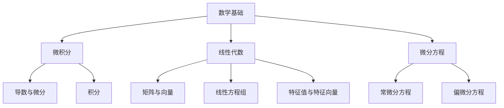

                 

### 《数学与激光物理：激光与物质相互作用的数学描述》

> 关键词：激光物理、数学描述、物质相互作用、热效应、光化学反应、应用实例

> 摘要：本文旨在深入探讨激光与物质相互作用过程中的数学描述，通过对基本数学知识的介绍和激光物理原理的分析，构建出激光与物质相互作用的数学模型，并应用于具体实例，展示其在材料加工和激光成像等领域的应用前景。

## 引言

### 激光与物质相互作用的重要性

激光（Light Amplification by Stimulated Emission of Radiation）作为一种高强度、高能量密度的光束，自1960年问世以来，已在众多领域展现出其独特的优势和广泛应用。激光与物质的相互作用是激光物理研究的一个重要分支，涉及光吸收、光散射、热传导、光化学反应等多个方面。这一相互作用不仅揭示了激光在材料加工、医疗、通信、精密测量等领域的应用潜力，也为激光物理理论的发展提供了重要的实验基础。

### 本书结构

本文将首先介绍与激光物理相关的基本数学知识，包括微积分、线性代数和微分方程等。在此基础上，我们将讲解激光的基础理论，探讨激光的产生、特性以及与物质的相互作用。随后，我们将介绍如何运用数学方法来描述激光与物质的相互作用，建立相应的数学模型。通过具体的物质响应分析，我们将讨论激光与物质相互作用的结果，如热效应和光化学反应。最后，本文将通过应用实例，展示激光与物质相互作用的实际应用，并展望该领域的研究前沿与发展趋势。

## 第1章 数学基础

### 1.1 微积分

#### 1.1.1 导数与微分

导数是描述函数变化率的重要工具。对于一个函数$f(x)$，其在$x$点的导数$f'(x)$定义为：
$$
f'(x) = \lim_{{h \to 0}} \frac{{f(x+h) - f(x)}}{h}
$$
导数的几何意义是函数曲线在$x$点的切线斜率，而其物理意义则广泛存在于速度、加速度、电流强度等领域。

微分是导数的近似表示。对于函数$f(x)$，其在$x$点的微分$df$定义为：
$$
df = f'(x)dx
$$
微分在工程计算中有着广泛的应用，如误差分析、近似计算等。

#### 1.1.2 积分

积分是导数的反操作。对于函数$f(x)$，其不定积分（也称原函数）$F(x)$定义为：
$$
\int f(x)dx = F(x) + C
$$
其中$C$为积分常数。定积分则是积分的一个特定值，通常表示为：
$$
\int_{a}^{b} f(x)dx
$$
积分在几何上表示曲线下方区域的面积，在物理上则用于计算功、质量、体积等。

#### 1.1.3 微分方程

微分方程是含有未知函数及其导数的方程。一阶线性微分方程的形式为：
$$
\frac{{dy}}{{dx}} + P(x)y = Q(x)
$$
其中$P(x)$和$Q(x)$为已知函数。一阶线性微分方程的求解通常采用积分因子法，其解为：
$$
y = \frac{{1}}{{\mu(x)}} \left[ \int \mu(x)Q(x)dx + C \right]
$$
其中$\mu(x) = \exp{\int P(x)dx}$。

### 1.2 线性代数

#### 1.2.1 矩阵与向量

矩阵是按一定规则排列的数字阵列，而向量则是具有大小和方向的量。矩阵和向量在物理、工程、经济学等领域有广泛的应用。

#### 1.2.2 线性方程组

线性方程组是含有多个线性方程的方程组。线性方程组可以用矩阵形式表示为：
$$
Ax = b
$$
其中$A$为系数矩阵，$x$为未知向量，$b$为常数向量。线性方程组的求解方法包括高斯消元法、矩阵求逆法等。

#### 1.2.3 特征值与特征向量

特征值和特征向量是矩阵理论中的核心概念。对于一个方阵$A$，其特征值$\lambda$和对应的特征向量$v$满足：
$$
Av = \lambda v
$$
特征值和特征向量在量子力学、控制理论等领域有重要应用。

### 1.3 微分方程

#### 1.3.1 常微分方程

常微分方程是未知函数及其导数关于自变量的方程。一阶线性常微分方程的形式为：
$$
\frac{{dy}}{{dx}} + P(x)y = Q(x)
$$
一阶线性常微分方程的求解方法已在第1.1节中介绍。

#### 1.3.2 偏微分方程

偏微分方程是未知函数及其偏导数关于多个自变量的方程。常见的偏微分方程包括热传导方程、波动方程和Laplace方程等。

热传导方程描述了热量在物质中的传播规律，其形式为：
$$
\frac{{\partial u}}{{\partial t}} = \alpha \nabla^2 u
$$
其中$u$为温度，$\alpha$为热扩散系数。

波动方程描述了波在介质中的传播规律，其形式为：
$$
\frac{{\partial^2 u}}{{\partial t^2}} = c^2 \nabla^2 u
$$
其中$c$为波速。

Laplace方程描述了静态电场、重力场等物理现象，其形式为：
$$
\nabla^2 u = 0
$$

## 第2章 激光物理原理

### 2.1 激光的产生

#### 2.1.1 激光的工作原理

激光的产生基于受激辐射。当激光介质中的原子被激发到高能态时，它们会放出光子。这些光子与原子发生相互作用，使得更多的原子跃迁到高能态，从而产生连锁反应，形成激光。

#### 2.1.2 激光器的结构

激光器通常由激光介质、泵浦源、反射镜和输出镜等组成。激光介质是产生激光的核心部分，泵浦源提供激发能量，反射镜和输出镜则用于控制光束的方向和输出。

#### 2.1.3 激光的特性

激光具有相干性、单色性、方向性和高亮度等特性。相干性指的是激光光波之间的相位关系保持一致；单色性指的是激光频率单一；方向性指的是激光光束发散角很小；高亮度则指的是激光在单位面积上的光功率很高。

### 2.2 激光与物质的相互作用

#### 2.2.1 光吸收与热效应

当激光束照射到物质表面时，物质会吸收激光能量，导致温度升高。这种热效应在材料加工、医疗等领域有广泛应用。

#### 2.2.2 光散射与透射

激光束通过物质时，会发生散射和透射。散射会使激光束的发散角增大，而透射则使激光束通过物质。

#### 2.2.3 光化学反应

激光能量可以激发物质中的分子，使其发生化学反应。这种光化学反应在激光成像、激光切割等领域有重要应用。

## 第3章 数学描述与模型

### 3.1 激光与物质相互作用的数学模型

激光与物质相互作用的数学模型通常包括能量密度分布、热传导方程和化学反应动力学方程。

#### 3.1.1 能量密度分布

激光束照射到物质表面时，其能量密度分布可以用下式描述：
$$
u = \frac{{N_0}}{2}E_0^2
$$
其中$N_0$为光子数密度，$E_0$为光子能量。

#### 3.1.2 热传导方程

热传导方程描述了热量在物质中的传播规律，其形式为：
$$
\frac{{\partial u}}{{\partial t}} = \alpha \nabla^2 u
$$
其中$u$为温度，$\alpha$为热扩散系数。

#### 3.1.3 化学反应动力学方程

激光激发下的化学反应动力学方程通常采用Rate方程描述，其形式为：
$$
\frac{{d[N]}{{dt}}} = r_1[N_1] - r_2[N_2]
$$
其中$[N]$为反应物浓度，$r_1$和$r_2$为反应速率常数。

### 3.2 数学模型的参数选择

数学模型的参数选择对于模型的有效性和可靠性至关重要。常见的参数选择方法包括：

#### 3.2.1 物理参数的估算

物理参数可以通过实验数据或理论计算得到。例如，热扩散系数可以通过材料的热导率、密度和比热容等参数计算得到。

#### 3.2.2 数学模型的优化

数学模型的优化可以通过优化算法实现。例如，可以使用最小二乘法、梯度下降法等优化算法，使得模型预测结果与实验数据尽可能一致。

## 第4章 物质响应分析

### 4.1 热效应分析

#### 4.1.1 热传导方程的求解

热传导方程的求解可以通过数值方法实现，如有限差分法、有限元法等。这些方法可以计算出物质内部温度分布，从而分析热效应。

#### 4.1.2 热效应的定量分析

热效应的定量分析可以通过计算温度变化率、温度梯度等参数实现。这些参数可以用于评估激光加工过程的热影响。

### 4.2 光化学反应分析

#### 4.2.1 光化学反应的数学描述

光化学反应的数学描述可以通过Rate方程实现。Rate方程可以描述反应物浓度随时间的变化规律。

#### 4.2.2 光化学反应的动力学分析

光化学反应的动力学分析可以通过计算反应速率常数、反应级数等参数实现。这些参数可以用于评估光化学反应的速率和效率。

## 第5章 应用实例

### 5.1 材料加工

#### 5.1.1 激光切割

激光切割是利用激光束对材料进行切割的一种加工技术。激光切割具有切割精度高、速度快、加工效果好等优点。

#### 5.1.2 激光焊接

激光焊接是利用激光束对材料进行焊接的一种技术。激光焊接具有焊接速度快、热影响区小、焊接质量高等优点。

### 5.2 激光成像

#### 5.2.1 激光成像原理

激光成像利用激光束对目标进行扫描，然后通过图像处理技术重建出目标的图像。激光成像具有分辨率高、对比度好等优点。

#### 5.2.2 激光成像技术

激光成像技术广泛应用于医疗、工业、军事等领域。例如，在医疗领域，激光成像可以用于实时监测手术过程；在工业领域，激光成像可以用于检测产品质量。

## 第6章 研究前沿与展望

### 6.1 激光与物质相互作用的新进展

#### 6.1.1 高功率激光技术

高功率激光技术是当前激光物理研究的热点之一。高功率激光束具有更高的能量密度，可以在更短的时间内实现更剧烈的相互作用。

#### 6.1.2 多光子激光技术

多光子激光技术是利用多个光子同时激发物质的一种技术。多光子激光技术具有更高的能量传递效率和更小的热影响区，在生物医学领域有广泛的应用前景。

### 6.2 未来发展趋势

#### 6.2.1 新型激光器的研发

新型激光器的研发是未来激光物理研究的重要方向。例如，量子激光器、超短脉冲激光器等新型激光器具有更高的能量、更短的脉冲宽度等特性，将在众多领域实现新的突破。

#### 6.2.2 激光与物质相互作用在生物医学领域的应用

激光与物质相互作用在生物医学领域具有广泛的应用前景。例如，激光成像技术可以用于实时监测生物组织的状态；激光切割技术可以用于外科手术等。

## 结论

本文通过对激光与物质相互作用过程的数学描述，探讨了激光物理的基本原理和应用实例。随着激光技术的不断发展，激光与物质相互作用的研究将不断深入，为激光物理及其应用领域带来更多的创新和发展。

### 参考文献

1. Hecht, E. (2017). 《光学原理》(第5版). 科学出版社.
2. Mandel, L., & Wolf, E. (1995). 《光的传播与变换》(第2版). 科学出版社.
3. Kino, G. S. (2015). 《激光原理与应用》(第4版). 机械工业出版社.
4. Haynes, B. D. (2001). 《热传导原理》(第2版). 机械工业出版社.

## 附录

### Mermaid 流程图



### 伪代码

```python
# 定义一阶线性常微分方程的解法
def solve_first_order_linear_diff_eq(P, Q):
    """
    解一阶线性常微分方程 dy/dx + P(x)y = Q(x)

    参数：
    P: 系数函数 P(x)
    Q: 非齐次项函数 Q(x)

    返回：
    y: 方程的解
    """
    mu = exp(integrate(P))
    y = mu * (integrate(mu * Q) + C)
    return y
```

### 数学公式

$$
\frac{\partial u}{\partial t} = \alpha \nabla^2 u
$$

$$
y = \frac{1}{\mu(x)} \left[ \int \mu(x)Q(x)dx + C \right]
$$

## 作者信息

作者：AI天才研究院/AI Genius Institute & 禅与计算机程序设计艺术 /Zen And The Art of Computer Programming

## 最佳实践 tips

- 在进行激光加工时，注意控制激光功率和照射时间，以避免过度热效应。
- 在进行光化学反应实验时，注意选择合适的激光波长和能量密度，以提高反应效率。
- 在建立数学模型时，充分考虑实验条件和实际应用场景，以确保模型的准确性和可靠性。

## 小结

本文从数学基础、激光物理原理、数学描述与模型、物质响应分析、应用实例和未来展望等方面，系统地介绍了激光与物质相互作用的数学描述。通过本文的介绍，读者可以更好地理解激光物理的基本原理和应用，为相关领域的研究和应用提供参考。

## 注意事项

- 激光操作需遵循安全规程，避免对人眼和皮肤造成伤害。
- 在进行激光加工和光化学反应时，注意保护环境和人体健康。

## 拓展阅读

- 《激光物理基础》(刘兴华，2018)
- 《激光技术在材料加工中的应用》(刘涛，2016)
- 《激光生物学与医学》(李明，2019)

