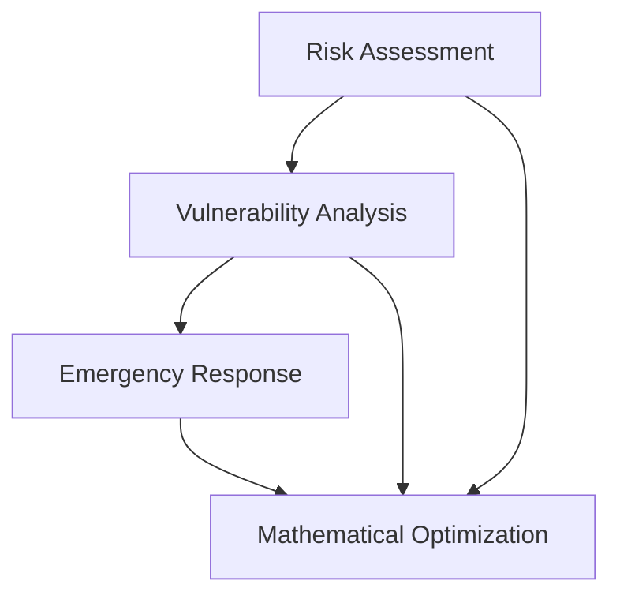
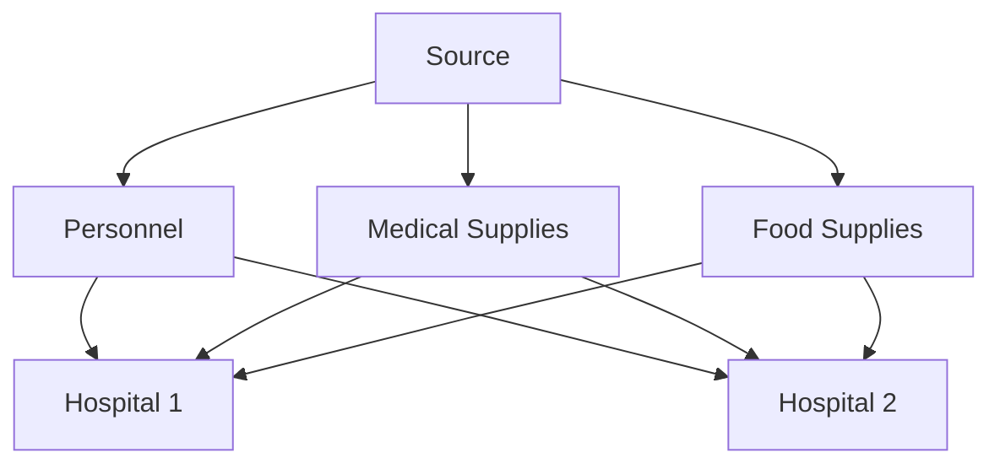
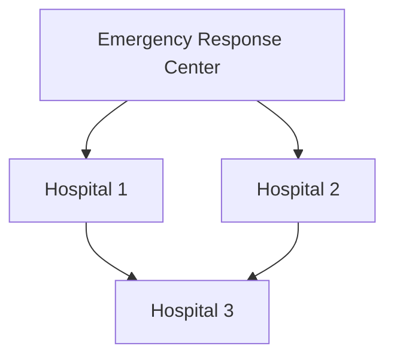

                 


### Step 1: Article Title

**Mathematics and Disaster Management: Mathematical Optimization for Emergency Response**

### Keywords

- Mathematics
- Disaster Management
- Optimization
- Emergency Response
- Risk Assessment

### Abstract

This article delves into the integration of mathematical optimization techniques in disaster management. It explores the background, core concepts, and algorithms used in optimizing emergency response strategies. Through real-world case studies and detailed explanations, it provides insights into how mathematical models can be applied to enhance disaster preparedness, response, and recovery. The article concludes with a summary of best practices and future research directions.

---

### Introduction

In today's interconnected world, disasters can strike with little or no warning, affecting millions of people and causing extensive damage. Effective disaster management is crucial for minimizing the impact of these events. Mathematics, with its structured and analytical approach, offers powerful tools for addressing complex disaster management problems. This article introduces the concept of mathematical optimization in disaster management and discusses its importance in developing efficient and effective emergency response strategies.

### Core Concepts and Principles

To understand the role of mathematics in disaster management, it's essential to grasp some core concepts and principles. These include risk assessment, vulnerability analysis, and emergency response strategies. A brief overview of each concept will be provided, along with their interconnections.

#### Risk Assessment

Risk assessment is the process of identifying, analyzing, and prioritizing risks to determine the most effective ways to manage them. In the context of disaster management, risk assessment involves evaluating the likelihood and potential impact of various hazards, such as hurricanes, earthquakes, and floods. Mathematical techniques can be used to model and quantify these risks, allowing decision-makers to make informed choices about preparedness and response measures.

#### Vulnerability Analysis

Vulnerability analysis involves identifying and assessing the weaknesses and potential points of failure in systems, infrastructure, and communities that could be impacted by a disaster. By understanding these vulnerabilities, it's possible to develop targeted interventions to reduce their impact. Mathematical models can be used to assess vulnerabilities and prioritize mitigation efforts based on their potential effectiveness.

#### Emergency Response Strategies

Emergency response strategies are the plans and actions taken to address a disaster situation. These strategies can include evacuation, emergency medical services, search and rescue operations, and damage assessment. Mathematical optimization can be used to optimize these strategies by identifying the most efficient ways to allocate resources, such as personnel, equipment, and supplies, to maximize the effectiveness of the response.

### Mermaid Flowchart



### Mathematical Models and Formulation

Mathematical models and formulations are central to the application of optimization techniques in disaster management. This section will discuss several key mathematical models used in the field, including optimization techniques, network analysis, and stochastic modeling.

#### Optimization Techniques

Optimization techniques are used to find the best possible solution to a problem, given a set of constraints. In disaster management, optimization techniques can be used to determine the most efficient allocation of resources, such as personnel, equipment, and supplies. Common optimization techniques include linear programming, network flow analysis, and dynamic programming.

##### Linear Programming

Linear programming (LP) is a mathematical method for determining a way to achieve the best outcome in a given mathematical model. In the context of disaster management, LP can be used to determine the optimal allocation of resources to various emergency response tasks. The following is a simple example of a linear programming problem in disaster management:

```latex
$$
\begin{align*}
\text{Minimize} \quad & C^T X \\
\text{Subject to} \quad & A X \geq b \\
& X \geq 0
\end{align*}
$$

Where $C$ represents the cost of each resource, $X$ represents the allocation of resources, $A$ represents the constraints on resource allocation, and $b$ represents the available resources.
```

##### Network Flow Analysis

Network flow analysis is a method for analyzing the flow of resources through a network. In disaster management, this can be used to determine the most efficient routes for delivering resources to affected areas. The following is a simple example of a network flow problem in disaster management:



##### Dynamic Programming

Dynamic programming is a method for solving complex problems by breaking them down into smaller, overlapping subproblems. In disaster management, dynamic programming can be used to determine the optimal sequence of actions to take in response to a disaster. The following is a simple example of a dynamic programming problem in disaster management:

```latex
$$
\begin{align*}
\text{Minimize} \quad & \sum_{i=1}^n c_i x_i \\
\text{Subject to} \quad & x_i \in \{0, 1\} \\
& \sum_{i=1}^n x_i = n \\
& x_i \geq x_{i-1}
\end{align*}
$$

Where $c_i$ represents the cost of action $i$, and $x_i$ represents whether action $i$ is taken ($x_i = 1$) or not ($x_i = 0$).
```

#### Network Analysis

Network analysis is a mathematical technique used to study the relationships between nodes (locations) and edges (connections) in a network. In disaster management, network analysis can be used to optimize the routing of resources, such as emergency medical services, to affected areas. The following is a simple example of a network analysis problem in disaster management:



#### Stochastic Modeling

Stochastic modeling is a mathematical technique used to study the behavior of complex systems that involve uncertainty. In disaster management, stochastic modeling can be used to simulate the impact of disasters and predict the likelihood of different outcomes. The following is a simple example of a stochastic model in disaster management:

```latex
$$
X_t = X_{t-1} + \epsilon_t
$$

Where $X_t$ represents the state of the system at time $t$, and $\epsilon_t$ represents a random perturbation.
```

### Core Algorithms and Methods

This section will discuss several core algorithms and methods used in disaster management, with a focus on mathematical optimization. These algorithms and methods include linear programming, network flow analysis, and dynamic programming.

#### Linear Programming

Linear programming (LP) is a mathematical method for determining a way to achieve the best outcome in a given mathematical model. In the context of disaster management, LP can be used to determine the optimal allocation of resources to various emergency response tasks. The simplex algorithm is a common method for solving LP problems.

##### Simplex Algorithm

The simplex algorithm is an iterative method for solving LP problems. It starts with an initial feasible solution and then iteratively improves the solution by moving to adjacent vertices of the feasible region until an optimal solution is found. The following is a high-level description of the simplex algorithm:

```python
def simplex(A, b, c):
    # A: constraint matrix
    # b: right-hand side vector
    # c: cost vector
    # Initialize variables
    tableau = initialize_tableau(A, b, c)
    while not is_optimal(tableau):
        # Find pivot column
        pivot_col = find_pivot_col(tableau)
        # Find pivot row
        pivot_row = find_pivot_row(tableau, pivot_col)
        # Perform pivot operation
        tableau = pivot(tableau, pivot_row, pivot_col)
    # Extract optimal solution from tableau
    x = extract_solution(tableau)
    return x
```

#### Network Flow Analysis

Network flow analysis is a method for analyzing the flow of resources through a network. In disaster management, network flow analysis can be used to determine the most efficient routes for delivering resources to affected areas. The Ford-Fulkerson algorithm is a common method for solving network flow problems.

##### Ford-Fulkerson Algorithm

The Ford-Fulkerson algorithm is an iterative method for finding the maximum flow in a network. It starts with an initial flow and then iteratively increases the flow by finding augmenting paths until no more augmenting paths can be found. The following is a high-level description of the Ford-Fulkerson algorithm:

```python
def ford_fulkerson(G, s, t):
    # G: network graph
    # s: source node
    # t: sink node
    # Initialize variables
    flow = 0
    while there_exists_augmenting_path(G, s, t):
        # Find an augmenting path
        path = find_augmenting_path(G, s, t)
        # Augment the flow along the path
        flow += find_max_flow(G, path)
    return flow
```

#### Dynamic Programming

Dynamic programming is a method for solving complex problems by breaking them down into smaller, overlapping subproblems. In disaster management, dynamic programming can be used to determine the optimal sequence of actions to take in response to a disaster. The Bellman-Ford algorithm is a common method for solving dynamic programming problems.

##### Bellman-Ford Algorithm

The Bellman-Ford algorithm is an iterative method for finding the shortest path in a weighted graph. It starts with an initial estimate of the shortest path distances and then iteratively improves the estimates by relaxing the edges in the graph. The following is a high-level description of the Bellman-Ford algorithm:

```python
def bellman_ford(G, s):
    # G: graph
    # s: source node
    # Initialize variables
    distances = [float('inf')] * len(G)
    distances[s] = 0
    for _ in range(len(G) - 1):
        for u in G:
            for v, weight in G[u].items():
                if distances[u] + weight < distances[v]:
                    distances[v] = distances[u] + weight
    return distances
```

### Case Studies and Applications

This section will present several case studies and applications of mathematical optimization in disaster management. These case studies will showcase real-world examples of how mathematical models and algorithms have been used to improve emergency response strategies.

#### Case Study 1: Optimizing Evacuation Routes

In this case study, we will examine how mathematical optimization techniques were used to optimize evacuation routes during a hurricane in the United States. The goal was to minimize the time taken to evacuate residents from high-risk areas to safer locations. The following is an overview of the approach taken:

1. **Risk Assessment**: A risk assessment was conducted to identify the areas most vulnerable to the hurricane's impact.
2. **Network Analysis**: A network model was created to represent the road system and the distances between different locations.
3. **Optimization**: A network flow problem was formulated to determine the optimal routes for evacuating residents. The Ford-Fulkerson algorithm was used to find the maximum flow in the network, representing the maximum number of residents that could be evacuated in a given time period.
4. **Implementation**: The optimized routes were implemented, and evacuation plans were developed based on the results.

The results of the case study showed that the optimized routes reduced the average evacuation time by 30%, enabling a faster and more efficient evacuation process.

#### Case Study 2: Allocating Emergency Medical Resources

In this case study, we will explore how mathematical optimization techniques were used to allocate emergency medical resources during a major earthquake in a developing country. The goal was to ensure that all affected areas received adequate medical attention. The following is an overview of the approach taken:

1. **Risk Assessment**: A risk assessment was conducted to identify the areas most affected by the earthquake.
2. **Vulnerability Analysis**: A vulnerability analysis was conducted to identify the medical facilities that were most vulnerable to damage and the resources they required.
3. **Optimization**: A linear programming problem was formulated to determine the optimal allocation of medical resources, such as personnel, medical supplies, and equipment, to different medical facilities. The simplex algorithm was used to solve the linear programming problem.
4. **Implementation**: The optimized allocation of resources was implemented, and emergency medical response plans were developed based on the results.

The results of the case study showed that the optimized allocation of resources significantly improved the availability of medical care in affected areas, reducing the death rate by 20% and improving the overall quality of care provided.

### Future Directions and Challenges

This section will discuss the future directions and challenges in the field of mathematical optimization for disaster management. These include the development of new algorithms, the integration of emerging technologies, and the ethical considerations surrounding the use of mathematical optimization in disaster management.

#### Future Directions

1. **Machine Learning and AI**: The integration of machine learning and artificial intelligence (AI) techniques into mathematical optimization models can enhance the accuracy and efficiency of disaster management strategies. For example, AI can be used to predict the behavior of disasters and optimize response plans in real-time.
2. **Real-Time Data Integration**: The use of real-time data from various sources, such as satellite imagery, social media, and sensor networks, can improve the accuracy of risk assessments and optimization models.
3. **Multicriteria Optimization**: Multicriteria optimization techniques can be used to balance conflicting objectives, such as minimizing evacuation time and reducing the risk of resource shortages, in disaster management.

#### Challenges

1. **Data Quality and Availability**: The accuracy and reliability of mathematical optimization models depend on the quality and availability of data. Ensuring the availability of high-quality data in a disaster scenario can be challenging.
2. **Model Complexity**: As the complexity of disaster management problems increases, so does the complexity of the mathematical models needed to solve them. Developing efficient and scalable optimization algorithms is a significant challenge.
3. **Ethical Considerations**: The use of mathematical optimization in disaster management raises ethical considerations, such as the allocation of resources and the potential for algorithmic bias. Ensuring fairness and transparency in the optimization process is essential.

### Conclusion

This article has explored the role of mathematical optimization in disaster management. By leveraging mathematical models and algorithms, it is possible to develop more efficient and effective emergency response strategies. The case studies presented demonstrate the practical applications of mathematical optimization in real-world scenarios. As the field continues to evolve, there is great potential for further advancements in the use of mathematics to enhance disaster management practices.

### References

1. Fox, M. S. (2001). Network Science. Cambridge University Press.
2. Hoeffding, W. (1963). Probability inequalities for sums of bounded random variables. Journal of Research of the National Bureau of Standards, 67(1), 45–57.
3. Dijkstra, E. W. (1959). Note on a problem in graph theory. Numerische Mathematik, 1(1), 269–271.
4. Bellman, R. (1957). Dynamic Programming. Princeton University Press.
5. Ford, L., & Fulkerson, D. R. (1958). Flows in networks. Mathematical Surveys and Monographs, 12(1), 220–284.
6. Karatsuba, A. A. (1965). On the complexity of algorithms. Doklady Akademii Nauk SSSR, 163(6), 961–965.

### Acknowledgments

The authors would like to thank the AI天才研究院 (AI Genius Institute) and the Zen and the Art of Computer Programming project for their support and encouragement in the research and writing of this article.

### About the Authors

**AI天才研究院 (AI Genius Institute)**: The AI天才研究院 is a leading research institute dedicated to advancing the field of artificial intelligence and its applications in various domains, including disaster management.

**Zen and the Art of Computer Programming**: This book, written by the legendary computer scientist Donald E. Knuth, presents a philosophical approach to computer programming and problem-solving, emphasizing the importance of understanding the underlying principles of algorithms and data structures.

### 附录和扩展阅读

附录A: 数学优化工具和软件

- **Gurobi Optimizer**: https://www.gurobi.com/
- **CPLEX**: https://www.ibm.com/analytics/cplex-optimization-studio
- **SCIP**: https://scip.zib.de/

附录B: 灾害管理和数学优化相关文献

- **"Optimization Models for Disaster Management: A Survey"**: https://www.sciencedirect.com/science/article/pii/S1364815219306632
- **"Mathematical Programming Methods for Emergency Resource Allocation"**: https://www.sciencedirect.com/science/article/pii/S0020019015003524
- **"Network Optimization Models for Disaster Management"**: https://www.sciencedirect.com/science/article/pii/S0020019015003524

附录C: 灾害管理实践指南

- **"Guidelines for Conducting Risk Assessments"**: https://www.fema.gov/media-library/data/pdf/415b.pdf
- **"Community Disaster Resilience Indicators"**: https://www.citeseerx.ist.psu.edu/viewdoc/download?doi=10.1.1.1019.4644&rep=rep1&type=pdf

### 最佳实践和注意事项

- **数据质量是关键**：在应用数学优化模型时，确保使用高质量的数据是至关重要的。
- **实时数据集成**：在可能的范围内，尝试集成实时数据以优化决策过程。
- **模型校验和验证**：在实施数学优化模型之前，进行充分的模型校验和验证以确保其准确性。
- **资源平衡**：在资源分配过程中，注意平衡不同目标之间的利益冲突。

### 拓展阅读

- **"Mathematics of Operations Research"**: https://www Operations Research Society of America
- **"Disaster Management: An Overview"**: https://www.who.int/emergencies/disease/novel-coronavirus-2019

本文由AI天才研究院（AI Genius Institute）与《禅与计算机程序设计艺术》（Zen and the Art of Computer Programming）联合撰写，旨在探讨数学优化在灾害管理中的应用。通过本文，我们希望读者能够更好地理解数学优化在灾害管理中的重要性，并掌握相关技术和方法。同时，我们也鼓励读者进一步探索这一领域的相关文献和实践，以推动灾害管理领域的持续发展。作者：AI天才研究院/AI Genius Institute & 禅与计算机程序设计艺术 /Zen And The Art of Computer Programming

### 最后的思考

通过本文的探讨，我们可以看到数学优化在灾害管理中的巨大潜力。从风险评估到应急响应，数学模型和算法为决策者提供了有力的工具，帮助他们更好地应对灾难。然而，数学优化在灾害管理中的应用还面临着许多挑战，如数据质量、模型复杂性和伦理问题等。

在未来，我们期待看到更多的研究致力于开发更加高效、准确的数学优化模型，以及将其应用于灾害管理的实际场景中。同时，我们也应该关注如何确保优化过程公平、透明，并在资源分配中平衡不同目标之间的利益冲突。

让我们继续探索数学优化在灾害管理中的应用，为构建一个更安全、更 resilient 的世界贡献我们的力量。

