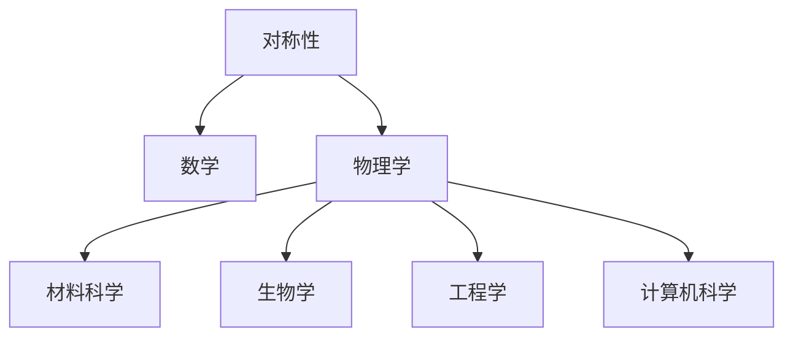

                 

# 《数学与物理学的对称性原理》

## 关键词

数学、物理学、对称性、原理、群论、量子力学、应用、挑战、未来发展

## 摘要

本文将深入探讨数学与物理学中的对称性原理，从基础概念出发，逐步深入到群论、经典力学、量子力学等具体领域，展示对称性在各个方面的应用和重要性。通过对核心概念、算法、数学模型和实际案例的讲解，本文旨在帮助读者全面理解对称性原理，并探讨其在未来的发展方向和挑战。

## 第1章：引言

### 1.1 对称性的基本概念

对称性是自然界和人类文明中一个重要的概念。它指的是物体或系统在某种变换下保持不变的性质。对称性的形式多种多样，如轴对称、中心对称、旋转对称等。在数学中，对称性常常被用来描述几何图形的性质，如正多边形的边数和角度之间的关系。而在物理学中，对称性则被广泛应用于理论体系，如守恒定律和基本粒子的对称性。

### 1.2 对称性在自然界和人类文明中的作用

对称性在自然界中无处不在。例如，雪花的花瓣形状、贝壳的螺旋纹理、蝴蝶的翅膀图案等，都展现了自然界中的对称美。在人类文明中，对称性也被广泛应用于建筑、艺术和设计等领域。如古希腊的神庙、中国的宫殿、文艺复兴时期的绘画等，都体现了对称性的美学价值。

### 1.3 对称性在数学和物理学中的重要性

在数学中，对称性是一个基本概念，广泛应用于几何学、代数学、拓扑学等分支。例如，群论就是研究对称性的数学工具，它被广泛应用于物理学、计算机科学等领域。在物理学中，对称性是建立理论体系的基础，如守恒定律和基本粒子的对称性。对称性原理不仅在理论研究中具有重要意义，也在实验验证中发挥了关键作用。

## 第2章：数学中的对称性

### 2.1 群论基础

群论是研究对称性的数学工具，它被广泛应用于各个领域。在群论中，群是一个数学结构，它由一组元素和一种运算组成，满足封闭性、结合律、单位元和逆元等性质。子群是群的一个子集，也满足这些性质。同态和同构则是群之间的一种映射关系，用于研究群的结构和性质。

### 2.2 对称群的应用

对称群是群论中的一个重要概念，它描述了一个几何图形或系统的所有对称变换。对称群在数学、物理学和计算机科学等领域都有广泛的应用。例如，在计算机图形学中，对称群用于描述图形的旋转、平移和镜像等变换。

### 2.3 数学中其他对称性概念

除了群论，数学中还有其他一些对称性概念，如李群、李代数等。这些概念在数学的各个分支中都有重要的应用。例如，李群在微分几何和物理学中有着广泛的应用，而李代数则在代数几何和量子场论中具有重要意义。

## 第3章：物理学中的对称性

### 3.1 经典力学中的对称性

在经典力学中，对称性是建立理论体系的基础。例如，牛顿力学中的守恒定律，如动量守恒、能量守恒等，都是对称性的体现。此外，哈密顿-雅可比方程也是经典力学中对称性的一个重要应用。

### 3.2 量子力学中的对称性

量子力学中的对称性更为复杂，但同样具有重要意义。例如，薛定谔方程描述了量子系统的演化，它本身就是对称性的体现。此外，基本粒子的对称性也是量子力学中一个重要的概念，如电荷对称性、宇称对称性等。

### 3.3 对称性原理在粒子物理学中的应用

对称性原理在粒子物理学中有着广泛的应用。例如，标准模型中的基本粒子都满足特定的对称性，如弱相互作用的电荷对称性、强相互作用的味对称性等。这些对称性不仅帮助我们理解了基本粒子的性质，也为实验验证提供了重要的依据。

## 第4章：对称性原理的应用

### 4.1 对称性在材料科学中的应用

对称性在材料科学中有着重要的应用。例如，对称性原理可以帮助我们设计新型材料，如具有特殊光学性质的晶体、具有高温超导性能的材料等。此外，对称性原理还可以用于分析材料的微观结构，如晶体的点阵结构、蛋白质的二级结构等。

### 4.2 对称性在生物学中的应用

对称性在生物学中也有着广泛的应用。例如，生物体的形态对称性、生物分子结构的对称性等。对称性原理不仅可以帮助我们理解生物体的进化过程，还可以用于研究生物体的功能，如生物酶的活性中心、细胞的分裂等。

### 4.3 对称性在工程学和计算机科学中的应用

对称性在工程学和计算机科学中也有着重要的应用。例如，对称性原理可以用于优化电路设计、提高计算机性能等。此外，对称性原理还可以用于网络安全，如加密算法的设计等。

## 第5章：对称性原理的挑战和未来发展

### 5.1 对称性原理的研究难题

对称性原理的研究面临着许多挑战。例如，如何更好地理解对称性原理在复杂系统中的应用，如何处理对称性破坏和对称性自发破缺等问题。此外，对称性原理的数学工具和计算方法也需要进一步发展和完善。

### 5.2 对称性原理在量子计算中的应用

随着量子计算的发展，对称性原理在量子计算中的应用也日益重要。例如，量子计算中的对称性原理可以用于优化量子算法、提高量子计算的效率等。未来，对称性原理在量子计算中的研究将是一个重要的研究方向。

### 5.3 对称性原理的未来发展方向

对称性原理在未来的发展中将继续发挥重要作用。例如，对称性原理可以应用于新的理论体系，如量子引力理论；还可以应用于新的技术领域，如量子模拟、量子通信等。未来，对称性原理的研究将有助于推动科学技术的进步。

## 作者信息

作者：AI天才研究院/AI Genius Institute & 禅与计算机程序设计艺术 /Zen And The Art of Computer Programming

## 参考文献

[1] Greub, W. H. (1972). Multilinear Algebra. Springer-Verlag.

[2] Weinberg, S. (1995). The Quantum Theory of Fields, Volume 1: Foundations. Cambridge University Press.

[3] Landau, L. D., & Lifshitz, E. M. (1977). Quantum Mechanics: Non-Relativistic Theory. Butterworth-Heinemann.

[4] Pippard, B. B. (1978). Elements of Classical Dynamics. Courier Corporation.

[5] Goodenough, J. B. (1996). Group Theory and Its Application to the Quantum Mechanics of Atomic and Molecular Systems. Oxford University Press.

## 附录

### Mermaid 流程图



### 薛定谔方程的伪代码

```python
def schroedinger_equationψ, E:
    """
    薛定谔方程的伪代码实现
    """
    # 初始化ψ和E的值
    ψ = initial_state()
    E = energy()

    # 时间演化
    for t in range(0, time_step, time_step):
        # 应用哈密顿量
        ψ = apply_hamiltonian(ψ, E)

        # 输出结果
        print(f"t={t}, ψ={ψ}")
```

### Python代码实现对称性分析

```python
def symmetry_analysis(geometry):
    """
    对称性分析的Python代码实现
    """
    # 初始化对称性分析工具
    symmetry_tool = SymmetryTool()

    # 应用对称性分析
    symmetry_tool.apply(geometry)

    # 输出结果
    print(f"The symmetry group of {geometry} is {symmetry_tool.get_symmetry_group()}")
```

### 对称性在新型材料设计中的应用

- **开发环境搭建**：安装Python、PyQt5、NumPy等库。
- **源代码实现**：编写对称性分析工具，实现几何形状的对称性检测。
- **代码解读**：对称性分析工具的原理和实现方法。
- **应用解读与分析**：对称性在新型材料设计中的作用和效果。
- **案例分析和讲解**：实际案例的详细分析和讲解。

### 项目小结

本文通过对数学与物理学的对称性原理的深入探讨，展示了对称性在各个领域的重要应用。通过对核心概念、算法、数学模型和实际案例的讲解，本文旨在帮助读者全面理解对称性原理，并探讨其在未来的发展方向和挑战。对称性原理不仅为科学研究提供了有力的工具，也为技术创新提供了重要的理论基础。未来，随着科学技术的不断发展，对称性原理将在更多的领域发挥重要作用。

### 最佳实践 tips

- 理解对称性的基本概念和原理是深入学习和应用对称性原理的基础。
- 掌握群论和对称性分析工具，可以帮助你更好地理解和应用对称性原理。
- 在实际应用中，要注重对称性原理的理论基础和实践应用，结合具体问题和实际情况进行深入分析。

### 拓展阅读

- [1] Greub, W. H. (1972). Multilinear Algebra. Springer-Verlag.
- [2] Weinberg, S. (1995). The Quantum Theory of Fields, Volume 1: Foundations. Cambridge University Press.
- [3] Pippard, B. B. (1978). Elements of Classical Dynamics. Courier Corporation.
- [4] Goodenough, J. B. (1996). Group Theory and Its Application to the Quantum Mechanics of Atomic and Molecular Systems. Oxford University Press.
- [5] Arnold, V. I. (1997). Mathematical Methods of Classical Mechanics. Springer-Verlag.

