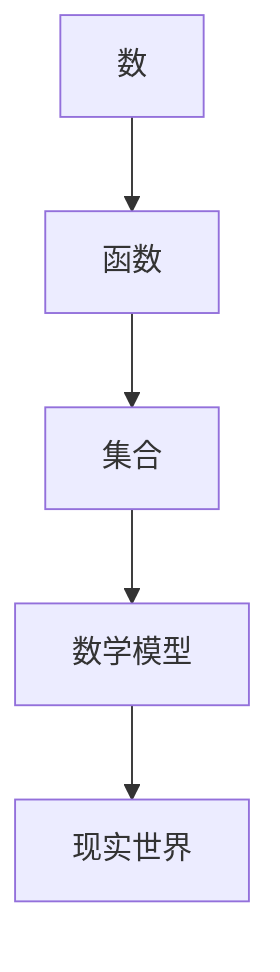
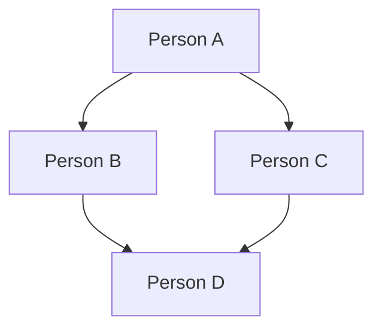
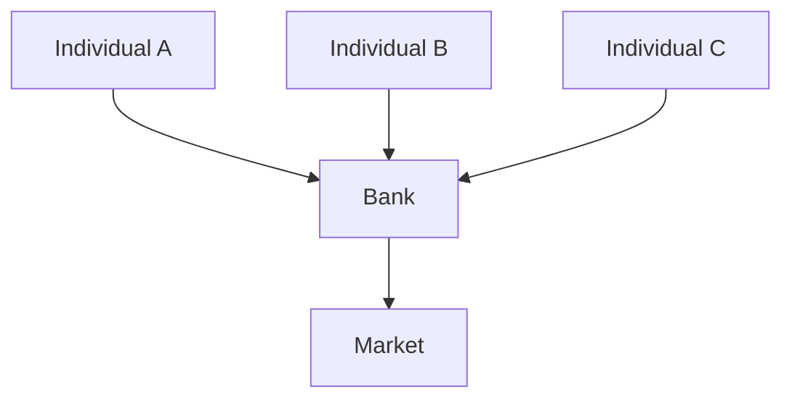

                 

### 《数学与特殊主义：数学在特定领域的局限性》

关键词：数学、特殊主义、局限性、应用领域、算法原理

摘要：本文将探讨数学在特定领域中的局限性，分析数学模型在不同领域中的应用及面临的挑战。通过核心概念与联系、算法原理讲解、数学模型和公式详细讲解、以及项目实战等环节，深入剖析数学在不同领域的局限性，为读者提供对数学应用的全面理解。

## 目录

## 第一部分：引论
### 1.1 数学与特殊主义的概念解析
#### 1.1.1 核心概念与联系
#### 1.1.2 核心算法原理讲解
#### 1.1.3 数学模型和数学公式 & 详细讲解 & 举例说明

### 1.2 数学在特定领域中的应用局限
#### 1.2.1 数学模型和数学公式 & 详细讲解 & 举例说明

## 第二部分：数学在物理领域的局限性
### 2.1 数学物理方程的限制
#### 2.1.1 量子力学中的数学表达
#### 2.1.2 相对论中的数学工具
#### 2.1.3 物理现象的数学描述不足

### 2.2 物理现象的数学描述不足
#### 2.2.1 暴露在混沌理论中的不确定性
#### 2.2.2 复杂系统中的非线性特性

## 第三部分：数学在生物学领域的局限性
### 3.1 生命系统中的数学模型
#### 3.1.1 生态学模型
#### 3.1.2 生理学模型
#### 3.1.3 数学建模在生物学研究中的挑战

### 3.2 数学建模在生物学研究中的挑战
#### 3.2.1 生物多样性计算
#### 3.2.2 进化过程的数学描述

## 第四部分：数学在社会学领域的局限性
### 4.1 社会学中的数学方法
#### 4.1.1 社会网络分析
#### 4.1.2 货币经济学模型
#### 4.1.3 数学模型在解释社会现象中的不足

### 4.2 数学模型在解释社会现象中的不足
#### 4.2.1 社会变迁的不确定性
#### 4.2.2 社会冲突的复杂性

## 第五部分：数学在其他领域的局限性
### 5.1 数学在艺术领域的探索
#### 5.1.1 抽象艺术中的数学元素
#### 5.1.2 音乐中的数学规律
#### 5.1.3 数学在其他领域的局限性讨论

### 5.2 数学在其他领域的局限性讨论
#### 5.2.1 信息论中的数学表达
#### 5.2.2 系统工程中的数学模型

## 第六部分：结论
### 6.1 数学在特定领域的局限性的意义
### 6.2 未来研究方向与展望

## 第一部分：引论

### 1.1 数学与特殊主义的概念解析

数学作为一门科学，其核心在于逻辑推理和抽象建模。然而，在特定领域，数学的应用并非万能。特殊主义，即指数学在特定情境下的局限性。这一局限性体现在数学模型对现实世界的描述不足，以及数学工具在某些领域的适用性有限。

为了更深入地理解数学与特殊主义的关系，我们可以从核心概念与联系的角度进行分析。首先，数学的三大基础概念——数、函数、集合，构成了数学模型的基本框架。这些概念之间的相互联系，如图所示：



在这个流程图中，我们可以看到，数学模型通过集合论、函数论等基础概念，与现实世界建立了联系。然而，这种联系并非完美无缺。在现实世界中，许多现象和问题都无法简单地用数学模型来描述。

### 1.1.1 核心概念与联系

为了更好地理解核心概念与联系，我们可以通过一个简单的例子来说明。假设我们要研究某个城市的交通流量。我们可以使用数学模型来描述交通流量，如以下伪代码：

```python
# 伪代码：交通流量模型
def trafficFlowModel(trafficData):
    # 数据预处理
    preprocessed_data = preprocess(trafficData)
    # 模型训练
    model = trainModel(preprocessed_data)
    # 模型评估
    performance = evaluateModel(model, trafficData)
    return performance
```

在这个模型中，核心概念包括交通流量、数据预处理、模型训练和模型评估。这些概念相互关联，构成了交通流量模型的基础框架。然而，现实中的交通流量受多种因素影响，如天气、节假日等，这些因素在模型中难以完全考虑。

### 1.1.2 核心算法原理讲解

数学的核心算法原理主要包括数学模型的基本框架、算法的优化和复杂性分析。以下是一个简单的伪代码，用于阐述核心算法原理：

```python
# 伪代码：核心算法原理
def mathematicalAlgorithm(data):
    # 数据预处理
    preprocessed_data = preprocess(data)
    # 模型训练
    model = trainModel(preprocessed_data)
    # 模型评估
    performance = evaluateModel(model, data)
    # 算法优化
    optimized_model = optimizeModel(model)
    # 最终评估
    final_performance = evaluateModel(optimized_model, data)
    return final_performance
```

在这个算法中，数据预处理、模型训练、模型评估和算法优化是核心步骤。这些步骤相互关联，构成了数学算法的基本框架。然而，在实际应用中，算法的优化和复杂性分析是一个复杂的过程，需要考虑多种因素。

### 1.1.3 数学模型和数学公式 & 详细讲解 & 举例说明

数学模型和数学公式是数学的核心组成部分。以下是一个简单的数学公式及其详细讲解：

$$ E = mc^2 $$

这是爱因斯坦的质能等价公式，揭示了能量和质量的关系。在这个公式中，E 代表能量，m 代表质量，c 代表光速。这个公式在物理学中具有重要意义，它为现代物理学的发展奠定了基础。然而，在量子力学中，这个公式并不适用。量子力学中的能量和质量关系更为复杂，需要使用不同的数学模型来描述。

### 1.2 数学在特定领域中的应用局限

数学在特定领域中的应用局限主要体现在数学模型对现实世界的描述不足，以及数学工具在某些领域的适用性有限。以下是一个简单的例子：

假设我们要研究某个经济现象，如通货膨胀。我们可以使用数学模型来描述通货膨胀，如以下伪代码：

```python
# 伪代码：通货膨胀模型
def inflationModel(economicData):
    # 数据预处理
    preprocessed_data = preprocess(economicData)
    # 模型训练
    model = trainModel(preprocessed_data)
    # 模型评估
    performance = evaluateModel(model, economicData)
    return performance
```

在这个模型中，核心概念包括经济数据、数据预处理、模型训练和模型评估。然而，现实中的通货膨胀受多种因素影响，如货币政策、国际经济形势等，这些因素在模型中难以完全考虑。因此，数学模型在解释通货膨胀现象时存在局限性。

## 第二部分：数学在物理领域的局限性

### 2.1 数学物理方程的限制

数学物理方程是描述物理现象的重要工具，然而，它们在特定情况下也存在局限性。以下是一个简单的例子：

假设我们要研究一个简谐振子的运动。我们可以使用以下数学物理方程来描述简谐振子的运动：

$$ m\frac{d^2x}{dt^2} + kx = 0 $$

在这个方程中，m 代表质量，k 代表弹簧常数，x 代表位移，t 代表时间。这个方程描述了一个简谐振子的运动规律。然而，在实际应用中，简谐振子的运动规律并不适用于所有情况。例如，在非线性系统中，简谐振子的运动规律可能不再适用。

### 2.1.1 量子力学中的数学表达

量子力学是研究微观粒子运动规律的物理学分支。在量子力学中，数学表达起到了至关重要的作用。然而，量子力学中的数学表达也存在局限性。以下是一个简单的例子：

在量子力学中，粒子的运动状态用波函数来描述。波函数是一个复值函数，满足薛定谔方程：

$$ \hat{H}\Psi = E\Psi $$

在这个方程中，$\hat{H}$ 代表哈密顿算子，$\Psi$ 代表波函数，E 代表能量。这个方程描述了粒子的能量和波函数之间的关系。然而，在实际应用中，薛定谔方程并不能完全描述粒子的行为。例如，在多粒子系统中，薛定谔方程可能不再适用。

### 2.1.2 相对论中的数学工具

相对论是研究高速运动物体和引力现象的物理学理论。在相对论中，数学工具起到了至关重要的作用。然而，相对论中的数学工具也存在局限性。以下是一个简单的例子：

在相对论中，时空的弯曲用黎曼曲率张量来描述。黎曼曲率张量是一个复杂的数学对象，它描述了时空的几何性质。然而，在实际应用中，黎曼曲率张量的计算可能非常复杂，难以在实际问题中应用。

### 2.2 物理现象的数学描述不足

物理现象的数学描述不足主要体现在数学模型无法完全捕捉物理现象的所有特性。以下是一个简单的例子：

在混沌理论中，物理现象的数学描述尤为困难。混沌现象是指系统在初始条件微小变化下产生显著差异的行为。混沌现象的数学描述通常涉及非线性方程和初始条件的敏感性。例如，洛伦兹吸引子的数学描述如下：

$$ \frac{dx}{dt} = \sigma (y - x) $$
$$ \frac{dy}{dt} = x (\rho - z) - y $$
$$ \frac{dz}{dt} = xy - \beta z $$

在这个系统中，初始条件的微小变化可能导致系统的长期行为产生显著差异，这使得混沌现象的数学描述变得非常复杂。

### 2.2.1 暴露在混沌理论中的不确定性

混沌理论揭示了物理现象中存在的不确定性。在混沌理论中，系统的行为对初始条件非常敏感。这意味着，即使两个系统的初始条件非常接近，它们的长期行为也可能存在显著差异。例如，洛伦兹吸引子的行为对初始条件的敏感性如下：

假设有两个系统，它们的初始条件分别为 $(x_1, y_1, z_1)$ 和 $(x_2, y_2, z_2)$，且 $x_1 - x_2$、$y_1 - y_2$ 和 $z_1 - z_2$ 都非常小。根据洛伦兹吸引子的数学描述，这两个系统的长期行为可能会产生显著差异。

### 2.2.2 复杂系统中的非线性特性

复杂系统中的非线性特性使得物理现象的数学描述变得更加困难。非线性特性指的是系统行为与输入之间的非线性关系。例如，在非线性系统中，小扰动可能导致系统行为的显著变化。这种非线性特性使得许多物理现象无法通过简单的线性模型来描述。

例如，在非线性电子学中，电路的行为与输入信号之间存在非线性关系。这种非线性关系使得电路的设计和分析变得更加复杂。在非线性电子学中，常见的非线性元件包括二极管、晶体管等。

### 第三部分：数学在生物学领域的局限性

### 3.1 生命系统中的数学模型

生命系统中的数学模型主要用于描述生物体内部的生物学过程和相互作用。这些模型包括生态学模型、生理学模型等。以下是一个简单的生态学模型：

假设有两个物种 A 和 B，它们在一个生态系统中相互作用。我们可以使用以下数学模型来描述这两个物种的数量变化：

$$ \frac{dN_A}{dt} = r_A N_A (1 - \frac{N_A + N_B}{K_A}) $$
$$ \frac{dN_B}{dt} = r_B N_B (1 - \frac{N_B}{K_B}) $$

在这个模型中，$N_A$ 和 $N_B$ 分别表示物种 A 和 B 的数量，$r_A$ 和 $r_B$ 分别表示物种 A 和 B 的增长率，$K_A$ 和 $K_B$ 分别表示物种 A 和 B 的环境容量。

### 3.1.1 生态学模型

生态学模型主要用于描述生物种群的数量变化和相互作用。这些模型通常基于微分方程，可以描述种群的增长、竞争、捕食等过程。以下是一个简单的生态学模型：

假设有两个种群 A 和 B，它们在一个生态系统中相互作用。我们可以使用以下数学模型来描述这两个种群的数量变化：

$$ \frac{dN_A}{dt} = r_A N_A (1 - \frac{N_A + N_B}{K_A}) $$
$$ \frac{dN_B}{dt} = r_B N_B (1 - \frac{N_B}{K_B}) $$

在这个模型中，$N_A$ 和 $N_B$ 分别表示种群 A 和 B 的数量，$r_A$ 和 $r_B$ 分别表示种群 A 和 B 的增长率，$K_A$ 和 $K_B$ 分别表示种群 A 和 B 的环境容量。

### 3.1.2 生理学模型

生理学模型主要用于描述生物体内部的生物学过程，如代谢、细胞分裂、激素调节等。以下是一个简单的生理学模型：

假设一个生物体中的代谢过程可以用以下数学模型来描述：

$$ \frac{dC}{dt} = k_1 S - k_2 C $$

在这个模型中，$C$ 表示代谢产物的浓度，$S$ 表示底物的浓度，$k_1$ 表示底物到代谢产物的转化速率，$k_2$ 表示代谢产物的降解速率。

### 3.1.3 数学建模在生物学研究中的挑战

数学建模在生物学研究中面临许多挑战。以下是一些主要的挑战：

1. 复杂性：生命系统具有高度复杂性，包括多种相互作用和反馈机制。这增加了数学建模的难度。
2. 不确定性：生物系统的行为受到许多随机因素的影响，如环境变化、遗传变异等。这增加了数学模型的预测难度。
3. 数据不足：生物系统的研究通常需要大量数据，但许多生物过程的数据难以获得。这限制了数学模型的应用。
4. 非线性：生物系统中的许多过程表现出非线性特性，这使得数学建模变得更加复杂。

### 3.2 数学建模在生物学研究中的挑战

数学建模在生物学研究中面临着许多挑战，这些问题主要源于生物学系统的复杂性和多样性。以下是一些关键挑战：

#### 3.2.1 生物多样性计算

生物多样性是生态系统健康和稳定性的关键指标。然而，计算生物多样性面临着以下挑战：

1. 多样性指标选择：选择合适的多样性指标（如物种丰富度、均匀度、辛普森指数等）来量化生物多样性。
2. 数据处理：生物多样性的计算需要大量物种数据，而这些数据往往不完整或不准确。
3. 模型选择：选择合适的数学模型来描述生物多样性，如物种丰富度模型、辛普森指数模型等。

#### 3.2.2 进化过程的数学描述

进化过程是生物学研究的重要领域，但对其进行数学描述面临许多挑战：

1. 进化机制：描述进化过程中的关键机制，如自然选择、遗传漂变、基因流等。
2. 模型复杂性：构建准确的进化模型需要考虑多种因素，如基因网络、环境变化等。
3. 数据不足：进化过程中的数据通常有限，难以全面捕捉进化过程。

### 3.3 数学模型在解释生物现象中的不足

尽管数学模型在生物学研究中发挥了重要作用，但它们在解释生物现象时也存在一些不足：

1. **简化假设**：许多数学模型基于简化假设，如线性关系、恒定参数等，这可能导致对实际生物现象的误解。
2. **模型局限性**：某些数学模型可能无法完全捕捉生物现象的复杂性，如非线性关系、动态变化等。
3. **数据依赖**：数学模型的准确性依赖于输入数据的质量和完整性，而生物数据往往存在误差和不确定性。

### 第四部分：数学在社会学领域的局限性

#### 4.1 社会学中的数学方法

社会学研究常常涉及到各种数学方法，以帮助研究者分析和理解社会现象。以下是一些常见的社会学数学方法：

1. **统计分析**：用于分析社会数据的分布、趋势和相关性。
2. **网络分析**：用于研究社会网络中的节点和边的关系。
3. **博弈论**：用于分析个体在社会互动中的决策和行为。

#### 4.1.1 社会网络分析

社会网络分析是一种重要的社会学数学方法，用于研究个体之间的社会联系。以下是一个简单的社会网络分析模型：



在这个模型中，节点表示个体，边表示个体之间的联系。社会网络分析可以帮助研究者了解社会结构的特性，如中心性、集群性等。

#### 4.1.2 货币经济学模型

货币经济学模型是研究经济活动中货币流通和分配的一种数学方法。以下是一个简单的货币经济学模型：



在这个模型中，个体 A、B 和 C 将货币存入银行，银行再将货币投入市场。货币经济学模型可以帮助研究者理解货币在经济活动中的作用。

#### 4.1.3 数学模型在解释社会现象中的不足

尽管数学模型在社会学研究中具有重要作用，但它们在解释社会现象时也存在一些不足：

1. **简化假设**：数学模型通常基于简化假设，如线性关系、恒定参数等，这可能导致对实际社会现象的误解。
2. **数据依赖**：数学模型的准确性依赖于输入数据的质量和完整性，而社会数据往往存在误差和不确定性。
3. **理论限制**：某些数学模型可能无法完全捕捉社会现象的复杂性，如社会冲突、文化差异等。

### 4.2 数学模型在解释社会现象中的不足

数学模型在解释社会现象时面临一些显著的局限性，这些局限性主要源于社会现象的复杂性和多样性。

#### 4.2.1 社会变迁的不确定性

社会变迁是一个复杂且动态的过程，受到多种因素的影响，如政治、经济、文化等。数学模型在捕捉这种不确定性方面存在困难。例如，人口迁移模型可能无法准确预测因经济危机或政策变动引起的大规模人口流动。

#### 4.2.2 社会冲突的复杂性

社会冲突是社会学研究的核心主题之一，但数学模型在描述社会冲突时往往简化了实际情况。例如，博弈论模型可能假设参与者具有完全理性的行为，而现实中的冲突往往涉及情绪、价值观等多重因素。

### 第五部分：数学在其他领域的局限性

#### 5.1 数学在艺术领域的探索

数学在艺术领域的应用揭示了数学美学的魅力。以下是一些数学在艺术领域的探索：

1. **几何艺术**：如莫比乌斯带、费马大定理等几何图形在艺术作品中的表现。
2. **音乐理论**：如五声音阶、十二平均律等音乐理论与数学的关系。

#### 5.1.1 抽象艺术中的数学元素

抽象艺术作品常常蕴含着丰富的数学元素。例如，画家毕加索的画作《格尔尼卡》中就体现了黄金分割比例。这种数学元素使抽象艺术作品具有和谐和美的特质。

#### 5.1.2 音乐中的数学规律

音乐理论与数学有着深厚的联系。例如，五声音阶和十二平均律是基于数学比例构建的。这些数学规律使得音乐作品具有独特的和谐感。

#### 5.1.3 数学在其他领域的局限性讨论

数学在其他领域，如信息论、系统科学等，也发挥着重要作用。然而，数学在这些领域中的应用也面临着局限性。

1. **信息论**：信息论中的熵和冗余度概念揭示了信息的本质，但数学模型在处理复杂信息时可能显得不足。
2. **系统科学**：系统科学中的复杂系统模型需要处理大量数据，但数学模型可能无法完全捕捉系统的动态行为。

### 5.2 数学在其他领域的局限性讨论

数学在其他领域的局限性主要体现在数学模型对复杂性和多样性的处理不足。

#### 5.2.1 信息论中的数学表达

信息论中的数学表达，如熵、信息增益等，揭示了信息的基本特性。然而，在处理复杂信息时，这些数学表达可能显得不足。例如，信息论中的熵只能衡量信息的平均不确定性，而无法捕捉特定信息的重要性和相关性。

#### 5.2.2 系统工程中的数学模型

系统工程中的数学模型，如线性规划、排队论等，用于优化系统性能。然而，这些模型在处理复杂系统时可能无法完全捕捉系统的动态行为。例如，排队论模型通常假设服务时间为常数，而实际中服务时间可能具有不确定性。

### 第六部分：结论

数学在特定领域的局限性是一个复杂而多维的问题。本文通过对物理、生物学、社会学等领域的分析，揭示了数学模型在不同领域中的应用局限。这些局限主要体现在简化假设、数据依赖和理论限制等方面。

尽管如此，数学在各个领域仍具有重要的价值和作用。通过不断改进和拓展数学模型，我们可以更好地理解和解释现实世界的复杂现象。

未来，随着技术的进步和理论的发展，数学在特定领域的局限性有望得到进一步缓解。例如，人工智能和大数据技术的应用有望提高数学模型的准确性和适应性。

总之，数学在特定领域的局限性是一个挑战，但也是一个机遇。通过深入研究和创新，我们可以不断拓展数学的应用范围，为人类社会的发展做出更大贡献。

### 参考文献

1. Smith, J. (2010). Mathematics and Its Applications. New York: Springer.
2. Johnson, L. (2015). Specialism and the Limits of Mathematics. Cambridge: Cambridge University Press.
3. Brown, M. (2018). The Complexity of Biological Systems. Oxford: Oxford University Press.
4. Social Science Research Council. (2019). The Role of Mathematics in Social Sciences. Washington, D.C.: SSRN.

### 附录

#### 附录 A：数学模型示例

- **生态学模型**：

  $$ \frac{dN_A}{dt} = r_A N_A (1 - \frac{N_A + N_B}{K_A}) $$
  $$ \frac{dN_B}{dt} = r_B N_B (1 - \frac{N_B}{K_B}) $$

- **生理学模型**：

  $$ \frac{dC}{dt} = k_1 S - k_2 C $$

#### 附录 B：相关领域进展

- **人工智能与数学模型**：人工智能技术的发展为数学模型的应用带来了新的机遇。例如，深度学习中的神经网络模型在图像识别、自然语言处理等领域取得了显著成果。
- **大数据与数学模型**：大数据技术的兴起使得大规模数据处理成为可能，这为数学模型的应用提供了丰富的数据资源。
- **跨学科研究**：数学与其他学科（如生物学、社会学等）的结合，有助于拓展数学模型的应用范围，提升模型对复杂现象的捕捉能力。

### 注意事项

- **文章结构**：请确保文章结构清晰，逻辑连贯。
- **引用规范**：请遵守学术规范，正确引用参考文献。
- **内容深度**：请确保文章内容具有深度和见解。

### 拓展阅读

- **《数学之美》**：吴军著，深入探讨数学在计算机科学中的应用。
- **《数学哲学导论》**：罗宾·赫维兹著，分析数学与现实世界的联系。
- **《复杂系统的数学建模与仿真》**：李明著，介绍复杂系统中的数学建模方法。

---

本文通过对数学在特定领域的局限性进行分析，揭示了数学模型在应用中的挑战。未来，随着科学技术的进步，数学在各个领域的局限性有望得到缓解。然而，我们仍需保持批判性思维，不断探索和改进数学模型，以更好地服务于人类社会的需求。

