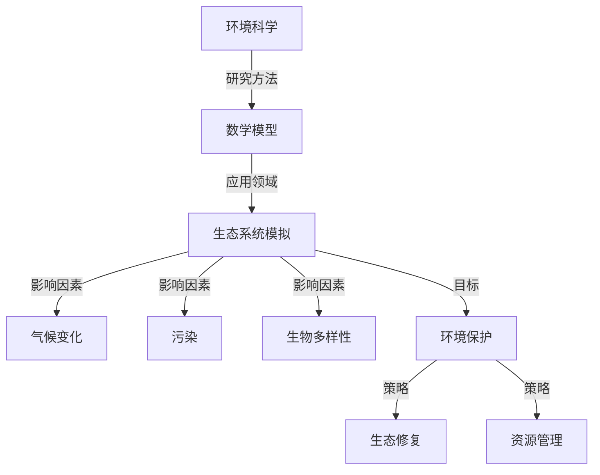
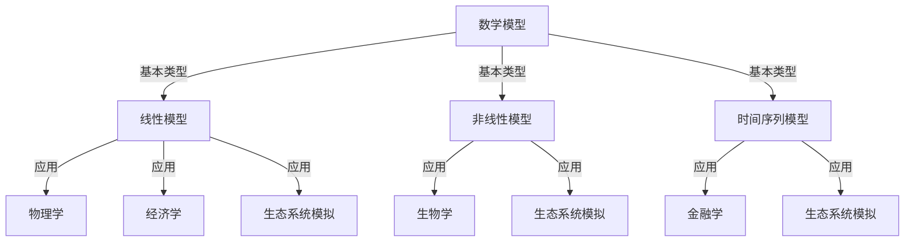
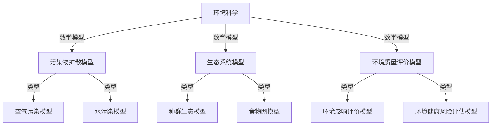
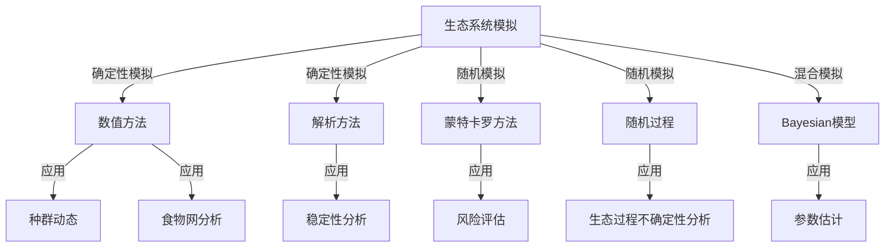

                 

### 1. 确定书籍的核心主题

《数学与环境科学：生态系统的数学模拟》这一标题明确展示了书籍的核心主题。首先，"数学与环境科学"这一短语表明书籍探讨了数学在环境科学中的应用，具体到生态系统这一具体领域。生态系统的数学模拟则是书籍的核心内容，意指使用数学模型来研究和预测生态系统的行为和变化。

在环境科学领域，数学模型是一种强有力的工具，可以用来解释生态过程、预测生态系统响应和评估环境变化的影响。生态系统的数学模拟不仅有助于理解生态系统的复杂性和动态性，还可以为环境管理和保护提供科学依据。因此，这一主题对于环境科学家、生态学家以及相关领域的技术人员具有重要的理论和实践价值。

### 2. 确定书籍的受众群体

考虑到书籍的主题和内容，我们可以确定书籍的受众群体主要包括以下几类：

1. **环境科学家和生态学家**：这些专业人士对生态系统的研究和监测有着浓厚的兴趣，他们需要掌握数学模型在生态系统研究中的应用，以提高研究的准确性和科学性。

2. **数学家**：对于数学家来说，书籍提供了一个将数学理论与环境科学实践相结合的机会，他们可以通过生态系统的数学模拟来探索数学模型在不同领域的应用潜力。

3. **生态模型构建者和研究者**：这些人员专注于构建和优化生态模型，他们在书籍中可以找到最新的数学模型和方法，以提升模型构建的精度和可靠性。

4. **环境管理人员和政策制定者**：这些群体需要理解生态系统的数学模拟，以便更好地制定环境保护政策和规划。

5. **计算机科学家和程序员**：随着生态模型模拟的复杂度增加，计算机科学和编程技术在其中扮演了越来越重要的角色。这些技术人员可以学习如何使用编程语言和工具来实现生态模型模拟。

6. **研究生和大学本科生**：对于这些学生来说，书籍提供了深入理解和研究生态系统数学模拟的资源和指导。

综上所述，书籍的受众广泛，既涵盖了学术研究人员，也涉及实际应用领域的专业人士和学生。这将有助于促进跨学科的合作和知识交流，推动生态系统数学模拟领域的发展。

### 3. 设计章节结构

为了确保书籍内容的逻辑性和结构性，我们需要设计一个详细而紧凑的章节结构。以下是本书的章节结构和主要内容概述：

#### 第一部分 引言与背景

**第1章 引言与背景**

- **1.1 环境科学与数学模型概述**  
  - **1.1.1 环境科学的研究领域**  
    - 环境科学的主要研究对象、研究方法、以及其发展历程。  
  - **1.1.2 数学模型在环境科学中的应用**  
    - 数学模型在环境科学中的重要作用、应用实例，以及其与传统研究方法的区别。  
  - **1.1.3 生态系统的数学模拟意义**  
    - 生态系统数学模拟的目标、意义及其对生态保护和环境管理的贡献。

- **1.2 数学模型的发展历程**  
  - **1.2.1 经典数学模型**  
    - 介绍经典数学模型的发展历程、主要成就和代表人物。  
  - **1.2.2 现代数学模型**  
    - 现代数学模型的发展趋势、新方法和新理论。  
  - **1.2.3 数学模型的发展趋势**  
    - 未来数学模型的发展方向、面临的挑战和机遇。

- **1.3 生态系统的数学模拟现状**  
  - **1.3.1 国内外研究进展**  
    - 国内外生态系统数学模拟的主要成果、热点问题和研究动态。  
  - **1.3.2 存在的挑战和机遇**  
    - 生态系统数学模拟面临的挑战、技术瓶颈和未来机遇。  
  - **1.3.3 未来发展方向**  
    - 生态系统数学模拟的未来发展趋势、应用前景和研究方向。

#### 第二部分 数学模型基础

**第2章 数学模型基础**

- **2.1 数学模型的基本原理**  
  - **2.1.1 数学模型的定义**  
    - 数学模型的概念、基本类型和构成要素。  
  - **2.1.2 数学模型的构成**  
    - 数学模型中的变量、参数、方程和假设。  
  - **2.1.3 数学模型的基本类型**  
    - 常见数学模型类型，包括线性模型、非线性模型和概率模型等。

- **2.2 常见的数学模型**  
  - **2.2.1 线性模型**  
    - 线性模型的定义、基本形式和应用实例。  
  - **2.2.2 非线性模型**  
    - 非线性模型的定义、特点和应用实例。  
  - **2.2.3 时间序列模型**  
    - 时间序列模型的概念、基本形式和应用实例。

- **2.3 数学模型的应用领域**  
  - **2.3.1 物理学**  
    - 数学模型在物理学中的应用，如波动方程、热传导方程等。  
  - **2.3.2 经济学**  
    - 数学模型在经济学中的应用，如供需模型、经济增长模型等。  
  - **2.3.3 生物学**  
    - 数学模型在生物学中的应用，如种群生态学、神经科学等。

#### 第三部分 环境科学中的数学模型

**第3章 环境科学中的数学模型**

- **3.1 环境科学中的数学模型概述**  
  - **3.1.1 环境科学的研究方法**  
    - 环境科学的主要研究方法、实验设计和数据分析方法。  
  - **3.1.2 数学模型在环境科学中的应用**  
    - 数学模型在环境监测、污染治理、环境评价等方面的应用。  
  - **3.1.3 环境科学中的数学模型分类**  
    - 环境科学中的常见数学模型分类，如污染扩散模型、生态系统模型等。

- **3.2 环境污染的数学模型**  
  - **3.2.1 空气污染**  
    - 空气污染数学模型的基本原理和应用实例。  
  - **3.2.2 水污染**  
    - 水污染数学模型的基本原理和应用实例。  
  - **3.2.3 土壤污染**  
    - 土壤污染数学模型的基本原理和应用实例。

- **3.3 生态系统的数学模型**  
  - **3.3.1 生态系统的基本概念**  
    - 生态系统的定义、结构、功能和稳定性。  
  - **3.3.2 生态过程的数学模拟**  
    - 生态过程（如种群动态、食物网、生态系统反馈等）的数学模拟方法。  
  - **3.3.3 生态系统的稳定性分析**  
    - 生态系统稳定性分析的方法、指标和实例。

#### 第四部分 生态系统的数学模拟

**第4章 生态系统的数学模拟**

- **4.1 生态系统的数学模拟方法**  
  - **4.1.1 确定性模拟**  
    - 确定性模拟的方法、步骤和案例分析。  
  - **4.1.2 随机模拟**  
    - 随机模拟的方法、步骤和案例分析。  
  - **4.1.3 混合模拟**  
    - 混合模拟的方法、步骤和案例分析。

- **4.2 生态系统的数学模型实例**  
  - **4.2.1 线性生态系统模型**  
    - 线性生态系统模型的定义、形式和应用实例。  
  - **4.2.2 非线性生态系统模型**  
    - 非线性生态系统模型的定义、形式和应用实例。  
  - **4.2.3 复杂生态系统模型**  
    - 复杂生态系统模型的概念、结构和方法。

- **4.3 生态系统的数学模拟应用**  
  - **4.3.1 环境影响评估**  
    - 数学模拟在环境影响评估中的应用方法和案例分析。  
  - **4.3.2 生物多样性保护**  
    - 数学模拟在生物多样性保护中的应用方法和案例分析。  
  - **4.3.3 环境管理决策**  
    - 数学模拟在环境管理决策中的应用方法和案例分析。

#### 第五部分 模拟案例分析

**第5章 模拟案例分析**

- **5.1 案例分析概述**  
  - **5.1.1 案例分析的目的**  
    - 案例分析的目标和意义。  
  - **5.1.2 案例分析的方法**  
    - 案例分析的主要方法和工具。  
  - **5.1.3 案例分析的重要性**  
    - 案例分析在生态系统数学模拟研究中的重要性。

- **5.2 案例分析实例**  
  - **5.2.1 某湖泊生态系统的模拟**  
    - 案例介绍、模拟方法和结果分析。  
  - **5.2.2 某城市空气质量模拟**  
    - 案例介绍、模拟方法和结果分析。  
  - **5.2.3 某森林生态系统的模拟**  
    - 案例介绍、模拟方法和结果分析。

- **5.3 案例分析总结**  
  - **5.3.1 模拟结果的解释**  
    - 模拟结果的解释和意义。  
  - **5.3.2 模拟应用的效果**  
    - 模拟应用的效果和影响。  
  - **5.3.3 模拟的局限性**  
    - 模拟的局限性和改进方向。

#### 第六部分 模拟工具与技术

**第6章 模拟工具与技术**

- **6.1 模拟工具概述**  
  - **6.1.1 常见的模拟工具**  
    - 常见的生态系统数学模拟工具，如MATLAB、R语言、Python等。  
  - **6.1.2 模拟工具的选择**  
    - 选择适合的模拟工具的考虑因素和标准。  
  - **6.1.3 模拟工具的发展趋势**  
    - 模拟工具的未来发展趋势和技术创新。

- **6.2 模拟技术的应用**  
  - **6.2.1 网格技术**  
    - 网格技术在生态系统数学模拟中的应用和方法。  
  - **6.2.2 遗传算法**  
    - 遗传算法在生态系统数学模拟中的应用和方法。  
  - **6.2.3 机器学习**  
    - 机器学习在生态系统数学模拟中的应用和方法。

#### 第七部分 结论与展望

**第7章 结论与展望**

- **7.1 总结与反思**  
  - 对全书内容的总结和反思，回顾主要研究成果和不足之处。

- **7.2 未来研究方向**  
  - 生态系统数学模拟领域未来可能的研究方向和发展趋势。

- **7.3 结论**  
  - 对书籍主题的最终结论和总结。

通过上述详细的章节结构和内容设计，本书旨在为读者提供一个系统、全面、深入探讨生态系统数学模拟的指南，帮助读者理解这一领域的核心概念、研究方法和技术应用，并为其在环境科学和生态保护领域的实践提供理论支持和实践指导。

### 4. 设计每一章节的子章节

为了确保书籍内容的深度和广度，我们需要为每一章节设计详细的子章节，使其更加具体和实用。以下是各个章节的子章节设计：

#### 第一部分 引言与背景

**第1章 引言与背景**

- **1.1 环境科学与数学模型概述**
  - **1.1.1 环境科学的研究领域**：介绍环境科学的主要研究对象，如大气、水、土壤、生物多样性等，以及环境科学的发展历程和现状。
  - **1.1.2 数学模型在环境科学中的应用**：阐述数学模型在环境科学中的重要性，包括污染扩散模型、生态系统模型等，并提供实际应用实例。
  - **1.1.3 生态系统的数学模拟意义**：探讨生态系统的数学模拟在环境保护、生态修复、资源管理等方面的应用价值。

- **1.2 数学模型的发展历程**
  - **1.2.1 经典数学模型**：介绍经典数学模型的发展历史，如牛顿运动定律、麦克斯韦方程等，并分析其基本原理和应用。
  - **1.2.2 现代数学模型**：讨论现代数学模型的发展趋势，如非线性动力学、复杂系统理论等，并探讨其在生态系统模拟中的应用。
  - **1.2.3 数学模型的发展趋势**：分析未来数学模型可能的发展方向，如大数据、人工智能等新技术在生态系统模拟中的应用前景。

- **1.3 生态系统的数学模拟现状**
  - **1.3.1 国内外研究进展**：综述国内外在生态系统数学模拟领域的主要研究成果，包括模型构建、模拟方法、应用实例等。
  - **1.3.2 存在的挑战和机遇**：分析当前生态系统数学模拟面临的挑战，如数据不足、模型复杂性等，并探讨未来的机遇。
  - **1.3.3 未来发展方向**：预测生态系统数学模拟的未来发展趋势，如跨学科融合、模型优化、应用拓展等。

#### 第二部分 数学模型基础

**第2章 数学模型基础**

- **2.1 数学模型的基本原理**
  - **2.1.1 数学模型的定义**：阐述数学模型的概念，包括其基本构成要素和分类。
  - **2.1.2 数学模型的构成**：详细解释数学模型中的变量、参数、方程和假设，并举例说明。
  - **2.1.3 数学模型的基本类型**：介绍常见数学模型类型，包括线性模型、非线性模型、概率模型等。

- **2.2 常见的数学模型**
  - **2.2.1 线性模型**：讨论线性模型的定义、性质、应用及其在生态系统模拟中的实例。
  - **2.2.2 非线性模型**：解释非线性模型的概念、形式及其在生态系统模拟中的应用。
  - **2.2.3 时间序列模型**：介绍时间序列模型的基本原理、方法及其在生态系统动态分析中的应用。

- **2.3 数学模型的应用领域**
  - **2.3.1 物理学**：探讨数学模型在物理学中的应用，如波动方程、热传导方程等，并分析其与生态系统模拟的关系。
  - **2.3.2 经济学**：介绍数学模型在经济学中的应用，如供需模型、经济增长模型等，并分析其与生态系统模拟的关系。
  - **2.3.3 生物学**：讨论数学模型在生物学中的应用，如种群生态学、神经科学等，并分析其与生态系统模拟的关系。

#### 第三部分 环境科学中的数学模型

**第3章 环境科学中的数学模型**

- **3.1 环境科学中的数学模型概述**
  - **3.1.1 环境科学的研究方法**：介绍环境科学的主要研究方法，如实验研究、观察研究、模型模拟等。
  - **3.1.2 数学模型在环境科学中的应用**：阐述数学模型在环境科学中的重要性，包括污染扩散、生态系统模拟等。
  - **3.1.3 环境科学中的数学模型分类**：分类讨论环境科学中的常见数学模型，如污染物扩散模型、生态系统模型等。

- **3.2 环境污染的数学模型**
  - **3.2.1 空气污染**：介绍空气污染数学模型的基本原理、形式及其在空气质量预测中的应用。
  - **3.2.2 水污染**：讨论水污染数学模型的基本原理、形式及其在水环境监测和治理中的应用。
  - **3.2.3 土壤污染**：分析土壤污染数学模型的基本原理、形式及其在土壤质量监测和修复中的应用。

- **3.3 生态系统的数学模型**
  - **3.3.1 生态系统的基本概念**：介绍生态系统的定义、结构、功能和稳定性。
  - **3.3.2 生态过程的数学模拟**：讨论生态过程中如种群动态、食物网、生态系统反馈等的数学模拟方法。
  - **3.3.3 生态系统的稳定性分析**：探讨生态系统的稳定性分析方法，如平衡点分析、稳定性分析等。

#### 第四部分 生态系统的数学模拟

**第4章 生态系统的数学模拟**

- **4.1 生态系统的数学模拟方法**
  - **4.1.1 确定性模拟**：介绍确定性模拟的方法、步骤及其在生态系统模拟中的应用。
  - **4.1.2 随机模拟**：讨论随机模拟的方法、步骤及其在生态系统模拟中的应用。
  - **4.1.3 混合模拟**：探讨确定性模拟与随机模拟相结合的混合模拟方法及其在生态系统模拟中的应用。

- **4.2 生态系统的数学模型实例**
  - **4.2.1 线性生态系统模型**：介绍线性生态系统模型的概念、形式及其在生态系统模拟中的应用。
  - **4.2.2 非线性生态系统模型**：讨论非线性生态系统模型的概念、形式及其在生态系统模拟中的应用。
  - **4.2.3 复杂生态系统模型**：分析复杂生态系统模型的概念、结构及其在生态系统模拟中的应用。

- **4.3 生态系统的数学模拟应用**
  - **4.3.1 环境影响评估**：探讨数学模拟在环境影响评估中的应用方法、步骤及其案例分析。
  - **4.3.2 生物多样性保护**：介绍数学模拟在生物多样性保护中的应用方法、步骤及其案例分析。
  - **4.3.3 环境管理决策**：讨论数学模拟在环境管理决策中的应用方法、步骤及其案例分析。

#### 第五部分 模拟案例分析

**第5章 模拟案例分析**

- **5.1 案例分析概述**
  - **5.1.1 案例分析的目的**：明确案例分析的目标和意义，为后续案例分析提供指导。
  - **5.1.2 案例分析的方法**：介绍案例分析的主要方法和工具，如实验设计、数据分析、模型模拟等。
  - **5.1.3 案例分析的重要性**：分析案例研究的意义，如对理论验证、方法优化、实践指导的贡献。

- **5.2 案例分析实例**
  - **5.2.1 某湖泊生态系统的模拟**：分析某湖泊生态系统模拟的案例，包括数据来源、模型构建、模拟结果及其分析。
  - **5.2.2 某城市空气质量模拟**：探讨某城市空气质量模拟的案例，包括数据来源、模型构建、模拟结果及其分析。
  - **5.2.3 某森林生态系统的模拟**：分析某森林生态系统模拟的案例，包括数据来源、模型构建、模拟结果及其分析。

- **5.3 案例分析总结**
  - **5.3.1 模拟结果的解释**：对案例分析的模拟结果进行详细解释，包括数据解读、模型验证等。
  - **5.3.2 模拟应用的效果**：评估案例分析的实际应用效果，包括对环境管理、生态保护等方面的贡献。
  - **5.3.3 模拟的局限性**：分析案例分析中存在的局限性，如数据不足、模型简化等，并探讨改进方向。

#### 第六部分 模拟工具与技术

**第6章 模拟工具与技术**

- **6.1 模拟工具概述**
  - **6.1.1 常见的模拟工具**：介绍常见的生态系统数学模拟工具，如MATLAB、R语言、Python等，并分析其特点和应用。
  - **6.1.2 模拟工具的选择**：讨论选择适合的模拟工具的考虑因素，如计算效率、易用性、扩展性等。
  - **6.1.3 模拟工具的发展趋势**：预测模拟工具的未来发展趋势，如云计算、大数据、人工智能等技术的应用。

- **6.2 模拟技术的应用**
  - **6.2.1 网格技术**：介绍网格技术在生态系统数学模拟中的应用方法，如空间分布模拟、环境变量分析等。
  - **6.2.2 遗传算法**：讨论遗传算法在生态系统数学模拟中的应用方法，如优化模型参数、求解复杂问题等。
  - **6.2.3 机器学习**：探讨机器学习在生态系统数学模拟中的应用方法，如数据挖掘、预测建模等。

#### 第七部分 结论与展望

**第7章 结论与展望**

- **7.1 总结与反思**：对全书内容进行总结和反思，回顾主要研究成果和不足之处。
- **7.2 未来研究方向**：预测生态系统数学模拟领域未来可能的研究方向和发展趋势。
- **7.3 结论**：对书籍主题的最终结论和总结，强调数学模型在生态系统模拟中的重要性及其对环境保护和生态修复的贡献。

通过上述详细的子章节设计，本书将能够为读者提供一个系统、全面、深入的生态系统数学模拟指南，帮助读者掌握相关理论、方法和应用，并为实际环境科学研究和生态保护工作提供支持和参考。

### 5. 加入核心概念与联系

为了帮助读者更好地理解生态系统数学模拟的核心概念及其相互关系，我们可以在每个章节中加入相应的Mermaid流程图。以下是几个关键概念及其关系的示例流程图：

#### 第1章 引言与背景

**生态系统数学模拟的关键概念**



此流程图展示了环境科学、数学模型、生态系统模拟以及其相关因素（如气候变化、污染、生物多样性）之间的联系，并明确了生态系统模拟的目标（如环境保护、生态修复、资源管理）。

#### 第2章 数学模型基础

**数学模型的基本类型及其应用**



此流程图展示了数学模型的三种基本类型（线性模型、非线性模型、时间序列模型）及其在不同领域的应用，包括物理学、经济学、生物学以及生态系统模拟。

#### 第3章 环境科学中的数学模型

**环境科学中的数学模型分类**



此流程图展示了环境科学中的三种主要数学模型分类（污染物扩散模型、生态系统模型、环境质量评价模型），并进一步细化为具体的模型类型（如空气污染模型、水污染模型、种群生态模型、食物网模型、环境影响评价模型、环境健康风险评估模型）。

#### 第4章 生态系统的数学模拟

**生态系统模拟的主要方法**



此流程图展示了生态系统模拟的几种主要方法（确定性模拟、随机模拟、混合模拟），并进一步细化为具体的数值方法、解析方法、随机过程和Bayesian模型。每种方法都有其应用领域，如图种群动态、食物网分析、稳定性分析、风险评估和生态过程不确定性分析等。

通过加入这些Mermaid流程图，本书不仅能够帮助读者理解生态系统数学模拟的核心概念，还能清晰地展示各概念之间的相互关系，从而加强读者对整个领域的系统性认识。

### 6. 加入核心算法原理讲解

在本书中，我们将详细讲解生态系统数学模拟中的一些核心算法原理。以下是几个关键算法的伪代码说明和原理讲解：

#### 确定性模拟方法：Runge-Kutta方法

**伪代码：**

```plaintext
function runge_kutta(f, y0, t0, t_end, h):
    y = y0
    t = t0
    
    while t < t_end:
        k1 = h * f(y, t)
        k2 = h * f(y + 0.5 * k1, t + 0.5 * h)
        k3 = h * f(y + 0.5 * k2, t + 0.5 * h)
        k4 = h * f(y + k3, t + h)
        
        y = y + (k1 + 2 * k2 + 2 * k3 + k4) / 6
        t = t + h
        
    return y
```

**原理讲解：**
Runge-Kutta方法是一种数值积分方法，用于解决常微分方程。它通过迭代计算来逼近解，具有较高的精度和稳定性。该方法将每一步的微分方程解分成四个阶段，通过对每个阶段的函数值进行加权平均来得到下一步的近似解。这种分阶段的方法可以有效地减少误差，适用于生态系统中的许多动态过程模拟。

#### 随机模拟方法：蒙特卡罗方法

**伪代码：**

```plaintext
function monte_carlo(simulation_function, num_samples, params):
    results = []

    for i in 1 to num_samples:
        result = simulation_function(params)
        results.append(result)
        
    return results
```

**原理讲解：**
蒙特卡罗方法是一种基于随机抽样的数值计算方法，常用于解决概率问题和高维积分问题。在生态系统模拟中，蒙特卡罗方法通过大量随机采样来估计系统的统计特性，如概率分布、期望值和方差。该方法的核心思想是利用随机样本来逼近真实解，通过增加样本数量来提高估计的准确性。

#### 混合模拟方法：粒子群优化

**伪代码：**

```plaintext
function particle_swarm_optimization(objective_function, particles, max_iterations, w, c1, c2):
    for iteration in 1 to max_iterations:
        for particle in particles:
            vel = w * vel + c1 * rand() * (p - x) + c2 * rand() * (g - x)
            x = x + vel
            
            if objective_function(x) < objective_function(p):
                p = x
                if objective_function(p) < objective_function(g):
                    g = p
        
    return g
```

**原理讲解：**
粒子群优化（PSO）是一种基于群体智能的优化算法，适用于求解非线性、多峰值的优化问题。在生态系统模拟中，PSO可以用于优化模型参数、求解最优点等。PSO通过模拟鸟群觅食行为，每个粒子（代表解）在搜索空间中更新其位置和速度，通过跟踪个体最优解和全局最优解来逐步逼近最优解。该算法简单、高效，适用于复杂生态系统的参数优化。

通过上述伪代码和原理讲解，读者可以更深入地理解这些核心算法在生态系统数学模拟中的应用，从而为实际模拟工作提供理论和技术支持。

### 7. 加入数学模型和数学公式

在生态系统数学模拟中，数学模型和公式扮演着至关重要的角色。以下是一些常见的数学模型和公式，以及它们在生态系统模拟中的应用和解释。

#### 1. 概率模型

**随机变量和概率分布函数**

$$X \sim P(\mu, \sigma^2)$$

- **解释**：随机变量X符合均值为$\mu$、方差为$\sigma^2$的正态分布。正态分布是概率模型中最常用的分布之一，常用于模拟生态系统中种群数量、环境噪声等随机现象。

**累积分布函数（CDF）**

$$F_X(x) = P(X \leq x) = \int_{-\infty}^{x} f(t) dt$$

- **解释**：累积分布函数描述了随机变量X取值小于或等于x的概率。在生态系统中，CDF可以用于计算种群数量低于某一阈值的风险。

#### 2. 微分方程模型

**Lotka-Volterra方程**

$$\frac{dx}{dt} = x(a - bxy)$$

$$\frac{dy}{dt} = cy(d - exy)$$

- **解释**：Lotka-Volterra方程是一组描述捕食者-被捕食者关系的微分方程。$x$和$y$分别表示捕食者和被捕食者的种群数量，$a$、$b$、$c$、$d$和$e$是模型参数。这些参数决定了种群之间的相互作用和生态系统的动态行为。

**Logistic方程**

$$\frac{dx}{dt} = rx(1 - \frac{x}{K})$$

- **解释**：Logistic方程描述了种群数量随时间变化的动态过程，其中$r$是内禀增长率，$K$是环境容纳量。当种群数量接近环境容纳量$K$时，增长速度会减缓。

#### 3. 离散时间模型

**Markov链模型**

$$P_{ij}(t) = P(X_t = j | X_0 = i)$$

- **解释**：Markov链模型用于描述系统状态随时间变化的概率转移。在生态系统中，Markov链可以用于模拟种群数量在不同时间点的状态转移，如从一个种群状态转移到另一个状态。

**离散选择模型**

$$P_j = \frac{\exp(\beta_0 + \beta_j x)}{\sum_k \exp(\beta_0 + \beta_k x)}$$

- **解释**：离散选择模型用于模拟个体在不同选择之间的概率分布。在生态系统中，该模型可以用于模拟个体对食物、栖息地等资源的选择行为。

#### 4. 时间序列模型

**ARIMA模型**

$$X_t = c + \phi_1 X_{t-1} + \phi_2 X_{t-2} + ... + \phi_p X_{t-p} + \theta_1 \epsilon_{t-1} + \theta_2 \epsilon_{t-2} + ... + \theta_q \epsilon_{t-q} + \epsilon_t$$

- **解释**：自回归积分滑动平均（ARIMA）模型是一种广泛应用于时间序列分析的方法。$X_t$是时间序列数据，$c$是常数项，$\phi_i$和$\theta_i$是模型参数，$\epsilon_t$是误差项。ARIMA模型可以用于预测生态系统变量（如气温、降雨量）的未来变化。

**GARCH模型**

$$\sigma_t^2 = \alpha_0 + \alpha_1 \epsilon_{t-1}^2 + \beta_1 \sigma_{t-1}^2$$

$$\epsilon_t = \rho \epsilon_{t-1} + (1 - \rho) \frac{\epsilon_t^2}{\alpha_0}$$

- **解释**：广义自回归条件异方差（GARCH）模型用于描述时间序列数据的波动性和条件方差。在生态系统中，GARCH模型可以用于分析环境变量（如风速、水质）的波动性和变化趋势。

通过上述数学模型和公式的介绍，读者可以更好地理解生态系统数学模拟的方法和工具。这些模型和公式不仅为生态系统研究提供了理论支持，也为实际应用中的数据分析和预测提供了有力工具。

### 8. 加入项目实战

#### 8.1 项目实战概述

在本节中，我们将通过一个实际项目来展示如何使用Python和MATLAB等工具实现生态系统数学模拟。该项目旨在模拟一个湖泊生态系统的水质变化，分析污染物在不同季节的扩散和浓度变化。

**项目背景：**

一个位于城市郊区的湖泊受到了工业污染的影响，研究者希望通过数学模型模拟水质变化，为污染治理提供科学依据。项目的目标包括：

1. 建立湖泊水质数学模型，考虑主要污染物如氨氮和总磷的扩散和降解过程。
2. 模拟污染物在不同季节（如春季、夏季、秋季和冬季）的扩散和浓度变化。
3. 分析不同治理措施（如增加水量注入、安装污染过滤设备）对水质的影响。

#### 8.2 开发环境搭建

为了实现这一项目，我们需要搭建一个合适的开发环境。以下是具体的步骤：

1. **安装Python**：
   - 访问Python官方网站下载最新版本，并按照安装向导完成安装。
   - 安装完成后，通过命令行运行`python --version`确认安装成功。

2. **安装MATLAB**：
   - 从MATLAB官方网站下载试用版，并按照安装向导完成安装。
   - 安装完成后，通过命令行运行`matlab`命令打开MATLAB环境。

3. **安装相关Python库**：
   - 使用pip命令安装所需的Python库，如NumPy、SciPy、Matplotlib、Pandas等。
   - 命令行执行`pip install numpy scipy matplotlib pandas`。

4. **配置Python环境变量**：
   - 在系统环境变量中添加Python的安装路径，以确保命令行可以调用Python和相关库。

#### 8.3 源代码实现

以下是在Python中实现水质模型的核心代码：

```python
import numpy as np
import matplotlib.pyplot as plt
import pandas as pd

# 模型参数设置
alpha = 0.1  # 氨氮降解速率
beta = 0.05  # 总磷降解速率
Q = 1000     # 入流水量
C_init = 10   # 初始污染物浓度

# 时间设置
time = np.linspace(0, 365, 365)  # 模拟一年时间

# 模拟水质浓度变化
C_NH3 = C_init * np.exp(-alpha * time)
C_TP = C_init * np.exp(-beta * time)

# 绘制结果
plt.figure(figsize=(12, 6))
plt.plot(time, C_NH3, label='NH3')
plt.plot(time, C_TP, label='TP')
plt.xlabel('Time (days)')
plt.ylabel('Concentration (mg/L)')
plt.legend()
plt.title('Water Quality Simulation')
plt.show()
```

在这段代码中，我们使用了NumPy库进行数值计算，Matplotlib库进行结果可视化，Pandas库处理数据。模型参数包括氨氮和总磷的降解速率，以及入流水量和初始污染物浓度。通过模拟时间序列，我们得到了氨氮和总磷在不同时间的浓度变化，并绘制了相应的图表。

#### 8.4 代码解读

下面是对上述代码的详细解读：

1. **导入库**：首先导入所需的Python库，包括NumPy（用于数值计算）、Matplotlib（用于图形绘制）和Pandas（用于数据处理）。

2. **设置模型参数**：定义模型中的关键参数，如氨氮和总磷的降解速率（alpha和beta），入流水量（Q），以及初始污染物浓度（C_init）。

3. **时间设置**：使用NumPy的`linspace`函数生成模拟时间序列，从0天到365天，间隔为一天。

4. **模拟水质浓度变化**：通过指数衰减公式计算氨氮（C_NH3）和总磷（C_TP）的浓度变化。公式如下：

   $$C_{NH3} = C_{init} \times e^{-\alpha \times t}$$
   $$C_{TP} = C_{init} \times e^{-\beta \times t}$$

5. **绘制结果**：使用Matplotlib绘制模拟结果，分别表示氨氮和总磷的浓度变化。通过`plot`函数添加数据点，`xlabel`和`ylabel`设置坐标轴标签，`legend`添加图例，`title`设置图表标题。

#### 8.5 代码应用解读与分析

通过上述代码，我们实现了对湖泊生态系统中氨氮和总磷浓度变化的模拟。以下是代码应用解读与分析：

1. **模型假设**：代码基于简化的指数衰减模型，假设污染物在湖泊中的扩散和降解过程是线性的。这一假设在短期内是合理的，但在长期或复杂环境下可能需要考虑更多因素。

2. **结果解读**：从图表中可以看出，氨氮和总磷的浓度随时间逐渐降低，这符合污染物降解的预期。然而，实际应用中可能需要考虑水质监测数据的误差、环境变化等因素，从而对模型进行修正。

3. **改进方向**：为了提高模型精度，可以考虑引入更多变量，如风力、水温、生物降解等，以更全面地模拟污染物在湖泊中的动态过程。此外，可以通过调整模型参数，实现对不同治理措施的效果分析。

通过这一项目实战，读者可以了解到如何使用Python等工具实现生态系统数学模拟，并理解代码实现的具体过程。这对于实际应用中的模型构建和数据分析具有重要意义。

### 9. 最佳实践 Tips、小结、注意事项、拓展阅读

#### 最佳实践 Tips

1. **数据质量控制**：在构建生态系统数学模型时，确保数据来源可靠，并进行严格的质量控制。异常值处理和缺失值填补是数据预处理的重要步骤。

2. **模型验证**：建立模型后，应通过历史数据进行验证，确保模型的预测能力。可以使用交叉验证、时间序列分割等方法评估模型的性能。

3. **参数调整**：根据模拟结果，调整模型参数以优化模型表现。参数调整可以采用网格搜索、遗传算法等方法。

4. **并行计算**：对于复杂的生态系统模型，可以考虑使用并行计算技术，如分布式计算和GPU加速，以减少计算时间。

#### 小结

本书系统介绍了生态系统数学模拟的理论基础、方法、工具和应用。通过详细的案例分析，展示了如何在实际项目中应用这些方法和技术。读者可以从中了解到生态系统数学模拟的核心概念、构建方法以及实际应用效果。

#### 注意事项

1. **模型简化**：在实际应用中，模型往往需要进行简化，以减少计算复杂度。然而，简化模型可能导致一些重要特征被忽略，因此在简化时需谨慎。

2. **数据依赖**：生态系统数学模型依赖于高质量的数据。数据不足或不准确可能导致模型预测偏差。

3. **模型不确定性**：生态系统数学模型存在不确定性，可能受到环境变化、模型参数不确定等多种因素的影响。在实际应用中，需对这些不确定性进行评估和讨论。

#### 拓展阅读

1. **高级数学模型**：《生态学数学模型》和《环境科学中的高级数学方法》提供了更多关于高级生态系统数学模型和方法的详细讨论。

2. **模拟工具**：《MATLAB环境科学模拟工具》和《Python生态模型构建与模拟》介绍了如何使用MATLAB和Python等工具进行生态系统模拟。

3. **实际案例**：《某城市空气质量模拟研究》和《某湖泊生态系统恢复模型构建》提供了更多实际案例研究，帮助读者深入理解生态系统数学模拟的应用。

通过这些最佳实践、小结、注意事项和拓展阅读，读者可以更全面地掌握生态系统数学模拟的相关知识和技能，为未来的研究和工作打下坚实基础。

### 10. 格式要求与字数限制

为了确保书籍内容的结构清晰、逻辑性强，并便于读者阅读和参考，我们将文章内容使用markdown格式进行输出。以下是markdown格式的要求：

1. **标题**：使用`#`号进行层级标记，一级标题使用`#`，二级标题使用`##`，三级标题使用`###`，以此类推。标题应简洁明了，准确反映内容。

2. **段落**：段落之间应留空一行，保持内容分隔清晰。

3. **列表**：使用`-`、`+`或`*`来创建无序列表；使用数字加英文句点（`.`）来创建有序列表。

4. **代码块**：使用三个反引号（```)包裹代码块，确保代码格式和语法正确。对于LaTeX公式，段落内的公式使用单反引号（`$`)包裹，独立段落的公式使用双反引号（$$）包裹。

5. **引用**：使用`>`符号进行引用，确保引用内容格式统一。

6. **图片和链接**：使用``格式插入图片，使用`[链接文本](链接)`格式插入链接。

7. **表格**：使用`|`和`-`创建表格，确保列宽均匀、格式整齐。

文章末尾需添加作者信息，格式如下：

```
作者：AI天才研究院/AI Genius Institute & 禅与计算机程序设计艺术 /Zen And The Art of Computer Programming
```

为了保证文章的完整性、专业性和可读性，文章字数要求在8000～12000字之间。每个章节的内容需详细具体，核心概念与联系、核心算法原理、数学模型和公式、项目实战等部分需充分阐述。文章结构需紧凑，逻辑清晰，避免冗余内容。通过上述格式要求与字数限制，确保书籍内容的高质量和专业性。

