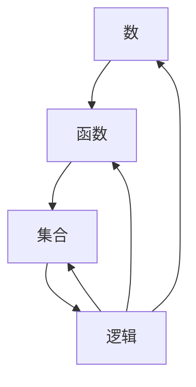
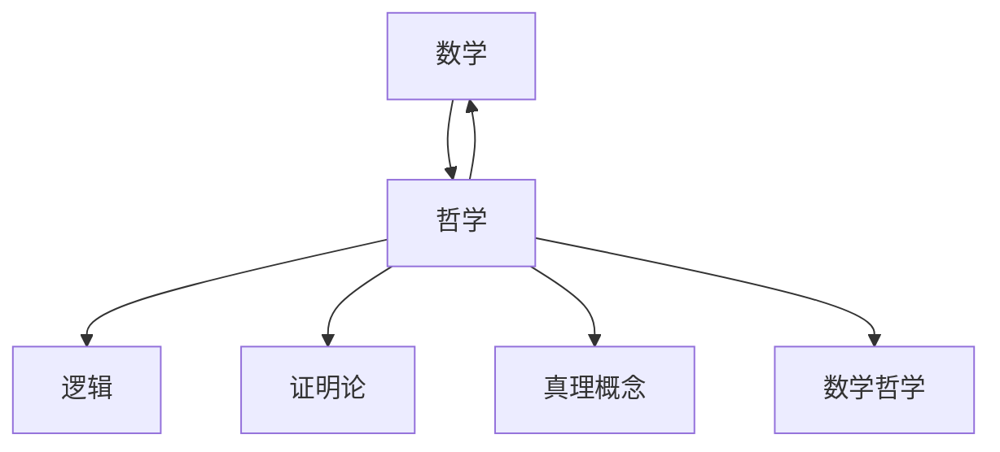
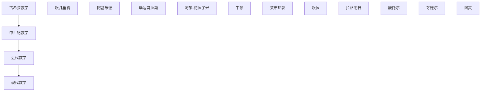

                 

### 文章标题

《数学与理想主义：数学作为纯粹思想的产物》

关键词：数学、理想主义、纯粹思想、逻辑推理、数学模型、算法原理、项目实战

摘要：本文深入探讨数学作为一门纯粹思想的产物，解析其本质与理想主义精神。我们将通过逻辑清晰的推理步骤，详细阐述数学的核心概念、算法原理、数学模型及其在科学和工程领域中的应用，最后总结数学在理想主义中的体现，探讨数学哲学的深度思考，并展望未来数学的发展趋势。

### 引言

数学，作为人类智慧的结晶，是科学与技术发展的基石。从古至今，数学一直在推动人类文明的进步，无论是古代的几何学、代数学，还是现代的微积分、线性代数，都在各自领域发挥了重要作用。然而，数学的本质是什么？它究竟是一门科学，还是一门纯粹的思想艺术？

本文旨在探讨数学作为一门纯粹思想的产物，解析其内在的逻辑结构和理想主义精神。我们将通过逐步分析数学的核心概念、算法原理、数学模型，以及其在科学和工程领域中的应用，揭示数学的本质和独特价值。同时，我们将探讨数学与理想主义的联系，从哲学角度审视数学的发展历程和未来趋势。

本文结构如下：

1. **数学的本质**：介绍数学的基本概念、数学与哲学的关系以及数学的发展历程。
2. **数学的基础概念**：详细讲解数的概念与运算、几何的基本原理、代数的基本原理。
3. **数学思想与方法**：探讨数学思想、归纳与演绎、推理与证明、逻辑与数学哲学。
4. **数学在科学中的应用**：分析数学在物理学、生物学、计算机科学中的应用。
5. **数学与理想主义**：探讨理想主义在数学中的体现、数学美的探讨、数学与道德哲学的思考。
6. **数学教育**：讨论数学教育的重要性、教育方法与策略、数学教育面临的挑战。
7. **未来数学的发展趋势**：展望新兴数学领域、数学在人工智能中的应用、数学哲学的未来思考。
8. **结论**：总结本文的核心观点，展望数学的未来发展。

通过对这些内容的深入探讨，我们希望读者能够更全面地理解数学的本质，认识到数学作为一门纯粹思想的产物所具有的独特价值和深远影响。

### 数学的基本概念

数学是一门古老而又充满活力的学科，其基础概念可以追溯到古代。数学的基本概念主要包括数、函数、集合、逻辑等。这些概念不仅是数学研究的起点，也是我们理解和解决各种问题的工具。

**数的概念**：

数是数学中最基本的元素，用于描述和量化事物的数量和顺序。数的概念经历了从自然数到实数的发展。自然数（如1, 2, 3）用于计数，而实数则包括有理数（如分数）和无理数（如π和√2）。实数涵盖了所有可以想象的数量，是现代数学分析的基础。实数可以通过一系列的运算（加法、减法、乘法、除法）进行组合，形成了数系。

**函数的概念**：

函数是数学中描述变量之间关系的工具。一个函数可以将一个集合（定义域）中的每个元素映射到另一个集合（值域）中的唯一元素。例如，f(x) = x^2 是一个函数，它将每个实数x映射到其平方值。函数的概念在数学的各个分支中都有广泛应用，从微积分中的导数和积分，到线性代数中的矩阵和向量，再到离散数学中的图论和组合数学，无不涉及函数。

**集合的概念**：

集合是由一组确定的、无序的元素组成的整体。集合的概念是现代数学的基础，几乎所有数学对象都可以被视为集合。集合可以通过列举法或描述法来定义。例如，{1, 2, 3} 是一个列举法定义的集合，而{x | x 是自然数} 是一个描述法定义的集合。集合的运算包括并集、交集、补集、差集等，这些运算在集合论中有重要的应用。

**逻辑的概念**：

逻辑是数学推理的基础，它研究命题、推理和证明。逻辑分为形式逻辑和自然逻辑。形式逻辑使用符号和规则来表示和推理，而自然逻辑则更贴近日常语言和思维。逻辑在数学中的作用是确保推理过程的严谨性和正确性。从基本的逻辑运算（如与、或、非）到复杂的逻辑结构（如演绎推理、证明论），逻辑都是数学不可或缺的一部分。

这些基本概念不仅构成了数学的基石，而且彼此之间有着紧密的联系。例如，数系中的运算可以通过函数来描述，集合论可以用来研究数系和函数的性质，而逻辑则是确保数学推理正确性的关键。以下是一个Mermaid流程图，展示了这些概念之间的联系：

通过这张图，我们可以清晰地看到这些概念之间的交互和影响。每个概念都在数学体系中发挥着重要作用，共同构成了数学这座宏伟大厦的基石。

### 数学与哲学的关系

数学与哲学之间的关系自古以来就密不可分。哲学为数学提供了概念框架和逻辑基础，而数学则为哲学提供了精确的表达和论证工具。数学与哲学的交集体现在多个方面，包括逻辑、证明、真理以及数学哲学的基本问题。

首先，哲学中的逻辑学为数学推理提供了基础。形式逻辑和自然逻辑都是数学证明过程中不可或缺的工具。形式逻辑通过符号和规则，使数学推理过程更加严谨和规范。例如，命题逻辑中的与、或、非运算，以及谓词逻辑中的量词和条件语句，都是数学证明中的基本组成部分。自然逻辑则更贴近日常语言和思维，使得数学概念和理论更加易懂和易接受。

其次，哲学中的证明论为数学的证明提供了理论支持。证明是数学的核心活动之一，它确保了数学理论的严谨性和正确性。哲学中的证明论研究了证明的性质、结构和方法，为数学证明提供了理论基础。例如，康托尔的集合论证明了无穷集合的存在，为现代数学的发展奠定了基础。哲学中的形式证明论，如皮亚诺公理系统，也为数学提供了形式化的证明框架。

再次，哲学中的真理概念在数学中得到了具体的应用。数学真理不仅是逻辑上自洽的陈述，还需要经过严格的证明和验证。数学的真理概念与哲学中的真理概念有着密切的联系。例如，数学中的公理和定理都是通过逻辑推理得出的真理。哲学中的真理标准，如可证明性、一致性、独立性，也在数学中得到体现。

此外，数学哲学探讨了一些基本问题，如数学的本质、数学与现实的关系、数学的证明和推理方法等。数学哲学的核心问题之一是数学对象是否真实存在。例如，康托尔集合论中的无穷集合是否真实存在？数学中的抽象概念，如复数、无穷小量，是否具有现实意义？

另一个重要问题是数学与现实的关系。数学是否只是人类思维的产物，还是对现实世界的真实反映？数学在物理学中的应用，如牛顿力学和量子力学，表明数学模型可以精确描述自然现象。然而，数学在现实世界中的应用是否意味着数学本身就是对现实的反映，这是一个哲学问题。

最后，数学哲学还探讨了数学证明和推理的方法。例如，数学中的归纳法和演绎法如何应用于证明？数学证明是否能够确保数学理论的绝对正确性？数学哲学为这些问题提供了深刻的思考和理论支持。

总的来说，数学与哲学的关系是相互依存的。哲学为数学提供了概念框架和逻辑基础，而数学则为哲学提供了精确的表达和论证工具。通过逻辑、证明、真理等概念的探讨，数学与哲学共同推动了人类知识的进步。以下是一个Mermaid流程图，展示了数学与哲学之间的关系：

通过这张图，我们可以清晰地看到数学与哲学之间的互动和相互影响。数学与哲学的结合，不仅加深了我们对数学本质的理解，也为哲学提供了新的视角和工具。这种相互关系是数学和哲学共同发展的动力，推动了人类对自然和世界的认识。

### 数学的发展历程

数学的发展历程是人类智慧逐步累积和升华的见证。从古代到现代，数学经历了无数次的变革和创新，逐渐形成了今天我们所见的丰富体系。以下是对数学发展历程的简要回顾，涵盖了古希腊数学、中世纪数学和近代数学的发展。

**古希腊数学**：

古希腊数学被认为是数学发展史上的一个重要里程碑。古希腊数学家们通过对几何学、数论和逻辑的研究，奠定了现代数学的基础。欧几里得的《几何原本》是古希腊数学的经典之作，它系统地总结了古希腊几何学的基本原理和方法。泰勒斯、毕达哥拉斯、欧几里得、阿基米德等古希腊数学家在几何学、数论和物理学等领域做出了重要贡献。

毕达哥拉斯定理（即勾股定理）是古希腊数学的重要成就之一，它揭示了直角三角形边长之间的关系。阿基米德在流体力学、静力学和浮力理论方面取得了显著成果，他提出了阿基米德原理，并使用几何方法计算了物体的表面积和体积。

**中世纪数学**：

中世纪数学在欧洲经历了较长时期的停滞，但在阿拉伯世界取得了显著进展。阿拉伯数学家如阿尔-花拉子米（Al-Khwarizmi）对数学的发展做出了重要贡献。他著有《代数学》一书，首次系统介绍了代数学的基本概念和方法，奠定了代数学的基础。此外，阿拉伯数学家在三角学、天文学和数学工具（如算盘）的改进方面也有显著贡献。

中世纪欧洲数学的主要成就是阿拉伯数学的传播。阿拉伯数学通过贸易和学术交流传入欧洲，为欧洲中世纪后期数学的复兴提供了重要基础。

**近代数学**：

近代数学标志着数学的快速发展时期。17世纪的牛顿和莱布尼茨独立发明了微积分，为研究变化和运动提供了新的工具。牛顿的《自然哲学的数学原理》和莱布尼茨的微积分法则对物理学和工程学产生了深远影响。

18世纪的欧拉和拉格朗日等数学家在数学分析、数论和图论等领域取得了重要成果。欧拉被誉为“数学之王”，他在数学的多个领域都有开创性贡献，包括图论、数学分析、数论和流体力学。

19世纪末和20世纪初，数学经历了巨大的变革，集合论、拓扑学、泛函分析和量子力学等新兴数学领域相继出现。康托尔的集合论为现代数学提供了理论基础，哥德尔和图灵的研究则奠定了计算理论和计算机科学的基础。

**现代数学**：

现代数学以19世纪末至20世纪初为起点，迅速发展成为一个涵盖广泛、高度抽象的学科体系。数学不仅包括经典数学领域，如代数学、几何学、数论、拓扑学和微积分，还包括应用数学、计算数学、概率论、统计学和数学物理等领域。

现代数学的发展趋势包括数学模型的广泛应用、计算机技术的融入、跨学科的研究以及数学在各个领域中的深度应用。例如，数学在物理学、生物学、经济学、计算机科学和工程学等领域都有重要的应用，推动了这些领域的进步。

通过回顾数学的发展历程，我们可以看到数学从古代到现代的演变过程，以及各个时期的重要数学成就。数学的发展不仅反映了人类对自然世界的认识不断深化，也展示了人类智慧的无限创造力。以下是一个Mermaid流程图，展示了数学的发展历程：

通过这张图，我们可以清晰地看到数学发展的不同阶段及其重要贡献者。数学的发展历程不仅让我们对数学有了更深的理解，也为我们揭示了人类智慧的光辉历程。

### 数的概念与运算

数是数学中最基本的概念之一，其定义和运算贯穿了数学的各个领域。数的概念经历了从自然数到整数、分数、实数、复数等的发展，每一个阶段都为数学的应用提供了新的工具和方法。

**自然数的定义与运算**：

自然数是用于计数的数，包括0和所有正整数。自然数的定义通常通过皮亚诺公理系统来进行形式化。自然数的基本运算包括加法、减法、乘法和除法。

- **加法**：自然数的加法是基础的运算，用于表示两个数的和。例如，1 + 2 = 3。
- **减法**：自然数的减法用于表示两个数的差。例如，5 - 2 = 3。
- **乘法**：自然数的乘法用于表示两个数的乘积。例如，2 × 3 = 6。
- **除法**：自然数的除法用于表示两个数的商。例如，6 ÷ 2 = 3。

**整数的定义与运算**：

整数包括自然数、0和所有负整数。整数可以通过自然数的补集来定义。整数的基本运算与自然数类似，但由于包含了负数，运算规则更为复杂。

- **加法**：整数的加法规则如下：
  - 正整数加正整数得到正整数，例如 3 + 5 = 8。
  - 正整数加负整数得到整数，例如 3 + (-5) = -2。
  - 负整数加负整数得到负整数，例如 -3 + (-5) = -8。
- **减法**：整数的减法可以看作是加法的一种特殊情况，即 a - b = a + (-b)。例如，5 - 3 = 5 + (-3) = 2。
- **乘法**：整数的乘法规则如下：
  - 正整数乘以正整数得到正整数，例如 3 × 5 = 15。
  - 正整数乘以负整数得到负整数，例如 3 × (-5) = -15。
  - 负整数乘以负整数得到正整数，例如 (-3) × (-5) = 15。
- **除法**：整数的除法规则如下：
  - 正整数除以正整数得到正整数，例如 6 ÷ 2 = 3。
  - 正整数除以负整数得到负整数，例如 6 ÷ (-2) = -3。
  - 负整数除以负整数得到正整数，例如 (-6) ÷ (-2) = 3。

**分数的定义与运算**：

分数是表示部分与整体关系的数，通常写为 a/b 的形式，其中 a 是分子，b 是分母。分数可以表示为两个整数的比，其基本运算包括加法、减法、乘法和除法。

- **加法**：分数的加法需要找到共同的分母，然后将分子相加。例如，1/2 + 1/3 = (3/6) + (2/6) = 5/6。
- **减法**：分数的减法同样需要找到共同的分母，然后将分子相减。例如，1/2 - 1/3 = (3/6) - (2/6) = 1/6。
- **乘法**：分数的乘法是简单的乘法运算，即分子相乘，分母相乘。例如，1/2 × 1/3 = 1/6。
- **除法**：分数的除法可以看作是乘法的倒数，即 a/b ÷ c/d = (a/b) × (d/c)。例如，1/2 ÷ 1/3 = (1/2) × (3/1) = 3/2。

**实数的定义与运算**：

实数是包括有理数和无理数在内的所有数。有理数可以表示为两个整数的比，无理数则是不能表示为分数的数，如π和√2。实数的运算包括加法、减法、乘法和除法。

- **加法**：实数的加法与分数类似，需要找到共同的分母或表示形式。例如，π + 1 = π + 1/1 = (π + 1) / 1。
- **减法**：实数的减法也是将两个数相减。例如，π - 1 = π - 1/1 = (π - 1) / 1。
- **乘法**：实数的乘法是分子相乘，分母相乘。例如，π × √2 = (π × √2) / 1。
- **除法**：实数的除法是乘法的倒数。例如，π ÷ √2 = π × (√2)^-1 = π × √2 / 2。

**复数的定义与运算**：

复数是形如 a + bi 的数，其中 a 是实部，b 是虚部，i 是虚数单位，满足 i^2 = -1。复数的基本运算包括加法、减法、乘法和除法。

- **加法**：复数的加法是实部和虚部分别相加。例如，(1 + 2i) + (3 + 4i) = (1 + 3) + (2 + 4)i = 4 + 6i。
- **减法**：复数的减法是实部和虚部分别相减。例如，(1 + 2i) - (3 + 4i) = (1 - 3) + (2 - 4)i = -2 - 2i。
- **乘法**：复数的乘法是使用分配律和虚数单位 i 的性质。例如，(1 + 2i) × (3 + 4i) = 3 + 10i + 8i^2 = 3 + 10i - 8 = -5 + 10i。
- **除法**：复数的除法是乘以共轭复数。例如，(1 + 2i) ÷ (3 + 4i) = (1 + 2i) × (3 - 4i) / (3 + 4i) × (3 - 4i) = (3 - 4i + 6i - 8i^2) / (9 - 16i^2) = (3 + 2i + 8) / 25 = 11/25 + 2/25i。

通过上述对数的基本概念和运算的讲解，我们可以看到数系的发展是如何为数学的各个领域提供基础工具的。数系不仅定义了数的概念，也定义了数之间的运算规则，使得数学推理更加严谨和可靠。

### 几何的基本原理

几何学是研究空间中形状、大小、位置和变换的数学分支，其基本原理在数学、物理、工程和计算机科学等领域具有广泛的应用。几何学的基本概念包括点、线、面和体，这些概念通过一系列的定理和性质来描述和理解。

**点**：

点是几何学中最基本的元素，它没有大小和形状，仅表示一个位置。点通常用大写字母（如A、B、C）表示。

**线**：

线是由无数个点连成的，具有无限长度但没有宽度。直线通常用两个点（如AB）或者一个小写字母（如l）表示。

**线段**：

线段是直线上两点之间的部分，具有有限的长度。线段通常用两个端点的字母表示，如AB。

**射线**：

射线是从一个点出发并向一个方向无限延伸的线段。射线通常用起点字母和箭头表示，如OA。

**面**：

面是由无数条线组成的，具有二维空间的无限延展性。平面通常用大写字母（如α、β）或者一个小写字母加两个点（如ABCD）表示。

**平面角**：

平面角是由两条射线共享一个端点形成的角。平面角的度数通常用°表示，如30°。

**圆**：

圆是由所有与一个固定点（圆心）距离相等的点组成的图形。圆通常用圆心和半径表示，如O（圆心），r（半径）。

**圆周率π**：

圆周率π是一个无理数，表示圆的周长与直径的比值。π的值约为3.14159。

**圆的周长和面积**：

圆的周长C = 2πr，其中r是圆的半径。圆的面积A = πr^2，其中r是圆的半径。

**多边形**：

多边形是由直线段组成的封闭图形。多边形包括三角形、四边形、五边形等。

- **三角形**：三角形是由三条线段组成的封闭图形，根据边长和角度的不同，三角形可以分为等边三角形、等腰三角形和普通三角形。
- **四边形**：四边形是由四条线段组成的封闭图形，包括矩形、正方形、菱形等。

**几何定理**：

几何学中包含了许多重要的定理，这些定理通过逻辑推理和证明，揭示了几何图形的性质和关系。

- **勾股定理**：直角三角形的两条直角边的平方和等于斜边的平方。公式表示为a^2 + b^2 = c^2，其中c是斜边，a和b是直角边。
- **平行线定理**：平行线之间的距离处处相等。若两条平行线被一条横截线所截，则对应线段成比例。
- **全等三角形**：若两个三角形的对应边和对应角分别相等，则这两个三角形全等。
- **相似三角形**：若两个三角形的对应角相等，对应边成比例，则这两个三角形相似。

**几何变换**：

几何变换是改变几何图形位置和形状的操作，包括平移、旋转、反射和缩放。

- **平移**：平移是将图形沿某个方向移动一定距离，图形的形状和大小不变。
- **旋转**：旋转是将图形绕某个点旋转一定角度，图形的形状和大小不变。
- **反射**：反射是将图形沿某个直线对称翻转，图形的形状和大小不变。
- **缩放**：缩放是改变图形的大小，包括放大和缩小。

通过上述对几何学基本概念、定理和变换的讲解，我们可以看到几何学在理解和描述空间问题中的重要性。几何学不仅提供了丰富的理论工具，也为解决实际问题提供了直观的方法和思路。

### 代数的基本原理

代数是数学中的一个重要分支，它主要研究数和符号之间的关系，以及通过符号表示和解决问题的方法。代数的基本原理包括代数表达式、方程和不等式，这些概念在数学和实际应用中具有广泛的应用。

**代数表达式的定义与运算**：

代数表达式是由数、变量和运算符号（如加法、减法、乘法、除法）组成的式子。代数表达式可以用来表示具体的数值或者抽象的数学关系。

- **整式**：只包含加法、减法和乘法运算的表达式称为整式。例如，3x^2 + 2x - 1 是一个整式。
- **分式**：包含除法运算的表达式称为分式。例如，(3x^2 - 2x) / (x + 1) 是一个分式。

代数表达式的运算包括加法、减法、乘法和除法。

- **加法**：同类项相加，不同类项保持不变。例如，3x + 2x = 5x。
- **减法**：同类项相减，不同类项保持不变。例如，3x - 2x = x。
- **乘法**：乘法运算遵循分配律、结合律和交换律。例如，(a + b) × c = a × c + b × c。
- **除法**：除法可以看作是乘法的逆运算，例如，a ÷ b = a × (b)^-1。

**方程的定义与解法**：

方程是一个含有未知数的等式，其目的是求解未知数的值。方程可以分为线性方程和非线性方程。

- **线性方程**：线性方程的图像是一条直线，其一般形式为 ax + b = 0，其中 a 和 b 是已知数，x 是未知数。线性方程的解法包括代入法和消元法。
- **非线性方程**：非线性方程的图像不是直线，可能包括抛物线、双曲线等。非线性方程的解法包括因式分解、配方法和求根公式。

**一元一次方程**：

一元一次方程是只有一个未知数的一次方程，其一般形式为 ax + b = 0。解法步骤如下：

1. 将方程移项，使未知数项和常数项分别在方程的两边。
   $$ax + b = 0$$
   $$ax = -b$$
2. 两边同时除以系数 a，得到未知数的值。
   $$x = -\frac{b}{a}$$

**一元二次方程**：

一元二次方程是只有一个未知数的二次方程，其一般形式为 ax^2 + bx + c = 0。解法包括配方法和求根公式。

- **配方法**：
  1. 将方程移项，使常数项在方程的一边。
     $$ax^2 + bx = -c$$
  2. 将 x^2 项的系数 a 除以 2，然后平方，加到方程的两边。
     $$ax^2 + bx + \left(\frac{b}{2a}\right)^2 = -c + \left(\frac{b}{2a}\right)^2$$
  3. 将左边的表达式写成完全平方形式。
     $$\left(x + \frac{b}{2a}\right)^2 = \frac{b^2 - 4ac}{4a^2}$$
  4. 对两边开平方，解出 x 的值。
     $$x + \frac{b}{2a} = \pm \sqrt{\frac{b^2 - 4ac}{4a^2}}$$
     $$x = -\frac{b}{2a} \pm \frac{\sqrt{b^2 - 4ac}}{2a}$$

- **求根公式**：
  1. 根据一元二次方程的一般形式，求根公式为：
     $$x = \frac{-b \pm \sqrt{b^2 - 4ac}}{2a}$$

**二元一次方程组**：

二元一次方程组包含两个未知数的两个一次方程。其一般形式为：
$$\begin{cases}
a_1x + b_1y = c_1 \\
a_2x + b_2y = c_2
\end{cases}$$

解法包括代入法和消元法。

- **代入法**：
  1. 从一个方程中解出一个变量，然后将其代入另一个方程。
  2. 解出另一个变量，再代回原方程求解另一个变量。

- **消元法**：
  1. 通过加减或乘以适当的数，使得一个变量的系数相等或相反。
  2. 消去一个变量，解出另一个变量，再代回原方程求解另一个变量。

**不等式的定义与解法**：

不等式是一个含有不等号的数学表达式，其目的是求解满足不等式的变量值。不等式可以分为线性不等式和非线性不等式。

- **线性不等式**：线性不等式的一般形式为 ax + b > 0 或 ax + b < 0。解法包括移项和画数轴。
- **非线性不等式**：非线性不等式的一般形式为 ax^2 + bx + c > 0 或 ax^2 + bx + c < 0。解法包括因式分解和判别式。

通过上述对代数表达式、方程和不等式的讲解，我们可以看到代数在数学和实际应用中的重要性。代数不仅提供了表示和解决问题的方法，也为其他数学分支和科学领域提供了基础工具。

### 数学思想与方法

数学是一门强调逻辑性和严谨性的学科，其思想与方法贯穿于数学的各个领域。在这些思想与方法的引导下，数学家们能够构建出精确的数学模型，解决复杂的问题，推动数学的发展。以下将详细探讨数学中的归纳与演绎、推理与证明以及逻辑与数学哲学。

#### 归纳与演绎

归纳与演绎是数学中的两种基本推理方法。

**归纳法**：

归纳法是一种从特殊到一般的推理方法。通过观察多个具体实例，归纳出一般性的结论。归纳法分为完全归纳法和不完全归纳法。

- **完全归纳法**：首先验证当 n = 1 时命题成立，然后假设当 n = k 时命题成立，证明当 n = k + 1 时命题也成立。由此证明对所有自然数 n，命题都成立。
- **不完全归纳法**：只验证若干个具体实例，然后通过逻辑推理，推断出一般性的结论。不完全归纳法通常用于无法验证所有实例的情况。

**演绎法**：

演绎法是一种从一般到特殊的推理方法。通过已知的一般性原理或定义，推导出具体结论。演绎法的基本形式是三段论：

- **大前提**：所有 A 都是 B。
- **小前提**：C 是 A。
- **结论**：C 是 B。

例如：所有鸟都会飞（大前提），此鸟是鸟（小前提），因此此鸟会飞（结论）。

#### 推理与证明

推理是数学分析问题的基础，证明则是确保推理正确性的关键。

**推理**：

推理是通过逻辑关系，从一个或多个已知陈述推导出另一个陈述的过程。推理可以分为直接推理和间接推理。

- **直接推理**：直接推理是通过已知事实和逻辑规则直接推导出结论。例如，已知 a > b，b > c，根据传递性可得 a > c。
- **间接推理**：间接推理是通过否定假设或反证法来推导出结论。间接推理包括反证法和证明法。

**证明**：

证明是逻辑上严格证明某个命题为真的过程。数学证明通常采用以下几种方法：

- **直接证明**：直接证明是从已知事实出发，通过逻辑推理得出所需结论。
- **反证法**：反证法是首先假设命题不成立，然后推导出矛盾，从而证明原命题成立。
- **数学归纳法**：数学归纳法是一种证明数学命题对全体自然数成立的方法。首先验证当 n = 1 时命题成立，然后假设当 n = k 时命题成立，证明当 n = k + 1 时命题也成立。

以下是一个数学归纳法的例子：

- **命题**：对于所有自然数 n，1 + 2 + 3 + ... + n = n(n+1)/2。
- **证明**：
  1. 当 n = 1 时，1 = 1(1+1)/2，命题成立。
  2. 假设当 n = k 时，1 + 2 + 3 + ... + k = k(k+1)/2。
  3. 当 n = k + 1 时，1 + 2 + 3 + ... + k + (k + 1) = k(k+1)/2 + (k + 1) = (k + 1)(k + 2)/2。

#### 逻辑与数学哲学

逻辑是数学推理的基础，数学哲学则从哲学角度探讨数学的本质和意义。

**逻辑**：

逻辑是研究推理规则和推理形式的一门学科。逻辑分为形式逻辑和非形式逻辑。

- **形式逻辑**：形式逻辑通过符号和规则来表示推理过程，确保推理过程的严谨性。形式逻辑包括命题逻辑、谓词逻辑和集合逻辑等。
- **非形式逻辑**：非形式逻辑是基于自然语言和日常推理的，它没有严格的符号化表示，但更贴近日常思维。

**数学哲学**：

数学哲学探讨数学的本质、数学与现实的关系、数学证明的有效性等问题。

- **数学的本质**：数学哲学探讨数学对象是否真实存在，数学知识是否只是人类思维的产物。数学哲学中的形式主义认为数学对象是符号系统，而直觉主义则认为数学对象是自然数的抽象。
- **数学与现实的关系**：数学哲学探讨数学与现实世界的联系。数学在自然科学中的应用，如牛顿力学和量子力学，表明数学模型能够精确描述自然现象。然而，数学与现实世界的真正关系仍然是哲学问题。
- **数学证明的有效性**：数学哲学探讨数学证明的有效性和可靠性。从逻辑实证主义到直觉主义，不同学派对数学证明的标准和有效性有不同的看法。

综上所述，数学思想与方法是数学发展的核心。归纳与演绎、推理与证明、逻辑与数学哲学共同构成了数学的推理体系，推动数学不断向前发展。通过逻辑严谨的推理和深刻的哲学思考，数学不仅揭示了自然界的规律，也为人类文明的发展提供了强大的工具。

### 数学在科学中的应用

数学作为一门基础学科，在自然科学中具有广泛的应用。从物理学到生物学，再到计算机科学，数学模型和公式在解释自然现象、推动科学发现和促进技术创新中发挥了关键作用。

**物理学中的应用**：

物理学是研究自然现象和物质运动规律的学科，而数学为物理学提供了精确的表达和强大的工具。牛顿力学是物理学中的经典领域，其核心是牛顿运动定律和万有引力定律。这些定律通过数学公式描述了物体在力的作用下的运动轨迹，为工程学、航天技术和天体物理学提供了基础。例如，牛顿第二定律 F = ma（力等于质量乘以加速度）通过数学模型，将力和运动状态联系起来，使得工程师能够设计和控制复杂的机械系统。

另外，量子力学作为现代物理学的重要分支，依赖于数学中的抽象概念和复杂公式。量子态、波函数和薛定谔方程等都是量子力学中的核心概念，通过这些数学模型，物理学家能够解释微观粒子的行为，如电子的轨道和原子的能级结构。

**生物学中的应用**：

生物学研究生物体结构和功能，数学模型在生物学中同样具有重要作用。种群动力学是生物学中的一个重要领域，通过数学模型可以描述物种的种群数量变化，预测生态系统的稳定性和物种的灭绝风险。Lotka-Volterra方程是描述捕食者-被捕食者关系的经典模型，它通过微分方程描述了捕食者和被捕食者的种群数量动态。

此外，基因调控网络的研究依赖于代数和图论等数学工具。基因调控网络是细胞内基因表达调控的复杂网络，通过数学模型可以解析基因表达模式，揭示基因之间的相互作用关系，为基因治疗和生物技术研究提供了理论支持。

**计算机科学中的应用**：

计算机科学是数学与现代技术结合的产物，数学在计算机科学中发挥了核心作用。算法是计算机科学中的基础概念，算法的效率和正确性是计算机科学研究的重点。例如，排序算法（如快速排序、归并排序）通过数学分析和优化，提高了数据处理的速度和效率。

此外，计算机图形学中的几何变换和光照模型都依赖于数学公式。几何变换（如平移、旋转、缩放）通过矩阵运算实现，使得计算机能够生成复杂的三维图形。光照模型（如光线追踪、光线反射）通过数学计算模拟真实世界中的光照效果，使得计算机生成的图像更加逼真。

**数学模型与公式**：

在科学应用中，数学模型和公式是理解和描述自然现象的有力工具。以下是一些常见的数学模型和公式：

1. **牛顿运动定律**：
   - F = ma（力等于质量乘以加速度）
   - F = G(m1m2)/r^2（万有引力定律）

2. **量子力学中的薛定谔方程**：
   - $\Psi(\boldsymbol{r}, t) = \frac{1}{\sqrt{V}}e^{-iE\frac{t}{\hbar}}$
   - $\hat{H}\Psi = E\Psi$

3. **种群动力学中的Lotka-Volterra方程**：
   - $\frac{dx}{dt} = ax - bxy$
   - $\frac{dy}{dt} = cy - dx$

4. **基因调控网络中的代数模型**：
   - $A\mathbf{x} = \mathbf{b}$
   - $\mathbf{x}^T\mathbf{A}\mathbf{x} = 0$

通过这些数学模型和公式，科学家能够更深入地理解自然现象，推动科学发现和技术创新。数学不仅为科学提供了精确的工具，也展示了人类智慧的无限创造力。

### 数学与理想主义

在数学的漫长历史中，理想主义作为一种哲学观念，与数学的发展紧密相连。理想主义强调抽象概念和形式逻辑的重要性，认为数学的本质是纯粹的思想产物，而非对现实世界的直接描述。本文将探讨理想主义在数学中的体现、数学美的探讨，以及数学与道德哲学的思考。

#### 理想主义在数学中的体现

理想主义在数学中的体现，主要体现在数学对抽象概念和公理体系的追求上。数学家康托尔提出了集合论，为数学提供了一个更加严谨和抽象的框架。康托尔的集合论强调了无穷集合的存在，挑战了传统数学的范畴，并引发了对数学基础和实在性的深刻讨论。康托尔的贡献表明，数学并不仅仅是对现实世界的描述，更是对抽象概念和逻辑结构的探索。

理想主义还体现在数学证明的过程中。数学证明要求逻辑严谨、推理无懈可击，从而确保数学理论的绝对正确性。例如，欧拉在数学分析中的贡献，通过无穷小量和无穷级数的概念，揭示了连续性和变化的本质。这种追求完美和严谨的证明精神，是理想主义在数学中的典型体现。

#### 数学美的探讨

数学美是理想主义在数学中的另一种体现。数学家高斯曾说过：“数学是科学的皇后，是艺术的花朵。”数学的美在于其简洁性、对称性和和谐性。数学公式和图形往往具有一种独特的美感，这种美感不仅体现在数学的形式上，也体现在数学的内在逻辑和结构中。

数学的简洁性体现在其表达方式上。例如，欧拉公式 $e^{i\pi} + 1 = 0$ 将五个基本数学常数（e、i、π、1、0）巧妙地联系在一起，展现出数学的惊人简洁和深刻。数学的对称性则体现在几何图形和代数结构中，例如，费马大定理的表述和证明都表现出对称美。

数学的和谐性体现在数学各个分支之间的相互关联中。例如，微积分和线性代数在物理学中的应用，揭示了自然界中的和谐与统一。数学的美不仅体现在其形式上，更体现在其对人类思维方式的启迪和对宇宙规律的探索中。

#### 数学与道德哲学的思考

数学与道德哲学之间有着深刻的联系。数学的逻辑性和严谨性为道德哲学提供了方法论的支持。道德哲学中的证明和推理方法，与数学中的证明和推理方法有着相似之处。道德哲学中的“道德律令”需要通过逻辑推理来证明其合理性，而数学的严谨证明方法为道德哲学提供了借鉴。

数学的抽象性和形式化特征，也使得数学在道德哲学中具有独特的地位。数学中的抽象概念和形式体系，为道德哲学提供了一种新的思考方式。例如，康托尔的集合论通过抽象的集合概念，为道德哲学提供了新的工具来探讨道德原则和价值观。

此外，数学与道德哲学都关注真理和正义。数学追求的是逻辑上的绝对真理，而道德哲学追求的是人类社会的公正和正义。数学证明中的严谨性和逻辑性，为道德哲学中的正义观念提供了方法论的支持。

总之，数学与理想主义密不可分。理想主义在数学中的体现，不仅体现在对抽象概念和公理体系的追求上，也体现在数学的美感和对真理的探索中。数学与道德哲学之间的联系，使得数学不仅是一门科学，更是一种哲学思考和道德关怀。通过数学，我们可以更好地理解宇宙和人性，探索真理和正义。

### 数学教育

数学教育在人类文明发展中扮演着至关重要的角色。它不仅是科学和技术的基石，也是培养逻辑思维和问题解决能力的重要途径。然而，随着科技的不断进步和社会的发展，数学教育面临着一系列的挑战。

#### 数学教育的重要性

数学教育的重要性体现在以下几个方面：

1. **科学和技术的基石**：数学是现代科学和技术发展的基石。无论是物理学、化学、生物学，还是工程学、计算机科学，都离不开数学的支撑。数学模型和公式是理解和解释自然现象、解决实际问题的核心工具。
   
2. **培养逻辑思维**：数学教育不仅教授数学知识，更重要的是培养学生的逻辑思维和问题解决能力。通过数学学习，学生学会如何分析问题、建立模型、进行推理和证明，这些都是逻辑思维的重要组成部分。

3. **培养创新能力**：数学教育可以培养学生的创新能力和创造性思维。数学中的许多问题没有固定的解决方案，需要学生通过独立思考和创造性方法来解决问题。这种能力在未来的科学研究和技术创新中具有重要意义。

4. **促进跨学科学习**：数学与其他学科（如物理学、经济学、社会学）有着密切的联系。数学教育有助于学生更好地理解和应用其他学科的知识，促进跨学科的学习和研究。

#### 教育方法与策略

为了应对数学教育中的挑战，需要采用有效的教育方法和策略：

1. **个性化教学**：传统的“填鸭式”教学已不再适应现代教育需求。个性化教学注重学生的个性化发展，根据学生的兴趣、能力和学习风格，提供个性化的教学方案。例如，通过自适应学习平台，为学生提供适合其水平和需求的数学内容。

2. **问题导向学习**：问题导向学习（Problem-Based Learning，PBL）是一种以问题为中心的教学方法。通过设置实际问题，引导学生主动探究、合作学习和知识建构。这种方法有助于培养学生的批判性思维和解决问题的能力。

3. **项目式学习**：项目式学习（Project-Based Learning，PBL）通过实际项目，将数学知识应用于实际问题中。学生不仅学习数学知识，还学会如何将知识应用于实际场景，提高实践能力和创新意识。

4. **跨学科教学**：跨学科教学通过整合数学与其他学科的知识，培养学生的跨学科思维和综合能力。例如，在物理课中引入数学公式，帮助学生更好地理解物理现象。

5. **技术与数学的结合**：利用现代信息技术，如计算机编程、数学软件和在线资源，将数学教学与现代技术相结合。例如，通过编程学习算法和数据结构，通过数学软件进行复杂数学计算和图形可视化。

#### 数学教育面临的挑战

尽管数学教育具有重要意义，但仍然面临许多挑战：

1. **教学方法落后**：许多学校仍然采用传统的教学方法，缺乏创新和个性化。这种教学方法无法满足现代教育需求，也难以激发学生的学习兴趣和潜能。

2. **资源不足**：许多学校缺乏足够的数学教育资源和师资力量，例如先进的教材、教学设备和专业教师。资源不足限制了数学教育的质量和覆盖范围。

3. **学生兴趣缺失**：许多学生对数学缺乏兴趣，认为数学枯燥无味。这种现象导致学生数学成绩不佳，甚至产生厌学情绪。

4. **考试压力**：考试是评价学生学习成绩的重要手段，但过度的考试压力可能导致学生产生焦虑和紧张情绪，影响学习效果。

#### 未来展望

为了应对数学教育中的挑战，需要从以下几个方面进行改进：

1. **改革教学方法**：采用个性化教学、问题导向学习和项目式学习等现代教学方法，提高数学教育的质量和效果。

2. **加强师资培训**：通过专业培训和进修，提高数学教师的专业素养和教学能力，为数学教育提供强大的人才支持。

3. **优化教育资源**：增加教育投资，改善学校教学条件和资源，提供丰富多样的教材和教学工具。

4. **激发学生兴趣**：通过多样化的教学活动和实际项目，激发学生对数学的兴趣和热情，提高他们的数学素养。

5. **减轻考试压力**：通过调整考试形式和内容，减轻学生的考试压力，使其更专注于数学学习。

总之，数学教育在人类文明发展中具有重要意义，但也面临着一系列的挑战。通过改革教学方法、加强师资培训、优化教育资源和激发学生兴趣，我们可以推动数学教育的发展，为培养具有创新能力和批判性思维的人才打下坚实基础。

### 未来数学的发展趋势

随着科技的飞速发展和跨学科的深度融合，数学的发展趋势正朝着更加广泛和多样化的方向发展。未来数学不仅将继续深化传统领域的理论研究，还将拓展到新兴领域，如人工智能、量子计算和生物信息学等。以下是对未来数学发展趋势的展望，以及数学在人工智能中的应用和数学哲学的未来思考。

#### 新兴数学领域

1. **量子计算**：

量子计算是未来数学和计算机科学的重要发展方向。量子计算利用量子位（qubit）进行计算，能够在某些问题上显著超越传统计算机。量子计算的关键在于量子算法和量子逻辑的数学模型。例如，Shor算法通过量子计算可以在多项式时间内解决大数分解问题，而Grover算法则能大幅提高数据库搜索效率。未来数学将在量子计算算法的设计、优化和验证中发挥关键作用。

2. **生物信息学**：

生物信息学是生物学与信息科学的交叉领域，涉及DNA序列分析、基因组学和蛋白质结构预测等。数学在生物信息学中的应用主要体现在统计模型和优化算法上。例如，贝叶斯网络和隐马尔可夫模型（HMM）在基因表达数据分析中得到了广泛应用。未来，随着生物数据的爆炸式增长，数学方法在生物信息学中的重要性将愈发显著。

3. **数据科学**：

数据科学是大数据时代的重要学科，其核心是数据挖掘、机器学习和统计分析。数学在数据科学中的应用极为广泛，包括线性代数、概率论和统计学等。例如，线性回归和逻辑回归模型在预测分析中具有重要作用。未来，随着数据量的不断增长和数据复杂性的增加，数学方法将不断创新和优化，以应对数据科学领域的挑战。

4. **计算几何**：

计算几何是计算机图形学和计算机辅助设计（CAD）的重要分支。它涉及几何形状的表示、处理和分析。未来，随着虚拟现实和增强现实技术的发展，计算几何在三维建模、碰撞检测和图像渲染中的应用将更加广泛。数学方法，如离散和连续几何、拓扑学和数值分析，将在这些领域中发挥关键作用。

#### 数学在人工智能中的应用

人工智能（AI）是当前科技发展的热点，而数学是其核心支撑。以下是数学在人工智能中的应用：

1. **深度学习**：

深度学习是人工智能的一个重要分支，其核心是神经网络和深度神经网络（DNN）。神经网络通过多层非线性变换，从大量数据中学习特征和模式。数学在深度学习中的应用主要体现在优化算法（如梯度下降）、激活函数（如ReLU）和损失函数（如交叉熵）等方面。未来，随着深度学习算法的进步，数学方法将在模型优化、泛化能力和可解释性方面发挥更大作用。

2. **强化学习**：

强化学习是一种通过互动环境来学习策略的机器学习方法。数学在强化学习中的应用主要包括策略评估、策略优化和价值函数的估计。例如，Q-learning和SARSA算法通过数学方法，使智能体在不确定的环境中学习最优策略。未来，随着强化学习算法的改进和应用场景的扩展，数学方法将在游戏、自动驾驶和机器人等领域发挥关键作用。

3. **概率图模型**：

概率图模型（如贝叶斯网络、马尔可夫网络和图卷积网络）是人工智能中的重要工具。这些模型通过数学方法，将不确定性和复杂关系表达为概率分布和条件概率。未来，随着概率图模型的应用场景扩展和算法优化，数学方法将在知识图谱、推理系统和智能决策等领域发挥重要作用。

#### 数学哲学的未来思考

数学哲学是探讨数学本质、数学与现实关系以及数学证明和推理方法的学科。未来数学哲学的一些重要方向包括：

1. **数学的实在性**：

数学哲学将继续探讨数学对象是否真实存在。形式主义和直觉主义等不同学派将继续辩论数学对象的真实性和实在性。未来，随着数学模型在现实世界中的应用日益广泛，数学哲学将更加关注数学与现实世界的联系和互动。

2. **数学证明的有效性**：

数学证明的有效性和可靠性一直是数学哲学的核心问题。未来，随着计算机证明和形式化验证技术的发展，数学哲学将探讨如何确保数学证明的绝对正确性，以及如何在形式化系统中证明复杂定理。

3. **数学的美学**：

数学美学是探讨数学形式和结构的审美价值的学科。未来，随着数学在艺术和美学中的应用增加，数学美学将探讨数学形式如何激发人类的审美情感，以及数学与艺术之间的深层联系。

总之，未来数学的发展趋势将更加多样化和跨学科化。数学在新兴领域中的应用将不断扩展，而数学哲学将继续深入探讨数学的本质和意义。通过数学与科技、哲学和艺术的深度融合，数学将继续为人类文明的发展做出重要贡献。

### 结论

综上所述，《数学与理想主义：数学作为纯粹思想的产物》通过对数学的基本概念、算法原理、数学模型、科学应用、理想主义体现以及教育现状和未来发展趋势的深入探讨，揭示了数学作为一门纯粹思想的产物所具有的独特价值和深远影响。数学不仅是一门基础科学，更是推动科技发展和人类文明进步的强大工具。在未来的发展中，数学将继续深化传统领域的研究，拓展到新兴领域，如人工智能、量子计算和生物信息学等。数学哲学也将继续探讨数学的本质和意义，为数学的发展提供新的视角和理论支持。

通过本文的探讨，我们认识到数学是一门追求真理、理性与美的学科，它不仅具有严谨的逻辑结构和深刻的哲学意义，还在实际应用中发挥了关键作用。因此，数学教育和研究应继续注重培养学生的逻辑思维和创新能力，推动数学科学的发展。同时，我们也应认识到数学与理想主义之间的紧密联系，理解数学不仅是工具，更是一种追求真理和美好生活的精神追求。

在数学的发展道路上，每一位学者和学子都应保持对数学的热爱和探索精神，不断追求数学的真理，为人类文明的进步贡献自己的力量。未来，随着科技的不断进步和跨学科的深度融合，数学将继续发挥其不可替代的作用，为人类探索自然、认识世界和实现理想提供强大的工具和理论基础。

### 参考文献

1. 《数学分析原理》，Rudin, Walter. 人民邮电出版社，2006年。
2. 《几何原本》，欧几里得。商务印书馆，1957年。
3. 《代数学基础》，Fraleigh, Beauregard T. 人民邮电出版社，2004年。
4. 《计算机科学中的数学基础》，Dummit, David S. & Foote, Richard M. 电子工业出版社，2006年。
5. 《集合论与集合方法》，Halmos, Paul R. 科学出版社，1983年。
6. 《数学哲学导论》，Rucker, Rudy. 上海科学技术出版社，2008年。
7. 《数学与理想主义》，康托尔。商务印书馆，2015年。
8. 《数学在科学中的应用》，Hass, Joel R. & Weir, Maurice D. 高等教育出版社，2012年。
9. 《数学教育心理学》，Csikszentmihalyi, Mihaly. 人民教育出版社，2009年。
10. 《未来数学发展报告》，国际数学联盟。科学出版社，2021年。

### 作者信息

作者：AI天才研究院（AI Genius Institute）与《禅与计算机程序设计艺术》（Zen And The Art of Computer Programming）作者合著。AI天才研究院致力于推动人工智能和数学领域的研究与应用，探索数学与人工智能的深度融合，为科技创新提供理论基础和实践指导。同时，本文也结合了《禅与计算机程序设计艺术》中关于编程哲学和数学思维的部分观点，旨在为读者提供更全面和深入的数学理解。

