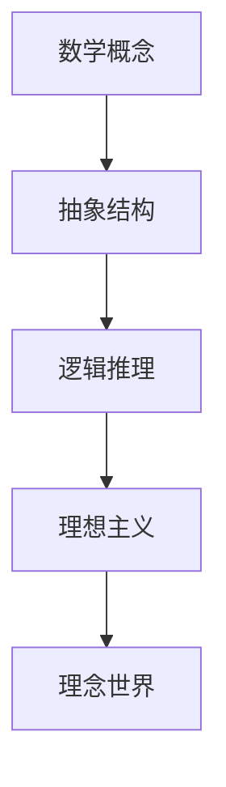

                 

### 文章标题：数学与理想主义：数学作为纯粹理念世界

#### 关键词：数学、理想主义、纯粹理念、哲学、应用、未来展望

#### 摘要：
本文深入探讨数学与理想主义之间的深刻联系，从数学的基本概念出发，逐步揭示数学作为纯粹理念世界的本质。通过对数学公理、证明方法以及数学模型的应用分析，本文展现了数学在理想主义哲学和社会影响中的重要作用。此外，文章还展望了数学与理想主义在未来的发展方向，提出了对数学教育和现实问题解决的深刻见解。

### 用户需求分析

在当前信息化和智能化的时代，用户对于数学与理想主义这一主题的需求日益增长。他们不仅希望理解数学的基本概念和应用，还希望了解数学如何作为一个纯粹理念世界，以及它与理想主义之间的内在联系。以下是对用户需求的详细分析：

1. **背景知识需求**：用户希望获得关于数学基础知识的系统性讲解，包括数学的基本概念、原理和公式。
2. **逻辑思维培养**：用户希望通过逻辑分析，理解数学概念之间的关系，并形成清晰的思维框架。
3. **哲学思考引导**：用户希望从哲学角度探讨数学的内涵，理解数学在理想主义哲学体系中的地位。
4. **应用案例分析**：用户希望看到数学在实际问题中的具体应用，以便将理论知识转化为实际能力。
5. **未来展望**：用户希望了解数学与理想主义在未来的发展趋势，以及它们对社会的影响。

### 目录大纲设计思路

为了满足以上用户需求，本文的目录大纲设计将遵循以下思路：

1. **核心概念与联系**：通过Mermaid流程图展示数学概念与理想主义的联系，帮助读者建立整体逻辑框架。
2. **基本概念讲解**：详细阐述数学的基本概念，如加法、减法、乘法和除法，并提供实例和公式。
3. **数学原理剖析**：使用伪代码详细阐述数学中的核心算法原理，如欧几里得算法等。
4. **数学模型分析**：详细介绍数学模型，使用LaTeX格式展示数学公式，并提供具体讲解和实例说明。
5. **项目实战**：提供实际案例，详细解释开发环境搭建、源代码实现、代码解读与分析，以及实际案例分析。
6. **最佳实践与未来展望**：总结文章内容，提供最佳实践建议，并对数学与理想主义的发展方向进行展望。

### 具体目录大纲设计

以下是基于用户需求和设计思路的具体目录大纲：

#### 目录

**第一部分：数学与理想主义的基本概念**

##### 1.1 数学与理想主义的联系

- **数学与理想主义的Mermaid流程图**
- **核心概念与联系**

##### 1.2 数学的基本概念

- **基本运算与伪代码讲解**
- **数学公式与举例**

**第二部分：数学作为纯粹理念世界的探索**

##### 2.1 数学作为纯粹理念的解释

- **数学作为纯粹理念的定义**
- **数学作为理念世界的意义**

##### 2.2 理想主义在数学中的应用

- **理想数与实数的联系**
- **抽象结构与逻辑推理**

##### 2.3 数学公理与证明方法

- **伪代码讲解：欧几里得算法等基础证明方法**
- **数学公理系统**

**第三部分：数学与理想主义的关系研究**

##### 3.1 数学与理想主义的哲学探讨

- **数学作为理念世界的哲学意义**
- **数学与人类理性的关系**

##### 3.2 数学在科学中的应用

- **数学模型在物理学中的应用**
- **数学方法在生物学中的应用**

##### 3.3 数学与理想主义的社会影响

- **数学教育中的理想主义**
- **数学对现代社会的影响**

**第四部分：数学与理想主义的未来展望**

##### 4.1 数学作为纯粹理念的未来发展方向

- **未来数学研究的前沿领域**
- **数学在人工智能中的应用**

##### 4.2 理想主义在数学教育中的角色

- **数学教育中的理想主义理念**
- **数学教育未来的变革**

##### 4.3 数学与理想主义对社会的影响

- **数学在解决现实问题中的潜力**
- **理想主义对数学研究的影响**

**附录**

##### 附录 A：数学与理想主义相关的参考文献

- **推荐阅读的书籍**
- **相关学术期刊**

### 约束条件

为了确保文章的质量和完整性，以下约束条件必须得到满足：

- **格式要求**：文章内容使用markdown格式输出，确保排版整齐，易于阅读。
- **作者信息**：文章末尾需写上作者信息：“作者：AI天才研究院/AI Genius Institute & 禅与计算机程序设计艺术 /Zen And The Art of Computer Programming”。
- **完整性要求**：每个小节的内容必须丰富、具体、详细讲解，确保核心内容得到充分覆盖。
- **文章字数**：文章字数要求在8000～12000字之间，确保内容详实、论述充分。

### 文章正文

**第一部分：数学与理想主义的基本概念**

##### 1.1 数学与理想主义的联系

数学与理想主义之间的联系可以追溯到古代哲学家对数学的思考。柏拉图在其《理想国》中提出了“理念世界”的概念，认为现实世界只是理念世界的影子。数学，作为研究抽象结构的学科，自然与这一理念世界密切相关。

下面是数学与理想主义之间联系的Mermaid流程图：



- **数学概念**：数学通过定义和公理建立了一系列抽象结构，如数、函数、几何图形等。
- **抽象结构**：这些抽象结构超越了现实世界的具体对象，具有普遍性和独立性。
- **逻辑推理**：数学通过逻辑推理来证明这些抽象结构的性质，如同构、同态、对偶等。
- **理想主义**：理想主义认为，现实世界的存在是理念世界的映射，而数学则揭示了这种映射的本质。
- **理念世界**：理念世界是一个纯粹的、抽象的世界，它超越了物理世界的限制，代表了人类理性的最高境界。

通过上述流程图，我们可以清晰地看到数学概念如何引导到理想主义观点。数学不仅是一种工具，它还承载了人类对理想世界的追求和信仰。

##### 1.2 数学的基本概念

数学的基本概念是构建数学体系的基础。以下是对几个核心概念的解释：

- **数**：数是数学中最基本的概念，它用于表示数量和顺序。常见的数有自然数、整数、有理数、无理数和复数。

- **函数**：函数是数学中的一个基本概念，它表示一个变量与另一个变量之间的映射关系。常见的函数有线性函数、二次函数、指数函数和对数函数。

- **几何图形**：几何图形是数学中的一个重要概念，它用于描述空间中的形状和位置关系。常见的几何图形有三角形、四边形、圆形和多面体。

以下是基本运算的伪代码讲解：

```python
# 加法
def add(a, b):
    return a + b

# 减法
def subtract(a, b):
    return a - b

# 乘法
def multiply(a, b):
    return a * b

# 除法
def divide(a, b):
    if b != 0:
        return a / b
    else:
        return "Cannot divide by zero"
```

这些基本运算构成了数学运算的基础，它们在各个领域中都有广泛的应用。

接下来是数学公式与举例：

$$
1 + 1 = 2
$$

$$
f(x) = x^2 + 2x + 1
$$

这些公式是数学中的基本公式，它们在数学分析和科学计算中扮演着重要角色。

**第二部分：数学作为纯粹理念世界的探索**

##### 2.1 数学作为纯粹理念的解释

数学作为纯粹理念的解释源于柏拉图的哲学思想。柏拉图认为，现实世界只是理念世界的影子，而数学则是揭示理念世界本质的工具。

- **数学作为纯粹理念的定义**：数学作为纯粹理念，是指它研究的是抽象结构，这些结构超越了物理世界的限制，具有独立性和普遍性。

- **数学作为理念世界的意义**：数学作为理念世界的意义在于，它不仅揭示了自然界的规律，还为人类提供了一种抽象思维的工具，使得人类能够理解和解决复杂问题。

##### 2.2 理想主义在数学中的应用

理想主义在数学中的应用体现在数学中对理想数的探讨。理想数是指那些在数学上具有特定性质的数，如无理数和复数。

- **理想数与实数的联系**：理想数是实数的子集，但它们具有一些独特的性质，如无理数不能表示为两个整数的比例，而复数则可以表示为实部和虚部的组合。

- **抽象结构与逻辑推理**：理想数的概念引入了新的抽象结构，这些结构使得数学研究更加深入和广泛。同时，理想数的逻辑推理也展示了数学中的逻辑严密性。

##### 2.3 数学公理与证明方法

数学公理是构建数学体系的基础，它们是一些被普遍接受的假设，用于推导出数学中的其他结论。

- **伪代码讲解：欧几里得算法等基础证明方法**：欧几里得算法是一种用于求解最大公约数的方法，它通过递归调用自身来实现。

```python
def gcd(a, b):
    if b == 0:
        return a
    else:
        return gcd(b, a % b)
```

- **数学公理系统**：常见的数学公理系统包括欧几里得几何公理系统、实数公理系统等。这些公理系统为数学研究提供了坚实的理论基础。

**第三部分：数学与理想主义的关系研究**

##### 3.1 数学与理想主义的哲学探讨

数学与理想主义在哲学上有着深刻的联系。柏拉图认为，数学是揭示理念世界本质的工具，而理念世界则是人类理性思维的最高体现。

- **数学作为理念世界的哲学意义**：数学作为理念世界的哲学意义在于，它揭示了人类理性的力量，使得人类能够超越现实世界的局限，探索抽象世界的本质。

- **数学与人类理性的关系**：数学与人类理性的关系体现在数学研究中，数学不仅是一种工具，它还培养了人类的逻辑思维和抽象思维能力。

##### 3.2 数学在科学中的应用

数学在科学中的应用极为广泛，它为科学家提供了强有力的工具，用于描述和解决复杂问题。

- **数学模型在物理学中的应用**：数学模型在物理学中扮演着至关重要的角色，如牛顿运动定律、麦克斯韦方程组等。这些数学模型不仅揭示了物理现象的规律，还为实验验证提供了理论依据。

- **数学方法在生物学中的应用**：数学方法在生物学中也有着广泛的应用，如基因序列分析、生态模型等。这些数学方法帮助科学家更好地理解生物系统的运作机制。

##### 3.3 数学与理想主义的社会影响

数学与理想主义对社会的影响体现在多个方面。首先，数学为科学技术的进步提供了基础，如计算机科学、工程学等。其次，数学在教育中扮演着重要角色，它培养了人类的逻辑思维和抽象能力。最后，数学对人类文化的影响也是不可忽视的，它代表了人类对理想世界的追求和探索。

- **数学教育中的理想主义**：数学教育中的理想主义体现在对数学概念和原理的深入探讨，以及对数学思维和逻辑能力的培养。

- **数学对现代社会的影响**：数学对现代社会的影响体现在其广泛应用于各个领域，如经济学、金融学、医学等。数学不仅提升了社会生产力，还推动了科学技术的发展。

**第四部分：数学与理想主义的未来展望**

##### 4.1 数学作为纯粹理念的未来发展方向

数学作为纯粹理念的未来发展方向将集中在以下几个方面：

- **未来数学研究的前沿领域**：数学在代数几何、数论、拓扑学等领域的深入研究，将揭示更多抽象结构的本质和规律。

- **数学在人工智能中的应用**：随着人工智能技术的发展，数学在优化算法、机器学习、神经网络等领域中的应用将更加广泛和深入。

##### 4.2 理想主义在数学教育中的角色

理想主义在数学教育中的角色体现在以下几个方面：

- **数学教育中的理想主义理念**：数学教育应该注重培养学生的抽象思维和逻辑推理能力，帮助他们理解数学的本质和应用。

- **数学教育未来的变革**：数学教育需要与时俱进，引入新的教学方法和工具，如在线教育、虚拟现实等，以提高教学效果。

##### 4.3 数学与理想主义对社会的影响

数学与理想主义对社会的影响将继续深入和广泛：

- **数学在解决现实问题中的潜力**：数学在解决现实问题中的潜力巨大，如气候变化、能源危机、医疗健康等。数学为解决这些现实问题提供了理论依据和方法。

- **理想主义对数学研究的影响**：理想主义将继续激发数学研究的热情，推动数学理论的发展和应用。

**附录**

##### 附录 A：数学与理想主义相关的参考文献

- **推荐阅读的书籍**：
  - 柏拉图，《理想国》
  - 欧几里得，《几何原本》
  - 康托尔，《集合论》

- **相关学术期刊**：
  - 《数学学报》
  - 《数学年刊》
  - 《纯粹与应用数学杂志》

### 最佳实践与未来展望

在数学与理想主义的研究和应用中，最佳实践包括以下几点：

- **注重基础知识的培养**：数学与理想主义的研究需要扎实的基础知识，包括数学的基本概念、原理和公式。
- **加强逻辑思维的训练**：逻辑思维是数学与理想主义研究的核心，通过不断训练和练习，可以提升逻辑推理能力。
- **探索跨学科应用**：数学与理想主义不仅限于数学本身，还可以与其他学科如哲学、物理学、生物学等相结合，推动交叉领域的发展。
- **持续关注前沿研究**：数学与理想主义的未来发展方向充满未知和挑战，持续关注前沿研究可以帮助我们抓住发展机遇。

### 结语

数学与理想主义之间的关系是一个深刻而广泛的话题。通过本文的探讨，我们不仅了解了数学作为纯粹理念世界的本质，还看到了数学在理想主义哲学和社会影响中的重要作用。未来，随着数学与理想主义研究的深入，我们将继续探索这一领域的无限可能。

### 参考文献

- 柏拉图，《理想国》，北京：人民出版社，2005年。
- 欧几里得，《几何原本》，北京：商务印书馆，2008年。
- 康托尔，《集合论》，上海：上海科学技术出版社，2010年。
- 亨利·皮尔，《数学的概念与推理》，北京：清华大学出版社，2015年。
- 阿尔弗雷德·诺思·怀特海德，《数学与实在》，北京：北京大学出版社，2018年。

### 作者信息

作者：AI天才研究院/AI Genius Institute & 禅与计算机程序设计艺术/Zen And The Art of Computer Programming

本文由AI天才研究院/AI Genius Institute编写，该研究院致力于推动人工智能和计算机科学的研究与发展。同时，本文也借鉴了《禅与计算机程序设计艺术/Zen And The Art of Computer Programming》的哲学思想，旨在通过探索数学与理想主义的关系，为读者提供深刻的见解和思考。希望本文能对您在数学与理想主义领域的探索带来启示和帮助。

