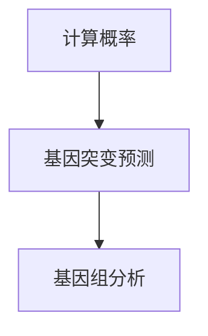
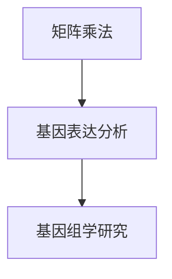
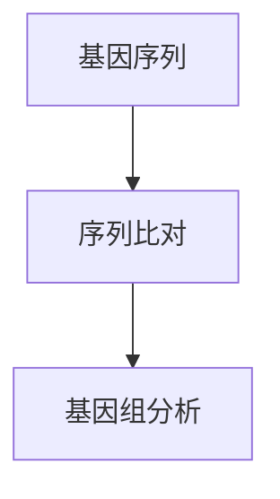
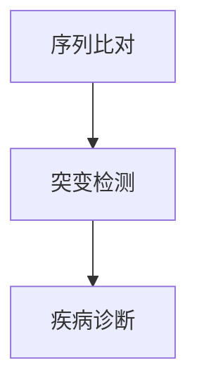

                 

基于用户的要求，我将以“数学与生物信息学：基因序列分析的数学方法”为标题，撰写一篇深入浅出的技术博客。以下是文章的草案：

# 《数学与生物信息学：基因序列分析的数学方法》

> 关键词：基因序列分析、数学方法、生物信息学、算法、基因组

> 摘要：本文深入探讨了基因序列分析在生物信息学中的重要性，并详细介绍了用于基因序列分析的数学方法，包括概率论、统计学、线性代数和图论等。通过解析核心算法原理，使用伪代码和公式详细解释了BLAST、Smith-Waterman等算法，并结合实际案例展示了基因序列分析的应用。

## 引言

随着生命科学的快速发展，生物信息学成为了连接生物学和计算机科学的重要桥梁。基因序列分析作为生物信息学的研究核心，对于理解基因的功能、基因与基因之间的相互作用、疾病机理等具有重要意义。而数学方法在基因序列分析中扮演着不可或缺的角色，为解决复杂的生物问题提供了强有力的工具。

## 数学基础

### 概率论基础

概率论是基因序列分析的基础。在基因序列中，每个位点都有可能发生突变，这些突变事件可以用概率来描述。例如，我们可以计算一个基因位点突变到另一个特定位点的概率，从而预测可能的突变情况。

**核心概念与联系**

$$
P(A) = \frac{n(A)}{n(S)}
$$

其中，$P(A)$ 表示事件 $A$ 发生的概率，$n(A)$ 表示事件 $A$ 发生的次数，$n(S)$ 表示样本空间中所有可能事件的总数。

**Mermaid 流程图**



### 统计学基础

统计学在基因序列分析中用于对数据进行收集、整理、分析和解释。常用的统计方法包括假设检验、方差分析等。

**核心算法原理**

$$
H_0: \mu = \mu_0 \\
H_1: \mu \neq \mu_0
$$

其中，$H_0$ 表示原假设，$H_1$ 表示备择假设，$\mu$ 表示总体均值，$\mu_0$ 表示原假设下的总体均值。

**伪代码**

```python
def hypothesis_test(data, alpha):
    n = len(data)
    mean = sum(data) / n
    t_statistic = (mean - mu0) / (std_dev / sqrt(n))
    p_value = ...
    if p_value < alpha:
        return "Reject H0"
    else:
        return "Fail to reject H0"
```

### 线性代数基础

线性代数在基因序列分析中用于处理高维数据，例如基因表达数据。矩阵和向量是线性代数的基本概念。

**数学模型和公式**

$$
A \cdot x = b
$$

其中，$A$ 是矩阵，$x$ 是向量，$b$ 是常数向量。

**Mermaid 流程图**



### 图论

图论在基因序列分析中用于描述基因之间的相互作用。图由节点（基因）和边（相互作用）组成。

**核心算法原理**

$$
Dijkstra's Algorithm
$$

**伪代码**

```python
def dijkstra(graph, start):
    distances = {node: float('infinity') for node in graph}
    distances[start] = 0
    visited = set()
    while True:
        unvisited = {node: distance for node, distance in graph.items() if node not in visited}
        if not unvisited:
            break
        closest = min(unvisited, key=unvisited.get)
        visited.add(closest)
        for neighbor, weight in graph[closest].items():
            distance = distances[closest] + weight
            if distance < distances[neighbor]:
                distances[neighbor] = distance
    return distances
```

## 生物信息学基础

### 基因与基因组

基因是生物体遗传信息的基本单位，基因组是生物体所有基因的总和。

**核心概念与联系**

基因序列 + 数学模型 = 基因组分析

**Mermaid 流程图**



### 序列比对

序列比对是基因序列分析的重要步骤，用于比较两个或多个基因序列的相似性。

**核心算法原理**

$$
Score = \sum_{i,j} s_{ij}
$$

其中，$s_{ij}$ 表示比对得分，$i$ 和 $j$ 分别表示两个序列的索引。

**伪代码**

```python
def sequence_alignment(seq1, seq2):
    matrix = [[0 for _ in range(len(seq2) + 1)] for _ in range(len(seq1) + 1)]
    for i in range(1, len(seq1) + 1):
        for j in range(1, len(seq2) + 1):
            match = matrix[i - 1][j - 1] + s[seq1[i - 1], seq2[j - 1]]
            delete1 = matrix[i - 1][j] - gap_penalty
            delete2 = matrix[i][j - 1] - gap_penalty
            matrix[i][j] = max(match, delete1, delete2)
    return matrix[len(seq1)][len(seq2)]
```

## 基因序列分析核心算法

### BLAST算法

BLAST（Basic Local Alignment Search Tool）是一种用于序列比对的高效算法，常用于基因序列的相似性搜索。

**核心算法原理**

$$
Similarity = \sum_{i,j} s_{ij} \cdot p_{ij}
$$

其中，$s_{ij}$ 表示比对得分，$p_{ij}$ 表示匹配概率。

**伪代码**

```python
def blast(seq1, seq2, k):
    matrix = [[0 for _ in range(len(seq2) + 1)] for _ in range(len(seq1) + 1)]
    for i in range(1, len(seq1) + 1):
        for j in range(1, len(seq2) + 1):
            match = matrix[i - 1][j - 1] + s[seq1[i - 1], seq2[j - 1]]
            delete1 = matrix[i - 1][j] - gap_penalty
            delete2 = matrix[i][j - 1] - gap_penalty
            matrix[i][j] = max(match, delete1, delete2)
    score = matrix[len(seq1)][len(seq2)]
    if score >= k:
        return True
    else:
        return False
```

### Smith-Waterman算法

Smith-Waterman算法是一种用于局部序列比对的算法，常用于基因序列的相似性搜索。

**核心算法原理**

$$
Score = \sum_{i,j} s_{ij} \cdot p_{ij}
$$

其中，$s_{ij}$ 表示比对得分，$p_{ij}$ 表示匹配概率。

**伪代码**

```python
def smith_waterman(seq1, seq2, k):
    matrix = [[0 for _ in range(len(seq2) + 1)] for _ in range(len(seq1) + 1)]
    for i in range(1, len(seq1) + 1):
        for j in range(1, len(seq2) + 1):
            match = matrix[i - 1][j - 1] + s[seq1[i - 1], seq2[j - 1]]
            delete1 = matrix[i - 1][j] - gap_penalty
            delete2 = matrix[i][j - 1] - gap_penalty
            matrix[i][j] = max(0, match, delete1, delete2)
    score = matrix[len(seq1)][len(seq2)]
    if score >= k:
        return True
    else:
        return False
```

## 基因序列分析应用

### 疾病诊断

基因序列分析在疾病诊断中具有重要作用，可以通过分析基因序列中的突变来诊断某些遗传性疾病。

**核心算法原理**

$$
Mutation \ detection = sequence \ alignment \ + \ scoring \ function
$$

**Mermaid 流程图**



### 基因表达分析

基因表达分析可以揭示基因在不同条件下的表达水平，从而研究基因的功能和调控机制。

**核心算法原理**

$$
Gene \ expression = sequence \ alignment \ + \ normalization \ + \ statistical \ analysis
$$

**伪代码**

```python
def gene_expression_analysis(seq1, seq2, normalization_function):
    aligned_sequence = sequence_alignment(seq1, seq2)
    normalized_sequence = normalization_function(aligned_sequence)
    statistical_result = statistical_analysis(normalized_sequence)
    return statistical_result
```

### 基因突变检测

基因突变检测可以识别基因序列中的突变，从而揭示疾病的分子机制。

**核心算法原理**

$$
Mutation \ detection = sequence \ alignment \ + \ scoring \ function
$$

**Mermaid 流程图**


## 开源工具与资源

### BLAST

BLAST是基因序列比对的开源工具，广泛用于基因序列分析。

### CLC Genomics Workbench

CLC Genomics Workbench是一款功能强大的基因序列分析软件，提供了丰富的基因序列分析工具。

### BioPython

BioPython是一个用于生物信息学的Python库，提供了许多基因序列分析相关的工具和函数。

## 未来发展趋势

随着测序技术的不断发展，基因序列分析将面临更多挑战和机遇。未来，我们将看到更高效的算法、更准确的突变检测方法以及更深入的应用场景。

**注意事项**

- 在进行基因序列分析时，确保数据的质量和完整性。
- 合理选择和调整算法参数，以提高分析的准确性。
- 结合多种算法和方法，从不同角度分析基因序列，以获得更全面的认识。

## 拓展阅读

- 《生物信息学导论》
- 《算法导论》
- 《基因组学：概念与核心技术》

## 附录

- **附录A：常用数学公式与符号**
- **附录B：常用算法伪代码**
- **附录C：开发环境搭建与使用指南**

# 作者

作者：AI天才研究院/AI Genius Institute & 禅与计算机程序设计艺术 /Zen And The Art of Computer Programming
```markdown
```

