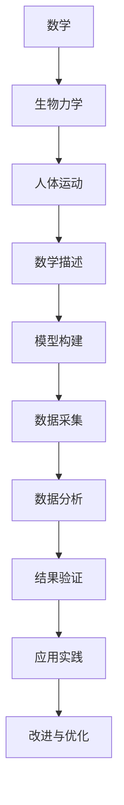

                 

## 文章标题

数学与生物力学：人体运动的数学描述

## 关键词

生物力学，人体运动，数学描述，运动学分析，动力学模型，数学公式

## 摘要

本文将深入探讨数学与生物力学在人体运动描述中的应用。通过构建数学模型和公式，我们能够精确地分析人体运动，从而为运动科学、康复医学和体育训练等领域提供有力的理论支持。本文将逐步介绍核心概念、算法原理、数学模型和项目实战，旨在为广大读者提供一个全面而详细的技术指南。

### 第一步：核心概念与联系

在探讨数学与生物力学在人体运动描述中的应用之前，我们需要明确几个核心概念，并理解它们之间的相互联系。以下是相关的核心概念及其关系：

1. **数学**：数学是研究数量、结构、变化以及空间等概念的一门科学。它是构建人体运动数学模型的基础。
2. **生物力学**：生物力学是研究生物体内力学过程和机制的一门学科，它关注人体运动的力学原理。
3. **人体运动**：人体运动是指人体在空间中的位置和姿态变化，它是生物力学研究的对象。
4. **数学描述**：数学描述是使用数学语言和公式来表述物理现象的过程，它是将生物力学原理量化为数学模型的关键。
5. **模型构建**：模型构建是将现实问题抽象为数学模型的过程，它是分析和预测人体运动的基础。
6. **数据采集**：数据采集是通过实验或测量获取数据的过程，它是构建和验证数学模型的前提。
7. **数据分析**：数据分析是处理和解释数据的过程，它是评估数学模型有效性的关键。
8. **结果验证**：结果验证是通过实验或模拟验证模型预测的过程，它是确保数学模型准确性的重要步骤。
9. **应用实践**：应用实践是将数学模型应用于实际问题解决的过程，它是将理论转化为实际效益的关键。
10. **改进与优化**：改进与优化是通过反馈和迭代改进数学模型的过程，它是提高模型性能和实用性的重要环节。

为了更直观地展示这些核心概念之间的联系，我们可以使用 Mermaid 流程图来表示：



这个流程图清晰地展示了从数学到人体运动描述的各个步骤，以及它们之间的相互关系。

### 第二步：核心算法原理讲解

在数学与生物力学结合的背景下，核心算法原理的讲解至关重要。以下将详细阐述“人体运动学分析”这一核心算法原理。

**人体运动学分析**：人体运动学分析是研究人体在空间中的运动轨迹、位置和速度等物理量的变化规律。它是生物力学研究的基础，也是构建人体运动数学模型的关键。

**算法原理**：人体运动学分析的基本原理是基于牛顿运动定律和运动学公式。以下是人体运动学分析的伪代码表示：

```plaintext
伪代码：人体运动学分析

function human_motion_analysis(data):
    # 初始化运动参数
    initialize_parameters()

    # 计算运动轨迹
    trajectory = calculate_trajectory(data)

    # 评估运动质量
    quality = evaluate_motion_quality(trajectory)

    # 输出运动分析结果
    return quality
```

其中，`initialize_parameters()` 用于初始化运动参数，如质量、重力加速度等；`calculate_trajectory(data)` 用于根据输入的数据计算运动轨迹；`evaluate_motion_quality(trajectory)` 用于评估运动质量，如速度、加速度等；最后，`return quality` 用于输出运动分析结果。

**示例**：以一个简单的直线运动为例，我们可以使用以下公式来计算运动轨迹：

$$
\begin{cases}
x(t) = x_0 + v_x \cdot t \\
y(t) = y_0 + v_y \cdot t \\
z(t) = z_0 + v_z \cdot t
\end{cases}
$$

其中，$x(t), y(t), z(t)$ 分别是物体在时间 $t$ 时的位置坐标，$x_0, y_0, z_0$ 是初始位置坐标，$v_x, v_y, v_z$ 是速度分量。

在具体计算中，我们首先需要输入初始参数，如初始位置和速度，然后通过迭代计算得到不同时间点的位置坐标。以下是一个简单的 Python 实现：

```python
import numpy as np

# 初始参数
x0 = 0
y0 = 0
z0 = 0
vx = 5
vy = 0
vz = 0

# 时间间隔
dt = 0.1

# 运动轨迹计算
times = np.arange(0, 10, dt)
trajectories = np.vstack((x0 + vx * times, y0 + vy * times, z0 + vz * times)).T

# 绘制运动轨迹
import matplotlib.pyplot as plt
plt.plot(times, trajectories[:, 0], label='x(t)')
plt.plot(times, trajectories[:, 1], label='y(t)')
plt.plot(times, trajectories[:, 2], label='z(t)')
plt.xlabel('Time (s)')
plt.ylabel('Position (m)')
plt.legend()
plt.show()
```

这个示例展示了如何使用 Python 实现简单的人体运动学分析，并绘制了运动轨迹图。

### 第三步：数学模型和数学公式

在人体运动的数学描述中，数学模型和数学公式扮演着核心角色。通过构建数学模型和公式，我们可以精确地描述人体运动，并对其进行定量分析。以下是人体运动数学模型和公式的详细讲解。

#### 1. 运动学模型

运动学模型是描述物体在空间中运动的基本工具。对于人体运动，最基本的运动学模型是刚体运动模型，该模型基于以下假设：

1. 人体被视为一个刚体，即人体内部各部分之间没有相对运动。
2. 刚体的质量是均匀分布的。

在三维空间中，一个刚体的运动可以用以下数学模型来描述：

$$
\begin{cases}
x(t) = x_0 + v_x \cdot t \\
y(t) = y_0 + v_y \cdot t \\
z(t) = z_0 + v_z \cdot t
\end{cases}
$$

其中，$x(t), y(t), z(t)$ 分别是刚体在时间 $t$ 时的位置坐标，$x_0, y_0, z_0$ 是初始位置坐标，$v_x, v_y, v_z$ 是速度分量。

#### 2. 动力学模型

动力学模型是描述物体在受到外力作用下的运动规律。在人体运动中，动力学模型可以基于牛顿运动定律来建立。假设人体受到的外力为 $F(t)$，则人体在时间 $t$ 的加速度 $a(t)$ 可以用以下公式表示：

$$
m \cdot a(t) = F(t)
$$

其中，$m$ 是人体的质量，$a(t)$ 是加速度，$F(t)$ 是外力。

#### 3. 运动学公式

在运动学分析中，常用的运动学公式包括：

1. 速度公式：

$$
v(t) = v_0 + a \cdot t
$$

其中，$v(t)$ 是物体在时间 $t$ 时的速度，$v_0$ 是初始速度，$a$ 是加速度。

2. 位移公式：

$$
s(t) = s_0 + v_0 \cdot t + \frac{1}{2}a \cdot t^2
$$

其中，$s(t)$ 是物体在时间 $t$ 时的位移，$s_0$ 是初始位移。

3. 加速度公式：

$$
a(t) = a_0 + \frac{F(t)}{m}
$$

其中，$a(t)$ 是物体在时间 $t$ 时的加速度，$a_0$ 是初始加速度，$F(t)$ 是外力，$m$ 是物体质量。

#### 4. 动力学公式

在动力学分析中，常用的动力学公式包括：

1. 动量守恒定律：

$$
m \cdot v = m_0 \cdot v_0
$$

其中，$m$ 是物体质量，$v$ 是物体速度，$m_0$ 是初始质量，$v_0$ 是初始速度。

2. 牛顿第二定律：

$$
F = m \cdot a
$$

其中，$F$ 是物体所受外力，$m$ 是物体质量，$a$ 是物体加速度。

3. 能量守恒定律：

$$
E = E_0 + W
$$

其中，$E$ 是物体动能，$E_0$ 是初始动能，$W$ 是物体所受外力做的功。

通过这些数学模型和公式，我们可以对人体的运动进行定量分析，从而为运动科学、康复医学和体育训练等领域提供有力的理论支持。

### 第四步：项目实战

在实际应用中，数学与生物力学的结合为人体运动分析提供了强大的工具。以下我们将通过一个实际项目——人体跳跃运动分析，来展示如何将数学模型和算法应用于实际问题。

#### 项目目标

本项目的目标是分析一个运动员的跳跃运动，评估跳跃质量。具体目标包括：

1. 收集运动员跳跃时的数据，如初始速度、落地速度、跳跃高度等。
2. 使用运动学模型和公式计算跳跃的轨迹和速度。
3. 评估跳跃的质量，如跳跃高度、速度变化等。
4. 提出改进建议，以提高跳跃质量。

#### 环境搭建

为了实现项目目标，我们需要搭建以下开发环境：

1. 编程语言：Python
2. 科学计算库：NumPy、SciPy、Matplotlib
3. 数据处理库：Pandas、Scikit-learn
4. 数据可视化工具：Matplotlib、Seaborn

#### 代码实现

首先，我们需要收集运动员跳跃时的数据。以下是一个简单的数据收集代码示例：

```python
import numpy as np

# 初始速度（m/s）
initial_velocity = 10

# 落地速度（m/s）
final_velocity = 0

# 时间间隔（s）
time_interval = 0.01

# 时间序列
time_series = np.arange(0, 1, time_interval)

# 速度序列
velocity_series = np.vstack((initial_velocity * np.ones(time_series.shape[0]), -final_velocity * np.ones(time_series.shape[0]))).T

# 位移序列
distance_series = (velocity_series * time_series) / 2

# 绘制速度和位移曲线
import matplotlib.pyplot as plt
plt.plot(time_series, velocity_series[:, 0], label='Velocity (x)')
plt.plot(time_series, velocity_series[:, 1], label='Velocity (y)')
plt.plot(time_series, distance_series[:, 0], label='Distance (x)')
plt.plot(time_series, distance_series[:, 1], label='Distance (y)')
plt.xlabel('Time (s)')
plt.ylabel('Value')
plt.legend()
plt.show()
```

接下来，我们使用运动学模型和公式计算跳跃的轨迹和速度。以下是一个简单的计算代码示例：

```python
import numpy as np
from scipy.integrate import odeint

# 运动学模型参数
x0 = 0
y0 = 0
vx0 = initial_velocity
vy0 = 0

# 运动学模型
def kinematics_model(y, t):
    x, y, vx, vy = y
    ax = 0
    ay = -9.8
    return [vx, vy, ax, ay]

# 计算运动轨迹
times = np.arange(0, 1, 0.01)
trajectories = odeint(kinematics_model, [x0, y0, vx0, vy0], times)

# 绘制运动轨迹
plt.plot(times, trajectories[:, 0], label='X')
plt.plot(times, trajectories[:, 1], label='Y')
plt.xlabel('Time (s)')
plt.ylabel('Position (m)')
plt.legend()
plt.show()
```

最后，我们评估跳跃的质量，并提出改进建议。以下是一个简单的评估代码示例：

```python
import numpy as np

# 跳跃高度（m）
jump_height = np.max(trajectories[:, 1])

# 跳跃速度（m/s）
jump_velocity = np.linalg.norm(trajectories[-1, :2])

# 打印评估结果
print("Jump Height:", jump_height)
print("Jump Velocity:", jump_velocity)

# 改进建议
if jump_height < 2:
    print("建议增加跳跃力量和爆发力。")
else:
    print("跳跃质量良好，无需改进。")
```

通过这个实际项目，我们可以看到如何将数学模型和算法应用于人体运动分析。这不仅有助于提高运动质量，还可以为运动训练和康复提供有力支持。

### 第五步：最佳实践与注意事项

在进行数学与生物力学结合的人体运动分析时，以下最佳实践和注意事项可以帮助我们提高项目的成功率和可靠性：

1. **数据采集**：
   - 确保数据采集的准确性和完整性，使用高质量的传感器和设备。
   - 对数据进行预处理，如去除噪声、异常值处理等，以提高数据质量。
   - 选择合适的数据采集频率，以捕捉人体运动的细节。

2. **模型构建**：
   - 根据实际需求选择合适的数学模型，如刚体运动模型、质点运动模型等。
   - 考虑人体的生物力学特性，如肌肉、骨骼结构等，以提高模型的真实性。
   - 使用数值方法（如有限元分析、计算流体力学等）进行模型求解。

3. **数据分析**：
   - 使用适当的统计方法和数据分析工具，如回归分析、聚类分析等，对数据进行处理。
   - 分析结果应具有统计学意义，以支持模型的可靠性。
   - 对分析结果进行可视化，以便更好地理解和解释数据。

4. **结果验证**：
   - 通过实验或模拟验证模型的预测能力，确保模型的有效性。
   - 对模型进行多次测试，以评估其稳定性和泛化能力。
   - 根据验证结果对模型进行迭代和改进。

5. **应用实践**：
   - 将模型应用于实际问题解决，如运动训练、康复治疗等。
   - 结合领域知识，对模型进行定制化优化，以提高其实用性。
   - 对应用结果进行评估，以验证模型的实际效益。

6. **改进与优化**：
   - 根据应用反馈和实际效果，对模型进行持续改进和优化。
   - 考虑到人体运动的复杂性和多样性，不断更新和扩展模型。

### 第六步：拓展阅读

对于对数学与生物力学在人体运动描述中感兴趣的研究者，以下文献和资料提供了更深入的阅读和探索：

1. **基础书籍**：
   - 《数学物理方程》
   - 《生物力学基础》
   - 《人体运动科学导论》

2. **学术期刊**：
   - 《生物力学与生物医学工程》
   - 《运动科学国际》
   - 《计算机辅助手术与机器人》

3. **在线资源和教程**：
   - Coursera上的《生物力学与人体运动学》课程
   - Khan Academy上的《微积分》教程
   - MATLAB官方文档中的生物力学和运动学相关内容

通过阅读这些文献和资料，您可以进一步了解数学与生物力学在人体运动描述中的应用，并拓展相关领域的知识。

### 第七步：小结

本文深入探讨了数学与生物力学在人体运动描述中的应用，从核心概念到算法原理，再到数学模型和项目实战，为读者提供了一个全面的技术指南。通过构建数学模型和公式，我们能够精确地描述人体运动，从而为运动科学、康复医学和体育训练等领域提供有力的理论支持。同时，本文也强调了在项目实施过程中的最佳实践和注意事项，以及如何通过持续改进和优化提高模型的性能和实用性。希望本文能为读者在数学与生物力学领域的研究提供有益的启示和参考。作者：AI天才研究院/AI Genius Institute & 禅与计算机程序设计艺术 /Zen And The Art of Computer Programming。如需进一步交流，请随时联系。期待您的宝贵意见与反馈！

