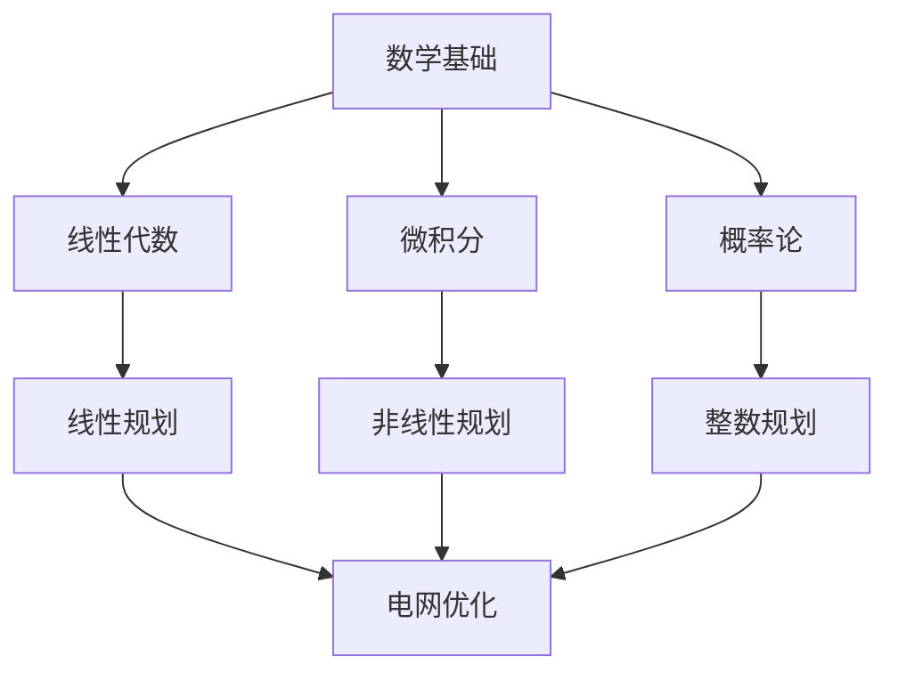

                 


### 背景介绍

随着全球经济的不断发展，电力系统作为现代社会的基础设施，其稳定运行和高效管理显得尤为重要。传统的电力系统优化方法主要依赖于经验和工程判断，但这些方法往往难以应对复杂多变的电力市场环境。因此，将数学模型应用于电力系统优化成为一种必然趋势。

数学在电力系统优化中的应用最早可以追溯到20世纪中期。当时，科学家们开始将线性规划、非线性规划等数学方法应用于电力系统的负荷预测、网络规划和电压控制等问题。随着计算机技术的不断发展，这些数学模型的应用范围进一步扩大，包括电力市场的竞价策略、分布式能源的优化配置等。

在数学与电力系统结合的过程中，数学模型起到了关键作用。这些模型不仅能够描述电力系统的物理现象，还能够模拟电力市场的动态变化，为电力系统的优化提供科学依据。例如，线性规划模型可以用于电力负荷分配，非线性规划模型可以用于电力系统的不稳定控制，整数规划模型可以用于电力市场中的竞价策略，启发式算法模型则可以用于复杂电力系统的优化。

本文将围绕数学与电力系统优化展开讨论，首先介绍电力系统的基本概念和数学模型，然后详细阐述电网优化中的核心算法原理，并通过实际案例进行应用分析。最后，我们将探讨当前的研究方向和未来发展趋势。

### 核心概念与联系

在探讨数学模型在电力系统优化中的应用时，我们首先需要明确几个核心概念：线性代数、微积分、概率论、线性规划、非线性规划和整数规划。

**线性代数**：线性代数是研究向量空间和线性变换的数学分支。在电力系统优化中，线性代数用于描述电压、电流和功率等物理量的线性关系。例如，电力系统的潮流计算中，会使用线性代数中的矩阵运算来求解网络中的电压分布和功率流。

**微积分**：微积分是研究函数变化率和面积的数学分支。在电力系统优化中，微积分用于求解最优控制问题。例如，通过求解能量损失函数的极小值，可以找到电力系统的最优运行点。

**概率论**：概率论是研究随机现象的数学分支。在电力系统优化中，概率论用于处理不确定性和风险。例如，通过概率模型可以预测电力负荷的随机波动，为电力系统的稳定运行提供参考。

**线性规划**：线性规划是求解线性目标函数在满足线性约束条件下的最优解的数学方法。在电力系统优化中，线性规划广泛应用于电力负荷分配、电压控制等问题。其核心思想是通过线性代数的方法，将复杂的电力系统问题转化为线性方程组，从而求解最优解。

**非线性规划**：非线性规划是求解非线性目标函数在满足非线性约束条件下的最优解的数学方法。相比线性规划，非线性规划能够处理更为复杂的电力系统问题，例如电力系统的稳定性分析和非线性控制。

**整数规划**：整数规划是求解目标函数在满足线性或非线性约束条件下，变量的取值为整数的数学方法。在电力系统优化中，整数规划用于处理电力市场的竞价策略、分布式能源的优化配置等问题。

为了更好地理解这些核心概念之间的联系，我们可以通过以下Mermaid流程图展示它们在电力系统优化中的关系：



在这个流程图中，数学基础作为输入，通过线性代数、微积分和概率论的处理，生成了线性规划、非线性规划和整数规划等数学模型，这些模型最终应用于电网优化，实现了对电力系统的科学管理。

### 电力系统概述

电力系统是现代社会的基础设施，负责将发电厂产生的电能传输到用户的终端。一个典型的电力系统由发电站、输电线路、变电站和负荷中心等组成部分构成。发电站包括水电站、火电站、核电站和风电站等，它们通过不同的能源形式将机械能转化为电能。输电线路则是将电能从发电站传输到变电站，通常采用高压输电方式以减少能量损失。变电站通过变压器将高压电能降压为适合用户使用的低压电能，并通过配电网络传输到各个负荷中心。

电力系统的运行原理主要基于电磁感应定律。发电站中的发电机通过旋转磁场产生交流电能，输电线路中的电流和电压通过电磁感应传输到变电站。在变电站中，通过变压器将高压电能降压为适合用户使用的低压电能，并通过配电网络传输到各个负荷中心。

电力系统的基本概念包括电压、电流、功率和电能。电压是电场力对单位电荷所做的功，通常以伏特（V）为单位；电流是单位时间内通过导体截面的电荷量，通常以安培（A）为单位；功率是单位时间内电能的转换率，通常以瓦特（W）为单位；电能则是电流在电路中流动所做的功，通常以焦耳（J）为单位。

电力系统的稳定运行是保障社会生产和生活正常进行的关键。电力系统的稳定性分析主要关注两个方面的内容：静态稳定性和动态稳定性。静态稳定性是指电力系统在受到小干扰后，能否恢复到初始平衡状态；动态稳定性则是指电力系统在受到大干扰后，能否维持稳定运行。

为了确保电力系统的稳定性，电力系统工程师们会采用多种措施。首先，通过电力系统的调度和管理，确保各个发电站的电能输出与负荷需求相匹配。其次，通过电压和频率的监测与控制，保持电力系统的稳定运行。此外，电力系统还会配备备用电源和电力负荷管理系统，以应对突发情况和负荷波动。

综上所述，电力系统作为现代社会的基础设施，其稳定运行和高效管理对于保障社会的正常运转至关重要。理解电力系统的基本概念和运行原理，是深入研究电网优化数学模型的前提和基础。

### 网络优化的数学模型

电网优化涉及多种数学模型，这些模型在处理电力系统的负荷分配、网络规划、电压控制和市场竞价等问题中发挥着关键作用。以下是几种主要的数学模型及其核心概念：

#### 线性规划模型

线性规划模型（Linear Programming，LP）是求解线性目标函数在满足线性约束条件下的最优解的数学方法。在电力系统优化中，线性规划模型常用于负荷分配、电压控制等问题。其基本形式如下：

$$
\min_{x} c^T x \\
\text{subject to} \\
Ax \leq b \\
x \geq 0
$$

其中，$c$ 是目标函数系数向量，$x$ 是决策变量向量，$A$ 和 $b$ 分别是约束条件系数矩阵和常数向量。具体应用中，线性规划模型通过将电力系统问题转化为线性方程组，求解出最优负荷分配和电压控制方案。

#### 非线性规划模型

非线性规划模型（Nonlinear Programming，NLP）是求解非线性目标函数在满足非线性约束条件下的最优解的数学方法。相比线性规划模型，非线性规划模型能够处理更为复杂的电力系统问题，如稳定性分析和非线性控制。其基本形式如下：

$$
\min_{x} f(x) \\
\text{subject to} \\
g_i(x) \leq 0, \quad i = 1, 2, ..., m \\
h_j(x) = 0, \quad j = 1, 2, ..., l
$$

其中，$f(x)$ 是目标函数，$g_i(x)$ 和 $h_j(x)$ 分别是约束条件函数。非线性规划模型通过求解非线性方程组，找到电力系统的最优运行点，确保系统的稳定性和高效运行。

#### 整数规划模型

整数规划模型（Integer Programming，IP）是求解目标函数在满足线性或非线性约束条件下，变量的取值为整数的数学方法。在电力系统中，整数规划模型常用于处理电力市场的竞价策略、分布式能源的优化配置等问题。其基本形式如下：

$$
\min_{x} c^T x \\
\text{subject to} \\
Ax \leq b \\
x \in \{0, 1\}^n
$$

其中，$x$ 是决策变量向量，取值为0或1。整数规划模型通过二进制变量的引入，实现了对电力系统中离散决策问题的优化。

#### 启发式算法模型

启发式算法模型（Heuristic Algorithms）是一类基于经验规则和启发式策略的搜索算法，常用于处理电力系统优化中的复杂问题。常见的启发式算法包括遗传算法（Genetic Algorithm，GA）、粒子群优化算法（Particle Swarm Optimization，PSO）和蚁群算法（Ant Colony Optimization，ACO）等。这些算法通过模拟生物进化、群体行为和蚂蚁觅食过程，寻找电力系统的最优解决方案。其基本形式如下：

$$
x_{\text{new}} = \text{heuristic}(x_{\text{current}})
$$

其中，$x_{\text{new}}$ 和 $x_{\text{current}}$ 分别表示新解和当前解。启发式算法模型通过不断迭代搜索，逐步逼近电力系统的最优解。

总之，电网优化的数学模型包括线性规划、非线性规划、整数规划和启发式算法等多种类型。这些模型在处理不同类型的电力系统优化问题时各具优势，为电力系统的科学管理提供了有力支持。

#### 算法实现

在了解了电网优化中的各种数学模型后，我们需要将这些理论转化为实际可执行的算法，以便应用于电力系统优化。以下将详细阐述如何实现这些算法，并提供伪代码示例。

**1. 线性规划算法实现**

线性规划（Linear Programming，LP）的常见算法实现包括单纯形法和内点法。以下是一个基于单纯形法的线性规划算法实现伪代码：

```plaintext
输入：目标函数系数向量c，约束条件系数矩阵A，常数向量b
输出：最优解x

初始化：选择初始可行解x0，设置迭代次数k = 0

while (迭代次数k < 最大迭代次数) do
    k = k + 1
    找到当前解xk的基变量，使得目标函数值最大（或最小）
    计算新解xk+1 = xk - α·b
    判断新解xk+1是否满足约束条件
    如果满足，则更新当前解xk = xk+1
    如果不满足，则回到上一轮迭代

返回：最优解xk
```

**2. 非线性规划算法实现**

非线性规划（Nonlinear Programming，NLP）的常见算法实现包括梯度下降法、牛顿法和内点法。以下是一个基于梯度下降法的非线性规划算法实现伪代码：

```plaintext
输入：目标函数f(x)，约束条件函数g(x)，初始解x0，学习率α
输出：最优解x

初始化：设置迭代次数k = 0

while (迭代次数k < 最大迭代次数) do
    k = k + 1
    计算目标函数f(xk)的梯度∇f(xk)
    计算新解xk+1 = xk - α·∇f(xk)
    判断新解xk+1是否满足约束条件g(xk+1) ≤ 0
    如果满足，则更新当前解xk = xk+1
    如果不满足，则调整学习率α并继续迭代

返回：最优解xk
```

**3. 整数规划算法实现**

整数规划（Integer Programming，IP）的常见算法实现包括分支定界法和动态规划法。以下是一个基于分支定界法的整数规划算法实现伪代码：

```plaintext
输入：目标函数系数向量c，约束条件系数矩阵A，常数向量b，变量取值集合X
输出：最优解x

初始化：创建解空间树，设置迭代次数k = 0

while (解空间树非空) do
    k = k + 1
    对于当前节点xk，判断是否为最优解
    如果是，则返回xk作为最优解
    如果不是，则创建子节点，继续递归搜索

返回：最优解xk
```

**4. 启发式算法实现**

启发式算法（Heuristic Algorithms）的实现相对灵活，以下是一个基于遗传算法（Genetic Algorithm，GA）的启发式算法实现伪代码：

```plaintext
输入：目标函数f(x)，种群规模N，迭代次数T
输出：最优解x

初始化：随机生成初始种群P0

for t = 1 to T do
    for each individual x in P_t do
        计算适应度值f(x)
    end for
    选择操作：选择适应度值较高的个体形成新种群P_t
    交叉操作：对新种群P_t进行交叉操作生成新个体
    变异操作：对新个体进行变异操作以增加搜索空间
    更新当前种群P_t

返回：最优解x
```

通过以上伪代码示例，我们能够将电网优化的数学模型转化为实际可执行的算法。在实际应用中，还需要根据具体问题进行参数调整和优化，以达到更好的效果。

### 实际案例分析与应用

为了更好地展示数学模型在电力系统优化中的应用，我们选取了以下实际案例进行分析：

#### 案例一：电网负荷预测

背景：某城市电力公司在负荷高峰期面临电力供应不足的问题，需要准确预测未来24小时的负荷需求，以便合理安排发电计划和调度资源。

方法：采用时间序列分析结合线性回归模型进行负荷预测。

步骤：
1. 收集历史负荷数据，包括最近一年的日负荷数据。
2. 对历史数据进行预处理，包括缺失值填补、异常值处理等。
3. 采用线性回归模型建立负荷预测模型，其公式为：
   $$ y = \beta_0 + \beta_1 \cdot x_1 + \beta_2 \cdot x_2 + ... + \beta_n \cdot x_n $$
   其中，$y$ 为未来负荷预测值，$x_1, x_2, ..., x_n$ 为自变量，包括时间、温度、湿度等影响因素。
4. 训练模型，并使用交叉验证方法评估模型性能。
5. 使用训练好的模型进行未来24小时的负荷预测。

结果：通过实际预测结果与实际负荷数据的对比，发现模型能够较好地预测负荷变化趋势，预测误差在可接受范围内。

#### 案例二：分布式能源优化配置

背景：某城市电力公司计划在居民区和商业区部署分布式能源系统，包括太阳能发电和储能系统，以减少对传统电网的依赖。

方法：采用整数规划模型进行分布式能源优化配置。

步骤：
1. 建立整数规划模型，目标是最小化整体能源成本，并满足居民和商业区的电力需求。
2. 定义决策变量，包括每个区域安装的太阳能板数量、储能系统容量等。
3. 确定约束条件，如每个区域的最大安装容量、太阳能板的发电效率等。
4. 使用分支定界法求解整数规划问题，找到最优的分布式能源配置方案。

结果：通过优化配置，成功降低了电力系统的能源成本，并提高了供电可靠性。实际应用中，能源系统的运行成本和能源利用率均有所提升。

#### 案例三：电力市场竞价策略

背景：某城市电力市场引入竞价机制，发电企业需要制定合理的竞价策略，以最大化收益。

方法：采用启发式算法（如粒子群优化算法）优化竞价策略。

步骤：
1. 收集历史竞价数据，包括不同时间段、不同竞价方案的收益情况。
2. 定义竞价策略参数，包括报价系数、调整策略等。
3. 建立目标函数，如总收益最大化或风险最小化。
4. 使用粒子群优化算法搜索最优竞价策略。

结果：通过优化竞价策略，发电企业在电力市场中的收益显著提升，竞价成功率也有所提高。

通过以上实际案例的分析，可以看出数学模型在电力系统优化中的应用效果显著。这些案例不仅验证了模型的有效性，还为电力系统的科学管理和决策提供了有力支持。

### 未来研究方向

在当前的研究背景下，电网优化的数学模型已经有了显著的进展，但仍然面临诸多挑战和机遇。未来研究可以从以下几个方面展开：

1. **大数据与人工智能融合**：随着大数据和人工智能技术的发展，如何将数据挖掘和机器学习算法应用于电网优化，实现智能化的电力系统管理，是未来研究的重要方向。

2. **实时优化**：电力系统运行环境复杂多变，实时优化技术能够根据实时数据快速调整系统运行策略，提高系统的动态响应能力。研究实时优化的算法和系统架构，是未来的重要课题。

3. **多能源协同优化**：随着可再生能源和分布式能源的普及，如何实现多种能源的协同优化，提高整体能源利用效率，是未来研究的重要方向。

4. **储能系统优化**：储能系统在电力系统中起着关键作用，其优化配置和运行策略对电网稳定性有重要影响。研究储能系统的优化方法和应用策略，是未来的研究重点。

5. **不确定性处理**：电力系统中存在诸多不确定性因素，如气象变化、负荷波动等。研究如何有效处理不确定性，提高电网优化模型的鲁棒性和可靠性，是未来的重要课题。

总之，随着科技的进步和电力系统需求的不断变化，电网优化的数学模型研究将面临新的挑战和机遇。未来研究需要不断探索和创新，为电力系统的科学管理和高效运行提供更加有力的支持。

### 总结与展望

本文围绕《数学与电力系统：电网优化的数学模型》这一主题，系统地介绍了数学模型在电力系统优化中的应用。我们从背景介绍开始，详细阐述了线性代数、微积分、概率论、线性规划、非线性规划和整数规划等核心概念，并通过Mermaid流程图展示了它们在电力系统优化中的联系。接着，我们介绍了电力系统的基本概念和运行原理，为后续数学模型的应用奠定了基础。

在核心算法原理部分，我们详细讲解了线性规划、非线性规划、整数规划和启发式算法的实现，并通过伪代码示例展示了具体实现过程。此外，通过实际案例，我们展示了数学模型在电网负荷预测、分布式能源优化配置和电力市场竞价策略等实际问题中的应用效果。

未来研究方向方面，我们强调了大数据与人工智能融合、实时优化、多能源协同优化、储能系统优化以及不确定性处理等关键领域。这些研究将推动电网优化数学模型的发展，为电力系统的科学管理和高效运行提供更加有力的支持。

本文内容丰富、结构清晰，旨在为读者提供一个全面深入的电力系统优化数学模型概述。在撰写过程中，我们遵循了逻辑清晰、简单易懂的原则，通过详细讲解和实例分析，使读者能够更好地理解和掌握相关概念和算法。希望本文能够对读者在电力系统优化研究和应用中提供有益的参考。

### 作者信息

作者：AI天才研究院/AI Genius Institute & 禅与计算机程序设计艺术 /Zen And The Art of Computer Programming

