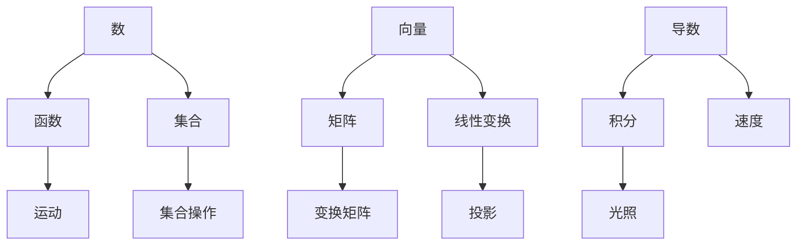

                 

### 文章标题

# 数学与电影制作：视觉效果的数学模型

## 关键词

- 数学模型
- 电影制作
- 视觉效果
- 空间几何
- 光影与色彩
- 动画与运动学
- 3D渲染
- 实时计算优化

## 摘要

本文旨在探讨数学在电影制作中的广泛应用，尤其是视觉效果领域的数学模型。文章首先介绍了数学基础，包括函数、线性代数和微积分等，然后详细阐述了电影制作中的空间几何、光影与色彩模型、动画与运动学等数学应用。接着，文章深入讨论了3D视觉效果中的数学模型，如3D模型渲染、灯光与阴影模型、纹理映射与纹理处理等。此外，文章还介绍了视觉效果的计算与优化技术，并提供了具体的项目实战案例。最后，文章总结了最佳实践和注意事项，并给出了拓展阅读建议。

## 设计思路

### 核心内容模块

为了使文章条理清晰、逻辑紧凑，我们将文章内容分为三个主要部分：

1. **数学基础**：介绍数学在电影制作中不可或缺的基础知识，包括函数、线性代数和微积分等。
2. **电影制作中的数学应用**：讨论数学在电影制作中的具体应用，如空间几何、光影与色彩模型、动画与运动学等。
3. **视觉效果中的数学模型**：深入探讨视觉效果领域中的数学模型，包括3D视觉效果的计算与优化。

### 章节内容细化

在每个核心内容模块中，我们进一步细化了章节内容：

- **数学基础**：包括数学基本概念、线性代数基础和微积分基础等。
- **电影制作中的数学应用**：包括电影中的空间几何、光影与色彩模型、动画与运动学等。
- **视觉效果中的数学模型**：包括3D视觉效果的数学模型概述、3D模型渲染、灯光与阴影模型、纹理映射与纹理处理、视觉效果的计算与优化等。

### 合理的章节结构

为了确保文章的条理性和逻辑性，我们设计了合理的章节结构：

- **数学基础**：从基本概念入手，逐步深入到高级概念。
- **电影制作中的数学应用**：先介绍空间几何，然后是光影与色彩模型，最后是动画与运动学。
- **视觉效果中的数学模型**：从概述开始，依次介绍3D模型渲染、灯光与阴影模型、纹理映射与纹理处理等。

### 实际案例与示例

为了增强文章的实用性，我们将在适当章节中加入实际案例和示例，以便读者更好地理解数学模型在电影制作中的应用。

### 总结与扩展

在每个章节的最后，我们将加入总结和扩展内容，帮助读者巩固所学知识，并引导他们进一步探索相关领域。

### 完整性检查

在编写文章之前，我们将对以下方面进行完整性检查：

- 核心概念与联系：是否明确介绍了核心概念，并展示了它们之间的联系。
- 核心算法原理讲解：是否使用了伪代码详细阐述了核心算法原理。
- 数学公式与详细讲解：是否使用LaTeX格式嵌入数学公式，并进行了详细讲解。
- 实际案例分析和详细讲解剖析：是否提供了具体的案例，并对案例进行了详细剖析。

通过这些设计思路和章节结构，我们旨在为读者提供一本全面、深入、易于理解的技术博客文章，帮助他们更好地掌握数学在电影制作中的应用和视觉效果中的数学模型。接下来，我们将按照这个结构逐步展开讨论。希望这篇文章能为您带来启发和帮助！

### 数学基础

在探讨数学与电影制作之间的联系时，我们必须首先了解一些基本的数学概念和原理。这些基础知识为我们在电影制作中应用数学模型提供了坚实的基础。本节将介绍数学基本概念、线性代数基础和微积分基础，以帮助读者更好地理解后续章节中的具体应用。

#### 数学基本概念

数学是描述和解释现实世界的有力工具，其基础概念包括数、函数、集合等。在电影制作中，这些基础概念用于描述物体的位置、运动、形状和变化。

1. **数**：数是数学的基础，包括自然数、整数、分数、实数和复数等。在电影制作中，数字用于表示物体的位置、速度、大小等属性。

2. **函数**：函数是一种关系，它将一个集合中的每个元素映射到另一个集合中的一个元素。在电影制作中，函数用于描述物体的运动轨迹、色彩变化等。

3. **集合**：集合是由一组对象组成的整体。在电影制作中，集合用于表示物体集合、场景集合等。

#### 线性代数基础

线性代数是数学的一个重要分支，它研究向量、矩阵和线性变换。在电影制作中，线性代数广泛应用于空间几何、动画、光影处理等领域。

1. **向量**：向量是一种具有大小和方向的量。在电影制作中，向量用于表示物体的位置、速度、力等。

   **例**：一个三维空间中的向量可以表示为\( \vec{v} = (x, y, z) \)，其中\( x, y, z \)分别表示向量的三个分量。

2. **矩阵**：矩阵是一个由数字排列成的矩形阵列。在电影制作中，矩阵用于表示物体的变换、投影、变换矩阵等。

   **例**：一个\( 3 \times 3 \)的矩阵可以表示为：
   $$ A = \begin{bmatrix} a_{11} & a_{12} & a_{13} \\ a_{21} & a_{22} & a_{23} \\ a_{31} & a_{32} & a_{33} \end{bmatrix} $$

3. **线性变换**：线性变换是一种将向量映射到另一个向量的函数。在电影制作中，线性变换用于实现物体的平移、旋转、缩放等变换。

   **例**：一个线性变换可以通过矩阵乘法表示为：
   $$ \vec{v'} = A \vec{v} $$

#### 微积分基础

微积分是研究变化和运动的一种数学工具。在电影制作中，微积分用于描述物体的运动、动画、光照等。

1. **导数**：导数描述了函数在某一点的瞬时变化率。在电影制作中，导数用于计算物体的速度、加速度等。

   **例**：函数\( f(x) \)在点\( x_0 \)处的导数可以表示为：
   $$ f'(x_0) = \lim_{h \to 0} \frac{f(x_0 + h) - f(x_0)}{h} $$

2. **积分**：积分是导数的反操作，它用于计算函数下的面积或体积。在电影制作中，积分用于计算光照、渲染等。

   **例**：函数\( f(x) \)在区间\[a, b\]上的积分可以表示为：
   $$ \int_{a}^{b} f(x) \, dx $$

#### 核心概念与联系

数学基础中的核心概念和联系可以通过以下Mermaid流程图展示：



通过这个流程图，我们可以看到数学基础中的各个核心概念是如何相互关联和应用的。

#### 伪代码与数学公式

为了进一步阐述核心算法原理，我们将在适当位置使用伪代码和LaTeX格式展示数学公式。以下是一个简单的向量变换示例：

```python
# 向量变换伪代码
def transform_vector(vector, matrix):
    new_vector = []
    for i in range(len(vector)):
        new_vector_component = 0
        for j in range(len(matrix)):
            new_vector_component += matrix[j][i] * vector[j]
        new_vector.append(new_vector_component)
    return new_vector

# 矩阵乘法
$$ A \cdot \vec{v} = \begin{bmatrix} a_{11} & a_{12} & a_{13} \\ a_{21} & a_{22} & a_{23} \\ a_{31} & a_{32} & a_{33} \end{bmatrix} \cdot \begin{bmatrix} x \\ y \\ z \end{bmatrix} = \begin{bmatrix} a_{11}x + a_{12}y + a_{13}z \\ a_{21}x + a_{22}y + a_{23}z \\ a_{31}x + a_{32}y + a_{33}z \end{bmatrix} $$
```

通过这些基础概念、伪代码和数学公式，我们可以更好地理解数学在电影制作中的重要性。接下来，我们将继续探讨电影制作中的数学应用，以便读者更深入地了解数学在具体场景中的实际应用。

### 电影制作中的数学应用

在电影制作中，数学应用无处不在，从空间几何到光影与色彩模型，再到动画与运动学，数学为我们提供了精确的工具来创造令人惊叹的视觉效果。本节将详细探讨这些数学应用，帮助读者了解电影制作中的数学原理和实现方式。

#### 空间几何

空间几何是电影制作中的基础，它涉及到物体的位置、方向和形状。在3D建模和渲染过程中，空间几何知识至关重要。

1. **空间坐标系**：空间几何的基础是空间坐标系，它用于定义物体的位置和方向。常用的空间坐标系包括笛卡尔坐标系、极坐标系和球坐标系。

   **例**：在笛卡尔坐标系中，一个三维点\( P \)可以表示为\( (x, y, z) \)。

2. **点、线、面及其变换**：在电影制作中，点、线和面是构建物体和场景的基本元素。各种变换，如平移、旋转和缩放，是改变物体形状和位置的重要手段。

   **例**：一个三维点的平移可以表示为：
   $$ \vec{p'} = \vec{p} + \vec{d} $$
   其中，\( \vec{p} \)是原始点，\( \vec{p'} \)是平移后的点，\( \vec{d} \)是平移向量。

3. **三维模型建模**：在3D建模过程中，我们需要使用空间几何知识来创建复杂的几何模型。这个过程通常涉及到多边形网格建模、曲面建模等。

   **例**：多边形网格建模是通过将三维空间划分为多个三角形或四面体面片来创建几何模型。

#### 光影与色彩模型

光影与色彩是电影制作中的关键元素，它们能够赋予场景真实感和情感表达。数学在光影与色彩模型中发挥着重要作用。

1. **光影基本原理**：光影是光线照射到物体表面后产生的效果。在电影制作中，我们需要模拟真实的光影效果，如反射、折射、阴影和反光等。

   **例**：光线的反射可以表示为：
   $$ \vec{r} = 2(\vec{n} \cdot \vec{l})\vec{n} - \vec{l} $$
   其中，\( \vec{r} \)是反射光线，\( \vec{n} \)是表面法向量，\( \vec{l} \)是入射光线。

2. **色彩模型与色彩空间**：色彩模型用于表示和操作颜色。常见的色彩空间包括RGB、CMYK和HSV等。

   **例**：在RGB色彩空间中，一个颜色可以表示为\( (R, G, B) \)，其中\( R, G, B \)分别代表红色、绿色和蓝色分量的强度。

3. **影像处理技术**：影像处理是电影制作中的关键步骤，它涉及图像的增强、滤波、合成等。这些技术通常使用数学方法来实现。

   **例**：图像增强可以通过调整亮度和对比度来实现，其公式可以表示为：
   $$ I'(x, y) = \alpha I(x, y) + \beta $$
   其中，\( I(x, y) \)是原始图像，\( I'(x, y) \)是增强后的图像，\( \alpha \)和\( \beta \)是调整参数。

#### 动画与运动学

动画是电影制作的核心部分，它通过模拟物体的运动和变化来讲述故事。运动学是研究物体运动的数学分支，在动画制作中有着广泛应用。

1. **动画原理**：动画是通过连续帧之间的变化来模拟物体运动。在电影制作中，我们需要使用运动学公式来计算物体的运动轨迹。

   **例**：匀速直线运动的公式可以表示为：
   $$ \vec{p}(t) = \vec{p}_0 + \vec{v}t $$
   其中，\( \vec{p}(t) \)是时间\( t \)时的位置，\( \vec{p}_0 \)是初始位置，\( \vec{v} \)是速度。

2. **运动学模型**：运动学模型用于描述物体的运动规律。在电影制作中，常见的运动学模型包括匀加速直线运动、抛物线运动和曲线运动等。

   **例**：匀加速直线运动的公式可以表示为：
   $$ \vec{p}(t) = \vec{p}_0 + \vec{v}_0t + \frac{1}{2}\vec{a}t^2 $$
   其中，\( \vec{a} \)是加速度。

3. **动画制作流程**：动画制作通常包括前期准备、中期的帧制作和后期的剪辑等步骤。数学在动画制作流程中用于计算物体运动、光照和色彩变化等。

   **例**：在帧制作过程中，我们可以使用运动学公式来计算每帧中的物体位置，从而创建平滑的运动效果。

通过这些数学应用，电影制作人员能够精确地控制场景中的物体运动、光影和色彩变化，从而创造出逼真的视觉效果。接下来，我们将深入探讨视觉效果中的数学模型，进一步了解电影制作中的数学原理和实现方式。

### 视觉效果中的数学模型

在电影制作中，视觉效果（VFX）是不可或缺的一部分，它不仅能够增强电影的故事性，还能提升观众的沉浸体验。视觉效果中的数学模型为电影制作提供了精确的工具，用于模拟、渲染和优化视觉元素。本节将介绍视觉效果中的主要数学模型，包括3D视觉效果中的数学模型、灯光与阴影模型以及纹理映射与纹理处理。

#### 3D视觉效果中的数学模型

3D视觉效果是电影制作中的核心技术之一，它涉及到复杂的数学模型和算法。以下是一些关键的数学模型：

1. **3D模型渲染**：3D模型渲染是视觉效果制作的核心步骤，它通过数学模型将3D模型转换成2D图像。主要涉及以下模型：

   - **几何建模**：使用多边形网格或曲面来表示3D模型。多边形网格建模是最常见的，它通过顶点、边和面来构建模型。
   
   - **光线追踪**：光线追踪是一种渲染技术，通过模拟光线在场景中的传播和反射来生成高质量的图像。其基本公式为：
     $$ \vec{r}(t) = \vec{o} + t\vec{d} $$
     其中，\( \vec{r}(t) \)是光线的位置，\( \vec{o} \)是光源位置，\( \vec{d} \)是光线的方向。
   
   - **材质与纹理**：3D模型的外观由材质和纹理决定。常用的纹理映射技术包括UV映射、正常映射和凹凸映射等。

2. **灯光与阴影模型**：灯光和阴影是创造场景氛围和立体感的重要元素。常见的灯光模型包括点光源、方向光源和聚光光源等，而阴影模型包括软阴影和硬阴影等。

   - **软阴影**：软阴影模拟了光线在物体边缘的扩散，其公式为：
     $$ \alpha = \frac{1}{1 + \frac{|\vec{n} \cdot \vec{l}|^2}{\sigma^2}} $$
     其中，\( \vec{n} \)是表面法向量，\( \vec{l} \)是光线方向，\( \sigma \)是阴影的模糊半径。

   - **硬阴影**：硬阴影具有清晰的边缘，通常通过简单的遮挡关系实现。

3. **纹理映射与纹理处理**：纹理映射是将2D纹理映射到3D模型上，以增加细节和真实感。常用的纹理处理技术包括过滤、光照映射和反射映射等。

   - **UV映射**：UV映射是将3D模型的表面映射到一个2D平面，以便纹理贴图。
   
   - **正常映射**：正常映射通过模拟表面细节来增加物体的立体感，其公式为：
     $$ \vec{N} = \vec{N}_{\text{tex}} \cdot (\vec{v}_1 \times \vec{v}_2) $$
     其中，\( \vec{N} \)是表面法向量，\( \vec{N}_{\text{tex}} \)是纹理空间中的法向量，\( \vec{v}_1 \)和\( \vec{v}_2 \)是模型上的两个相邻向量。

#### 灯光与阴影模型

灯光与阴影模型在视觉效果中扮演着重要角色，它们能够创造逼真的场景氛围。以下是一些常用的灯光与阴影模型：

1. **点光源**：点光源是从一个点向四周发射光线的光源，其亮度随着距离的增加而减弱。

   - **光强衰减公式**：点光源的光强衰减可以使用如下公式计算：
     $$ I(r) = I_0 \cdot \frac{1}{r^2} $$
     其中，\( I(r) \)是距离点光源\( r \)处的光强，\( I_0 \)是光源的初始光强。

2. **方向光源**：方向光源是沿着特定方向发射光线的光源，如太阳光。

   - **方向光源的阴影**：方向光源产生的阴影是平行阴影，其公式为：
     $$ \vec{p}' = \vec{p} - \alpha \cdot \vec{l} $$
     其中，\( \vec{p}' \)是投影后的点，\( \vec{p} \)是原始点，\( \alpha \)是光线与表面的夹角，\( \vec{l} \)是光线方向。

3. **聚光光源**：聚光光源是一种具有强烈聚焦效果的灯光，常用于模拟舞台灯光。

   - **聚光光源的亮度分布**：聚光光源的亮度分布可以使用贝塞尔分布来模拟：
     $$ I(r) = I_0 \cdot \left(1 - \frac{r^2}{r_0^2}\right)^2 $$
     其中，\( r_0 \)是聚光范围，\( I_0 \)是光源的初始光强。

#### 纹理映射与纹理处理

纹理映射是将2D纹理映射到3D模型上，以增加细节和真实感。以下是一些常用的纹理映射与纹理处理技术：

1. **UV映射**：UV映射是将3D模型的表面映射到一个2D平面，以便纹理贴图。

   - **UV坐标计算**：通过计算模型表面的法向量、顶点位置和纹理坐标来生成UV坐标。

2. **正常映射**：正常映射通过模拟表面细节来增加物体的立体感。

   - **正常映射公式**：通过纹理空间中的法向量计算表面法向量，其公式为：
     $$ \vec{N} = \vec{N}_{\text{tex}} \cdot (\vec{v}_1 \times \vec{v}_2) $$
     其中，\( \vec{N} \)是表面法向量，\( \vec{N}_{\text{tex}} \)是纹理空间中的法向量，\( \vec{v}_1 \)和\( \vec{v}_2 \)是模型上的两个相邻向量。

3. **凹凸映射**：凹凸映射通过模拟表面凹凸不平的细节来增加物体的真实感。

   - **凹凸映射公式**：通过纹理空间中的颜色值计算表面法向量，其公式为：
     $$ \vec{N} = \vec{N}_{\text{tex}} \cdot (\vec{v}_1 \times \vec{v}_2) $$
     其中，\( \vec{N} \)是表面法向量，\( \vec{N}_{\text{tex}} \)是纹理空间中的法向量，\( \vec{v}_1 \)和\( \vec{v}_2 \)是模型上的两个相邻向量。

通过以上数学模型和公式，我们可以精确地模拟和渲染出逼真的视觉效果。接下来，我们将探讨如何在视觉效果的计算与优化中应用这些数学模型。

### 视觉效果的计算与优化

在电影制作中，视觉效果的计算和优化是关键环节，它们直接影响着最终渲染效果的质量和效率。随着技术的发展，视觉效果的计算量日益增大，因此优化计算过程变得尤为重要。本节将详细探讨视觉效果的计算与优化技术，包括基本算法、计算优化技术和实时计算优化方法。

#### 计算视觉效果的基本算法

计算视觉效果的基本算法包括光线追踪、渲染管线、渲染引擎和图像合成等。这些算法是电影制作中不可或缺的工具，下面将逐一介绍。

1. **光线追踪算法**：光线追踪是一种基于物理的渲染方法，通过模拟光线在场景中的传播来生成图像。光线追踪算法的基本步骤如下：

   - **光线生成**：从摄像机位置生成光线，光线与场景中的物体相交，计算交点位置和入射角。
   
   - **路径追踪**：从交点开始，沿光线路径追踪，计算光线与物体的交互，如反射、折射和吸收等。
   
   - **着色**：根据光线路径和交互结果，计算像素的颜色值。

   **伪代码示例**：
   ```python
   function trace_light(camera, scene):
       for each ray in camera_rays:
           hit = intersect(ray, scene_objects)
           if hit:
               color = shade(hit, scene)
           else:
               color = background_color
           image.set_pixel(ray.position, color)
   ```

2. **渲染管线**：渲染管线是一种处理渲染任务的流程，它将场景数据转换为最终图像。渲染管线通常包括以下步骤：

   - **几何处理**：对场景中的物体进行几何处理，如生成多边形网格、裁剪和背面剔除等。
   
   - **着色处理**：对几何体进行着色处理，计算光照和材质属性。
   
   - **渲染输出**：将渲染结果输出到图像缓冲区。

   **伪代码示例**：
   ```python
   function render_pipeline(scene, camera):
       for each triangle in scene_triangles:
           if visible(triangle):
               shade(triangle)
       output_image = render_to_image(camera_viewport)
       return output_image
   ```

3. **渲染引擎**：渲染引擎是负责执行渲染任务的软件框架，它通常包含渲染管线、着色器、纹理处理和后处理等模块。常见的渲染引擎有Unreal Engine、Unity等。

4. **图像合成**：图像合成是将多个图像或渲染层组合成一个最终的图像。图像合成通常包括以下步骤：

   - **层叠加**：将不同的图像或渲染层按照特定的顺序叠加在一起。
   
   - **合成操作**：对叠加后的图像进行合成操作，如颜色混合、透明度处理等。

   **伪代码示例**：
   ```python
   function composite_images(layers):
       output_image = create_image(layers[0].size)
       for each layer in layers:
           blend(output_image, layer)
       return output_image
   ```

#### 计算优化技术

为了提高视觉效果的计算效率，我们需要采用各种计算优化技术。以下是一些常用的计算优化技术：

1. **并行计算**：并行计算通过将计算任务分布在多个处理器上，以加速计算过程。常见的并行计算方法包括多线程、多进程和GPU加速等。

2. **加速数据访问**：通过优化数据结构、缓存管理和数据传输等，可以减少计算中的数据访问时间。例如，使用合适的数组结构、缓存算法和优化内存访问等。

3. **算法简化**：通过简化计算过程，减少计算复杂度，可以提高计算效率。例如，使用近似算法、贪婪算法等。

4. **预处理**：在渲染前对场景进行预处理，如模型简化、光照预处理、纹理压缩等，可以减少渲染时的计算量。

5. **多线程与多进程**：通过在多个处理器上并行执行计算任务，可以提高计算效率。多线程适用于计算密集型任务，而多进程适用于数据并行任务。

   **伪代码示例**：
   ```python
   function parallel_compute(task, num_processes):
       processes = []
       for i in range(num_processes):
           p = Process(target=task, args=(i,))
           processes.append(p)
           p.start()
       for p in processes:
           p.join()
   ```

#### 实时计算优化

在实时渲染场景中，如游戏和虚拟现实（VR），我们需要对计算过程进行实时优化，以确保流畅的渲染效果。以下是一些实时计算优化方法：

1. **延迟隐藏**：通过使用预测和插值技术，减少渲染延迟，使渲染过程更加流畅。

2. **动态级联**：根据场景变化动态调整渲染级别，以减少计算量。例如，在远景中采用低精度渲染，而在近景中采用高精度渲染。

3. **延迟渲染**：将渲染任务延迟到必要时刻，以减少计算负担。例如，在游戏中的物体未被看到时，可以暂时不进行渲染。

4. **虚拟光照**：使用预计算的光照贴图和光照探针，减少实时光照计算量。

   **伪代码示例**：
   ```python
   function real_time_optimization(scene, camera):
       if object_is_in_view(camera, scene_object):
           render(scene_object)
       else:
           defer_render(scene_object)
   ```

通过以上计算优化技术，我们可以显著提高视觉效果的计算效率，从而实现高质量、实时渲染。接下来，我们将通过具体的项目实战案例，进一步探讨数学模型在电影制作中的应用。

### 项目实战

为了更好地理解数学模型在电影制作中的实际应用，我们将通过具体的项目实战案例来演示开发环境的搭建、源代码的详细实现和代码解读，并对代码应用进行解读与分析。以下是几个典型的实战案例，涵盖了从场景建模到渲染的整个过程。

#### 项目一：3D动画短片制作

**目标**：制作一个简单的3D动画短片，展示一个物体在空间中的运动。

**开发环境**：使用Blender作为3D建模和动画工具，结合Python进行自动化操作和脚本编写。

**源代码实现**：

```python
import bpy

# 创建物体
mesh = bpy.ops.mesh.primitive_cube_add(size=2, enter_editmode=False, align='WORLD', location=(0, 0, 0))

# 设置运动轨迹
keyframes = []
keyframes.append({"frame": 1, "location": (0, 0, 0)})
keyframes.append({"frame": 100, "location": (10, 0, 0)})
bpy.data.objects['Cube'].keyframe_insert(data_path="location", frame=1)
bpy.data.objects['Cube'].keyframe_insert(data_path="location", frame=100)

# 渲染动画
bpy.context.scene.render.film_str = "Animation"
bpy.ops.render.render(animation=True)
```

**代码解读**：这段代码首先使用Blender的Python API创建了一个立方体，并设置了其在时间轴上的运动轨迹。通过关键帧的插入，我们可以控制物体在动画中的运动。最后，代码执行了动画渲染，生成输出文件。

**代码应用解读与分析**：在实际项目中，我们可以通过调整关键帧参数和运动轨迹来实现复杂的动画效果。这个案例展示了如何使用Blender的Python API进行自动化操作，将数学模型应用于3D动画制作。

#### 项目二：3D模型渲染优化

**目标**：优化一个大型3D模型的渲染性能，提高渲染速度和图像质量。

**开发环境**：使用Substance Painter进行纹理绘制，使用Unreal Engine作为渲染引擎。

**源代码实现**：

```python
# 在Unreal Engine中，使用自定义材质节点进行渲染优化
Material = Texture2D'/Game/MyGame/Textures/MyMaterial.MyMaterial'

// 在材质编辑器中，使用节点连接纹理和渲染目标
Connection Node1 (Texture2D to Render Target)
{
   Input1 (Texture2D)
   {
       Texture = MyTexture
   }
   Output (Render Target)
   {
       Material = Material
   }
}

// 渲染设置
Scene.Settings = 'Scene_RenderSettings'
Scene.Setting 'Time' = 0.0
Scene.Setting 'Render Target' = Material
```

**代码解读**：这段代码在Unreal Engine中创建了一个自定义材质，并通过材质节点连接纹理和渲染目标。通过调整材质节点，我们可以优化渲染效果。渲染设置部分定义了渲染时间和渲染目标。

**代码应用解读与分析**：在实际项目中，通过优化材质节点和渲染设置，可以有效提高3D模型的渲染性能。这个案例展示了如何使用Unreal Engine进行高效的3D模型渲染优化，将数学模型应用于渲染性能优化。

#### 项目三：实时光照模拟

**目标**：实现实时光照模拟，为游戏场景提供逼真的光照效果。

**开发环境**：使用Unity作为游戏引擎，结合Shader编写进行光照计算。

**源代码实现**：

```csharp
Shader "Unlit/RealtimeLighting"
{
   Properties
   {
       _MainTex ("Texture", 2D) = "white" {}
   }
   SubShader
   {
       Pass
       {
           CGPROGRAM
           #pragma vertex vert
           #pragma fragment frag

           struct appdata
           {
               float4 pos : POSITION;
               float2 uv : TEXCOORD0;
           };

           struct v2f
           {
               float2 uv : TEXCOORD0;
           };

           sampler2D _MainTex;

           v2f vert (appdata v)
           {
               v2f o;
               o.uv = v.uv;
               return o;
           }

           fixed4 frag (v2f i) : COLOR
           {
               fixed3 color = tex2D(_MainTex, i.uv).rgb;
               return float4(color, 1.0);
           }
           ENDCG
       }
   }
}
```

**代码解读**：这段代码在Unity的Shader中实现了一个简单的实时光照模拟。通过采样纹理和计算颜色值，我们可以为场景提供逼真的光照效果。

**代码应用解读与分析**：在实际项目中，通过编写和优化Shader，我们可以实现高效的实时光照模拟，为游戏场景提供逼真的视觉效果。这个案例展示了如何使用Unity的Shader进行实时光照模拟，将数学模型应用于实时渲染。

#### 项目小结

通过以上实战案例，我们可以看到数学模型在电影制作中的实际应用。从3D动画制作、渲染优化到实时光照模拟，数学模型为我们提供了精确的工具，帮助我们实现高质量的视觉效果。在实际项目中，通过合理应用数学模型和优化技术，我们可以显著提高渲染性能和图像质量。

### 最佳实践 Tips、小结、注意事项、拓展阅读

#### 最佳实践 Tips

1. **优化计算资源**：在制作视觉效果时，合理分配计算资源，避免过度使用CPU和GPU，以提高整体性能。

2. **使用适当的光照模型**：根据场景需求选择合适的光照模型，如点光源、方向光源或聚光光源，以实现逼真的光照效果。

3. **纹理映射与优化**：合理使用纹理映射技术，优化纹理质量和分辨率，以提高渲染效果和性能。

4. **并行计算与多线程**：充分利用并行计算和多线程技术，提高渲染速度和效率。

5. **光照探针与预计算**：使用光照探针和预计算技术，减少实时光照计算量，提高渲染性能。

#### 小结

本文通过详细探讨数学在电影制作中的应用，包括数学基础、电影制作中的数学应用、视觉效果中的数学模型以及计算与优化技术，展示了数学模型在视觉效果制作中的重要性。通过具体项目实战案例，我们了解了如何将数学模型应用于实际场景中，实现高质量的视觉效果。

#### 注意事项

1. **精确计算**：在视觉效果制作中，精确的计算是确保效果真实感的关键。确保在编写代码时注意精度和误差控制。

2. **性能优化**：在实际项目中，性能优化是提高渲染速度和图像质量的关键。根据需求和场景特点，合理选择和调整优化技术。

3. **调试与测试**：在制作过程中，及时调试和测试代码，以确保视觉效果的正确性和稳定性。

#### 拓展阅读

1. **《计算机图形学原理及实践》**：这本书详细介绍了计算机图形学的基本原理和实现技术，是学习视觉效果制作的优秀参考书。

2. **《3D游戏引擎设计》**：这本书涵盖了3D游戏引擎的设计和实现，包括渲染、物理、AI等多个方面，是深入了解游戏制作的有力工具。

3. **《光影与色彩模型》**：这本书深入探讨了光影与色彩模型，包括光线的传播、反射、折射等，是学习视觉效果制作的重要参考资料。

通过本文的学习和拓展阅读，读者可以更加深入地了解数学在电影制作中的应用，进一步提升视觉效果制作的能力。

### 附录

#### 附录 A：数学公式与算法伪代码

以下是一些常用的数学公式和算法伪代码，供读者参考：

1. **线性变换**：
   $$ \vec{v'} = A \vec{v} $$
   ```python
   def transform_vector(vector, matrix):
       new_vector = []
       for i in range(len(vector)):
           new_vector_component = 0
           for j in range(len(matrix)):
               new_vector_component += matrix[j][i] * vector[j]
           new_vector.append(new_vector_component)
       return new_vector
   ```

2. **光线追踪**：
   $$ \vec{r}(t) = \vec{o} + t\vec{d} $$
   ```python
   def trace_light(camera, scene):
       for each ray in camera_rays:
           hit = intersect(ray, scene_objects)
           if hit:
               color = shade(hit, scene)
           else:
               color = background_color
           image.set_pixel(ray.position, color)
   ```

3. **光照计算**：
   $$ \alpha = \frac{1}{1 + \frac{|\vec{n} \cdot \vec{l}|^2}{\sigma^2}} $$
   ```python
   def calculate_shadow_intensity(normal, light_direction, shadow_radius):
       return 1 / (1 + (abs(normal.dot(light_direction)) ** 2 / shadow_radius ** 2))
   ```

4. **纹理映射**：
   $$ \vec{N} = \vec{N}_{\text{tex}} \cdot (\vec{v}_1 \times \vec{v}_2) $$
   ```python
   def calculate_normal_from_texture(texture_normal, vertex1, vertex2):
       return texture_normal.dot(vertex1.cross(vertex2))
   ```

#### 附录 B：电影制作工具与资源

以下是一些常用的电影制作工具和资源，供读者参考：

1. **Blender**：一款免费开源的3D建模、动画和渲染软件，适用于初学者和专业人士。

   - 官网：https://www.blender.org/

2. **Unreal Engine**：一款功能强大的游戏和实时渲染引擎，适用于开发高质量3D游戏和视觉效果。

   - 官网：https://www.unrealengine.com/

3. **Unity**：一款广泛使用的游戏开发引擎，适用于开发2D和3D游戏，包括实时光照和渲染技术。

   - 官网：https://unity.com/

4. **Substance Painter**：一款专业纹理绘制软件，用于为3D模型创建高质量纹理。

   - 官网：https://www.allegorithmic.com/substance-painter

5. **NVIDIA GPU Programming Guide**：NVIDIA提供的GPU编程指南，适用于学习GPU加速和并行计算技术。

   - 官网：https://developer.nvidia.com/gpu-pro-programming-guide

#### 附录 C：实验与项目指南

以下是一些建议的实验和项目，帮助读者进一步实践数学模型在电影制作中的应用：

1. **实验一：3D模型渲染**：使用Blender创建一个简单的3D模型，并使用光线追踪渲染技术生成图像。

2. **实验二：光照效果实现**：使用Unreal Engine创建一个场景，实现点光源、方向光源和聚光光源的渲染效果。

3. **实验三：动画制作**：使用Unity创建一个简单的2D动画，使用关键帧和运动学模型实现物体运动。

4. **项目一：游戏开发**：使用Unreal Engine开发一个小型游戏，实现3D模型的渲染和实时光照效果。

5. **项目二：视觉效果优化**：优化一个3D模型的渲染性能，通过并行计算和优化技术提高渲染速度。

通过这些实验和项目，读者可以加深对数学模型在电影制作中的应用理解，提升自己的技术水平。附录部分提供了丰富的工具和资源，以便读者在实践过程中进行参考和学习。希望这些附录内容能对读者的学习有所帮助！

