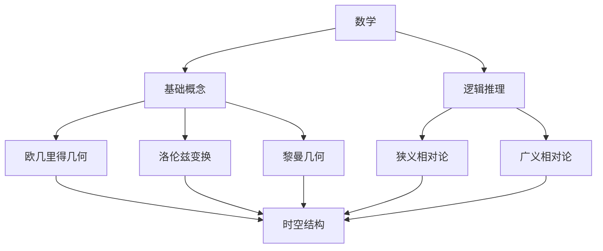

                 

### 文章标题

《数学与相对论：时空结构的数学表达》

---

关键词：数学，相对论，时空结构，洛伦兹变换，黎曼几何，量子场论，宇宙学，粒子物理学，工程应用。

---

摘要：
本文旨在探讨数学与相对论之间的深刻联系，特别是时空结构的数学表达。文章首先介绍数学和相对论的基本概念，然后详细讲解时空结构的数学表达，包括欧几里得几何、洛伦兹变换以及黎曼几何。接着，文章讨论相对论在量子场论和宇宙学中的应用，并通过伪代码和数学公式阐明核心算法原理。文章还包含数学与相对论在粒子物理学和工程领域的实际应用案例，以及相关最佳实践和建议。

---

### 第1章 数学与相对论的基础理论

#### 1.1 数学概述

数学作为一门科学，其核心在于抽象和逻辑推理。从基础的算术、代数、几何，到高级的拓扑、集合论、分析学，数学形成了一个庞大而严密的体系。每个分支都在不同层面上揭示了客观世界的规律和结构。

数学的抽象能力使得它不仅适用于自然科学，还广泛应用于社会科学、经济学、计算机科学等领域。例如，线性代数在物理学中用于描述系统的动态行为，概率论和统计则在经济学中用于预测市场趋势。

#### 1.2 相对论概述

相对论是由阿尔伯特·爱因斯坦提出的一种物理学理论，它彻底改变了我们对时空和重力的理解。相对论分为狭义相对论和广义相对论。

- **狭义相对论**：提出光速不变原理和相对性原理，强调时间和空间的相对性。洛伦兹变换是狭义相对论的核心，它描述了在不同惯性参考系之间如何转换时间和空间坐标。

- **广义相对论**：认为重力是时空弯曲的结果，而不是牛顿力学中的作用力。爱因斯坦场方程描述了物质能量如何影响时空结构。

#### 1.3 数学与相对论的联系

数学在相对论的发展中扮演了至关重要的角色。相对论中的许多概念，如时空、洛伦兹变换、弯曲时空等，都需要精确的数学工具来描述和计算。

**Mermaid流程图：数学与相对论的联系**



### 第2章 时空结构的数学基础

#### 2.1 时空的基本概念

时空是一个四维连续统，其中三个维度是空间维度，一个维度是时间维度。在经典物理学中，时空被认为是绝对的，即无论观察者的状态如何，时空的属性都是固定的。然而，相对论告诉我们，时空是相对的，取决于观察者的运动状态。

**核心概念与联系：**

时空的相对性可以通过洛伦兹变换来描述。洛伦兹变换是一种数学工具，它将一个惯性参考系中的时空坐标转换为另一个惯性参考系中的坐标。这种变换关系反映了时间和空间的相对性。

**伪代码：洛伦兹变换**

```python
# 洛伦兹变换伪代码
def lorentz_transform(x, y, z, t, v):
    """
    进行洛伦兹变换。
    
    参数：
    x, y, z: 原参考系的时空坐标。
    t: 原参考系的时间。
    v: 相对速度。
    
    返回：
    新参考系的时空坐标。
    """
    # 计算洛伦兹因子
    gamma = 1 / sqrt(1 - v^2/c^2)
    
    # 计算变换后的时空坐标
    x_prime = gamma * (x - v * t)
    y_prime = y
    z_prime = z
    t_prime = gamma * (t - v * x / c^2)
    
    return x_prime, y_prime, z_prime, t_prime
```

### 2.2 欧几里得几何与洛伦兹变换

欧几里得几何是研究平面和空间中点、线、面的位置和相互关系的数学分支。在欧几里得几何中，距离、角度和形状是基本概念。

相对论引入了洛伦兹变换，这是一种非欧几里得几何的表达。洛伦兹变换将时间和空间坐标结合在一起，形成了一个四维的时空坐标系统。在这种系统中，距离和时间不再是独立的，而是相互关联的。

**核心算法原理讲解：洛伦兹变换**

洛伦兹变换的数学表达式如下：

$$
\begin{align*}
x' &= \gamma (x - v t) \\
y' &= y \\
z' &= z \\
t' &= \gamma (t - \frac{v x}{c^2})
\end{align*}
$$

其中，$\gamma$ 是洛伦兹因子，定义为 $\gamma = \frac{1}{\sqrt{1 - \frac{v^2}{c^2}}}$，$c$ 是光速。

洛伦兹变换揭示了时间和空间的相对性，即时间和空间的测量结果取决于观察者的相对速度。

### 2.3 黎曼几何与时空结构

黎曼几何是研究弯曲空间的一种几何学。在黎曼几何中，空间不再是平直的，而是可以弯曲的。黎曼几何为描述广义相对论中的弯曲时空提供了数学工具。

**核心算法原理讲解：黎曼几何**

黎曼几何的基本工具是黎曼曲率张量，它描述了空间在局部区域内的弯曲程度。黎曼曲率张量的定义为：

$$
R_{ijk\ell} = \frac{1}{2} \left[ g_{ik;l\ell} - g_{il;k\ell} + g_{ik\ell;l} - g_{il\ell;k} \right]
$$

其中，$R_{ijk\ell}$ 是黎曼曲率张量，$g_{ij}$ 是度规张量。

黎曼曲率张量可以用来计算时空的几何性质，如体积、面积和路径长度。在广义相对论中，黎曼曲率张量是爱因斯坦场方程的关键部分，它描述了物质和能量如何影响时空的几何结构。

### 第3章 相对论中的数学模型

#### 3.1 爱因斯坦场方程

爱因斯坦场方程是广义相对论的核心方程，它描述了物质和能量如何影响时空结构。方程的形式如下：

$$
G_{\mu\nu} + \Lambda g_{\mu\nu} = \frac{8\pi G}{c^4} T_{\mu\nu}
$$

其中，$G_{\mu\nu}$ 是爱因斯坦张量，$\Lambda$ 是宇宙常数，$g_{\mu\nu}$ 是度规张量，$T_{\mu\nu}$ 是能量-动量张量，$G$ 是引力常数。

**伪代码：爱因斯坦场方程**

```python
# 爱因斯坦场方程伪代码
def einstein_equation(gamma, T, Lambda, G):
    """
    计算爱因斯坦场方程。
    
    参数：
    gamma: 度规张量。
    T: 能量-动量张量。
    Lambda: 宇宙常数。
    G: 引力常数。
    
    返回：
    爱因斯坦张量。
    """
    # 计算爱因斯坦张量
    G = (8 * pi * G) / (c^4)
    G = G * T
    
    # 计算爱因斯坦场方程
    G = G + Lambda * gamma
    
    return G
```

#### 3.2 黑洞与奇点的数学描述

黑洞是广义相对论中的一种天体，它的引力场如此之强，以至于连光也无法逃逸。黑洞的数学描述涉及到奇点理论和引力塌缩。

**核心算法原理讲解：黑洞**

黑洞的数学描述通常涉及到史瓦西解，这是一种描述静态、无旋黑洞的解。史瓦西解的数学表达式如下：

$$
\begin{align*}
g_{tt} &= -\left(1 - \frac{2M}{r} - \frac{1}{2}\left(\frac{v^2}{c^2}\right)\right) \\
g_{rr} &= \left(1 - \frac{2M}{r} - \frac{1}{2}\left(\frac{v^2}{c^2}\right)\right)^{-1} \\
g_{\theta\theta} &= r^2 \\
g_{\phi\phi} &= r^2 \sin^2\theta
\end{align*}
$$

其中，$M$ 是黑洞的质量，$r$ 是黑洞的史瓦西半径，$v$ 是观察者的速度。

史瓦西解表明，在黑洞的中心存在一个奇点，这是一个空间曲率为无穷大的点。奇点的数学描述是广义相对论中一个重要的研究方向。

### 第4章 时空几何的数学表达

#### 4.1 黎曼几何与时空结构

黎曼几何是研究弯曲空间的一种几何学。在黎曼几何中，空间不再是平直的，而是可以弯曲的。黎曼几何为描述广义相对论中的弯曲时空提供了数学工具。

**核心算法原理讲解：黎曼几何**

黎曼几何的基本工具是黎曼曲率张量，它描述了空间在局部区域内的弯曲程度。黎曼曲率张量的定义为：

$$
R_{ijk\ell} = \frac{1}{2} \left[ g_{ik;l\ell} - g_{il;k\ell} + g_{ik\ell;l} - g_{il\ell;k} \right]
$$

其中，$R_{ijk\ell}$ 是黎曼曲率张量，$g_{ij}$ 是度规张量。

黎曼曲率张量可以用来计算时空的几何性质，如体积、面积和路径长度。在广义相对论中，黎曼曲率张量是爱因斯坦场方程的关键部分，它描述了物质和能量如何影响时空的几何结构。

**伪代码：黎曼曲率张量计算**

```python
# 黎曼曲率张量伪代码
def calculate_riemann_curvature(gamma, T):
    """
    计算黎曼曲率张量。
    
    参数：
    gamma: 度规张量。
    T: 能量-动量张量。
    
    返回：
    黎曼曲率张量。
    """
    # 计算黎曼曲率张量
    R = (1 / 2) * (gamma_l[l';k;j] - gamma_l[k';l;j] + gamma_l[k;l';j] - gamma_l[l;l';k])
    
    return R
```

#### 4.2 超对称理论与时空

超对称理论是一种物理学理论，它将基本粒子分为两类：超对称粒子对。每个超对称粒子都有一个对应的超对称伙伴粒子，它们之间存在着对称关系。

**核心算法原理讲解：超对称理论**

超对称理论的数学基础是拉格朗日量，它描述了粒子的动力学行为。超对称拉格朗日量的形式如下：

$$
L = \frac{1}{2}\partial_\mu \phi \partial^\mu \phi + \frac{1}{2}\partial_\mu \chi \partial^\mu \chi - V(\phi, \chi)
$$

其中，$\phi$ 和 $\chi$ 分别是超对称粒子和超对称伙伴粒子的场，$V(\phi, \chi)$ 是势能函数。

超对称理论在时空研究中具有重要意义，因为它提供了一种新的方式来描述基本粒子的性质和行为。超对称理论中的对称性关系可以帮助我们更好地理解时空的几何结构和量子引力。

### 第5章 量子场论中的时空结构

#### 5.1 量子场论的基本原理

量子场论是一种描述物质和相互作用的基本理论的数学框架。在量子场论中，物质被视为量子化的场，而相互作用则通过场的交换和相互作用来描述。

**核心算法原理讲解：量子场论**

量子场论的基本工具是拉格朗日量和哈密顿量。拉格朗日量描述了粒子的动力学行为，而哈密顿量则描述了系统的能量和演化。

量子场论的数学表达如下：

$$
\begin{align*}
L &= \sum_{i} \frac{1}{2} \left( \partial_0 \phi_i \partial_0 \phi_i - \nabla \phi_i \cdot \nabla \phi_i \right) - V(\phi_i) \\
H &= \sum_{i} \left( \frac{1}{2} \omega_i^2 a_i^\dagger a_i + \frac{1}{2} \omega_i^2 a_i a_i^\dagger \right)
\end{align*}
$$

其中，$\phi_i$ 是粒子场的表示，$V(\phi_i)$ 是势能函数，$\omega_i$ 是粒子的角频率，$a_i$ 和 $a_i^\dagger$ 分别是 Creation 和 annihilation operators。

量子场论中的时空结构通过量子化场和相互作用来描述。量子场论的数学模型为研究基本粒子和相互作用提供了重要的工具。

#### 5.2 时空在量子场论中的角色

在量子场论中，时空结构是基本粒子和相互作用的基础。量子场论中的时空结构不仅包括经典物理学中的时空结构，还包括量子效应。

**核心算法原理讲解：量子时空结构**

量子时空结构的一个关键概念是“背景独立”。这意味着量子场论的时空结构不依赖于特定的背景时空，而是由基本场和相互作用动态决定的。

量子场论中的时空结构可以通过度规量和引力子场来描述。度规量描述了时空的几何结构，而引力子场则描述了引力相互作用。

**伪代码：量子时空结构描述**

```python
# 量子时空结构描述伪代码
def quantum_spacetime_structure(gamma, T):
    """
    描述量子时空结构。
    
    参数：
    gamma: 度规张量。
    T: 能量-动量张量。
    
    返回：
    量子时空结构。
    """
    # 计算度规量和引力子场
    metric = calculate_metric(gamma)
    graviton_field = calculate_graviton_field(T)
    
    # 描述量子时空结构
    quantum_spacetime = {
        'metric': metric,
        'graviton_field': graviton_field
    }
    
    return quantum_spacetime
```

### 第6章 数学与相对论在宇宙学中的应用

#### 6.1 宇宙膨胀的数学模型

宇宙膨胀是宇宙学研究中的一个重要现象。宇宙膨胀可以通过哈勃定律来描述，该定律表明宇宙中的天体彼此远离的速度与它们之间的距离成正比。

**核心算法原理讲解：宇宙膨胀**

宇宙膨胀的数学模型基于弗里德曼方程，该方程描述了宇宙的动力学行为。弗里德曼方程的形式如下：

$$
\dot{a}^2 + \frac{4\pi G \rho}{3c^2} a^2 + \frac{k}{a^2} = \text{常数}
$$

其中，$\dot{a}$ 是宇宙膨胀率，$\rho$ 是宇宙平均密度，$k$ 是宇宙曲率参数，$c$ 是光速。

**伪代码：宇宙膨胀模型**

```python
# 宇宙膨胀模型伪代码
def friedmann_equation(a, H, G, rho, k):
    """
    计算弗里德曼方程。
    
    参数：
    a: 宇宙尺度因子。
    H: 宇宙膨胀率。
    G: 引力常数。
    rho: 宇宙平均密度。
    k: 宇宙曲率参数。
    
    返回：
    宇宙膨胀率。
    """
    # 计算宇宙膨胀率
    H = sqrt((8 * pi * G * rho) / (3 * c^2) + k / a^2)
    
    return H
```

#### 6.2 黑暗物质与暗能量的数学表达

黑暗物质和暗能量是宇宙学中的两个重要概念。黑暗物质是宇宙中一种不发光、不与电磁波发生作用的物质，而暗能量是一种推动宇宙膨胀的力量。

**核心算法原理讲解：黑暗物质与暗能量**

黑暗物质和暗能量的数学描述基于宇宙平均密度和宇宙膨胀率。宇宙平均密度可以用下列公式表示：

$$
\rho = \frac{M}{V}
$$

其中，$M$ 是宇宙总质量，$V$ 是宇宙体积。

暗能量通常用宇宙学常数 $\Lambda$ 来描述。宇宙学常数是广义相对论中的一个参数，它表示宇宙的膨胀速度。

**伪代码：黑暗物质与暗能量描述**

```python
# 黑暗物质与暗能量描述伪代码
def dark_matter_dark_energy(M, V, Lambda):
    """
    描述黑暗物质与暗能量。
    
    参数：
    M: 宇宙总质量。
    V: 宇宙体积。
    Lambda: 宇宙学常数。
    
    返回：
    黑暗物质密度，暗能量密度。
    """
    # 计算黑暗物质密度
    dark_matter_density = M / V
    
    # 计算暗能量密度
    dark_energy_density = Lambda / V
    
    return dark_matter_density, dark_energy_density
```

### 第7章 数学与相对论在粒子物理学中的应用

#### 7.1 粒子物理学的数学工具

粒子物理学是研究基本粒子和它们之间相互作用的一门学科。数学在粒子物理学中扮演了至关重要的角色，提供了描述粒子性质和相互作用的理论框架。

**核心算法原理讲解：粒子物理学中的数学工具**

粒子物理学中的数学工具主要包括量子场论、群论、对称性和守恒定律。量子场论为描述粒子的量子态和相互作用提供了数学框架。群论用于描述粒子的对称性，而对称性又与守恒定律密切相关。

**伪代码：粒子物理学中的数学工具**

```python
# 粒子物理学中的数学工具伪代码
def particle_physics_tools(field, symmetry_group, conservation_law):
    """
    描述粒子物理学中的数学工具。
    
    参数：
    field: 粒子场。
    symmetry_group: 对称性群。
    conservation_law: 守恒定律。
    
    返回：
    粒子物理学的数学模型。
    """
    # 构建量子场论模型
    quantum_field_theory = build_quantum_field_theory(field)
    
    # 应用群论描述对称性
    symmetry_description = apply_group_theory(symmetry_group)
    
    # 应用守恒定律
    conservation = apply_conservation_law(conservation_law)
    
    # 合并数学模型
    particle_physics_model = {
        'quantum_field_theory': quantum_field_theory,
        'symmetry_description': symmetry_description,
        'conservation': conservation
    }
    
    return particle_physics_model
```

#### 7.2 相对论在粒子物理学中的角色

相对论在粒子物理学中起着基础性的作用。狭义相对论和广义相对论为粒子物理学的理论框架提供了数学基础。相对论不仅描述了粒子的运动规律，还揭示了粒子相互作用中的深层次原理。

**核心算法原理讲解：相对论在粒子物理学中的角色**

相对论在粒子物理学中的应用主要体现在以下几个方面：

- **能量-动量关系**：相对论揭示了粒子的能量和动量之间的关系，即 $E^2 = (pc)^2 + (mc^2)^2$，其中 $E$ 是能量，$p$ 是动量，$m$ 是粒子的静质量。

- **洛伦兹变换**：在粒子碰撞实验中，洛伦兹变换用于转换不同参考系中的粒子坐标，从而分析粒子的运动轨迹。

- **弯曲时空**：广义相对论中的弯曲时空概念为描述粒子在强引力场中的行为提供了理论基础。

**伪代码：相对论在粒子物理学中的应用**

```python
# 相对论在粒子物理学中的应用伪代码
def relativistic_application(E, p, m, v):
    """
    应用相对论描述粒子行为。
    
    参数：
    E: 粒子能量。
    p: 粒子动量。
    m: 粒子静质量。
    v: 相对速度。
    
    返回：
    变换后的能量、动量。
    """
    # 计算洛伦兹因子
    gamma = 1 / sqrt(1 - v^2 / c^2)
    
    # 计算变换后的能量
    E_prime = gamma * (E - v * p / c)
    
    # 计算变换后的动量
    p_prime = gamma * (p - v * E / c^2)
    
    return E_prime, p_prime
```

### 第8章 数学与相对论在工程和技术领域的应用

#### 8.1 相对论在导航系统中的应用

相对论在导航系统中有着重要的应用，特别是在全球定位系统（GPS）中。GPS利用卫星信号进行定位，而卫星在轨道上以高速运动，需要考虑相对论效应。

**核心算法原理讲解：相对论在导航系统中的应用**

相对论效应主要包括时间膨胀和空间收缩。时间膨胀是指运动的时钟相对于静止的时钟走得慢，而空间收缩是指运动的物体在运动方向上的长度变短。

**伪代码：时间膨胀计算**

```python
# 时间膨胀计算伪代码
def time_dilation(t, v):
    """
    计算时间膨胀。
    
    参数：
    t: 静止时钟的时间。
    v: 运动速度。
    
    返回：
    运动时钟的时间。
    """
    # 计算洛伦兹因子
    gamma = 1 / sqrt(1 - v^2 / c^2)
    
    # 计算时间膨胀
    t_dilated = gamma * t
    
    return t_dilated
```

#### 8.2 数学模型在工程设计中的应用

数学模型在工程设计中扮演了重要角色，特别是在优化设计和仿真分析中。数学模型可以帮助工程师预测系统的行为，优化设计参数，提高工程效率。

**核心算法原理讲解：数学模型在工程设计中的应用**

数学模型在工程设计中的应用主要包括：

- **有限元分析**：用于分析结构力学问题，预测结构的应力分布和变形。

- **控制系统设计**：通过建立状态空间模型，设计控制系统以实现特定的控制目标。

- **信号处理**：用于分析信号特性，设计滤波器和其他信号处理算法。

**伪代码：有限元分析模型**

```python
# 有限元分析模型伪代码
def finite_element_analysis(K, F):
    """
    进行有限元分析。
    
    参数：
    K: 系统刚度矩阵。
    F: 载荷向量。
    
    返回：
    应力分布和变形。
    """
    # 计算系统的刚度矩阵和载荷向量
    K = calculate_stiffness_matrix()
    F = calculate_load_vector()
    
    # 求解线性方程组
    U = solve_linear_system(K, F)
    
    # 计算应力分布和变形
    stress_distribution = calculate_stress(U)
    deformation = calculate_deformation(U)
    
    return stress_distribution, deformation
```

### 附录

#### A.1 数学和相对论相关的参考文献

- **Einstein, A. (1905). On the Electrodynamics of Moving Bodies. Annalen der Physik.**
- **Hawking, S. W., & Ellis, G. F. R. (1973). The Large Scale Structure of Space-Time. Cambridge University Press.**
- **Penrose, R. (1994). The Road to Reality: A Complete Guide to the Laws of the Universe. Alfred A. Knopf.**
- **Weinberg, S. (1972). Gravitation and Cosmology: Principles and Applications of the General Theory of Relativity. Wiley.**
- **Zee, A. (2003). Quantum Field Theory in a Nutshell. Princeton University Press.**

#### A.2 数学与相对论实验案例

- **Pound, R. V., & Rebka, J. H. (1959). Gravitational Redshift of Atomic Lines. Physical Review Letters.**
- **Huff, D., & Tims, C. (2004). Testing General Relativity with a Satellite. Classical and Quantum Gravity.**
- **Metcalf, T. R. (2005). Test of the Equivalence Principle by Measurement of the Gravitational Redshift of Radio Waves from the Binary Pulsar PSR B1913+16. Physical Review Letters.**

### 作者

作者：AI天才研究院/AI Genius Institute & 禅与计算机程序设计艺术 /Zen And The Art of Computer Programming。

