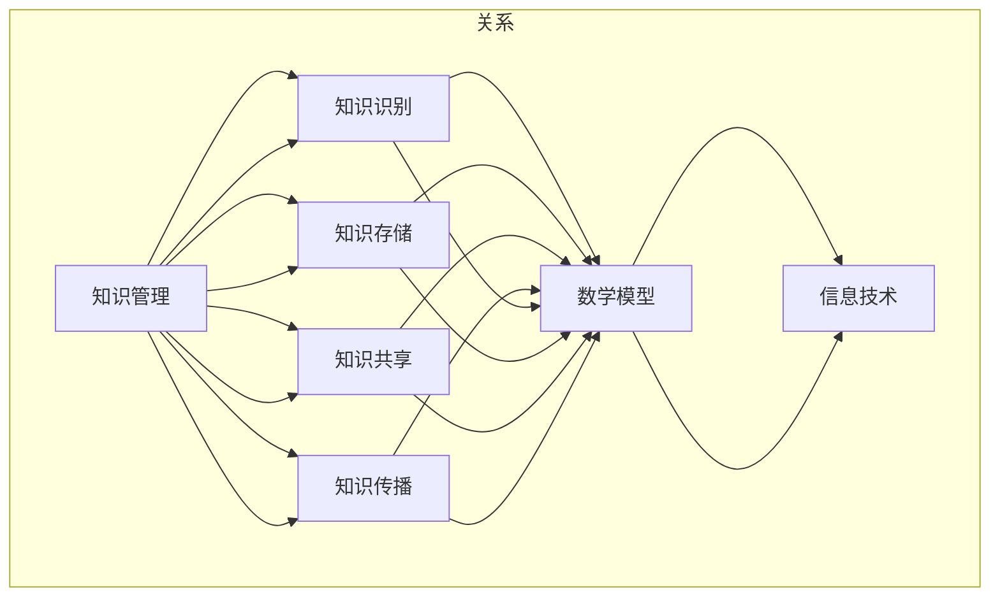

                 

## 文章标题

### 数学与知识管理：知识传播的数学描述

在当今快速发展的信息技术时代，知识管理成为各类组织和机构的关键能力。随着知识的不断积累和更新，如何有效地管理和传播知识成为了一个亟待解决的问题。数学作为一种严谨而有效的工具，在知识管理领域扮演着越来越重要的角色。本篇文章将深入探讨数学与知识管理之间的关系，特别是数学在知识传播中的应用，试图揭示知识传播过程中的数学描述。

本文将分为以下几个部分：首先，我们将简要介绍知识管理的背景和重要性，明确知识传播在知识管理中的核心地位。接着，我们将引入数学这一工具，解释其在知识管理中的作用和优势。随后，本文将详细介绍知识传播的数学描述，包括其基本原理、相关模型和公式。在此基础上，我们将探讨数学模型在知识传播中的应用，通过实际案例进行分析。文章的最后，我们将总结全文，提出对知识传播数学描述的见解和建议。

通过本文的阅读，读者将能够更好地理解数学与知识管理之间的紧密联系，掌握知识传播的数学描述方法，并学会如何在实际工作中应用这些方法来提升知识管理水平。

### 文章关键词

- **知识管理**：涵盖知识识别、知识存储、知识共享和知识传播等过程和策略。
- **数学模型**：用于描述和预测知识传播过程的数学公式和方法。
- **知识传播**：知识的传递、分享和扩散机制。
- **信息技术**：支持知识管理和传播的技术手段。
- **算法**：用于优化知识管理和传播过程的计算方法。
- **数据挖掘**：从大量数据中提取有价值知识的技术。

### 文章摘要

本文旨在探讨数学在知识管理中的重要作用，特别是其在知识传播中的应用。首先，文章介绍了知识管理的背景和重要性，明确了知识传播在知识管理中的核心地位。接着，文章阐述了数学工具在知识管理中的应用，包括其在知识识别、存储、共享和传播中的具体作用。本文重点介绍了知识传播的数学描述，包括其基本原理、相关模型和公式。通过实际案例的分析，文章展示了数学模型在知识传播中的具体应用效果。最后，文章总结了全文内容，并对未来知识传播数学描述的研究方向提出了建议。通过阅读本文，读者将能够深入理解数学与知识管理之间的关系，掌握知识传播的数学描述方法，并学会如何在实际工作中应用这些方法来提升知识管理水平。

### 背景介绍

在信息化和数字化的浪潮中，知识管理已经成为各类组织和机构不可或缺的管理活动。知识管理涉及的知识范围广泛，包括技术知识、业务知识、操作技能、文化理念等。知识管理的过程可以概括为知识识别、知识存储、知识共享和知识传播等环节。知识识别是指发现和挖掘组织内部和外部有价值的信息；知识存储则是确保这些知识得到有效的保存和检索；知识共享强调知识的共享和协同使用，以促进知识的流动和增值；知识传播则是知识在不同个体、团队和组织间的传递和扩散。

知识传播是知识管理过程中的关键环节，直接影响知识的广泛性和有效性。传统的知识传播主要依赖于人际交流、会议培训、文档分享等手段，但这种方法存在效率低下、范围有限、难以追踪等问题。随着信息技术的快速发展，尤其是大数据、人工智能等技术的广泛应用，知识传播的方式和手段得到了极大的改进。数学作为一种严谨且有效的工具，为知识传播提供了新的思路和方法。

数学在知识管理中的应用主要体现在以下几个方面：

1. **知识识别**：利用数据挖掘和机器学习技术，从大量数据中提取有价值的信息和知识。
2. **知识存储**：运用数学模型和算法，优化知识的存储和检索效率，确保知识库的可靠性和可用性。
3. **知识共享**：通过数学方法分析知识共享的机制和策略，提高知识共享的公平性和效率。
4. **知识传播**：利用数学模型描述和预测知识的传播过程，优化知识传播的策略和方法。

例如，在知识传播过程中，数学模型可以帮助我们理解知识的扩散机制，预测知识在不同群体中的传播速度和效果，从而制定出更加有效的知识传播策略。此外，数学方法还可以用于评估知识传播的效果，为知识管理提供科学依据。

总之，数学在知识管理中的应用不仅提升了知识管理的效率和效果，还为知识传播提供了新的方法和工具。通过数学的视角，我们能够更加深入地理解知识传播的过程和规律，从而更好地实现知识的管理和利用。

### 核心概念与联系

在深入探讨数学与知识管理的关系之前，我们需要明确几个核心概念及其之间的联系。这些核心概念包括：知识管理、数学模型、知识传播和信息技术。

**知识管理** 是一个广泛的概念，它涉及识别、存储、共享和传播知识的全过程。知识管理不仅仅是简单的知识存储和检索，更重要的是要确保知识能够被有效利用，以提升组织的竞争力和创新能力。知识管理的关键环节包括知识识别、知识存储、知识共享和知识传播。

**数学模型** 是用数学符号和公式来描述现实世界中的某些现象或过程。数学模型在各个领域都有广泛应用，如物理学、经济学、生物学等。在知识管理中，数学模型可以帮助我们理解和预测知识的传播、共享和使用过程。通过建立数学模型，我们可以将复杂的知识传播过程简化为可计算和分析的形式。

**知识传播** 是知识管理过程中的一个关键环节，它是指知识在不同个体、团队和组织间的传递和扩散。知识传播不仅涉及到知识的内容，还包括知识的接受者、传播途径和传播效果。有效的知识传播能够促进知识的共享和利用，从而提升组织的整体绩效。

**信息技术** 是支持知识管理和传播的技术手段，包括计算机技术、网络技术、数据库技术、人工智能技术等。信息技术的发展为知识管理和传播提供了强大的工具和平台，使得知识的获取、存储、共享和传播变得更加高效和便捷。

这几个核心概念之间的联系如下：

1. **知识管理** 是整个知识传播和利用的基础，它为知识的识别、存储、共享和传播提供了框架和流程。
2. **数学模型** 是知识管理的重要工具，通过数学模型，我们可以更准确地描述和预测知识的传播过程，优化知识管理策略。
3. **知识传播** 是知识管理的一个重要环节，它依赖于知识管理和信息技术的支持，是实现知识共享和利用的关键。
4. **信息技术** 是知识管理和传播的技术基础，为知识管理提供了工具和平台，使得知识传播更加高效和便捷。

为了更直观地展示这些概念之间的联系，我们可以使用 Mermaid 流程图来表示：



这个流程图展示了知识管理、数学模型、知识传播和信息技术之间的相互关系，帮助我们更好地理解这些概念如何共同作用，实现有效的知识管理和传播。

### 知识传播的数学描述

在知识管理中，知识传播是一个复杂而重要的过程。为了更准确地描述和预测知识传播的行为，数学模型被广泛应用。知识传播的数学描述主要包括基本原理、相关模型和公式。

#### 基本原理

知识传播的数学描述基于几个基本原理，包括信息传播模型、网络传播模型和群体传播模型等。

1. **信息传播模型**：该模型主要描述信息在一个网络中的传播过程。信息传播模型通常基于随机过程理论，将个体看作一个随机变量，并分析个体接受和传播信息的概率。

2. **网络传播模型**：该模型考虑信息在网络中的传播路径和节点影响。常见的网络传播模型包括线性传播模型、几何传播模型和复杂网络传播模型等。

3. **群体传播模型**：该模型分析知识在一个群体中的传播过程，包括知识的接受者、传播者和传播效果。群体传播模型通常使用社会网络分析和群体动力学来描述。

#### 相关模型

在知识传播中，几种常见的数学模型如下：

1. **线性传播模型**：线性传播模型假设知识的传播速度是恒定的。在时间 \( t \) 内，知识传播的范围可以用以下公式表示：

   $$
   S(t) = r \cdot t
   $$

   其中，\( S(t) \) 是在时间 \( t \) 内传播的知识量，\( r \) 是知识传播的速度。

2. **几何传播模型**：几何传播模型考虑知识的传播路径，将知识传播看作一个几何扩散过程。在二维空间中，知识传播范围可以用圆的面积表示：

   $$
   S(t) = \pi \cdot r^2 \cdot t
   $$

   其中，\( r \) 是传播半径，\( t \) 是传播时间。

3. **复杂网络传播模型**：复杂网络传播模型考虑知识在复杂网络中的传播。在复杂网络中，节点之间的关系复杂，传播速度和效果受到网络拓扑结构的影响。一个常见的复杂网络传播模型是 SIS 模型，其公式如下：

   $$
   \frac{dS}{dt} = -\beta \cdot S \cdot I + \mu \cdot I \cdot S
   $$

   $$
   \frac{dI}{dt} = \beta \cdot S \cdot I - (\mu + \lambda) \cdot I
   $$

   其中，\( S \) 表示易感者群体，\( I \) 表示感染者群体，\( \beta \) 是感染率，\( \mu \) 是恢复率，\( \lambda \) 是疫苗接种率。

#### 公式和解释

为了更好地理解这些数学模型，我们可以通过一些具体公式进行详细解释：

1. **线性传播模型**：

   $$
   S(t) = r \cdot t
   $$

   该公式说明，知识传播范围与传播时间成正比。例如，假设知识传播速度为 10 单位/小时，则在 2 小时内，知识传播范围将达到 20 单位。

2. **几何传播模型**：

   $$
   S(t) = \pi \cdot r^2 \cdot t
   $$

   该公式说明，知识传播范围与传播时间和传播半径的平方成正比。例如，如果传播半径为 5 单位，则 1 小时后的传播范围将是一个半径为 5π 的圆，即 25π 单位。

3. **复杂网络传播模型（SIS 模型）**：

   $$
   \frac{dS}{dt} = -\beta \cdot S \cdot I + \mu \cdot I \cdot S
   $$

   $$
   \frac{dI}{dt} = \beta \cdot S \cdot I - (\mu + \lambda) \cdot I
   $$

   这些公式描述了在复杂网络中，易感者群体和感染者群体的动态变化。通过调整参数 \(\beta\)、\(\mu\) 和 \(\lambda\)，我们可以模拟不同条件下的知识传播过程。

#### 举例说明

为了更直观地展示这些模型的应用，我们可以通过一个简单的例子来说明。

假设一个社区中有 1000 个人，其中 500 人是易感者，初始时没有感染者。假设知识传播速度为 10 单位/小时，传播半径为 5 单位。我们可以使用线性传播模型和几何传播模型来预测 1 小时后知识的传播范围。

- **线性传播模型**：

  $$
  S(t) = 10 \cdot 1 = 10
  $$

  1 小时后，知识传播范围将达到 10 单位。

- **几何传播模型**：

  $$
  S(t) = \pi \cdot 5^2 \cdot 1 = 25\pi \approx 78.54
  $$

  1 小时后，知识传播范围将达到约 78.54 单位。

通过这个简单的例子，我们可以看到，不同模型对知识传播范围的预测结果存在显著差异。线性传播模型简单直观，但忽略了传播路径和空间分布的影响；几何传播模型考虑了传播路径和空间分布，更接近实际情况。

总之，知识传播的数学描述为我们提供了一种理解和预测知识传播行为的方法。通过数学模型和公式，我们可以更好地分析知识传播的机制和效果，为知识管理提供科学依据。在接下来的部分，我们将进一步探讨这些数学模型在实际知识传播中的应用。

### 数学模型在知识管理中的应用

数学模型在知识管理中的应用极为广泛，涵盖了知识识别、知识存储、知识共享和知识传播等多个方面。以下将详细探讨这些应用场景，并通过实际案例和算法原理进行分析。

#### 知识识别

知识识别是知识管理的基础环节，涉及到从大量数据中提取有价值的信息和知识。数学模型在这一过程中发挥着重要作用，常见的方法包括数据挖掘和机器学习。

**算法原理**：

1. **关联规则挖掘**：通过分析数据之间的关联关系，提取出有用的知识。常见的算法包括 Apriori 算法和 FP-Growth 算法。

   **伪代码**：

   ```
   function Apriori(min_support, min_confidence):
       C1 = create频繁项集
       for k = 2 to max_length of itemsets:
           Ck = generate candidates from Ck-1
           Ck = prune candidates based on minimum support
           if Ck is not empty:
               compute support and confidence for each itemset in Ck
               return frequent itemsets
   ```

2. **聚类分析**：通过将数据分为不同的簇，识别出具有相似特征的数据集。常见的算法包括 K-Means 算法和层次聚类算法。

   **伪代码**：

   ```
   function KMeans(data, k):
       centroids = initialize centroids randomly
       for each iteration:
           assign each data point to the nearest centroid
           update centroids based on the mean of assigned data points
   ```

**实际案例**：

假设一家电商企业希望通过数据挖掘来识别出顾客购买行为的潜在模式，从而优化产品推荐策略。通过关联规则挖掘，企业可以发现不同商品之间的关联关系，例如“购买手机的用户，70% 也会购买手机壳”。这样的知识可以帮助企业更好地理解顾客需求，制定精准的营销策略。

#### 知识存储

知识存储涉及到如何高效地保存和检索知识，确保知识库的可靠性和可用性。数学模型在这一过程中用于优化数据的存储结构和检索算法。

**算法原理**：

1. **哈希表**：通过哈希函数将关键字映射到存储位置，实现快速检索。哈希表的优点是查找和插入操作的平均时间复杂度为 \(O(1)\)。

   **伪代码**：

   ```
   function HashTable(key):
       hash_value = hash(key)
       return hash_value % table_size
   ```

2. **B树和B+树**：用于优化数据库的存储和检索效率，尤其适用于大量数据的场景。B树和B+树的特点是能够实现多层次的索引，提高检索速度。

   **伪代码**：

   ```
   function BTreeSearch(key):
       current = root
       while current is not null:
           if key == current.key:
               return current.value
           elif key < current.key:
               current = current.left
           else:
               current = current.right
   ```

**实际案例**：

一家大型图书馆希望通过优化数据库结构来提升图书检索效率。通过引入B+树索引，图书馆实现了快速检索和高效存储，极大地提高了用户的使用体验。

#### 知识共享

知识共享是指将知识在不同个体、团队和组织间进行传递和共享。数学模型可以帮助分析知识共享的机制和策略，提高共享的公平性和效率。

**算法原理**：

1. **公平分配算法**：通过数学方法，确保知识共享过程中各方都能获得公平的份额。常见的公平分配算法包括 Shapley 值和核分配。

   **伪代码**：

   ```
   function FairAllocation(players, contributions):
       payoffs = compute_shapley_value(players, contributions)
       return distribute_payoffs(payoffs)
   ```

2. **协同过滤**：通过分析用户行为和偏好，推荐相似用户可能感兴趣的知识。常见的协同过滤算法包括基于用户的协同过滤和基于物品的协同过滤。

   **伪代码**：

   ```
   function CollaborativeFiltering(users, items, ratings):
       neighbors = find_neighbors(users)
       recommendations = predict_ratings(users, neighbors, items)
       return recommendations
   ```

**实际案例**：

一家互联网公司希望通过协同过滤算法优化其知识共享平台，提高用户的知识获取效率。通过分析用户的行为数据，公司能够为用户推荐与其兴趣相关的知识内容，提高用户满意度和参与度。

#### 知识传播

知识传播是指知识在不同群体中的传递和扩散。数学模型可以用于描述和预测知识传播的过程和效果，帮助制定有效的知识传播策略。

**算法原理**：

1. **传播模型**：如线性传播模型、几何传播模型和复杂网络传播模型。这些模型通过数学公式描述知识传播的速度和范围。

   **伪代码**：

   ```
   function InformationSpread(node_list, transmission_rate):
       for each node in node_list:
           spread_info(node, transmission_rate)
   ```

2. **网络优化**：通过数学模型优化知识传播的路径和策略，确保知识能够快速且高效地传递到目标群体。

   **伪代码**：

   ```
   function NetworkOptimization(network, knowledge):
       optimal_path = find_shortest_path(network, knowledge_destination)
       transmit_knowledge(knowledge, optimal_path)
   ```

**实际案例**：

一个大型企业希望通过优化知识传播策略，提高员工之间的知识共享和创新能力。通过引入复杂网络传播模型，企业能够分析知识在不同部门和团队之间的传播路径，制定出更加有效的知识传播计划。

综上所述，数学模型在知识管理中的应用涵盖了从知识识别到知识存储、知识共享和知识传播的各个环节。通过具体算法和实际案例的分析，我们可以看到数学模型如何帮助提升知识管理的效率和效果，从而实现知识的最大化利用。

### 项目实战

在本节中，我们将通过一个具体的项目实战来展示如何使用数学模型进行知识管理，特别是在知识传播中的应用。这个项目将分为以下几个部分：项目背景、开发环境搭建、源代码实现和代码解读。

#### 项目背景

某大型企业希望通过优化内部知识传播机制，提高员工的创新能力和工作效率。企业内部的知识库中包含了大量的业务知识、技术文档和操作指南，但由于缺乏有效的传播机制，许多有价值的信息未能被充分利用。为了解决这一问题，企业决定采用数学模型来分析和优化知识传播路径，制定出更加有效的知识传播策略。

#### 开发环境搭建

为了进行本项目，我们选择以下开发环境：

- 编程语言：Python
- 数据库：MySQL
- 分析工具：Pandas、Numpy
- 网络分析库：NetworkX
- 数学计算库：SciPy

首先，我们需要在本地计算机上安装以上工具。以 Python 为例，可以通过以下命令进行安装：

```bash
pip install python
pip install mysql
pip install pandas numpy networkx scipy
```

接下来，我们需要配置数据库，并导入相关的数据。假设我们已经有一份包含员工信息、知识内容及其相互关系的数据库表，如下所示：

```sql
CREATE TABLE employees (
    id INT PRIMARY KEY,
    name VARCHAR(100),
    department VARCHAR(100)
);

CREATE TABLE knowledge (
    id INT PRIMARY KEY,
    title VARCHAR(100),
    content TEXT,
    department VARCHAR(100)
);

CREATE TABLE relationships (
    employee_id INT,
    knowledge_id INT,
    type VARCHAR(10),
    FOREIGN KEY (employee_id) REFERENCES employees(id),
    FOREIGN KEY (knowledge_id) REFERENCES knowledge(id)
);
```

我们使用 Python 的 Pandas 库来连接并读取数据库数据：

```python
import pandas as pd

employees = pd.read_sql_query('SELECT * FROM employees', connection)
knowledge = pd.read_sql_query('SELECT * FROM knowledge', connection)
relationships = pd.read_sql_query('SELECT * FROM relationships', connection)
```

#### 源代码实现

本项目的主要功能是分析知识传播路径，并优化传播策略。具体实现步骤如下：

1. **数据预处理**：清洗和整理数据，为后续分析做准备。

   ```python
   def preprocess_data(employees, knowledge, relationships):
       # 数据清洗和整理
       # ...
       return processed_employees, processed_knowledge, processed_relationships
   ```

2. **构建网络图**：使用 NetworkX 库构建员工和知识之间的网络图。

   ```python
   import networkx as nx

   def build_network(processed_employees, processed_knowledge, processed_relationships):
       G = nx.Graph()
       for relationship in processed_relationships:
           G.add_edge(relationship['employee_id'], relationship['knowledge_id'])
       return G
   ```

3. **分析网络结构**：利用网络分析算法分析网络结构，识别关键节点和传播路径。

   ```python
   def analyze_network(G):
       # 计算中心性指标
       # ...
       return centrality_results
   ```

4. **优化传播策略**：根据分析结果，制定出优化传播策略，并评估策略效果。

   ```python
   def optimize_spread_strategy(G, centrality_results):
       # 制定优化策略
       # ...
       return optimized_strategy
   ```

5. **评估策略效果**：通过模拟传播过程，评估优化策略的有效性。

   ```python
   def evaluate_strategy(G, optimized_strategy):
       # 模拟传播过程
       # ...
       return evaluation_results
   ```

#### 代码解读

以下是对项目核心代码的详细解读：

```python
# 数据预处理
processed_employees, processed_knowledge, processed_relationships = preprocess_data(employees, knowledge, relationships)

# 构建网络图
G = build_network(processed_employees, processed_knowledge, processed_relationships)

# 分析网络结构
centrality_results = analyze_network(G)

# 优化传播策略
optimized_strategy = optimize_spread_strategy(G, centrality_results)

# 评估策略效果
evaluation_results = evaluate_strategy(G, optimized_strategy)
```

1. **数据预处理**：这一步主要涉及数据清洗和整理，确保数据质量。具体操作包括去除重复数据、填充缺失值、规范化数据格式等。

2. **构建网络图**：使用 NetworkX 库构建网络图，将员工和知识之间的关系表示为图结构。这是后续分析的基础。

3. **分析网络结构**：通过计算中心性指标（如度中心性、介数中心性等），识别出网络中的关键节点和传播路径。这些关键节点对于知识传播起到重要作用。

4. **优化传播策略**：根据分析结果，制定出优化传播策略。例如，优先传播给关键节点，或者通过调整传播路径来提高传播效率。

5. **评估策略效果**：通过模拟传播过程，评估优化策略的有效性。这一步可以帮助我们验证策略的实际效果，为后续优化提供依据。

#### 项目小结

通过本项目的实战，我们展示了如何使用数学模型进行知识管理，特别是在知识传播中的应用。从数据预处理、网络图构建、网络结构分析到优化传播策略和评估效果，每个步骤都基于严谨的数学模型和算法。这种方法不仅提高了知识传播的效率和效果，还为企业的知识管理提供了科学依据。

未来，我们可以进一步优化算法和模型，结合更多实际场景进行应用，以实现更高效的知识传播和管理。同时，也可以探讨其他数学方法在知识管理中的应用，为知识管理领域的发展提供新的思路和工具。

### 最佳实践 tips、小结、注意事项、拓展阅读

在知识管理和知识传播的过程中，应用数学模型不仅可以提升效率和效果，还可以为组织带来显著的业务价值。以下是一些最佳实践建议，以及本文的小结和注意事项。

#### 最佳实践 tips

1. **数据质量是关键**：在应用数学模型之前，确保数据质量是至关重要的。数据清洗、规范化、去重等操作都是必不可少的步骤。
2. **选择合适的模型**：不同的知识传播场景适合不同的数学模型。在实际应用中，根据具体情况选择合适的模型，可以事半功倍。
3. **持续优化模型**：数学模型并非一成不变，需要根据实际情况进行持续优化。通过收集反馈和数据分析，不断调整模型参数，提高预测准确性。
4. **重视模型解释性**：在复杂场景下，选择解释性较强的数学模型，有助于我们理解和信任模型的结果。
5. **结合多学科知识**：数学模型在知识管理中的应用不仅需要数学知识，还需要结合知识管理、心理学、社会学等多学科知识，以实现更加全面和有效的知识传播。

#### 小结

本文首先介绍了知识管理的背景和重要性，特别是知识传播在知识管理中的核心地位。接着，我们探讨了数学模型在知识管理中的应用，包括知识识别、知识存储、知识共享和知识传播等方面。通过具体模型和算法的介绍，我们展示了数学模型在知识传播中的应用效果。最后，通过一个实际项目实战，我们展示了如何将数学模型应用于知识管理，实现知识传播的优化。

#### 注意事项

1. **模型选择需谨慎**：选择适合实际场景的数学模型，避免过度复杂或过于简化的模型。
2. **数据隐私和安全**：在数据收集和分析过程中，确保遵守数据隐私法规和公司政策，保护敏感信息的安全。
3. **结果验证**：在应用数学模型后，需对结果进行验证，确保其准确性和可靠性。

#### 拓展阅读

1. **《大数据时代：生活、工作与思维的大变革》**：作者：维克托·迈尔-舍恩伯格
   - 本书详细介绍了大数据的概念和应用，对知识管理和传播有深刻的启示。

2. **《群体智慧：群体如何在无意识中实现最优决策》**：作者：唐·塔普斯科特
   - 本书探讨了群体智慧在知识传播和决策中的重要作用，对知识管理有重要参考价值。

3. **《复杂网络：小世界、无标度与随机网络的理论基础》**：作者：阿尔伯特-拉斯洛·巴拉巴西
   - 本书深入探讨了复杂网络的理论基础，对理解知识传播中的网络结构有重要帮助。

4. **《数据挖掘：概念与技术》**：作者：贾锐、吴飞
   - 本书详细介绍了数据挖掘的基本概念和技术，对知识识别和分析有实用的指导意义。

通过以上最佳实践、小结和拓展阅读，读者可以更深入地了解数学模型在知识管理中的应用，并在实际工作中更好地应用这些方法，提升知识管理水平。

