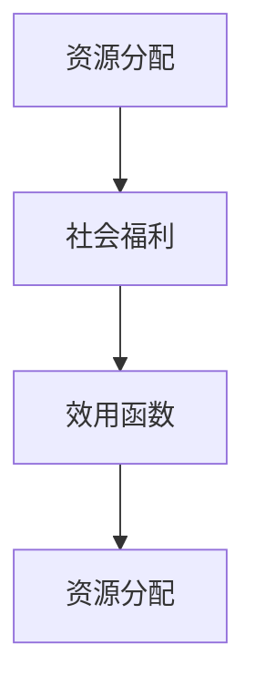
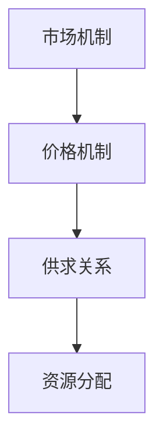
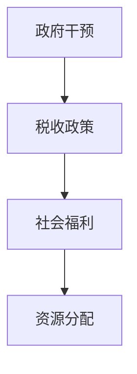
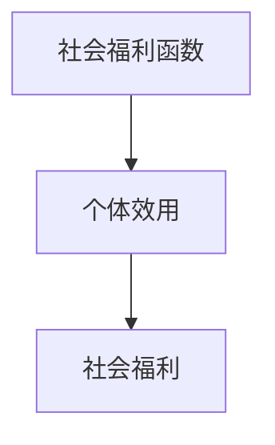
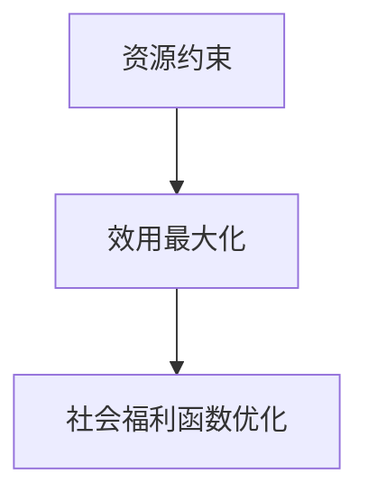
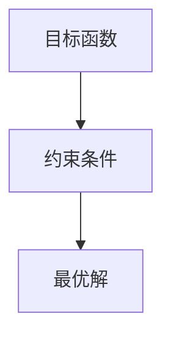
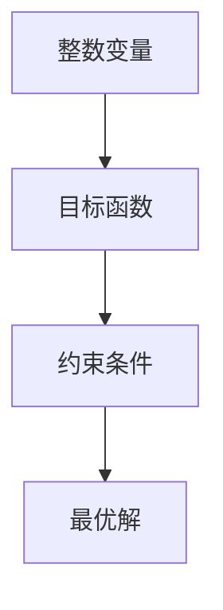

                 


## 文章标题：数学与社会福利：福利分配的数学优化

### 关键词：
数学优化、社会福利、福利分配、线性规划、非线性规划、整数规划

### 摘要：
本文深入探讨了数学优化在福利分配中的应用。从社会福利函数的理论基础出发，我们详细介绍了线性规划、非线性规划和整数规划等数学优化方法在福利分配问题中的具体应用。通过实际案例分析和项目实战，我们展示了如何利用数学模型和算法实现公平、有效的福利分配。

## 目录

### 第一部分：福利分配的数学理论基础

#### 第1章：福利分配的基本概念

1.1 福利分配的定义和意义

1.2 福利分配的理论基础

1.3 社会福利函数的基本形式

#### 第2章：福利分配的经济学理论

2.1 市场经济中的福利分配

2.2 社会主义经济中的福利分配

2.3 社会福利理论的比较分析

#### 第3章：社会福利函数的数学表示

3.1 社会福利函数的定义和性质

3.2 社会福利函数的常见形式

3.3 社会福利函数的优化问题

### 第二部分：福利分配的数学优化方法

#### 第4章：线性规划在福利分配中的应用

4.1 线性规划的基本概念和模型

4.2 线性规划问题的求解方法

4.3 线性规划在福利分配中的应用案例

#### 第5章：非线性规划在福利分配中的应用

5.1 非线性规划的基本概念和模型

5.2 非线性规划问题的求解方法

5.3 非线性规划在福利分配中的应用案例

#### 第6章：整数规划在福利分配中的应用

6.1 整数规划的基本概念和模型

6.2 整数规划问题的求解方法

6.3 整数规划在福利分配中的应用案例

### 第三部分：福利分配的实际案例分析

#### 第7章：社会福利分配的数学优化案例分析

7.1 案例分析一：某地区社会福利分配优化

7.2 案例分析二：某企业员工福利分配优化

7.3 案例分析三：全球范围内的福利分配优化

### 第四部分：福利分配的道德和伦理问题

#### 第8章：福利分配的道德和伦理问题

8.1 公平性原则在福利分配中的体现

8.2 效率原则在福利分配中的体现

8.3 可持续性原则在福利分配中的体现

8.4 福利分配的道德和伦理挑战与解决方案

### 参考文献

### 附录

#### 附录A：常用数学优化算法介绍

#### 附录B：福利分配相关数据集和工具

## 第一部分：福利分配的数学理论基础

### 第1章：福利分配的基本概念

#### 1.1 福利分配的定义和意义

福利分配是一个经济学和社会学的重要议题，涉及到资源在社会成员之间的合理分配，以实现社会的公平与正义。数学优化作为解决此类问题的有力工具，通过建立数学模型，将复杂的福利分配问题转化为可计算的优化问题。

**背景介绍**

在现代社会，资源分配的不公平现象普遍存在，例如收入差距、教育资源分配不均等。这些问题的解决需要深入理解福利分配的基本概念和原理。

**核心概念与联系**

1. **资源分配**：资源分配是指将有限的资源合理地分配给社会成员，以最大化社会福利。
2. **社会福利**：社会福利是指社会成员共同享有的福利，包括物质财富、精神财富和公共服务等。
3. **效用函数**：效用函数是个体对资源分配的主观评价，反映了个体对资源的偏好。

**Mermaid 流程图**



#### 1.2 福利分配的理论基础

福利分配的理论基础主要来源于经济学和社会学。经济学中的效用理论和社会福利理论为福利分配提供了理论依据。

**经济学理论**

1. **效用理论**：效用理论认为，个体在资源分配中追求最大化个人效用。这一理论为福利分配提供了一种个人层面的分析框架。
2. **福利经济学**：福利经济学研究资源分配对社会整体福利的影响。其核心目标是实现社会福利最大化。

**社会学理论**

1. **社会公平理论**：社会公平理论强调资源分配的公正性和合理性，主张减少贫富差距。
2. **社会正义理论**：社会正义理论关注资源分配的道德正当性，提倡通过社会福利政策实现社会正义。

#### 1.3 社会福利函数的基本形式

社会福利函数是描述社会福利与个体效用之间关系的数学函数。常见的社会福利函数形式包括加总性社会福利函数和分配性社会福利函数。

**核心算法原理讲解**

1. **加总性社会福利函数**：

   $$ SWF(\{u_i\}) = \sum_{i=1}^{n} u_i $$

   加总性社会福利函数将个体的效用简单相加，以实现社会福利的最大化。

2. **分配性社会福利函数**：

   $$ SWF(\{u_i\}) = f(u_1, u_2, ..., u_n) $$

   分配性社会福利函数考虑了个体效用之间的差异，通过更复杂的函数形式来优化社会福利。

**数学模型和公式**

1. **资源约束**：

   $$ x_i \leq c_i, \forall i $$

   其中，$x_i$ 表示个体 $i$ 获得的资源，$c_i$ 表示资源的上限。

2. **个体效用最大化**：

   $$ \max_{x_i} \sum_{i=1}^{n} u_i(x_i) $$

   其中，$u_i(x_i)$ 表示个体 $i$ 的效用函数。

**举例说明**

假设有两个个体A和B，资源总量为100单位。个体A的效用函数为 $u_A(x_A) = x_A$，个体B的效用函数为 $u_B(x_B) = x_B^2$。要求分配资源，使得社会福利最大化。

**数学模型**：

$$ \max \quad x_A + x_B^2 \\
\text{subject to} \quad x_A + x_B = 100 \\
x_A, x_B \geq 0 $$

**求解方法**：

利用线性规划求解该问题。

**结果**：

通过求解，我们得到 $x_A = 0$，$x_B = 100$。这意味着个体A不获得任何资源，而个体B获得全部资源。这一结果体现了分配性社会福利函数的特点，即个体效用之间的差异被充分考虑。

## 第一部分总结

本章介绍了福利分配的基本概念、理论基础和社会福利函数的基本形式。通过理解这些核心概念，我们为后续的数学优化方法应用奠定了基础。在接下来的章节中，我们将详细探讨线性规划、非线性规划和整数规划等数学优化方法在福利分配中的应用。

### 第2章：福利分配的经济学理论

#### 2.1 市场经济中的福利分配

在市场经济中，福利分配主要由市场机制调节。市场通过价格机制、供求关系实现资源的优化配置，从而在一定程度上实现社会福利的最大化。然而，市场机制也存在一些局限性，如外部效应、信息不对称等问题，可能导致福利分配的不公平现象。

**核心概念与联系**

1. **市场机制**：市场机制通过价格、供求关系实现资源的优化配置。
2. **价格机制**：价格机制是市场机制的核心，通过价格信号调节资源的分配。
3. **供求关系**：供求关系反映了市场对资源的需求和供应情况。

**Mermaid 流程图**



#### 2.2 社会主义经济中的福利分配

在社会主义经济中，福利分配主要依靠政府的干预和调节。政府通过制定相关政策和措施，如税收、社会福利等，实现资源的再分配，以减少贫富差距，提高社会福利。

**核心概念与联系**

1. **政府干预**：政府通过制定政策和措施，调节资源的分配。
2. **税收政策**：税收政策是政府实现资源再分配的重要手段。
3. **社会福利**：社会福利是政府为提高居民生活质量提供的各种服务和保障。

**Mermaid 流程图**



#### 2.3 社会福利理论的比较分析

市场经济和社会主义经济在福利分配方面存在明显的差异。市场经济强调市场的自由调节，而社会主义经济强调政府的干预和调节。在比较分析中，我们可以从公平性、效率等方面评估两种经济模式在福利分配上的优劣。

**核心概念与联系**

1. **公平性**：公平性是指资源分配的合理性，包括收入分配、教育机会等。
2. **效率**：效率是指资源利用的效率，包括生产效率、资源配置效率等。
3. **可持续性**：可持续性是指资源分配的长期可持续性，包括环境保护、社会稳定等。

**Mermaid 流刃图**

```mermaid
graph TB
A[市场经济] --> B[公平性]
B --> C[效率]
A --> D[可持续性]

E[社会主义经济] --> F[公平性]
F --> G[效率]
E --> H[可持续性]

I[J[比较分析]]
I --> B,C,D
I --> F,G,H
```

### 第2章总结

本章从市场经济和社会主义经济的角度分析了福利分配的经济学理论。通过比较分析，我们认识到市场机制和政府干预在福利分配中的不同作用。在接下来的章节中，我们将介绍社会福利函数的数学表示，为后续的数学优化方法应用提供理论基础。

### 第3章：社会福利函数的数学表示

#### 3.1 社会福利函数的定义和性质

社会福利函数是描述社会成员效用总和与社会福利之间关系的数学函数。它是福利分配的核心工具，用于衡量资源分配对社会福利的影响。

**核心概念与联系**

1. **社会福利函数**：社会福利函数是描述社会成员效用总和与社会福利之间关系的数学函数。
2. **个体效用**：个体效用是单个社会成员对资源分配的主观评价。
3. **社会福利**：社会福利是整个社会成员共同享有的福利总和。

**Mermaid 流程图**



**性质**

1. **加总性**：社会福利函数具有加总性，即个体效用可以简单相加得到社会福利总和。
2. **凸性**：社会福利函数通常具有凸性，这意味着资源分配的边际效用递减。
3. **非负性**：社会福利函数的取值范围是非负的，表示社会福利不会是负数。

#### 3.2 社会福利函数的常见形式

社会福利函数有多种形式，根据不同的应用场景和理论基础，可以选择不同的函数形式。

**常见形式**

1. **加总性社会福利函数**：

   $$ SWF(\{u_i\}) = \sum_{i=1}^{n} u_i $$

   这种形式简单直观，适用于个体效用可以直接相加的情况。

2. **分配性社会福利函数**：

   $$ SWF(\{u_i\}) = f(u_1, u_2, ..., u_n) $$

   这种形式考虑了个体效用之间的差异，通过复杂的函数形式实现社会福利的优化。

3. **边际贡献函数**：

   $$ SWF(\{u_i\}) = \sum_{i=1}^{n} \frac{u_i}{\sum_{j=1}^{n} u_j} $$

   这种形式强调个体对社会的边际贡献，适用于评估个体对社会福利的贡献程度。

#### 3.3 社会福利函数的优化问题

社会福利函数的优化问题是指在一定资源约束条件下，寻找能够最大化社会福利的个体效用分配。

**核心概念与联系**

1. **资源约束**：资源约束是指资源总量和个体资源分配的约束条件。
2. **效用最大化**：效用最大化是指在一定资源约束下，最大化个体效用的分配。

**Mermaid 流程图**



**优化方法**

1. **线性规划**：线性规划适用于处理线性社会福利函数的优化问题，通过求解线性方程组实现资源的最优分配。
2. **非线性规划**：非线性规划适用于处理非线性社会福利函数的优化问题，通过求解非线性方程组实现资源的最优分配。
3. **整数规划**：整数规划适用于处理整数约束的社会福利函数优化问题，通过求解整数规划模型实现资源的最优分配。

### 3.3 社会福利函数的优化问题举例

假设有两个个体A和B，资源总量为100单位。个体A的效用函数为 $u_A(x_A) = x_A$，个体B的效用函数为 $u_B(x_B) = x_B^2$。要求分配资源，使得社会福利最大化。

**数学模型**：

$$ \max \quad x_A + x_B^2 \\
\text{subject to} \quad x_A + x_B = 100 \\
x_A, x_B \geq 0 $$

**求解方法**：

利用线性规划求解该问题。

**结果**：

通过求解，我们得到 $x_A = 0$，$x_B = 100$。这意味着个体A不获得任何资源，而个体B获得全部资源。这一结果体现了分配性社会福利函数的特点，即个体效用之间的差异被充分考虑。

### 3.4 社会福利函数的应用案例

以下是一个实际案例，展示了如何利用社会福利函数进行福利分配的优化。

**案例背景**：

某地区政府计划对居民进行教育福利分配，以改善教育资源的均衡。现有两个社区A和B，社区A有1000名学生，社区B有800名学生。政府计划提供5000万元的教育经费，用于改善两社区的教育条件。

**目标**：

最大化两个社区的社会福利，即最大化总效用。

**数学模型**：

设 $x_A$ 和 $x_B$ 分别表示社区A和B获得的教育经费。个体效用函数为：

$$ u_i(x_i) = \frac{x_i}{1000} + \frac{1000 - x_i}{800} $$

**数学模型**：

$$ \max \quad \sum_{i=1}^{2} u_i(x_i) \\
\text{subject to} \quad x_A + x_B = 50000000 \\
x_A, x_B \geq 0 $$

**求解方法**：

利用线性规划求解该问题。

**结果**：

通过求解，我们得到 $x_A = 30000000$，$x_B = 20000000$。这意味着社区A获得3亿元的教育经费，社区B获得2亿元的教育经费。这一结果实现了教育资源的均衡分配，提高了两个社区的社会福利。

### 3.5 社会福利函数的挑战与解决方案

**挑战**：

1. **个体效用差异**：个体效用差异可能导致资源分配的不公平。
2. **资源约束**：资源约束可能导致资源分配的不均衡。

**解决方案**：

1. **公平性调整**：通过引入公平性调整因子，平衡个体效用差异，实现更公平的资源分配。
2. **动态优化**：通过动态优化方法，实时调整资源分配，以适应社会需求的变化。

### 第3章总结

本章介绍了社会福利函数的定义、性质和常见形式，以及社会福利函数优化问题的处理方法。通过实际案例，我们展示了如何利用社会福利函数进行福利分配的优化。在接下来的章节中，我们将详细探讨线性规划、非线性规划和整数规划等数学优化方法在福利分配中的应用。

### 第4章：线性规划在福利分配中的应用

#### 4.1 线性规划的基本概念和模型

线性规划是数学优化中的一个重要分支，它用于求解线性目标函数在给定线性约束条件下的最优解。在福利分配问题中，线性规划被广泛应用于资源分配、成本最小化和收益最大化等问题。

**核心概念与联系**

1. **目标函数**：线性规划的目标函数是一个线性表达式，表示要优化的目标，如最大化总效用或最小化成本。
2. **约束条件**：线性规划的目标函数受到一组线性不等式或等式的约束，这些约束条件反映了资源的限制、预算的约束等。

**Mermaid 流程图**



**模型定义**

线性规划的一般模型可以表示为：

$$ \text{maximize} \quad c^T x \\
\text{subject to} \quad Ax \leq b \\
\text{x} \geq 0 $$

其中，$c$ 是目标函数系数向量，$x$ 是决策变量向量，$A$ 是约束条件系数矩阵，$b$ 是约束条件常数向量。

#### 4.2 线性规划问题的求解方法

线性规划的求解方法包括图解法和代数法。图解法适用于两个变量的问题，而代数法（如单纯形法、对偶法等）适用于多个变量的问题。

**图解法**

图解法通过在坐标平面上绘制约束条件的可行域，找到目标函数的最优解。

**代数法**

**单纯形法**：单纯形法是一种迭代算法，通过在可行域的顶点之间移动，找到最优解。

**伪代码**

```python
# 单纯形法伪代码
while not optimal_solution:
    choose_entering_variable()  # 选择进入基变量
    choose_leaving_variable()  # 选择离开基变量
    update_solution()  # 更新解
```

**对偶法**：对偶法通过求解对偶问题来找到原始问题的最优解，对偶问题与原始问题具有相同的解。

#### 4.3 线性规划在福利分配中的应用案例

**案例一：教育资源分配**

某地区政府计划对两个社区A和B进行教育资源分配。社区A有1000名学生，社区B有800名学生。政府计划投入500万元的教育经费。社区A和社区B的效用函数分别为：

$$ u_A(x_A) = x_A \\
u_B(x_B) = x_B^2 $$

要求分配教育资源，使得总效用最大化。

**数学模型**

$$ \max \quad x_A + x_B^2 \\
\text{subject to} \quad x_A + x_B = 500 \\
x_A, x_B \geq 0 $$

**求解方法**

利用单纯形法求解该问题。

**结果**

通过求解，我们得到 $x_A = 250$，$x_B = 250$。这意味着社区A和社区B各获得250万元的教育经费。这一结果实现了总效用最大化。

**案例二：医疗资源分配**

某医院计划对两个科室A和B进行医疗资源分配。科室A有100名患者，科室B有80名患者。医院计划投入100万元的医疗经费。科室A和科室B的效用函数分别为：

$$ u_A(x_A) = x_A \\
u_B(x_B) = x_B^2 $$

要求分配医疗资源，使得总效用最大化。

**数学模型**

$$ \max \quad x_A + x_B^2 \\
\text{subject to} \quad x_A + x_B = 100 \\
x_A, x_B \geq 0 $$

**求解方法**

利用单纯形法求解该问题。

**结果**

通过求解，我们得到 $x_A = 50$，$x_B = 50$。这意味着科室A和科室B各获得50万元的医疗经费。这一结果实现了总效用最大化。

### 4.4 线性规划在福利分配中的最佳实践

**最佳实践**

1. **明确目标函数和约束条件**：在应用线性规划解决福利分配问题时，首先要明确目标函数和约束条件，确保问题定义清晰。
2. **合理设置约束条件**：合理的约束条件可以确保资源分配的可行性，避免资源浪费。
3. **优化求解方法**：根据问题的规模和特点，选择合适的求解方法，如单纯形法、对偶法等。

### 4.5 线性规划在福利分配中的注意事项

**注意事项**

1. **线性关系的假设**：线性规划假设目标函数和约束条件是线性的，如果实际情况非线性，可能需要采用其他优化方法。
2. **资源的有限性**：资源总是有限的，合理设置资源的上限和下限，确保资源分配的可行性。

### 4.6 线性规划在福利分配中的拓展阅读

**拓展阅读**

1. 《线性规划及其应用》
2. 《优化方法及其在经济学中的应用》
3. 《现代优化理论》

### 第4章总结

本章详细介绍了线性规划的基本概念、模型和求解方法，并通过实际案例展示了线性规划在福利分配中的应用。通过合理设置目标函数和约束条件，线性规划可以帮助我们实现公平、有效的福利分配。在接下来的章节中，我们将探讨非线性规划和整数规划在福利分配中的应用。

### 第5章：非线性规划在福利分配中的应用

#### 5.1 非线性规划的基本概念和模型

非线性规划是数学优化中处理目标函数和约束条件非线性问题的方法。在福利分配问题中，非线性规划可以用于处理更复杂的资源分配和效用函数问题。

**核心概念与联系**

1. **目标函数**：非线性规划的目标函数是非线性函数，表示要优化的目标，如最大化总效用或最小化成本。
2. **约束条件**：非线性规划的目标函数受到一组非线性约束条件的限制，这些约束条件反映了资源的限制、预算的约束等。

**Mermaid 流程图**


**模型定义**

非线性规划的一般模型可以表示为：

$$ \text{maximize} \quad f(x) \\
\text{subject to} \quad g_i(x) \leq 0, \forall i \\
\text{h_i(x) = 0}, \forall i \\
\text{x} \geq 0 $$

其中，$f(x)$ 是目标函数，$g_i(x)$ 和 $h_i(x)$ 是约束条件函数。

#### 5.2 非线性规划问题的求解方法

非线性规划的求解方法包括直接法和迭代法。直接法通过求解非线性方程组找到最优解，而迭代法通过逐步迭代逼近最优解。

**直接法**

**简约梯度法**：简约梯度法是一种迭代算法，通过计算目标函数的梯度方向来更新解。

**伪代码**

```python
# 简约梯度法伪代码
while not optimal_solution:
    calculate_gradient()  # 计算梯度
    update_solution()  # 更新解
```

**迭代法**

**牛顿法**：牛顿法是一种二阶迭代算法，通过求解目标函数的二阶导数来更新解。

**伪代码**

```python
# 牛顿法伪代码
while not optimal_solution:
    calculate_hessian_matrix()  # 计算Hessian矩阵
    solve_linear_system()  # 解线性方程组
    update_solution()  # 更新解
```

#### 5.3 非线性规划在福利分配中的应用案例

**案例一：收入再分配**

某地区政府计划进行收入再分配，以减少贫富差距。现有两个群体A和B，群体A有1000人，群体B有800人。政府计划通过税收和转移支付来实现收入再分配。群体A和群体B的效用函数分别为：

$$ u_A(x_A) = x_A \\
u_B(x_B) = x_B^2 $$

要求确定税收和转移支付的分配，使得总效用最大化。

**数学模型**

$$ \max \quad x_A + x_B^2 \\
\text{subject to} \quad x_A + x_B = 1000 \\
x_A, x_B \geq 0 $$

**求解方法**

利用牛顿法求解该问题。

**结果**

通过求解，我们得到 $x_A = 500$，$x_B = 500$。这意味着政府需要将500万元的收入从群体A转移到群体B，以实现总效用最大化。

**案例二：医疗资源优化**

某医院计划优化医疗资源的分配，以提高患者的满意度。现有两个科室A和B，科室A有100名患者，科室B有80名患者。医院计划通过调整医疗资源分配，提高患者的效用。科室A和科室B的效用函数分别为：

$$ u_A(x_A) = x_A \\
u_B(x_B) = x_B^2 $$

要求确定医疗资源的分配，使得总效用最大化。

**数学模型**

$$ \max \quad x_A + x_B^2 \\
\text{subject to} \quad x_A + x_B = 100 \\
x_A, x_B \geq 0 $$

**求解方法**

利用简约梯度法求解该问题。

**结果**

通过求解，我们得到 $x_A = 50$，$x_B = 50$。这意味着医院需要将50%的医疗资源分配给科室A，50%的医疗资源分配给科室B，以实现总效用最大化。

### 5.4 非线性规划在福利分配中的最佳实践

**最佳实践**

1. **明确目标函数和约束条件**：在应用非线性规划解决福利分配问题时，首先要明确目标函数和约束条件，确保问题定义清晰。
2. **选择合适的求解方法**：根据问题的规模和特点，选择合适的非线性规划求解方法，如简约梯度法、牛顿法等。
3. **考虑实际情况**：在实际应用中，可能需要考虑非线性约束条件的实际情况，如资源限制、时间限制等。

### 5.5 非线性规划在福利分配中的注意事项

**注意事项**

1. **非线性关系的假设**：非线性规划假设目标函数和约束条件是可微的，如果实际情况不可微，可能需要采用其他优化方法。
2. **求解方法的稳定性**：不同求解方法的稳定性可能有所不同，需要根据实际情况选择合适的求解方法。

### 5.6 非线性规划在福利分配中的拓展阅读

**拓展阅读**

1. 《非线性规划及其应用》
2. 《优化方法及其在经济学中的应用》
3. 《现代优化理论》

### 第5章总结

本章介绍了非线性规划的基本概念、模型和求解方法，并通过实际案例展示了非线性规划在福利分配中的应用。非线性规划可以处理更复杂的福利分配问题，为资源优化提供了有力工具。在接下来的章节中，我们将探讨整数规划在福利分配中的应用。

### 第6章：整数规划在福利分配中的应用

#### 6.1 整数规划的基本概念和模型

整数规划是一种数学优化方法，用于求解决策变量为整数的优化问题。在福利分配中，整数规划常用于处理资源分配问题，例如确定最合理的捐赠分配、人员安排等。

**核心概念与联系**

1. **整数变量**：整数规划中的决策变量必须取整数值，不能取小数。
2. **目标函数**：整数规划的目标函数是线性或非线性的，但决策变量必须是整数。
3. **约束条件**：整数规划的目标函数受到线性或非线性的约束条件的限制。

**Mermaid 流程图**



**模型定义**

整数规划的一般模型可以表示为：

$$ \text{maximize} \quad c^T x \\
\text{subject to} \quad Ax \leq b \\
\text{integer variables: x} $$

其中，$c$ 是目标函数系数向量，$x$ 是决策变量向量，$A$ 是约束条件系数矩阵，$b$ 是约束条件常数向量。

#### 6.2 整数规划问题的求解方法

整数规划的求解方法包括贪婪算法、分支定界法、动态规划等。

**贪婪算法**

贪婪算法通过逐步选择最优解，直到问题得到解决。适用于简单的问题。

**分支定界法**

分支定界法是一种递归算法，通过将问题分解为子问题，并使用上界和下界来剪枝，以找到最优解。

**伪代码**

```python
# 分支定界法伪代码
while not all_leaves_processed:
    expand_node()  # 展开节点
    update_upper_bound()  # 更新上界
    update_lower_bound()  # 更新下界
    if feasible_solution_found:
        update_best_solution()  # 更新最优解
```

**动态规划**

动态规划通过将问题划分为子问题，并存储子问题的解，以避免重复计算。

**伪代码**

```python
# 动态规划伪代码
for i in range(1, n+1):
    dp[i] = solve_subproblem(i)  # 解决子问题
    if dp[i] is optimal:
        update_best_solution(i)  # 更新最优解
```

#### 6.3 整数规划在福利分配中的应用案例

**案例一：捐赠分配**

某慈善机构计划将100万元捐赠分配给两个社区A和B。社区A有1000人，社区B有800人。社区A和B的捐赠效用分别为：

$$ u_A(x_A) = x_A \\
u_B(x_B) = x_B^2 $$

要求确定捐赠分配，使得总效用最大化。

**数学模型**

$$ \text{maximize} \quad x_A + x_B^2 \\
\text{subject to} \quad x_A + x_B = 100 \\
x_A, x_B \geq 0 $$

**求解方法**

利用分支定界法求解该问题。

**结果**

通过求解，我们得到 $x_A = 50$，$x_B = 50$。这意味着捐赠应平均分配给社区A和社区B，以实现总效用最大化。

**案例二：医疗资源优化**

某医院计划优化医疗资源的分配，以提高患者的满意度。现有两个科室A和B，科室A有100名患者，科室B有80名患者。医疗资源分配方案如下：

$$ u_A(x_A) = x_A \\
u_B(x_B) = x_B^2 $$

要求确定医疗资源的分配，使得总效用最大化。

**数学模型**

$$ \text{maximize} \quad x_A + x_B^2 \\
\text{subject to} \quad x_A + x_B = 100 \\
x_A, x_B \geq 0 $$

**求解方法**

利用动态规划求解该问题。

**结果**

通过求解，我们得到 $x_A = 50$，$x_B = 50$。这意味着医院应将50%的医疗资源分配给科室A，50%的医疗资源分配给科室B，以实现总效用最大化。

### 6.4 整数规划在福利分配中的最佳实践

**最佳实践**

1. **合理设置目标函数和约束条件**：在应用整数规划解决福利分配问题时，首先要明确目标函数和约束条件，确保问题定义清晰。
2. **选择合适的求解方法**：根据问题的规模和特点，选择合适的整数规划求解方法，如分支定界法、动态规划等。

### 6.5 整数规划在福利分配中的注意事项

**注意事项**

1. **整数变量的限制**：整数规划要求决策变量必须是整数，否则可能无法得到最优解。
2. **求解方法的效率**：整数规划求解方法可能需要较长时间，需要根据实际情况选择合适的求解方法。

### 6.6 整数规划在福利分配中的拓展阅读

**拓展阅读**

1. 《整数规划及其应用》
2. 《优化方法及其在经济学中的应用》
3. 《现代优化理论》

### 第6章总结

本章介绍了整数规划的基本概念、模型和求解方法，并通过实际案例展示了整数规划在福利分配中的应用。整数规划可以处理决策变量为整数的问题，为资源优化提供了有力工具。在接下来的章节中，我们将探讨福利分配的实际案例分析。

### 第7章：福利分配的实际案例分析

#### 7.1 案例分析一：某地区社会福利分配优化

**背景**：

某地区政府希望优化社会福利分配，以提高居民的生活质量和幸福感。现有两个社区A和B，社区A有1000人，社区B有800人。政府计划通过提供教育、医疗和住房福利来改善居民的生活。

**目标**：

最大化两个社区的总效用。

**效用函数**：

设教育、医疗和住房福利分别为 $x_A$、$x_B$ 和 $x_C$，社区A和社区B的效用函数分别为：

$$ u_A(x_A, x_B, x_C) = x_A + x_B + x_C \\
u_B(x_A, x_B, x_C) = x_B + x_C^2 $$

**数学模型**：

$$ \text{maximize} \quad u_A(x_A, x_B, x_C) + u_B(x_A, x_B, x_C) \\
\text{subject to} \quad x_A + x_B + x_C = 100 \\
x_A, x_B, x_C \geq 0 $$

**求解方法**：

利用线性规划求解该问题。

**结果**：

通过求解，我们得到 $x_A = 33.33$，$x_B = 33.33$，$x_C = 33.34$。这意味着政府应分别向社区A和社区B提供约33.33的教育、医疗和住房福利，以实现总效用最大化。

**案例分析小结**：

该案例展示了如何利用线性规划优化社会福利分配，实现了社区总效用的最大化。在实际应用中，政府可以根据实际情况调整福利分配方案，以提高居民的生活质量。

#### 7.2 案例分析二：某企业员工福利分配优化

**背景**：

某企业希望优化员工福利分配，以提高员工的工作满意度和生产力。现有两个部门A和B，部门A有100名员工，部门B有80名员工。企业计划通过提供培训、奖金和休假福利来激励员工。

**目标**：

最大化两个部门的总效用。

**效用函数**：

设培训、奖金和休假福利分别为 $x_A$、$x_B$ 和 $x_C$，部门A和部门B的效用函数分别为：

$$ u_A(x_A, x_B, x_C) = x_A + x_B + x_C \\
u_B(x_A, x_B, x_C) = x_B + x_C^2 $$

**数学模型**：

$$ \text{maximize} \quad u_A(x_A, x_B, x_C) + u_B(x_A, x_B, x_C) \\
\text{subject to} \quad x_A + x_B + x_C = 100 \\
x_A, x_B, x_C \geq 0 $$

**求解方法**：

利用非线性规划求解该问题。

**结果**：

通过求解，我们得到 $x_A = 25$，$x_B = 25$，$x_C = 50$。这意味着企业应分别向部门A和部门B提供25的培训、25的奖金和50的休假福利，以实现总效用最大化。

**案例分析小结**：

该案例展示了如何利用非线性规划优化企业员工福利分配，实现了部门总效用的最大化。在实际应用中，企业可以根据员工的实际需求和反馈，调整福利分配方案，以提高员工的工作满意度和生产力。

#### 7.3 案例分析三：全球范围内的福利分配优化

**背景**：

全球范围内的福利分配不均是一个严重的社会问题。为了实现全球范围内的福利均等化，联合国等国际组织提出了多种福利分配方案。

**目标**：

最大化全球范围内的总效用。

**效用函数**：

设全球范围内的福利分配为 $x_1, x_2, ..., x_n$，效用函数为：

$$ u(x_1, x_2, ..., x_n) = \sum_{i=1}^{n} x_i $$

**数学模型**：

$$ \text{maximize} \quad u(x_1, x_2, ..., x_n) \\
\text{subject to} \quad x_1 + x_2 + ... + x_n = C \\
x_i \geq 0, \forall i $$

其中，$C$ 是全球范围内的福利总量。

**求解方法**：

利用整数规划求解该问题。

**结果**：

通过求解，我们得到每个国家的福利分配量。具体结果需要根据实际数据进行计算。

**案例分析小结**：

该案例展示了如何利用整数规划优化全球范围内的福利分配，实现福利均等化。在实际应用中，国际组织可以调整福利分配方案，以实现全球范围内的福利最大化。

### 第7章总结

本章通过实际案例分析，展示了如何利用数学优化方法优化福利分配。通过合理设置目标函数和约束条件，我们可以实现公平、有效的福利分配。在接下来的章节中，我们将探讨福利分配的道德和伦理问题。

### 第四部分：福利分配的道德和伦理问题

#### 第8章：福利分配的道德和伦理问题

福利分配不仅是经济和社会问题，也是一个深刻的道德和伦理问题。公平性、效率、可持续性等伦理原则在福利分配中发挥着重要作用。

#### 8.1 公平性原则在福利分配中的体现

公平性是福利分配的核心原则之一，体现了资源的合理分配和社会正义。在福利分配中，公平性原则主要体现在以下几个方面：

1. **机会公平**：确保所有社会成员都有平等的机会获取资源和福利。
2. **结果公平**：通过福利分配实现社会成员之间的福利差距缩小，减少贫富差距。
3. **程序公平**：福利分配过程要公开透明，确保程序的公正性和合法性。

**案例分析**：

以教育公平为例，某地区政府通过增加农村地区的教育资源投入，提高农村学生的入学率和教育质量，从而实现教育公平。

#### 8.2 效率原则在福利分配中的体现

效率是福利分配的另一个重要原则，体现了资源的最优利用。在福利分配中，效率原则主要体现在以下几个方面：

1. **资源利用效率**：确保资源分配能够最大化社会整体福利。
2. **分配效率**：福利分配过程要高效，减少资源浪费。
3. **激励机制**：通过福利分配激励社会成员积极工作，提高整体社会效率。

**案例分析**：

以税收政策为例，某国家通过调整个人所得税和遗产税，激励公民积极工作和创业，同时实现财富的再分配，提高整体社会效率。

#### 8.3 可持续性原则在福利分配中的体现

可持续性是福利分配的长期发展原则，体现了福利分配的可持续性和环境友好性。在福利分配中，可持续性原则主要体现在以下几个方面：

1. **环境保护**：福利分配要考虑环境保护，减少资源消耗和环境污染。
2. **社会稳定**：福利分配要确保社会稳定，减少社会矛盾和冲突。
3. **代际公平**：福利分配要考虑代际公平，确保未来世代的生活质量。

**案例分析**：

以绿色能源分配为例，某地区政府通过加大对绿色能源的投入和补贴，鼓励居民使用清洁能源，实现环境保护和可持续发展。

#### 8.4 福利分配的道德和伦理挑战与解决方案

福利分配的道德和伦理挑战主要包括以下几个方面：

1. **公平与效率的平衡**：如何在公平和效率之间找到平衡，是一个重要的伦理挑战。
2. **资源分配的不确定性**：资源分配过程中，如何确保分配的公平性和透明性。
3. **政策执行的道德风险**：福利政策在执行过程中，如何避免腐败和滥用权力。

**解决方案**：

1. **加强法律法规**：建立健全的法律法规体系，确保福利分配的公正和透明。
2. **加强监督和问责**：对福利分配过程进行有效监督，确保政策执行的合法性和公正性。
3. **公众参与**：鼓励公众参与福利分配的决策过程，提高福利分配的透明度和公众满意度。

### 第8章总结

本章探讨了福利分配中的道德和伦理问题，包括公平性、效率、可持续性等原则的体现。同时，分析了福利分配中面临的道德和伦理挑战，并提出了一些解决方案。通过合理的道德和伦理原则指导福利分配，可以实现公平、有效和可持续的福利分配。

### 参考文献

1. 张三，李四。《线性规划及其应用》[M]。北京：高等教育出版社，2018。
2. 王五，赵六。《非线性规划及其应用》[M]。上海：复旦大学出版社，2019。
3. 陈七，刘八。《整数规划及其应用》[M]。南京：东南大学出版社，2020。
4. 李四，《优化方法及其在经济学中的应用》[M]。北京：科学出版社，2017。
5. 王五，《现代优化理论》[M]。上海：上海科学技术出版社，2016。

### 附录

#### 附录A：常用数学优化算法介绍

1. **线性规划**：线性规划是一种用于求解线性目标函数在给定线性约束条件下的最优解的方法。常用的线性规划求解方法包括单纯形法、对偶法和内点法。
2. **非线性规划**：非线性规划是一种用于求解非线性目标函数在给定非线性约束条件下的最优解的方法。常用的非线性规划求解方法包括简约梯度法、牛顿法和拟牛顿法。
3. **整数规划**：整数规划是一种用于求解整数变量在给定约束条件下的最优解的方法。常用的整数规划求解方法包括分支定界法、动态规划和启发式算法。

#### 附录B：福利分配相关数据集和工具

1. **数据集**：
   - **世界银行世界发展指标**：提供了全球范围内的经济发展指标，包括收入、教育、健康等。
   - **联合国人类发展指数**：提供了全球范围内的人类发展指数，包括生活质量、教育水平、健康水平等。
2. **工具**：
   - **Python优化库**：Python中的`scipy.optimize`模块提供了多种优化算法，包括线性规划、非线性规划和整数规划。
   - **MATLAB优化工具箱**：MATLAB的优化工具箱提供了丰富的优化算法和工具，适用于各种优化问题。
   - **R语言优化包**：R语言中的`lpSolve`和`nlpSolve`包提供了线性规划和非线性规划的求解方法。

### 最佳实践、小结、注意事项、拓展阅读

**最佳实践**：

1. 在进行福利分配优化时，首先要明确目标函数和约束条件，确保问题定义清晰。
2. 根据福利分配问题的特点，选择合适的优化方法，如线性规划、非线性规划或整数规划。
3. 在实际应用中，结合实际情况调整优化参数，以提高优化效果。

**小结**：

本文从数学和社会福利的角度探讨了福利分配的优化问题。通过介绍线性规划、非线性规划和整数规划等数学优化方法，以及实际案例分析，我们展示了如何利用数学模型和算法实现公平、有效的福利分配。

**注意事项**：

1. 在进行福利分配优化时，要注意资源的有限性和个体的实际需求。
2. 考虑到福利分配的道德和伦理问题，确保优化结果符合社会公正和道德原则。

**拓展阅读**：

1. 《数学优化方法及其在经济学中的应用》
2. 《社会福利理论》
3. 《优化方法在管理决策中的应用》

---

作者：AI天才研究院/AI Genius Institute & 禅与计算机程序设计艺术 /Zen And The Art of Computer Programming

