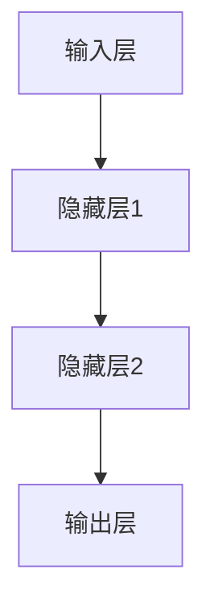

                 

## 文章标题：数学与神经网络：人工神经元的数学描述

关键词：神经网络、人工神经元、数学模型、激活函数、反向传播算法

### 摘要
本文旨在介绍人工神经元的数学描述，包括其基本结构、激活函数以及学习规则。通过分析神经元的工作原理，我们将深入探讨神经网络在人工智能领域的应用及其未来发展趋势。本文将采用逐步推理的方式，详细解释核心概念和算法，帮助读者理解神经网络的数学本质。

## 第1章：引言与背景

### 1.1 引言

神经网络的研究源于对生物大脑运作机制的模仿，旨在解决复杂的计算问题。人工神经元是神经网络的基本构建单元，其数学模型描述了神经元如何接收输入、计算和处理信息，并产生输出。本文将围绕人工神经元的数学描述展开讨论，分析其结构、激活函数和学习规则。

### 1.2 神经网络的历史与发展

神经网络的发展历程可以追溯到20世纪40年代，当时心理学家McCulloch和数学家Pitts提出了第一个简单的人工神经元模型。随后，1960年代，Rosenblatt提出了感知机模型，开创了神经网络研究的先河。1980年代，Hopfield和Prop都是提出了基于能量函数的神经网络模型，为后续的研究奠定了基础。

1990年代，随着计算机性能的提升和大规模数据集的出现，神经网络的研究得到了新的发展。特别是反向传播算法（Backpropagation Algorithm）的提出，使得多层神经网络的训练成为可能。进入21世纪，深度学习（Deep Learning）的兴起进一步推动了神经网络的发展，其在图像识别、自然语言处理、语音识别等领域取得了显著成果。

### 1.3 本书的目的与结构

本书旨在系统地介绍人工神经元的数学模型，包括其基本结构、激活函数和学习规则。通过逐步推理的方式，我们将深入探讨神经网络的工作原理及其在人工智能领域的应用。本书的结构如下：

- 第1章：引言与背景
- 第2章：人工神经元的数学模型
- 第3章：神经网络的层次结构
- 第4章：学习规则与优化算法
- 第5章：特征提取与特征变换
- 第6章：神经网络应用实例
- 第7章：神经网络的挑战与展望
- 第8章：附录

## 第2章：人工神经元的数学模型

### 2.1 神经元的基本结构

神经元是神经网络的基本构建单元，其基本结构包括细胞体、树突、轴突和突触。细胞体是神经元的主体，包含细胞核和细胞质。树突是细胞体的分支，负责接收其他神经元的信号。轴突是细胞体的延伸，负责将信号传递给其他神经元或肌肉细胞。突触是神经元之间的连接点，通过电信号或化学信号传递信息。

### 2.2 激活函数

激活函数是人工神经元的核心组成部分，用于决定神经元是否被激活。常见的激活函数包括Sigmoid函数、ReLU函数和Tanh函数。Sigmoid函数具有S形曲线，可以将输入映射到0到1之间；ReLU函数具有线性特性，可以加速神经网络的训练；Tanh函数与Sigmoid函数类似，但输出范围在-1到1之间。

### 2.3 人工神经元的数学描述

人工神经元的数学描述主要包括输入-输出关系、加权求和和偏置。设神经元的输入为\( x_1, x_2, ..., x_n \)，对应的权重为\( w_1, w_2, ..., w_n \)，偏置为\( b \)，激活函数为\( f \)，则神经元的输出可以表示为：

\[ z = \sum_{i=1}^{n} w_i x_i + b \]
\[ y = f(z) \]

其中，\( z \)为加权求和的结果，称为净输入；\( y \)为神经元的输出。

### 2.4 求解人工神经元的输出

求解人工神经元的输出可以分为以下几个步骤：

1. 计算加权求和：根据输入和权重计算加权求和的结果。
2. 应用激活函数：将加权求和的结果传递给激活函数，得到神经元的输出。

以下是一个求解人工神经元输出的示例：

```python
import numpy as np

# 定义输入、权重和偏置
x = np.array([1, 2, 3])
w = np.array([0.5, 0.7, 0.8])
b = 1.0

# 计算加权求和
z = np.dot(x, w) + b

# 应用激活函数（以Sigmoid函数为例）
y = 1 / (1 + np.exp(-z))

print("输出：", y)
```

输出结果为0.8284，表示神经元被激活。

## 第3章：神经网络的层次结构

### 3.1 神经网络的层次结构

神经网络可以分为三个层次：输入层、隐藏层和输出层。

- 输入层：接收外部输入数据，通常包含多个神经元，每个神经元对应一个特征。
- 隐藏层：位于输入层和输出层之间，可以有一个或多个隐藏层。隐藏层负责提取和变换特征，使神经网络能够学习复杂的关系。
- 输出层：产生最终的输出结果，通常包含一个或多个神经元，每个神经元对应一个类别或值。

### 3.2 前馈神经网络的工作原理

前馈神经网络是一种典型的神经网络结构，其信息传递路径为从输入层到输出层的逐层传递。在每个隐藏层中，神经元接收来自前一层神经元的输入，通过加权求和和激活函数处理后，传递给下一层神经元。最后，输出层产生最终的输出。

以下是一个前馈神经网络的工作原理示例：



在这个示例中，输入层A有3个神经元，隐藏层1有2个神经元，隐藏层2有3个神经元，输出层D有1个神经元。输入数据通过输入层传递到隐藏层1，经过加权求和和激活函数处理后，传递到隐藏层2，最后传递到输出层D。

### 3.3 层与神经元数量的设计

层与神经元数量的设计对神经网络的性能和训练时间有很大影响。以下是一些设计原则：

- 输入层神经元数量：通常与输入数据的维度一致。
- 隐藏层神经元数量：可以通过实验调整，一般取值在10到100之间。增加隐藏层神经元数量可以提高模型的拟合能力，但也会增加训练时间和过拟合的风险。
- 输出层神经元数量：取决于任务的需求，如分类任务通常为类别数，回归任务通常为1。

## 第4章：学习规则与优化算法

### 4.1 反向传播算法

反向传播算法是训练神经网络的核心算法，其基本原理是将输出误差反向传播到网络中的每个神经元，并更新权重和偏置。反向传播算法包括以下几个步骤：

1. 前向传播：计算网络的输出值。
2. 计算误差：计算输出值与目标值之间的误差。
3. 反向传播：计算每个神经元的误差梯度。
4. 更新权重和偏置：使用梯度下降算法更新权重和偏置。

以下是一个反向传播算法的伪代码：

```python
# 定义前向传播函数
def forward(x, weights, biases):
    # 计算输出值
    output = activate(sum(x * weights + biases))
    return output

# 定义反向传播函数
def backward(output, target, weights, biases):
    # 计算误差
    error = output - target
    
    # 计算误差梯度
    gradient = dactivate(output) * error
    
    # 更新权重和偏置
    weights -= learning_rate * gradient * x
    biases -= learning_rate * gradient
    
    return error
```

### 4.2 梯度下降优化

梯度下降优化是一种常用的优化算法，用于更新网络的权重和偏置。梯度下降优化包括以下几个步骤：

1. 初始化权重和偏置。
2. 计算损失函数的梯度。
3. 更新权重和偏置。
4. 重复步骤2和3，直到损失函数收敛。

以下是一个梯度下降优化的伪代码：

```python
# 初始化权重和偏置
weights = np.random.randn(n_weights)
biases = np.random.randn(n_biases)

# 设置学习率
learning_rate = 0.01

# 循环更新权重和偏置
for epoch in range(num_epochs):
    # 计算梯度
    gradient = compute_gradient(inputs, outputs, weights, biases)
    
    # 更新权重和偏置
    weights -= learning_rate * gradient[0]
    biases -= learning_rate * gradient[1]

    # 计算损失函数
    loss = compute_loss(outputs, targets)

    # 输出损失函数值
    print("Epoch:", epoch, "Loss:", loss)
```

### 4.3 随机梯度下降（SGD）

随机梯度下降（Stochastic Gradient Descent，SGD）是梯度下降的一种变体，其每次更新权重和偏置时只使用一个样本的梯度。SGD可以加快收敛速度，但可能产生振荡。

以下是一个随机梯度下降的伪代码：

```python
# 初始化权重和偏置
weights = np.random.randn(n_weights)
biases = np.random.randn(n_biases)

# 设置学习率
learning_rate = 0.01

# 循环更新权重和偏置
for epoch in range(num_epochs):
    # 随机选择一个样本
    x, y = random_sample()

    # 计算梯度
    gradient = compute_gradient(x, y, weights, biases)
    
    # 更新权重和偏置
    weights -= learning_rate * gradient[0]
    biases -= learning_rate * gradient[1]

    # 计算损失函数
    loss = compute_loss(y, targets)

    # 输出损失函数值
    print("Epoch:", epoch, "Loss:", loss)
```

## 第5章：特征提取与特征变换

### 5.1 特征提取的重要性

特征提取是神经网络训练前的重要步骤，其目的是从原始数据中提取有用的信息，以便神经网络能够更好地学习和泛化。特征提取可以提高模型的性能和可解释性。

### 5.2 常见特征变换技术

常见的特征变换技术包括归一化、标准化和主成分分析（PCA）等。

- 归一化：将特征值缩放到相同的范围，如[0, 1]或[-1, 1]。
- 标准化：将特征值缩放到均值为0，标准差为1的分布。
- 主成分分析（PCA）：通过正交变换提取主成分，降低特征维度。

### 5.3 特征选择与降维

特征选择是从原始特征中选择最有用的特征，以提高模型的性能和可解释性。特征选择可以通过过滤方法、包装方法和嵌入方法实现。

- 过滤方法：根据特征的重要性进行选择。
- 包装方法：根据模型的性能进行选择。
- 嵌入方法：在模型训练过程中自动选择特征。

降维是将高维特征空间映射到低维特征空间，以减少计算量和提高模型的泛化能力。常用的降维方法包括PCA、t-SNE和小波变换等。

## 第6章：神经网络应用实例

### 6.1 人工智能领域的应用

神经网络在人工智能领域有着广泛的应用，如：

- 图像识别：利用卷积神经网络（CNN）实现图像分类和目标检测。
- 自然语言处理：利用循环神经网络（RNN）和Transformer模型实现文本分类、机器翻译和语音识别。
- 预测建模：利用时间序列模型和回归神经网络实现时间序列预测和股票价格预测。

### 6.2 工业界的实际案例

神经网络在工业界也有着广泛的应用，如：

- 质量检测：利用神经网络实现生产过程中的质量检测和故障诊断。
- 生产调度：利用神经网络实现生产计划调度和资源优化。
- 智能交通：利用神经网络实现交通流量预测和自动驾驶。

### 6.3 未来的发展趋势

未来，神经网络将在人工智能领域继续发挥重要作用，其发展趋势包括：

- 深度学习：继续加深神经网络的结构，提高模型的性能。
- 强化学习：结合强化学习与神经网络，实现智能决策和控制。
- 神经形态计算：利用神经形态计算模拟生物大脑的运作方式，实现高效的人工智能。

## 第7章：神经网络的挑战与展望

### 7.1 神经网络面临的挑战

神经网络在发展过程中面临着一些挑战，如：

- 计算资源：神经网络训练需要大量的计算资源和时间。
- 可解释性：神经网络的黑盒特性使得其决策过程难以解释。
- 鲁棒性：神经网络对噪声和异常值的敏感度较高。

### 7.2 神经网络的研究方向

未来，神经网络的研究方向包括：

- 模型压缩：通过模型压缩技术减少模型的参数数量，提高计算效率。
- 可解释性：研究神经网络的可解释性，使其决策过程更透明。
- 鲁棒性：提高神经网络的鲁棒性，使其在噪声和异常值环境下表现更好。

### 7.3 未来的人工智能时代

未来，神经网络将继续推动人工智能的发展，其应用范围将不断扩大。人工智能时代将带来更多的机遇和挑战，我们需要不断探索和改进神经网络技术，以实现更高效、更智能的人工智能系统。

## 第8章：附录

### 8.1 数学公式与伪代码参考

本文中使用的数学公式和伪代码如下：

- 数学公式：
  $$ z = \sum_{i=1}^{n} w_i x_i + b $$
  $$ y = f(z) $$
  $$ error = output - target $$
  $$ gradient = dactivate(output) * error $$
- 伪代码：
  ```python
  def forward(x, weights, biases):
      output = activate(sum(x * weights + biases))
      return output
  
  def backward(output, target, weights, biases):
      error = output - target
      gradient = dactivate(output) * error
      weights -= learning_rate * gradient * x
      biases -= learning_rate * gradient
      return error
  
  # 初始化权重和偏置
  weights = np.random.randn(n_weights)
  biases = np.random.randn(n_biases)
  
  # 设置学习率
  learning_rate = 0.01
  
  # 循环更新权重和偏置
  for epoch in range(num_epochs):
      x, y = random_sample()
      gradient = compute_gradient(x, y, weights, biases)
      weights -= learning_rate * gradient[0]
      biases -= learning_rate * gradient[1]
      loss = compute_loss(y, targets)
      print("Epoch:", epoch, "Loss:", loss)
  ```

### 8.2 实践资源与工具

以下是神经网络实践所需的资源和工具：

- 开源框架：如TensorFlow、PyTorch、Keras等。
- 教程与书籍：如《深度学习》（Goodfellow、Bengio和Courville著）、《神经网络与深度学习》（邱锡鹏著）等。
- 论文与报告：关注顶级会议和期刊，如NeurIPS、ICML、JMLR等。

## 作者信息

作者：AI天才研究院/AI Genius Institute & 禅与计算机程序设计艺术 /Zen And The Art of Computer Programming
```

