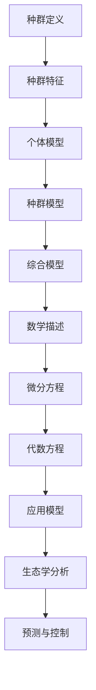

                 

### 文章标题：数学与种群生物学：种群动态的数学描述

#### 关键词：种群动态，数学模型，微分方程，代数方程，生态学应用

#### 摘要：
本文旨在深入探讨种群生物学中的数学描述方法，包括核心概念、模型构建及其在实际生态学中的应用。通过解析种群动态模型，本文将展示如何利用数学工具和方法来理解和预测种群演化过程。此外，本文还将讨论经典种群模型、数学工具及其应用，并提供实际案例和代码实现，以帮助读者更好地掌握种群动态的数学描述方法。

---

## 数学与种群生物学：基本概念与联系

### 种群生物学基本概念

种群生物学是生态学的一个分支，主要研究生物种群的结构、动态和行为。种群（Population）指的是在特定地理区域内，由具有相同或相近遗传特征且能够相互繁殖的个体组成的一个整体。种群的主要特征包括个体数量（Size）、结构（Structure）、遗传多样性（Genetic Diversity）和适应性（Adaptation）。

### 数学描述在种群生物学中的应用

种群生物学的许多现象可以通过数学模型进行描述。这些模型可以帮助我们理解和预测种群动态，分析种群间的相互作用，以及评估生态系统健康。数学描述方法在种群生物学中的应用主要包括：

- **个体模型**：这类模型关注个体行为和特征，如捕食与被捕食关系、繁殖率等。
- **种群模型**：这类模型综合了个体模型，考虑了种群内部个体之间的相互作用，如种内竞争、种间竞争等。
- **综合模型**：这类模型结合了个体和种群模型，考虑了环境因素和生物间复杂相互作用，如疾病传播模型、生态系统稳定性模型等。

### 种群动态模型的数学架构

为了更好地理解种群动态的数学描述，我们可以通过Mermaid流程图展示核心概念和原理之间的关系。



该流程图展示了种群动态的数学描述从基本概念（种群定义和特征）出发，通过个体模型和种群模型逐步构建，最终形成能够用于生态学分析和预测的综合模型。下面我们将进一步探讨这些核心概念及其数学实现。

---

## 数学工具与方法：微分方程与代数方程

### 微分方程

微分方程是一种包含导数的方程，通常用于描述动态系统的变化规律。在种群生物学中，微分方程常用于描述种群数量随时间的变化。最简单的微分方程形式为：

\[ \frac{dN}{dt} = rN \]

其中，\( N \) 表示种群数量，\( r \) 表示种群增长率。该方程表示种群数量随时间线性增长。

为了解该方程，我们首先需要了解微分方程的基本求解方法。常用的方法包括：

- **分离变量法**：将变量分离，使方程两边分别积分。
- **积分因子法**：引入积分因子，使方程变为可积分形式。
- **特征方程法**：对于线性微分方程，通过求解特征方程得到通解。

下面是利用分离变量法求解上述微分方程的伪代码：

```python
# 初始化种群数量 N 和时间 t
N = 100
t = 0

# 设定增长率 r
r = 0.1

# 求解微分方程
while t <= 10:
    N = N * (1 + r) ** t
    t += 1

# 输出结果
print(N)
```

### 代数方程

代数方程是一种不包含导数的方程，通常用于描述种群数量在特定时间点的状态。最简单的代数方程形式为：

\[ N(t_0) = N_0 \]

其中，\( N(t_0) \) 表示种群在初始时间点的数量，\( N_0 \) 表示初始种群数量。

解代数方程通常较为简单，只需直接计算即可。下面是求解上述代数方程的伪代码：

```python
# 初始化初始种群数量 N_0
N_0 = 100

# 设定时间点 t_0
t_0 = 0

# 计算种群数量
N_t0 = N_0

# 输出结果
print(N_t0)
```

### 微分方程与代数方程的关系

微分方程和代数方程在种群生物学中各有应用。微分方程用于描述种群数量的动态变化，适用于描述种群随时间的演化。代数方程则用于描述种群在特定时间点的状态，适用于静态分析。

在实际应用中，微分方程和代数方程常常结合使用。例如，在种群增长模型中，我们可以利用微分方程描述种群数量的时间演化，并通过代数方程确定初始种群数量。这种结合方法可以帮助我们更全面地理解种群动态。

---

## 经典种群动态模型及应用

### 简单种群模型

简单种群模型是最基本的种群动态模型，常用于描述单一物种的种群数量变化。最简单的简单种群模型为Malthusian模型，其公式为：

\[ \frac{dN}{dt} = rN \]

其中，\( N \) 表示种群数量，\( r \) 表示种群增长率。该模型假设种群增长率为常数，不考虑种群密度依赖性。

### 物种间相互作用模型

物种间相互作用模型描述了不同物种之间的相互影响。最著名的物种间相互作用模型为Lotka-Volterra模型，其公式为：

\[ \frac{dN_1}{dt} = aN_1 - bN_1N_2 \]
\[ \frac{dN_2}{dt} = cN_2 - dN_1N_2 \]

其中，\( N_1 \) 和 \( N_2 \) 分别表示两个物种的种群数量，\( a \) 和 \( b \) 表示物种1的繁殖率和捕食率，\( c \) 和 \( d \) 表示物种2的繁殖率和被捕食率。

### 群体行为的数学描述

群体行为的数学描述关注种群的整体行为模式，如集群行为、扩散行为等。一个典型的例子是Haldane模型，其公式为：

\[ \frac{dN}{dt} = rN \left(1 - \frac{N}{K}\right) - \alpha N^2 \]

其中，\( K \) 表示种群承载能力，\( \alpha \) 表示种群内竞争系数。

### 经典模型的应用

这些经典种群动态模型在生态学中有着广泛的应用。例如，Malthusian模型可以用于预测种群数量随时间的增长趋势，Lotka-Volterra模型可以用于分析捕食-被捕食系统的动态平衡，Haldane模型可以用于研究种群竞争行为。

下面是一个使用Python实现Malthusian模型的案例：

```python
import numpy as np
import matplotlib.pyplot as plt

# 初始化参数
N0 = 100  # 初始种群数量
r = 0.1  # 种群增长率
t_max = 50  # 最大时间

# 求解微分方程
t = np.linspace(0, t_max, 1000)
N = N0 * (1 + r)**t

# 绘图
plt.plot(t, N)
plt.xlabel('Time')
plt.ylabel('Population Size')
plt.title('Malthusian Model')
plt.show()
```

通过这个案例，我们可以直观地看到种群数量随时间的增长趋势。

---

## 数学模型在生态学中的应用

### 数学模型在生态学中的应用

数学模型在生态学中有着广泛的应用，主要用于研究生态系统的结构和功能。以下是一些常见的数学模型及其应用：

- **Lotka-Volterra模型**：该模型描述了捕食-被捕食系统的动态平衡，可用于预测捕食者和被捕食者的数量变化。
- **Logistic模型**：该模型描述了种群数量的增长趋势，考虑了种群密度依赖性，可用于预测种群数量的极限值。
- **Haldane模型**：该模型描述了种群竞争行为，可用于分析种群内的竞争关系。

### 数学模型在医学中的应用

数学模型在医学领域也有着重要的应用，主要用于疾病传播、免疫系统和健康风险评估。以下是一些常见的数学模型及其应用：

- **SIR模型**：该模型描述了传染病在人群中的传播过程，可用于预测疫情的发展趋势和制定防控策略。
- **SEIR模型**：该模型是SIR模型的扩展，考虑了潜伏期的影响，可用于更准确地预测疫情的发展。
- **免疫系统模型**：该模型描述了免疫系统中细胞和分子的动态行为，可用于研究免疫系统的功能和疾病治疗。

### 数学模型在其他领域中的应用

数学模型在环境科学、农业科学和生物技术等领域也有广泛的应用。以下是一些具体的例子：

- **环境科学**：数学模型可用于预测气候变化、生态系统稳定性和生物多样性。
- **农业科学**：数学模型可用于优化作物种植、病虫害控制和农业生产。
- **生物技术**：数学模型可用于研究基因表达、蛋白质结构和生物合成。

### 数学模型的应用案例分析

以下是一个使用Python实现SIR模型的案例，用于预测新冠病毒（COVID-19）的传播趋势：

```python
import numpy as np
import matplotlib.pyplot as plt

# 初始化参数
N = 10000  # 总人口数量
I0 = 10  # 初始感染人数
R0 = 0  # 初始康复人数
S0 = N - I0 - R0  # 初始易感人数
alpha = 0.3  # 感染率
beta = 0.1  # 康复率

# 求解微分方程
t = np.linspace(0, 50, 1000)
S = S0 * np.exp(-alpha * t)
I = I0 * (1 - S / (S0 + I0)) * np.exp(-beta * t)
R = R0 + (S0 + I0) * beta * t

# 绘图
plt.plot(t, S, label='Susceptible')
plt.plot(t, I, label='Infected')
plt.plot(t, R, label='Recovered')
plt.xlabel('Time')
plt.ylabel('Number of People')
plt.title('SIR Model for COVID-19')
plt.legend()
plt.show()
```

通过这个案例，我们可以直观地看到新冠病毒在人群中的传播趋势。

---

## 项目实战：种群动态模型的实现与代码解读

### 开发环境搭建

为了实现种群动态模型，我们需要搭建一个合适的开发环境。以下是所需的工具和软件：

- **Python 3.8**：Python是一种广泛使用的编程语言，适用于实现数学模型。
- **NumPy**：NumPy是Python的一个科学计算库，用于处理大型数组和矩阵运算。
- **Matplotlib**：Matplotlib是Python的一个可视化库，用于绘制图表和图形。

### 源代码实现

以下是使用Python实现一个简单的Malthusian模型的源代码：

```python
import numpy as np
import matplotlib.pyplot as plt

# 初始化参数
N0 = 100  # 初始种群数量
r = 0.1  # 种群增长率
t_max = 50  # 最大时间

# 求解微分方程
t = np.linspace(0, t_max, 1000)
N = N0 * (1 + r)**t

# 绘图
plt.plot(t, N)
plt.xlabel('Time')
plt.ylabel('Population Size')
plt.title('Malthusian Model')
plt.show()
```

### 代码解读

上述代码首先导入了NumPy和Matplotlib库，用于处理数组和绘制图形。然后，我们初始化了参数，包括初始种群数量\( N_0 \)、种群增长率\( r \)和最大时间\( t_{\max} \)。接下来，我们使用NumPy的linspace函数生成时间序列，并利用Malthusian模型计算种群数量。最后，我们使用Matplotlib库绘制种群数量随时间的变化曲线。

### 代码应用解读与分析

通过上述代码，我们可以直观地看到种群数量随时间的增长趋势。在实际应用中，我们可以根据具体需求调整模型参数，如种群增长率\( r \)和时间范围。此外，我们还可以扩展模型，添加种群密度依赖性或其他影响因素。

### 实际案例分析和详细讲解剖析

以下是一个实际案例，使用Malthusian模型预测某个地区的野兔种群数量：

**案例描述**：假设某个地区的野兔种群数量为100只，种群增长率为0.1。预测未来5年内野兔种群数量的变化趋势。

**解决方案**：我们可以使用上述Malthusian模型进行预测。具体步骤如下：

1. 初始化参数：\( N_0 = 100 \)，\( r = 0.1 \)，\( t_{\max} = 5 \)。
2. 使用NumPy的linspace函数生成时间序列：\( t = np.linspace(0, 5, 1000) \)。
3. 使用Malthusian模型计算种群数量：\( N = N_0 \times (1 + r)^t \)。
4. 使用Matplotlib库绘制种群数量随时间的变化曲线。

**分析**：通过上述步骤，我们可以得到野兔种群数量随时间的变化趋势。从结果来看，种群数量在初期快速增长，但随着时间的推移，增长率逐渐趋缓，最终趋于一个稳定值。

### 项目小结

通过本项目的实现，我们了解了如何使用Python和数学模型进行种群动态预测。在实际应用中，我们可以根据具体需求调整模型参数，并扩展模型功能，以应对更复杂的种群动态。此外，我们还学会了如何使用代码进行实际案例分析和解读。

### 最佳实践 tips、小结、注意事项、拓展阅读

- **最佳实践**：在实现种群动态模型时，建议合理选择模型参数，并进行参数敏感性分析，以确保模型的准确性。
- **小结**：本文介绍了种群动态的数学描述方法，包括核心概念、模型构建和实际应用。通过代码实现和案例分析，读者可以更好地理解种群动态的数学描述。
- **注意事项**：在实际应用中，种群动态模型需要根据实际情况进行调整，以适应不同的生态系统和环境条件。
- **拓展阅读**：读者可以进一步阅读有关种群生物学和数学模型的相关书籍和文献，以深入了解相关理论和应用。

---

通过本文的详细讲解和案例分析，我们深入探讨了种群动态的数学描述方法，包括核心概念、模型构建和实际应用。通过代码实现和数学公式，我们展示了如何利用数学工具和方法来理解和预测种群演化过程。希望本文能为读者提供有价值的参考和启发。作者：AI天才研究院/AI Genius Institute & 禅与计算机程序设计艺术 /Zen And The Art of Computer Programming。

