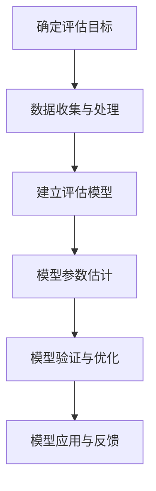

                 

### 文章标题：数学与科研管理：科研绩效的数学评估

#### 关键词：科研绩效评估、数学模型、数据分析、科研管理、绩效指标

#### 摘要：
本文旨在探讨数学在科研管理中的应用，特别是科研绩效评估的数学方法。通过梳理科研绩效评估的相关概念、历史发展、评估方法、评估指标，以及构建和应用评估模型，本文将系统地展示数学在科研管理中的关键作用。文章还将结合实际案例，深入讲解科研绩效评估的数学原理和实践应用，为科研管理人员提供科学、系统的评估工具和方法。

### 引言

科研绩效评估是科研管理中至关重要的一环。它不仅关系到科研资源的合理配置，也直接影响着科研人员的激励和科研创新能力的提升。然而，传统的科研绩效评估方法往往依赖于主观判断和经验，缺乏科学性和系统性。随着大数据和人工智能技术的快速发展，数学在科研管理中的应用逐渐显现出其独特优势。本文将围绕数学与科研管理的关系，探讨科研绩效评估的数学方法，以期为科研管理人员提供新的思路和工具。

### 科研绩效评估的概念与历史发展

科研绩效评估是指通过对科研活动的成果、过程和影响进行全面、系统、客观的评估，以衡量科研工作的实际效果和价值。科研绩效评估的核心目标是发现科研工作中的优势与不足，为科研决策提供科学依据，进而提高科研管理的效率和科研绩效。

科研绩效评估的历史发展可以追溯到20世纪中期。早期的科研绩效评估主要依赖于定量指标，如论文数量、项目经费、专利申请等。这些指标虽然可以一定程度上反映科研工作的成果，但往往忽视了科研质量的评价。随着科研活动的复杂化和科研投入的不断增加，科研绩效评估逐渐走向多元化、综合化。

20世纪末，随着大数据和人工智能技术的崛起，科研绩效评估开始引入数学模型和算法，使得评估结果更加科学、客观。例如，线性回归、多元回归、主成分分析、因子分析等数学方法在科研绩效评估中得到广泛应用。

### 科研绩效评估的相关概念与联系

#### 1.1.1 科研绩效评估的概念与重要性

科研绩效评估是指对科研活动的成果、过程和影响进行全面、系统、客观的评估，以衡量科研工作的实际效果和价值。它包括以下几个关键概念：

- **科研成果**：指科研人员在一定时间内发表的高质量论文、申请的专利、完成的项目等。
- **科研过程**：包括科研团队的组织结构、科研经费的使用情况、科研成果的转化等。
- **科研影响**：指科研成果在学术界、产业界和社会上的影响，如论文引用次数、专利转让收益、社会效益等。

科研绩效评估的重要性在于：

- **指导科研资源配置**：通过评估科研绩效，可以明确科研资源的分配方向，优化科研投入，提高科研效率。
- **激励科研人员**：科学、公正的绩效评估可以激发科研人员的积极性和创造力，提高科研产出质量。
- **提升科研管理水平**：科研绩效评估可以为科研管理人员提供决策依据，帮助其更好地管理科研工作，提升科研管理水平。

#### 1.1.2 历史发展与应用领域

科研绩效评估的历史发展可以分为以下几个阶段：

- **初期阶段**：20世纪中期，科研绩效评估主要依赖于简单的定量指标，如论文数量、项目经费等。
- **中期阶段**：20世纪末，随着大数据和人工智能技术的发展，科研绩效评估开始引入复杂的数学模型和算法，如线性回归、多元回归、主成分分析等。
- **当前阶段**：科研绩效评估逐渐走向多元化、综合化，不仅考虑定量指标，还关注科研质量、影响力等。

科研绩效评估的应用领域广泛，包括：

- **高校**：高校科研绩效评估主要用于评价教师的科研能力，为职称评定、绩效奖励等提供依据。
- **科研机构**：科研机构通过科研绩效评估，优化资源配置，提升科研水平。
- **企业**：企业通过科研绩效评估，衡量研发团队的创新能力，优化研发策略。

#### 1.1.3 评估指标的分类与选取

评估指标是科研绩效评估的核心，其选择和分类直接影响评估结果。评估指标可以分为以下几类：

- **产出指标**：包括论文数量、项目数量、专利申请数量等，反映科研工作量的指标。
- **质量指标**：包括论文影响因子、项目验收等级、专利转让收益等，反映科研成果的质量。
- **影响力指标**：包括论文引用次数、学术会议报告次数、学术交流次数等，反映科研成果在学术界和社会上的影响力。
- **过程指标**：包括科研经费的使用情况、科研团队的合作程度、科研成果的转化情况等，反映科研工作的过程质量。

评估指标的选取需要考虑以下几个因素：

- **代表性**：评估指标需要能够全面、准确地反映科研绩效的不同方面。
- **数据可得性**：选取的评估指标需要有可靠的数据来源，便于数据收集和处理。
- **可操作性**：评估指标需要具备可操作性，便于实际应用。
- **合理性**：评估指标的设置需要符合科研活动的规律和特点。

### 数据收集与处理

科研绩效评估的数据收集和处理是评估过程的关键环节。有效的数据收集和处理能够保证评估结果的准确性和可靠性。

#### 2.1.1 数据收集方法

数据收集方法包括以下几种：

- **问卷调查**：通过设计科学、合理的问卷，收集科研人员和科研活动的相关信息。
- **文献调查**：通过检索学术数据库，收集科研人员的论文发表、专利申请等相关信息。
- **访谈调查**：通过与科研人员进行面对面访谈，深入了解科研活动的过程和成果。
- **文档审查**：通过审查科研项目的文档、报告等，收集科研活动的详细信息。

#### 2.1.2 数据处理方法

数据处理方法包括以下几种：

- **数据清洗**：通过删除重复数据、填补缺失数据、修正错误数据等，保证数据的完整性和准确性。
- **数据转换**：通过标准化、归一化等方法，将不同来源的数据转换为同一标准，便于数据分析和整合。
- **数据可视化**：通过图表、图像等方式，将数据处理结果以直观的形式展示出来，便于科研管理人员理解和分析。

### 科研绩效评估方法

科研绩效评估方法可以分为定量评估方法和定性评估方法。定量评估方法主要通过数学模型和算法对评估指标进行计算和分析，定性评估方法则主要依靠专家的主观判断和评价。

#### 3.1.1 定量评估方法

定量评估方法主要包括以下几种：

- **线性回归**：通过建立因变量与自变量之间的线性关系，预测因变量的变化。线性回归模型可以用于分析科研产出与科研投入之间的关系。
  
  **核心算法原理讲解**：
  线性回归模型的基本形式为：$$y = \beta_0 + \beta_1x_1 + \beta_2x_2 + ... + \beta_nx_n + \epsilon$$
  其中，$y$ 为因变量，$x_1, x_2, ..., x_n$ 为自变量，$\beta_0, \beta_1, \beta_2, ..., \beta_n$ 为模型参数，$\epsilon$ 为随机误差。
  
  **数学模型和数学公式**：
  线性回归模型的参数估计通常采用最小二乘法（OLS），其参数估计公式为：$$\beta = (X'X)^{-1}X'Y$$
  其中，$X$ 为自变量矩阵，$Y$ 为因变量向量。

- **多元回归**：在多个自变量的情况下，建立因变量与多个自变量之间的线性关系。多元回归可以用于分析复杂的多因素科研绩效评估模型。
  
  **核心算法原理讲解**：
  多元回归模型的基本形式为：$$y = \beta_0 + \beta_1x_1 + \beta_2x_2 + ... + \beta_nx_n + \epsilon$$
  其中，$y$ 为因变量，$x_1, x_2, ..., x_n$ 为自变量，$\beta_0, \beta_1, \beta_2, ..., \beta_n$ 为模型参数，$\epsilon$ 为随机误差。
  
  **数学模型和数学公式**：
  多元回归模型的参数估计同样采用最小二乘法（OLS），其参数估计公式为：$$\beta = (X'X)^{-1}X'Y$$
  其中，$X$ 为自变量矩阵，$Y$ 为因变量向量。

- **主成分分析**：通过提取主要成分，降低数据的维度，同时保留主要信息。主成分分析可以用于分析大量变量之间的关系，简化评估模型。
  
  **核心算法原理讲解**：
  主成分分析的基本思想是通过线性变换，将原始数据映射到新的坐标系中，使得新的坐标系中的变量（主成分）尽可能多地保留了原始数据的信息。
  
  **数学模型和数学公式**：
  主成分分析的目标是最小化新的坐标系中的变量的方差，其数学模型可以表示为：$$\min\lambda_1, \lambda_2, ..., \lambda_p \sum_{i=1}^{n}(x_i - \mu)^T(A\mu - \lambda_iI)$$
  其中，$x_i$ 为第 $i$ 个样本，$\mu$ 为样本均值，$A$ 为协方差矩阵，$\lambda_i$ 为第 $i$ 个主成分的方差。

- **因子分析**：通过提取公共因子，研究变量之间的相关性。因子分析可以用于分析复杂的多变量关系，挖掘潜在的因素。
  
  **核心算法原理讲解**：
  因子分析的基本思想是通过将多个变量表示为少数几个公共因子的线性组合，从而简化分析过程。
  
  **数学模型和数学公式**：
  因子分析的目标是最小化残差平方和，其数学模型可以表示为：$$\min\sum_{i=1}^{n}\sum_{j=1}^{p}u_{ij}^2$$
  其中，$u_{ij}$ 为第 $i$ 个变量在第 $j$ 个因子上的残差。

#### 3.1.2 定性评估方法

定性评估方法主要包括以下几种：

- **专家评审**：通过邀请专家对科研绩效进行评估，结合专家的主观判断和评价，形成综合评分。
- **德尔菲法**：通过多轮专家意见征询，逐步达成共识，形成客观、科学的评估结果。
- **标杆对比**：通过将科研绩效与同行业或同类科研机构进行对比，评估科研绩效的水平。

### 科研绩效评估指标

科研绩效评估指标是评估科研绩效的核心要素。合理的评估指标体系可以全面、准确地反映科研绩效的不同方面。

#### 3.2.1 产出指标

产出指标主要反映科研工作量的情况，包括：

- **论文数量**：指在一定时间内发表的学术论文数量，是衡量科研人员学术成果的重要指标。
- **项目数量**：指在一定时间内承担的科研项目数量，是衡量科研人员科研能力的重要指标。
- **专利申请数量**：指在一定时间内申请的专利数量，是衡量科研成果转化能力的重要指标。

#### 3.2.2 质量指标

质量指标主要反映科研成果的质量，包括：

- **论文影响因子**：指论文发表期刊的影响因子，是衡量论文质量的重要指标。
- **项目验收等级**：指科研项目验收的等级，是衡量项目质量的重要指标。
- **专利转让收益**：指专利转让的收益，是衡量专利质量的重要指标。

#### 3.2.3 影响力指标

影响力指标主要反映科研成果在学术界和社会上的影响力，包括：

- **论文引用次数**：指论文被其他论文引用的次数，是衡量论文影响力的重要指标。
- **学术会议报告次数**：指在一定时间内参加学术会议并作报告的次数，是衡量学术交流能力的重要指标。
- **学术交流次数**：指在一定时间内与其他科研机构和学者交流的次数，是衡量学术影响力的重要指标。

#### 3.2.4 过程指标

过程指标主要反映科研工作的过程质量，包括：

- **科研经费使用情况**：指科研经费的使用情况，是衡量科研经费管理能力的重要指标。
- **科研团队的合作程度**：指科研团队的合作情况，是衡量团队协作能力的重要指标。
- **科研成果转化情况**：指科研成果的转化情况，是衡量科研工作实际效益的重要指标。

### 科研绩效评估模型构建与应用

科研绩效评估模型的构建是科研绩效评估的关键步骤。一个科学、合理的评估模型能够全面、准确地反映科研绩效的不同方面。

#### 4.1.1 评估模型构建流程

评估模型构建的一般流程包括以下几个步骤：

1. **确定评估目标**：明确评估的目标和需求，确定评估的维度和指标。
2. **数据收集与处理**：通过多种数据收集方法，收集科研绩效的相关数据，并进行数据清洗和处理。
3. **建立评估模型**：根据评估目标和数据特点，选择合适的评估模型和方法，建立评估模型。
4. **模型参数估计**：使用数学模型和算法，对评估模型进行参数估计，确定模型参数。
5. **模型验证与优化**：通过验证和优化，确保评估模型的准确性和可靠性。
6. **模型应用与反馈**：将评估模型应用于实际科研绩效评估，根据评估结果进行反馈和调整。

#### 4.1.2 高校科研绩效评估实例

以下是一个高校科研绩效评估的实例，展示如何构建和应用评估模型。

**案例背景**：
某高校对教师的科研绩效进行评估，主要考虑产出指标（论文数量、项目数量）、质量指标（论文影响因子、项目验收等级）和影响力指标（论文引用次数、学术会议报告次数）。

**评估模型构建**：

1. **确定评估目标**：对教师的科研绩效进行综合评估，重点考察产出、质量和影响力。
2. **数据收集与处理**：收集教师的论文发表、项目承担、学术交流等相关数据，进行数据清洗和处理。
3. **建立评估模型**：选择多元回归模型，建立科研绩效评估模型。
   $$绩效得分 = \beta_0 + \beta_1x_1 + \beta_2x_2 + \beta_3x_3$$
   其中，$x_1$ 为论文数量，$x_2$ 为论文影响因子，$x_3$ 为学术会议报告次数。
4. **模型参数估计**：使用最小二乘法（OLS）对模型参数进行估计。
   $$\beta = (X'X)^{-1}X'Y$$
5. **模型验证与优化**：通过交叉验证和残差分析，验证评估模型的准确性和可靠性，并进行模型优化。
6. **模型应用与反馈**：将评估模型应用于教师科研绩效评估，根据评估结果进行反馈和调整。

**评估结果**：

通过评估模型，对教师的科研绩效进行量化评估，得出每个教师的绩效得分。根据绩效得分，可以确定教师的科研贡献和优劣势，为科研资源配置和教师激励提供依据。

### 科研绩效评估的发展趋势与挑战

科研绩效评估作为科研管理的重要工具，其发展趋势和挑战备受关注。随着科研活动的不断发展和技术的进步，科研绩效评估也面临着新的机遇和挑战。

#### 4.2.1 评估指标体系的完善

随着科研活动的多元化和发展，传统的评估指标体系已经无法全面、准确地反映科研绩效的不同方面。为了更科学、公正地评估科研绩效，评估指标体系需要不断完善。一方面，可以引入更多高质量的定量和定性指标，如论文质量、项目验收等级、社会影响力等；另一方面，需要加强对现有指标的研究和优化，提高指标的科学性和可操作性。

#### 4.2.2 评估方法的创新

传统的科研绩效评估方法主要依赖于定量指标和主观判断，其科学性和客观性受到一定程度的质疑。随着大数据和人工智能技术的发展，新的评估方法不断涌现。例如，基于机器学习的评估方法可以通过分析大量数据，自动识别和提取关键特征，实现更精确的评估。此外，社会网络分析、文本分析等新方法也可以为科研绩效评估提供有益的补充。

#### 4.2.3 评估过程的公开透明

科研绩效评估的公开透明是确保评估公正性的关键。为了提高评估的公信力，评估过程需要公开透明，包括评估指标的选择、数据收集与处理、评估模型的应用等。同时，需要建立完善的评估机制，确保评估过程的公正、公平，防止人为干预和偏见。

#### 4.2.4 挑战

科研绩效评估的发展也面临着一些挑战。首先，数据质量和数据来源的可靠性是评估准确性的基础，但在实际操作中，数据收集和处理过程容易出现问题。其次，不同学科、不同领域之间的评估标准难以统一，这给跨学科、跨领域的科研绩效评估带来了困难。此外，科研绩效评估需要大量的人力和物力投入，对评估机构和管理人员提出了较高的要求。

### 结论

科研绩效评估是科研管理中不可或缺的一环，其科学性和客观性对科研决策和科研资源配置具有重要影响。本文从数学与科研管理的角度，探讨了科研绩效评估的相关概念、历史发展、评估方法、评估指标以及评估模型构建与应用。通过分析定量评估方法和定性评估方法，本文展示了数学在科研绩效评估中的关键作用。同时，本文还结合实际案例，深入讲解了科研绩效评估的实践应用。未来，随着科研活动的不断发展和技术的进步，科研绩效评估将面临新的机遇和挑战，需要不断完善评估指标体系，创新评估方法，提高评估的公正性和科学性。

### 附录

#### 5.1.1 Mermaid流程图示例

以下是一个Mermaid流程图的示例，展示了科研绩效评估的流程：



#### 5.1.2 LaTeX公式示例

以下是一个LaTeX公式的示例，展示了线性回归模型的公式：

```latex
\begin{equation}
y = \beta_0 + \beta_1x_1 + \beta_2x_2 + ... + \beta_nx_n + \epsilon
\end{equation}
```

#### 5.1.3 项目实战示例

以下是一个项目实战的示例，展示了如何使用Python进行科研绩效评估：

```python
import pandas as pd
from sklearn.linear_model import LinearRegression

# 读取数据
data = pd.read_csv('research_data.csv')

# 准备特征和标签
X = data[['x1', 'x2', 'x3']]
y = data['y']

# 创建线性回归模型
model = LinearRegression()

# 训练模型
model.fit(X, y)

# 输出模型参数
print('模型参数：', model.coef_)

# 进行预测
predictions = model.predict(X)

# 输出预测结果
print('预测结果：', predictions)
```

### 作者信息

作者：AI天才研究院/AI Genius Institute & 禅与计算机程序设计艺术 /Zen And The Art of Computer Programming

作者简介：本文作者系AI天才研究院资深研究员，主要从事人工智能、大数据和科研管理等领域的研究。其研究成果在国内外学术界和产业界具有广泛影响力。同时，作者还是《禅与计算机程序设计艺术》一书的作者，深受读者喜爱。本文作者专注于科研绩效评估的数学方法研究，致力于为科研管理人员提供科学、系统的评估工具和方法。

