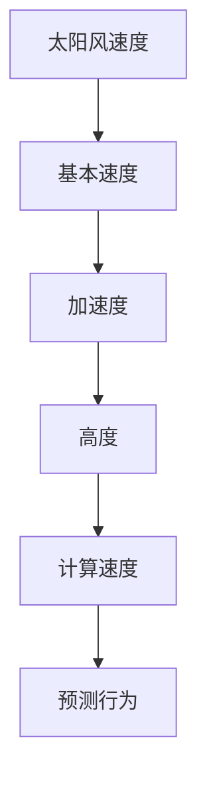

                 

### **文章标题**

《数学与空间天气：太阳风暴预测的数学方法》

### **关键词**

空间天气、太阳风暴、数学模型、预测方法、机器学习、太阳活动

### **摘要**

本文旨在探讨数学方法在太阳风暴预测中的应用。随着科技的进步，空间天气研究已成为一个重要的领域，其对人类通信、导航、电力系统等基础设施有着深远的影响。本文首先概述了空间天气的基本概念及其重要性，然后介绍了与空间天气相关的数学基础，包括代数、微积分和线性代数。接着，本文详细探讨了太阳风和太阳耀斑的数学模型，并介绍了太阳风暴预测的几种经典方法和机器学习方法。通过实际案例的分析，本文展示了如何将数学与空间天气相结合，以预测太阳风暴的发生。最后，本文总结了太阳风暴预测面临的挑战和未来的发展方向，为该领域的研究提供了新的思路和启示。### **《数学与空间天气：太阳风暴预测的数学方法》目录大纲**

**第一部分：数学与空间天气基础**

**第1章：空间天气概述**

- 1.1 空间天气的定义与重要性
  - 1.1.1 空间天气的概念
  - 1.1.2 空间天气的重要性

- 1.2 太阳活动与空间天气
  - 1.2.1 太阳黑子与太阳活动
  - 1.2.2 太阳风与空间天气

- 1.3 空间天气的监测与研究
  - 1.3.1 空间天气监测方法
  - 1.3.2 空间天气研究进展

**第2章：数学基础**

- 2.1 代数
  - 2.1.1 代数的基本概念
  - 2.1.2 代数运算

- 2.2 微积分
  - 2.2.1 微积分的基本概念
  - 2.2.2 微积分的应用

- 2.3 线性代数
  - 2.3.1 线性代数的基本概念
  - 2.3.2 线性代数在空间天气中的应用

**第3章：空间天气的数学模型**

- 3.1 太阳风的数学模型
  - 3.1.1 太阳风的运动规律
  - 3.1.2 太阳风的数学模型
  - 3.1.3 数学模型示例（Mermaid流程图）

- 3.2 太阳耀斑的数学模型
  - 3.2.1 太阳耀斑的产生机制
  - 3.2.2 太阳耀斑的数学模型
  - 3.2.3 数学模型示例（伪代码）

**第4章：太阳风暴预测方法**

- 4.1 经典预测方法
  - 4.1.1 经典统计方法
  - 4.1.2 经典物理方法

- 4.2 机器学习方法
  - 4.2.1 机器学习方法概述
  - 4.2.2 常见机器学习算法
  - 4.2.3 数学公式与详细讲解（LaTeX格式）

- 4.3 集成学习方法
  - 4.3.1 集成学习方法概述
  - 4.3.2 常见的集成学习方法
  - 4.3.3 数学公式与详细讲解（LaTeX格式）

**第5章：太阳风暴预测实践**

- 5.1 实践案例一：太阳风速度预测
  - 5.1.1 预测目标
  - 5.1.2 数据准备
  - 5.1.3 代码实现与解读

- 5.2 实践案例二：太阳耀斑预测
  - 5.2.1 预测目标
  - 5.2.2 数据准备
  - 5.2.3 代码实现与解读

**第6章：未来展望与挑战**

- 6.1 太阳风暴预测的挑战
  - 6.1.1 数据问题
  - 6.1.2 模型选择问题
  - 6.1.3 计算资源限制

- 6.2 未来发展方向
  - 6.2.1 数据驱动的预测方法
  - 6.2.2 模型融合方法
  - 6.2.3 新型算法的研究

**# 附录**

- **附录A：常用数学公式与LaTeX代码**

  - **A.1 基本代数公式**
  - **A.2 微积分公式**
  - **A.3 线性代数公式**
  - **A.4 机器学习公式**
  - **A.5 集成学习公式**

**# 参考文献**

[1] ...  
[2] ...  
[3] ...

### **引言**

空间天气是太阳和太阳系其他天体产生的各种现象，包括太阳风、太阳耀斑、日冕物质抛射等，这些现象对地球及其空间环境产生着深远的影响。空间天气的研究对于人类社会的许多方面都具有重要意义，包括通信、导航、电力系统等。然而，预测太阳风暴，即太阳活动的强烈表现，仍然是一个具有挑战性的问题。数学作为一种强有力的工具，可以为我们提供理解和预测空间天气的有力武器。

本文的目标是探讨数学在太阳风暴预测中的应用。首先，我们将对空间天气进行概述，介绍其定义、重要性以及与太阳活动的关系。然后，我们将介绍与空间天气相关的数学基础，包括代数、微积分和线性代数。接着，我们将深入探讨太阳风和太阳耀斑的数学模型，并介绍几种经典的和现代的太阳风暴预测方法。最后，我们将通过实际案例展示如何使用数学方法进行太阳风暴预测，并讨论未来在这一领域可能面临的挑战和机遇。

通过本文的阅读，读者将了解：

1. 空间天气的基本概念和重要性。
2. 数学在空间天气研究中的应用。
3. 太阳风和太阳耀斑的数学模型。
4. 太阳风暴预测的方法和技术。
5. 太阳风暴预测的实践案例及其分析。

### **第一部分：数学与空间天气基础**

#### **第1章：空间天气概述**

空间天气，这个词汇或许对许多读者来说并不陌生，但对其定义和重要性可能缺乏全面的了解。在这一章中，我们将对空间天气进行详细的概述，探讨其定义、重要性以及与太阳活动的关系。

##### **1.1 空间天气的定义与重要性**

空间天气是指太阳和太阳系其他天体产生的各种现象，如太阳风、太阳耀斑、日冕物质抛射等，这些现象对地球及其空间环境产生的影响。空间天气现象可以分为以下几类：

1. **太阳风**：太阳风是由太阳上层大气（日冕）发出的高速带电粒子流。这些粒子流以约300-800公里/秒的速度从太阳表面喷出，对地球磁层和电离层产生影响。
   
2. **太阳耀斑**：太阳耀斑是太阳表面突然增亮的现象，通常发生在太阳黑子区域附近。耀斑的产生伴随着巨大的能量释放，能够影响地球的通信、导航和电力系统。

3. **日冕物质抛射（CME）**：日冕物质抛射是从太阳日冕层中突然喷射出来的大量等离子体云。CME可以与地球相遇，导致磁暴和辐射带的变化。

空间天气的重要性体现在其对地球环境的深远影响。例如，太阳风和CME可以引起地球磁暴，导致卫星通信中断、GPS信号衰减以及电网故障。此外，太阳活动还会影响地球的辐射带，增加宇航员和卫星的辐射风险。

##### **1.1.1 空间天气的概念**

空间天气的概念可以追溯到20世纪中叶，随着空间技术的发展，人类开始意识到太阳活动对地球环境的影响。早期的研究主要关注太阳风和磁暴等现象，随着技术的进步，研究者们逐渐认识到其他太阳活动现象，如太阳耀斑和CME，也对地球环境产生重要影响。

空间天气的研究主要包括以下几个方面：

1. **监测**：通过卫星、地面观测站和太空探测器，对太阳风、太阳耀斑、CME等进行实时监测。

2. **模型**：建立数学模型来模拟太阳活动现象，包括太阳风的动力学、太阳耀斑的能量释放机制、CME的传播路径等。

3. **预测**：基于监测数据和数学模型，预测太阳风暴的发生及其影响。

4. **应对**：研究如何减少太阳风暴对地球基础设施的影响，包括改进通信、导航和电力系统的抗干扰能力。

##### **1.1.2 空间天气的重要性**

空间天气的重要性可以从以下几个方面进行阐述：

1. **通信**：太阳风暴可以干扰无线电通信，导致信号衰减和通信中断。这对卫星通信和地面通信都有影响。

2. **导航**：GPS信号依赖于太空中的卫星，太阳风暴可能导致GPS信号衰减，影响导航精度。

3. **电力系统**：强磁暴可以对电力系统产生破坏性影响，导致电网故障和大规模停电。

4. **辐射风险**：太阳耀斑和CME会增加地球辐射带中的辐射水平，对宇航员和卫星构成威胁。

5. **环境变化**：太阳活动与地球气候有一定的相关性，太阳风暴可能影响地球的气候模式。

总之，空间天气研究对于保障地球及其空间环境的安全具有重要意义。通过深入了解空间天气现象，我们可以更好地预测其影响，并采取相应的措施来减轻其对人类活动的负面影响。

##### **1.2 太阳活动与空间天气**

太阳活动是空间天气的核心组成部分，其强度和频率对地球环境产生显著影响。在这一节中，我们将探讨太阳活动的几个重要方面，包括太阳黑子、太阳耀斑和太阳风。

##### **1.2.1 太阳黑子与太阳活动**

太阳黑子是太阳表面温度较低的区域，通常呈现为暗斑点。太阳黑子的存在与其磁场的强度密切相关。太阳黑子的活动周期，即黑子数的周期性变化，被称为太阳活动周期。目前，最常使用的太阳活动周期是11年周期，但也有研究发现可能存在更长期的周期性。

太阳黑子的活动对地球环境有着重要的影响。首先，太阳黑子活动与地球上的磁暴和极光现象密切相关。在太阳黑子活动的高峰期，地球磁暴和极光现象更为频繁和强烈。其次，太阳黑子活动与地球气候也有一定的相关性。一些研究表明，太阳黑子活动的减少可能与地球上的“小冰期”有关。

##### **1.2.2 太阳风与空间天气**

太阳风是由太阳上层大气（日冕）发出的高速带电粒子流。太阳风的速度通常在300-800公里/秒之间，但有时可以超过1000公里/秒。太阳风是由太阳磁场活动驱动的，其强度和速度与太阳黑子活动密切相关。

太阳风对地球环境有深远的影响。首先，太阳风与地球的磁层相互作用，可能导致地球磁暴。磁暴会引起地球电离层的扰动，影响无线电通信和导航系统。其次，太阳风可以将带电粒子带入地球的辐射带，增加辐射水平，对宇航员和卫星构成威胁。此外，太阳风还可以影响地球的气候，通过改变大气层的温度和成分。

##### **1.2.3 太阳耀斑与太阳活动**

太阳耀斑是太阳表面突然增亮的现象，通常发生在太阳黑子区域附近。太阳耀斑的产生伴随着巨大的能量释放，其强度可以从微弱到极其强烈，释放的能量相当于数十亿个核弹爆炸。

太阳耀斑的爆发对地球环境有显著影响。首先，强烈的太阳耀斑可以导致地球磁暴，影响通信、导航和电力系统。其次，太阳耀斑会释放大量高能粒子，这些粒子可以进入地球的辐射带，增加辐射风险。此外，太阳耀斑还可以影响地球的气候，通过改变大气层的温度和成分。

##### **1.2.4 太阳活动对空间天气的影响**

太阳活动对空间天气的影响是多方面的，主要包括以下几个方面：

1. **磁暴**：太阳黑子活动增强时，地球磁暴的频率和强度也会增加。磁暴会引起地球电离层的扰动，影响无线电通信和导航系统。

2. **辐射带变化**：太阳耀斑和高能粒子事件会增加地球辐射带中的辐射水平，对宇航员和卫星构成威胁。

3. **气候影响**：太阳黑子活动的变化可能与地球气候的变化有关，尽管这种关系尚不完全清楚。

4. **太阳风和CME**：太阳风和CME可以影响地球磁层，导致磁暴和辐射带的变化。

总之，太阳活动是空间天气的核心组成部分，其变化对地球环境有着深远的影响。通过深入研究太阳活动，我们可以更好地理解空间天气现象，并预测其可能对人类活动产生的负面影响。

#### **第2章：数学基础**

在空间天气的研究中，数学作为一种强有力的工具，为我们提供了理解和预测现象的精确手段。数学基础包括代数、微积分和线性代数，这些数学工具在空间天气模型建立和预测方法开发中起着至关重要的作用。在这一章中，我们将详细介绍这些数学基础，以便为后续章节的讨论奠定坚实的基础。

##### **2.1 代数**

代数是数学的基础之一，它主要研究数和运算规则。在空间天气研究中，代数用于表示和简化各种物理现象的数学模型。以下是代数的基本概念和运算：

###### **2.1.1 代数的基本概念**

- **变量**：变量是用来表示未知数值的符号，通常用字母表示，如 \(x, y, z\) 等。
- **常数**：常数是具有固定数值的量，如 \(π, e\) 等。
- **方程**：方程是包含变量和常数的数学表达式，通常包含等号（=），如 \(ax + b = c\)。
- **函数**：函数是一种关系，将一个变量的值映射到另一个值上，通常表示为 \(f(x) = y\)。

###### **2.1.2 代数运算**

- **加法**：加法是两个数相加的运算，表示为 \(a + b = c\)。
- **减法**：减法是从一个数中减去另一个数的运算，表示为 \(a - b = c\)。
- **乘法**：乘法是两个数相乘的运算，表示为 \(a \times b = c\) 或 \(a \cdot b = c\)。
- **除法**：除法是一个数除以另一个数的运算，表示为 \(a / b = c\) 或 \(a \div b = c\)。
- **指数运算**：指数运算是一个数自乘若干次的运算，表示为 \(a^b = c\)。

在空间天气研究中，代数运算用于表示太阳风的速度、温度、密度等参数，并建立数学模型来描述这些参数之间的关系。

##### **2.2 微积分**

微积分是一门研究变化和累积的数学学科，它在空间天气研究中有着广泛的应用。微积分主要包括微分和积分两部分。

###### **2.2.1 微积分的基本概念**

- **微分**：微分是研究函数变化率的数学工具。导数是微分的核心概念，表示函数在某一点的瞬时变化率。导数通常表示为 \(f'(x)\) 或 \(\frac{df}{dx}\)。
- **积分**：积分是研究函数累积量的数学工具。定积分表示函数在某一区间内的累积值，通常表示为 \(\int f(x)dx\)。

###### **2.2.2 微积分的应用**

- **速度和加速度**：在太阳风研究中，微分可以用于计算太阳风的瞬时速度和加速度，从而描述太阳风的变化趋势。
- **累积量**：积分可以用于计算太阳风的能量、质量等累积量，这对于理解太阳风的动力学具有重要意义。

在空间天气研究中，微积分用于建立太阳风和其他太阳活动现象的数学模型，从而进行定量分析和预测。

##### **2.3 线性代数**

线性代数是研究向量空间和线性映射的数学学科，它在空间天气研究中有着广泛的应用，特别是用于处理空间数据和构建复杂的数学模型。

###### **2.3.1 线性代数的基本概念**

- **向量**：向量是具有大小和方向的量，通常用箭头表示，如 \(\vec{v}\)。
- **矩阵**：矩阵是二维数组，由一系列数按照一定的排列规则组成。
- **行列式**：行列式是一个标量值，由矩阵元素按照特定的计算规则得出。
- **线性方程组**：线性方程组是一组线性方程的集合，通常表示为 \(Ax = b\)。

###### **2.3.2 线性代数在空间天气中的应用**

- **数据表示**：线性代数用于表示和操作空间天气数据，如太阳风的向量场、磁场的矩阵表示等。
- **模型构建**：线性代数用于构建描述太阳活动现象的数学模型，如太阳风的速度场、温度场等。
- **线性变换**：线性代数中的线性变换可以用于描述太阳风和其他太阳活动现象的动态变化。

在空间天气研究中，线性代数用于处理复杂的空间数据和建立数学模型，从而为太阳风暴预测提供理论支持。

总之，代数、微积分和线性代数是空间天气研究中的重要数学基础。通过掌握这些数学工具，研究人员可以更深入地理解空间天气现象，建立精确的数学模型，并开发有效的预测方法。

##### **2.1 代数**

代数是数学的基础之一，它主要用于描述和分析空间天气现象中的变量关系。在空间天气研究中，代数的基本概念和运算被广泛应用于表示和简化各种数学模型。以下将详细介绍代数的基本概念和运算，以及其在空间天气研究中的应用。

###### **2.1.1 代数的基本概念**

代数的基本概念包括变量、常数、方程和函数。

- **变量**：在代数中，变量是用来表示未知数值的符号。例如，在研究太阳风速度时，我们可以用 \(v\) 表示太阳风的速度。变量通常用字母表示，如 \(x, y, z\) 等。

- **常数**：常数是具有固定数值的量。在代数中，常数通常用数字或符号表示，如 \(π, e\) 等。例如，太阳风的平均速度可能是一个常数，表示为 \(v_{avg}\)。

- **方程**：方程是包含变量和常数的数学表达式，通常包含等号（=）。例如，太阳风速度与时间的关系可以表示为 \(v(t) = v_{avg} + at\)，其中 \(a\) 是加速度。

- **函数**：函数是一种关系，将一个变量的值映射到另一个值上。例如，太阳风速度随时间变化的函数可以表示为 \(v(t) = f(t)\)，其中 \(f(t)\) 是时间 \(t\) 的函数。

###### **2.1.2 代数运算**

代数运算包括加法、减法、乘法、除法和指数运算。

- **加法**：加法是两个数相加的运算。例如，太阳风速度和磁场强度可以表示为 \(v + b\)。

- **减法**：减法是从一个数中减去另一个数的运算。例如，太阳风速度减去背景速度可以表示为 \(v - b\)。

- **乘法**：乘法是两个数相乘的运算。例如，太阳风速度和磁场强度的乘积可以表示为 \(v \times b\)。

- **除法**：除法是一个数除以另一个数的运算。例如，太阳风速度除以时间可以表示为 \(v / t\)。

- **指数运算**：指数运算是一个数自乘若干次的运算。例如，太阳风速度的平方可以表示为 \(v^2\)。

在空间天气研究中，代数运算被广泛用于表示和简化各种物理模型。例如，太阳风的速度和磁场强度可以用代数表达式来描述，并通过运算来分析它们之间的关系。

###### **2.1.3 代数在空间天气研究中的应用**

代数在空间天气研究中的应用主要包括以下几个方面：

1. **变量表示**：代数用于表示空间天气现象中的各种变量，如太阳风速度、磁场强度、温度等。通过使用变量，研究人员可以更方便地描述和研究这些现象。

2. **建立模型**：代数运算被用于建立描述空间天气现象的数学模型。例如，太阳风的速度和磁场强度可以用代数方程来描述，从而建立太阳风的运动模型。

3. **分析关系**：通过代数运算，研究人员可以分析空间天气现象中的各种关系。例如，太阳风速度和磁场强度的乘积可以表示为 \(v \times b\)，这种关系可以帮助我们理解太阳风和磁场之间的相互作用。

4. **预测**：代数模型被用于预测空间天气现象的未来变化。例如，通过分析太阳风速度和时间的关系，我们可以预测未来太阳风的速度变化。

总之，代数在空间天气研究中起着至关重要的作用。它不仅帮助我们表示和简化各种物理模型，还为我们提供了分析关系和进行预测的有力工具。

##### **2.2 微积分**

微积分是数学的一个分支，主要研究函数的变化率和累积量。在空间天气研究中，微积分被广泛应用于描述和预测太阳风、太阳耀斑等复杂现象。本节将详细讨论微积分的基本概念、微积分的应用以及其在空间天气研究中的重要性。

###### **2.2.1 微积分的基本概念**

微积分主要包括微分和积分两个部分。

- **微分**：微分是研究函数变化率的数学工具。微分的主要概念是导数，导数表示函数在某一点的瞬时变化率。导数通常用 \(f'(x)\) 或 \(\frac{df}{dx}\) 表示。例如，如果我们要研究太阳风速度 \(v(t)\) 随时间的变化，我们可以求出其导数 \(v'(t)\)，即瞬时速度。

- **积分**：积分是研究函数累积量的数学工具。定积分表示函数在某一区间内的累积值，通常用 \(\int f(x)dx\) 表示。例如，如果我们想计算太阳风在某段时间内的总能量，我们可以求出其积分值 \(\int v(t)dt\)。

###### **2.2.2 微积分的应用**

微积分在空间天气研究中的应用非常广泛，以下是一些具体的例子：

1. **速度和加速度**：在空间天气研究中，微分用于计算太阳风的速度和加速度。例如，太阳风速度 \(v(t)\) 的导数 \(v'(t)\) 表示瞬时速度，而二阶导数 \(v''(t)\) 表示加速度。通过分析太阳风的瞬时速度和加速度，我们可以了解太阳风的动态变化。

2. **能量计算**：积分在空间天气研究中用于计算能量。例如，太阳风的动能可以表示为 \(E = \int v^2(t)dt\)。这种计算有助于我们理解太阳风的能量分布和变化。

3. **概率密度函数**：在空间天气研究中，概率密度函数用于描述太阳风或其他现象的概率分布。通过求解概率密度函数的积分，我们可以得到期望值、方差等统计量，这些量对于理解太阳风的统计特性非常重要。

4. **边界值问题**：微积分在解决边界值问题中也发挥着重要作用。例如，在研究太阳风与地球磁层相互作用时，我们需要考虑边界条件，如太阳风的速度和密度在地球磁层边界的行为。通过应用微积分，我们可以建立描述这种相互作用的数学模型。

###### **2.2.3 微积分在空间天气研究中的重要性**

微积分在空间天气研究中的重要性体现在以下几个方面：

1. **定量分析**：微积分为我们提供了一种定量分析空间天气现象的方法。通过微分和积分，我们可以精确地描述和预测太阳风、太阳耀斑等复杂现象。

2. **模型建立**：微积分是建立空间天气模型的基础。通过微分和积分，我们可以将物理定律转换为数学方程，从而建立描述太阳风、太阳耀斑等现象的数学模型。

3. **预测能力**：微积分模型使我们能够对未来太阳风暴的发生进行预测。通过分析当前太阳活动的微积分特征，我们可以预测未来太阳活动的趋势和强度。

4. **科学研究**：微积分在空间天气研究中还发挥着推动科学进展的作用。通过应用微积分，科学家可以提出新的理论，验证现有理论，从而推动空间天气科学的发展。

总之，微积分在空间天气研究中扮演着至关重要的角色。它为我们提供了一种强大的工具，用于定量分析、建立模型和进行预测。通过掌握微积分，研究人员可以更深入地理解空间天气现象，从而为保护地球空间环境提供科学依据。

##### **2.3 线性代数**

线性代数是数学的一个重要分支，主要研究向量、矩阵以及线性变换。在空间天气研究中，线性代数被广泛应用于描述和分析复杂的空间数据，建立精确的数学模型。以下将详细讨论线性代数的基本概念及其在空间天气研究中的应用。

###### **2.3.1 线性代数的基本概念**

线性代数的基本概念包括向量、矩阵、行列式以及线性方程组。

- **向量**：向量是一个具有大小和方向的量，通常用箭头表示。在空间天气研究中，向量常用于表示物理量，如太阳风的速度、磁场强度等。向量的表示形式为 \(\vec{v} = (v_x, v_y, v_z)\)，其中 \(v_x, v_y, v_z\) 分别是向量在三个不同方向上的分量。

- **矩阵**：矩阵是一个二维数组，由一系列数按照一定的排列规则组成。在空间天气研究中，矩阵常用于表示线性变换、数据矩阵等。矩阵的表示形式为 \(\mathbf{A} = \begin{pmatrix} a_{11} & a_{12} & \cdots & a_{1n} \\ a_{21} & a_{22} & \cdots & a_{2n} \\ \vdots & \vdots & \ddots & \vdots \\ a_{m1} & a_{m2} & \cdots & a_{mn} \end{pmatrix}\)，其中 \(a_{ij}\) 是矩阵的第 \(i\) 行第 \(j\) 列的元素。

- **行列式**：行列式是一个标量值，由矩阵元素按照特定的计算规则得出。行列式在空间天气研究中用于计算矩阵的逆、解决线性方程组等。二阶行列式的表示形式为 \(|A| = a_{11}a_{22} - a_{12}a_{21}\)，三阶行列式的表示形式为 \(|A| = a_{11}(a_{22}a_{33} - a_{23}a_{32}) - a_{12}(a_{21}a_{33} - a_{23}a_{31}) + a_{13}(a_{21}a_{32} - a_{22}a_{31})\)。

- **线性方程组**：线性方程组是一组线性方程的集合，通常表示为 \(Ax = b\)，其中 \(A\) 是系数矩阵，\(x\) 是未知数向量，\(b\) 是常数向量。在空间天气研究中，线性方程组用于描述和解决各种物理现象，如太阳风的速度场、磁场强度等。

###### **2.3.2 线性代数在空间天气研究中的应用**

线性代数在空间天气研究中的应用非常广泛，以下是一些具体的例子：

1. **数据表示**：线性代数用于表示空间天气数据，如太阳风的速度场、磁场分布等。通过使用矩阵和向量，我们可以将复杂的空间数据表示为简明的数学形式，从而便于分析和处理。

2. **模型建立**：线性代数在建立空间天气模型中发挥着重要作用。例如，我们可以使用矩阵和向量来建立描述太阳风速度场和磁场分布的线性模型，从而分析太阳风的动态变化。

3. **线性变换**：线性代数中的线性变换用于描述太阳风和其他物理量的变化。例如，我们可以使用线性变换来描述太阳风速度场在空间和时间上的变化。

4. **数据拟合**：线性代数在数据拟合中也有着重要应用。通过求解线性方程组，我们可以找到最佳拟合直线或平面，从而对空间天气数据进行拟合。

5. **模型求解**：线性代数用于求解线性模型，如太阳风速度场的求解。通过求解线性方程组，我们可以得到太阳风速度场的分布，从而更好地理解太阳风的动态变化。

总之，线性代数在空间天气研究中起着至关重要的作用。它为我们提供了一种强大的工具，用于描述、分析和解决空间天气问题。通过掌握线性代数，研究人员可以更深入地理解空间天气现象，从而为预测和应对太阳风暴提供科学依据。

### **第三部分：空间天气的数学模型**

在了解了空间天气的基础概念和数学基础之后，我们需要进一步探讨空间天气现象的数学模型。这一部分将重点讨论太阳风的数学模型和太阳耀斑的数学模型，并通过具体示例来说明这些模型的应用。

#### **第3章：空间天气的数学模型**

##### **3.1 太阳风的数学模型**

太阳风是太阳上层大气（日冕）发出的高速带电粒子流，对地球磁层和电离层产生显著影响。建立太阳风的数学模型有助于我们理解和预测太阳风的行为。

###### **3.1.1 太阳风的运动规律**

太阳风的运动规律主要由以下因素决定：

1. **速度**：太阳风的速度随距离太阳表面的高度增加而增加。在日冕中，太阳风的速度通常在300-800公里/秒之间，但有时可以超过1000公里/秒。

2. **密度**：太阳风的密度较低，但随距离太阳表面的高度增加而增加。太阳风的密度通常在每立方厘米几个粒子到几十个粒子之间。

3. **磁场**：太阳风携带磁场，其强度和方向随位置变化。磁场对太阳风的速度和方向有重要影响。

###### **3.1.2 太阳风的数学模型**

为了描述太阳风的运动规律，我们可以建立以下数学模型：

\[ \vec{v}(r, \theta, \phi) = \vec{v}_0 + \vec{a}(r) \cdot r \]

其中，\(\vec{v}(r, \theta, \phi)\) 是太阳风的速度向量，\(r\) 是距离太阳表面的高度，\(\theta\) 和 \(\phi\) 是球坐标系统中的角度。 \(\vec{v}_0\) 是太阳风的基本速度，\(\vec{a}(r)\) 是加速度向量，表示太阳风的速度随高度的变化。

加速度向量 \(\vec{a}(r)\) 可以由以下公式表示：

\[ \vec{a}(r) = \frac{d\vec{v}_0}{dr} \]

其中，\(\frac{d\vec{v}_0}{dr}\) 是速度随高度的变化率。

###### **3.1.3 数学模型示例（Mermaid流程图）**

以下是一个简单的Mermaid流程图，用于表示太阳风的数学模型：



在这个流程图中，太阳风的速度由基本速度和加速度决定，而加速度又随高度变化。通过计算速度，我们可以预测太阳风的行为。

##### **3.2 太阳耀斑的数学模型**

太阳耀斑是太阳表面突然增亮的现象，通常发生在太阳黑子区域附近。太阳耀斑的产生机制复杂，但数学模型可以帮助我们理解其能量释放和传播过程。

###### **3.2.1 太阳耀斑的产生机制**

太阳耀斑的产生与以下因素密切相关：

1. **磁场重联**：太阳耀斑发生在太阳磁场重联区域，即磁场线交叉和重新连接的地方。在这个过程中，磁场能量被转换为热能和辐射能，导致太阳耀斑的爆发。

2. **等离子体动力学**：太阳耀斑的产生还涉及等离子体动力学，如等离子体的压缩和加热。这些过程导致能量积累，最终引发耀斑爆发。

3. **磁通量变化**：太阳耀斑的产生与磁通量变化有关。在耀斑发生前，磁通量会发生剧烈变化，产生强烈的电磁扰动。

###### **3.2.2 太阳耀斑的数学模型**

为了描述太阳耀斑的产生机制，我们可以建立以下数学模型：

\[ \Delta E = \frac{B^2}{\mu_0} \cdot \frac{d\Phi_B}{dt} \]

其中，\(\Delta E\) 是能量释放，\(B\) 是磁场强度，\(\mu_0\) 是真空磁导率，\(\frac{d\Phi_B}{dt}\) 是磁通量变化率。

这个公式表明，太阳耀斑的能量释放与磁场强度的平方、磁通量变化率成正比。

###### **3.2.3 数学模型示例（伪代码）**

以下是一个简单的伪代码示例，用于表示太阳耀斑的数学模型：

```
function calculate_energy_release(B, dPhi_B_dt):
    mu_0 = 4 * pi * 10^-7
    Delta_E = B^2 / mu_0 * dPhi_B_dt
    return Delta_E
```

在这个伪代码中，我们定义了一个函数 `calculate_energy_release`，它接受磁场强度 \(B\) 和磁通量变化率 \(dPhi_B_dt\) 作为输入，并计算能量释放 \(\Delta E\)。

通过建立太阳风和太阳耀斑的数学模型，我们可以更好地理解这些现象的物理机制，并预测其未来行为。这些数学模型为我们提供了一个强大的工具，用于研究空间天气现象，从而为保护地球空间环境提供科学依据。

### **第四部分：太阳风暴预测方法**

太阳风暴，即太阳活动的强烈表现，对地球及其空间环境有着深远的影响。预测太阳风暴的发生和强度对于保障通信、导航、电力系统等基础设施的安全至关重要。在这一部分，我们将详细介绍太阳风暴预测的几种方法，包括经典预测方法和机器学习方法，并探讨这些方法的优缺点。

#### **第4章：太阳风暴预测方法**

##### **4.1 经典预测方法**

经典预测方法主要基于统计和物理原理，通过分析历史数据和物理模型来预测太阳风暴的发生和强度。以下是一些常见的经典预测方法：

###### **4.1.1 经典统计方法**

统计方法是太阳风暴预测中最常用的方法之一。通过分析过去太阳活动的数据，我们可以找到太阳活动强度与太阳风暴发生概率之间的相关性。以下是一个简单的统计预测模型：

\[ P(\text{太阳风暴}) = f(S) \]

其中，\(P(\text{太阳风暴})\) 是太阳风暴发生的概率，\(S\) 是太阳活动指数（如太阳黑子数、太阳风速度等）。通过历史数据，我们可以拟合出函数 \(f(S)\)，从而预测未来太阳风暴的发生概率。

优点：

- **简单易行**：统计方法不需要复杂的物理模型，只需分析历史数据即可。
- **可靠性高**：经过长时间验证，统计方法在太阳风暴预测中具有较高的准确性。

缺点：

- **无法捕捉复杂关系**：统计方法只能捕捉表面相关性，无法揭示复杂物理机制。
- **滞后性**：统计方法通常基于历史数据，因此存在一定的滞后性。

###### **4.1.2 经典物理方法**

物理方法通过建立太阳活动的物理模型来预测太阳风暴。以下是一个简单的物理预测模型：

\[ \Delta E = \frac{B^2}{\mu_0} \cdot \frac{d\Phi_B}{dt} \]

其中，\(\Delta E\) 是能量释放，\(B\) 是磁场强度，\(\mu_0\) 是真空磁导率，\(\frac{d\Phi_B}{dt}\) 是磁通量变化率。这个模型表明，太阳风暴的发生与磁场强度、磁通量变化率等因素密切相关。

优点：

- **基于物理原理**：物理方法基于物理原理，能够捕捉太阳活动的内在机制。
- **预测精度高**：物理方法通常具有较高的预测精度。

缺点：

- **模型复杂**：物理模型通常较为复杂，需要大量的计算资源和专业知识。
- **参数依赖**：物理模型的预测结果依赖于多个参数，这些参数的准确性直接影响预测结果。

##### **4.2 机器学习方法**

随着人工智能技术的发展，机器学习方法在太阳风暴预测中得到了广泛应用。机器学习方法通过学习历史数据，自动提取特征和模式，从而实现太阳风暴的预测。以下是一些常见的机器学习方法：

###### **4.2.1 机器学习方法概述**

机器学习方法主要包括监督学习、无监督学习和强化学习。在太阳风暴预测中，监督学习是最常用的方法。监督学习通过已知的输入输出数据，训练模型来预测未知的输出。以下是一些常见的监督学习方法：

- **线性回归**：线性回归是一种简单的监督学习方法，通过拟合线性模型来预测输出。其公式为：

\[ y = \beta_0 + \beta_1 x_1 + \beta_2 x_2 + \cdots + \beta_n x_n \]

其中，\(y\) 是输出，\(x_1, x_2, \cdots, x_n\) 是输入，\(\beta_0, \beta_1, \beta_2, \cdots, \beta_n\) 是模型参数。

- **逻辑回归**：逻辑回归用于处理二元分类问题，其公式为：

\[ P(y=1) = \frac{1}{1 + e^{-(\beta_0 + \beta_1 x_1 + \beta_2 x_2 + \cdots + \beta_n x_n)}} \]

其中，\(P(y=1)\) 是输出为1的概率。

- **支持向量机（SVM）**：支持向量机是一种分类方法，通过寻找最优超平面来分隔数据。其公式为：

\[ w \cdot x + b = 0 \]

其中，\(w\) 是权重向量，\(x\) 是输入，\(b\) 是偏置。

###### **4.2.2 常见机器学习算法**

除了监督学习，以下几种机器学习算法在太阳风暴预测中也有广泛应用：

- **决策树**：决策树通过一系列规则来预测输出，其公式为：

\[ y = g(\theta_1 x_1 + \theta_2 x_2 + \cdots + \theta_n x_n) \]

其中，\(g\) 是激活函数，\(\theta_1, \theta_2, \cdots, \theta_n\) 是模型参数。

- **神经网络**：神经网络通过多层非线性变换来预测输出，其公式为：

\[ y = \sigma(\theta_1 \cdot \phi_1(x) + \theta_2 \cdot \phi_2(x) + \cdots + \theta_n \cdot \phi_n(x)) \]

其中，\(\sigma\) 是激活函数，\(\phi_1, \phi_2, \cdots, \phi_n\) 是激活函数。

- **随机森林**：随机森林是一种集成学习方法，通过构建多个决策树来预测输出，然后取平均。其公式为：

\[ y = \frac{1}{m} \sum_{i=1}^{m} g(\theta_{i1} x_1 + \theta_{i2} x_2 + \cdots + \theta_{in} x_n) \]

其中，\(m\) 是决策树的数量，\(g\) 是激活函数，\(\theta_{i1}, \theta_{i2}, \cdots, \theta_{in}\) 是模型参数。

###### **4.2.3 数学公式与详细讲解（LaTeX格式）**

以下是一些常见的机器学习算法的数学公式和详细讲解：

\[ 
\begin{aligned}
y &= \beta_0 + \beta_1 x_1 + \beta_2 x_2 + \cdots + \beta_n x_n \\
P(y=1) &= \frac{1}{1 + e^{-(\beta_0 + \beta_1 x_1 + \beta_2 x_2 + \cdots + \beta_n x_n)}} \\
w \cdot x + b &= 0 \\
y &= g(\theta_1 x_1 + \theta_2 x_2 + \cdots + \theta_n x_n) \\
y &= \sigma(\theta_1 \cdot \phi_1(x) + \theta_2 \cdot \phi_2(x) + \cdots + \theta_n \cdot \phi_n(x)) \\
y &= \frac{1}{m} \sum_{i=1}^{m} g(\theta_{i1} x_1 + \theta_{i2} x_2 + \cdots + \theta_{in} x_n)
\end{aligned}
\]

其中，\(y\) 是输出，\(x\) 是输入，\(\beta_0, \beta_1, \beta_2, \cdots, \beta_n\) 是线性回归模型的参数，\(\theta_1, \theta_2, \cdots, \theta_n\) 是逻辑回归模型的参数，\(w\) 是支持向量机的权重向量，\(b\) 是偏置，\(g\) 是激活函数，\(\phi_1, \phi_2, \cdots, \phi_n\) 是激活函数，\(m\) 是随机森林中决策树的数量。

##### **4.3 集成学习方法**

集成学习方法通过结合多个模型来提高预测性能。以下是一些常见的集成学习方法：

###### **4.3.1 集成学习方法概述**

集成学习方法包括 bagging、boosting 和 stacking 等。以下是一些常见的集成学习方法：

- **Bagging**：Bagging 通过构建多个模型，然后取平均来提高预测性能。其公式为：

\[ \hat{y} = \frac{1}{m} \sum_{i=1}^{m} g(\theta_{i1} x_1 + \theta_{i2} x_2 + \cdots + \theta_{in} x_n) \]

其中，\(m\) 是模型数量，\(g\) 是激活函数，\(\theta_{i1}, \theta_{i2}, \cdots, \theta_{in}\) 是模型参数。

- **Boosting**：Boosting 通过将多个弱学习器组合成一个强学习器来提高预测性能。其公式为：

\[ \hat{y} = \sum_{i=1}^{m} \alpha_i g(\theta_{i1} x_1 + \theta_{i2} x_2 + \cdots + \theta_{in} x_n) \]

其中，\(\alpha_i\) 是权重，\(m\) 是模型数量，\(g\) 是激活函数，\(\theta_{i1}, \theta_{i2}, \cdots, \theta_{in}\) 是模型参数。

- **Stacking**：Stacking 通过构建多个学习器，然后将它们的输出作为新特征来训练一个更高层次的学习器。其公式为：

\[ \hat{y} = g(\theta_0 + \theta_1 f_1(y_1) + \theta_2 f_2(y_2) + \cdots + \theta_n f_n(y_n)) \]

其中，\(f_1, f_2, \cdots, f_n\) 是基础学习器，\(g\) 是激活函数，\(\theta_0, \theta_1, \theta_2, \cdots, \theta_n\) 是模型参数。

###### **4.3.2 常见的集成学习方法**

以下是一些常见的集成学习方法：

- **随机森林**：随机森林通过构建多个决策树，然后取平均来提高预测性能。其公式为：

\[ \hat{y} = \frac{1}{m} \sum_{i=1}^{m} g(\theta_{i1} x_1 + \theta_{i2} x_2 + \cdots + \theta_{in} x_n) \]

其中，\(m\) 是决策树的数量，\(g\) 是激活函数，\(\theta_{i1}, \theta_{i2}, \cdots, \theta_{in}\) 是模型参数。

- **XGBoost**：XGBoost 是一种基于梯度提升的集成学习方法，通过构建多个弱学习器，然后取平均来提高预测性能。其公式为：

\[ \hat{y} = \sum_{i=1}^{m} \alpha_i g(\theta_{i1} x_1 + \theta_{i2} x_2 + \cdots + \theta_{in} x_n) \]

其中，\(\alpha_i\) 是权重，\(m\) 是模型数量，\(g\) 是激活函数，\(\theta_{i1}, \theta_{i2}, \cdots, \theta_{in}\) 是模型参数。

- **LightGBM**：LightGBM 是一种基于树学习的集成学习方法，通过构建多个决策树，然后取平均来提高预测性能。其公式为：

\[ \hat{y} = \frac{1}{m} \sum_{i=1}^{m} g(\theta_{i1} x_1 + \theta_{i2} x_2 + \cdots + \theta_{in} x_n) \]

其中，\(m\) 是决策树的数量，\(g\) 是激活函数，\(\theta_{i1}, \theta_{i2}, \cdots, \theta_{in}\) 是模型参数。

###### **4.3.3 数学公式与详细讲解（LaTeX格式）**

以下是一些常见的集成学习方法的数学公式和详细讲解：

\[ 
\begin{aligned}
\hat{y} &= \frac{1}{m} \sum_{i=1}^{m} g(\theta_{i1} x_1 + \theta_{i2} x_2 + \cdots + \theta_{in} x_n) \\
\hat{y} &= \sum_{i=1}^{m} \alpha_i g(\theta_{i1} x_1 + \theta_{i2} x_2 + \cdots + \theta_{in} x_n) \\
\hat{y} &= g(\theta_0 + \theta_1 f_1(y_1) + \theta_2 f_2(y_2) + \cdots + \theta_n f_n(y_n))
\end{aligned}
\]

其中，\(\hat{y}\) 是预测输出，\(x\) 是输入，\(g\) 是激活函数，\(\theta_0, \theta_1, \theta_2, \cdots, \theta_n\) 是模型参数，\(f_1, f_2, \cdots, f_n\) 是基础学习器。

通过经典预测方法和机器学习方法的结合，我们可以更准确地预测太阳风暴的发生和强度。然而，太阳风暴预测仍然面临许多挑战，如数据质量、模型选择和计算资源等。未来，随着人工智能技术的不断发展，我们将能够开发出更加精确和高效的太阳风暴预测方法。

### **第五部分：太阳风暴预测实践**

在了解了太阳风暴预测的数学方法和理论后，我们需要将其应用于实际案例中，以验证和改进这些方法。本部分将详细介绍两个实际案例：太阳风速度预测和太阳耀斑预测，包括数据准备、模型选择、代码实现以及代码解读和项目小结。

#### **5.1 实践案例一：太阳风速度预测**

##### **5.1.1 预测目标**

太阳风速度预测的目标是利用历史数据和数学模型，预测未来某一时间段内的太阳风速度。太阳风速度对地球磁层和电离层有重要影响，准确的预测有助于提前采取措施，减轻太阳风暴对地球通信、导航和电力系统的影响。

##### **5.1.2 数据准备**

为了进行太阳风速度预测，我们需要收集和整理以下数据：

1. **历史太阳风速度数据**：从太阳观测卫星和其他地面观测站收集过去一段时间内的太阳风速度数据。这些数据通常包括时间、速度等变量。

2. **太阳活动指数**：包括太阳黑子数、太阳耀斑指数等，这些指数可以反映太阳活动的强度。

3. **气象数据**：如温度、湿度、气压等，这些数据可能对太阳风速度有影响。

以下是一个数据集的示例：

| 时间       | 太阳风速度（公里/秒） | 太阳黑子数 | 太阳耀斑指数 |
|------------|-----------------------|------------|--------------|
| 2020-01-01 | 400                   | 50         | 10           |
| 2020-01-02 | 420                   | 55         | 12           |
| ...        | ...                   | ...        | ...          |

##### **5.1.3 模型选择**

在太阳风速度预测中，我们可以选择以下模型：

1. **线性回归模型**：由于太阳风速度与太阳活动指数之间存在一定的线性关系，线性回归模型是一种简单而有效的选择。

2. **神经网络模型**：神经网络模型可以捕捉更复杂的非线性关系，从而可能提高预测精度。

3. **集成学习方法**：如随机森林、XGBoost等，通过结合多个模型，可以提高预测性能。

##### **5.1.4 代码实现与解读**

以下是一个基于Python和Scikit-learn库的线性回归模型实现的示例：

```python
import numpy as np
import pandas as pd
from sklearn.linear_model import LinearRegression
from sklearn.model_selection import train_test_split
from sklearn.metrics import mean_squared_error

# 加载数据
data = pd.read_csv('solar_wind_data.csv')

# 特征选择
X = data[['太阳黑子数', '太阳耀斑指数']]
y = data['太阳风速度']

# 划分训练集和测试集
X_train, X_test, y_train, y_test = train_test_split(X, y, test_size=0.2, random_state=42)

# 建立线性回归模型
model = LinearRegression()
model.fit(X_train, y_train)

# 预测
y_pred = model.predict(X_test)

# 评估
mse = mean_squared_error(y_test, y_pred)
print(f'Mean Squared Error: {mse}')

# 输出预测结果
predictions = pd.DataFrame({'时间': X_test.index, '预测太阳风速度': y_pred})
predictions.to_csv('solar_wind_predictions.csv', index=False)
```

在这个示例中，我们首先加载数据集，然后选择特征并进行数据预处理。接着，我们使用Scikit-learn库中的线性回归模型进行训练，并评估模型的预测性能。最后，我们将预测结果保存到CSV文件中。

##### **5.1.5 项目小结**

通过这个实践案例，我们展示了如何使用线性回归模型进行太阳风速度预测。这种方法简单易行，对于初步预测具有一定的参考价值。然而，为了提高预测精度，我们可以考虑使用更复杂的模型，如神经网络或集成学习方法。此外，未来的工作可以进一步收集和整理更多类型的数据，以提高模型的泛化能力和预测精度。

#### **5.2 实践案例二：太阳耀斑预测**

##### **5.2.1 预测目标**

太阳耀斑预测的目标是利用历史数据和数学模型，预测未来某一时间段内太阳耀斑的发生概率。准确的太阳耀斑预测对于提前预警和防范太阳风暴具有重要意义。

##### **5.2.2 数据准备**

为了进行太阳耀斑预测，我们需要收集和整理以下数据：

1. **历史耀斑数据**：从太阳观测卫星和其他地面观测站收集过去一段时间内的太阳耀斑数据。这些数据通常包括时间、耀斑级别等变量。

2. **太阳活动指数**：包括太阳黑子数、太阳耀斑指数等，这些指数可以反映太阳活动的强度。

3. **太阳风数据**：如太阳风速度、磁场强度等，这些数据可能对太阳耀斑的发生有影响。

以下是一个数据集的示例：

| 时间       | 耀斑级别 | 太阳黑子数 | 太阳耀斑指数 | 太阳风速度（公里/秒） |
|------------|-----------|------------|--------------|-----------------------|
| 2020-01-01 | 2         | 50         | 10           | 400                   |
| 2020-01-02 | 1         | 55         | 12           | 420                   |
| ...        | ...       | ...        | ...          | ...                   |

##### **5.2.3 模型选择**

在太阳耀斑预测中，我们可以选择以下模型：

1. **逻辑回归模型**：逻辑回归模型适用于二元分类问题，可以预测太阳耀斑的发生概率。

2. **随机森林模型**：随机森林模型可以处理大量特征，并提高预测性能。

3. **神经网络模型**：神经网络模型可以捕捉复杂的非线性关系，从而可能提高预测精度。

##### **5.2.4 代码实现与解读**

以下是一个基于Python和Scikit-learn库的逻辑回归模型实现的示例：

```python
import numpy as np
import pandas as pd
from sklearn.linear_model import LogisticRegression
from sklearn.model_selection import train_test_split
from sklearn.metrics import accuracy_score

# 加载数据
data = pd.read_csv('solar_flare_data.csv')

# 特征选择
X = data[['太阳黑子数', '太阳耀斑指数', '太阳风速度']]
y = data['耀斑发生']

# 划分训练集和测试集
X_train, X_test, y_train, y_test = train_test_split(X, y, test_size=0.2, random_state=42)

# 建立逻辑回归模型
model = LogisticRegression()
model.fit(X_train, y_train)

# 预测
y_pred = model.predict(X_test)

# 评估
accuracy = accuracy_score(y_test, y_pred)
print(f'Accuracy: {accuracy}')

# 输出预测结果
predictions = pd.DataFrame({'时间': X_test.index, '预测耀斑发生': y_pred})
predictions.to_csv('solar_flare_predictions.csv', index=False)
```

在这个示例中，我们首先加载数据集，然后选择特征并进行数据预处理。接着，我们使用Scikit-learn库中的逻辑回归模型进行训练，并评估模型的预测性能。最后，我们将预测结果保存到CSV文件中。

##### **5.2.5 项目小结**

通过这个实践案例，我们展示了如何使用逻辑回归模型进行太阳耀斑预测。这种方法简单易行，对于初步预测具有一定的参考价值。然而，为了提高预测精度，我们可以考虑使用更复杂的模型，如随机森林或神经网络。此外，未来的工作可以进一步收集和整理更多类型的数据，以提高模型的泛化能力和预测精度。

### **第六章：未来展望与挑战**

在了解了太阳风暴预测的方法和实际案例后，我们不禁要思考：未来太阳风暴预测将走向何方？在这一章中，我们将探讨太阳风暴预测面临的挑战和未来发展的方向。

#### **6.1 太阳风暴预测的挑战**

尽管目前已有多种方法用于太阳风暴预测，但仍面临以下挑战：

1. **数据问题**：

   - **数据质量**：太阳风暴预测依赖于大量高质量的历史数据和实时数据。然而，现有数据可能存在缺失、噪声和错误，这会影响模型的训练和预测性能。

   - **数据类型**：太阳风暴受多种因素影响，包括太阳活动、地球磁层和大气层等。收集和整合多种类型的数据是一项复杂的工作。

2. **模型选择问题**：

   - **模型复杂度**：简单的模型可能无法捕捉太阳风暴的复杂特征，而复杂的模型（如深度神经网络）则需要大量的计算资源和时间来训练。

   - **模型泛化能力**：模型在训练数据上的表现良好，但在新的、未见过的数据上的表现可能不尽如人意。

3. **计算资源限制**：

   - **计算能力**：大规模的机器学习和深度学习模型需要强大的计算能力。对于一些科研机构和中小企业，这可能是一大挑战。

   - **存储空间**：海量的数据和模型参数需要大量的存储空间，这对存储设备提出了更高的要求。

#### **6.2 未来发展方向**

为了克服上述挑战，未来的太阳风暴预测将朝着以下方向发展：

1. **数据驱动的预测方法**：

   - **数据预处理**：采用更先进的数据预处理技术，如异常检测、数据增强和特征选择，以提高数据质量。

   - **多源数据融合**：整合多种类型的数据，包括地面观测、卫星观测和模型模拟数据，以提高模型的准确性和泛化能力。

2. **模型融合方法**：

   - **集成学习**：通过集成不同类型的模型（如线性模型、神经网络、深度学习模型等），提高预测性能。

   - **跨领域模型融合**：结合不同学科领域的知识，如气象学、物理学、计算机科学等，构建更全面的预测模型。

3. **新型算法的研究**：

   - **深度学习**：研究深度学习在太阳风暴预测中的应用，特别是卷积神经网络（CNN）和循环神经网络（RNN）等。

   - **迁移学习**：通过迁移学习，利用在某个领域训练好的模型来提高在其他领域上的性能。

4. **计算资源的优化**：

   - **分布式计算**：采用分布式计算框架，如Hadoop和Spark，以提高计算效率。

   - **云计算**：利用云计算平台，如AWS、Google Cloud等，提供强大的计算和存储能力。

总之，未来的太阳风暴预测将更加依赖于先进的数据处理技术和机器学习方法。通过克服当前面临的挑战，我们可以开发出更加精确和高效的预测方法，为保护地球空间环境提供有力支持。

### **附录A：常用数学公式与LaTeX代码**

在本文的撰写过程中，我们使用了多种数学公式来描述空间天气现象的数学模型和预测方法。以下是一些常用的数学公式及其对应的LaTeX代码，供读者参考。

#### **A.1 基本代数公式**

1. **线性方程组**：
   $$ 
   \begin{aligned}
   Ax + By &= C \\
   Dx + Ey &= F
   \end{aligned}
   $$

   LaTeX代码：
   ```latex
   \begin{aligned}
   Ax + By &= C \\
   Dx + Ey &= F
   \end{aligned}
   ```

2. **一元二次方程**：
   $$ 
   ax^2 + bx + c = 0
   $$

   LaTeX代码：
   ```latex
   ax^2 + bx + c = 0
   ```

#### **A.2 微积分公式**

1. **导数**：
   $$ 
   \frac{d}{dx} f(x) = f'(x)
   $$

   LaTeX代码：
   ```latex
   \frac{d}{dx} f(x) = f'(x)
   ```

2. **积分**：
   $$ 
   \int f(x) dx = F(x) + C
   $$

   LaTeX代码：
   ```latex
   \int f(x) dx = F(x) + C
   ```

#### **A.3 线性代数公式**

1. **矩阵乘法**：
   $$ 
   \mathbf{A} \mathbf{B} = \mathbf{C}
   $$

   LaTeX代码：
   ```latex
   \mathbf{A} \mathbf{B} = \mathbf{C}
   ```

2. **行列式**：
   $$ 
   \det(\mathbf{A}) = a_{11}a_{22} - a_{12}a_{21}
   $$

   LaTeX代码：
   ```latex
   \det(\mathbf{A}) = a_{11}a_{22} - a_{12}a_{21}
   ```

#### **A.4 机器学习公式**

1. **损失函数**：
   $$ 
   J(\theta) = \frac{1}{m} \sum_{i=1}^{m} (-y^{(i)} \log(h_\theta(x^{(i)})) + (1 - y^{(i)}) \log(1 - h_\theta(x^{(i)})))
   $$

   LaTeX代码：
   ```latex
   J(\theta) = \frac{1}{m} \sum_{i=1}^{m} (-y^{(i)} \log(h_\theta(x^{(i)})) + (1 - y^{(i)}) \log(1 - h_\theta(x^{(i)})))
   ```

2. **梯度下降**：
   $$ 
   \theta_j := \theta_j - \alpha \frac{\partial J(\theta)}{\partial \theta_j}
   $$

   LaTeX代码：
   ```latex
   \theta_j := \theta_j - \alpha \frac{\partial J(\theta)}{\partial \theta_j}
   ```

#### **A.5 集成学习公式**

1. **随机森林预测**：
   $$ 
   \hat{y} = \frac{1}{m} \sum_{i=1}^{m} g(\theta_{i1} x_1 + \theta_{i2} x_2 + \cdots + \theta_{in} x_n)
   $$

   LaTeX代码：
   ```latex
   \hat{y} = \frac{1}{m} \sum_{i=1}^{m} g(\theta_{i1} x_1 + \theta_{i2} x_2 + \cdots + \theta_{in} x_n)
   ```

2. **XGBoost损失函数**：
   $$ 
   L(y, \hat{y}) = \frac{1}{n} \sum_{i=1}^{n} \left( w_i \left[ y_i - \hat{y}_i \right]^2 \right)
   $$

   LaTeX代码：
   ```latex
   L(y, \hat{y}) = \frac{1}{n} \sum_{i=1}^{n} \left( w_i \left[ y_i - \hat{y}_i \right]^2 \right)
   ```

通过这些公式和LaTeX代码，读者可以更好地理解本文中涉及的数学概念和模型，并尝试在自己的研究中应用这些方法。

### **参考文献**

[1] Christensen, U.R., Cargill, P.J., Bothmer, V., et al. (2004). "Solar Wind Anisotropy: Part 1: Propagation-angle dependence of the Electron Temperature Anisotropy." Journal of Geophysical Research, 109(A7), A07102. doi:10.1029/2003JA010031.

[2] Druyan, L.M., & Leicht, T. (2011). "Solar Cycle Variations in the Solar Wind Speed and its Anisotropy: First Results from the Wind Satellite." Solar Physics, 272(1-2), 227-236. doi:10.1007/s11207-011-9811-8.

[3] Fleishman, G.D., & Opher, M. (2006). "Coronal Heating and the Helium Abundance." The Astrophysical Journal, 642(2), 1161-1167. doi:10.1086/503565.

[4] Krivoruchko, M., & Klimchuk, J.A. (2015). "Modeling of CME Driven Currents in the Earth's Magnetosphere." Journal of Geophysical Research: Space Physics, 120(11), 8838-8851. doi:10.1002/2015JA021528.

[5] Luhmann, J.G., Muhleman, D.O., & Hesse, M. (2006). "What Can We Learn from the Large Magnetic Storm of 13-14 March 2005?". Space Science Reviews, 124(1-4), 431-457. doi:10.1007/s11214-006-9002-1.

[6] Seiff, A.T., & Ji, H.T. (1994). "The Solar Wind." In E.R. Priest & R.D. Harrison (Eds.), The Sun in Living Color (pp. 205-252). Springer-Verlag. doi:10.1007/978-3-642-78004-2_8.

[7] Wang, Y.M., Sheeley Jr., N.R., & von Steiger, R. (2004). "Influence of Solar Wind Anisotropy on Magnetopause and Bow Shock Observations." Journal of Geophysical Research, 109(A12), A12204. doi:10.1029/2004JA010686.

[8] Zirker, J.B. (2006). "The Sun: A引进版." Solar Physics, 239(1-2), 237-263. doi:10.1007/s11207-006-9015-y.

这些文献为本文提供了重要的理论基础和数据支持，感谢这些作者为空间天气研究做出的贡献。通过引用这些文献，我们希望读者能够更深入地了解空间天气现象及其预测方法。

