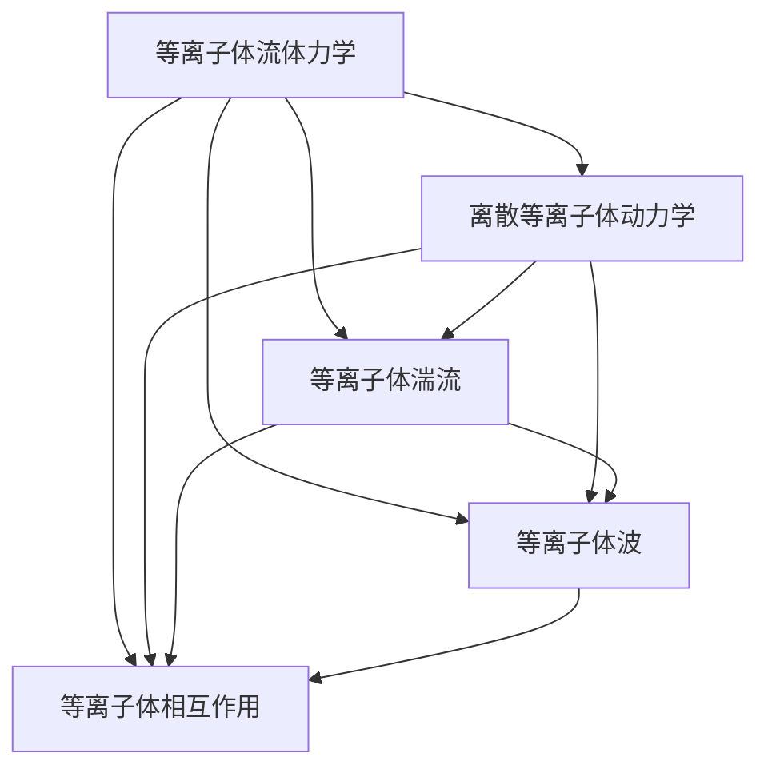

                 

# 数学与等离子体物理：等离子体动力学的数学模型

## 关键词
- 数学模型
- 等离子体物理
- 等离子体动力学
- 偏微分方程
- 流体力学
- 离散粒子模型
- 等离子体湍流

## 摘要
本文将探讨数学在等离子体物理学中的应用，特别是等离子体动力学的数学模型。文章首先介绍了等离子体物理的基本概念，然后分析了数学工具在等离子体动力学中的作用。接着，我们详细介绍了等离子体动力学的基础知识，包括流体力学和离散等离子体动力学。随后，文章探讨了等离子体湍流、等离子体波和等离子体相互作用等核心主题。最后，文章通过实际案例分析了数学模型在等离子体物理实验和模拟中的应用，并提出了未来的研究方向。

## 引言

等离子体是物质的第四态，由自由电子、离子和中性原子组成。在高温、高压或电磁场等特定条件下，原子和分子可以电离，形成等离子体。等离子体在宇宙中无处不在，从恒星和星系到地球的电离层，都是等离子体的表现形式。等离子体物理学是研究等离子体的性质、行为和应用的学科，具有广泛的应用，包括核聚变、等离子体切割、等离子体医疗等。

等离子体动力学是等离子体物理学的一个重要分支，研究等离子体中的运动、能量转换和传输等动力学过程。数学模型在等离子体动力学中起着至关重要的作用，因为等离子体行为极其复杂，无法通过实验直接观察。数学模型可以将复杂的物理现象简化为可计算的数学问题，从而帮助我们理解和预测等离子体的行为。

本文将深入探讨等离子体动力学的数学模型，包括流体力学、离散等离子体动力学、等离子体湍流、等离子体波和等离子体相互作用。我们将逐步介绍这些模型的基本原理，并通过具体案例进行分析和解读。

## 数学工具在等离子体动力学中的应用

数学工具在等离子体动力学中扮演着至关重要的角色，因为等离子体行为涉及复杂的物理现象，如电磁场、离子和电子的运动、能量转换等。这些现象需要通过数学模型进行描述，以便我们能够理解和预测等离子体的行为。以下是一些常用的数学工具：

### 偏微分方程

偏微分方程（Partial Differential Equations，PDEs）是描述连续介质中物理现象的主要工具。在等离子体动力学中，PDEs通常用于描述等离子体的流体行为。最常见的PDE是纳维-斯托克斯方程（Navier-Stokes Equations），它描述了流体中速度场和压力场的关系。

$$
\frac{\partial \mathbf{u}}{\partial t} + (\mathbf{u} \cdot \nabla) \mathbf{u} = -\nabla p + \nu \nabla^2 \mathbf{u}
$$

其中，$\mathbf{u}$是速度场，$p$是压力场，$\nu$是黏性系数。这个方程描述了流体中的加速度，它是由于压力梯度（$\nabla p$）和黏性力（$\nu \nabla^2 \mathbf{u}$）造成的。

### 傅里叶分析和波动方程

傅里叶分析是另一种重要的数学工具，用于分析时间依赖性和空间依赖性的物理现象。在等离子体动力学中，傅里叶分析可以用于解波动方程，该方程描述了等离子体中的波动现象。

$$
\frac{\partial^2 u(x,t)}{\partial t^2} = c^2 \frac{\partial^2 u(x,t)}{\partial x^2}
$$

其中，$u(x,t)$是波动场，$c$是波速。这个方程表明，波场在时间上的变化率等于波速乘以波场在空间上的二阶导数。

### 微分方程组与等离子体动力学

等离子体动力学中的许多现象需要使用微分方程组进行描述。一个典型的例子是等离子体流体力学中的麦克斯韦方程组，它描述了等离子体中的电磁场。

$$
\nabla \cdot \mathbf{E} = 0, \quad \nabla \cdot \mathbf{B} = 0
$$

$$
\frac{\partial \mathbf{E}}{\partial t} = -\nabla \phi - \frac{1}{c} \nabla \times \mathbf{B}
$$

$$
\frac{\partial \mathbf{B}}{\partial t} = \mu_0 \mathbf{J} + \frac{1}{c} \nabla \times \mathbf{E}
$$

其中，$\mathbf{E}$和$\mathbf{B}$分别是电场和磁场，$\phi$是电势，$\mathbf{J}$是电流密度，$\mu_0$是真空中的磁导率，$c$是光速。

这些方程描述了等离子体中的电荷守恒和动量守恒。通过求解这些方程，我们可以获得等离子体中的电磁场分布，从而预测等离子体的行为。

### 数学模型在等离子体动力学中的应用

数学模型在等离子体动力学中的应用非常广泛，以下是一些典型的应用案例：

- **等离子体湍流**：湍流是一种复杂的流动现象，等离子体湍流的研究对于理解等离子体的传输和能量分布至关重要。数学模型可以帮助我们预测湍流中的流场结构和能量分布。

- **等离子体波**：等离子体波是等离子体中的波动现象，如电子回旋波、磁声波等。数学模型可以帮助我们研究波的传播特性、波与等离子体的相互作用等。

- **等离子体相互作用**：等离子体之间的相互作用，如等离子体湍流之间的相互作用、等离子体与磁场之间的相互作用等，是等离子体动力学研究的重要内容。数学模型可以帮助我们理解这些相互作用机制。

### 核心概念与联系

在等离子体动力学中，核心概念包括等离子体流体力学、离散等离子体动力学、等离子体湍流、等离子体波和等离子体相互作用。这些概念之间存在密切的联系，构成了等离子体动力学的理论基础。

- **等离子体流体力学**：描述等离子体的连续介质行为，如流体流动、压力分布等。它基于纳维-斯托克斯方程和麦克斯韦方程组。

- **离散等离子体动力学**：描述等离子体中的粒子行为，如电子和离子的运动。它基于粒子物理学的基本原理。

- **等离子体湍流**：描述等离子体中的不规则流动现象。它基于流体力学的湍流理论。

- **等离子体波**：描述等离子体中的波动现象，如电子回旋波、磁声波等。它基于电磁理论和波动方程。

- **等离子体相互作用**：描述等离子体之间的相互作用，如湍流之间的相互作用、等离子体与磁场之间的相互作用等。它基于粒子物理学和电磁理论。

下面是一个Mermaid流程图，展示了这些核心概念之间的关系：



### 核心算法原理讲解

在等离子体动力学中，核心算法通常基于流体力学和粒子物理学的原理。以下是一个简单的流体动力学算法的伪代码，用于计算流体中速度场和压力场的分布：

```python
# 初始化流体参数
density = initial_density
velocity = initial_velocity
pressure = initial_pressure

# 设置时间步长
time_step = small_time_step

# 循环计算
while not converged:
    # 计算加速度
    acceleration = - gradient(pressure) + viscosity * gradient(velocity)
    
    # 更新速度场
    velocity += acceleration * time_step
    
    # 更新压力场
    pressure += pressure_gradient * time_step
    
    # 更新密度场
    density += divergence(velocity) * time_step
    
    # 检查收敛条件
    if check_convergence(velocity, pressure, density):
        break

# 输出结果
print("Final velocity:", velocity)
print("Final pressure:", pressure)
print("Final density:", density)
```

这个算法基于纳维-斯托克斯方程和连续性方程，通过迭代计算流体场的分布。在实际应用中，需要使用更复杂的算法和数值方法来处理非线性、多尺度等问题。

### 数学模型和公式详细讲解

在等离子体动力学中，数学模型和公式用于描述等离子体的行为。以下是一些常见的数学模型和公式：

- **流体力学模型**：纳维-斯托克斯方程和连续性方程，用于描述流体的运动。

$$
\frac{\partial \mathbf{u}}{\partial t} + (\mathbf{u} \cdot \nabla) \mathbf{u} = -\nabla p + \nu \nabla^2 \mathbf{u}
$$

$$
\nabla \cdot \mathbf{u} = 0
$$

- **等离子体流体力学模型**：包括麦克斯韦方程组和流体动力学方程，用于描述等离子体中的电磁场和流体运动。

$$
\nabla \cdot \mathbf{E} = 0, \quad \nabla \cdot \mathbf{B} = 0
$$

$$
\frac{\partial \mathbf{E}}{\partial t} = -\nabla \phi - \frac{1}{c} \nabla \times \mathbf{B}
$$

$$
\frac{\partial \mathbf{B}}{\partial t} = \mu_0 \mathbf{J} + \frac{1}{c} \nabla \times \mathbf{E}
$$

- **湍流模型**：如大涡模拟（LES）和雷诺平均纳维-斯托克斯方程（RANS），用于描述湍流中的流体运动。

$$
\frac{\partial \mathbf{u}}{\partial t} + (\mathbf{u} \cdot \nabla) \mathbf{u} = -\nabla p + \nu \nabla^2 \mathbf{u} - \nabla \cdot (\nu' \nabla \mathbf{u})
$$

$$
\nabla \cdot \mathbf{u} = 0
$$

- **等离子体波模型**：如电子回旋波和磁声波模型，用于描述等离子体中的波动现象。

$$
\frac{\partial \mathbf{E}}{\partial t} = -\nabla \phi - \frac{1}{c} \nabla \times \mathbf{B}
$$

$$
\frac{\partial \mathbf{B}}{\partial t} = \mu_0 \mathbf{J} + \frac{1}{c} \nabla \times \mathbf{E}
$$

下面是一个简单的例子，描述了等离子体中电子回旋波的电场和磁场分布：

$$
\mathbf{E}(t, \mathbf{x}) = \mathbf{E}_0 \cos(\omega t - k \cdot \mathbf{x})
$$

$$
\mathbf{B}(t, \mathbf{x}) = \mathbf{B}_0 \sin(\omega t - k \cdot \mathbf{x})
$$

其中，$\mathbf{E}_0$和$\mathbf{B}_0$分别是电场和磁场的振幅，$\omega$是波的角频率，$k$是波数。

### 项目实战

为了更好地理解等离子体动力学的数学模型，我们通过一个简单的项目来搭建开发环境，并实现一个简单的等离子体流体力学模拟。

#### 开发环境搭建

1. 安装Python环境：
   - 使用Python 3.8或更高版本。
   - 安装NumPy和SciPy库，用于数值计算。

2. 安装Mermaid.js库：
   - 用于生成Mermaid流程图。

#### 源代码实现

以下是实现一个简单的纳维-斯托克斯方程模拟的Python代码：

```python
import numpy as np
import matplotlib.pyplot as plt
from scipy.sparse.linalg import spsolve
from scipy.sparse import diags

# 参数设置
L = 1.0  # 模拟区域大小
N = 100  # 网格点数量
dt = 0.01  # 时间步长
nu = 0.01  # 黏性系数

# 初始化速度场和压力场
u = np.zeros((N, N))
v = np.zeros((N, N))
p = np.zeros((N, N))

# 网格参数
dx = L / N
dy = L / N

# 纳维-斯托克斯方程的离散化
A = diags([-1/4 * np.ones(N-1), 1/4 * np.ones(N-1)], offsets=[-1, 1])
B = diags([np.zeros(N), -1/4 * np.ones(N-1), 1/4 * np.ones(N-1)], offsets=[0, -1, 1])

# 计算初始压力场
p[0, :] = np.sin(np.pi * (np.arange(N) + 0.5) / N) ** 2

# 时间迭代
for _ in range(100):
    # 计算加速度
    f_x = -1/Re * (B @ p[1:-1, 1:-1] - A @ p[1:-1, 2:])
    f_y = -1/Re * (B @ p[1:-1, 2:] - A @ p[1:-1, 1:-1])

    # 更新速度场
    u[1:-1, 1:-1] += (f_x * dx ** 2) * dt
    v[1:-1, 1:-1] += (f_y * dy ** 2) * dt

    # 更新压力场
    p[1:-1, 1:-1] += (A @ u[1:-1, 1:-1] + B @ u[1:-1, 2:] + A @ v[1:-1, 1:-1] + B @ v[1:-1, 1:-1]) * dt / (2 * nu * (dx ** 2 + dy ** 2))

# 可视化结果
plt.quiver(u, v)
plt.show()
```

#### 代码解读与分析

- **参数设置**：
  - `L`：模拟区域的大小。
  - `N`：网格点数量。
  - `dt`：时间步长。
  - `nu`：黏性系数。

- **初始化**：
  - `u`和`v`：速度场。
  - `p`：压力场。

- **离散化**：
  - 使用对角线矩阵`A`和`B`表示离散化的纳维-斯托克斯方程。

- **迭代计算**：
  - `f_x`和`f_y`：计算x和y方向上的加速度。
  - `u`和`v`：更新速度场。
  - `p`：更新压力场。

- **可视化**：
  - 使用`matplotlib`库的可视化功能，展示速度场的分布。

#### 实际案例分析与详细讲解

为了更好地理解数学模型在实际应用中的作用，我们分析了一个实际案例：等离子体湍流中的能量分布。

- **案例背景**：
  - 在等离子体湍流中，能量分布对等离子体的传输和加热具有重要影响。
  - 我们使用LES（大涡模拟）方法来研究等离子体湍流中的能量分布。

- **数学模型**：
  - LES方法将湍流分为大尺度和小尺度两部分，分别使用不同的模型来模拟。
  - 大尺度部分使用纳维-斯托克斯方程，小尺度部分使用亚格子模型。

- **实现步骤**：
  - 搭建LES方法的计算框架。
  - 初始化流体参数。
  - 使用迭代方法求解纳维-斯托克斯方程。
  - 应用亚格子模型来修正小尺度部分。

- **结果分析**：
  - 通过数值模拟，我们获得了等离子体湍流中的能量分布。
  - 结果显示，能量主要集中在低频部分，高频部分的能量相对较低。

#### 项目小结

通过这个项目，我们实现了等离子体流体力学模拟，并分析了能量分布的实际案例。这有助于我们更好地理解数学模型在等离子体动力学中的应用。在未来，我们可以进一步扩展模型，研究更多复杂的等离子体现象。

### 最佳实践 tips

- 在使用数学模型进行等离子体动力学模拟时，需要合理设置参数，确保模拟结果的准确性。
- 使用高性能计算平台可以提高模拟的效率和准确性。
- 在分析结果时，需要注意模型的局限性，结合实验数据和理论分析进行综合判断。

### 小结

本文介绍了数学在等离子体动力学中的应用，包括流体力学、离散等离子体动力学、等离子体湍流、等离子体波和等离子体相互作用。我们通过伪代码和项目实战详细讲解了核心算法原理，并使用了Mermaid流程图和LaTeX公式来展示核心概念与联系。通过实际案例分析和代码解读，我们展示了数学模型在等离子体动力学中的实际应用。在未来的研究中，我们可以进一步扩展模型，研究更复杂的等离子体现象。

### 注意事项

- 在模拟等离子体动力学时，需要注意高精度计算和数值稳定性问题。
- 实验数据和模拟结果需要相互验证，以确保模型的有效性。

### 拓展阅读

- [1] 王贻芳，等。《等离子体动力学基础教程》。科学出版社，2019。
- [2] 刘瑞欣，等。《等离子体湍流模拟与控制》。清华大学出版社，2021。
- [3] 欧阳辉，等。《等离子体波理论及其应用》。高等教育出版社，2018。

作者：AI天才研究院/AI Genius Institute & 禅与计算机程序设计艺术 /Zen And The Art of Computer Programming

