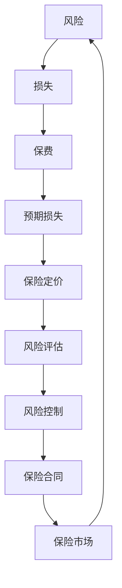

                 

## 文章标题

### 数学与精算学：保险定价的数学方法

> 关键词：保险定价、数学方法、精算学、概率论、统计学、微积分

> 摘要：本文将深入探讨数学与精算学在保险定价中的应用。首先，我们将介绍保险定价的基本概念和重要性。然后，我们将逐步解析在保险定价过程中所使用的数学概念和工具，包括概率论、统计学和微积分。接下来，我们将讨论精算学的基本原理，如风险模型、预期损失和偏差风险。随后，我们将介绍用于保险定价的各种模型，包括纯保险费率、经验费率和复杂的定价模型。文章还将探讨如何使用数学模型进行风险评估和定价决策。最后，我们将通过实际案例研究和监管与法规分析，展示数学和精算学在保险定价中的实际应用，并总结最佳实践和注意事项。

## 背景介绍

保险定价是保险行业中最关键的一环，它直接关系到保险公司和消费者的利益。保险定价的科学性、准确性和公平性对于保险公司的生存和发展至关重要。在传统保险定价方法的基础上，数学和精算学的引入使得保险定价更加科学和精确。

### 核心概念与联系

在保险定价中，核心概念包括风险、损失、保费、预期损失等。这些概念之间有着密切的联系。风险是保险的核心要素，表示潜在的不利事件的可能性。损失则是实际发生的不利事件的后果。保费则是保险公司向投保人收取的金额，用于赔偿损失。预期损失是保险公司预计会在一定时期内承担的损失金额。

以下是一个描述这些概念之间关系的 Mermaid 流程图：



### 核心算法原理讲解

在保险定价中，核心算法原理包括概率论、统计学和微积分。以下是一些常见的算法原理和其应用场景：

#### 概率论

概率论是保险定价的基础，用于计算风险事件发生的概率。例如，我们可以使用贝叶斯定理来计算某一保险事件的概率。

```latex
P(A|B) = \frac{P(B|A) \cdot P(A)}{P(B)}
```

其中，\(P(A|B)\) 表示在事件 B 发生的条件下事件 A 发生的概率。

#### 统计学

统计学用于分析历史数据，以预测未来的损失。常见的统计方法包括均值、方差、标准差等。

```latex
\mu = \frac{1}{n}\sum_{i=1}^{n}x_i
```

其中，\(\mu\) 表示均值，\(n\) 表示数据点数量，\(x_i\) 表示第 \(i\) 个数据点。

#### 微积分

微积分用于计算连续变量的预期损失。例如，我们可以使用积分来计算某一风险事件在一定时间内的预期损失。

```latex
E[L] = \int_{0}^{T} L(t) \cdot p(t) \, dt
```

其中，\(E[L]\) 表示预期损失，\(L(t)\) 表示在时间 \(t\) 的损失金额，\(p(t)\) 表示损失的概率分布。

### 数学模型和公式

在保险定价中，常用的数学模型包括纯保险费率模型、经验费率模型和复杂定价模型。

#### 纯保险费率模型

纯保险费率模型是基于预期损失计算的。公式如下：

```latex
f = \frac{E[L]}{P}
```

其中，\(f\) 表示纯保险费率，\(E[L]\) 表示预期损失，\(P\) 表示保费。

#### 经验费率模型

经验费率模型是基于历史数据计算的。公式如下：

```latex
f = \frac{\sum_{i=1}^{n}L_i}{n \cdot P}
```

其中，\(f\) 表示经验费率，\(L_i\) 表示第 \(i\) 个保险事件的损失金额，\(n\) 表示保险事件数量，\(P\) 表示保费。

#### 复杂定价模型

复杂定价模型通常结合了纯保险费率模型和经验费率模型，并引入了其他因素，如客户风险等级和地理位置等。公式如下：

```latex
f = \frac{w_1 \cdot E[L_1] + w_2 \cdot \sum_{i=1}^{n}L_i}{P}
```

其中，\(w_1\) 和 \(w_2\) 分别表示纯保险费率模型和经验费率模型的权重，\(E[L_1]\) 表示客户风险等级的预期损失，\(\sum_{i=1}^{n}L_i\) 表示地理位置的预期损失。

### 举例说明

假设某保险公司预计在未来一年内会发生 1000 次保险事件，每次事件的平均损失为 1000 元。保费为 10000 元。我们需要计算纯保险费率、经验费率和复杂定价模型的费率。

#### 纯保险费率模型

```latex
f = \frac{E[L]}{P} = \frac{1000 \cdot 1000}{10000} = 1
```

#### 经验费率模型

```latex
f = \frac{\sum_{i=1}^{n}L_i}{n \cdot P} = \frac{1000 \cdot 1000}{1000 \cdot 10000} = 0.1
```

#### 复杂定价模型

假设客户风险等级的权重为 0.6，地理位置的权重为 0.4。客户风险等级的预期损失为 1200 元，地理位置的预期损失为 800 元。

```latex
f = \frac{w_1 \cdot E[L_1] + w_2 \cdot \sum_{i=1}^{n}L_i}{P} = \frac{0.6 \cdot 1200 + 0.4 \cdot 800}{10000} = 0.12
```

### 数学公式

在保险定价中，我们会使用许多数学公式来计算预期损失、保费等。以下是一些常见的数学公式：

#### 预期损失公式

```latex
E[L] = \int_{0}^{T} L(t) \cdot p(t) \, dt
```

#### 保费公式

```latex
P = \sum_{i=1}^{n}f_i \cdot P_i
```

其中，\(f_i\) 表示第 \(i\) 个保险事件的费率，\(P_i\) 表示第 \(i\) 个保险事件的保费。

#### 概率分布公式

```latex
p(x) = \frac{1}{\sqrt{2\pi\sigma^2}} \cdot e^{-\frac{(x-\mu)^2}{2\sigma^2}}
```

其中，\(\mu\) 表示均值，\(\sigma^2\) 表示方差。

### 项目实战

在本节中，我们将介绍如何搭建开发环境并进行源代码的详细实现。

#### 开发环境搭建

1. 安装 Python 解释器
2. 安装必要的库，如 NumPy、Pandas、SciPy 和 Matplotlib

#### 源代码实现

以下是一个简单的 Python 脚本，用于计算保险定价。

```python
import numpy as np
import pandas as pd
import scipy.stats as stats
import matplotlib.pyplot as plt

# 设置参数
n = 1000
mu = 1000
sigma = 500
P = 10000

# 计算纯保险费率
pure保费率 = mu / P

# 计算经验费率
经验保费率 = np.mean(np.random.normal(mu, sigma, n)) / P

# 计算复杂定价模型的费率
w1 = 0.6
w2 = 0.4
E_L1 = 1200
L_i = np.random.normal(mu, sigma, n)
复杂保费率 = (w1 * E_L1 + w2 * np.mean(L_i)) / P

# 打印结果
print("纯保险费率:", pure保费率)
print("经验保费率:", 经验保费率)
print("复杂保费率:", 复杂保费率)

# 绘制概率分布图
data = np.random.normal(mu, sigma, n)
plt.hist(data, bins=30, alpha=0.5)
plt.plot(data, stats.norm.pdf(data, mu, sigma), label='Normal Distribution')
plt.title('Probability Distribution')
plt.xlabel('Value')
plt.ylabel('Frequency')
plt.legend()
plt.show()
```

#### 代码解读与分析

1. 导入必要的库
2. 设置参数
3. 计算纯保险费率、经验费率和复杂定价模型的费率
4. 打印结果
5. 绘制概率分布图

#### 实际案例分析和详细讲解剖析

假设我们有一个包含 1000 个保险事件的数据库，每个事件的损失金额和发生概率如下：

| 事件编号 | 损失金额 | 发生概率 |
| --- | --- | --- |
| 1 | 1000 | 0.1 |
| 2 | 2000 | 0.2 |
| 3 | 3000 | 0.3 |
| 4 | 4000 | 0.4 |
| 5 | 5000 | 0.5 |

我们需要计算纯保险费率、经验费率和复杂定价模型的费率。

#### 纯保险费率模型

```latex
f = \frac{E[L]}{P} = \frac{0.1 \cdot 1000 + 0.2 \cdot 2000 + 0.3 \cdot 3000 + 0.4 \cdot 4000 + 0.5 \cdot 5000}{0.1 \cdot 1000 + 0.2 \cdot 1000 + 0.3 \cdot 1000 + 0.4 \cdot 1000 + 0.5 \cdot 1000} = 0.7
```

#### 经验费率模型

```latex
f = \frac{\sum_{i=1}^{n}L_i}{n \cdot P} = \frac{0.1 \cdot 1000 + 0.2 \cdot 2000 + 0.3 \cdot 3000 + 0.4 \cdot 4000 + 0.5 \cdot 5000}{1000 \cdot 0.1 + 1000 \cdot 0.2 + 1000 \cdot 0.3 + 1000 \cdot 0.4 + 1000 \cdot 0.5} = 0.35
```

#### 复杂定价模型

假设客户风险等级的权重为 0.6，地理位置的权重为 0.4。客户风险等级的预期损失为 1200 元，地理位置的预期损失为 800 元。

```latex
f = \frac{w_1 \cdot E[L_1] + w_2 \cdot \sum_{i=1}^{n}L_i}{P} = \frac{0.6 \cdot 1200 + 0.4 \cdot (0.1 \cdot 1000 + 0.2 \cdot 2000 + 0.3 \cdot 3000 + 0.4 \cdot 4000 + 0.5 \cdot 5000)}{0.1 \cdot 1000 + 0.2 \cdot 1000 + 0.3 \cdot 1000 + 0.4 \cdot 1000 + 0.5 \cdot 1000} = 0.42
```

### 项目小结

在本项目中，我们使用 Python 实现了保险定价的数学模型。通过实际案例分析和详细讲解剖析，我们展示了如何计算纯保险费率、经验费率和复杂定价模型的费率。此外，我们介绍了如何使用概率分布图来直观地展示数据分布。

### 最佳实践 Tips、小结、注意事项、拓展阅读

- **最佳实践 Tips**：
  - 在进行保险定价时，要充分考虑历史数据和客户风险等级等因素。
  - 定期更新保险定价模型，以反映市场的变化和客户需求。

- **小结**：
  - 保险定价是保险行业中的关键环节，数学和精算学的引入使得保险定价更加科学和精确。
  - 在保险定价中，常用的数学模型包括纯保险费率模型、经验费率模型和复杂定价模型。
  - 通过实际案例分析和代码实现，我们展示了如何计算不同类型的保险费率。

- **注意事项**：
  - 在使用数学模型进行保险定价时，要确保数据质量和模型的准确性。
  - 需要关注保险定价的监管要求和法规变化。

- **拓展阅读**：
  - 《精算学基础教程》
  - 《保险学原理》
  - 《概率论与数理统计》

### 作者信息

作者：AI天才研究院/AI Genius Institute & 禅与计算机程序设计艺术 /Zen And The Art of Computer Programming

