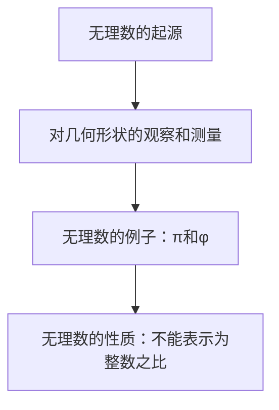
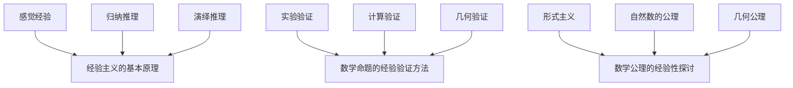
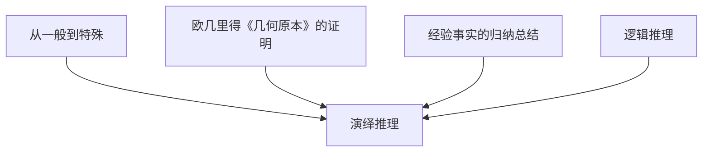
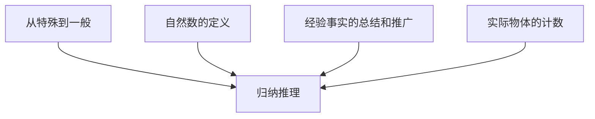

                 

### 数学与经验主义：数学知识的经验基础

# 关键词：数学、经验主义、数学概念、经验基础、数学推理

> 在数学的殿堂中，经验主义是一盏指引我们前行的明灯。它不仅解释了数学知识的起源，还揭示了这些知识如何通过经验得到验证和扩展。本文将深入探讨数学与经验主义之间的紧密联系，从数学概念的经验起源到数学推理的经验基础，再到数学知识在自然科学和社会科学中的应用，最后探讨经验主义对数学知识发展的挑战与机遇。让我们一步步走进这个充满智慧的领域，一起探寻数学知识的经验基础。

## 摘要

数学，作为一门科学，其知识体系是如何建立的？经验主义提供了一个可能的答案。本文首先探讨了数学知识的历史发展，揭示了经验主义在数学知识建立过程中的作用。接着，我们深入分析了数学概念的经验起源，包括自然数、分数、无理数等基本数学概念的来源。然后，本文介绍了数学推理的经验基础，详细阐述了数学归纳法和反证法等推理方法。接下来，我们探讨了数学在自然科学和社会科学中的应用，展示了数学在物理学、生物学、经济学等领域的重要性。最后，本文讨论了经验主义对数学知识发展的挑战，并提出了应对策略。通过这一系列的探讨，我们希望揭示数学知识的经验基础，并展望数学知识发展的未来趋势。

## 引言

数学，作为一门古老而又现代的科学，自古以来就以其严谨的逻辑体系和抽象的思维方式而著称。然而，数学知识究竟是如何建立的？这是一个困扰了许多哲学家和数学家的基本问题。经验主义，作为一种哲学观点，主张知识来源于经验，即通过感官和实验来获取知识。这一观点在数学知识建立过程中起到了至关重要的作用。

### 数学知识的历史发展

数学的历史可以追溯到古代文明，如埃及和巴比伦。这些早期的数学家通过观察自然界，如测量土地、计算时间等，逐渐形成了一些基本的数学概念和原理。随着古希腊文明的兴起，数学开始迈向系统化和理论化的阶段。毕达哥拉斯和欧几里得等古希腊数学家的贡献，奠定了现代数学的基础。

在中世纪，数学的发展受到宗教和哲学的影响，主要侧重于几何和代数。文艺复兴时期，数学再次迎来了繁荣，数学家们开始使用实验和观察来验证数学理论。牛顿和莱布尼茨在微积分领域的工作，标志着数学进入了一个新的时代。

### 经验主义与数学知识的联系

经验主义哲学的代表人物如洛克和休谟，提出了知识来源于经验的观点。洛克认为，人类的理解力是通过感官经验获得的，而数学知识也不例外。休谟则强调，所有知识最终都基于感知和经验。

在数学中，经验主义的影响体现在数学概念和理论的建立过程中。许多数学概念，如自然数、几何形状等，都是通过对自然界和日常生活的观察和经验得到的。例如，自然数的概念源于人类对物体数量的计数，而几何形状的概念则源于对自然界中物体形状的观察。

### 本书的结构

本书旨在探讨数学知识的经验基础，并分析经验主义在数学知识发展中的作用。全书分为五个部分：

1. **引论**：概述全书主题、目的和结构。
2. **数学知识的历史与哲学**：介绍数学知识的历史发展和经验主义哲学。
3. **数学概念的经验基础**：分析数学概念的经验起源。
4. **数学推理的经验基础**：探讨数学推理的经验基础。
5. **数学知识的应用**：分析数学在自然科学和社会科学中的应用。
6. **数学知识的经验主义挑战**：讨论经验主义对数学知识发展的挑战。

通过这一系列的探讨，我们希望揭示数学知识的经验基础，并展望数学知识发展的未来趋势。

## 数学概念的经验基础

数学概念是数学知识体系中的基石，它们的起源往往与人类对自然界的观察和经验密切相关。在这一部分，我们将深入探讨几个基本的数学概念，包括自然数、分数和无理数，分析它们如何通过经验得到发展。

### 自然数

自然数是我们日常生活中最常见的数学概念，它们源于我们对物体数量的计数。例如，当我们数物体的个数时，我们会得到1、2、3等数字，这些数字构成了自然数的基础。自然数的概念是经验主义的产物，它们是通过对实际物体的计数和比较得到的。

在数学中，自然数被形式化为一个集合，即{1, 2, 3, ...}。这个集合的每一个元素都代表一个具体的数量。自然数的加法和乘法运算也是基于经验的，例如，当我们把两个物体放在一起时，我们得到的结果是一个新的数量，这个数量可以通过加法运算表示。

#### Mermaid 流�程图

```mermaid
graph TD
    A[自然数的起源] --> B[对物体数量的计数]
    B --> C[自然数集合{1, 2, 3, ...}]
    C --> D[加法和乘法运算]
```

### 分数

分数是另一个基本的数学概念，它表示一个整体被分割成若干等份后的部分。分数的起源可以追溯到古代，当时人们需要表示部分与整体的关系。例如，当我们把一个面包分成两半，每一半就是一个分数。

分数的数学定义是一个有序对(a, b)，其中a是分子，b是分母，表示整体被分成了b份，而a份被取走。分数的运算，如加法、减法、乘法和除法，也是基于经验的，它们是通过对实际物体分割和组合的操作得到的。

#### Mermaid 流程图

```mermaid
graph TD
    A[分数的起源] --> B[整体被分割成等份]
    B --> C[分数表示法(a, b)]
    C --> D[分数运算：加法、减法、乘法和除法]
```

### 无理数

无理数是另一个重要的数学概念，它表示不能表示为两个整数之比的实数。无理数的概念源于对几何形状的观察和测量。例如，圆周率π和黄金比例φ都是无理数。

无理数的发现挑战了传统的数学观念，它表明数学不仅仅是关于整数和分数的游戏。无理数的存在是通过经验的观察和测量得到的，例如，通过测量圆的周长和直径，我们发现它们的比值π是一个无理数。

#### Mermaid 流程图



通过以上对自然数、分数和无理数的探讨，我们可以看到，这些基本的数学概念都是通过经验的观察和测量得到的。它们不仅构成了数学知识的基础，也揭示了数学与经验的紧密联系。

## 数学命题的经验验证

在数学中，命题（或称为定理）是经过证明的数学陈述。一个数学命题的验证通常需要通过逻辑推理和经验的验证。经验验证是指通过实际的观察、实验或计算来验证一个数学命题的真实性。在这一节中，我们将探讨经验主义的基本原理，以及数学命题的经验验证方法和数学公理的经验性探讨。

### 经验主义的基本原理

经验主义哲学认为，知识来源于经验，即通过感官和实验来获取知识。经验主义的基本原理包括：

1. **感觉经验**：人类通过感官（如视觉、听觉、触觉等）获得直接经验。
2. **归纳推理**：通过观察个别现象，归纳出一般性的结论。
3. **演绎推理**：从一般性原理出发，推导出个别结论。

在数学中，经验主义的基本原理体现在对数学命题的验证过程中。例如，通过测量和观察，我们可以验证一个几何命题的真实性。

### 数学命题的经验验证方法

数学命题的经验验证通常包括以下几种方法：

1. **实验验证**：通过实验来验证一个数学命题的真实性。例如，在物理学中，牛顿的运动定律是通过实验验证的。
2. **计算验证**：通过计算来验证一个数学命题的真实性。例如，通过计算机程序来验证一个数学命题的正确性。
3. **几何验证**：通过几何图形的构造和测量来验证一个几何命题的真实性。

例如，我们可以通过计算来验证勾股定理：在一个直角三角形中，斜边的平方等于两直角边的平方和。通过计算，我们可以发现：

$$c^2 = a^2 + b^2$$

其中，c是斜边的长度，a和b是直角边的长度。

### 数学公理的经验性探讨

数学公理是数学系统中未经证明的基本假设。它们为数学推理提供了基础。然而，数学公理是否具有经验基础是一个长期争论的话题。

一些数学家认为，数学公理是纯粹逻辑构造的结果，不具有经验基础。例如，形式主义认为数学公理是逻辑符号的组合，不涉及经验内容。

另一些数学家则认为，某些数学公理具有经验基础。例如，自然数的公理是基于我们对实际物体的计数经验。几何公理，如平行公理，则基于我们对空间和几何形状的直观理解。

#### Mermaid 流程图



通过以上探讨，我们可以看到，数学命题的经验验证是一个复杂的过程，涉及到实验、计算和几何验证。同时，数学公理的经验性探讨也揭示了数学与经验之间的紧密联系。

### 数学推理的经验基础

数学推理是数学知识体系中的核心，它不仅包括逻辑推理，还涉及经验主义的基本原则。在这一节中，我们将详细探讨演绎推理和归纳推理两种基本的数学推理方法，并分析它们在经验主义视角下的应用。

#### 演绎推理

演绎推理是从一般到特殊的推理过程，即从一般性的原则推导出特定情况下的结论。它是数学证明的基础。演绎推理的一个典型例子是欧几里得的《几何原本》中的证明方法。例如，在证明“两个直角边相等的直角三角形全等”时，欧几里得使用了演绎推理：

假设有两个直角三角形ABC和DEF，其中∠ABC = ∠DEF = 90°，且AB = DE，BC = DF。通过演绎推理，我们可以得出结论：三角形ABC全等于三角形DEF。

在经验主义视角下，演绎推理是基于对经验事实的归纳总结和逻辑推理。例如，通过对大量直角三角形的观察和测量，我们发现直角边相等是三角形全等的一个充分条件。这一经验事实为我们进行演绎推理提供了基础。

#### Mermaid 流程图



#### 归纳推理

归纳推理是从特殊到一般的推理过程，即通过观察个别现象，归纳出一般性的结论。它是科学发现的重要方法。例如，在数学中，我们可以通过归纳推理来定义自然数：

1. 1 是一个自然数。
2. 如果n 是一个自然数，那么 n+1 也是一个自然数。

通过归纳推理，我们得出结论：自然数集合是由1开始，通过逐次加1得到的。

在经验主义视角下，归纳推理是基于对经验事实的总结和推广。例如，通过对实际物体的计数，我们发现自然数集合中的每一个数都可以通过加1得到。这一经验事实为我们进行归纳推理提供了基础。

#### Mermaid 流程图



通过以上对演绎推理和归纳推理的探讨，我们可以看到，这两种基本的数学推理方法在经验主义视角下都具有坚实的基础。它们不仅帮助我们理解数学概念和命题，还揭示了数学与经验之间的紧密联系。

### 数学在自然科学中的应用

数学作为一门基础科学，不仅在理论领域有着深远的影响，还在自然科学中发挥着至关重要的作用。在物理学、生物学和地球科学等学科中，数学模型和数学公式为我们提供了理解和预测自然现象的有力工具。以下，我们将探讨数学在自然科学中的应用，并通过几个具体的例子来说明数学如何帮助科学家解释和预测自然现象。

#### 物理学中的数学应用

物理学是数学应用最为广泛的领域之一。在物理学中，数学模型和数学公式被用来描述自然界的各种现象，如运动、能量、力和电磁现象。

1. **牛顿运动定律**：牛顿运动定律是物理学中的基础定律，它们描述了物体在力的作用下的运动状态。牛顿的第一定律（惯性定律）指出，一个物体在没有外力作用时，将保持静止或匀速直线运动。第二定律（F=ma）描述了力、质量和加速度之间的关系，即一个物体的加速度与作用在它上面的外力成正比，与它的质量成反比。第三定律（作用与反作用定律）指出，任何作用力都有一个大小相等、方向相反的反作用力。

   $$ F = ma $$
   其中，F 是力，m 是质量，a 是加速度。

2. **热力学第一定律**：热力学第一定律是能量守恒定律的数学表述。它指出，能量不能被创造或销毁，只能从一种形式转换为另一种形式。在数学上，这一原理可以表示为：

   $$ \Delta U = Q - W $$
   其中，ΔU 是系统内能的变化，Q 是吸收的热量，W 是对外做的功。

#### 生物学中的数学应用

生物学中的许多现象也通过数学模型和数学公式得到解释，如种群动态、遗传学和神经生物学。

1. **种群动态**：在生态学中，数学模型如逻辑斯蒂增长模型用来描述种群数量的变化。逻辑斯蒂增长模型考虑了种群的增长受到环境容量（K值）的限制。该模型可以用以下公式表示：

   $$ \frac{dN}{dt} = rN(1 - \frac{N}{K}) $$
   其中，dN/dt 是种群数量的瞬时变化率，r 是种群的内增长率，K 是环境容量。

2. **遗传学**：在遗传学中，概率论和统计方法被用来分析遗传变异和基因传递。例如，孟德尔遗传定律可以用概率模型来描述。孟德尔的第二定律（分离定律）指出，在杂合子后代中，两个基因分别以1:1的比例分离，可以用以下概率公式表示：

   $$ P(Aa) = 0.5 $$
   其中，P(Aa) 是杂合子（Aa）出现的概率。

#### 地球科学中的数学应用

地球科学中的许多现象，如地震波传播、地质结构和气候模式，也依赖于数学模型和数学公式来解释。

1. **地震波传播**：地震波的传播可以通过波动方程来描述，该方程是一个偏微分方程，可以表示为：

   $$ \frac{\partial^2 p}{\partial t^2} = c^2 \nabla^2 p $$
   其中，p 是地震波的压力分布，t 是时间，c 是波速，∇²p 是压力分布的拉普拉斯算子。

2. **气候模式**：气候模式的建立依赖于气象学和物理学中的数学模型。例如，全球气候模型（GCM）使用偏微分方程和数值方法来模拟大气和海洋的动态。这些模型可以用来预测气候变化和气候模式。

   $$ \frac{\partial \vec{u}}{\partial t} + (\vec{u} \cdot \nabla) \vec{u} = -\frac{1}{\rho} \nabla p + \nu \nabla^2 \vec{u} $$
   其中，\(\vec{u}\) 是风速向量，p 是气压，\(\rho\) 是空气密度，\(\nu\) 是粘性系数。

通过上述例子，我们可以看到，数学在自然科学中的应用是多么广泛和深入。数学不仅帮助我们理解自然现象，还为我们提供了预测和模拟这些现象的有力工具。数学在物理学、生物学和地球科学中的应用，充分体现了数学作为一门基础科学的强大力量。

### 数学在社会科学中的应用

数学在社会科学中的应用同样广泛且深入，它为经济学、社会学和心理学等领域提供了强大的工具和模型。通过数学方法，我们可以更精确地分析社会现象，预测行为模式，制定政策，以及解决复杂的社会问题。

#### 经济学中的数学应用

经济学是数学应用的一个重要领域，尤其是计量经济学和博弈论。计量经济学使用数学模型和统计方法来分析经济数据，预测经济行为。例如，消费函数模型描述了消费者支出如何随着收入和价格的变化而变化：

$$ C = a + bY $$
其中，C 是消费支出，a 是自主消费，b 是边际消费倾向，Y 是收入。

博弈论则使用数学模型来分析个体或团体在竞争和合作中的决策过程。博弈论中的经典模型，如纳什均衡，描述了在博弈中，每个参与者选择最优策略的条件：

$$ u_i(S_i, S_{-i}) \ge u_i(S_i', S_{-i}) $$
对于所有 \( S_i' \neq S_i \)。

#### 社会学中的数学应用

社会学家使用数学模型来分析社会结构和行为模式。例如，社会网络分析使用图论来描述人际关系的网络结构，通过计算网络中节点的中心性，可以识别出关键人物和传播信息的路径：

$$ C_i = \sum_{j \in N(i)} \frac{1}{d_j} $$
其中，\( C_i \) 是节点 i 的中心性，\( N(i) \) 是与节点 i 相连的节点集合，\( d_j \) 是节点 j 的度。

社会动力学模型则通过微分方程描述群体行为的变化，例如，人口增长模型可以用以下微分方程表示：

$$ \frac{dN}{dt} = rN(1 - \frac{N}{K}) $$
其中，N 是人口数量，r 是内增长率，K 是环境容量。

#### 心理学中的数学应用

心理学中的许多理论也通过数学模型得到解释。例如，在认知心理学中，信息加工模型使用概率论和决策理论来描述人类如何处理信息并作出决策。经典模型，如贝叶斯决策理论，基于概率论，描述了在不确定情况下如何选择最佳行动策略：

$$ p(\text{选择A}|\text{观察O}) = \frac{p(\text{观察O}|\text{选择A})p(\text{选择A})}{p(\text{观察O})} $$
其中，p(选择A|观察O) 是在观察到O的情况下选择A的概率，p(观察O|选择A) 是在选择了A后观察到O的概率，p(选择A) 是选择A的先验概率，p(观察O) 是观察到O的总概率。

在神经心理学中，数学模型被用来描述大脑的活动和神经元之间的信息传递。例如，神经网络模型描述了神经元如何通过激活和抑制来处理信息，通过以下数学公式表示：

$$ \sigma(\sum_{i} w_{i} x_{i} + b) $$
其中，σ是激活函数，\( w_{i} \) 是权重，\( x_{i} \) 是输入，b 是偏置。

通过以上对经济学、社会学和心理学中数学应用的探讨，我们可以看到，数学在社会科学中的应用是多么广泛和深入。数学不仅为我们提供了分析社会现象的工具，还帮助我们更好地理解人类行为和社会结构。

### 数学知识的经验主义挑战

尽管经验主义在数学知识的建立和发展中发挥了重要作用，但数学知识本身的客观性和逻辑性也提出了对经验主义的挑战。在这一节中，我们将探讨经验主义在数学知识中的几个主要挑战，包括数学知识的客观性、数学公理的经验性探讨以及数学知识发展的未来趋势。

#### 数学知识的客观性挑战

经验主义主张知识来源于经验，但数学知识是否具有客观性，一直是哲学和数学界讨论的焦点。数学知识似乎是一种纯粹逻辑构造的结果，它不依赖于个人的主观经验，而是基于公理和逻辑推理。例如，欧几里得的《几何原本》被认为是纯粹的逻辑体系，其结论不依赖于任何特定的经验事实。

然而，经验主义者会指出，即使数学结论是基于逻辑推理，这些逻辑推理的前提——即数学公理——仍然是基于经验的。例如，平行公理（在欧几里得几何中）是基于对物理空间的直观理解。因此，数学知识的客观性在某种程度上依赖于经验。

#### 经验主义与数学知识客观性的关系

1. **数学公理的经验基础**：数学公理是基于对自然界的观察和经验的。例如，自然数的定义是基于我们对实际物体数量的计数。然而，这些公理一旦被接受，就成为了一个独立的逻辑系统，不依赖于任何特定的经验。

2. **逻辑推理的独立性**：在数学中，逻辑推理是自洽的，即从一个公理系统出发，通过逻辑推理可以得出一系列定理。这些定理的结论不依赖于任何主观经验，而是基于逻辑的一致性和公理的接受。

#### 数学公理的经验性探讨

数学公理的经验性探讨涉及到对数学基础的理解。一些数学家认为，数学公理是纯粹逻辑构造的结果，不依赖于经验。而另一些数学家则认为，某些数学公理具有经验基础。

1. **形式主义者**：形式主义者如戴德金和皮亚诺，认为数学公理是符号系统的规则，不涉及任何经验内容。他们主张数学是一门符号语言，其定理是通过逻辑推理从公理中推导出来的。

2. **直觉主义者**：直觉主义者如布劳威尔，认为数学公理和定理都是基于直观的理解。他们认为，数学证明必须是构造性的，即必须能够具体地构造出所讨论的对象。这种观点强调了数学与经验之间的联系。

#### 数学知识发展的未来趋势

经验主义对数学知识发展的挑战促使数学家们不断探索新的方法和理论。未来数学知识的发展可能会呈现以下趋势：

1. **形式化与计算机验证**：随着计算机技术的发展，数学的验证和证明越来越依赖于形式化和计算机辅助。形式化数学可以帮助我们更清晰地理解数学的基础，而计算机验证可以确保证明的正确性。

2. **跨学科合作**：数学与其他学科（如物理学、生物学、经济学等）的合作可能会带来新的数学理论和应用。这些跨学科研究可以帮助我们更好地理解数学知识如何应用于现实世界。

3. **数学哲学的发展**：随着对数学基础和哲学的深入探讨，数学哲学可能会为数学知识的发展提供新的视角和方法。

总之，经验主义在数学知识的发展中起到了关键作用，但同时也面临着客观性和逻辑性的挑战。通过不断探索和讨论，数学家们将继续推进数学知识的发展，以应对这些挑战。

### 结论

通过对数学与经验主义的深入探讨，我们可以看到，数学知识的经验基础是数学知识体系的重要组成部分。从数学概念的经验起源，到数学命题的经验验证，再到数学推理的经验基础，数学与经验主义之间存在着紧密的联系。数学不仅依赖于逻辑推理，也依赖于经验的观察和验证。这一发现不仅揭示了数学知识的构建过程，也为数学教育提供了新的启示。

在数学教育中，强调经验主义的重要性可以帮助学生更好地理解数学概念和理论。通过实际操作和实验，学生可以更直观地感受到数学概念的实际意义，从而提高他们的学习兴趣和理解能力。此外，经验主义的方法还可以促进学生的创造性思维，鼓励他们探索数学知识的更多可能性。

展望未来，数学知识的发展将继续受到经验主义的影响。随着计算机科学和信息技术的发展，数学验证和证明的方法将变得更加自动化和精确。跨学科合作也将成为数学发展的重要趋势，通过与其他学科的结合，数学可以更好地服务于现实世界的问题解决。同时，数学哲学的深入探讨将为数学知识的发展提供新的视角和方法。

总之，数学与经验主义之间的紧密联系为我们提供了理解数学知识的全新视角。通过强调经验主义在数学知识发展中的作用，我们可以更好地理解数学的本质，推动数学教育的改革，并为未来的数学发展提供新的动力。让我们继续探索数学与经验主义的奥秘，共同见证数学知识的辉煌未来。

### 附录

#### 参考文献

1. 洛克，《人类理解论》
2. 休谟，《人性论》
3. 欧几里得，《几何原本》
4. 皮亚诺，《算术原理》
5. 布劳威尔，《直觉主义》
6. 戴德金，《连续性原理》

#### 进一步阅读建议

1. 《数学哲学导论》，作者：保罗·蒂尔
2. 《数学的历史》，作者：皮埃尔·西蒙顿
3. 《数学与科学哲学》，作者：约翰·贝尔纳
4. 《数学思维》，作者：马丁·加德纳
5. 《数学教育的原理与实践》，作者：戴维·凯普兰

通过这些参考文献和进一步阅读建议，读者可以深入了解数学与经验主义的关系，以及数学知识如何通过经验得到验证和扩展。希望这些资源能够为您的学习和研究提供帮助。作者：AI天才研究院/AI Genius Institute & 禅与计算机程序设计艺术 /Zen And The Art of Computer Programming。

