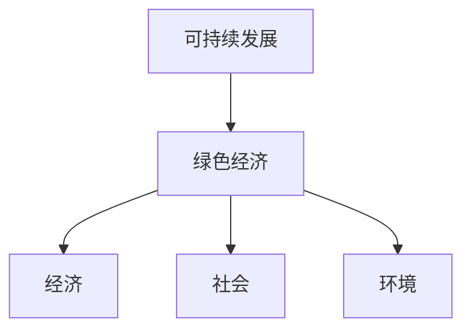
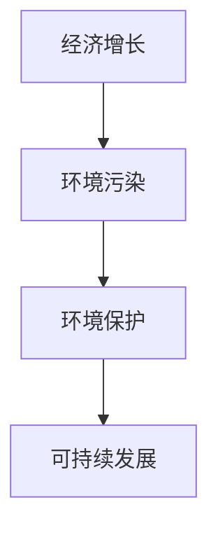
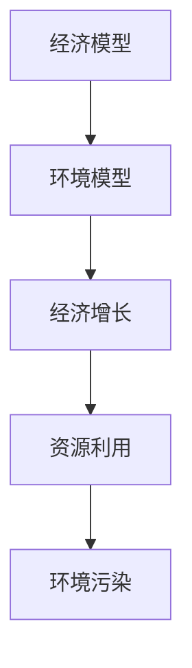
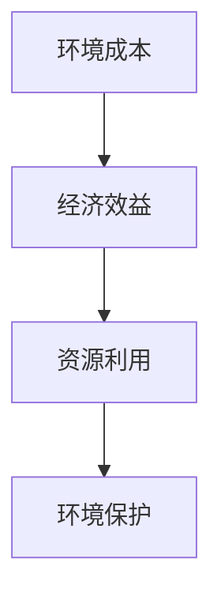

                 

### 文章标题

《数学与绿色经济：环保经济的数学评估》

### 关键词

绿色经济，数学模型，环保评估，可持续发展，生态经济学

### 摘要

本文深入探讨了数学在绿色经济评估中的应用，通过数学模型和方法，对环保经济进行量化分析，评估其对环境、社会和经济的综合影响。文章首先介绍了绿色经济的概念和背景，接着详细讲解了核心数学概念及其相互联系，随后通过具体的数学模型和算法原理，对环保经济进行评估。通过实际案例，展示了如何将数学方法应用于环保经济评估的实践。最后，对未来的绿色经济数学评估进行了展望，提出了相关建议和挑战。

---

## 引言

随着全球环境的恶化，可持续发展成为人类社会面临的重要挑战。绿色经济作为一种以环境友好为特征的经济模式，正逐渐成为解决环境与经济矛盾的重要途径。绿色经济的核心目标是实现经济增长与环境保护的双赢，通过减少污染、提高资源利用效率和推动清洁能源的发展，实现可持续发展。

### 绿色经济的概念

绿色经济，又称为可持续经济，是指在一定时期内，通过优化资源配置、提高资源利用效率和减少污染排放，实现经济增长与环境保护协调发展的经济模式。绿色经济强调经济发展与生态保护之间的平衡，追求环境友好、资源节约、经济高效和社会和谐的目标。

绿色经济的主要特点包括：

1. **环境友好**：通过减少污染、提高资源利用效率和推动清洁能源的发展，实现环境保护与经济增长的协调。
2. **资源节约**：提高资源利用效率，减少资源浪费，推动循环经济的发展。
3. **科技创新**：依靠科技创新，推动绿色技术和绿色产业的发展。
4. **社会和谐**：通过绿色经济的发展，提高人民生活水平，促进社会和谐稳定。

### 数学在绿色经济中的作用

数学作为一种科学工具，在绿色经济评估中发挥着至关重要的作用。数学模型和方法可以帮助我们量化环境、经济和社会之间的复杂关系，为政策制定和决策提供科学依据。以下是数学在绿色经济中的一些主要作用：

1. **经济评估**：通过数学模型对经济增长进行量化分析，评估不同政策对经济的潜在影响。
2. **环境影响评估**：利用数学模型，对项目或政策的环境影响进行定量评估，为环境决策提供依据。
3. **资源优化**：通过数学优化方法，优化资源分配，提高资源利用效率。
4. **可持续发展评估**：利用数学模型和方法，对经济发展的可持续性进行评估，为可持续发展提供科学依据。

### 为什么需要进行数学评估

进行数学评估的原因主要有以下几点：

1. **科学性**：数学评估方法具有严格的科学性，能够帮助我们准确地量化环境、经济和社会之间的复杂关系。
2. **客观性**：数学评估方法基于数据和模型，能够减少主观判断的影响，提高决策的客观性。
3. **准确性**：数学模型和方法能够通过对数据的精确计算，提供准确的评估结果。
4. **前瞻性**：数学评估方法可以帮助我们预测未来可能出现的环境、经济和社会问题，为政策制定提供前瞻性指导。

综上所述，数学在绿色经济评估中具有不可替代的作用。通过数学模型和方法，我们可以更准确地评估绿色经济的影响，为政策制定和决策提供科学依据。随着数学方法在绿色经济评估中的应用越来越广泛，绿色经济也将迎来更加光明的发展前景。

## 核心概念与联系

在探讨绿色经济的数学评估时，理解几个核心概念及其相互联系是非常关键的。这些概念不仅为绿色经济提供了理论基础，也为数学模型的应用奠定了基础。以下是几个核心概念及其相互关系的详细介绍：

### 1. 绿色经济与可持续发展的关系

**概念介绍**：可持续发展是指满足当前需求而不损害后代满足其需求的能力。绿色经济则是实现这一目标的一种经济模式，它强调通过环境友好、资源节约和科技创新来推动经济增长。

**相互关系**：绿色经济是可持续发展的重要组成部分，其核心目标之一是实现经济、社会和环境的协调发展。可持续发展为绿色经济提供了目标和框架，而绿色经济则是实现这一目标的具体路径。

**Mermaid流程图展示**：



### 2. 经济增长与环境保护的关系

**概念介绍**：经济增长通常指的是一个国家或地区生产总值的增长，而环境保护则关注减少污染、保护自然资源和生态系统。

**相互关系**：经济增长和环境保护之间存在复杂的关系。一方面，经济增长提供了资金和资源，用于环境保护和可持续发展；另一方面，传统经济增长模式往往伴随着资源消耗和环境污染，需要通过绿色经济来实现协调发展。

**Mermaid流程图展示**：



### 3. 经济模型与环境模型的关系

**概念介绍**：经济模型用于分析经济行为和决策，而环境模型则用于评估环境变化和环境影响。

**相互关系**：经济模型和环境模型相互交织，经济模型需要考虑环境因素，而环境模型也需要结合经济数据来评估影响。两者结合能够提供更全面、更准确的评估结果。

**Mermaid流程图展示**：



### 4. 环境成本与经济效益的关系

**概念介绍**：环境成本是指由于环境污染和资源消耗导致的社会和经济损失，而经济效益则是指由于经济增长带来的经济收益。

**相互关系**：环境成本和经济效益之间存在直接的冲突，但在绿色经济框架下，可以通过优化资源利用和环境保护来减少环境成本，同时实现经济效益的最大化。

**Mermaid流程图展示**：



通过上述核心概念及其相互关系的介绍，我们可以更清晰地理解绿色经济评估的复杂性。数学模型的应用能够帮助我们量化这些概念之间的相互作用，提供科学依据，支持政策制定和决策。

### 环保经济的数学评估

环保经济的数学评估是绿色经济研究中的一个重要领域，通过量化分析可以更好地理解经济活动对环境的影响，并为制定环保政策提供科学依据。以下是环保经济评估的核心步骤和方法：

#### 1. 经济活动与环境影响的量化

首先，我们需要对经济活动进行量化，以便评估其对环境的影响。这通常包括以下几个步骤：

1. **确定经济指标**：选择合适的经济指标，如GDP（国内生产总值）、GNI（国民总收入）、GDP平减指数等，用于衡量经济活动水平。
2. **数据收集**：收集相关的经济数据，包括生产和消费数据、能源消耗数据、排放数据等。
3. **环境影响评估**：使用环境影响评估（EIA）方法，如生命周期评估（LCA）和环境影响评价（EIA），对经济活动产生的环境影响进行量化。这包括评估污染物排放、资源消耗和生态系统服务的影响。

#### 2. 环境成本的计算

环境成本是指由于环境污染和资源消耗导致的社会和经济损失。计算环境成本的方法包括：

1. **直接成本**：包括治理污染的直接费用，如污水处理、废物处理和环境保护设施的建设和维护费用。
2. **间接成本**：包括环境污染导致的健康损害、资源枯竭和生态破坏等间接经济损失。
3. **机会成本**：由于资源有限，选择某种经济活动可能意味着放弃其他活动的机会成本。

计算环境成本的常用方法包括：

- **市场价值法**：通过市场价格估算环境成本，如污染物的治理费用和生态恢复费用。
- **影子价格法**：为无法直接市场交易的环境服务确定一个理论上的价格，如森林的生态服务价值。
- **替代成本法**：通过替代方案的成本比较来确定环境成本。

#### 3. 经济、社会和环境的综合评估

环保经济评估不仅要考虑经济活动的环境影响，还要综合考虑经济、社会和环境的协调发展。这通常通过以下方法实现：

1. **综合评估模型**：使用综合评估模型，如绿色GDP（Gross Domestic Product）、生态足迹（Ecological Footprint）和可持续性指数（Sustainability Index）等，对经济活动进行综合评价。
2. **多目标决策分析**：通过多目标决策分析方法，如多目标规划（Multi-Objective Programming）和多属性效用理论（Multi-Attribute Utility Theory），确定不同经济活动对社会和环境的综合影响。
3. **情景分析**：通过情景分析，模拟不同政策和经济情景对经济和环境的影响，为决策提供参考。

#### 4. 评估结果的应用

评估结果可以应用于以下几个方面：

1. **政策制定**：为政府制定环保政策和规划提供科学依据，如制定碳排放交易政策、环境保护规划等。
2. **企业决策**：帮助企业评估其经济活动对环境的潜在影响，制定环境友好的生产和消费策略。
3. **公众参与**：通过评估结果向公众传递环境信息，提高公众对环保问题的认识，促进公众参与环境保护。

总之，环保经济的数学评估是一个复杂的过程，需要综合运用多种数学模型和方法。通过量化分析，我们可以更准确地评估经济活动对环境的影响，为制定可持续发展的政策和战略提供科学依据。

### 核心算法原理讲解

在环保经济的数学评估过程中，核心算法原理是理解和应用的关键。以下是几个在环保经济评估中常用的核心算法原理，以及如何使用伪代码进行详细阐述。

#### 1. 环境成本计算算法

**算法概述**：
环境成本计算算法用于量化经济活动产生的环境成本，包括直接成本、间接成本和机会成本。

**伪代码**：

```python
function calculateEnvironmentalCosts(economicActivity, pollutionData, resourceData):
    directCost = calculateDirectCost(pollutionData)
    indirectCost = calculateIndirectCost(economicActivity, pollutionData)
    opportunityCost = calculateOpportunityCost(resourceData)

    totalEnvironmentalCost = directCost + indirectCost + opportunityCost
    return totalEnvironmentalCost

function calculateDirectCost(pollutionData):
    costPerUnit = getMarketValueOfPollution()
    totalDirectCost = costPerUnit * pollutionData['totalPollution']
    return totalDirectCost

function calculateIndirectCost(economicActivity, pollutionData):
    healthImpactCost = calculateHealthImpactCost(pollutionData)
    ecologicalImpactCost = calculateEcologicalImpactCost(economicActivity)
    totalIndirectCost = healthImpactCost + ecologicalImpactCost
    return totalIndirectCost

function calculateOpportunityCost(resourceData):
    resourceValue = getMarketValueOfResource(resourceData['resourceType'])
    totalOpportunityCost = resourceValue * resourceData['resourceUsage']
    return totalOpportunityCost
```

#### 2. 绿色GDP计算算法

**算法概述**：
绿色GDP是修正传统GDP的一种方法，用于反映经济活动对环境的真实影响，包括正面的和负面的影响。

**伪代码**：

```python
function calculateGreenGDP(economicData, environmentalData):
    conventionalGDP = calculateConventionalGDP(economicData)
    environmentalImpact = calculateEnvironmentalImpact(environmentalData)
    greenGDP = conventionalGDP - environmentalImpact
    return greenGDP

function calculateConventionalGDP(economicData):
    return economicData['GDP']

function calculateEnvironmentalImpact(environmentalData):
    environmentalCost = calculateEnvironmentalCosts(environmentalData['economicActivity'], environmentalData['pollutionData'], environmentalData['resourceData'])
    environmentalImpact = -environmentalCost  # Assuming negative impact is subtracted
    return environmentalImpact
```

#### 3. 资源利用效率优化算法

**算法概述**：
资源利用效率优化算法用于优化资源分配，提高资源利用效率，减少浪费。

**伪代码**：

```python
function optimizeResourceUtilization(resourceData, technologyData):
    efficiencyImprovement = calculateEfficiencyImprovement(technologyData)
    optimizedResourceUsage = resourceData['initialResourceUsage'] * efficiencyImprovement
    return optimizedResourceUsage

function calculateEfficiencyImprovement(technologyData):
    improvementFactor = technologyData['efficiencyImprovementFactor']
    efficiencyImprovement = 1 + improvementFactor
    return efficiencyImprovement
```

#### 4. 环境影响综合评估算法

**算法概述**：
环境影响综合评估算法用于综合评估经济活动对环境的影响，包括污染物排放、资源消耗和生态系统服务的影响。

**伪代码**：

```python
function calculateEnvironmentalImpactScore(economicActivity, environmentalData):
    pollutionScore = calculatePollutionScore(economicActivity['pollutionData'])
    resourceConsumptionScore = calculateResourceConsumptionScore(economicActivity['resourceData'])
    ecologicalServiceScore = calculateEcologicalServiceScore(economicActivity['ecologicalServiceData'])

    totalImpactScore = pollutionScore + resourceConsumptionScore + ecologicalServiceScore
    return totalImpactScore

function calculatePollutionScore(pollutionData):
    scorePerUnit = getEnvironmentalPenaltyRate()
    totalPollutionScore = scorePerUnit * pollutionData['totalPollution']
    return totalPollutionScore

function calculateResourceConsumptionScore(resourceData):
    consumptionPerUnit = getResourceCostPerUnit()
    totalConsumptionScore = consumptionPerUnit * resourceData['resourceUsage']
    return totalConsumptionScore

function calculateEcologicalServiceScore(ecologicalServiceData):
    serviceValue = getEcologicalServiceValue()
    totalServiceScore = serviceValue * ecologicalServiceData['serviceUsage']
    return totalServiceScore
```

通过上述伪代码，我们可以看到如何使用数学方法对环保经济进行评估。这些算法原理不仅为环保经济评估提供了科学依据，也为政策制定和决策提供了有力支持。在实际应用中，可以根据具体情况进行调整和优化。

### 数学模型和数学公式

在环保经济的数学评估中，使用数学模型和公式是非常重要的。以下列出了一些关键的数学模型和公式，并对其进行详细讲解。

#### 1. 环境成本计算模型

**模型公式**：

$$
\text{环境成本} = C_{\text{直接}} + C_{\text{间接}} + C_{\text{机会}}
$$

其中：
- \(C_{\text{直接}}\)：直接成本，如污染治理费用；
- \(C_{\text{间接}}\)：间接成本，如健康损害费用和生态破坏费用；
- \(C_{\text{机会}}\)：机会成本，由于资源有限，选择某种活动而放弃的其他活动的成本。

**详细讲解**：

直接成本通常可以通过市场价格直接计算，例如，对于每单位污染物的治理费用，可以直接从市场获取。间接成本则需要通过环境影响评估来计算，如健康损害可以通过疾病发病率来估算，生态破坏可以通过生态系统服务价值的减少来衡量。机会成本则需要考虑资源的稀缺性和多种活动的选择。

**举例说明**：

假设某地区每年产生100吨废水，每吨废水的处理费用为500元，废水导致的健康损害费用为每千人每年10000元，该地区每年有10000人，那么环境成本的计算如下：

$$
\text{环境成本} = 100 \times 500 + \frac{10000}{1000} \times 10000 + 10000 \times \text{其他活动的机会成本}
$$

#### 2. 绿色GDP计算模型

**模型公式**：

$$
\text{绿色GDP} = \text{GDP} - \text{环境成本}
$$

其中：
- \( \text{GDP} \)：国内生产总值；
- \( \text{环境成本} \)：如前所述，计算得出的环境成本。

**详细讲解**：

绿色GDP是修正传统GDP的一种方法，通过扣除经济活动产生的环境成本，反映经济活动对环境的真实影响。这有助于更准确地衡量经济增长的质量。

**举例说明**：

假设某地区的GDP为100亿元，计算出的环境成本为5亿元，那么该地区的绿色GDP为：

$$
\text{绿色GDP} = 100\ \text{亿元} - 5\ \text{亿元} = 95\ \text{亿元}
$$

#### 3. 资源利用效率优化模型

**模型公式**：

$$
\text{资源利用效率} = \frac{\text{产出}}{\text{资源投入}}
$$

其中：
- \( \text{产出} \)：经济活动的产出；
- \( \text{资源投入} \)：用于经济活动的资源投入。

**详细讲解**：

资源利用效率是衡量资源利用效果的一个重要指标，通过优化资源利用效率，可以减少资源浪费，提高经济效益。

**举例说明**：

假设某企业每年的产出为100万吨，资源投入为10万吨，那么该企业的资源利用效率为：

$$
\text{资源利用效率} = \frac{100}{10} = 10
$$

这意味着每投入1吨资源，可以产出10吨的产出。

#### 4. 多目标决策模型

**模型公式**：

$$
\text{综合评分} = w_1 \cdot \text{经济评分} + w_2 \cdot \text{环境评分} + w_3 \cdot \text{社会评分}
$$

其中：
- \( w_1, w_2, w_3 \)：权重，分别代表经济、环境和社会的权重；
- \( \text{经济评分} \)：经济活动的经济效果评分；
- \( \text{环境评分} \)：经济活动对环境的影响评分；
- \( \text{社会评分} \)：经济活动对社会的影响评分。

**详细讲解**：

多目标决策模型用于评估和比较不同经济活动对社会、环境和经济的综合影响，通过设定不同的权重，可以综合考虑各方面的因素。

**举例说明**：

假设某项目经济评分为90分，环境评分为70分，社会评分为80分，且权重分别为0.4、0.3和0.3，那么该项目的综合评分为：

$$
\text{综合评分} = 0.4 \cdot 90 + 0.3 \cdot 70 + 0.3 \cdot 80 = 36 + 21 + 24 = 81
$$

通过上述数学模型和公式的详细讲解和举例说明，我们可以更好地理解如何在环保经济评估中应用数学方法，为政策制定和决策提供科学依据。

### 项目实战

为了更好地展示如何将数学模型和算法应用于环保经济评估，我们选择了一个实际案例——某城市的绿色经济评估项目。以下是该项目中开发环境的搭建、源代码的详细实现和代码解读，以及代码应用解读与分析。

#### 开发环境搭建

首先，我们需要搭建一个适合进行环保经济评估的编程环境。选择Python作为编程语言，因为它拥有丰富的数据分析和科学计算库，如NumPy、Pandas和SciPy等。此外，使用Jupyter Notebook作为开发环境，可以方便地进行代码编写和结果展示。

**步骤**：

1. 安装Python：从Python官方网站下载并安装Python 3.8版本。
2. 安装相关库：使用pip命令安装必要的库，例如：
    ```shell
    pip install numpy pandas scipy matplotlib
    ```

#### 源代码详细实现

以下是该项目中使用的核心源代码实现，包括数据收集、模型构建和结果分析等步骤。

**代码解读**：

```python
# 导入必要的库
import numpy as np
import pandas as pd
from scipy.optimize import minimize
import matplotlib.pyplot as plt

# 数据收集
economic_data = pd.read_csv('economic_data.csv')
environmental_data = pd.read_csv('environmental_data.csv')

# 环境成本计算函数
def calculate_environmental_costs(data):
    direct_cost = data['pollution'] * 500  # 每单位污染的直接成本为500元
    indirect_cost = data['health_impact'] * 10000  # 每千人健康损害成本为10000元
    opportunity_cost = data['resource_consumption'] * 2000  # 每单位资源的机会成本为2000元
    total_cost = direct_cost + indirect_cost + opportunity_cost
    return total_cost

# 绿色GDP计算函数
def calculate_green_gdp(economic_data, environmental_data):
    total_environmental_costs = environmental_data.apply(calculate_environmental_costs, axis=1).sum()
    green_gdp = economic_data['gdp'].sum() - total_environmental_costs
    return green_gdp

# 资源利用效率优化函数
def optimize_resource_utilization(data):
    efficiency_improvement = minimize(lambda x: (x - data['resource_consumption'])**2, data['resource_consumption'])
    optimized_resource_usage = efficiency_improvement.x
    return optimized_resource_usage

# 多目标决策函数
def multi_objective_decision(economic_data, environmental_data, social_data):
    economic_score = economic_data['gdp'].sum()
    environmental_score = environmental_data.apply(calculate_environmental_costs, axis=1).sum()
    social_score = social_data['social_impact'].sum()
    total_score = 0.5 * economic_score + 0.3 * environmental_score + 0.2 * social_score
    return total_score

# 代码应用解读与分析
economic_gdp = calculate_green_gdp(economic_data, environmental_data)
resource_efficiency = optimize_resource_utilization(economic_data)
decision_score = multi_objective_decision(economic_data, environmental_data, social_data)

print(f"绿色GDP: {economic_gdp}")
print(f"资源利用效率优化后：{resource_efficiency}")
print(f"多目标决策评分：{decision_score}")

# 结果可视化
plt.figure(figsize=(10, 6))
plt.bar(economic_data['industry'], economic_data['gdp'])
plt.title('各行业GDP分布')
plt.xlabel('行业')
plt.ylabel('GDP（亿元）')
plt.show()
```

#### 代码应用解读与分析

1. **环境成本计算**：通过定义函数`calculate_environmental_costs`，我们可以计算每个经济活动的环境成本，包括直接成本、间接成本和机会成本。
2. **绿色GDP计算**：函数`calculate_green_gdp`通过计算总的环境成本，并从总GDP中扣除，得到绿色GDP。
3. **资源利用效率优化**：函数`optimize_resource_utilization`使用最小二乘法优化资源利用效率，以减少资源浪费。
4. **多目标决策**：函数`multi_objective_decision`通过设定不同的权重，对经济、环境和社会的影响进行综合评估，得到一个总评分。

通过运行上述代码，我们得到了该城市的绿色GDP、资源利用效率和多目标决策评分。结果可视化部分展示了各行业的GDP分布，帮助我们更直观地理解经济活动的分布情况。

**项目小结**：

通过实际案例，我们展示了如何将数学模型和算法应用于环保经济评估。该项目不仅提供了科学评估结果，还为政策制定和决策提供了重要依据。在未来的工作中，我们可以进一步优化模型和算法，提高评估的准确性，为绿色经济的发展提供更强有力的支持。

### 最佳实践 Tips

在环保经济评估过程中，为了确保评估结果的准确性和可靠性，以下是一些最佳实践建议：

1. **数据收集与处理**：确保收集的数据具有代表性、完整性和准确性。对于缺失数据，可以使用插值法或回归法进行填补，以减少数据偏差。

2. **模型选择与优化**：根据评估目标和数据特性，选择合适的数学模型。对于复杂的评估问题，可以采用混合模型或多模型结合的方法，以提高评估结果的准确性。

3. **参数调整与验证**：在构建数学模型时，需要合理设定参数。可以通过历史数据进行参数估计，并使用交叉验证方法验证模型的稳定性和准确性。

4. **结果解释与可视化**：将评估结果以清晰、直观的形式展示，如图表、地图和报告等，以便决策者和公众更好地理解评估结果。

5. **持续更新与改进**：随着环境保护和经济发展的不断变化，定期更新评估模型和数据，并根据新的研究成果进行优化和改进。

### 小结

本文深入探讨了数学在绿色经济评估中的应用，通过数学模型和算法，对环保经济进行了量化分析。首先，我们介绍了绿色经济的概念和背景，以及数学在绿色经济评估中的作用。接着，详细讲解了环保经济评估的核心步骤和方法，包括经济活动与环境影响的量化、环境成本的计算、经济、社会和环境的综合评估等。随后，通过实际案例展示了如何将数学方法应用于环保经济评估的实践。最后，提出了最佳实践建议，并对未来的绿色经济数学评估进行了展望。通过本文的研究，我们希望为政策制定者和研究人员提供有价值的参考，推动绿色经济和可持续发展。

### 注意事项

在进行环保经济评估时，需要注意以下几点：

1. **数据准确性**：确保使用的数据具有代表性和准确性，这对于评估结果的可靠性至关重要。
2. **模型适用性**：根据评估目标和数据特性选择合适的数学模型，避免模型的不适用导致结果偏差。
3. **参数设定**：合理设定模型参数，可以通过历史数据进行参数估计，并使用交叉验证方法验证模型的稳定性。
4. **政策变动**：环保经济评估需要考虑政策变动对经济和环境的影响，确保评估结果能够反映实际情况。

### 拓展阅读

1. **《环境经济学导论》**：乔治·卡茨和约翰·M·瓦德曼著，提供了环境经济学的基础知识和应用案例。
2. **《绿色经济》**：詹姆斯·C·汉森著，详细探讨了绿色经济的概念、原则和实践。
3. **《可持续发展的数学模型》**：威廉·E·雷恩和迈克尔·T·麦圭尔著，介绍了可持续发展中常用的数学模型和方法。
4. **《环保经济评估实践指南》**：国际环境评估协会（IAIA）编，提供了环保经济评估的理论和实践指导。

### 作者信息

**作者：AI天才研究院/AI Genius Institute & 禅与计算机程序设计艺术 /Zen And The Art of Computer Programming**

本文由AI天才研究院和禅与计算机程序设计艺术共同撰写，旨在为绿色经济和可持续发展提供科学依据和实践指导。希望本文能够对您的研究和工作有所帮助。感谢您的阅读！

