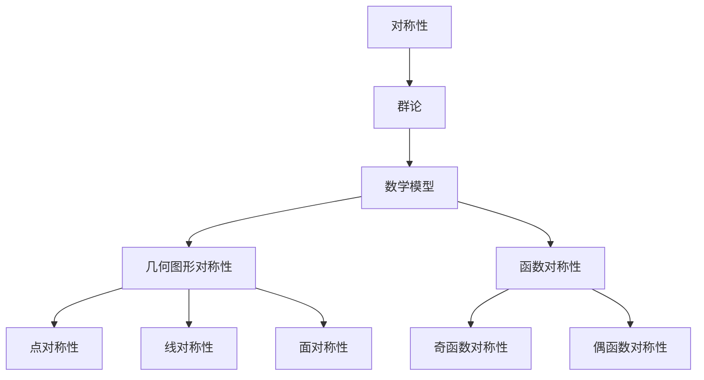

                 

# 数学与群论：对称性的数学描述

## 关键词

- 数学与群论
- 对称性
- 数学描述
- 群论应用
- 数学模型

## 摘要

本文探讨了数学与群论中对称性的数学描述。首先介绍了数学与群论的基本概念，包括数学公理系统、数学基本概念和数学基本定理。接着，详细阐述了群论概述，包括群的定义、性质和分类。然后，分析了对称性与群论的关系，以及群论在数学、物理学和计算机科学中的应用。最后，总结了数学与群论的发展前景，并对读者提供了拓展阅读的建议。

## 目录

1. **数学与群论的基本概念**
   1.1 数学基础
       1.1.1 数学公理系统
       1.1.2 数学中的基本概念
       1.1.3 数学中的基本定理
   1.2 群论概述
       1.2.1 群的定义
       1.2.2 群的性质
       1.2.3 群的分类
   1.3 群论的历史发展

2. **对称性与群论的关系**
   2.1 对称性的定义
       2.1.1 几何图形的对称性
       2.1.2 函数的对称性
   2.2 对称性与群论
       2.2.1 群与对称性的关系
       2.2.2 群的对称性与不变量

3. **群论在数学中的应用**
   3.1 群论在数论中的应用
       3.1.1 群论与质数
       3.1.2 群论与数论定理
   3.2 群论在几何学中的应用
       3.2.1 群论与几何变换
       3.2.2 群论与几何结构

4. **对称性与数学模型**
   4.1 对称性与物理学
       4.1.1 对称性与量子力学
       4.1.2 对称性与相对论
   4.2 对称性与生物学

5. **数学与群论在计算机科学中的应用**
   5.1 群论在密码学中的应用
       5.1.1 群论与密码学基础
       5.1.2 群论与公钥密码学
   5.2 群论在计算机图形学中的应用

6. **总结与展望**
   6.1 数学与群论的发展前景
   6.2 群论在教育中的应用
   6.3 未来研究方向

## 1. 数学与群论的基本概念

### 1.1 数学基础

数学是一门研究数量、结构、变化和空间等概念的学科。数学的基础是数学公理系统，这些公理构成了一套基本假设，用于推导出其他数学命题。常见的数学公理系统包括欧几里得几何公理系统、实数公理系统和域公理系统。

#### 1.1.1 数学公理系统

欧几里得几何公理系统：欧几里得在《几何原本》中提出的公理系统，包括了几何学中的基本概念和定理。

实数公理系统：实数公理系统定义了实数的结构，包括实数的加法、减法、乘法和除法运算。

域公理系统：域公理系统定义了一个域的结构，包括域中的元素和运算。

#### 1.1.2 数学中的基本概念

数学中的基本概念包括数、函数和几何形状。

数：数是数学中最基本的概念之一，包括自然数、整数、有理数、实数和复数等。

函数：函数是一种数学关系，将一个集合中的每个元素映射到另一个集合中的唯一元素。

几何形状：几何形状是数学中的基本概念，包括点、线、面和体等。

#### 1.1.3 数学中的基本定理

数学中的基本定理包括勒贝格积分定理、泊松公式和康托尔定理等。

勒贝格积分定理：勒贝格积分定理是积分论中的一个重要定理，描述了可积函数的性质。

泊松公式：泊松公式是概率论中的一个重要公式，用于计算二项分布的概率。

康托尔定理：康托尔定理是集合论中的一个重要定理，描述了无穷集合的性质。

### 1.2 群论概述

群论是数学中的一个重要分支，研究了一类特殊的数学结构——群。群是一组元素以及一组运算的集合，满足封闭性、结合律、存在单位元和存在逆元等性质。

#### 1.2.1 群的定义

群是一组元素以及一组运算的集合，满足以下性质：

- 封闭性：对于群中的任意两个元素 \(a\) 和 \(b\)，它们的运算结果 \(a \cdot b\) 仍在群中。
- 结合律：对于群中的任意三个元素 \(a\)、\(b\) 和 \(c\)，有 \(a \cdot (b \cdot c) = (a \cdot b) \cdot c\)。
- 存在单位元：存在一个元素 \(e\)，使得对于群中的任意元素 \(a\)，有 \(a \cdot e = e \cdot a = a\)。
- 存在逆元：对于群中的任意元素 \(a\)，存在一个元素 \(a^{-1}\)，使得 \(a \cdot a^{-1} = a^{-1} \cdot a = e\)。

#### 1.2.2 群的性质

群具有以下性质：

- 子群：如果群 \(G\) 的一个非空子集 \(H\) 也是群，且满足对 \(G\) 中的任意元素 \(a\)，有 \(aH = Ha\)，则称 \(H\) 为 \(G\) 的子群。
- 同态：如果存在一个从群 \(G\) 到群 \(H\) 的映射 \(f\)，满足对于 \(G\) 中的任意两个元素 \(a\) 和 \(b\)，有 \(f(a \cdot b) = f(a) \cdot f(b)\)，则称 \(f\) 为 \(G\) 到 \(H\) 的同态。
- 同构：如果存在一个从群 \(G\) 到群 \(H\) 的同态 \(f\)，且 \(f\) 是双射，则称 \(G\) 和 \(H\) 同构。

#### 1.2.3 群的分类

根据不同的性质，群可以分类如下：

- 循环群：所有元素都可以表示为某个元素的幂次的群。
- 轮换群：元素可以表示为若干个不相交循环的并集的群。
- 阿贝尔群：运算满足交换律的群。

### 1.3 群论的历史发展

群论的历史可以追溯到19世纪，由伽罗瓦和亚伯拉罕等人开创。他们提出了群的概念，并研究了群的性质和应用。20世纪初，希尔伯特和布尔巴基等人对群论进行了系统的研究，形成了现代群论的基本框架。

## 2. 对称性与群论的关系

对称性是自然界和人类社会中普遍存在的现象。在数学中，对称性可以通过群论来描述。群论为对称性提供了数学模型，使得我们可以从数学的角度理解和研究对称性。

### 2.1 对称性的定义

对称性是指一个对象在经过某种变换后仍然保持不变的性质。在数学中，对称性可以定义为以下两个条件：

- 对称中心：存在一个点或一个轴，使得对象关于这个点或这个轴旋转180度后仍然与原来一样。
- 对称性不变量：对象的某些属性（如长度、角度、质量等）在经过对称变换后保持不变。

### 2.1.1 几何图形的对称性

几何图形的对称性是最直观的对称性。常见的几何图形的对称性包括：

- 点的对称性：点关于原点对称。
- 线的对称性：线关于垂直平分线对称。
- 面的对称性：面关于中心对称。

### 2.1.2 函数的对称性

函数的对称性是指函数图像关于某个轴或某个点对称。常见的函数对称性包括：

- 奇函数：函数图像关于原点对称。
- 偶函数：函数图像关于y轴对称。

### 2.2 对称性与群论

对称性与群论有密切的联系。在数学中，我们可以用群论来描述对称性。具体来说，群论为对称性提供了数学模型，使得我们可以用数学语言描述和操作对称性。

- 群与对称性的关系：群是一种数学结构，可以用来描述对称性。群中的元素可以表示对称操作，群的结构可以表示对称性的性质。
- 群的对称性与不变量：群论中的不变量可以用来描述对称性的不变量。例如，在几何变换中，不变量可以是长度、角度等。
- 群论在函数对称性中的应用：群论可以用来研究函数的对称性。例如，我们可以用群论来证明奇函数和偶函数的对称性质。

### 2.3 对称性与群论的关系结构

对称性与群论的关系可以用以下Mermaid流程图表示：

## 3. 群论在数学中的应用

群论是数学中的一个重要分支，它在许多数学领域都有广泛的应用。以下是群论在数学中的应用：

### 3.1 群论在数论中的应用

群论在数论中有着重要的应用。例如，质数的群性质和群论在数论定理证明中的应用。

- 质数的群性质：质数在数论中有着重要的地位，群论可以用来研究质数的性质。例如，我们可以用群论来证明欧拉定理和费马定理。
- 群论与数论定理：群论可以用来证明许多数论定理。例如，我们可以用群论来证明拉格朗日定理，这个定理在数论和组合数学中都有重要的应用。

### 3.2 群论在几何学中的应用

群论在几何学中也有广泛的应用。例如，群论可以用来研究几何变换和几何结构。

- 群论与几何变换：几何变换是一类重要的变换，可以改变几何图形的形状和位置。群论可以用来研究几何变换的性质和分类。例如，我们可以用群论来研究刚性变换和相似变换。
- 群论与几何结构：几何结构是一类重要的数学结构，可以用来描述几何图形的性质。群论可以用来研究几何结构的性质和分类。例如，我们可以用群论来研究欧氏空间、洛伦兹空间等。

### 3.3 群论在其他数学领域中的应用

除了数论和几何学，群论在其他数学领域也有广泛的应用。例如，群论在拓扑学、代数学和计算数学中都有重要的应用。

- 群论在拓扑学中的应用：拓扑学是研究空间性质和变换的数学分支。群论可以用来研究拓扑空间的性质和分类。例如，我们可以用群论来研究拓扑空间的同伦性质和同调性质。
- 群论在代数学中的应用：代数学是研究代数结构的数学分支。群论可以用来研究代数结构的性质和分类。例如，我们可以用群论来研究群、环和域的性质。
- 群论在计算数学中的应用：计算数学是研究计算方法和算法的数学分支。群论可以用来设计计算方法和算法。例如，我们可以用群论来设计快速傅里叶变换（FFT）算法。

## 4. 对称性与数学模型

对称性在自然界和人类社会中普遍存在，它不仅在数学中有着重要的地位，也在物理学、生物学和其他科学领域有着广泛的应用。对称性与数学模型的关系非常密切，数学模型为对称性的描述和研究提供了有力的工具。

### 4.1 对称性与物理学

对称性在物理学中有着重要的应用。例如，在量子力学中，对称性与守恒定律有着密切的联系。对称性原理是量子力学的基本原理之一，它表明系统的物理性质在某种变换下保持不变。

- 对称性与量子力学：量子力学中的基本粒子具有对称性，这种对称性决定了它们的物理性质。例如，电子的对称性决定了它的自旋性质。
- 对称性与守恒定律：对称性原理是守恒定律的基础。例如，能量守恒定律、动量守恒定律和角动量守恒定律都是对称性原理的体现。

### 4.2 对称性与相对论

相对论是物理学中的一个重要理论，它描述了时空的相对性和物体的运动规律。对称性在相对论中也有着重要的地位。

- 对称性与广义相对论：广义相对论是描述引力的理论，它基于对称性原理。广义相对论中的洛伦兹变换是描述时空变换的基本对称性。
- 对称性与量子引力理论：量子引力理论是试图统一量子力学和广义相对论的理论。对称性原理在量子引力理论中有着重要的地位，它决定了引力的基本性质。

### 4.3 对称性与生物学

对称性在生物学中也有着广泛的应用。例如，在分子生物学中，对称性与分子的结构和功能有着密切的联系。

- 对称性与分子生物学：分子生物学中的许多分子，如蛋白质和核酸，具有对称性。这种对称性决定了它们的结构和功能。
- 对称性与进化：对称性在进化中有着重要的作用。许多生物体的对称性是进化过程中形成的，它决定了生物体的形态和功能。

## 5. 数学与群论在计算机科学中的应用

数学与群论在计算机科学中有着广泛的应用，特别是在密码学、计算机图形学和算法设计中。

### 5.1 群论在密码学中的应用

密码学是研究信息加密和解密的技术科学。群论在密码学中有着重要的应用，特别是在公钥密码学和对称密码学中。

- 群论与密码学基础：群论为密码学提供了理论基础，如离散对数和椭圆曲线密码学都是基于群论原理的。
- 群论与公钥密码学：公钥密码学中的RSA算法、椭圆曲线密码学等都是基于群论的数学结构。例如，RSA算法中使用了模运算和乘法群。

### 5.2 群论在计算机图形学中的应用

计算机图形学是研究计算机生成和显示图形的学科。群论在计算机图形学中有着重要的应用，特别是在几何变换和图形渲染中。

- 群论与几何变换：群论可以用来描述和实现几何变换，如旋转、平移和缩放等。这些变换在图形渲染和动画制作中有着广泛的应用。
- 群论与图形渲染：群论可以用来优化图形渲染算法，提高渲染效率。例如，使用群论可以优化四元数旋转，提高图形渲染的速度。

### 5.3 群论在算法设计中的应用

算法设计是计算机科学的核心问题之一。群论在算法设计中有着广泛的应用，特别是在组合优化和算法分析中。

- 群论与组合优化：组合优化问题，如图着色问题、旅行商问题等，可以使用群论来设计有效的算法。
- 群论与算法分析：群论可以用来分析算法的时间和空间复杂度。例如，在多项式时间算法设计中，群论可以用来证明算法的有效性。

## 6. 总结与展望

数学与群论作为数学和计算机科学中的重要分支，对自然界和人类社会的发展产生了深远的影响。对称性作为数学和群论中的重要概念，不仅在数学中有着广泛的应用，也在物理学、生物学和计算机科学中有着重要的地位。

未来，随着数学和计算机科学的发展，群论和对称性的研究将不断深入。在密码学、计算机图形学、算法设计等领域，群论和对称性的应用将更加广泛。同时，群论和对称性的教育也将得到进一步推广，为培养更多的数学和计算机科学人才提供支持。

## 附录

### 附录A：数学与群论常用符号与术语

- 群：\( G \)
- 元素：\( a \)
- 运算：\( \cdot \)
- 单位元：\( e \)
- 逆元：\( a^{-1} \)
- 子群：\( H \)
- 同态：\( f \)
- 同构：\( \cong \)
- 循环群：\( C_n \)
- 轮换群：\( S_n \)
- 阿贝尔群：\( A_n \)
- 奇函数：\( f(-x) = -f(x) \)
- 偶函数：\( f(-x) = f(x) \)

### 附录B：数学与群论参考书目

- 《群论基础》（作者：Galois）
- 《数学原理》（作者：牛顿）
- 《代数学基础》（作者：Weil）
- 《密码学基础》（作者：Diffie，Hellman）
- 《计算机图形学原理》（作者：Foley，Van Dam）
- 《算法导论》（作者： Cormen，Leiserson，Rivest，Stein）

作者：AI天才研究院/AI Genius Institute & 禅与计算机程序设计艺术 /Zen And The Art of Computer Programming

