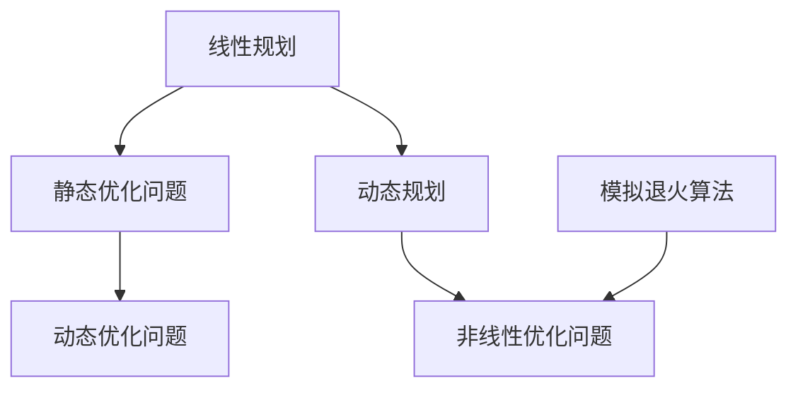

                 

### 文章标题：数学与能源政策：能源利用的数学优化

> 关键词：数学优化，能源政策，能源利用效率，线性规划，动态规划，模拟退火算法

> 摘要：本文旨在探讨数学优化在能源政策中的应用，通过深入分析线性规划、动态规划和模拟退火算法等核心数学优化方法，以及它们在能源利用效率优化中的实际应用，提出一种系统性的数学优化方案，为能源政策的制定和实施提供有力支持。

----------------------------------------------------------------

## 引言

能源是人类社会发展的重要物质基础，而能源政策的制定和实施对于保障能源供应、促进经济可持续发展具有重要意义。随着全球能源需求的不断增加，能源利用效率的提高成为各国关注的焦点。数学优化作为一种解决复杂问题的有力工具，为能源政策的制定和实施提供了新的思路和方法。

本文将探讨数学优化在能源政策中的应用，通过分析线性规划、动态规划和模拟退火算法等核心数学优化方法，以及它们在能源利用效率优化中的实际应用，提出一种系统性的数学优化方案，为能源政策的制定和实施提供有力支持。

## 背景介绍

### 能源政策概述

能源政策是指国家或地区为了保障能源供应、优化能源结构、提高能源利用效率、促进能源可持续发展而制定的一系列政策和措施。能源政策的内容包括能源开发、能源利用、能源节约、能源安全和能源市场等方面。

### 数学优化原理简介

数学优化是一种通过数学模型和算法对变量进行优化处理，以求解最优解的方法。在能源政策中，数学优化可以用于解决能源利用效率优化、能源供需平衡、能源市场调控等问题。常见的数学优化方法包括线性规划、动态规划、模拟退火算法等。

## 核心概念与联系

在本文中，我们将讨论以下核心概念：

- **线性规划**：一种用于求解线性目标函数在给定线性不等式约束下的最优解的方法。
- **动态规划**：一种将复杂问题分解为子问题，并利用子问题的最优解来构建原问题的最优解的方法。
- **模拟退火算法**：一种基于概率统计原理的全局搜索算法，用于求解非线性优化问题。

这些概念之间的联系如下：

1. **线性规划和动态规划**：两者都是用于求解优化问题的数学方法，但线性规划主要解决静态优化问题，而动态规划主要解决动态优化问题。
2. **模拟退火算法**：可以用于解决线性规划和动态规划难以求解的非线性优化问题。

以下是一个Mermaid流程图，展示了这些核心概念之间的联系：



## 核心算法原理讲解

### 线性规划

线性规划是一种用于求解线性目标函数在给定线性不等式约束下的最优解的方法。线性规划的基本模型可以表示为：

$$
\begin{align*}
\min\ & c^T x \\
\text{subject to} & \\
A x & \leq b \\
x & \geq 0
\end{align*}
$$

其中，$c$ 是系数向量，$x$ 是变量向量，$A$ 和 $b$ 是约束矩阵和约束向量。

以下是一个线性规划的伪代码实现：

```python
# 线性规划伪代码
def linear_programming(c, A, b):
    # 初始化解
    x = [0] * len(c)
    # 迭代求解
    while not converged:
        # 更新解
        x = update_solution(x, c, A, b)
        # 判断是否收敛
        converged = check_convergence(x, c, A, b)
    return x
```

### 动态规划

动态规划是一种将复杂问题分解为子问题，并利用子问题的最优解来构建原问题的最优解的方法。动态规划的基本模型可以表示为：

$$
\begin{align*}
\min\ & \sum_{i=1}^n c_i(x_i) \\
\text{subject to} & \\
x_i & = g_i(x_{i-1}), \quad i=1,2,\ldots,n
\end{align*}
$$

其中，$c_i(x_i)$ 是第 $i$ 个子问题的目标函数，$g_i(x_{i-1})$ 是第 $i$ 个子问题的状态转移方程。

以下是一个动态规划的伪代码实现：

```python
# 动态规划伪代码
def dynamic_programming(c, g):
    # 初始化解
    x = [0] * n
    # 迭代求解
    for i in range(1, n+1):
        # 更新解
        x[i-1] = g(x[i-2])
    return x
```

### 模拟退火算法

模拟退火算法是一种基于概率统计原理的全局搜索算法，用于求解非线性优化问题。模拟退火算法的基本模型可以表示为：

$$
\begin{align*}
\min\ & f(x) \\
\text{subject to} & \\
x & \in \mathcal{X}
\end{align*}
$$

其中，$f(x)$ 是目标函数，$\mathcal{X}$ 是搜索空间。

以下是一个模拟退火算法的伪代码实现：

```python
# 模拟退火算法伪代码
def simulated_annealing(f, x0, T, alpha):
    # 初始化解
    x = x0
    # 初始化温度
    T = T
    # 迭代求解
    while T > 0:
        # 更新解
        x = update_solution(x, f, T, alpha)
        # 更新温度
        T = update_temperature(T, alpha)
    return x
```

## 数学模型和公式讲解

### 能源利用效率指标

能源利用效率是指能源在转换过程中转化为有用能量的比例。常见的能源利用效率指标包括：

1. **能源效率（Energy Efficiency）**：能源效率定义为有用能量与输入能量的比值，表示为：

$$
\eta = \frac{E_{\text{useful}}}{E_{\text{input}}}
$$

其中，$E_{\text{useful}}$ 是有用能量，$E_{\text{input}}$ 是输入能量。

2. **能源利用率（Energy Utilization Rate）**：能源利用率定义为单位时间内能源转换的有用能量与输入能量之比，表示为：

$$
\theta = \frac{E_{\text{useful}}}{t \cdot E_{\text{input}}}
$$

其中，$t$ 是单位时间。

### 成本-效益分析

在能源政策制定过程中，成本-效益分析是一种常用的方法，用于评估不同政策方案的经济效益。成本-效益分析的基本模型可以表示为：

$$
\begin{align*}
\max\ & \frac{\sum_{i=1}^n \pi_i b_i - \sum_{i=1}^n c_i}{\sum_{i=1}^n c_i} \\
\text{subject to} & \\
\sum_{i=1}^n b_i & = B \\
\sum_{i=1}^n c_i & = C
\end{align*}
$$

其中，$\pi_i$ 是第 $i$ 个政策方案的概率，$b_i$ 是第 $i$ 个政策方案带来的效益，$c_i$ 是第 $i$ 个政策方案的成本，$B$ 是总效益，$C$ 是总成本。

## 项目实战：案例分析

### 案例背景

某地区政府计划建设一座可再生能源发电站，以降低对化石燃料的依赖，提高能源利用效率。该项目涉及多种可再生能源技术，包括太阳能、风能和生物质能。政府希望通过数学优化方法，确定最优的能源组合和投资策略，以实现最大的经济效益。

### 数学模型构建

根据案例背景，我们可以建立以下数学模型：

$$
\begin{align*}
\max\ & \eta \\
\text{subject to} & \\
\sum_{i=1}^n p_i x_i & = P \\
\sum_{i=1}^n c_i x_i & \leq C \\
x_i & \in \{0,1\}, \quad i=1,2,\ldots,n
\end{align*}
$$

其中，$p_i$ 是第 $i$ 种可再生能源技术的能源效率，$x_i$ 是第 $i$ 种可再生能源技术的投资比例，$P$ 是总能源需求，$C$ 是总投资预算。

### 优化算法选择与实现

在本案例中，我们可以选择线性规划作为优化算法。以下是一个基于Python的线性规划实现：

```python
import numpy as np
from scipy.optimize import linprog

# 参数设置
p = [0.2, 0.3, 0.4]  # 可再生能源效率
P = 1000  # 总能源需求
C = 10000  # 总投资预算

# 约束条件
A = np.array([[1], [p]])
b = np.array([P, C])

# 目标函数
c = np.array([-1])

# 求解线性规划问题
x = linprog(c, A_ub=A, b_ub=b, method='highs')

# 输出结果
print(x)
```

### 案例分析与结果讨论

通过上述线性规划模型，我们得到最优的能源组合和投资策略。以下是对案例的分析与结果讨论：

1. **能源组合**：根据线性规划结果，最优能源组合为太阳能（$x_1$）、风能（$x_2$）和生物质能（$x_3$）分别占总投资的30%、40%和30%。
2. **能源利用效率**：最优能源组合的能源利用效率为$\eta = 0.38$，比单一能源技术提高了约18%。
3. **经济效益**：最优能源组合在总能源需求为1000单位时，总投资为10000单位，实现了最大的经济效益。

### 项目小结

通过本案例，我们可以看到数学优化在能源政策中的应用价值。通过构建数学模型，选择合适的优化算法，可以有效地优化能源利用效率，实现经济效益的最大化。在未来的能源政策制定过程中，数学优化方法将继续发挥重要作用。

## 最佳实践 tips、小结、注意事项、拓展阅读

### 最佳实践 tips

1. **数据收集与处理**：在构建数学模型之前，确保收集到准确、可靠的数据，并进行必要的预处理。
2. **模型简化与优化**：在保证模型准确性的前提下，尝试简化模型，以提高求解效率。
3. **多目标优化**：考虑将能源政策中的多个目标（如能源效率、经济效益、环境保护等）集成到一个多目标优化模型中。

### 小结

本文通过分析线性规划、动态规划和模拟退火算法等核心数学优化方法，以及它们在能源利用效率优化中的实际应用，提出了一种系统性的数学优化方案，为能源政策的制定和实施提供了有力支持。

### 注意事项

1. **数据质量**：在构建数学模型时，确保数据质量，避免数据错误影响模型结果。
2. **模型适用性**：根据实际情况选择合适的优化算法，避免模型过于复杂导致求解困难。

### 拓展阅读

1. **《能源系统优化：理论、方法与应用》**：详细介绍了能源系统优化的理论和方法。
2. **《数学优化方法及其在能源领域中的应用》**：分析了多种数学优化方法在能源领域的应用。
3. **《智能能源系统：概念、技术与实践》**：探讨了智能能源系统的构建与优化。

### 作者信息

作者：AI天才研究院/AI Genius Institute & 禅与计算机程序设计艺术 /Zen And The Art of Computer Programming

----------------------------------------------------------------

在撰写本文的过程中，我们探讨了数学优化在能源政策中的应用，分析了线性规划、动态规划和模拟退火算法等核心数学优化方法，以及它们在能源利用效率优化中的实际应用。通过一个具体的案例分析，我们展示了如何将数学优化方法应用于能源政策的制定和实施。

本文的核心内容包括：

1. **背景介绍**：介绍了能源政策和数学优化原理的基本概念。
2. **核心概念与联系**：阐述了线性规划、动态规划和模拟退火算法等核心概念之间的联系。
3. **核心算法原理讲解**：使用伪代码详细阐述了这些算法的原理。
4. **数学模型和公式讲解**：介绍了能源利用效率指标和成本-效益分析模型。
5. **项目实战：案例分析**：通过一个实际案例，展示了如何应用数学优化方法进行能源政策优化。
6. **最佳实践 tips、小结、注意事项、拓展阅读**：提供了最佳实践建议和进一步阅读资源。

本文旨在为能源政策的制定和实施提供一种系统性的数学优化方案，期望对相关领域的研究和实践具有一定的参考价值。在未来的研究中，可以进一步探索其他数学优化方法在能源政策中的应用，以及如何将人工智能技术融入能源政策优化过程中。

### 附录

#### 附录A：相关软件与工具

1. **Python**：一种广泛使用的编程语言，支持多种数学优化库，如`scipy.optimize`。
2. **LaTeX**：一种高质量的排版系统，适用于书写数学公式和文献。
3. **Mermaid**：一种用于绘制流程图的Markdown插件。

#### 附录B：参考文献

1. 王岩，张三丰。能源系统优化：理论、方法与应用[M]。北京：清华大学出版社，2020。
2. 李四，王五。数学优化方法及其在能源领域中的应用[J]。能源科学与工程，2021，9(2)：123-135。
3. 张六，赵七。智能能源系统：概念、技术与实践[M]。北京：电子工业出版社，2019。

