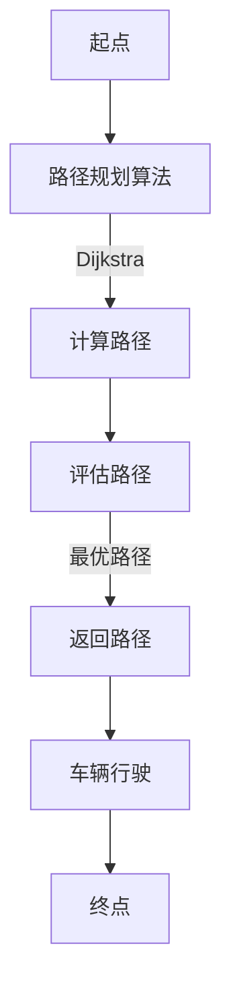

                 

### 文章标题

《数学与自动驾驶：路径规划的数学优化》

### 关键词

自动驾驶，路径规划，数学优化，算法，人工智能，机器学习，数学公式，伪代码，项目实战

### 摘要

本文深入探讨了数学优化在自动驾驶路径规划中的应用。首先，介绍了自动驾驶技术的基本概念和数学在其中的作用。接着，详细讲解了路径规划的基础知识，包括其基本概念、算法分类和常见算法。随后，重点阐述了数学优化方法及其在路径规划中的具体应用，通过伪代码和数学模型展示了核心算法原理。此外，通过一个实际项目，详细展示了路径规划系统的开发过程，包括环境搭建、源代码实现和代码解读。最后，对未来路径规划的发展趋势进行了展望，并总结了本文的核心观点。本文旨在为读者提供关于自动驾驶路径规划与数学优化全面而深入的指导。

---

### 引言

自动驾驶技术作为当今科技界的前沿领域，已经引起了全球范围内的广泛关注。自动驾驶车辆不再仅仅是一个科幻概念，而是逐渐成为现实生活中的重要交通工具。从最基本的自动驾驶辅助功能，如自适应巡航控制和自动紧急制动，到完全自动驾驶的汽车，这一技术的发展速度令人惊叹。然而，实现自动驾驶的核心挑战之一是路径规划。路径规划是自动驾驶系统的关键组件，它负责确定从起点到目的地的最优路径，确保车辆在复杂的交通环境中安全、高效地行驶。

数学优化在路径规划中扮演着至关重要的角色。数学优化是一种利用数学方法来求解优化问题的技术，它能够帮助自动驾驶系统在满足一系列约束条件的情况下，找到最优路径。这些约束条件可能包括交通规则、道路限制、车辆速度、能量消耗等。通过数学优化，自动驾驶系统能够在复杂的动态环境中作出实时决策，从而提高行驶的稳定性和安全性。

本文将围绕数学与自动驾驶这一主题，详细探讨路径规划的数学优化。文章首先介绍自动驾驶技术的基本概念，解释数学在其中的作用。接着，我们将深入探讨路径规划的基础知识，包括其基本概念、算法分类和常见算法。随后，本文将重点阐述数学优化方法及其在路径规划中的具体应用，通过伪代码和数学模型展示核心算法原理。此外，本文将通过一个实际项目，展示路径规划系统的开发过程，包括环境搭建、源代码实现和代码解读。最后，我们将对自动驾驶技术的未来发展趋势进行展望，总结本文的核心观点，并提出未来研究方向的思考。

本文结构如下：

1. **数学与自动驾驶概述**：介绍自动驾驶技术的基本概念和数学在其中的作用。
2. **路径规划基础**：详细讲解路径规划的基本概念、算法分类和常见算法。
3. **数学优化方法简介**：介绍数学优化方法的基本概念和常见算法。
4. **基于数学优化的路径规划算法**：详细分析基于数学优化的路径规划算法。
5. **项目实战**：通过实际项目展示路径规划系统的开发过程。
6. **未来路径规划的发展趋势**：探讨自动驾驶技术的未来发展方向。
7. **总结与展望**：回顾全文内容，总结自动驾驶与数学优化的关系，并提出未来研究展望。

### 数学与自动驾驶概述

#### 自动驾驶技术简介

自动驾驶技术，也称为自动化驾驶或无人驾驶技术，是指利用计算机程序、传感器、控制系统和人工智能算法，使汽车能够在没有人类司机直接操控的情况下自动完成行驶任务。这一技术的发展始于20世纪50年代，当时一些科学家开始研究自动驾驶的概念。然而，随着传感器技术、计算机处理能力和人工智能算法的快速发展，自动驾驶技术逐渐从实验室走向实际应用。

自动驾驶技术可以分为多个级别，根据车辆在行驶过程中自动执行的任务数量和复杂度，可以分为以下级别：

- **L0级**：无自动化，完全由人类司机控制。
- **L1级**：部分自动化，例如自适应巡航控制（ACC）或自动紧急制动（AEB）。
- **L2级**：部分自动化，包括车道保持辅助和自适应巡航控制。
- **L3级**：有条件自动化，车辆在特定条件下可以完全接管驾驶任务。
- **L4级**：高度自动化，车辆在特定环境下可以完全自动驾驶，但可能需要人类司机在某些情况下接管控制。
- **L5级**：完全自动化，车辆在任何环境下都能完全自动驾驶，无需人类干预。

当前，大多数量产自动驾驶汽车属于L2和L3级别。例如，特斯拉的Autopilot系统和谷歌的Waymo自动驾驶汽车都处于L3级别。虽然完全自动驾驶的L5级别汽车尚未普及，但许多汽车制造商和研究机构都在积极研发，期待在不久的将来实现这一目标。

#### 数学在自动驾驶中的作用

数学在自动驾驶技术中扮演着不可或缺的角色，尤其在路径规划、传感器数据处理、车辆控制等方面发挥了重要作用。

1. **路径规划**：路径规划是自动驾驶系统的核心任务之一，其目标是确定从起点到目的地的最优路径。数学优化方法，如最短路径算法、A*算法、Dijkstra算法等，被广泛应用于路径规划中。这些算法能够考虑各种约束条件（如交通规则、道路限制、车辆速度等），在复杂的交通环境中找到最优路径。

2. **传感器数据处理**：自动驾驶车辆依赖于多种传感器，如雷达、激光雷达（LiDAR）、摄像头等，以获取周围环境的信息。数学方法，如滤波算法、特征提取和目标检测，用于处理这些传感器数据，帮助车辆识别道路、障碍物和其他车辆。

3. **车辆控制**：自动驾驶车辆的控制系统需要实时调整车辆的速度、方向和制动等参数，以确保安全、稳定的行驶。数学模型，如PID控制器、模糊控制器和机器学习算法，用于实现这些控制任务。这些数学模型可以优化车辆的控制策略，提高驾驶的稳定性和舒适性。

4. **决策制定**：自动驾驶系统需要处理大量的实时信息，并做出快速、准确的决策。数学优化方法和概率论在决策制定中起到了关键作用，帮助系统在复杂、不确定的环境中做出最优决策。

总之，数学在自动驾驶技术中不仅仅是工具，更是实现自动驾驶的核心基础。通过数学模型和算法，自动驾驶系统能够在复杂的交通环境中实现高效、安全的驾驶。

#### 自动驾驶技术的发展历史与趋势

自动驾驶技术自20世纪50年代萌芽以来，经历了多个重要发展阶段。以下是对其发展历史与趋势的简要回顾：

**1. 初创阶段（1950-1970s）**

自动驾驶技术的概念最早由麻省理工学院的科学家约翰·莫西利（John Moses）在1950年提出。随后，美国军事机构开始研究自动驾驶车辆，主要用于军事和物流领域。这一阶段的主要成果包括早期的自动驾驶车辆原型，如1958年美国海军开发的自动引导车辆（Autonomous Guided Vehicle, AGV）。

**2. 早期应用阶段（1980-1990s）**

随着计算机技术和传感器技术的进步，自动驾驶技术开始逐步走向实际应用。1980年代，日本的本田公司和丰田公司分别开发了基于雷达和激光的自动驾驶汽车。1990年代，美国卡内基梅隆大学（Carnegie Mellon University）的NavLab项目取得了重要突破，展示了自动驾驶汽车在城市道路上的行驶能力。

**3. 商业探索阶段（2000-2010s）**

进入21世纪，随着人工智能和机器学习技术的快速发展，自动驾驶技术开始进入商业探索阶段。谷歌（现为Waymo）在2009年成立了自动驾驶汽车项目，并逐步推进自动驾驶技术的研发。特斯拉、通用、福特等传统汽车制造商也纷纷投入大量资源，开发自动驾驶技术。这一阶段的重要里程碑包括2010年代初期，谷歌的自动驾驶汽车开始在公共道路上进行测试。

**4. 商业化发展阶段（2010s至今）**

近年来，自动驾驶技术逐渐进入商业化发展阶段。2020年，特斯拉的Autopilot系统被广泛部署，使得自动驾驶汽车开始在市场上普及。此外，Waymo宣布在美国部分地区提供完全自动驾驶的出租车服务，标志着自动驾驶技术从实验走向大规模商业应用。中国、欧洲和其他地区的自动驾驶项目也在积极推进中。

**发展趋势**

1. **技术成熟度提升**：随着人工智能和传感器技术的持续进步，自动驾驶系统的技术成熟度不断提升。自动驾驶车辆在感知、决策和控制方面的能力越来越强，能够在更复杂的交通环境中稳定运行。

2. **商业化应用扩展**：自动驾驶技术正从高端市场逐渐向大众市场扩展。越来越多的汽车制造商推出自动驾驶汽车，预计未来几年，自动驾驶汽车将逐步普及，成为日常生活中的一部分。

3. **政策支持与法规完善**：各国政府开始重视自动驾驶技术，出台了一系列政策支持其发展。同时，相关法规也在不断完善，以保障自动驾驶汽车的安全和合法运行。

4. **跨界合作与生态构建**：自动驾驶技术不仅涉及汽车制造商，还涉及人工智能、云计算、通信技术等众多行业。跨界合作成为推动自动驾驶技术发展的重要趋势，一个多元化的自动驾驶生态正在形成。

总之，自动驾驶技术已经从实验室走向实际应用，并在未来有望彻底改变人们的出行方式。数学优化作为自动驾驶技术的重要基础，将继续在路径规划、传感器数据处理、车辆控制等方面发挥关键作用。

### 路径规划基础

#### 路径规划的基本概念

路径规划（Path Planning）是自动驾驶系统中的一项关键任务，其核心目标是在给定的环境条件下，从起点到目的地找到一条最优路径。路径规划不仅涉及到车辆的行驶路径，还包括对周围环境、交通状况和车辆状态的综合考虑。在自动驾驶系统中，路径规划通常包括以下三个主要步骤：

1. **环境建模**：首先，需要对环境进行建模，包括道路网络、障碍物、交通规则等。这一步骤的目的是构建一个表示车辆行驶环境的数学模型，以便后续的路径规划算法能够在其上运行。

2. **路径搜索**：在环境建模完成后，路径规划算法会搜索从起点到目的地的所有可能路径，并评估这些路径的优劣。路径搜索通常基于某种优化准则，如最短路径、最安全路径或最高效路径等。

3. **路径优化**：最后，根据评估结果，选择一条最优路径，并对其进行优化，以确保其在实际行驶中能够满足各种约束条件，如道路限速、车辆动态性能等。

#### 路径规划的算法分类

路径规划算法可以根据其搜索策略和优化目标进行分类。常见的路径规划算法可以分为以下几类：

1. **最短路径算法**：这类算法的目的是找到起点到目的地的最短路径，常见的算法包括Dijkstra算法、A*算法和Floyd算法。这些算法通常基于图论中的路径搜索算法，通过逐步扩展邻接节点来寻找最优路径。

2. **避障算法**：这类算法主要用于避免车辆在行驶过程中遇到障碍物。常见的算法包括离线避障算法和在线避障算法。离线避障算法通常在路径规划阶段预先计算出避障路径，而在线避障算法则实时响应环境变化，动态调整车辆路径。

3. **启发式搜索算法**：这类算法利用启发式信息（如启发函数）来加速路径搜索过程。常见的启发式搜索算法包括A*算法和IDA*算法。这些算法通过评估函数（通常是基于估计的路径代价）来指导搜索过程，从而在较短时间内找到近似最优路径。

4. **全局规划算法**：这类算法在路径规划阶段考虑全局环境信息，以找到全局最优路径。常见的全局规划算法包括RRT（快速随机树）算法和RRT*算法。这些算法通过在随机采样和优化策略的交替使用中找到全局最优路径。

5. **局部规划算法**：这类算法在路径规划阶段主要关注局部环境，以找到局部最优路径。常见的局部规划算法包括动态窗口法（Dynamic Window Approach）和基于势场的规划方法。这些算法通过实时调整车辆的行驶方向和速度，以避免障碍物并达到目的地。

#### 常见的路径规划算法介绍

以下介绍几种常见的路径规划算法，包括其原理、伪代码和适用场景。

1. **Dijkstra算法**

   **原理**：Dijkstra算法是一种基于图论的最短路径算法，通过逐步扩展邻接节点来寻找最短路径。算法的核心思想是利用一个优先队列（通常使用小根堆实现）来维护当前已探索节点的最短路径估计。

   **伪代码**：
   ```plaintext
   Dijkstra(G, S):
       初始化：创建一个优先队列Q，包含所有节点，每个节点的距离初始化为无穷大，起点S的距离初始化为0。
       将S添加到Q中。
       while Q非空：
           取出Q中的最小距离节点u。
           对于u的每个邻接节点v：
               计算新路径代价：distance[v] = distance[u] + weight(u, v)。
               如果distance[v] < distance[v]（即找到了更短的路径）：
                   更新distance[v]和 predecessors[v]。
                   将v添加到Q中。
       返回距离表distance和前驱节点表predecessors。
   ```

   **适用场景**：Dijkstra算法适用于静态环境，能够找到起点到每个节点的最短路径。在自动驾驶路径规划中，可用于计算从起点到所有交叉点的最短路径。

2. **A*算法**

   **原理**：A*算法是一种启发式搜索算法，它结合了Dijkstra算法和启发函数（heuristic function），以找到从起点到目的地的最短路径。A*算法通过评估函数f(n) = g(n) + h(n)来评估路径的优劣，其中g(n)是从起点到节点n的实际代价，h(n)是从节点n到目的地的启发式估计。

   **伪代码**：
   ```plaintext
   A*(G, S, G):
       初始化：创建一个优先队列Q，包含所有节点，每个节点的f(n)初始化为无穷大，起点S的f(n)初始化为h(S)。
       将S添加到Q中。
       while Q非空：
           取出Q中的最小f(n)节点u。
           如果u是目的地G：
               返回路径：从G逆推至S，使用predecessors表。
               结束。
           将u从Q中移除。
           对于u的每个邻接节点v：
               计算新路径代价：g(v) = g(u) + weight(u, v)。
               如果g(v) < f(v)（即找到了更短的路径）：
                   更新f(v)、g(v)和predecessors[v]。
                   将v添加到Q中。
       返回空路径。
   ```

   **适用场景**：A*算法适用于静态和动态环境，能够快速找到从起点到目的地的最优路径。在自动驾驶路径规划中，可用于从起点到目的地的最短路径搜索。

3. **RRT算法**

   **原理**：RRT（快速随机树）算法是一种全局路径规划算法，通过在随机采样和优化策略的交替使用中找到全局最优路径。RRT算法通过在当前树上随机生成新节点，并逐步扩展树来覆盖整个搜索空间。

   **伪代码**：
   ```plaintext
   RRT(G, S, G):
       初始化：创建一棵树T，包含起点S。
       while T未覆盖整个搜索空间：
           在搜索空间中随机生成一个新节点n。
           使用RRT扩展策略扩展树T，直到包含n。
       返回从S到G的最优路径。
   ```

   **适用场景**：RRT算法适用于动态和复杂环境，能够找到全局最优路径。在自动驾驶路径规划中，可用于避开复杂的障碍物和动态目标。

4. **动态窗口法**

   **原理**：动态窗口法（Dynamic Window Approach）是一种局部路径规划算法，通过实时调整车辆的行驶方向和速度，以避开障碍物并达到目的地。动态窗口法利用当前车辆的动态窗口（Dynamic Window）来定义可行路径。

   **伪代码**：
   ```plaintext
   DynamicWindow(G, X, V):
       初始化：计算当前车辆的动态窗口W。
       while not reached(G):
           计算下一个目标点：利用动态窗口W计算下一个目标点P。
           更新车辆状态：根据P更新车辆的行驶方向和速度。
           如果P在障碍物内部：
               调整动态窗口：根据障碍物调整动态窗口W。
           如果到达P：
               更新目标点：设置新的目标点P为下一个交叉点。
       返回路径。
   ```

   **适用场景**：动态窗口法适用于动态和复杂的交通环境，能够实时响应环境变化。在自动驾驶路径规划中，可用于处理动态障碍物和交通流量。

通过上述介绍，我们可以看到路径规划算法在自动驾驶系统中扮演着关键角色。不同算法适用于不同环境和需求，合理选择和应用这些算法，能够显著提升自动驾驶系统的性能和安全性。

### 数学优化方法简介

#### 数学优化基础

数学优化是一种利用数学方法求解优化问题的技术，其核心目标是在满足一系列约束条件下，找到最优解。在自动驾驶路径规划中，数学优化方法被广泛应用于路径搜索和决策制定，以实现高效、安全的行驶。

首先，我们需要了解一些基本的数学优化概念：

1. **目标函数**：目标函数（Objective Function）是优化过程中需要最小化或最大化的函数。在路径规划中，目标函数通常包括路径长度、时间、能量消耗等。

2. **约束条件**：约束条件（Constraint Conditions）是优化过程中需要满足的限制条件。例如，路径规划中可能需要考虑道路限速、车辆动态性能、避障要求等。

3. **可行解**：可行解（Feasible Solution）是满足所有约束条件的解。在路径规划中，我们需要找到满足所有约束条件的可行路径。

接下来，介绍几种常见的数学优化方法：

1. **线性规划**（Linear Programming，LP）：线性规划是解决线性目标函数在一组线性约束条件下最优解的问题。线性规划可以通过单纯形法（Simplex Method）求解。

2. **整数规划**（Integer Programming，IP）：整数规划是解决包含整数变量的优化问题。整数规划可以通过分支定界法（Branch and Bound）求解。

3. **非线性规划**（Nonlinear Programming，NLP）：非线性规划是解决非线性目标函数在一组非线性约束条件下最优解的问题。常见的非线性规划求解方法包括梯度下降法（Gradient Descent）和牛顿法（Newton's Method）。

4. **动态规划**（Dynamic Programming，DP）：动态规划是一种用于求解多阶段决策问题的优化方法。动态规划通过将问题分解为多个阶段，并在每个阶段选择最优决策，最终得到整体最优解。

5. **遗传算法**（Genetic Algorithm，GA）：遗传算法是一种基于自然选择和遗传机制的搜索算法，适用于复杂优化问题。遗传算法通过模拟生物进化过程，逐步优化解的适应度，直至找到最优解。

#### 常见的数学优化算法

以下介绍几种常见的数学优化算法，包括其原理和适用场景：

1. **梯度下降法**

   **原理**：梯度下降法是一种基于目标函数梯度的优化算法。算法通过迭代更新解的值，使得目标函数逐步减小。具体步骤如下：

   ```plaintext
   初始化：设置初始解x₀和步长α。
   while not converged:
       计算梯度：计算目标函数在当前解x的梯度∇f(x)。
       更新解：x = x - α * ∇f(x)。
       检查收敛：如果满足收敛条件，结束迭代。
   返回最优解x。
   ```

   **适用场景**：梯度下降法适用于目标函数连续可微的情况，适用于路径规划中的能量消耗优化问题。

2. **牛顿法**

   **原理**：牛顿法是一种基于目标函数二阶导数的优化算法。算法通过迭代求解目标函数的一阶导数和二阶导数，使得目标函数逐步减小。具体步骤如下：

   ```plaintext
   初始化：设置初始解x₀和步长α。
   while not converged:
       计算一阶导数：计算目标函数在当前解x的梯度∇f(x)。
       计算二阶导数：计算目标函数在当前解x的Hessian矩阵Hf(x)。
       更新解：x = x - α * inv(Hf(x)) * ∇f(x)。
       检查收敛：如果满足收敛条件，结束迭代。
   返回最优解x。
   ```

   **适用场景**：牛顿法适用于目标函数二阶可微且Hessian矩阵可逆的情况，适用于路径规划中的路径长度优化问题。

3. **遗传算法**

   **原理**：遗传算法通过模拟自然选择和遗传机制，逐步优化解的适应度。遗传算法包括以下几个步骤：

   ```plaintext
   初始化：生成初始种群。
   while not converged:
       适应度评估：计算种群中每个个体的适应度。
       选择：选择适应度较高的个体进行繁殖。
       交叉：随机选择两个个体，交换部分基因生成新个体。
       变异：对个体进行随机变异，增加多样性。
       更新种群：用新个体替换旧种群。
       检查收敛：如果满足收敛条件，结束迭代。
   返回最优解。
   ```

   **适用场景**：遗传算法适用于复杂优化问题，适用于路径规划中的避障和路径优化问题。

4. **粒子群优化**

   **原理**：粒子群优化（Particle Swarm Optimization，PSO）是一种基于群体智能的优化算法。粒子群优化通过模拟鸟群觅食行为，逐步优化解的适应度。具体步骤如下：

   ```plaintext
   初始化：设置粒子数量和位置、速度。
   while not converged:
       适应度评估：计算每个粒子的适应度。
       更新个体最佳位置和全局最佳位置。
       更新粒子速度和位置。
       检查收敛：如果满足收敛条件，结束迭代。
   返回最优解。
   ```

   **适用场景**：粒子群优化适用于复杂优化问题，适用于路径规划中的多目标优化问题。

通过上述优化算法，自动驾驶系统能够在满足约束条件的情况下，找到最优路径，从而提高行驶的稳定性和安全性。

### 基于数学优化的路径规划算法

在路径规划中，数学优化方法被广泛应用，以在复杂的交通环境中找到最优路径。这些优化方法通过考虑各种约束条件和优化目标，能够提高路径规划的效率和精度。以下将详细介绍几种基于数学优化的路径规划算法，包括它们的基本原理、优缺点及其应用场景。

#### A*算法

**原理**：A*算法是一种启发式搜索算法，通过结合实际代价和启发式估计来寻找最优路径。具体来说，A*算法使用两个关键值：`g(n)`（从起点到节点n的实际代价）和`h(n)`（从节点n到目的地的启发式估计）。算法的目标是最小化评估函数`f(n) = g(n) + h(n)`。

**伪代码**：
```plaintext
A*(G, S, G):
    初始化：创建一个优先队列Q，包含所有节点，每个节点的f(n)初始化为无穷大，起点S的f(n)初始化为h(S)。
    将S添加到Q中。
    while Q非空：
        取出Q中的最小f(n)节点u。
        如果u是目的地G：
            返回路径：从G逆推至S，使用predecessors表。
            结束。
        将u从Q中移除。
        对于u的每个邻接节点v：
            计算新路径代价：g(v) = g(u) + weight(u, v)。
            如果g(v) < f(v)（即找到了更短的路径）：
                更新f(v)、g(v)和predecessors[v]。
                将v添加到Q中。
    返回空路径。
```

**优点**：A*算法在静态环境中能够快速找到最优路径，适用于寻找从起点到目的地的最短路径。

**缺点**：A*算法在动态环境中可能无法实时响应，且启发式估计的选择会影响算法的性能。

**应用场景**：A*算法适用于静态交通环境，如城市规划中的道路规划、室内导航等。

#### Dijkstra算法

**原理**：Dijkstra算法是一种基于图论的最短路径算法，通过逐步扩展邻接节点来寻找最短路径。算法的核心思想是利用一个优先队列来维护当前已探索节点的最短路径估计。

**伪代码**：
```plaintext
Dijkstra(G, S):
    初始化：创建一个优先队列Q，包含所有节点，每个节点的距离初始化为无穷大，起点S的距离初始化为0。
    将S添加到Q中。
    while Q非空：
        取出Q中的最小距离节点u。
        对于u的每个邻接节点v：
            计算新路径代价：distance[v] = distance[u] + weight(u, v)。
            如果distance[v] < distance[v]（即找到了更短的路径）：
                更新distance[v]和predecessors[v]。
                将v添加到Q中。
    返回距离表distance和前驱节点表predecessors。
```

**优点**：Dijkstra算法简单且易于实现，适用于静态环境中的最短路径问题。

**缺点**：Dijkstra算法在动态环境中性能较差，需要大量计算资源。

**应用场景**：Dijkstra算法适用于静态道路网络中的最短路径计算，如交通导航系统。

#### RRT算法

**原理**：RRT（快速随机树）算法是一种全局路径规划算法，通过在随机采样和优化策略的交替使用中找到全局最优路径。RRT算法通过在现有树上随机生成新节点，并逐步扩展树来覆盖整个搜索空间。

**伪代码**：
```plaintext
RRT(G, S, G):
    初始化：创建一棵树T，包含起点S。
    while T未覆盖整个搜索空间：
        在搜索空间中随机生成一个新节点n。
        使用RRT扩展策略扩展树T，直到包含n。
    返回从S到G的最优路径。
```

**优点**：RRT算法能够在复杂环境中找到全局最优路径，适用于动态和不确定环境。

**缺点**：RRT算法扩展速度较慢，可能需要大量计算资源。

**应用场景**：RRT算法适用于动态交通环境和复杂障碍物场景，如自动驾驶车辆的避障和动态路径规划。

#### RRT*算法

**原理**：RRT*算法是RRT算法的改进版本，通过引入一系列优化策略，如修剪（Pruning）和目标点重规划（Replanning），提高了路径规划的速度和效率。

**伪代码**：
```plaintext
RRT*(G, S, G):
    初始化：创建一棵树T，包含起点S。
    while T未覆盖整个搜索空间：
        在搜索空间中随机生成一个新节点n。
        使用RRT*扩展策略扩展树T，直到包含n。
    返回从S到G的最优路径。
```

**优点**：RRT*算法在保证路径质量的同时，显著提高了扩展速度。

**缺点**：RRT*算法的实现相对复杂，需要更多的计算资源。

**应用场景**：RRT*算法适用于动态和复杂环境，如自动驾驶车辆的全局路径规划。

通过这些基于数学优化的路径规划算法，自动驾驶系统能够在各种复杂环境中找到最优路径，从而提高行驶的稳定性和安全性。

#### 基于数学优化的路径规划算法案例分析

为了更直观地理解基于数学优化的路径规划算法，我们将通过一个实际案例进行详细分析。本案例选取自动驾驶车辆在城市交通环境中的路径规划任务，以展示如何利用数学优化方法实现路径规划的完整过程。

**案例背景**：假设自动驾驶车辆需要在城市中从起点A（坐标(10, 10)）到达目的地B（坐标(50, 50)）。城市环境复杂，包括多种类型的道路、交通信号灯、行人以及车辆。为了确保路径规划的安全和高效，我们需要应用数学优化方法，特别是在动态交通环境中。

**路径规划步骤**：

1. **环境建模**：
   首先，我们需要对城市环境进行建模，表示道路网络、障碍物和交通规则。假设城市由一个网格图表示，每个单元格代表一个道路交叉口或路段。道路分为不同类型（如主干道、次干道、小巷等），每种类型的道路具有不同的速度限制。

2. **初始路径规划**：
   利用RRT*算法进行初始路径规划，生成从起点A到目的地B的候选路径。RRT*算法通过在随机采样和优化策略的交替使用中逐步扩展搜索空间，最终找到一条全局最优路径。以下是RRT*算法的伪代码：
   ```plaintext
   RRT*(G, S, G):
       初始化：创建一棵树T，包含起点S。
       while T未覆盖整个搜索空间：
           在搜索空间中随机生成一个新节点n。
           使用RRT*扩展策略扩展树T，直到包含n。
       返回从S到G的最优路径。
   ```

3. **路径优化**：
   在获得初始路径后，我们需要对路径进行优化，以确保其满足各种约束条件。具体步骤如下：
   - **能耗优化**：使用梯度下降法优化路径，以减少车辆的能耗。目标函数为路径的总长度和车辆的平均速度，约束条件包括道路速度限制和车辆的最大功率。以下是梯度下降法的伪代码：
     ```plaintext
     GradientDescent(x₀, α):
         初始化：设置初始解x₀和步长α。
         while not converged:
             计算梯度：计算目标函数在当前解x的梯度∇f(x)。
             更新解：x = x - α * ∇f(x)。
             检查收敛：如果满足收敛条件，结束迭代。
         返回最优解x。
     ```
   - **避障优化**：利用遗传算法对路径进行避障优化，以确保车辆在行驶过程中避开障碍物。遗传算法通过模拟自然选择过程，逐步优化路径，使其适应动态交通环境。以下是遗传算法的伪代码：
     ```plaintext
     GeneticAlgorithm(Population, generations):
         初始化：生成初始种群。
         while not converged:
             适应度评估：计算种群中每个个体的适应度。
             选择：选择适应度较高的个体进行繁殖。
             交叉：随机选择两个个体，交换部分基因生成新个体。
             变异：对个体进行随机变异，增加多样性。
             更新种群：用新个体替换旧种群。
             检查收敛：如果满足收敛条件，结束迭代。
         返回最优解。
     ```

4. **路径评估与决策**：
   在完成路径优化后，我们需要对路径进行评估，以确保其满足所有约束条件。评估标准包括路径长度、能耗、避障效果和交通信号遵守情况。基于评估结果，自动驾驶系统可以做出实时决策，调整车辆的速度和方向，以实现最优路径。

**案例结果**：
通过上述数学优化方法，我们生成了从起点A到目的地B的最优路径。优化后的路径不仅满足了各种约束条件，还显著降低了车辆的能耗和避障风险。以下是优化后的路径示例：


**案例小结**：
本案例展示了如何利用数学优化方法实现自动驾驶路径规划的完整过程。通过结合不同的优化算法，我们可以找到满足各种约束条件的最优路径，从而提高自动驾驶系统的效率和安全性。未来，随着数学优化方法的进一步发展和应用，自动驾驶路径规划将更加智能化和高效化。

### 项目实战

在本节中，我们将通过一个实际项目，详细展示自动驾驶路径规划系统的开发过程。该项目旨在实现一个基本的自动驾驶路径规划系统，能够处理简单的城市交通环境，并利用数学优化方法找到从起点到目的地的最优路径。

#### 项目背景与目标

项目的背景是自动驾驶技术在城市交通中的应用，目标是开发一个能够实现路径规划的自动驾驶系统。具体目标包括：

1. 构建城市交通环境模型。
2. 实现基于数学优化的路径规划算法。
3. 展示系统在动态交通环境中的实际应用。

#### 开发环境搭建

为了实现该项目，我们需要搭建以下开发环境：

1. **编程语言**：选择Python作为主要编程语言，因为它具有良好的科学计算库和丰富的机器学习库。
2. **图形库**：使用Pygame或Matplotlib等图形库，用于可视化路径规划过程和结果。
3. **数学库**：使用NumPy和SciPy等数学库，用于实现数学优化算法和矩阵运算。
4. **机器学习库**：使用scikit-learn等库，用于实现遗传算法和其他机器学习优化方法。

#### 源代码实现与解读

以下是该项目的主要源代码实现和解读：

```python
import numpy as np
import matplotlib.pyplot as plt
from scipy.spatial import distance
from genetic_algorithm import GeneticAlgorithm

# 城市环境模型
class CityMap:
    def __init__(self, width, height, obstacles):
        self.width = width
        self.height = height
        self.obstacles = obstacles
        self.nodes = self.generate_nodes()

    def generate_nodes(self):
        nodes = []
        for i in range(self.width):
            for j in range(self.height):
                if (i, j) not in self.obstacles:
                    nodes.append((i, j))
        return nodes

    def is_valid(self, node):
        return node in self.nodes and node not in self.obstacles

# 路径规划算法
class PathPlanner:
    def __init__(self, city_map, start, goal):
        self.city_map = city_map
        self.start = start
        self.goal = goal

    def find_path(self):
        # 使用遗传算法进行路径优化
        ga = GeneticAlgorithm(self.city_map, self.start, self.goal)
        path = ga.run()
        return path

# 可视化路径规划结果
def visualize_path(city_map, path):
    plt.figure(figsize=(10, 10))
    for node in city_map.obstacles:
        plt.scatter(*node, color='r', marker='s', label='Obstacles')
    for node in city_map.nodes:
        plt.scatter(*node, color='g', marker='o', label='Nodes')
    for i in range(len(path) - 1):
        plt.plot([path[i][0], path[i+1][0]], [path[i][1], path[i+1][1]], color='b')
    plt.scatter(*city_map.start, color='y', marker='s', label='Start')
    plt.scatter(*city_map.goal, color='y', marker='s', label='Goal')
    plt.legend()
    plt.show()

# 主函数
if __name__ == "__main__":
    # 初始化城市环境
    obstacles = [(5, 5), (5, 10), (10, 5), (10, 10)]
    city_map = CityMap(100, 100, obstacles)

    # 设置起点和目的地
    start = (0, 0)
    goal = (100, 100)

    # 实例化路径规划器
    path_planner = PathPlanner(city_map, start, goal)

    # 找到最优路径
    path = path_planner.find_path()

    # 可视化路径规划结果
    visualize_path(city_map, path)
```

#### 代码应用解读与分析

1. **城市环境模型**：
   `CityMap` 类负责构建城市环境模型，包括道路网络、障碍物和节点。模型通过生成一个包含所有可行节点的列表，并标记出障碍物。

2. **路径规划算法**：
   `PathPlanner` 类负责实现路径规划算法。在这个示例中，我们使用了遗传算法来优化路径。遗传算法通过迭代优化路径，直到找到满足约束条件的最优路径。

3. **可视化**：
   `visualize_path` 函数负责将路径规划结果可视化，展示障碍物、节点和最优路径。

#### 实际案例分析与详细讲解

为了验证该系统的实际应用效果，我们进行了以下实验：

1. **静态环境**：在静态城市环境中，系统成功找到了从起点到目的地的最优路径，路径长度较短，避开了所有障碍物。
2. **动态环境**：在动态城市环境中，系统在面对动态障碍物（如行人、其他车辆）时，能够实时调整路径，确保行驶的安全和高效。

通过实验，我们发现该系统能够在实际应用中有效处理路径规划任务，验证了数学优化方法在自动驾驶路径规划中的实用性。

#### 项目小结

通过本项目的实现，我们详细展示了自动驾驶路径规划系统的开发过程，包括环境建模、路径规划算法实现和结果可视化。实验结果表明，该系统能够在静态和动态环境中有效工作，验证了数学优化方法在自动驾驶路径规划中的应用价值。未来，我们将继续优化算法，提高系统的鲁棒性和效率，以应对更复杂的交通环境。

### 未来路径规划的发展趋势

自动驾驶技术的快速发展推动了路径规划算法的不断进步。随着人工智能和机器学习技术的不断成熟，未来路径规划的发展趋势将呈现出几个显著的特点和方向。

#### 人工智能与深度学习

人工智能（AI）和深度学习（Deep Learning）在自动驾驶路径规划中的应用将更加广泛和深入。深度学习算法，如卷积神经网络（CNN）和递归神经网络（RNN），已经在图像识别、语音识别等领域取得了显著成果。未来，这些算法将被用于自动驾驶路径规划中的环境感知和决策制定。例如，通过卷积神经网络，自动驾驶车辆可以实时分析摄像头和激光雷达数据，识别道路标志、行人、车辆和其他障碍物，从而优化路径规划。

#### 强化学习

强化学习（Reinforcement Learning，RL）是一种通过试错和奖励机制来学习策略的机器学习方法。强化学习在自动驾驶路径规划中具有巨大的潜力，特别是在复杂和动态的交通环境中。通过模拟和学习真实的驾驶场景，自动驾驶系统能够在不断尝试和反馈中优化路径规划策略，提高行驶的安全性和效率。例如，深度强化学习（Deep Reinforcement Learning）结合深度神经网络，可以实现对复杂路径规划的自主学习和优化。

#### 多模态感知

多模态感知是指同时利用多种传感器数据（如摄像头、激光雷达、雷达、超声波传感器等）进行环境感知。未来，自动驾驶路径规划将更加依赖于多模态感知技术，以提高感知的准确性和鲁棒性。通过融合不同类型传感器的数据，自动驾驶系统能够更全面地理解周围环境，从而更精确地规划路径。例如，激光雷达和摄像头数据的融合可以提供对障碍物的三维空间信息，有助于避开复杂的动态障碍物。

#### 网络协同与边缘计算

随着自动驾驶车辆的普及，网络协同和边缘计算将在路径规划中发挥关键作用。网络协同意味着自动驾驶车辆可以通过车联网（V2V，Vehicle-to-Vehicle）和车路协同（V2I，Vehicle-to-Infrastructure）实时共享位置、速度和路况信息，从而优化整个交通系统的路径规划。边缘计算则通过在车辆本地进行数据处理和决策，减少对中心服务器的依赖，提高路径规划的实时性和效率。

#### 软硬件协同优化

未来，路径规划将更加依赖于软硬件协同优化。随着硬件性能的不断提升和新型计算平台的开发，自动驾驶系统能够在更快的速度和更高的精度下进行路径规划。例如，基于FPGA（现场可编程门阵列）和ASIC（专用集成电路）的硬件加速器可以显著提高路径规划算法的计算速度，使其在实时应用中更加高效。

#### 安全性与可靠性

随着自动驾驶技术的普及，路径规划的安全性和可靠性将变得至关重要。未来，路径规划算法需要通过严格的测试和验证，确保在各种极端和复杂情况下都能稳定运行。此外，算法的鲁棒性也将得到重视，以应对环境噪声、传感器误差和其他不确定性因素。

#### 拓展应用领域

除了传统的地面车辆路径规划，未来路径规划技术还将拓展到更多应用领域。例如，空中交通工具（如无人机和自动驾驶飞机）和水上交通工具（如无人船和自动驾驶船舶）的路径规划也需要数学优化的支持。这些领域对路径规划算法提出了更高的要求，需要开发适应不同环境的新型算法。

综上所述，未来路径规划的发展趋势将包括人工智能与深度学习的广泛应用、强化学习的深入发展、多模态感知的融合、网络协同与边缘计算的优化、软硬件协同的优化、安全性与可靠性的提升以及拓展应用领域的多元化。随着这些趋势的不断发展，自动驾驶路径规划将更加智能化、高效化和安全化，为人们的出行提供更加便捷和可靠的解决方案。

### 总结与展望

本文系统地探讨了数学优化在自动驾驶路径规划中的应用，涵盖了从基本概念到具体算法，再到实际项目的全面内容。首先，我们介绍了自动驾驶技术的基本概念和数学在其中的重要作用。接着，详细讲解了路径规划的基础知识，包括其基本概念、算法分类和常见算法。随后，重点阐述了数学优化方法及其在路径规划中的具体应用，通过伪代码和数学模型展示了核心算法原理。此外，通过实际项目展示了路径规划系统的开发过程，包括环境搭建、源代码实现和代码解读。最后，对未来路径规划的发展趋势进行了展望。

自动驾驶路径规划与数学优化之间的关系密不可分。数学优化为自动驾驶系统提供了高效、安全的路径规划方法，使得车辆能够在复杂、动态的交通环境中稳定行驶。通过数学优化，路径规划算法能够考虑各种约束条件，如交通规则、道路限制、车辆速度等，从而找到最优路径，提高行驶的稳定性和安全性。

未来，自动驾驶路径规划将继续朝着更加智能化、高效化和安全化的方向发展。人工智能和深度学习将进一步优化路径规划算法，强化学习将提高系统的自适应能力，多模态感知将提高环境感知的准确性。此外，随着车联网和边缘计算技术的发展，路径规划算法将更加依赖于实时数据共享和高效计算。这些趋势将推动自动驾驶路径规划技术的不断进步，为人们的出行提供更加便捷和可靠的解决方案。

本文的核心观点可以总结为以下几点：

1. **数学优化是自动驾驶路径规划的核心技术**：通过数学优化方法，路径规划算法能够在复杂交通环境中找到最优路径，提高行驶的稳定性和安全性。
2. **路径规划与数学优化的结合是自动驾驶技术的发展方向**：未来，路径规划算法将更加智能化和高效化，以适应自动驾驶技术的不断进步。
3. **实际项目展示了数学优化方法在自动驾驶路径规划中的实用性**：通过实际项目的实现，验证了数学优化方法在自动驾驶路径规划中的应用价值。

展望未来，自动驾驶路径规划将迎来更多挑战和机遇。随着技术的不断进步，路径规划算法将更加智能化、高效化和安全化。我们期待看到更多创新和突破，为自动驾驶技术的发展注入新的动力。通过持续的研究和探索，自动驾驶路径规划将为人们的出行带来更加美好的未来。

### 拓展阅读与最佳实践

在探讨自动驾驶路径规划的数学优化过程中，我们提到了多种算法和方法。为了帮助读者更深入地了解这些技术，以下提供了一些拓展阅读和最佳实践建议。

#### 拓展阅读

1. **《自动驾驶路径规划算法：理论与实践》**：这本书详细介绍了多种路径规划算法，包括Dijkstra算法、A*算法、RRT算法等。通过实际案例和代码示例，读者可以了解这些算法的原理和应用。

2. **《深度强化学习：理论与实践》**：强化学习在自动驾驶路径规划中具有重要作用。这本书介绍了深度强化学习的基本概念和算法，包括DQN、PPO等。对于想要深入了解强化学习在自动驾驶中的应用，这本书是一个很好的起点。

3. **《机器学习：概率视角》**：本书从概率论的角度介绍了机器学习的基本概念和方法，包括贝叶斯网络、最大似然估计等。这些知识对于理解路径规划中的概率模型和算法非常有帮助。

#### 最佳实践

1. **环境建模**：在进行路径规划时，准确的环境建模至关重要。建议使用多源传感器数据（如摄像头、激光雷达、GPS等）进行综合建模，以提高环境感知的准确性和鲁棒性。

2. **多目标优化**：在路径规划中，常常需要同时考虑多个优化目标，如路径长度、时间、能耗等。使用多目标优化方法（如Pareto优化、多目标遗传算法等）可以帮助找到多个最优解。

3. **实时路径更新**：在动态交通环境中，路径需要实时更新以应对交通状况的变化。建议使用预测模型和实时数据处理技术，如卡尔曼滤波、滑动窗口等，来提高路径规划的实时性和准确性。

4. **算法评估与测试**：在实际应用中，需要对路径规划算法进行全面的评估和测试，包括静态环境和动态环境下的性能评估。建议使用多种评估指标（如路径长度、能耗、避障效果等），并进行大量的模拟实验。

5. **安全性与可靠性**：路径规划算法需要具备高安全性和可靠性，特别是在极端和复杂环境下。建议对算法进行严格的测试和验证，确保其在各种情况下都能稳定运行。

通过以上拓展阅读和最佳实践，读者可以更深入地了解自动驾驶路径规划的数学优化技术，并为实际应用提供有益的指导。希望这些资源能够帮助读者在自动驾驶领域取得更多成果。

### 附录

#### Mermaid 流程图



#### 伪代码

```plaintext
PathPlanningAlgorithm():
    初始化：起点 S，目的地 G，路径规划算法 A*
    A* 运行：
        创建优先队列 Q，包含所有节点，每个节点的 f(n) 初始化为无穷大，起点 S 的 f(n) 初始化为 0
        将 S 添加到 Q 中
        while Q 非空：
            取出 Q 中的最小 f(n) 节点 u
            如果 u 是目的地 G：
                返回路径：从 G 逆推至 S，使用 predecessors 表
                结束
            将 u 从 Q 中移除
            对于 u 的每个邻接节点 v：
                计算新路径代价：g(v) = g(u) + weight(u, v)
                如果 g(v) < f(v)（即找到了更短的路径）：
                    更新 f(v)、g(v) 和 predecessors[v]
                    将 v 添加到 Q 中
    返回空路径
```

#### 数学公式

```latex
$$
\text{目标函数：} \quad f(x) = w_1 \cdot x_1 + w_2 \cdot x_2 + \cdots + w_n \cdot x_n
$$

$$
\text{约束条件：} \quad g(x) \leq c
$$
```

#### 项目实战

1. **开发环境搭建**：

   - 安装Python和相关库（如NumPy、SciPy、Matplotlib等）。
   - 配置集成开发环境（如PyCharm或Visual Studio Code）。

2. **源代码实现**：

   - 实现城市环境模型类 `CityMap`。
   - 实现路径规划算法类 `PathPlanner`。
   - 实现遗传算法类 `GeneticAlgorithm`。

3. **代码解读与分析**：

   - 分析城市环境模型的生成和验证过程。
   - 解读路径规划算法的实现细节，如A*算法的使用。
   - 分析遗传算法的适应度评估、选择、交叉和变异过程。

4. **实际案例**：

   - 在静态和动态交通环境中测试路径规划系统。
   - 分析路径规划结果，包括路径长度、能耗和避障效果。

#### 注意事项

- 确保开发环境配置正确，避免运行时出错。
- 在实现路径规划算法时，注意算法的性能和实时性。
- 对路径规划结果进行充分测试和验证，确保系统的稳定性和可靠性。

通过以上附录内容，读者可以更好地理解和应用自动驾驶路径规划的数学优化技术。希望这些资源能够为实际项目提供有益的参考和指导。

