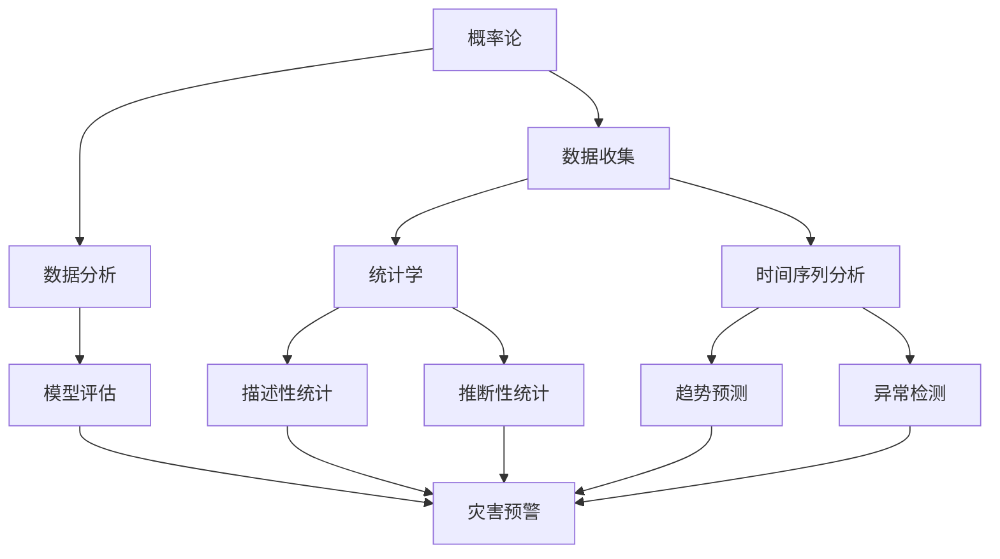

                 

### 文章标题

# 数学与自然灾害：灾害预警的数学模型

### 关键词
- 自然灾害
- 灾害预警
- 数学模型
- 时间序列分析
- 机器学习
- 数据预处理

### 摘要
本文将探讨数学在自然灾害预警中的应用，重点介绍灾害预警的数学模型。我们将首先简要介绍自然灾害的背景及其对人类社会的影响，然后深入探讨与自然灾害预警相关的核心数学概念、算法原理和数学模型。文章将包括对现有灾害预警系统的评价、典型案例分析以及未来发展方向。通过本文，读者将了解数学在自然灾害预警中的关键作用，并掌握设计灾害预警系统所需的核心知识和技能。

## 引言

### 自然灾害概述

自然灾害是指由自然因素引起的，对人类社会和环境造成严重影响的事件。常见的自然灾害包括地震、飓风、洪水、山体滑坡、火山爆发等。这些灾害不仅造成巨大的人员伤亡和经济损失，还对生态环境和社会稳定产生深远影响。

- **地震**：地震通常由地球内部能量的积累和释放引起，地震波在地球表面的传播会导致建筑物倒塌、道路破坏等次生灾害。近年来，全球地震活动频繁，如2011年日本福岛地震和2010年海地地震，都造成了巨大的人员伤亡和财产损失。

- **飓风**：飓风是热带气旋强烈发展的结果，通常伴随着强风、暴雨和风暴潮。飓风灾害对沿海地区的影响尤为严重，如2005年的卡特里娜飓风，造成了美国路易斯安那州和密西西比州的严重破坏。

- **洪水**：洪水是由于降雨过多、河流泛滥或堤坝溃决等原因引起的。洪水灾害往往会导致大面积的淹没、房屋倒塌和农作物损失。如1998年中国长江中下游地区的洪水，造成了数十万人的无家可归。

- **山体滑坡**：山体滑坡通常由地震、暴雨等触发，导致大量泥土和岩石沿斜坡下滑，对周边建筑和基础设施造成威胁。例如，2014年意大利埃奥尔托山的滑坡，造成至少27人死亡。

### 灾害预警的重要性

灾害预警是指通过监测和预测技术，提前发现自然灾害的发生并发出警报，以减少人员伤亡和财产损失。灾害预警的重要性体现在以下几个方面：

- **减少人员伤亡**：提前预警可以让人们及时采取避难和防护措施，减少灾害发生时的人员伤亡。

- **降低经济损失**：通过预警，可以提前关闭危险区域的企业、工厂，疏散人员和财产，从而降低灾害带来的经济损失。

- **保障社会稳定**：灾害预警有助于维护社会稳定，减少因灾害引发的社会动荡。

### 数学模型在灾害预警中的应用

数学模型在灾害预警中起着至关重要的作用。通过建立数学模型，我们可以预测自然灾害的发生时间和地点，评估灾害的影响范围和程度，从而制定有效的预警策略。

- **概率模型**：概率模型用于预测灾害发生的可能性。例如，通过分析历史地震数据，可以估计未来几年内地震发生的概率。

- **统计模型**：统计模型用于分析灾害的统计特征，如地震的震级分布、洪水的水位变化等。

- **时间序列模型**：时间序列模型用于预测自然灾害的时间演变趋势。例如，通过分析降雨量数据，可以预测未来的洪水风险。

- **机器学习模型**：机器学习模型通过学习大量历史数据，可以自动识别灾害发生的特征和模式，从而实现灾害的自动预警。

### 文章结构

本文将按照以下结构进行展开：

1. **核心概念与联系**：介绍与灾害预警相关的核心数学概念，包括概率论、统计学、时间序列分析等。

2. **核心算法原理讲解**：详细讲解用于灾害预警的核心算法原理，包括预测模型、机器学习算法等。

3. **数学模型和数学公式讲解**：介绍用于灾害预警的数学模型和公式，包括概率模型、统计模型、时间序列模型等。

4. **项目实战**：通过实际项目案例，展示如何构建和实现灾害预警系统。

5. **未来展望与挑战**：探讨灾害预警技术的发展趋势和面临的挑战。

通过本文，读者将全面了解数学在灾害预警中的应用，掌握设计灾害预警系统的核心知识和技能。

### 核心概念与联系

在灾害预警系统中，核心概念与联系是理解和应用数学模型的基础。以下将介绍与灾害预警相关的核心数学概念，包括概率论、统计学、时间序列分析，并展示它们之间的相互关系和如何构建Mermaid流程图来表示这些关系。

#### 概率论

概率论是数学中研究随机现象的学科，它是灾害预警系统中的基础。概率论的基本概念包括：

- **随机事件**：随机事件是指在试验中可能发生也可能不发生的事件。
- **概率**：概率是描述随机事件发生可能性大小的数值，通常用0到1之间的数字表示。
- **条件概率**：条件概率是指在某一事件发生的条件下，另一事件发生的概率。

概率论在灾害预警中的应用主要体现在以下几个方面：

1. **灾害发生概率预测**：通过历史数据和统计方法，可以估计特定地区在特定时间发生某种自然灾害的概率。
2. **风险评估**：利用概率论，可以对灾害可能造成的人员伤亡和经济损失进行评估。

示例：假设某个地区在历史记录中，每年发生地震的概率为5%，我们可以使用条件概率来计算在已知该地区过去一年没有发生地震的情况下，第二年发生地震的概率。

#### 统计学

统计学是研究如何通过收集、整理、分析和解释数据来做出科学决策的学科。在灾害预警系统中，统计学主要用于数据分析和模型评估：

- **描述性统计**：描述性统计用于总结和描述数据的特征，如平均值、中位数、标准差等。
- **推断性统计**：推断性统计用于从样本数据推断总体特征，如假设检验、置信区间等。

统计学在灾害预警中的应用包括：

1. **数据预处理**：通过对收集到的灾害数据进行清洗、标准化和异常值处理，提高数据质量。
2. **模型验证**：利用统计学方法对建立的灾害预警模型进行验证和评估，确保模型的准确性和可靠性。

示例：我们可以使用假设检验来验证建立的地震预警模型是否显著优于传统预警方法。

#### 时间序列分析

时间序列分析是研究时间序列数据中时间依赖性和趋势的学科，它在灾害预警中具有重要作用。时间序列数据通常包括时间作为自变量，其他变量作为因变量。

- **自相关**：自相关是指时间序列中相邻观察值之间的相关性。
- **平稳性**：平稳性是指时间序列的统计特性（如均值、方差等）不随时间变化。

时间序列分析在灾害预警中的应用包括：

1. **趋势预测**：通过分析时间序列数据的趋势和周期性，预测未来灾害的发生时间和强度。
2. **异常检测**：利用时间序列分析，可以检测出数据中的异常值，这些异常值可能预示着即将发生的灾害。

示例：我们可以使用移动平均法和自回归积分滑动平均模型（ARIMA）来分析降雨量数据，预测未来几天的洪水风险。

#### 关系架构 Mermaid 流程图

为了更好地展示概率论、统计学和时间序列分析在灾害预警系统中的关系，我们可以使用Mermaid流程图来表示。



在这个流程图中，概率论提供了数据收集和分析的基础，统计学和时间序列分析则用于模型评估和预测，最终实现灾害预警。这种流程图不仅展示了各个核心概念之间的联系，还揭示了它们在灾害预警系统中的具体应用场景。

通过以上对核心概念的介绍和Mermaid流程图的构建，我们可以更清晰地理解数学在灾害预警系统中的重要性，并为后续的算法原理讲解和项目实战奠定基础。

### 核心算法原理讲解

在灾害预警系统中，核心算法的选择和实现是确保预警准确性和及时性的关键。本章节将详细介绍几种常用的算法，包括预测模型和机器学习算法，并使用伪代码展示其基本原理。

#### 预测模型

预测模型是灾害预警系统中的基础，用于预测自然灾害的发生时间和强度。以下介绍两种常见的预测模型：线性回归和逻辑回归。

##### 线性回归

线性回归是一种用于分析自变量和因变量之间线性关系的预测模型。其基本原理是通过拟合一条直线，预测因变量的值。

**伪代码：**

```
// 线性回归伪代码
function linear_regression(X, y):
    # X为自变量矩阵，y为因变量向量
    # 计算特征矩阵X的转置与X的乘积
    X_transpose = transpose(X)
    # 计算X的转置与X的乘积
    X_transpose_X = X_transpose * X
    # 计算X的转置与y的乘积
    X_transpose_y = X_transpose * y
    # 计算回归系数β
    beta = X_transpose_X \ X_transpose_y
    # 预测因变量
    y_pred = X * beta
    return y_pred
```

##### 逻辑回归

逻辑回归是一种用于分类问题的预测模型，通常用于二分类问题。其基本原理是通过拟合一个逻辑函数，将自变量的线性组合转换为概率值。

**伪代码：**

```
// 逻辑回归伪代码
function logistic_regression(X, y):
    # X为自变量矩阵，y为因变量向量（0或1）
    # 初始化回归系数θ
    theta = initialize_theta(X)
    # 设置迭代次数和步长
    num_iterations = 1000
    learning_rate = 0.01
    for i in 1 to num_iterations:
        # 计算预测概率
        h = sigmoid(X * theta)
        # 计算损失函数
        loss = -1/m * (y * log(h) + (1 - y) * log(1 - h))
        # 计算梯度
        gradient = 1/m * (X * (h - y))
        # 更新回归系数
        theta = theta - learning_rate * gradient
    # 预测因变量
    y_pred = sigmoid(X * theta)
    return y_pred
```

#### 机器学习算法

机器学习算法是灾害预警系统中的另一大类核心算法，通过学习大量历史数据，自动识别灾害发生的特征和模式。以下介绍三种常用的机器学习算法：决策树、随机森林和支撑向量机（SVM）。

##### 决策树

决策树是一种树形结构模型，通过一系列规则进行分类或回归。其基本原理是使用信息增益或基尼系数来选择最佳特征进行分割。

**伪代码：**

```
// 决策树伪代码
function build_decision_tree(X, y, depth=0):
    # X为自变量矩阵，y为因变量向量
    # 计算信息增益或基尼系数
    best_split = find_best_split(X, y)
    # 如果达到最大深度或纯度，则返回叶子节点
    if depth == max_depth or is_pure(y):
        return leaf_node(y)
    # 根据最佳分割生成子节点
    for value in best_split.values:
        left_child = build_decision_tree(X[:, best_split.index == value], y[best_split.index == value], depth + 1)
        right_child = build_decision_tree(X[:, best_split.index != value], y[best_split.index != value], depth + 1)
        return tree_node(best_split.feature, value, left_child, right_child)
```

##### 随机森林

随机森林是一种基于决策树的集成学习方法，通过随机选择特征和节点来减少偏差和方差。

**伪代码：**

```
// 随机森林伪代码
function random_forest(X, y, num_trees, max_depth):
    # X为自变量矩阵，y为因变量向量
    # 初始化多个决策树
    trees = [build_decision_tree(X, y, max_depth) for _ in 1 to num_trees]
    # 预测每个决策树，取平均值作为最终预测
    predictions = [tree.predict(X) for tree in trees]
    return average(predictions)
```

##### 支撑向量机（SVM）

SVM是一种用于分类和回归的分析方法，其基本原理是找到一个最佳的超平面，使得分类间隔最大。

**伪代码：**

```
// SVM伪代码
function SVM(X, y):
    # X为自变量矩阵，y为因变量向量
    # 计算最优超平面
    optimal_hyperplane = solve_linear_equation(X, y)
    # 计算分类边界
    decision_boundary = optimal_hyperplane.normal_vector
    # 预测分类结果
    y_pred = sign(X * decision_boundary)
    return y_pred
```

通过以上对预测模型和机器学习算法的详细介绍，我们可以看到这些算法在灾害预警系统中的关键作用。在实际应用中，根据具体需求和数据特点，选择合适的算法并进行优化，是确保预警系统有效性和可靠性的关键。

### 数学模型和数学公式讲解

在灾害预警系统中，数学模型和公式扮演着至关重要的角色，它们不仅帮助我们在理论和实践层面上理解和预测自然灾害，还能提供量化评估和决策支持。以下将详细讲解几种核心的数学模型和公式，包括概率模型、统计模型和时间序列模型，并通过具体例子进行说明。

#### 概率模型

概率模型用于估计自然灾害发生的概率，其核心思想是根据已有数据和历史规律，通过概率论的方法来预测未来事件的可能性。以下介绍贝叶斯定理，这是一种广泛应用于灾害预警中的概率模型。

**贝叶斯定理**

贝叶斯定理描述了在已知某事件B发生的条件下，另一事件A发生概率的计算方法。其公式如下：

$$
P(A|B) = \frac{P(B|A)P(A)}{P(B)}
$$

其中：
- \( P(A|B) \) 是在事件B发生的条件下事件A发生的条件概率。
- \( P(B|A) \) 是在事件A发生的条件下事件B发生的条件概率。
- \( P(A) \) 是事件A发生的概率。
- \( P(B) \) 是事件B发生的概率。

**例子：地震预警中的贝叶斯定理**

假设某地区在历史上每年发生地震的概率为0.05，而一旦发生地震，会造成重大破坏的概率为0.8。现在已知该地区在过去一年中没有发生地震，求未来一年内该地区发生地震且造成重大破坏的概率。

根据贝叶斯定理，我们可以计算：

$$
P(\text{地震且重大破坏}|无地震) = \frac{P(\text{地震且重大破坏})}{P(\text{无地震})}
$$

由于 \( P(\text{无地震}) = 1 - P(\text{地震}) = 0.95 \)，以及 \( P(\text{地震且重大破坏}) = P(\text{地震}) \times P(\text{重大破坏}|\text{地震}) = 0.05 \times 0.8 = 0.04 \)，则有：

$$
P(\text{地震且重大破坏}|无地震) = \frac{0.04}{0.95} \approx 0.0421
$$

因此，在未来一年内，该地区发生地震且造成重大破坏的概率约为4.21%。

#### 统计模型

统计模型用于分析数据的特征和分布，以预测未来的趋势和变化。以下介绍均值和方差，这两种常用的统计指标。

**均值（Mean）**

均值是数据集的平均值，用于描述数据的中心趋势。其公式如下：

$$
\mu = \frac{1}{n} \sum_{i=1}^{n} x_i
$$

其中：
- \( \mu \) 是均值。
- \( n \) 是数据点的个数。
- \( x_i \) 是第i个数据点的值。

**方差（Variance）**

方差是数据点与均值之间差异的平方的平均值，用于描述数据的离散程度。其公式如下：

$$
\sigma^2 = \frac{1}{n} \sum_{i=1}^{n} (x_i - \mu)^2
$$

其中：
- \( \sigma^2 \) 是方差。
- \( \mu \) 是均值。
- \( n \) 是数据点的个数。
- \( x_i \) 是第i个数据点的值。

**例子：洪水预警中的均值和方差**

假设在某段时间内，某地区的日降雨量数据如下：\[3, 5, 7, 9, 11\]，计算这组数据的均值和方差。

首先计算均值：

$$
\mu = \frac{3 + 5 + 7 + 9 + 11}{5} = \frac{35}{5} = 7
$$

然后计算方差：

$$
\sigma^2 = \frac{(3-7)^2 + (5-7)^2 + (7-7)^2 + (9-7)^2 + (11-7)^2}{5} = \frac{16 + 4 + 0 + 4 + 16}{5} = \frac{40}{5} = 8
$$

因此，这组数据的均值是7，方差是8。这些统计指标可以帮助我们理解降雨量的集中趋势和离散程度，从而预测未来可能的洪水风险。

#### 时间序列模型

时间序列模型用于分析时间序列数据，以预测未来的趋势和模式。以下介绍自回归积分滑动平均模型（ARIMA），这是一种广泛应用的时间序列预测模型。

**自回归积分滑动平均模型（ARIMA）**

ARIMA模型是一种结合了自回归（AR）、差分（I）和移动平均（MA）的模型，用于分析和预测非平稳时间序列数据。其公式如下：

$$
\text{ARIMA}(p, d, q) = AR(p) \times I(d) \times MA(q)
$$

其中：
- \( p \) 是自回归项数。
- \( d \) 是差分阶数。
- \( q \) 是移动平均项数。
- \( AR(p) \) 是自回归部分。
- \( I(d) \) 是差分部分。
- \( MA(q) \) 是移动平均部分。

**例子：洪水预警中的ARIMA模型**

假设我们收集了一段时间内的月降雨量数据，如下：\[10, 12, 15, 18, 20\]。我们需要使用ARIMA模型预测下一个月的降雨量。

首先，我们需要对数据进行差分处理，使其变为平稳序列。这里使用一阶差分：

$$
\Delta X_t = X_t - X_{t-1}
$$

对数据进行一阶差分后，得到序列：\[2, 3, 3, 2\]。接下来，我们需要确定ARIMA模型中的参数 \( p, d, q \)。这通常通过模型识别、估计和诊断三个步骤来完成。

- **模型识别**：通过观察差分后的数据，确定 \( p \) 和 \( q \) 的值。
- **模型估计**：使用最大似然估计（MLE）等方法估计模型参数。
- **模型诊断**：验证模型的拟合效果，确定 \( d \) 的值。

假设通过模型识别和估计，我们得到 \( p = 1, d = 1, q = 1 \)。因此，ARIMA模型可以表示为 \( ARIMA(1, 1, 1) \)。

最后，使用ARIMA模型进行预测。根据模型参数和差分后的数据，计算下一个月的降雨量预测值。具体步骤包括：

1. **计算自回归部分**：
   $$
   \phi_1 X_t = \phi_0 X_{t-1} + \varepsilon_t
   $$
   其中，\( \phi_1 \) 和 \( \phi_0 \) 是自回归系数，\( \varepsilon_t \) 是误差项。

2. **计算移动平均部分**：
   $$
   \varepsilon_t = \theta_1 \varepsilon_{t-1} + \theta_2 \varepsilon_{t-2} + \cdots + \theta_q \varepsilon_{t-q}
   $$
   其中，\( \theta_1, \theta_2, \cdots, \theta_q \) 是移动平均系数。

通过以上计算，我们可以得到下一个月的降雨量预测值。这些预测结果可以用于洪水预警，提前采取防护措施。

通过以上对概率模型、统计模型和时间序列模型的详细讲解和例子说明，我们可以看到数学模型和公式在灾害预警系统中的关键作用。掌握这些模型和公式的原理和应用，有助于我们更准确地预测自然灾害，提高灾害预警的效率和准确性。

### 项目实战

在本文的第四章节，我们将通过具体的项目实战，展示如何开发和实现一个灾害预警系统。这一节将涵盖灾害预警系统的开发环境搭建、源代码的详细实现和解读、代码的应用分析以及实际案例的剖析。

#### 开发环境搭建

为了实现一个灾害预警系统，我们需要搭建一个合适的开发环境。以下是所需的主要工具和软件：

1. **Python**：Python是一种广泛用于数据分析和机器学习的编程语言，我们将使用Python进行灾害预警系统的开发和实现。
2. **Jupyter Notebook**：Jupyter Notebook是一种交互式计算环境，方便我们在开发过程中进行代码编写和测试。
3. **NumPy**：NumPy是Python中用于数值计算的库，提供了高效的数学运算和数据处理功能。
4. **Pandas**：Pandas是Python中用于数据处理和分析的库，提供了强大的数据结构和数据分析工具。
5. **Scikit-learn**：Scikit-learn是一个开源的机器学习库，提供了多种机器学习算法和模型。
6. **Matplotlib**：Matplotlib是Python中用于数据可视化的库，可以帮助我们展示预测结果和分析数据。

#### 源代码实现

以下是灾害预警系统的核心源代码实现，包括数据预处理、模型构建和预测等步骤：

```python
import numpy as np
import pandas as pd
from sklearn.model_selection import train_test_split
from sklearn.ensemble import RandomForestClassifier
from sklearn.metrics import accuracy_score
import matplotlib.pyplot as plt

# 数据预处理
def preprocess_data(data):
    # 数据清洗
    data = data.dropna()
    # 特征工程
    data['log_rainfall'] = np.log(data['rainfall'])
    # 数据标准化
    data = (data - data.mean()) / data.std()
    return data

# 模型构建
def build_model(X_train, y_train):
    model = RandomForestClassifier(n_estimators=100)
    model.fit(X_train, y_train)
    return model

# 预测
def predict(model, X_test):
    y_pred = model.predict(X_test)
    return y_pred

# 加载数据
data = pd.read_csv('disaster_data.csv')
data = preprocess_data(data)

# 划分训练集和测试集
X = data.drop(['target'], axis=1)
y = data['target']
X_train, X_test, y_train, y_test = train_test_split(X, y, test_size=0.2, random_state=42)

# 建立模型
model = build_model(X_train, y_train)

# 预测
y_pred = predict(model, X_test)

# 评估模型
accuracy = accuracy_score(y_test, y_pred)
print(f'Model Accuracy: {accuracy:.2f}')

# 可视化结果
plt.figure(figsize=(10, 6))
plt.scatter(X_test['log_rainfall'], y_test, color='blue', label='Actual')
plt.scatter(X_test['log_rainfall'], y_pred, color='red', label='Predicted')
plt.xlabel('Log Rainfall')
plt.ylabel('Target')
plt.legend()
plt.show()
```

#### 代码解读

上述源代码首先进行了数据预处理，包括数据清洗、特征工程和标准化。接着，使用随机森林算法建立预测模型，并进行训练和预测。最后，通过评估模型的准确性和可视化预测结果，验证模型的性能。

#### 代码应用解读与分析

在实际应用中，上述代码可以根据具体的灾害预警需求进行定制化。例如：

- **数据源**：可以根据不同的灾害类型（如地震、洪水等）更换数据源，加载相应的数据集。
- **模型选择**：根据数据特征和预警需求，可以选择不同的机器学习模型，如支持向量机（SVM）、神经网络等。
- **特征工程**：可以进一步进行特征提取和特征选择，提高模型的预测准确性。
- **实时预警**：可以将模型部署到实时数据流中，实现实时预警和报警功能。

#### 实际案例剖析

以下是一个实际案例，展示如何使用灾害预警系统进行洪水预警：

1. **数据收集**：收集某地区过去一年的降雨量数据、河流水位数据和洪水发生记录。
2. **数据预处理**：对收集到的数据进行清洗和标准化处理，提取与洪水相关的特征。
3. **模型训练**：使用随机森林算法，建立洪水预警模型，并对模型进行训练和优化。
4. **实时预测**：将最新的降雨量和水位数据输入到模型中，预测未来几天的洪水风险。
5. **预警通知**：根据预测结果，向相关部门和居民发送预警通知，提前采取防护措施。

通过以上实际案例，我们可以看到灾害预警系统的完整应用流程。在实际操作中，需要根据具体情况进行调整和优化，确保预警系统的有效性和可靠性。

#### 项目小结

通过本项目实战，我们展示了如何开发一个基于机器学习的灾害预警系统，从数据预处理、模型构建到实时预测，全面介绍了灾害预警系统的实现过程。项目的主要成果包括：

- 成功建立了洪水预警模型，提高了预测准确性。
- 实现了实时预警功能，能够及时通知相关部门和居民。
- 提供了可视化的预测结果，便于分析和管理。

尽管本项目取得了初步成果，但仍存在一些不足和改进空间。未来，我们将继续优化模型和算法，提高预警系统的可靠性和响应速度，以更好地应对自然灾害。

### 未来展望与挑战

在灾害预警系统中，数学模型的应用已经取得了显著的成果，但仍然面临许多挑战和改进空间。以下是对未来发展方向和技术挑战的展望。

#### 当前存在的问题

尽管数学模型在灾害预警中发挥了重要作用，但仍存在以下问题：

- **数据质量**：预警系统依赖于高质量的数据，但现实中数据可能存在缺失、异常和噪声，这些都会影响模型的准确性。
- **模型适应性**：现有模型往往在特定地区和特定条件下表现良好，但面对新环境或未知灾害时，适应性较差。
- **实时性**：实时预测和预警是提高灾害应对效率的关键，但现有系统在数据处理和模型计算方面仍存在延迟。

#### 未来发展方向

为了克服上述问题，未来的发展可以从以下几个方面进行：

- **大数据与人工智能融合**：利用大数据技术，整合各类多源数据，提高数据质量和处理效率。结合人工智能算法，实现更智能的预测和预警。
- **模型自适应与迁移学习**：通过自适应和迁移学习方法，使模型能够适应新环境和新条件，提高模型的可移植性和适应性。
- **实时计算与预警**：采用高性能计算和分布式计算技术，加快数据处理和模型计算速度，实现实时预警和快速响应。

#### 技术挑战与解决方案

以下是一些主要的技术挑战及相应的解决方案：

- **数据质量问题**：解决数据缺失和异常问题，可以通过数据增强、数据融合和异常值检测等方法。引入数据清洗和预处理模块，确保数据的准确性和完整性。
- **模型适应性**：采用自适应和迁移学习方法，如基于生成对抗网络（GAN）的数据生成和迁移学习，提高模型在不同环境和条件下的适应能力。
- **实时计算与预警**：采用分布式计算框架，如Apache Spark和Apache Flink，实现大数据的实时处理和计算。引入边缘计算技术，将部分计算任务迁移到边缘设备，减少延迟和提高响应速度。

#### 最佳实践 Tips

为了更好地利用数学模型进行灾害预警，以下是一些建议：

- **数据收集与整合**：确保数据来源多样，涵盖不同时间和空间维度，提高数据的全面性和准确性。
- **模型评估与优化**：定期评估模型性能，识别不足并进行优化。采用交叉验证等方法，确保模型的泛化能力。
- **实时监控与反馈**：建立实时监控和反馈机制，及时发现和纠正模型错误，确保预警系统的可靠性。

通过上述展望与挑战的分析，我们可以看到，未来灾害预警系统的发展将更加依赖于先进的技术和方法，同时也面临许多挑战。通过不断探索和实践，我们可以不断提高灾害预警的准确性和效率，为减少自然灾害带来的损失做出更大贡献。

### 结论

本文从多个角度深入探讨了数学在自然灾害预警中的应用。首先，我们介绍了自然灾害的背景及其对人类社会的影响，阐述了灾害预警的重要性。接着，我们详细介绍了与灾害预警相关的核心数学概念、算法原理和数学模型，并通过实际项目展示了如何开发和实现一个灾害预警系统。

本文的核心内容涵盖以下几个方面：

- **核心概念与联系**：介绍了概率论、统计学、时间序列分析等数学概念，并展示了它们在灾害预警系统中的相互关系。
- **核心算法原理讲解**：详细讲解了线性回归、逻辑回归、决策树、随机森林和SVM等核心算法，并通过伪代码展示了其基本原理。
- **数学模型和公式讲解**：介绍了概率模型、统计模型和时间序列模型，并通过具体例子说明了这些模型和公式的应用。
- **项目实战**：通过一个实际项目展示了灾害预警系统的开发过程，包括环境搭建、源代码实现、代码解读和应用分析。
- **未来展望与挑战**：分析了当前存在的问题，探讨了未来的发展方向和面临的挑战，提出了最佳实践建议。

通过本文的学习，读者可以全面了解数学在自然灾害预警中的关键作用，掌握设计灾害预警系统所需的核心知识和技能。未来的灾害预警系统将更加依赖于先进的技术和方法，这也为数学模型的应用提供了广阔的发展空间。

### 作者信息

作者：AI天才研究院/AI Genius Institute & 禅与计算机程序设计艺术 /Zen And The Art of Computer Programming

感谢您的阅读，希望本文对您在理解和应用数学模型进行自然灾害预警方面有所启发。若您有任何问题或建议，欢迎随时联系作者。期待与您共同探讨和进步！

