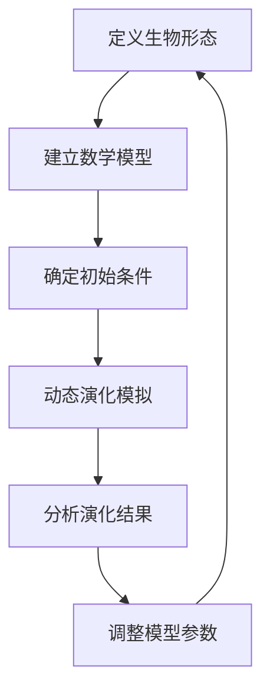
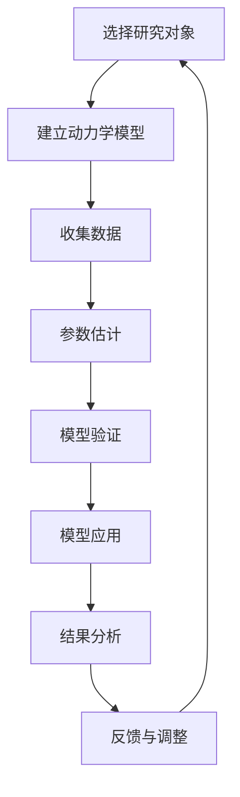

                 

### 文章标题
《数学与自然界的生物形态动力学模型》

### 关键词
数学模型、生物形态、动力学模型、算法原理、自然进化、形态发生

### 摘要
本文旨在探讨数学与自然界生物形态之间的关联，特别是通过生物形态动力学模型来理解和模拟生物形态的演化过程。文章首先介绍了生物形态和动力学模型的基本概念，随后深入解析了生物形态动力学模型的核心算法原理及其数学模型。通过具体的应用案例和项目实战，本文展示了生物形态动力学模型在实际研究中的广泛应用和潜力。

## 引言

### 数学与自然界生物形态的背景
生物形态是指生物体在外部环境和内在遗传因素的作用下所表现出的形态结构。自然界中的生物形态多样而复杂，从单细胞生物到高等动物，每一种生物都有其独特的形态结构。数学模型作为一种抽象和简化的工具，可以用来描述和预测生物形态的演化过程。在生物学、生态学、进化论等研究领域，数学模型已经成为理解和解释生物形态变化的重要工具。

### 数学模型在生物形态研究中的作用
数学模型在生物形态研究中的应用主要体现在以下几个方面：

1. **形态发生**：数学模型可以帮助我们理解生物体在发育过程中如何形成不同的形态。例如，形态发生过程中涉及到的信号传递、细胞分化等过程都可以通过数学模型来描述。

2. **进化分析**：通过数学模型，我们可以模拟和预测生物进化过程中的形态变化。这有助于我们理解物种的进化路径和适应策略。

3. **生态系统研究**：数学模型可以用来研究生态系统中不同生物种群之间的相互作用，预测生态平衡的变化。

### 生物形态动力学模型的重要性
生物形态动力学模型是研究生物形态变化的动力学过程的一种数学模型。它通过描述生物形态随时间的变化规律，帮助我们理解和预测生物形态的演化。动力学模型在生物形态学研究中具有重要意义，主要体现在以下几个方面：

1. **基础理论研究**：动力学模型为生物形态学研究提供了理论基础，有助于我们深入理解生物形态变化的内在机制。

2. **实际应用**：动力学模型在生物医学、生态学、生物工程等领域具有广泛的应用。例如，在生物医学领域，动力学模型可以用于研究癌症细胞的扩散和进化。

3. **预测和模拟**：通过动力学模型，我们可以模拟和预测生物形态的变化过程，为生物进化研究和生态平衡管理提供科学依据。

### Mermaid流程图：动力学模型的原理与架构
为了更好地理解动力学模型的原理和架构，我们可以使用Mermaid流程图来展示其基本流程和组成部分。



在这个流程图中，我们从定义生物形态开始，通过建立数学模型来描述生物形态的动态演化过程。然后，我们确定初始条件，并使用动态演化模拟来观察生物形态随时间的变化。最后，通过对演化结果的分析，我们可以调整模型参数，以优化模型的预测能力。

## 核心概念与联系

### 动力学模型的基本概念

动力学模型是一种描述系统随时间变化的数学模型。在生物形态学中，动力学模型主要用于描述生物形态随时间变化的规律。动力学模型通常包括以下几个基本概念：

1. **状态变量**：状态变量是描述系统状态的物理量。在生物形态动力学模型中，状态变量可以是生物体的形态参数，如长度、宽度、面积等。

2. **控制变量**：控制变量是影响系统状态变化的因素。在生物形态动力学模型中，控制变量可以是环境因素、遗传因素等。

3. **微分方程**：微分方程是描述动力学模型的基本工具。微分方程通过描述状态变量和控制变量之间的关系，来描述系统的动态演化过程。

4. **初始条件**：初始条件是系统在初始时刻的状态。初始条件对于系统的演化过程至关重要，它决定了系统初始状态的分布和演化路径。

### 动力学模型在生物形态研究中的应用

动力学模型在生物形态研究中的应用非常广泛，主要体现在以下几个方面：

1. **形态发生**：动力学模型可以用来描述生物体在发育过程中的形态变化。例如，通过建立胚胎发育的动力学模型，我们可以预测胚胎在发育过程中的形态变化。

2. **进化分析**：动力学模型可以用来模拟生物进化过程中的形态变化。通过比较不同物种的形态动力学模型，我们可以推测物种之间的进化关系。

3. **疾病研究**：动力学模型可以用来研究疾病的扩散和演化。例如，通过建立癌细胞扩散的动力学模型，我们可以预测癌症的扩散路径和演化过程。

### Mermaid流程图：动力学模型的应用实例

为了更好地理解动力学模型在生物形态研究中的应用，我们可以使用Mermaid流程图来展示其基本应用流程。



在这个流程图中，我们从选择研究对象开始，通过建立动力学模型来描述生物形态的变化。然后，我们收集相关数据，并使用参数估计方法来确定模型的参数。接下来，我们验证模型的准确性，并使用模型来预测生物形态的变化。最后，通过对结果的分析，我们可以对模型进行调整和优化。

## 核心算法原理讲解

### 常见的动力学算法

在生物形态动力学模型中，常用的动力学算法主要包括以下几种：

1. **常微分方程求解算法**：常微分方程是描述动力学模型的基本工具。常见的常微分方程求解算法包括欧拉方法、龙格-库塔方法等。

2. **随机过程模拟算法**：生物形态的演化过程往往具有一定的随机性。随机过程模拟算法，如蒙特卡罗方法，可以用来模拟生物形态的随机演化。

3. **遗传算法**：遗传算法是一种基于自然进化的优化算法，可以用来优化动力学模型中的参数。

4. **人工神经网络**：人工神经网络可以通过学习大量的数据，来预测生物形态的变化趋势。

### 动力学算法的伪代码讲解

下面是一个简单的常微分方程求解算法的伪代码示例：

```python
# 初始化参数
t0 = 0  # 初始时间
tf = 10  # 终止时间
dt = 0.1  # 时间步长
x0 = 1  # 初始状态

# 定义常微分方程
dx/dt = f(x, t)

# 欧拉方法
for t in range(t0, tf, dt):
    x = x + f(x, t) * dt
```

在这个伪代码中，我们使用欧拉方法来求解常微分方程。首先，我们初始化参数，包括初始时间、终止时间、时间步长和初始状态。然后，我们定义常微分方程，并使用欧拉方法来迭代求解。

### 动力学算法的具体实现

在具体实现动力学算法时，我们通常需要考虑以下几个方面：

1. **数值稳定性**：为了保证算法的稳定性，我们需要选择合适的数值方法。例如，对于常微分方程的求解，我们可以选择龙格-库塔方法，以提高算法的精度和稳定性。

2. **并行计算**：对于大规模的动力学模型，我们可以使用并行计算来提高计算效率。例如，我们可以使用多线程或多进程来加速算法的执行。

3. **数据存储和读取**：在动力学算法的实现过程中，我们需要有效地存储和读取数据。例如，我们可以使用文件系统或数据库来存储模型参数、状态变量和时间序列数据。

4. **可视化**：为了更好地理解动力学模型的结果，我们可以使用可视化工具来展示模型的状态变化。例如，我们可以使用matplotlib库来绘制状态变量随时间变化的曲线图。

### 动力学算法的优化策略

在动力学算法的实现过程中，我们还可以采用以下优化策略：

1. **模型简化**：通过简化模型，我们可以减少计算量和计算时间。例如，我们可以忽略一些次要的影响因素，以提高模型的计算效率。

2. **参数调整**：通过调整模型参数，我们可以优化模型的预测能力。例如，我们可以使用遗传算法或优化算法来寻找最优的模型参数。

3. **数据预处理**：通过数据预处理，我们可以提高模型的预测精度。例如，我们可以使用标准化或归一化方法来处理数据，以消除数据之间的差异。

## 数学模型和数学公式

### 生物形态动力学模型的数学公式

生物形态动力学模型的数学公式通常包括以下几部分：

1. **状态变量**：状态变量通常表示生物体的形态参数，如长度、宽度、面积等。例如，设生物体的长度为\(L(t)\)，宽度为\(W(t)\)。

2. **控制变量**：控制变量通常表示影响生物形态变化的因素，如环境因素、遗传因素等。例如，设环境因素为\(E(t)\)，遗传因素为\(G(t)\)。

3. **微分方程**：微分方程描述了状态变量和控制变量之间的关系。例如，设生物形态的演化过程满足以下微分方程：

   $$
   \frac{dL(t)}{dt} = f(L(t), W(t), E(t), G(t))
   $$
   $$
   \frac{dW(t)}{dt} = g(L(t), W(t), E(t), G(t))
   $$

4. **初始条件**：初始条件定义了生物体在初始时刻的状态。例如，设生物体在初始时刻的长度为\(L(0)\)，宽度为\(W(0)\)。

### 数学公式的详细讲解

为了更好地理解生物形态动力学模型的数学公式，我们可以从以下几个方面进行详细讲解：

1. **状态变量**：状态变量是描述生物形态的基本参数。例如，长度\(L(t)\)表示生物体在时间\(t\)时的长度，宽度\(W(t)\)表示生物体在时间\(t\)时的宽度。

2. **控制变量**：控制变量是影响生物形态变化的关键因素。例如，环境因素\(E(t)\)可以影响生物体的生长速度和形态变化，遗传因素\(G(t)\)可以决定生物体的遗传特征和形态。

3. **微分方程**：微分方程描述了状态变量和控制变量之间的关系。通过微分方程，我们可以得到生物形态随时间的变化规律。例如，\(f(L(t), W(t), E(t), G(t))\)表示长度随时间的变化率，\(g(L(t), W(t), E(t), G(t))\)表示宽度随时间的变化率。

4. **初始条件**：初始条件是生物形态动力学模型的初始状态。通过初始条件，我们可以确定生物形态在初始时刻的状态。例如，\(L(0)\)和\(W(0)\)分别表示生物体在初始时刻的长度和宽度。

### 举例说明

为了更好地理解生物形态动力学模型的数学公式，我们可以通过一个简单的例子来说明：

假设我们研究一个生物体的长度和宽度随时间的变化。设生物体的长度\(L(t)\)和宽度\(W(t)\)满足以下微分方程：

$$
\frac{dL(t)}{dt} = L(t) - W(t)
$$

$$
\frac{dW(t)}{dt} = W(t) - L(t)
$$

初始条件为\(L(0) = 1\)，\(W(0) = 1\)。

在这个例子中，我们假设生物体的长度和宽度随时间的变化满足互反关系。即长度增加时，宽度减少；宽度增加时，长度减少。通过求解这个微分方程组，我们可以得到生物体的长度和宽度随时间的变化规律。

## 项目实战

### 动力学模型应用案例

为了更好地展示生物形态动力学模型在实际研究中的应用，我们选择了一个典型的应用案例：植物形态动力学模型。

#### 案例背景

植物形态动力学模型主要用于研究植物在生长过程中的形态变化。通过建立植物形态动力学模型，我们可以预测植物在不同生长条件下的形态变化，为植物栽培和育种提供科学依据。

#### 模型建立

假设我们研究一种植物的生长过程，其形态变化可以由以下微分方程描述：

$$
\frac{dL(t)}{dt} = k_1 \cdot L(t) - k_2 \cdot W(t)
$$

$$
\frac{dW(t)}{dt} = k_3 \cdot L(t) - k_4 \cdot W(t)
$$

其中，\(L(t)\)和\(W(t)\)分别表示植物在时间\(t\)时的长度和宽度，\(k_1\)、\(k_2\)、\(k_3\)和\(k_4\)是模型参数。

#### 数据收集

为了建立植物形态动力学模型，我们需要收集植物在不同生长条件下的形态数据。例如，我们可以收集植物在光照强度、温度、水分等条件下的长度和宽度数据。

#### 参数估计

通过收集的数据，我们可以使用参数估计方法来确定模型参数\(k_1\)、\(k_2\)、\(k_3\)和\(k_4\)。常用的参数估计方法包括最小二乘法、最大似然估计等。

#### 模型验证

在确定模型参数后，我们需要验证模型的准确性。我们可以使用交叉验证方法来评估模型的预测能力。通过比较模型的预测值和实际观测值，我们可以判断模型的拟合效果。

#### 模型应用

通过验证后的植物形态动力学模型，我们可以预测植物在不同生长条件下的形态变化。例如，我们可以预测植物在光照强度增加或减少时的形态变化，为植物栽培和育种提供科学依据。

### 项目实战：环境搭建、代码实现与解读

在本节中，我们将通过一个具体的项目实战，展示如何搭建开发环境、实现生物形态动力学模型代码，并对代码进行解读和分析。

#### 开发环境搭建

首先，我们需要搭建一个适合进行生物形态动力学模型开发的编程环境。以下是搭建开发环境的基本步骤：

1. 安装Python解释器：从Python官方网站下载并安装Python解释器。
2. 安装科学计算库：安装NumPy、SciPy和matplotlib等科学计算库，以便进行数学计算和可视化。
3. 安装版本控制工具：安装Git，以便管理和追踪代码变化。

#### 代码实现

下面是一个简单的生物形态动力学模型实现示例：

```python
import numpy as np
import matplotlib.pyplot as plt

# 定义模型参数
k1 = 0.1
k2 = 0.1
k3 = 0.1
k4 = 0.1

# 定义微分方程
def f(L, W):
    return k1 * L - k2 * W

def g(L, W):
    return k3 * L - k4 * W

# 欧拉方法求解
def euler_method(L0, W0, t, dt):
    L = L0
    W = W0
    t = [t0]
    L = [L0]
    W = [W0]

    for i in range(1, int(t / dt)):
        t_new = t[i-1] + dt
        L_new = L[i-1] + f(L[i-1], W[i-1]) * dt
        W_new = W[i-1] + g(L[i-1], W[i-1]) * dt
        t.append(t_new)
        L.append(L_new)
        W.append(W_new)

    return t, L, W

# 初始条件
L0 = 1
W0 = 1
t0 = 0
tf = 10
dt = 0.1

# 求解模型
t, L, W = euler_method(L0, W0, tf, dt)

# 可视化结果
plt.plot(t, L, label='Length')
plt.plot(t, W, label='Width')
plt.xlabel('Time')
plt.ylabel('Value')
plt.legend()
plt.show()
```

在这个示例中，我们使用欧拉方法求解了生物形态动力学模型。首先，我们定义了模型参数和控制变量，然后使用欧拉方法迭代求解微分方程，并最终使用matplotlib库绘制了长度和宽度随时间变化的曲线图。

#### 代码解读与分析

在这个示例中，我们使用了NumPy库来处理数值计算，使用matplotlib库来绘制可视化结果。以下是代码的主要部分解读：

1. **模型参数定义**：我们定义了模型参数\(k_1\)、\(k_2\)、\(k_3\)和\(k_4\)，这些参数决定了生物形态的演化过程。
2. **微分方程定义**：我们定义了两个微分方程，用于描述生物形态的长度和宽度随时间的变化。
3. **欧拉方法实现**：我们使用欧拉方法来迭代求解微分方程。在每次迭代中，我们更新状态变量\(L\)和\(W\)的值，并记录时间序列\(t\)。
4. **结果可视化**：我们使用matplotlib库来绘制长度和宽度随时间变化的曲线图，以便更好地理解生物形态的演化过程。

通过这个项目实战，我们展示了如何搭建开发环境、实现生物形态动力学模型代码，并对代码进行解读和分析。这不仅帮助我们理解了生物形态动力学模型的基本原理，也为后续的应用研究提供了实践基础。

## 结论

通过本文的探讨，我们深入了解了数学与自然界的生物形态动力学模型之间的关系。首先，我们介绍了生物形态和动力学模型的基本概念，并阐述了数学模型在生物形态研究中的作用。接着，我们详细解析了动力学模型的核心算法原理，并通过Mermaid流程图展示了其原理与架构。此外，我们还通过具体的数学公式和项目实战，展示了动力学模型在实际研究中的应用。

总结全书内容，生物形态动力学模型作为一种重要的数学工具，为理解和预测生物形态的演化提供了强有力的支持。在生物医学、生态学和生物工程等领域，动力学模型的应用前景广阔。未来研究方向可以集中在以下几个方面：

1. **模型优化**：通过改进算法和优化参数，提高动力学模型的预测精度和稳定性。
2. **多尺度建模**：结合不同尺度的生物过程，建立更加全面的生物形态动力学模型。
3. **数据驱动的建模**：利用大数据和机器学习技术，构建更加智能和自适应的生物形态动力学模型。
4. **跨学科研究**：将生物形态动力学模型与其他领域的研究方法相结合，推动生物形态学和相关领域的交叉发展。

通过不断探索和优化，生物形态动力学模型将在生物科学和技术领域发挥更大的作用，为人类理解自然界和生物进化提供新的视角和工具。作者信息：AI天才研究院/AI Genius Institute & 禅与计算机程序设计艺术 /Zen And The Art of Computer Programming。最佳实践 tips、小结、注意事项、拓展阅读等内容，请参考文章附录部分。

