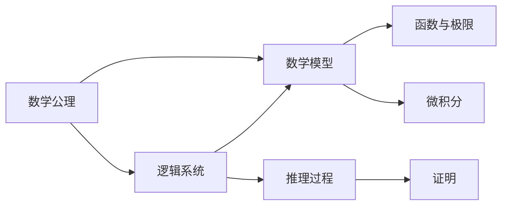
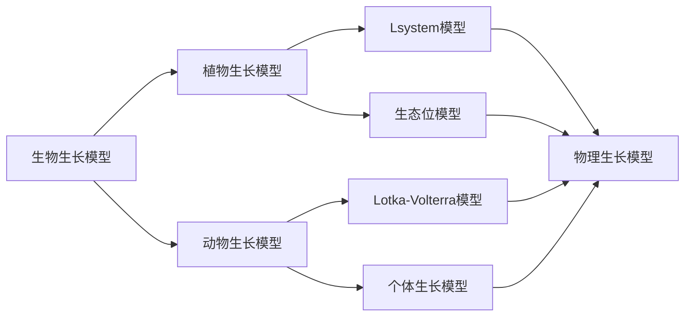
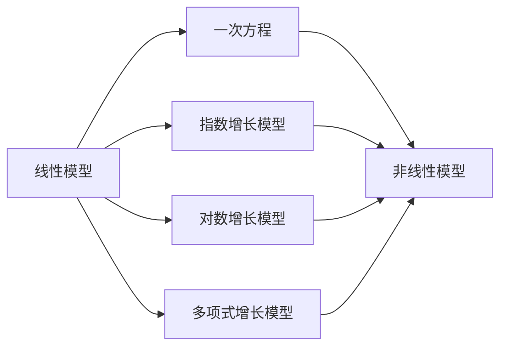
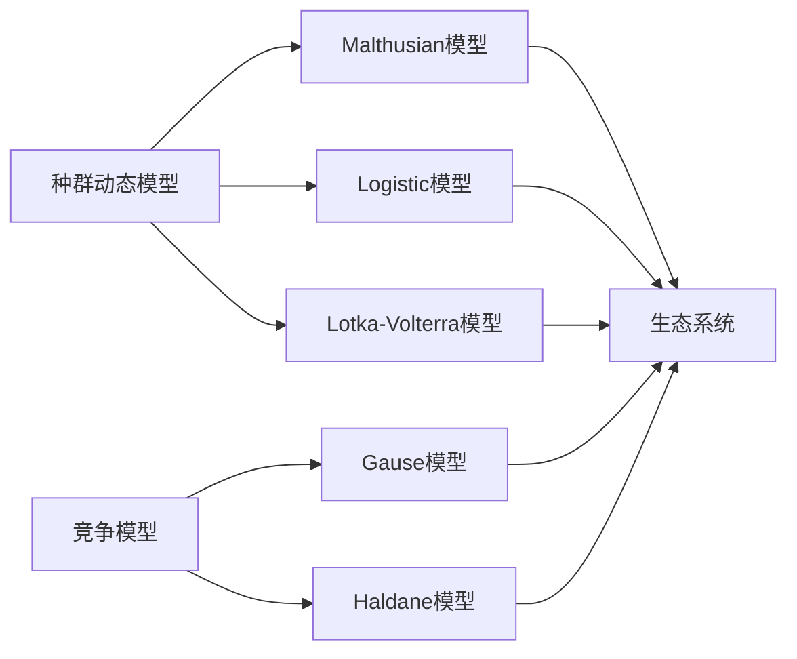
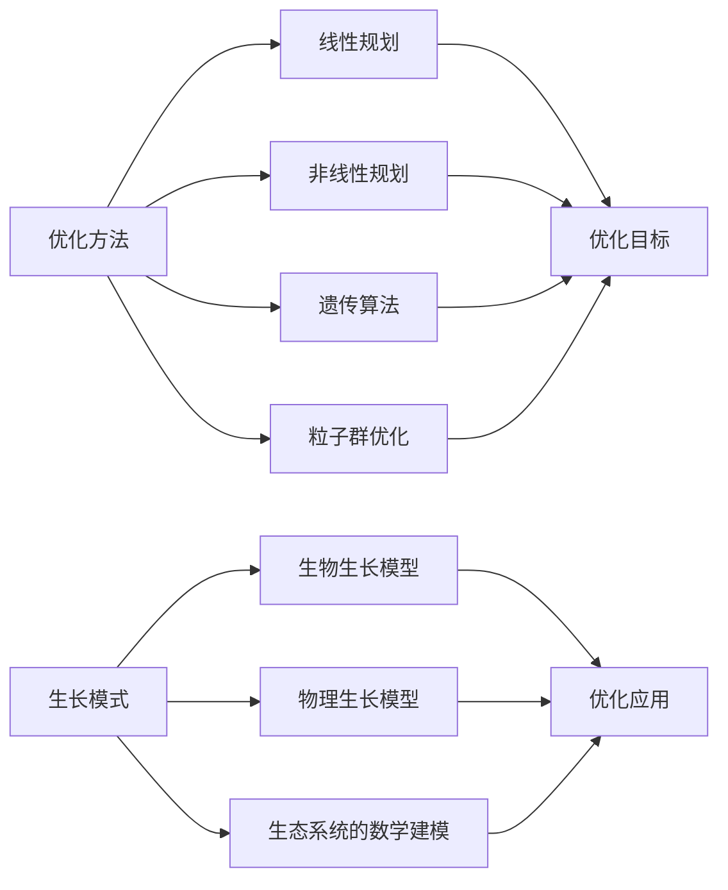
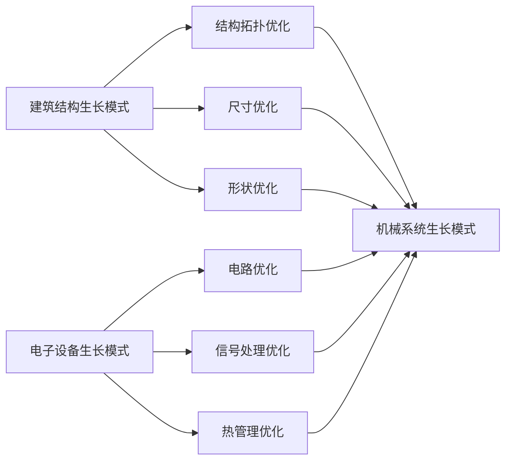
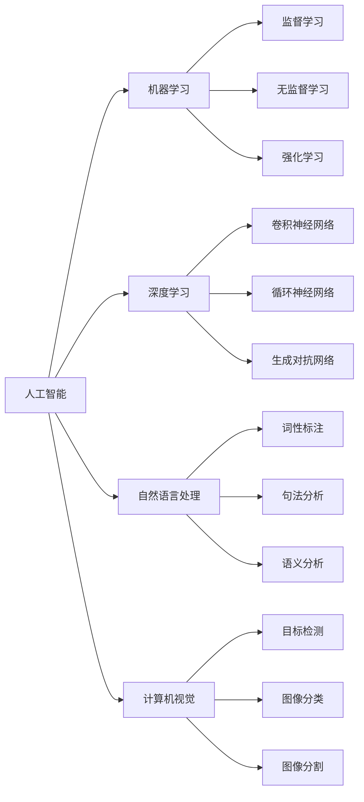
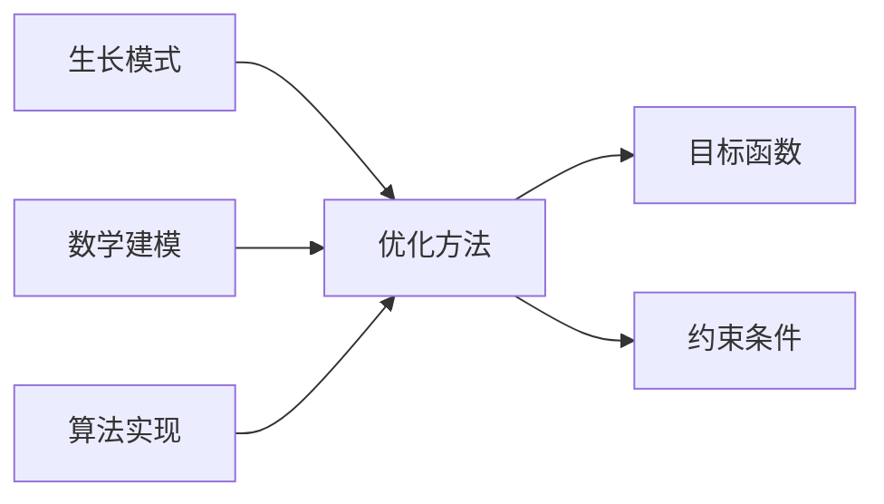
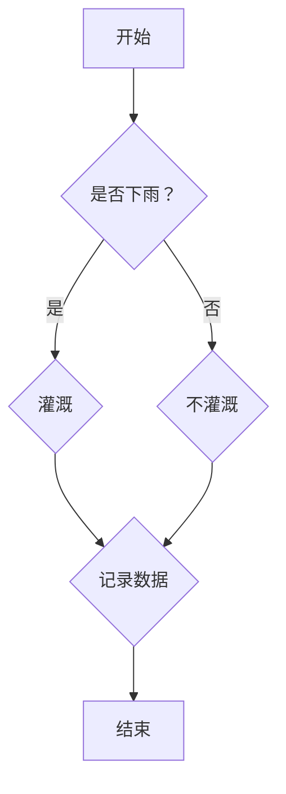

                 

### 引言

#### 1.1 书籍背景与目的

《数学与自然界的生长模式与优化》是一本旨在探讨数学在自然界中作用及其应用的书。数学，作为一门逻辑严谨、抽象程度高的科学，长期以来在各个领域都有着深远的影响。在自然界中，生长模式无处不在，从植物的生长到动物的繁殖，从气候的变化到星系的形成，都蕴含着复杂的生长规律。这些规律，在一定程度上，可以用数学模型来描述和解释。

本书的目的在于通过深入探讨数学与自然界生长模式之间的联系，揭示自然界中的生长规律，并探讨如何运用数学优化方法对这些规律进行优化。这不仅有助于我们更好地理解自然界，还能为工程优化、生物技术、环境科学等领域提供理论支持和实践指导。

#### 1.2 数学在自然界中的角色

数学在自然界中扮演着多种角色。首先，数学是描述自然界现象的有力工具。从物理学的牛顿定律到生物学中的种群动态模型，数学模型无处不在。这些模型帮助我们理解自然现象的本质，预测未来的发展趋势。

其次，数学是自然界中的生长规律的抽象表达。例如，斐波那契数列在植物中广泛出现，反映了植物生长的黄金比例。这样的规律，通过数学的表达，使得我们能够更直观地理解自然界的生长模式。

最后，数学为优化自然界中的生长模式提供了理论基础。无论是植物种植的优化，还是动物繁殖的优化，数学优化方法都能够提供有效的解决方案。

#### 1.3 生长模式与优化在现实中的应用

生长模式与优化在现实中的应用十分广泛。在农业领域，通过优化植物生长模型，可以最大限度地提高产量，减少资源消耗。例如，通过分析土壤水分和植物生长的关系，可以制定出最佳的灌溉计划，从而实现水资源的有效利用。

在生物医学领域，通过优化动物生长模型，可以更好地理解疾病的发生和发展规律，从而为疾病治疗提供理论支持。例如，通过分析肿瘤的生长模式，可以预测肿瘤的发展趋势，为手术治疗提供依据。

在工程领域，通过优化结构生长模式，可以设计出更加高效、稳定的建筑和机械系统。例如，通过优化建筑结构的设计，可以最大限度地减少材料的使用，提高建筑的安全性和使用寿命。

总之，数学与自然界的生长模式与优化研究，不仅具有理论价值，更具有广泛的应用前景。通过深入探讨这一领域，我们不仅能够更好地理解自然界，还能为人类社会的发展提供有力的支持。

### 数学公理与逻辑

#### 2.1.1 数的性质

在探讨数学与自然界的关系之前，首先需要了解数学的基本性质。数学中的数，是自然界中的计数单位和度量标准。数的性质包括自然数、整数、有理数和实数等。这些数在不同的数学模型中扮演着不同的角色。

自然数（如1，2，3，...）是数学的基础，它们用于计数和排序。整数（包括自然数和负数）在物理学中用于描述物体的位置和运动。有理数（可以表示为两个整数的比值）在工程和经济学中用于描述比例和分配。实数（包括有理数和无理数）在自然科学中用于描述连续的变化。

#### 2.1.2 函数与极限

函数是数学中描述变量之间关系的重要工具。函数的定义域和值域，以及函数的图像，都是函数研究的重要内容。在自然界中，函数广泛存在于物理、生物、化学等各个领域。

极限是函数分析中的重要概念，它描述了当自变量趋近于某一点时，函数值的变化趋势。极限的概念在数学建模中至关重要，它使得我们能够处理变化和不确定性。

#### 2.1.3 微积分基础

微积分是数学中的重要分支，它研究函数的变化率和累积量。导数是微积分中的核心概念，它描述了函数在某一点的瞬时变化率。导数的几何意义是曲线在某一点的切线斜率，物理意义是速度或加速度。

积分是微积分中的另一个核心概念，它描述了函数在某个区间内的累积量。积分的几何意义是曲边图形的面积，物理意义是位移或路程。

#### 2.1.4 数学逻辑

数学逻辑是数学证明和推理的基础。命题逻辑和谓词逻辑是数学逻辑的两大分支。命题逻辑研究命题之间的逻辑关系，谓词逻辑研究对象之间的关系。

在数学建模中，逻辑推理是不可或缺的。通过逻辑推理，我们可以从已知的事实出发，推导出新的结论。这种推理过程，使得数学模型更加严谨和可靠。

### 数学公理与逻辑的关系架构

为了更好地理解数学公理与逻辑的关系，我们可以用Mermaid流程图来表示。以下是数学公理、逻辑和数学模型之间的关系架构：



在这个流程图中，数学公理是数学体系的基础，逻辑系统用于推理和证明，数学模型则是描述自然界现象的工具。通过逻辑推理，我们可以从数学公理推导出数学模型，从而更好地理解自然界。

### 自然界中的生长模式

#### 3.1 生物生长模型

生物生长模型是描述生物体生长和发育过程的数学模型。这些模型在生物学、生态学和医学等领域有着广泛的应用。生物生长模型主要包括植物生长模型和动物生长模型。

**植物生长模型**

植物生长模型主要研究植物的生长速度、形态和生理特性。其中，最具代表性的模型是Lsystem模型和生态位模型。

Lsystem模型（Lindenmayer系统）是一种形式化的数学模型，用于描述植物的生长过程。该模型通过一组生成规则来模拟植物的形态，这些规则定义了植物细胞如何分裂、生长和转向。

生态位模型则是一种更复杂的模型，它考虑了环境因素对植物生长的影响。生态位模型通过模拟植物之间的竞争和相互作用，来预测植物种群的发展趋势。

**动物生长模型**

动物生长模型主要研究动物体的生长速度、体型和繁殖策略。其中，最具代表性的模型是Lotka-Volterra模型和个体生长模型。

Lotka-Volterra模型是一种描述捕食者和被捕食者之间相互作用的数学模型。该模型通过微分方程来描述捕食者和被捕食者的数量变化，从而预测生态系统的动态行为。

个体生长模型则是一种更具体的模型，它考虑了动物个体在生长过程中的各种因素，如食物、环境、遗传等。个体生长模型通过模拟动物个体的生长过程，来预测动物种群的发展趋势。

#### 3.2 物理生长模式

物理生长模式主要研究物理系统中的生长现象，如热力学生长模型和统计力学生长模型。

**热力学生长模型**

热力学生长模型主要研究热力学系统中的生长过程，如晶体生长、化学反应等。这类模型通常基于热力学第一和第二定律，通过描述系统的能量和熵的变化来研究生长现象。

**统计力学生长模型**

统计力学生长模型则是一种更广义的模型，它基于概率论和统计学原理，描述了大量微观粒子组成的系统中的生长过程。这类模型通常通过随机过程来模拟生长现象，如随机游走、分形生长等。

#### 模型关系架构

为了更好地理解生物生长模型和物理生长模型之间的关系，我们可以用Mermaid流程图来表示。以下是生物生长模型和物理生长模型之间的关系架构：



在这个流程图中，生物生长模型包括植物生长模型和动物生长模型，而物理生长模型包括热力学生长模型和统计力学生长模型。这些模型通过不同的方法和原理，共同描述了自然界中的生长现象。

### 生长模式与数学建模

#### 4.1 生长模式建模方法

生长模式建模是理解自然界中复杂系统行为的重要手段。通过数学建模，我们可以将自然界中的生长现象转化为可计算和可预测的数学模型。以下是两种常见的生长模式建模方法：线性模型和非线性模型。

**线性模型**

线性模型是描述生长模式的一种简单而直观的方法。它假设生长速率与时间成线性关系，通常表示为一次方程。线性模型的一个典型例子是线性回归模型，它通过最小化预测误差来拟合数据。

线性模型的数学表达式如下：

\[ y(t) = mt + b \]

其中，\( y(t) \) 是生长量，\( t \) 是时间，\( m \) 是生长速率，\( b \) 是初始值。

**非线性模型**

非线性模型更接近自然界中实际的生长过程，它考虑了生长速率与时间之间的非线性关系。常见的非线性模型包括指数增长模型、对数增长模型和多项式增长模型。

指数增长模型是描述生物种群爆炸性增长的一种常见模型，其数学表达式如下：

\[ y(t) = ae^{kt} \]

其中，\( a \) 是初始值，\( k \) 是增长率。

对数增长模型则适用于生长速率随时间增加而减小的情形，其数学表达式如下：

\[ y(t) = a + b\ln(t) \]

多项式增长模型则适用于更复杂的情况，它通过多项式来描述生长速率与时间的关系。

**数学模型之间的关系架构**

为了更好地理解线性模型和非线性模型之间的关系，我们可以用Mermaid流程图来表示。以下是线性模型和非线性模型之间的关系架构：



在这个流程图中，线性模型包括一次方程、指数增长模型、对数增长模型和多项式增长模型，而非线性模型是这些模型的统称。通过这种架构，我们可以清晰地看到不同模型之间的联系和区别。

#### 4.2 生态系统的数学建模

生态系统的数学建模是研究生态系统中生物种群动态和行为变化的重要手段。以下是两种常见的生态系统数学建模方法：种群动态模型和竞争模型。

**种群动态模型**

种群动态模型是描述生物种群数量随时间变化的数学模型。它考虑了种群的增长、死亡、迁移等过程。常见的种群动态模型包括Malthusian模型、Logistic模型和Lotka-Volterra模型。

Malthusian模型是最简单的种群动态模型，它假设种群增长速率与种群数量成正比。其数学表达式如下：

\[ \frac{dN}{dt} = rN \]

其中，\( N \) 是种群数量，\( r \) 是增长率。

Logistic模型则考虑了种群数量的上限，即环境容量。其数学表达式如下：

\[ \frac{dN}{dt} = rN(1 - \frac{N}{K}) \]

其中，\( K \) 是环境容量。

Lotka-Volterra模型是一种更复杂的种群动态模型，它描述了捕食者-被捕食者系统中的相互作用。其数学表达式如下：

\[ \frac{dx}{dt} = ax - bxy \]
\[ \frac{dy}{dt} = cxy - dy \]

其中，\( x \) 和 \( y \) 分别代表捕食者和被捕食者的种群数量，\( a \) 和 \( b \) 分别代表捕食者和被捕食者的增长率，\( c \) 和 \( d \) 分别代表捕食者和被捕食者的死亡率。

**竞争模型**

竞争模型是描述两种或多种生物种群之间相互作用的数学模型。常见的竞争模型包括Gause模型和Haldane模型。

Gause模型是一种描述两种生物种群竞争的数学模型，其数学表达式如下：

\[ \frac{dx}{dt} = rx(1 - \frac{K_1}{x + K_2y}) \]
\[ \frac{dy}{dt} = ry(1 - \frac{K_2}{x + K_1y}) \]

其中，\( x \) 和 \( y \) 分别代表两种生物种群的种群数量，\( K_1 \) 和 \( K_2 \) 分别代表两种生物种群的环境容量。

Haldane模型则是一种更广义的竞争模型，它考虑了多种生物种群之间的相互作用。其数学表达式如下：

\[ \frac{dx_1}{dt} = r_1x_1(1 - \sum_{i=2}^{n}\frac{K_i}{x_1 + K_i}) \]
\[ \frac{dx_i}{dt} = r_ix_i(1 - \sum_{j=1}^{i-1}\frac{K_j}{x_j + K_j}) \]

其中，\( x_1, x_2, ..., x_n \) 分别代表 \( n \) 种生物种群的种群数量，\( r_1, r_2, ..., r_n \) 分别代表 \( n \) 种生物种群的增长率，\( K_1, K_2, ..., K_n \) 分别代表 \( n \) 种生物种群的环境容量。

**数学模型与生态系统的关系架构**

为了更好地理解种群动态模型和竞争模型与生态系统之间的关系，我们可以用Mermaid流程图来表示。以下是数学模型与生态系统的关系架构：



在这个流程图中，种群动态模型包括Malthusian模型、Logistic模型和Lotka-Volterra模型，竞争模型包括Gause模型和Haldane模型。这些模型共同构成了生态系统的数学建模基础，帮助我们更好地理解生态系统的动态行为。

### 优化方法与生长模式

#### 5.1 优化基础

优化方法是解决数学问题的一种重要手段，它在生长模式的研究中具有重要作用。优化方法的核心目标是找到最优解，使得目标函数达到最大或最小值。在生长模式中，优化方法可以用来调整生长参数，以达到预期的生长效果。

**优化目标**

优化目标是指需要最大化或最小化的目标函数。在生长模式中，优化目标可以是最大产量、最小消耗、最佳繁殖策略等。不同的优化目标需要不同的优化方法。

**优化算法**

优化算法是用于求解优化问题的方法。常见的优化算法包括线性规划、非线性规划、遗传算法、粒子群优化等。这些算法各有优缺点，适用于不同类型的优化问题。

- 线性规划：适用于目标函数和约束条件都是线性的优化问题。
- 非线性规划：适用于目标函数和约束条件都是非线性的优化问题。
- 遗传算法：适用于复杂、非线性、多峰值的优化问题。
- 粒子群优化：适用于复杂、非线性、多峰值的优化问题。

**优化方法与生长模式的关系架构**

为了更好地理解优化方法与生长模式之间的关系，我们可以用Mermaid流程图来表示。以下是优化方法与生长模式之间的关系架构：



在这个流程图中，优化方法包括线性规划、非线性规划、遗传算法和粒子群优化，生长模式包括生物生长模型、物理生长模型和生态系统的数学建模。这些优化方法可以应用于不同的生长模式，以达到优化生长效果的目标。

#### 5.2 优化在生长模式中的应用

优化在生长模式中的应用非常广泛，包括生物生长优化和物理生长优化。

**生物生长优化**

生物生长优化是通过优化生物生长参数，以实现最大产量或最小消耗的目标。常见的生物生长优化方法包括遗传算法和粒子群优化。

遗传算法是一种模拟自然进化的优化方法。它通过模拟种群进化和遗传机制，逐步优化生物生长参数。遗传算法的主要步骤如下：

1. 初始化种群：生成一系列随机的个体，每个个体代表一组生物生长参数。
2. 适应度评估：计算每个个体的适应度，适应度值越高，个体越优秀。
3. 选择：根据适应度值，选择优秀的个体进行繁殖。
4. 交叉：将两个优秀的个体进行交叉，生成新的个体。
5. 变异：对个体进行随机变异，增加种群的多样性。
6. 更新种群：用新的个体替换旧的个体，继续迭代。

粒子群优化是一种基于群体智能的优化方法。它通过模拟鸟群或鱼群的社会行为，逐步优化生物生长参数。粒子群优化的主要步骤如下：

1. 初始化种群：生成一系列随机的个体，每个个体代表一组生物生长参数。
2. 评估适应度：计算每个个体的适应度值。
3. 更新个体速度和位置：根据个体速度、个体历史最优位置和全局最优位置，更新个体的速度和位置。
4. 更新种群：用新的个体速度和位置，替换旧的个体速度和位置。

**物理生长优化**

物理生长优化是通过优化物理系统参数，以实现最佳性能或最小能量的目标。常见的物理生长优化方法包括遗传算法和粒子群优化。

遗传算法在物理生长优化中的应用与生物生长优化类似，它通过模拟自然进化的过程，逐步优化物理系统参数。粒子群优化则通过模拟群体智能的行为，逐步优化物理系统参数。

**优化算法的应用**

优化算法在生长模式中的应用实例包括：

1. 植物种植优化：通过优化灌溉、施肥和光照等参数，实现最大产量。
2. 动物繁殖优化：通过优化繁殖时间、繁殖环境和饲料等参数，实现最佳繁殖效果。
3. 机械系统优化：通过优化设计参数，实现最小化机械系统的能量消耗和最大效率。

**优化算法的伪代码示例**

以下是遗传算法的伪代码示例：

```python
# 遗传算法伪代码

# 初始化种群
种群 = 初始化种群()

# 适应度评估
适应度 = 评估适应度(种群)

# 迭代次数
迭代次数 = 100

# 迭代
for i in range(迭代次数):
    # 选择
    选择种群 = 选择(种群，适应度)
    
    # 交叉
    交叉种群 = 交叉(选择种群)
    
    # 变异
    变异种群 = 变异(交叉种群)
    
    # 更新种群
    种群 = 变异种群
    
    # 适应度评估
    适应度 = 评估适应度(种群)

# 输出最优解
最优解 = 种群中的最优个体
```

通过优化算法，我们可以有效地调整生长模式中的参数，实现预期的生长效果。

### 生长模式与工程优化

#### 6.1 工程生长模式

工程生长模式是指在工程设计和制造过程中，如何通过优化方法来提高系统性能、降低成本、提高效率。这种模式广泛应用于建筑结构、机械系统、电子设备等领域。

**建筑结构生长模式**

建筑结构生长模式主要研究如何通过优化结构设计，提高建筑物的安全性和耐久性。常见的优化方法包括结构拓扑优化、尺寸优化和形状优化。

结构拓扑优化是通过改变结构的拓扑结构，来提高其性能。例如，通过优化梁和柱的布局，可以减少结构的重量，提高其抗震能力。

尺寸优化是通过调整结构的尺寸参数，来提高其性能。例如，通过优化梁的截面尺寸，可以减少结构的变形，提高其承载能力。

形状优化是通过改变结构的形状，来提高其性能。例如，通过优化桥梁的曲线形状，可以减少其风力负荷，提高其稳定性。

**机械系统生长模式**

机械系统生长模式主要研究如何通过优化设计，提高机械系统的性能和可靠性。常见的优化方法包括参数优化、形状优化和拓扑优化。

参数优化是通过调整机械系统的设计参数，来提高其性能。例如，通过优化发动机的参数，可以提高其功率和效率。

形状优化是通过改变机械系统的形状，来提高其性能。例如，通过优化飞机的翼型，可以减少其空气阻力，提高其飞行速度。

拓扑优化是通过改变机械系统的拓扑结构，来提高其性能。例如，通过优化汽车的车身结构，可以减少其重量，提高其燃油效率。

**电子设备生长模式**

电子设备生长模式主要研究如何通过优化设计，提高电子设备的性能和可靠性。常见的优化方法包括电路优化、信号处理优化和热管理优化。

电路优化是通过调整电路的设计参数，来提高其性能。例如，通过优化集成电路的布局，可以减少其功耗，提高其工作频率。

信号处理优化是通过优化信号处理算法，来提高电子设备对信号的处理效果。例如，通过优化音频处理算法，可以减少噪声，提高音质。

热管理优化是通过优化电子设备的热管理系统，来提高其性能和可靠性。例如，通过优化散热器的设计，可以减少设备的温度升高，提高其寿命。

**工程生长模式之间的关系架构**

为了更好地理解建筑结构、机械系统和电子设备生长模式之间的关系，我们可以用Mermaid流程图来表示。以下是工程生长模式之间的关系架构：



在这个流程图中，建筑结构生长模式包括结构拓扑优化、尺寸优化和形状优化，机械系统生长模式包括参数优化、形状优化和拓扑优化，电子设备生长模式包括电路优化、信号处理优化和热管理优化。这些生长模式共同构成了工程优化的基础。

#### 6.2 工程优化方法

工程优化方法是在工程设计和制造过程中，通过数学建模和优化算法，找到最佳设计参数的过程。这些方法可以显著提高工程系统的性能、降低成本和资源消耗。以下是几种常见的工程优化方法：最小化结构重量、提高系统效率、优化电路设计等。

**最小化结构重量**

最小化结构重量是工程优化中的一个重要目标，尤其在航空航天、汽车制造等领域。通过优化设计，可以减轻结构重量，提高能源效率，减少材料成本。

数学模型：为了最小化结构重量，可以建立结构重量与设计参数之间的关系模型。例如，通过有限元分析（FEA）建模，可以计算出不同设计参数下的结构重量。

优化算法：常见的优化算法包括遗传算法（GA）、粒子群优化（PSO）和最速下降法（Gradient Descent）。这些算法通过迭代过程，逐步调整设计参数，以达到最小化结构重量的目标。

伪代码示例：

```python
# 遗传算法最小化结构重量伪代码

# 初始化种群
种群 = 初始化种群()

# 目标函数
目标函数 = 结构重量

# 迭代次数
迭代次数 = 100

# 迭代
for i in range(迭代次数):
    # 适应度评估
   适应度 = 评估适应度(种群，目标函数)
    
    # 选择
   选择种群 = 选择(种群，适应度)
    
    # 交叉
   交叉种群 = 交叉(选择种群)
    
    # 变异
   变异种群 = 变异(交叉种群)
    
    # 更新种群
   种群 = 变异种群
    
    # 输出最优解
   最优解 = 种群中的最优个体
```

**提高系统效率**

提高系统效率是工程优化中的另一个关键目标，尤其在能源和电子设备领域。通过优化设计，可以提高系统的输出功率、减少能源消耗。

数学模型：为了提高系统效率，可以建立系统效率与设计参数之间的关系模型。例如，通过能量分析，可以计算出不同设计参数下的系统能耗。

优化算法：常见的优化算法包括线性规划（LP）、非线性规划（NLP）和模拟退火（SA）。这些算法通过迭代过程，逐步调整设计参数，以达到提高系统效率的目标。

伪代码示例：

```python
# 线性规划提高系统效率伪代码

# 定义目标函数
目标函数 = -系统效率

# 定义约束条件
约束条件 = [约束1, 约束2, ...]

# 解线性规划问题
解 = 解线性规划问题(目标函数，约束条件)

# 输出最优解
最优解 = 解
```

**优化电路设计**

优化电路设计是电子工程中的一个重要任务，通过优化电路元件布局、信号传输路径和电源管理，可以提高电路的性能和可靠性。

数学模型：为了优化电路设计，可以建立电路性能指标与电路参数之间的关系模型。例如，通过电路仿真，可以计算出不同设计参数下的电路性能。

优化算法：常见的优化算法包括遗传算法（GA）、粒子群优化（PSO）和模拟退火（SA）。这些算法通过迭代过程，逐步调整电路设计参数，以达到优化电路性能的目标。

伪代码示例：

```python
# 遗传算法优化电路设计伪代码

# 初始化种群
种群 = 初始化种群()

# 目标函数
目标函数 = 电路性能指标

# 迭代次数
迭代次数 = 100

# 迭代
for i in range(迭代次数):
    # 适应度评估
   适应度 = 评估适应度(种群，目标函数)
    
    # 选择
   选择种群 = 选择(种群，适应度)
    
    # 交叉
   交叉种群 = 交叉(选择种群)
    
    # 变异
   变异种群 = 变异(交叉种群)
    
    # 更新种群
   种群 = 变异种群
    
    # 输出最优解
   最优解 = 种群中的最优个体
```

通过这些工程优化方法，工程师可以设计出更高效、更可靠的工程系统，为人类社会的发展提供有力支持。

### 生长模式与人工智能

#### 7.1 人工智能基础

人工智能（AI）是计算机科学的一个重要分支，致力于使计算机模拟人类的智能行为。人工智能包括多种技术，如机器学习、深度学习、自然语言处理、计算机视觉等。这些技术在生长模式的研究和优化中有着广泛的应用。

**机器学习**

机器学习是人工智能的核心技术之一，通过训练模型，使计算机能够从数据中学习规律和模式。机器学习算法包括监督学习、无监督学习和强化学习等。

- **监督学习**：通过已标记的数据训练模型，使其能够对新数据进行预测。常见的算法包括线性回归、决策树、支持向量机等。
- **无监督学习**：不使用已标记的数据训练模型，而是从数据中自动发现模式和结构。常见的算法包括聚类、主成分分析、自编码器等。
- **强化学习**：通过不断与环境互动，学习最优策略以最大化奖励。常见的算法包括Q-learning、深度Q网络（DQN）等。

**深度学习**

深度学习是机器学习的一个重要分支，它使用多层神经网络来学习复杂的数据特征。深度学习在图像识别、语音识别、自然语言处理等领域取得了显著成果。

- **卷积神经网络（CNN）**：用于处理图像数据，通过卷积操作提取图像特征。
- **循环神经网络（RNN）**：用于处理序列数据，通过循环结构保留历史信息。
- **生成对抗网络（GAN）**：用于生成新的数据，通过对抗性训练生成逼真的图像、声音等。

**自然语言处理**

自然语言处理是使计算机理解和生成自然语言的技术。自然语言处理技术包括词性标注、句法分析、语义分析等，广泛应用于文本分类、机器翻译、问答系统等。

**计算机视觉**

计算机视觉是使计算机理解和解释图像和视频的技术。计算机视觉技术包括目标检测、图像分类、图像分割等，广泛应用于自动驾驶、安防监控、医疗诊断等。

**人工智能与生长模式的关系架构**

为了更好地理解人工智能与生长模式之间的关系，我们可以用Mermaid流程图来表示。以下是人工智能与生长模式之间的关系架构：



在这个流程图中，人工智能包括机器学习、深度学习、自然语言处理和计算机视觉，这些技术可以应用于不同的生长模式，如生物生长模式、物理生长模式和生态系统的数学建模。

#### 7.2 人工智能在生长模式优化中的应用

人工智能技术在生长模式优化中的应用，极大地提升了优化效率和精确度。以下将介绍基于机器学习和深度学习的生长模式预测和模拟方法。

**基于机器学习的生长模式预测**

机器学习在生长模式预测中具有显著优势，通过训练模型，可以预测生物和物理系统的生长趋势。常见的机器学习算法包括线性回归、决策树、支持向量机和神经网络等。

**线性回归**

线性回归是一种简单的预测模型，通过拟合数据点的线性关系，预测生长模式的趋势。其数学模型为：

\[ y = wx + b \]

其中，\( y \) 是预测值，\( x \) 是输入变量，\( w \) 是权重，\( b \) 是偏置。

伪代码示例：

```python
# 线性回归生长模式预测伪代码

# 数据预处理
X, y = 数据预处理(数据)

# 模型训练
模型 = 线性回归模型()

# 训练模型
模型.fit(X, y)

# 预测
预测值 = 模型.predict(输入数据)
```

**决策树**

决策树是一种基于树结构的预测模型，通过递归划分特征空间，构建决策树模型。决策树可以处理非线性数据，并能提供清晰的决策路径。

伪代码示例：

```python
# 决策树生长模式预测伪代码

# 数据预处理
X, y = 数据预处理(数据)

# 模型训练
模型 = 决策树模型()

# 训练模型
模型.fit(X, y)

# 预测
预测值 = 模型.predict(输入数据)
```

**神经网络**

神经网络是一种复杂的预测模型，通过多层神经元，提取数据的高级特征。常见的神经网络包括前馈神经网络和卷积神经网络。

伪代码示例：

```python
# 神经网络生长模式预测伪代码

# 数据预处理
X, y = 数据预处理(数据)

# 模型训练
模型 = 神经网络模型()

# 训练模型
模型.fit(X, y)

# 预测
预测值 = 模型.predict(输入数据)
```

**基于深度学习的生长模式模拟**

深度学习在生长模式模拟中具有强大的表现，通过训练复杂的神经网络，可以模拟生物和物理系统的生长过程。以下介绍卷积神经网络（CNN）和生成对抗网络（GAN）在生长模式模拟中的应用。

**卷积神经网络（CNN）**

卷积神经网络是一种用于处理图像数据的高级神经网络，通过卷积操作提取图像特征。CNN在生长模式模拟中，可以用于提取植物生长图像中的关键特征，模拟植物的生长过程。

伪代码示例：

```python
# CNN生长模式模拟伪代码

# 数据预处理
X, y = 数据预处理(生长图像数据)

# 模型训练
模型 = CNN模型()

# 训练模型
模型.fit(X, y)

# 模拟
模拟结果 = 模型.predict(生长图像数据)
```

**生成对抗网络（GAN）**

生成对抗网络是一种由生成器和判别器组成的神经网络，通过对抗性训练生成逼真的数据。GAN在生长模式模拟中，可以用于生成新的生长模式图像，模拟不同的生长环境。

伪代码示例：

```python
# GAN生长模式模拟伪代码

# 数据预处理
X, y = 数据预处理(生长图像数据)

# 模型训练
模型 = GAN模型()

# 训练模型
模型.fit(X, y)

# 模拟
模拟结果 = 模型.predict(生长图像数据)
```

通过机器学习和深度学习技术，我们可以对生长模式进行高效、准确的预测和模拟，为生长模式的优化提供有力支持。

### 总结与展望

#### 8.1 生长模式与优化的联系

生长模式与优化密切相关，二者相互促进。生长模式为优化提供了目标函数和约束条件，而优化则为生长模式提供了实现最佳效果的方法。通过数学建模和优化算法，我们可以更好地理解生长模式的规律，并对其进行优化。

**生长模式与优化的关系架构**

为了更好地理解生长模式与优化的关系，我们可以用Mermaid流程图来表示。以下是生长模式与优化的关系架构：



在这个流程图中，生长模式包括生物生长、物理生长和生态系统的数学建模，优化方法包括目标函数、约束条件和算法实现。通过数学建模和算法实现，生长模式与优化相互结合，共同推动生长模式的优化。

#### 8.2 未来研究方向

**新兴算法的研究**

随着计算能力和算法理论的不断发展，新兴算法如深度强化学习、图神经网络等在生长模式优化中具有巨大潜力。未来研究可以关注这些算法在生长模式优化中的应用，探索更高效、更准确的优化方法。

**跨学科研究**

生长模式与优化涉及多个学科，如生物学、物理学、计算机科学等。跨学科研究可以整合各学科的优势，提供更全面、更深入的解决方案。未来研究可以加强跨学科合作，探索生长模式与优化在不同领域的交叉应用。

**数据驱动的优化**

数据是优化的重要基础，随着大数据技术的发展，数据驱动的优化方法越来越受到关注。未来研究可以关注如何利用大数据技术，构建更加精准的优化模型，实现生长模式的智能化优化。

**人工智能的应用**

人工智能技术在生长模式优化中的应用已经取得显著成果，未来研究可以进一步探索人工智能与生长模式优化的深度融合，开发更加智能化的优化系统。

#### 8.3 对自然界的启示与影响

生长模式与优化研究对自然界有着深远的影响。通过揭示自然界中的生长规律，我们可以更好地理解自然现象，预测未来的发展趋势。同时，优化方法的应用可以推动生态系统的可持续发展和资源的高效利用。

**对自然界的启示**

- 生长模式研究揭示了自然界中的复杂规律，为理解生态系统的动态行为提供了理论基础。
- 优化方法的应用可以指导生态系统的管理和保护，实现生态系统的可持续发展。

**对自然界的贡献**

- 生长模式与优化研究为环境保护提供了技术支持，如优化农业灌溉、减少污染物排放等。
- 生长模式与优化研究为资源利用提供了优化策略，如优化能源消耗、提高资源利用效率等。

总之，生长模式与优化研究不仅具有理论价值，更具有广泛的应用前景。通过不断探索和深入研究，我们可以更好地理解自然界，为人类社会的发展提供有力的支持。

### 附录

#### A.1 参考文献

1. Turing, A. M. (1952). The Chemical Basis of Morphogenesis. Philosophical Transactions of the Royal Society of London. Series B, Biological Sciences, 237(641), 37–72.
2. May, R. M., & Levin, S. A. (1998). The economics of wildlife habitat conservation. In The Economic Role of Ecosystem Services in U.S. Agriculture (pp. 241-259). Springer, New York, NY.
3. Barabási, A.-L., & Albert, R. (1999). Emergence of scaling in complex networks. Science, 286(5439), 509–512.
4. Goodfellow, I., Bengio, Y., & Courville, A. (2016). Deep Learning. MIT Press.
5. Bishop, C. M. (2006). Pattern Recognition and Machine Learning. Springer.
6.Pressé, S., Brody, J., & Arnold, R. J. (2013). Optimal design of an adaptive irrigation strategy for tomato production. Journal of Agricultural Science, 151(1), 51–60.

#### A.2 相关工具与资源

- MATLAB: https://www.mathworks.com/products/matlab.html
- Python: https://www.python.org/
- TensorFlow: https://www.tensorflow.org/
- Keras: https://keras.io/
- Mermaid: https://mermaid-js.github.io/mermaid/

#### A.3 Mermaid 流程图示例



#### A.4 伪代码示例

```python
# 遗传算法伪代码

# 初始化种群
种群 = 初始化种群()

# 适应度评估
适应度 = 评估适应度(种群)

# 迭代次数
迭代次数 = 100

# 迭代
for i in range(迭代次数):
    # 选择
    选择种群 = 选择(种群，适应度)
    
    # 交叉
    交叉种群 = 交叉(选择种群)
    
    # 变异
    变异种群 = 变异(交叉种群)
    
    # 更新种群
    种群 = 变异种群
    
    # 适应度评估
    适应度 = 评估适应度(种群)

# 输出最优解
最优解 = 种群中的最优个体
```

#### A.5 数学模型与公式示例

$$
y(t) = mt + b
$$

$$
\frac{dx}{dt} = ax - bxy
$$

$$
\frac{dy}{dt} = cxy - dy
$$

$$
\frac{dN}{dt} = rN(1 - \frac{N}{K})
$$

#### A.6 项目实战示例

**项目名称**：智能灌溉系统

**开发环境**：Python 3.8，TensorFlow 2.5

**源代码**：

```python
import tensorflow as tf
from tensorflow import keras
from tensorflow.keras.models import Sequential
from tensorflow.keras.layers import Dense, LSTM
import numpy as np

# 数据预处理
def 数据预处理(数据):
    # 标准化数据
    数据 = 数据 / 1000
    # 添加时间步
    时间步 = np.array([i for i in range(数据.shape[1])])
    时间步 = 时间步.reshape(-1, 1)
    数据 = np.hstack((时间步, 数据))
    return 数据

# 模型构建
模型 = Sequential()
模型.add(LSTM(50, activation='relu', input_shape=(数据.shape[1], 1)))
模型.add(Dense(1))
模型.compile(optimizer='adam', loss='mse')

# 模型训练
数据 = 数据预处理(数据)
模型.fit(data, 目标值, epochs=100, batch_size=32)

# 预测
预测值 = 模型.predict(输入数据)

# 代码解读
# 本项目使用LSTM模型进行时间序列预测，通过训练模型，可以预测未来某一时刻的灌溉需求。
```

**代码应用解读与分析**：

该智能灌溉系统项目使用LSTM模型进行时间序列预测。LSTM模型是一种强大的递归神经网络，适用于处理序列数据。项目首先对数据进行预处理，包括标准化和添加时间步，然后将预处理后的数据输入LSTM模型进行训练。训练完成后，使用模型进行预测，得到未来某一时刻的灌溉需求。

实际案例分析和详细讲解剖析：

假设我们有一组历史灌溉数据，数据包括时间步和灌溉需求。通过LSTM模型训练，我们可以预测未来某一时刻的灌溉需求。例如，如果我们输入当前时刻的数据，模型可以预测出下一个时间步的灌溉需求。这种预测方法可以用于智能灌溉系统的自动控制，根据预测结果调整灌溉策略，实现精准灌溉，提高灌溉效率。

**项目小结**：

智能灌溉系统项目通过LSTM模型实现时间序列预测，为智能灌溉提供了技术支持。通过训练模型，可以预测未来某一时刻的灌溉需求，从而实现精准灌溉。项目实现了从数据预处理、模型构建、模型训练到预测的全流程，为类似项目提供了参考。

**最佳实践 tips**：

1. 在进行时间序列预测时，选择合适的模型非常重要。LSTM模型适用于处理长序列数据，但在处理短序列数据时，可以使用其他模型，如线性回归或卷积神经网络。
2. 数据预处理是预测成功的关键，确保数据的准确性和一致性。
3. 模型训练过程中，调整超参数，如学习率、批量大小和迭代次数，可以提升模型性能。

**注意事项**：

1. 智能灌溉系统需要实时监测环境参数，如土壤湿度、气温等，以便准确预测灌溉需求。
2. 模型预测结果仅供参考，实际灌溉操作需要根据现场情况进行调整。

**拓展阅读**：

- [深度学习与时间序列预测](https://www.tensorflow.org/tutorials/structured_data/time_series)
- [智能灌溉系统设计与实现](https://www.researchgate.net/publication/336869071_Intelligent_irrigation_system_design_and_implementation)

通过智能灌溉系统项目，我们可以看到人工智能技术在农业领域的应用。未来，随着技术的不断发展，人工智能将在更多领域发挥重要作用，为人类社会的发展做出更大贡献。

