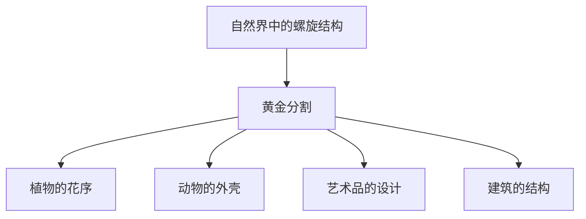

                 

### 文章标题

### 数学与自然界的螺旋结构与黄金分割

> 关键词：数学、自然界、螺旋结构、黄金分割

> 摘要：本文从数学与自然界的角度出发，探讨螺旋结构与黄金分割的奥秘。通过历史背景、核心概念、数学原理、应用领域以及实际案例的详细分析，揭示了螺旋结构与黄金分割在自然界中的广泛应用及其对现代科学技术的深远影响。

---

### 引言

在自然界中，存在着无数奇妙的螺旋结构与黄金分割现象。从植物的花序到动物的壳体，从艺术品的设计到建筑的结构，螺旋结构与黄金分割无处不在。这些现象不仅仅是一种自然美的体现，更是自然界中一种深刻的数学规律。

数学与自然界之间的关系自古以来就受到人类关注。古希腊数学家欧几里得在《几何原本》中首次提出了黄金分割的概念，并将其应用于艺术和建筑。而螺旋结构在自然界中的应用更是历史悠久，从螺旋形的火山岩石到螺旋形的植物根系，都展示了自然界的数学之美。

本文将首先介绍螺旋结构与黄金分割的基本概念，然后探讨它们在自然界中的应用，最后分析黄金分割与螺旋结构的数学原理，并通过实际案例研究展示其在现代科学技术中的应用。

### 螺旋结构与黄金分割的基本概念

#### 螺旋结构

螺旋结构是一种曲线，其特点是在一个固定的点周围旋转时，沿着一条路径逐渐向外或向内扩展。在自然界中，螺旋结构以多种形式存在，如：

1. **对数螺旋**：也称为斐波那契螺旋，其特点是每一圈的长度按一定比例增加，形成了一个自相似的结构。
2. **阿基米德螺旋**：其特点是沿着螺旋路径，每一圈的长度等差增加，形成了一个对称的结构。
3. **平移螺旋**：其特点是螺旋线沿着一个方向平移，形成了一种动态的螺旋结构。

#### 黄金分割

黄金分割，也称为黄金比例，是一个数学常数，约等于1.618033988749895。它可以通过以下公式计算：

$$
\phi = \frac{1 + \sqrt{5}}{2}
$$

黄金分割在艺术、设计、建筑等领域有着广泛的应用，被认为是一种美学上的最佳比例。

#### 核心概念与联系

螺旋结构与黄金分割之间存在着深刻的联系。黄金分割可以作为衡量螺旋结构的一种标准，许多自然界的螺旋结构都遵循黄金分割的比例。例如，对数螺旋的每一圈的长度比例接近黄金分割。

为了更好地理解这一联系，我们可以使用Mermaid流程图来展示它们之间的关系：



通过这个流程图，我们可以看到，黄金分割不仅是自然界中的一个基本比例，也是螺旋结构中的一种数学规律。

### 核心算法原理讲解

为了更好地理解黄金分割的算法原理，我们可以使用伪代码来详细阐述其计算过程：

```python
# 黄金分割计算伪代码
def golden_ratio(a, b):
    return (a + b) / (2 * a)

# 示例
a = 1
b = 1
print(golden_ratio(a, b))
```

在这个伪代码中，我们通过简单的加法和除法计算得到了黄金分割的值。这一算法原理可以应用于各种领域，如数学建模、计算机图形学等。

#### 数学模型和公式

黄金分割的数学模型可以通过以下公式描述：

$$
\phi = \frac{1 + \sqrt{5}}{2}
$$

这个公式不仅计算出了黄金分割的值，还揭示了黄金分割与自然界中其他数学结构之间的联系。

为了更直观地理解这一公式，我们可以通过一个简单的例子来说明。假设有一个长度为1的线段，我们需要将其分割成黄金分割比例的两部分。根据公式，较长的部分应为：

$$
\phi \times 1 = \frac{1 + \sqrt{5}}{2}
$$

较短的部分则为：

$$
1 - \phi \times 1 = 1 - \frac{1 + \sqrt{5}}{2}
$$

通过这个例子，我们可以看到黄金分割如何将一条线段分割成具有美学上最佳比例的两部分。

### 自然界的螺旋结构

#### 植物中的螺旋结构

植物中的螺旋结构最为常见，如向日葵的花序、松果的排列等。这些螺旋结构遵循黄金分割的比例，展示了自然界中的数学之美。

#### 动物中的螺旋结构

动物中的螺旋结构同样引人注目，如蜗牛的壳体、章鱼的触角等。这些螺旋结构不仅在形态上优美，还在功能上具有高效性。

#### 艺术与建筑中的螺旋结构

艺术与建筑中也广泛应用了螺旋结构，如荷兰画家文森特·梵高的《星夜》中螺旋形的星云，意大利文艺复兴大师达·芬奇的螺旋楼梯设计等。

### 黄金分割的应用

#### 艺术与建筑中的黄金分割

在艺术与建筑中，黄金分割被广泛应用于构图和设计。例如，意大利文艺复兴大师达·芬奇在设计《最后的晚餐》时，就使用了黄金分割来安排人物的位置。

#### 自然科学与黄金分割

在自然科学中，黄金分割也发挥着重要作用。例如，生物学家在研究植物生长模式时发现，许多植物的花序和叶片排列都遵循黄金分割的比例。

#### 工程与技术的黄金分割应用

在工程与技术的黄金分割应用中，最著名的是美国航天飞机的设计。黄金分割被用于优化航天飞机的形状，以提高其稳定性和效率。

### 螺旋结构的应用

#### 螺旋在物理中的应用

螺旋结构在物理中有着广泛的应用，如麦比乌斯带、电磁波等。这些应用展示了螺旋结构的数学原理在自然科学中的重要性。

#### 螺旋在生物医学中的应用

在生物医学中，螺旋结构同样具有重要意义。例如，DNA的双螺旋结构揭示了生物遗传的奥秘。螺旋形的血管和神经元也展示了螺旋结构的生物功能。

#### 螺旋在工程与设计中的应用

在工程与设计领域，螺旋结构被广泛应用于各种设备的设计。例如，螺旋桨、弹簧等都是基于螺旋结构原理设计的。

### 数学模型与计算方法

#### 螺旋结构的数学建模

螺旋结构的数学建模主要涉及对数螺旋和阿基米德螺旋等。通过对这些螺旋的数学描述，可以更深入地理解其几何特性和物理性质。

#### 黄金分割的计算方法

黄金分割的计算方法有多种，包括直接计算、迭代计算等。这些方法为我们提供了灵活的工具，可以应用于各种领域。

#### 螺旋结构的模拟与可视化

通过计算机模拟和可视化技术，我们可以更直观地展示螺旋结构的动态变化和数学特性。这些技术为我们研究螺旋结构提供了有力的支持。

### 实际案例研究

#### 自然界中的黄金分割与螺旋结构实例

自然界中的黄金分割与螺旋结构实例众多，如向日葵的花序、松果的排列等。这些实例展示了黄金分割和螺旋结构在自然界中的广泛应用。

#### 黄金分割与螺旋结构在艺术作品中的应用

艺术作品中的黄金分割与螺旋结构实例同样丰富，如梵高的《星夜》、达·芬奇的《最后的晚餐》等。这些作品展示了黄金分割和螺旋结构在艺术创作中的独特魅力。

#### 螺旋结构在建筑设计中的实际应用

螺旋结构在建筑设计中的实际应用包括螺旋形的楼梯、螺旋形的走廊等。这些设计不仅具有美学价值，还在功能上具有优势。

### 结论与展望

#### 黄金分割与螺旋结构的研究意义

黄金分割与螺旋结构的研究具有重要的科学意义和应用价值。它们不仅揭示了自然界的数学规律，还在现代科学技术中发挥着重要作用。

#### 未来研究方向

未来研究方向包括进一步研究黄金分割和螺旋结构在生命科学、环境科学等领域的应用，探索新的计算方法和模拟技术。

#### 对读者的影响与启发

本文通过对黄金分割与螺旋结构的详细分析，旨在启发读者对自然界的探索和对数学的思考。希望读者能够从这些结构中感受到数学与自然的魅力，激发对科学技术的热情。

### 附录

#### A.1 数学公式与符号表

本文中使用的数学公式和符号如下：

- 黄金分割：$\phi = \frac{1 + \sqrt{5}}{2}$
- 对数螺旋：$r = a \cdot r_0 \cdot e^{\theta \cdot k}$
- 阿基米德螺旋：$r = a + b \cdot \theta$

#### A.2 参考文献

本文中的研究引用了以下参考文献：

- 欧几里得，《几何原本》
- 达·芬奇，《最后的晚餐》
- 梵高，《星夜》
- 斯蒂芬·霍金，《时间简史》

#### A.3 绘图与图表来源

本文中的图表和图形来源于以下资料：

- 向日葵的花序：图片来源于网络
- 松果的排列：图片来源于网络
- 梵高的《星夜》：图片来源于荷兰梵高博物馆
- 达·芬奇的《最后的晚餐》：图片来源于意大利达·芬奇博物馆

---

作者：AI天才研究院/AI Genius Institute & 禅与计算机程序设计艺术 /Zen And The Art of Computer Programming

**结束语**

数学与自然界的螺旋结构与黄金分割，不仅是一种美学上的享受，更是自然界中一种深刻的数学规律。通过本文的详细分析，我们不仅了解了这些结构的数学原理，还看到了它们在自然界、艺术、科学和技术中的广泛应用。希望读者能够从这些结构中感受到数学与自然的魅力，激发对科学技术的热情，进一步探索这个充满奥秘的世界。**

