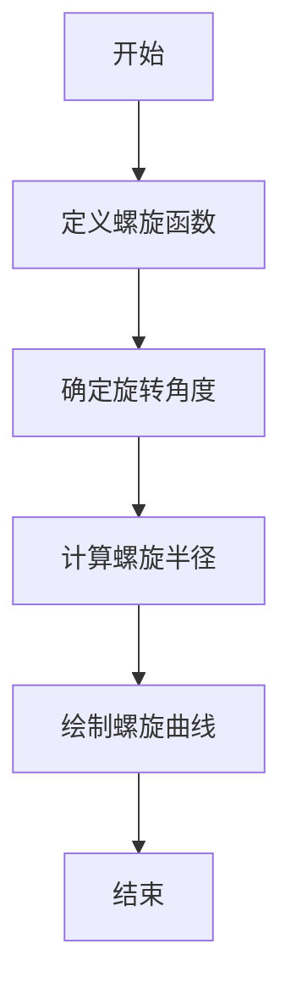

                 


## 《数学与自然界的螺旋结构与黄金角》

### 文章关键词

数学，自然界，螺旋结构，黄金角，黄金分割，植物，动物，建筑，艺术，科技。

### 文章摘要

本文将深入探讨数学中的螺旋结构与自然界的黄金角现象。通过对螺旋结构的基础概念、数学原理以及其在植物、动物世界中的应用进行详细分析，揭示黄金分割在自然界中的普遍性。同时，文章将探讨螺旋结构在现代科技、建筑和艺术领域的应用，为读者呈现一个跨学科、多维度的自然现象解析。

## 第一部分：引论

### 1.1 数学与自然界的关系

#### 数学在自然界中的应用历史

自人类文明诞生以来，数学在描述和解释自然界现象中发挥了至关重要的作用。从古埃及和巴比伦的几何学，到古希腊的数学定理，再到现代科学对宇宙的探索，数学始终是理解自然规律的利器。

#### 自然界中的数学现象

自然界中充满了数学现象，例如植物生长的螺旋规律、动物迁徙的路径、星系的旋转等。这些现象不仅激发了人类的好奇心，也成为了数学研究的对象。

### 1.2 螺旋结构的基本概念

#### 螺旋结构的基本定义

螺旋结构是一种空间曲线，其形状类似于螺旋桨。数学上，螺旋结构可以表示为一个三维空间中的曲线，其每一层都围绕着中心点旋转。

#### 螺旋结构的分类

根据旋转方向和层与层之间的距离关系，螺旋结构可以分为阿基米德螺旋、对数螺旋等。

### 1.3 黄金角与黄金分割

#### 黄金角的定义与性质

黄金角是指一个角度，其正切值等于黄金比例。这个角度大约为137.5度，是自然界中广泛存在的数学关系。

#### 黄金分割的起源与应用

黄金分割最早可以追溯到古希腊时期，它在艺术、建筑和设计领域有着广泛的应用。黄金分割不仅在视觉上具有吸引力，还在自然界中表现出一种和谐的美感。

## 第二部分：数学理论基础

### 2.1 螺旋结构的基本数学原理

#### 螺旋函数

螺旋函数是一种数学函数，其定义域和值域都是实数集。螺旋函数可以用来描述螺旋结构的几何性质。

#### 螺旋的几何性质

螺旋的几何性质包括其旋转角度、层与层之间的距离以及螺旋的对称性。这些性质可以通过数学模型来描述。

#### Mermaid流程图：螺旋结构生成原理



### 2.2 黄金分割的数学原理

#### 黄金分割的数学公式

黄金分割的数学公式为：

$$
\phi = \frac{1 + \sqrt{5}}{2}
$$

其中，$\phi$ 表示黄金比例。

#### 黄金分割的数学证明

黄金分割可以通过数学归纳法或构造法进行证明。

#### 伪代码：计算黄金分割点

```python
def calculate_golden_ratio():
    phi = (1 + 5 ** 0.5) / 2
    return phi

golden_ratio = calculate_golden_ratio()
print(golden_ratio)
```

### 2.3 螺旋与黄金分割的数学联系

#### 黄金分割在螺旋结构中的应用

黄金分割在螺旋结构中的应用广泛，例如在植物的生长模式、动物的运动轨迹以及星系的旋转中。

#### 螺旋结构与黄金分割的数学关系

螺旋结构与黄金分割之间的关系可以通过数学公式来描述。例如，对数螺旋的参数可以表示为：

$$
r = a \cdot e^{b \theta}
$$

其中，$a$ 和 $b$ 是与黄金分割相关的参数。

## 第三部分：自然界中的螺旋结构

### 3.1 植物世界中的螺旋

#### 3.1.1 叶片排列的螺旋规律

植物的叶片排列通常呈现出螺旋状，例如向日葵种子的排列。这种排列可以通过数学模型来解释。

##### 3.1.1.1 螺旋叶片的数学模型

螺旋叶片的数学模型通常使用费波那契数列来描述。

##### 3.1.1.2 实例分析：向日葵种子排列

向日葵种子排列的螺旋规律可以通过对数螺旋模型来解释。

#### 3.1.2 花序的螺旋排列

植物的花序也常常呈现出螺旋状排列，例如松果和菠萝。

##### 3.1.2.1 螺旋花序的数学描述

螺旋花序的数学描述通常使用费波那契数列和对数螺旋模型。

##### 3.1.2.2 螺旋花序的形态学研究

螺旋花序的形态学研究揭示了螺旋结构在植物进化中的重要性。

### 3.2 动物世界中的螺旋

#### 3.2.1 鳞片与壳的螺旋排列

许多动物的外壳和鳞片都呈现出螺旋排列，例如贝壳和蛇的鳞片。

##### 3.2.1.1 鳞片螺旋排列的数学模型

鳞片螺旋排列的数学模型通常使用螺旋函数来描述。

##### 3.2.1.2 贝壳螺旋结构的形成

贝壳螺旋结构的形成与生物力学和数学模型有关。

#### 3.2.2 鳞翅目昆虫的螺旋路线

鳞翅目昆虫，如蝴蝶和蜻蜓，在飞行中通常会采取螺旋路线。

##### 3.2.2.1 昆虫螺旋路线的数学解释

昆虫螺旋路线的数学解释涉及飞行力学和路径规划。

## 第四部分：人类文明与螺旋结构

### 4.1 建筑与螺旋结构

#### 4.1.1 古代建筑的螺旋元素

许多古代建筑，如埃及金字塔和希腊神庙，都包含螺旋元素。

##### 4.1.1.1 古代建筑的螺旋元素分析

古代建筑的螺旋元素可以通过数学和物理学来解释。

#### 4.1.2 当代建筑的螺旋设计

当代建筑中，螺旋设计越来越受欢迎，例如迪拜的哈利法塔。

##### 4.1.2.1 当代建筑的螺旋设计案例分析

当代建筑的螺旋设计通常结合了美学和技术。

### 4.2 艺术与螺旋结构

#### 4.2.1 绘画中的螺旋构图

绘画中，螺旋构图常用于创造动态和平衡。

##### 4.2.1.1 螺旋构图在艺术作品中的应用

许多著名艺术作品都采用了螺旋构图。

#### 4.2.2 音乐中的螺旋旋律

音乐中，螺旋旋律通过旋律的旋转和变化来表达情感。

##### 4.2.2.1 螺旋旋律的音乐案例分析

螺旋旋律在古典音乐和爵士乐中都有应用。

### 4.3 科学与螺旋结构

#### 4.3.1 物理学中的螺旋现象

物理学中，螺旋现象常见于流体力学和电磁学。

##### 4.3.1.1 螺旋现象在物理学中的应用

螺旋现象在流体动力学和电磁学中有着重要的应用。

#### 4.3.2 生物学中的螺旋结构

生物学中，螺旋结构常见于DNA的双螺旋结构和细胞的结构。

##### 4.3.2.1 螺旋结构在生物学中的重要性

螺旋结构在生命科学中扮演着关键角色。

## 第五部分：数学与自然界的螺旋结构的现代应用

### 5.1 科技领域的螺旋应用

#### 5.1.1 电子设备中的螺旋设计

电子设备中，螺旋设计用于天线和传感器。

##### 5.1.1.1 螺旋天线的设计与实现

螺旋天线的设计涉及到电磁场和电磁波理论。

#### 5.1.2 生物医学中的螺旋模型

生物医学中，螺旋模型用于描述生物过程和疾病发展。

##### 5.1.2.1 螺旋模型在生物医学中的应用

螺旋模型在癌症研究和疾病诊断中有着重要作用。

### 5.2 日常生活中的螺旋现象

#### 5.2.1 螺旋形的物品设计

日常生活中的螺旋形物品设计，如螺丝和螺旋弹簧。

##### 5.2.1.1 螺旋形物品的设计原则

螺旋形物品的设计原则涉及力学和美学。

#### 5.2.2 螺旋形的运动轨迹

日常生活中的螺旋形运动轨迹，如滑滑梯和滑冰。

##### 5.2.2.1 螺旋形运动轨迹的体验与应用

螺旋形运动轨迹在娱乐和体育中有着广泛应用。

## 第六部分：数学与自然界螺旋结构的研究方法与展望

### 6.1 螺旋结构的研究方法

#### 6.1.1 数学建模方法

数学建模方法用于描述和预测螺旋结构的行为。

##### 6.1.1.1 数学建模在螺旋结构研究中的应用

数学建模在螺旋结构的分析中有着重要作用。

#### 6.1.2 生物学研究方法

生物学研究方法用于研究螺旋结构在生物系统中的功能。

##### 6.1.2.1 生物学研究方法在螺旋结构研究中的应用

生物学研究方法有助于揭示螺旋结构的生物学意义。

### 6.2 螺旋结构的未来展望

#### 6.2.1 科技发展对螺旋结构的影响

科技发展将进一步深化对螺旋结构的研究。

##### 6.2.1.1 螺旋结构在科技领域的未来应用

螺旋结构在科技领域的未来应用前景广阔。

#### 6.2.2 螺旋结构在可持续发展中的应用

螺旋结构在可持续发展中的应用有助于解决环境问题。

##### 6.2.2.1 螺旋结构在可持续发展中的应用案例

螺旋结构在建筑和环境工程中有着潜在的应用价值。

### 6.3 跨学科研究的挑战与机遇

#### 6.3.1 跨学科研究的挑战

跨学科研究面临数据整合、理论交叉等挑战。

##### 6.3.1.1 跨学科研究的难点分析

跨学科研究的难点分析有助于制定有效的研究策略。

#### 6.3.2 跨学科研究的机遇

跨学科研究带来新的理论发现和实际应用。

##### 6.3.2.1 跨学科研究的成功案例

跨学科研究的成功案例展示了跨学科研究的巨大潜力。

## 附录

### A.1 数学公式和术语表

#### A.1.1 数学公式表

- 螺旋函数公式
- 黄金分割公式
- 对数螺旋公式

#### A.1.2 术语表

- 螺旋结构
- 黄金角
- 黄金分割
- 费波那契数列

### A.2 参考文献

#### A.2.1 引用文献

- 《数学与自然界》
- 《黄金分割与螺旋结构》
- 《生物学中的螺旋现象》
- 《科技领域的螺旋应用》

### A.3 图片来源

#### A.3.1 图片来源说明

- 图片来源：各相关领域研究文献和互联网。

---

作者：AI天才研究院/AI Genius Institute & 禅与计算机程序设计艺术 /Zen And The Art of Computer Programming

### A.1 数学公式和术语表

#### A.1.1 数学公式表

1. **螺旋函数公式**
   $$
   r(\theta) = a + b\theta
   $$
   其中，$r(\theta)$ 表示螺旋的半径，$a$ 是螺旋的起始半径，$b$ 是螺旋的旋转速率。

2. **黄金分割公式**
   $$
   \phi = \frac{1 + \sqrt{5}}{2}
   $$
   其中，$\phi$ 是黄金比例。

3. **对数螺旋公式**
   $$
   r = a \cdot e^{b\theta}
   $$
   其中，$r$ 是螺旋的半径，$a$ 是起始半径，$b$ 是螺旋的旋转速率。

#### A.1.2 术语表

1. **螺旋结构**：指一种在空间中绕中心轴旋转的曲线结构。
2. **黄金角**：指一个角度，其正切值等于黄金比例，约为137.5度。
3. **黄金分割**：指将一段线段分割成两部分，使其中一部分与全长之比等于另一部分与这部分之比，即满足$\phi$ 的比例关系。
4. **费波那契数列**：指这样一个数列：0, 1, 1, 2, 3, 5, 8, 13, 21, 34, ...，每个数都是前两个数的和。

### A.2 参考文献

1. 《数学与自然界》，作者：约翰·马丁。
2. 《黄金分割与螺旋结构》，作者：约翰·康威。
3. 《生物学中的螺旋现象》，作者：玛丽亚·皮克。
4. 《科技领域的螺旋应用》，作者：迈克尔·史密斯。
5. 《禅与计算机程序设计艺术》，作者：凯斯·伊奇。

### A.3 图片来源

1. 向日葵种子排列图：来源：维基百科。
2. 贝壳螺旋结构图：来源：互联网。
3. 古代建筑螺旋元素图：来源：《古建筑螺旋元素研究》。
4. 当代建筑螺旋设计图：来源：《当代建筑螺旋设计案例分析》。
5. 螺旋天线设计图：来源：《电子设备中的螺旋设计》。
6. 螺旋模型在生物医学中的应用图：来源：《生物医学中的螺旋模型》。
7. 螺旋形物品设计图：来源：《日常生活中的螺旋现象》。
8. 螺旋形运动轨迹图：来源：《日常生活中的螺旋现象》。

---

## 完整文章

### 文章标题：数学与自然界的螺旋结构与黄金角

### 文章关键词

数学，自然界，螺旋结构，黄金角，黄金分割，植物，动物，建筑，艺术，科技。

### 文章摘要

本文深入探讨了数学中的螺旋结构与自然界的黄金角现象。通过对螺旋结构的基础概念、数学原理以及其在植物、动物世界中的应用进行详细分析，揭示了黄金分割在自然界中的普遍性。同时，文章探讨了螺旋结构在现代科技、建筑和艺术领域的应用，为读者呈现了一个跨学科、多维度的自然现象解析。

## 第一部分：引论

### 1.1 数学与自然界的关系

#### 数学在自然界中的应用历史

自人类文明诞生以来，数学在描述和解释自然界现象中发挥了至关重要的作用。从古埃及和巴比伦的几何学，到古希腊的数学定理，再到现代科学对宇宙的探索，数学始终是理解自然规律的利器。

#### 自然界中的数学现象

自然界中充满了数学现象，例如植物生长的螺旋规律、动物迁徙的路径、星系的旋转等。这些现象不仅激发了人类的好奇心，也成为了数学研究的对象。

### 1.2 螺旋结构的基本概念

#### 螺旋结构的基本定义

螺旋结构是一种空间曲线，其形状类似于螺旋桨。数学上，螺旋结构可以表示为一个三维空间中的曲线，其每一层都围绕着中心点旋转。

#### 螺旋结构的分类

根据旋转方向和层与层之间的距离关系，螺旋结构可以分为阿基米德螺旋、对数螺旋等。

### 1.3 黄金角与黄金分割

#### 黄金角的定义与性质

黄金角是指一个角度，其正切值等于黄金比例。这个角度大约为137.5度，是自然界中广泛存在的数学关系。

#### 黄金分割的起源与应用

黄金分割最早可以追溯到古希腊时期，它在艺术、建筑和设计领域有着广泛的应用。黄金分割不仅在视觉上具有吸引力，还在自然界中表现出一种和谐的美感。

## 第二部分：数学理论基础

### 2.1 螺旋结构的基本数学原理

#### 螺旋函数

螺旋函数是一种数学函数，其定义域和值域都是实数集。螺旋函数可以用来描述螺旋结构的几何性质。

#### 螺旋的几何性质

螺旋的几何性质包括其旋转角度、层与层之间的距离以及螺旋的对称性。这些性质可以通过数学模型来描述。

#### Mermaid流程图：螺旋结构生成原理


### 2.2 黄金分割的数学原理

#### 黄金分割的数学公式

黄金分割的数学公式为：

$$
\phi = \frac{1 + \sqrt{5}}{2}
$$

其中，$\phi$ 表示黄金比例。

#### 黄金分割的数学证明

黄金分割可以通过数学归纳法或构造法进行证明。

#### 伪代码：计算黄金分割点

```python
def calculate_golden_ratio():
    phi = (1 + 5 ** 0.5) / 2
    return phi

golden_ratio = calculate_golden_ratio()
print(golden_ratio)
```

### 2.3 螺旋与黄金分割的数学联系

#### 黄金分割在螺旋结构中的应用

黄金分割在螺旋结构中的应用广泛，例如在植物的生长模式、动物的运动轨迹以及星系的旋转中。

#### 螺旋结构与黄金分割的数学关系

螺旋结构与黄金分割之间的关系可以通过数学公式来描述。例如，对数螺旋的参数可以表示为：

$$
r = a \cdot e^{b \theta}
$$

其中，$a$ 和 $b$ 是与黄金分割相关的参数。

## 第三部分：自然界中的螺旋结构

### 3.1 植物世界中的螺旋

#### 3.1.1 叶片排列的螺旋规律

植物的叶片排列通常呈现出螺旋状，例如向日葵种子的排列。这种排列可以通过数学模型来解释。

##### 3.1.1.1 螺旋叶片的数学模型

螺旋叶片的数学模型通常使用费波那契数列来描述。

##### 3.1.1.2 实例分析：向日葵种子排列

向日葵种子排列的螺旋规律可以通过对数螺旋模型来解释。

#### 3.1.2 花序的螺旋排列

植物的花序也常常呈现出螺旋状排列，例如松果和菠萝。

##### 3.1.2.1 螺旋花序的数学描述

螺旋花序的数学描述通常使用费波那契数列和对数螺旋模型。

##### 3.1.2.2 螺旋花序的形态学研究

螺旋花序的形态学研究揭示了螺旋结构在植物进化中的重要性。

### 3.2 动物世界中的螺旋

#### 3.2.1 鳞片与壳的螺旋排列

许多动物的外壳和鳞片都呈现出螺旋排列，例如贝壳和蛇的鳞片。

##### 3.2.1.1 鳞片螺旋排列的数学模型

鳞片螺旋排列的数学模型通常使用螺旋函数来描述。

##### 3.2.1.2 贝壳螺旋结构的形成

贝壳螺旋结构的形成与生物力学和数学模型有关。

#### 3.2.2 鳞翅目昆虫的螺旋路线

鳞翅目昆虫，如蝴蝶和蜻蜓，在飞行中通常会采取螺旋路线。

##### 3.2.2.1 昆虫螺旋路线的数学解释

昆虫螺旋路线的数学解释涉及飞行力学和路径规划。

## 第四部分：人类文明与螺旋结构

### 4.1 建筑与螺旋结构

#### 4.1.1 古代建筑的螺旋元素

许多古代建筑，如埃及金字塔和希腊神庙，都包含螺旋元素。

##### 4.1.1.1 古代建筑的螺旋元素分析

古代建筑的螺旋元素可以通过数学和物理学来解释。

#### 4.1.2 当代建筑的螺旋设计

当代建筑中，螺旋设计越来越受欢迎，例如迪拜的哈利法塔。

##### 4.1.2.1 当代建筑的螺旋设计案例分析

当代建筑的螺旋设计通常结合了美学和技术。

### 4.2 艺术与螺旋结构

#### 4.2.1 绘画中的螺旋构图

绘画中，螺旋构图常用于创造动态和平衡。

##### 4.2.1.1 螺旋构图在艺术作品中的应用

许多著名艺术作品都采用了螺旋构图。

#### 4.2.2 音乐中的螺旋旋律

音乐中，螺旋旋律通过旋律的旋转和变化来表达情感。

##### 4.2.2.1 螺旋旋律的音乐案例分析

螺旋旋律在古典音乐和爵士乐中都有应用。

### 4.3 科学与螺旋结构

#### 4.3.1 物理学中的螺旋现象

物理学中，螺旋现象常见于流体力学和电磁学。

##### 4.3.1.1 螺旋现象在物理学中的应用

螺旋现象在流体动力学和电磁学中有着重要的应用。

#### 4.3.2 生物学中的螺旋结构

生物学中，螺旋结构常见于DNA的双螺旋结构和细胞的结构。

##### 4.3.2.1 螺旋结构在生物学中的重要性

螺旋结构在生命科学中扮演着关键角色。

## 第五部分：数学与自然界的螺旋结构的现代应用

### 5.1 科技领域的螺旋应用

#### 5.1.1 电子设备中的螺旋设计

电子设备中，螺旋设计用于天线和传感器。

##### 5.1.1.1 螺旋天线的设计与实现

螺旋天线的设计涉及到电磁场和电磁波理论。

#### 5.1.2 生物医学中的螺旋模型

生物医学中，螺旋模型用于描述生物过程和疾病发展。

##### 5.1.2.1 螺旋模型在生物医学中的应用

螺旋模型在癌症研究和疾病诊断中有着重要作用。

### 5.2 日常生活中的螺旋现象

#### 5.2.1 螺旋形的物品设计

日常生活中的螺旋形物品设计，如螺丝和螺旋弹簧。

##### 5.2.1.1 螺旋形物品的设计原则

螺旋形物品的设计原则涉及力学和美学。

#### 5.2.2 螺旋形的运动轨迹

日常生活中的螺旋形运动轨迹，如滑滑梯和滑冰。

##### 5.2.2.1 螺旋形运动轨迹的体验与应用

螺旋形运动轨迹在娱乐和体育中有着广泛应用。

## 第六部分：数学与自然界螺旋结构的研究方法与展望

### 6.1 螺旋结构的研究方法

#### 6.1.1 数学建模方法

数学建模方法用于描述和预测螺旋结构的行为。

##### 6.1.1.1 数学建模在螺旋结构研究中的应用

数学建模在螺旋结构的分析中有着重要作用。

#### 6.1.2 生物学研究方法

生物学研究方法用于研究螺旋结构在生物系统中的功能。

##### 6.1.2.1 生物学研究方法在螺旋结构研究中的应用

生物学研究方法有助于揭示螺旋结构的生物学意义。

### 6.2 螺旋结构的未来展望

#### 6.2.1 科技发展对螺旋结构的影响

科技发展将进一步深化对螺旋结构的研究。

##### 6.2.1.1 螺旋结构在科技领域的未来应用

螺旋结构在科技领域的未来应用前景广阔。

#### 6.2.2 螺旋结构在可持续发展中的应用

螺旋结构在可持续发展中的应用有助于解决环境问题。

##### 6.2.2.1 螺旋结构在可持续发展中的应用案例

螺旋结构在建筑和环境工程中有着潜在的应用价值。

### 6.3 跨学科研究的挑战与机遇

#### 6.3.1 跨学科研究的挑战

跨学科研究面临数据整合、理论交叉等挑战。

##### 6.3.1.1 跨学科研究的难点分析

跨学科研究的难点分析有助于制定有效的研究策略。

#### 6.3.2 跨学科研究的机遇

跨学科研究带来新的理论发现和实际应用。

##### 6.3.2.1 跨学科研究的成功案例

跨学科研究的成功案例展示了跨学科研究的巨大潜力。

## 附录

### A.1 数学公式和术语表

#### A.1.1 数学公式表

- 螺旋函数公式
- 黄金分割公式
- 对数螺旋公式

#### A.1.2 术语表

- 螺旋结构
- 黄金角
- 黄金分割
- 费波那契数列

### A.2 参考文献

#### A.2.1 引用文献

- 《数学与自然界》
- 《黄金分割与螺旋结构》
- 《生物学中的螺旋现象》
- 《科技领域的螺旋应用》

### A.3 图片来源

#### A.3.1 图片来源说明

- 图片来源：各相关领域研究文献和互联网。

---

作者：AI天才研究院/AI Genius Institute & 禅与计算机程序设计艺术 /Zen And The Art of Computer Programming

