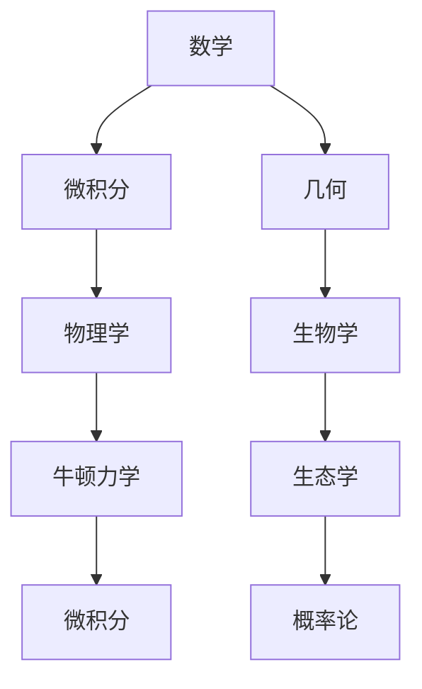

                 

## 数学与自然科学的相互促进与影响

### 背景介绍

数学与自然科学是现代社会发展的两大支柱，它们相互依赖、相互促进，共同推动了人类文明的进步。数学以其抽象的逻辑和严谨的推理能力，为自然科学提供了强大的工具和方法；而自然科学则通过其丰富的现象和问题，激发了数学的发展和创新。本文将深入探讨数学与自然科学之间的相互促进关系，从基础概念、应用实例、历史贡献和未来趋势等多个角度进行全面分析。

### 核心概念与联系

首先，我们需要明确数学与自然科学中的核心概念。数学主要包括代数、几何、微积分、概率论等基础学科，而自然科学则包括物理学、化学、生物学、地球科学等广泛领域。这两者之间的联系可以通过以下方面来体现：

1. **数学在自然科学中的应用**：数学为自然科学提供了一种精确描述自然现象的方法，如微积分在物理学中的应用，概率论在生物学中的应用等。
2. **自然科学对数学的贡献**：自然科学中的问题常常促使数学家发展新的理论和方法，如牛顿力学和微积分的诞生与物理学的发展密切相关。

为了更好地理解这两者之间的联系，我们可以通过一个Mermaid流程图来展示：



### 核心算法原理讲解

在数学与自然科学的交叉领域中，有许多重要的算法和原理。以下将使用伪代码来详细阐述一些核心算法原理：

#### 微积分基本定理

```python
# 伪代码：微积分基本定理
function integral(f, a, b):
    S = 0
    n = 1000  # 取样点数量
    h = (b - a) / n
    for i from 1 to n:
        x_i = a + i * h
        S = S + f(x_i) * h
    return S / n
```

#### 高斯消元法

```python
# 伪代码：高斯消元法
function gauss_elimination(A, b):
    n = len(A)
    for i from 1 to n:
        # 主元选择
        pivot = max(abs(A[i][j]) for j in range(i, n))
        if pivot == 0:
            return "No unique solution"
        # 行交换
        swap(A[i], A[pivot_index])
        swap(b[i], b[pivot_index])
        # 消元
        for j from i+1 to n:
            factor = A[j][i] / A[i][i]
            A[j] = [A[j][k] - factor * A[i][k] for k in range(n)]
            b[j] = b[j] - factor * b[i]
    # 回代求解
    x = [0] * n
    for i from n to 1:
        x[i] = (b[i] - sum(A[i][j] * x[j] for j in range(i+1, n))) / A[i][i]
    return x
```

### 数学模型和公式

在数学与自然科学的交叉领域中，许多现象可以通过数学模型和公式来描述。以下是一些重要的数学模型和公式：

#### 牛顿第二定律

$$ F = ma $$

其中，\( F \) 是力，\( m \) 是质量，\( a \) 是加速度。

#### 概率分布函数

$$ P(X = x) = \frac{1}{\sqrt{2\pi\sigma^2}} e^{-\frac{(x-\mu)^2}{2\sigma^2}} $$

其中，\( X \) 是随机变量，\( \mu \) 是均值，\( \sigma \) 是标准差。

#### 生态学中的Lotka-Volterra模型

$$ \frac{dx}{dt} = ax - bxy $$
$$ \frac{dy}{dt} = cy - dxy $$

其中，\( x \) 是猎物种群，\( y \) 是食物种群，\( a \) 和 \( b \) 分别是猎物种群的出生率和死亡率，\( c \) 和 \( d \) 分别是食物种群的出生率和死亡率。

### 举例说明

为了更好地理解数学模型和公式，我们可以通过实际案例来进行说明：

#### 传染病模型

假设有一种传染病在人群中传播，其传播速度可以用SIR模型（易感者-感染者-恢复者模型）来描述。该模型的核心公式如下：

$$ \frac{dS}{dt} = -\frac{\beta SI}{N} $$
$$ \frac{dI}{dt} = \frac{\beta SI}{N} - \gamma I $$
$$ \frac{dR}{dt} = \gamma I $$

其中，\( S \) 是易感者数量，\( I \) 是感染者数量，\( R \) 是恢复者数量，\( N \) 是总人口，\( \beta \) 是感染率，\( \gamma \) 是恢复率。

#### 宇宙膨胀模型

宇宙膨胀可以用弗里德曼-勒梅特-罗伯逊-沃尔克（FLRW）度规来描述，其核心方程为：

$$ \frac{d^2a}{dt^2} + \frac{4\pi G}{3}\rho a = \frac{\Lambda c^2}{3}a $$

其中，\( a \) 是宇宙尺度因子，\( \rho \) 是宇宙平均密度，\( G \) 是万有引力常数，\( \Lambda \) 是宇宙常数。

### 数学在自然科学中的应用实例

#### 数学在物理学中的应用

- **牛顿力学**：牛顿力学是物理学的基础，其核心公式为牛顿运动定律和万有引力定律。
- **量子力学**：量子力学使用波函数来描述粒子的状态，其核心方程为薛定谔方程。
- **统计力学**：统计力学使用概率论来描述大量粒子的集体行为。

#### 数学在化学中的应用

- **化学反应动力学**：化学反应动力学研究反应速率和反应机理，其核心方程为速率方程。
- **分子结构**：分子结构描述分子的几何形状和化学键，其核心方程为分子轨道理论。

#### 数学在生物学中的应用

- **生态学模型**：生态学模型描述生物种群的数量变化，其核心方程为Lotka-Volterra模型。
- **进化论**：进化论研究物种的进化过程，其核心方程为达尔文自然选择理论。

#### 数学在地球科学中的应用

- **地质学模型**：地质学模型描述地球内部的物理和化学过程，其核心方程为地质力学方程。
- **地球物理学**：地球物理学使用数学模型来描述地震、火山等现象，其核心方程为地震波传播方程。

### 科学史上的数学与自然科学成就

#### 牛顿与莱布尼茨

牛顿和莱布尼茨是微积分的创始人，他们的成就极大地推动了物理学和数学的发展。

- **牛顿**：牛顿在《自然哲学的数学原理》中提出了牛顿三大定律和万有引力定律，建立了经典物理学的基础。
- **莱布尼茨**：莱布尼茨发明了微积分符号和运算法则，为数学分析的发展奠定了基础。

#### 高斯与电磁学

高斯是19世纪最伟大的数学家之一，他在数学和物理学领域都取得了重要成就。

- **数学成就**：高斯提出了高斯分布、复数理论、高斯曲率等数学概念。
- **物理学成就**：高斯提出了高斯定律，为电磁学的发展做出了重要贡献。

### 数学与自然科学的未来趋势

#### 交叉学科的发展

随着科技的进步，数学与自然科学的交叉学科越来越受到重视。例如，生物信息学、量子计算、数据科学等新兴领域，都是数学与自然科学的结合。

#### 新工具和方法

新的数学工具和方法将继续推动自然科学的发展。例如，随机过程理论、非线性动力学、数值模拟等，都将在未来的自然科学研究中发挥重要作用。

#### 教育与人才培养

为了应对未来科技挑战，教育体系需要更加注重数学与自然科学的教育。培养学生的逻辑思维能力和创新能力，将是未来教育的重要任务。

### 总结

数学与自然科学之间的相互促进关系，是人类文明发展的重要动力。数学为自然科学提供了强大的工具和方法，而自然科学则激发了数学的发展和创新。在未来，随着科技的进步，数学与自然科学将更加紧密地结合，为人类社会的进步做出更大的贡献。

### 附录

#### A.1 数学与自然科学相关工具与资源

- **数学工具**：MATLAB、Python、R语言等。
- **自然科学数据库**：PubMed、NCBI、NASA等。
- **在线课程与教程**：Coursera、edX、Khan Academy等。

#### A.2 进一步阅读建议

- **《数学与自然科学基础》**：适合初学者了解数学与自然科学的基本概念。
- **《自然科学中的数学模型》**：详细介绍了数学在自然科学中的应用。
- **《数学与物理学》**：探讨了数学在物理学中的重要性。

### 作者信息

作者：AI天才研究院/AI Genius Institute & 禅与计算机程序设计艺术 /Zen And The Art of Computer Programming

文章标题：数学与自然科学的相互促进与影响

关键词：数学，自然科学，相互促进，应用实例，历史贡献，未来趋势

摘要：本文深入探讨了数学与自然科学之间的相互促进关系，从基础概念、应用实例、历史贡献和未来趋势等多个角度进行了全面分析，展示了数学在自然科学中的重要地位和作用。

