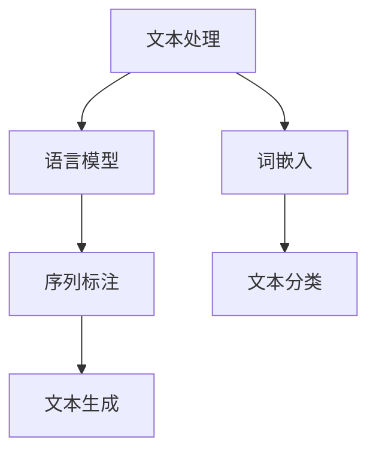

                 

### 摘要

《数学与自然语言处理：语言的数学建模》旨在探讨数学建模在自然语言处理领域的应用。本书首先介绍了自然语言处理的基本概念，如语言模型、词嵌入、序列标注和文本分类，并通过Mermaid流程图展示了这些概念之间的联系。接着，本书深入讲解了数学建模的基础知识，包括线性代数、概率论与数理统计以及最优化方法，并使用伪代码进行了详细阐述。随后，本书进一步探讨了自然语言处理中的数学模型，如n-gram模型、神经网络语言模型、机器翻译模型以及文本生成和对话系统。在实际应用方面，本书提供了丰富的项目实战案例，包括文本分类、主题模型、语音识别和对话系统等，并对每个项目进行了详细讲解和代码解读。最后，本书总结了最佳实践技巧，并提供了拓展阅读建议，帮助读者深入理解数学与自然语言处理的结合。

# 《数学与自然语言处理：语言的数学建模》

关键词：自然语言处理，数学建模，语言模型，词嵌入，序列模型，文本生成，对话系统，项目实战

> “作者：AI天才研究院/AI Genius Institute & 禅与计算机程序设计艺术 /Zen And The Art of Computer Programming”

## 前言

### 书籍背景

自然语言处理（Natural Language Processing，NLP）作为人工智能领域的一个重要分支，其目的是使计算机能够理解、生成和处理人类语言。近年来，随着深度学习技术的发展，NLP取得了显著的进步。然而，要实现高效的NLP，必须依赖数学建模和算法优化。数学建模作为一种强大的工具，能够将复杂的语言现象转化为可计算的数学模型，从而提高NLP系统的性能和效果。

数学建模在NLP中的应用非常广泛，从语言模型的构建到文本分类、机器翻译、情感分析等，都离不开数学的支持。本书旨在深入探讨数学建模在自然语言处理领域的应用，通过系统性地介绍相关数学理论和算法，帮助读者理解并掌握如何将数学方法应用于NLP问题。

### 目标读者

本书的目标读者是具有计算机科学和数学背景的读者，包括：

- 自然语言处理和人工智能领域的从业者
- 计算机科学、数学等相关专业的学生和研究人员
- 对自然语言处理和数学建模感兴趣的自学者

本书将按照以下结构展开：

1. **数学与自然语言处理基础**：介绍自然语言处理的基本概念和数学建模的基础知识。
2. **数学建模基础**：详细讲解线性代数、概率论与数理统计以及最优化方法。
3. **自然语言处理的数学模型**：探讨语言模型、词嵌入、机器翻译模型等。
4. **文本分类与主题模型**：介绍文本分类算法和主题模型。
5. **序列模型与语音识别**：讲解序列模型和语音识别的相关算法。
6. **文本生成与对话系统**：探讨文本生成和对话系统。
7. **数学建模与自然语言处理实践**：通过实际案例展示如何将数学建模应用于NLP问题。
8. **附录**：提供数学公式、算法伪代码和相关参考文献。

通过本书的学习，读者将能够：

- 理解自然语言处理的基本概念和数学建模方法。
- 掌握常见的自然语言处理算法和模型。
- 掌握如何将数学方法应用于解决实际NLP问题。

## 第1章：数学与自然语言处理基础

### 1.1 自然语言处理核心概念

自然语言处理（NLP）是人工智能领域的一个重要分支，其目的是使计算机能够理解、生成和处理人类语言。NLP的核心概念包括文本处理、语言模型、词嵌入、序列标注和文本分类等。以下是对这些核心概念的简要介绍和它们之间的联系。

**文本处理**：文本处理是NLP的基础，包括文本的采集、预处理和表示。文本采集通常涉及从互联网、文档和其他来源收集文本数据。预处理则包括分词、去停用词、词性标注等步骤，目的是将原始文本转换为适合进行NLP分析的形式。文本表示是将文本转换为计算机可以处理的数字形式，如词向量、词袋模型等。

**语言模型**：语言模型是一种概率模型，用于预测一个句子或一个词序列的概率。语言模型可以基于统计方法（如n-gram模型）或深度学习方法（如神经网络语言模型）。它们在许多NLP任务中都有广泛的应用，例如机器翻译、语音识别和文本生成。

**词嵌入**：词嵌入（Word Embedding）是一种将单词映射到高维向量空间的方法，这些向量能够捕捉单词的语义和语法信息。词嵌入模型包括Word2Vec、GloVe和BERT等，它们在NLP任务中具有重要作用，如文本分类、情感分析和机器翻译。

**序列标注**：序列标注是一种对文本中的每个单词或字符进行分类的任务，例如命名实体识别（Named Entity Recognition，NER）和词性标注（Part-of-Speech Tagging）。这些任务通常使用序列模型（如循环神经网络（RNN）和长短时记忆网络（LSTM））来处理。

**文本分类**：文本分类是一种将文本分类到预定义的类别中的任务。常见的文本分类算法包括朴素贝叶斯、支持向量机（SVM）和深度学习模型（如卷积神经网络（CNN）和长短期记忆网络（LSTM））。文本分类在社交媒体分析、垃圾邮件过滤和情感分析等领域有广泛应用。

**核心概念与联系**：

为了更好地理解这些核心概念之间的联系，我们可以使用Mermaid流程图来展示它们之间的关系：



在NLP任务中，文本处理是所有任务的基础，它决定了后续处理的质量。语言模型和词嵌入是文本表示的关键技术，它们帮助计算机理解和生成自然语言。序列标注和文本分类则是对文本内容进行分析和分类的核心任务。文本生成是一种更加高级的NLP任务，它能够根据已有的文本生成新的文本内容。

### 1.2 语言模型与概率模型

语言模型（Language Model）是自然语言处理中的一个核心概念，它用于预测自然语言中下一个单词或字符的概率。语言模型可以分为基于统计的方法和基于深度学习的方法。本节将介绍几种常见的语言模型，并讨论它们在NLP中的应用。

**n-gram模型**

n-gram模型是最早的语言模型之一，它假设一个单词序列的概率可以通过前n个单词的概率来计算。n-gram模型的核心公式如下：

$$P(w_1, w_2, \ldots, w_n) = \prod_{i=1}^{n} P(w_i | w_{i-1})$$

其中，$P(w_i | w_{i-1})$表示在给定前一个词$w_{i-1}$的情况下，下一个词$w_i$的条件概率。

**n-gram模型的应用**

n-gram模型在文本生成、搜索引擎优化和机器翻译等领域都有广泛应用。例如，在文本生成中，可以使用n-gram模型来预测下一个词，从而生成连贯的文本。在搜索引擎优化中，n-gram模型可以帮助分析关键词的分布，从而优化网页内容。

**神经网络语言模型**

随着深度学习技术的发展，神经网络语言模型（Neural Language Model）成为了语言模型的主流。神经网络语言模型使用深度神经网络来捕捉语言中的复杂模式。其中，长短期记忆网络（Long Short-Term Memory，LSTM）和Transformer模型是最常用的两种神经网络语言模型。

**LSTM模型**

LSTM模型是循环神经网络（Recurrent Neural Network，RNN）的一种改进，它能够更好地处理序列数据。LSTM模型的核心思想是通过引入门控机制，来控制信息的流动，从而避免梯度消失和梯度爆炸问题。

**Transformer模型**

Transformer模型是近年来提出的一种全新的神经网络架构，它在机器翻译、文本生成等任务上表现出了出色的性能。Transformer模型的核心思想是使用自注意力机制（Self-Attention），来捕捉序列中单词之间的依赖关系。

**数学模型和数学公式**

为了更好地理解神经网络语言模型，我们可以使用以下数学公式和算法伪代码来描述。

**LSTM模型伪代码**

```python
# 伪代码：LSTM单元
def lstm_cell(input, hidden, cell):
    # 输入：当前输入、隐藏状态和细胞状态
    # 输出：新的隐藏状态和细胞状态

    # 首先计算遗忘门、输入门和输出门的参数
    forget gate = sigmoid(W_f * [hidden, input] + b_f)
    input gate = sigmoid(W_i * [hidden, input] + b_i)
    output gate = sigmoid(W_o * [hidden, input] + b_o)

    # 计算细胞状态
    cell = forget gate * cell + input gate * tanh(W_c * [hidden, input] + b_c)

    # 计算隐藏状态
    hidden = output gate * tanh(cell)

    return hidden, cell
```

**Transformer模型伪代码**

```python
# 伪代码：Transformer模型
def transformer(input_sequence, hidden_sequence):
    # 输入：输入序列和隐藏序列
    # 输出：新的隐藏序列

    # 首先计算自注意力权重
    attention_weights = softmax(Q * K, dim=2)

    # 计算自注意力输出
    attention_output = attention_weights * V

    # 计算新的隐藏序列
    hidden_sequence = attention_output + hidden_sequence

    return hidden_sequence
```

**举例说明**

**n-gram模型**

假设我们有一个三元的文本序列：“我爱中国”。我们可以使用n-gram模型来计算这个序列的概率。具体步骤如下：

1. 计算每个单词的前一单词的概率。
2. 计算整个序列的概率。

**LSTM模型**

假设我们有一个简单的文本序列：“你好世界”。我们可以使用LSTM模型来预测下一个单词。具体步骤如下：

1. 初始化隐藏状态和细胞状态。
2. 逐词计算隐藏状态和细胞状态。
3. 使用最后一个隐藏状态来预测下一个单词。

**Transformer模型**

假设我们有一个简单的文本序列：“你好”。我们可以使用Transformer模型来预测下一个单词。具体步骤如下：

1. 将文本序列编码为嵌入向量。
2. 逐词计算自注意力权重和自注意力输出。
3. 使用最后一个隐藏状态来预测下一个单词。

### 1.3 自然语言处理应用场景

自然语言处理技术广泛应用于各个领域，以下列举了一些典型的应用场景：

**搜索引擎**

搜索引擎使用NLP技术来处理用户的查询，并返回相关的搜索结果。具体方法包括：

- 查询意图理解：通过分析用户的查询语句，理解用户想要寻找的信息。
- 搜索结果排序：根据查询意图和文本的相关性，对搜索结果进行排序。

**机器翻译**

机器翻译是一种将一种自然语言翻译成另一种自然语言的技术。常见的机器翻译方法包括：

- 基于规则的方法：使用预定义的语法和语义规则来翻译文本。
- 统计机器翻译：使用大量已翻译的文本数据来训练翻译模型。
- 神经网络机器翻译：使用深度学习模型来学习翻译规则。

**文本分类**

文本分类是一种将文本分类到预定义的类别中的任务。常见的应用包括：

- 社交媒体分析：将用户发表的文本分类为正面、负面或中立。
- 垃圾邮件过滤：将电子邮件分类为垃圾邮件或正常邮件。

**情感分析**

情感分析是一种评估文本中情感倾向的技术。常见的应用包括：

- 消费者反馈分析：分析客户对产品或服务的反馈，以了解他们的情感。
- 社交媒体监控：监控社交媒体上的情感趋势，以了解公众情绪。

**问答系统**

问答系统是一种能够回答用户提出的问题的技术。常见的应用包括：

- 虚拟助手：如Apple的Siri、Google的Google Assistant等。
- 智能客服：通过文本或语音与用户交互，回答常见问题。

通过这些应用场景，我们可以看到自然语言处理技术在各个领域都发挥着重要作用。随着技术的不断进步，自然语言处理的应用将会越来越广泛，为人们的生活带来更多便利。

## 第2章：数学建模基础

### 2.1 线性代数基础

线性代数是数学建模中的基础工具，它在自然语言处理中有着广泛的应用。以下我们将详细讲解线性代数中的核心概念，包括矩阵运算、特征值与特征向量等。

#### 矩阵运算

矩阵（Matrix）是由一系列数字按行列排列组成的二维数组。以下是一些常见的矩阵运算：

1. **矩阵加法与减法**：两个矩阵只有在维度相同的情况下才能进行加法或减法运算。运算规则是对应元素相加或相减。
2. **矩阵乘法**：两个矩阵的乘法结果是一个新矩阵，其元素是原矩阵对应元素乘积的和。矩阵乘法满足结合律和分配律，但不满足交换律。
3. **转置**：一个矩阵的转置是将原矩阵的行和列互换，得到的新矩阵。
4. **逆矩阵**：如果一个矩阵是可逆的，那么它的逆矩阵可以通过求解线性方程组得到。逆矩阵在矩阵乘法中有着重要的作用，例如求解线性方程组。

以下是矩阵运算的伪代码示例：

```python
# 伪代码：矩阵加法
def matrix_addition(A, B):
    # 输入：矩阵A和矩阵B
    # 输出：矩阵A和矩阵B的和
    result = [[0 for _ in range(len(A[0]))] for _ in range(len(A))]
    for i in range(len(A)):
        for j in range(len(A[0])):
            result[i][j] = A[i][j] + B[i][j]
    return result

# 伪代码：矩阵乘法
def matrix_multiplication(A, B):
    # 输入：矩阵A和矩阵B
    # 输出：矩阵A和矩阵B的乘积
    result = [[0 for _ in range(len(B[0]))] for _ in range(len(A))]
    for i in range(len(A)):
        for j in range(len(B[0])):
            for k in range(len(B)):
                result[i][j] += A[i][k] * B[k][j]
    return result
```

#### 特征值与特征向量

特征值（Eigenvalue）和特征向量（Eigenvector）是矩阵理论中的重要概念。一个矩阵的某个特征值对应的特征向量是该矩阵的线性变换后仍然保持不变的方向。

1. **特征值与特征向量的定义**：对于矩阵A，如果存在一个非零向量v和一个标量λ，使得$Av = λv$，则λ是A的一个特征值，v是A对应于λ的特征向量。
2. **求解特征值与特征向量**：通过求解线性方程组$Av = λv$，可以求得矩阵的特征值和特征向量。
3. **特征值的几何意义**：特征值表示矩阵对空间中向量的缩放因子，特征向量表示在变换后的空间中保持不变的方向。

以下是求解特征值与特征向量的伪代码示例：

```python
# 伪代码：求解特征值与特征向量
def eigen_decomposition(A):
    # 输入：矩阵A
    # 输出：特征值和特征向量
    eigenvalues = []
    eigenvectors = []
    # 使用numpy库求解特征值和特征向量
    eigenvalues, eigenvectors = np.linalg.eig(A)
    return eigenvalues, eigenvectors
```

#### 线性代数在自然语言处理中的应用

线性代数在自然语言处理中有着广泛的应用，以下列举几个典型例子：

1. **文本表示**：使用矩阵来表示文本，如词袋模型和词嵌入。
2. **序列模型**：循环神经网络（RNN）和长短时记忆网络（LSTM）中使用矩阵运算来处理序列数据。
3. **矩阵分解**：如SVD（奇异值分解）在降维和文本相似度计算中的应用。

通过以上对线性代数基础知识的讲解，我们可以更好地理解和应用数学建模方法，为解决自然语言处理问题打下坚实基础。

### 2.2 概率论与数理统计

概率论与数理统计是数学建模中的重要分支，在自然语言处理（NLP）领域中也有着广泛的应用。以下我们将详细讲解概率论与数理统计的核心概念，包括概率分布、统计推断和假设检验。

#### 概率分布

概率分布是描述随机变量可能取值的概率分布情况的数学模型。常见的概率分布包括：

1. **离散概率分布**：用于描述离散随机变量，如伯努利分布、几何分布和泊松分布等。这些分布能够帮助我们理解和预测离散事件的发生概率。
2. **连续概率分布**：用于描述连续随机变量，如正态分布、均匀分布和指数分布等。这些分布能够帮助我们理解和预测连续数据的取值概率。

**概率分布函数与概率质量函数**：

- **概率分布函数（Probability Distribution Function，PDF）**：对于连续随机变量X，其概率分布函数定义为$F(x) = P(X \leq x)$。PDF描述了随机变量X在某个值x以下的所有可能取值的概率。
- **概率质量函数（Probability Mass Function，PMF）**：对于离散随机变量X，其概率质量函数定义为$P(X = x)$。PMF描述了随机变量X取特定值x的概率。

#### 统计推断

统计推断是基于样本数据来推断总体特征的过程。常见的统计推断方法包括：

1. **参数估计**：通过样本数据估计总体参数的方法，如最大似然估计（Maximum Likelihood Estimation，MLE）和无偏估计（Unbiased Estimation）。参数估计的目的是找到一组参数，使得样本数据的概率最大或期望最小。
2. **假设检验**：在统计推断中，通过样本数据对总体的某个假设进行验证。常见的假设检验方法包括t检验、F检验和卡方检验等。

**置信区间**：

置信区间（Confidence Interval，CI）是统计推断中的一个重要概念，用于估计总体参数的取值范围。对于一个给定的参数θ，置信区间CI是指在样本数据基础上，能够以一定概率（置信水平）包含θ的区间。

#### 假设检验

假设检验是一种用于验证总体参数是否满足某种假设的方法。常见的假设检验步骤包括：

1. **设定原假设和备择假设**：在假设检验中，我们首先设定一个原假设H0和备择假设H1。原假设通常是一个关于总体参数的零假设，备择假设则是一个与原假设相对立的假设。
2. **选择检验统计量**：根据原假设和备择假设，选择合适的检验统计量，如t统计量、F统计量和卡方统计量等。
3. **计算检验统计量的值**：通过样本数据计算检验统计量的值。
4. **确定临界值**：根据给定的显著性水平（如α=0.05），确定检验统计量的临界值。
5. **做出决策**：将计算出的检验统计量的值与临界值进行比较，根据比较结果做出拒绝或接受原假设的决策。

#### 概率论与数理统计在自然语言处理中的应用

概率论与数理统计在自然语言处理中有广泛的应用，以下列举几个典型例子：

1. **语言模型**：在语言模型中，使用概率分布来描述单词或词序列的概率，如n-gram模型和神经网络语言模型。
2. **文本分类**：在文本分类任务中，使用统计方法来计算文本的特征向量，如TF-IDF和词袋模型。
3. **词嵌入**：在词嵌入中，使用概率分布来表示单词的语义信息，如Word2Vec和GloVe。
4. **序列标注**：在序列标注任务中，使用统计模型来预测序列中每个词的标签，如CRF（条件随机场）和LSTM。
5. **机器翻译**：在机器翻译中，使用概率模型来预测目标语言的单词序列，如基于规则和基于统计的机器翻译模型。

通过以上对概率论与数理统计核心概念的讲解，我们可以更好地理解这些概念在自然语言处理中的应用，为解决实际问题提供理论支持。

### 2.3 最优化方法

最优化方法是数学建模中不可或缺的一部分，特别是在自然语言处理（NLP）领域中，为了求解复杂的优化问题，通常需要采用各种最优化算法。本节将介绍线性规划、非线性规划、梯度下降等常见最优化方法，并讨论它们在NLP中的应用。

#### 线性规划

线性规划是一种在给定线性目标函数和线性约束条件下，求解最优解的问题。其标准形式为：

$$
\min_{x} c^T x \\
s.t. \\
Ax \leq b \\
x \geq 0
$$

其中，$c$是目标函数系数向量，$A$是约束条件系数矩阵，$b$是约束条件常数向量，$x$是待求解的变量向量。

**求解线性规划的方法**：

- **单纯形法**：单纯形法是一种迭代求解线性规划问题的算法，通过沿着单纯形边移动来寻找最优解。
- **内点法**：内点法是一种在约束条件内部求解线性规划问题的算法，避免了单纯形法在边界上的复杂计算。

**线性规划在NLP中的应用**：

- **文本分类**：线性规划可以用于求解文本分类中的SVM（支持向量机）问题，通过最大化分类间隔来提高分类效果。
- **机器翻译**：在机器翻译中，线性规划可以用于求解基于线性模型的翻译问题，如基于线性模型的最优翻译路径。

#### 非线性规划

非线性规划是处理目标函数和约束条件为非线性函数的问题。其标准形式为：

$$
\min_{x} f(x) \\
s.t. \\
g_i(x) \leq 0, \quad h_j(x) = 0
$$

其中，$f(x)$是目标函数，$g_i(x)$和$h_j(x)$是约束条件函数。

**求解非线性规划的方法**：

- **梯度下降法**：梯度下降法是一种迭代求解非线性优化问题的算法，通过沿着目标函数梯度的反方向进行迭代，逐渐逼近最优解。
- **牛顿法**：牛顿法是一种基于目标函数的Hessian矩阵的优化算法，通过求解线性化方程组来找到新的迭代点。

**非线性规划在NLP中的应用**：

- **词嵌入**：在词嵌入中，使用梯度下降法来优化单词的向量表示，使它们在语义上更加接近。
- **机器翻译**：在机器翻译中，非线性规划可以用于优化翻译模型参数，如基于神经网络的翻译模型。

#### 梯度下降

梯度下降法是一种常用的最优化方法，通过沿着目标函数的负梯度方向逐步迭代，以最小化目标函数。其基本形式为：

$$
x_{k+1} = x_k - \alpha \nabla f(x_k)
$$

其中，$x_k$是当前迭代点，$\alpha$是学习率，$\nabla f(x_k)$是目标函数在$x_k$处的梯度。

**梯度下降法在NLP中的应用**：

- **语言模型**：在语言模型中，使用梯度下降法来优化模型参数，以提高模型的预测准确性。
- **文本生成**：在文本生成任务中，使用梯度下降法来优化生成模型参数，以生成更加自然的文本。

#### 实例说明

**梯度下降法伪代码示例**：

```python
# 伪代码：梯度下降法
def gradient_descent(x, learning_rate, gradient):
    # 输入：当前点x、学习率和梯度
    # 输出：新的点
    return x - learning_rate * gradient
```

通过以上对最优化方法的介绍，我们可以看到这些方法在自然语言处理中的应用，为解决复杂优化问题提供了有效的工具。

### 第3章：自然语言处理的数学模型

自然语言处理（NLP）的核心在于如何有效地表示和处理语言数据。数学模型在其中扮演了至关重要的角色，它们不仅帮助我们理解语言的结构和语义，还能提升各种NLP任务的性能。本章将深入探讨自然语言处理中的一些关键数学模型，包括语言模型、词嵌入、机器翻译模型等，并展示这些模型的工作原理和实现方法。

#### 语言模型

语言模型（Language Model）是NLP中最基本的数学模型之一，其目标是预测下一个单词或字符的概率。语言模型在文本生成、机器翻译、语音识别等领域都有着广泛应用。

**n-gram模型**

n-gram模型是一种基于统计的语言模型，它假设一个单词序列的概率可以通过前n个单词的概率来计算。n-gram模型的核心公式如下：

$$
P(w_1, w_2, \ldots, w_n) = \prod_{i=1}^{n} P(w_i | w_{i-1})
$$

n-gram模型通过统计文本中的单词序列来估计概率，其优点是简单易实现，缺点是它不能很好地捕捉长距离依赖关系。

**n-gram模型的实现**

以下是一个简单的n-gram模型实现的伪代码：

```python
# 伪代码：n-gram模型
def n_gram_model(text, n):
    # 输入：文本和n值
    # 输出：n-gram概率表
    n_gram_table = {}
    for i in range(len(text) - n + 1):
        n_gram = tuple(text[i:i+n])
        if n_gram in n_gram_table:
            n_gram_table[n_gram] += 1
        else:
            n_gram_table[n_gram] = 1
    total_n_grams = sum(n_gram_table.values())
    n_gram_probabilities = {n_gram: count / total_n_grams for n_gram, count in n_gram_table.items()}
    return n_gram_probabilities
```

**n-gram模型的应用**

n-gram模型在文本生成、搜索引擎优化和机器翻译等任务中都有广泛应用。例如，在文本生成中，我们可以使用n-gram模型来预测下一个单词，从而生成连贯的文本。

**神经网络语言模型**

随着深度学习技术的发展，神经网络语言模型（Neural Language Model）成为了语言模型的主流。神经网络语言模型使用深度神经网络来捕捉语言中的复杂模式。其中，长短期记忆网络（Long Short-Term Memory，LSTM）和Transformer模型是最常用的两种神经网络语言模型。

**LSTM模型**

LSTM模型是循环神经网络（Recurrent Neural Network，RNN）的一种改进，它能够更好地处理序列数据。LSTM模型的核心思想是通过引入门控机制，来控制信息的流动，从而避免梯度消失和梯度爆炸问题。

**LSTM模型的实现**

以下是一个简单的LSTM模型实现的伪代码：

```python
# 伪代码：LSTM单元
def lstm_cell(input, hidden, cell, forget_gate, input_gate, output_gate, W_f, W_i, W_o, W_c, b_f, b_i, b_o, b_c):
    # 输入：当前输入、隐藏状态、细胞状态、门参数和权重
    # 输出：新的隐藏状态和细胞状态

    i = sigmoid((input * W_i + hidden * W_i + b_i))
    f = sigmoid((input * W_f + hidden * W_f + b_f))
    o = sigmoid((input * W_o + hidden * W_o + b_o))
    c = f * cell + i * tanh((input * W_c + hidden * W_c + b_c))
    h = o * tanh(c)

    return h, c
```

**Transformer模型**

Transformer模型是近年来提出的一种全新的神经网络架构，它在机器翻译、文本生成等任务上表现出了出色的性能。Transformer模型的核心思想是使用自注意力机制（Self-Attention），来捕捉序列中单词之间的依赖关系。

**Transformer模型的实现**

以下是一个简单的Transformer模型实现的伪代码：

```python
# 伪代码：Transformer模型
def transformer(input_sequence, W_Q, W_K, W_V, mask):
    # 输入：输入序列、查询权重、键权重、值权重和掩码
    # 输出：注意力输出

    Q = matmul(W_Q, input_sequence)
    K = matmul(W_K, input_sequence)
    V = matmul(W_V, input_sequence)

    attn_weights = softmax(Q @ K.T / sqrt(d_k), axis=-1)
    attn_output = attn_weights @ V

    return attn_output
```

#### 词嵌入

词嵌入（Word Embedding）是将单词映射到高维向量空间的方法，这些向量能够捕捉单词的语义和语法信息。常见的词嵌入模型包括Word2Vec、GloVe和BERT等。

**Word2Vec模型**

Word2Vec模型是一种基于神经网络的词嵌入方法，它通过优化一个神经网络来预测相邻单词的联合概率。Word2Vec模型主要有两种实现方式：连续词袋（CBOW）和Skip-Gram。

**CBOW模型**

CBOW模型通过将中心词的上下文词的词向量取平均来预测中心词的词向量。

**CBOW模型实现**

以下是一个简单的CBOW模型实现的伪代码：

```python
# 伪代码：CBOW模型
def cbow_model(context, center_word_vector, weights, bias):
    # 输入：上下文词向量、中心词的向量、权重和偏置
    # 输出：中心词的预测概率

    context_vectors = [weights[word] for word in context]
    avg_context_vector = sum(context_vectors) / len(context_vectors)
    output = sigmoid((avg_context_vector @ weights) + bias)

    return output
```

**Skip-Gram模型**

Skip-Gram模型通过将中心词的词向量投影到其他词的词向量空间中，来预测这些词的概率。

**Skip-Gram模型实现**

以下是一个简单的Skip-Gram模型实现的伪代码：

```python
# 伪代码：Skip-Gram模型
def skip_gram(center_word, context_words, weights, bias, learning_rate):
    # 输入：中心词、上下文词、权重、偏置和学习率
    # 输出：更新后的权重和偏置

    hidden_layer = [weights[word] for word in context_words]
    avg_hidden_layer = sum(hidden_layer) / len(hidden_layer)
    prediction = sigmoid((avg_hidden_layer @ weights[center_word]) + bias)

    error = 1 - prediction
    dW = [error * avg_hidden_layer for _ in range(len(weights))]
    dbias = error

    for i, word in enumerate(context_words):
        dweights[word] -= learning_rate * hidden_layer[i]

    return dweights, dbias
```

#### 机器翻译模型

机器翻译模型是将一种语言的文本翻译成另一种语言的模型。常见的机器翻译模型包括基于规则的方法、基于统计的方法和基于神经网络的方法。

**基于规则的方法**

基于规则的方法是通过预定义的语法和语义规则来翻译文本。这种方法通常需要大量的手工规则，因此应用范围有限。

**基于统计的方法**

基于统计的方法使用已翻译的文本数据来训练翻译模型，如基于短语的机器翻译模型和基于句法的机器翻译模型。

**基于神经网络的方法**

基于神经网络的方法，如序列到序列（Seq2Seq）模型和注意力机制（Attention Mechanism），在机器翻译任务上表现出了优异的性能。

**Seq2Seq模型**

Seq2Seq模型是一种基于神经网络的序列到序列模型，它通过编码器和解码器两个神经网络来处理输入和输出序列。

**Seq2Seq模型实现**

以下是一个简单的Seq2Seq模型实现的伪代码：

```python
# 伪代码：Seq2Seq模型
def seq2seq_encoder(input_sequence, encoder_weights, encoder_bias):
    # 输入：输入序列、编码器权重和偏置
    # 输出：编码器的隐藏状态

    encoded_sequence = [encoder_weights[word] for word in input_sequence]
    hidden_state = sum(encoded_sequence) / len(encoded_sequence)

    return hidden_state

def seq2seq_decoder(hidden_state, decoder_weights, decoder_bias):
    # 输入：隐藏状态、解码器权重和偏置
    # 输出：解码器输出

    output = decoder_weights[hidden_state] + decoder_bias

    return output
```

**注意力机制**

注意力机制是Seq2Seq模型中的一个关键组件，它通过计算输入序列和输出序列之间的依赖关系，来提高模型的翻译性能。

**注意力机制实现**

以下是一个简单的注意力机制实现的伪代码：

```python
# 伪代码：注意力机制
def attention(hidden_state, encoded_sequence, attention_weights):
    # 输入：隐藏状态、编码器序列和注意力权重
    # 输出：加权编码器序列

    attention_scores = hidden_state @ attention_weights
    weighted_sequence = [score * encoded_sequence[i] for i, score in enumerate(attention_scores)]

    return sum(weighted_sequence)
```

通过以上对自然语言处理中关键数学模型的介绍，我们可以看到这些模型在理解和处理语言数据方面的强大能力。这些模型不仅提升了NLP任务的效果，还为未来的研究提供了新的方向。

### 第4章：文本分类与主题模型

文本分类和主题模型是自然语言处理（NLP）中非常重要的技术，广泛应用于信息检索、文本挖掘和情感分析等领域。本章将详细探讨这些模型的工作原理、实现方法以及在实际应用中的效果评估。

#### 文本分类

文本分类是将文本数据分配到预定义的类别中的一种任务。常见的文本分类算法包括朴素贝叶斯（Naive Bayes）、支持向量机（Support Vector Machine，SVM）和深度学习模型（如卷积神经网络（CNN）和长短期记忆网络（LSTM））。

**朴素贝叶斯**

朴素贝叶斯是一种基于贝叶斯定理的简单分类器，它假设特征之间相互独立。其基本公式为：

$$
P(C_k|X) = \frac{P(X|C_k)P(C_k)}{P(X)}
$$

其中，$P(C_k|X)$是文本数据$X$属于类别$C_k$的概率，$P(X|C_k)$是在类别$C_k$下的特征条件概率，$P(C_k)$是类别$C_k$的概率，$P(X)$是文本数据$X$的概率。

**朴素贝叶斯在文本分类中的实现**

以下是一个简单的朴素贝叶斯文本分类器的伪代码：

```python
# 伪代码：朴素贝叶斯文本分类器
def naive_bayes_classifier(train_data, train_labels, test_data):
    # 输入：训练数据和标签、测试数据
    # 输出：分类结果

    # 计算先验概率和条件概率
    prior_probabilities = {label: sum(labels == label) / len(train_labels) for label in set(train_labels)}
    word_counts = defaultdict(int)
    for document, label in zip(train_data, train_labels):
        for word in document:
            word_counts[(word, label)] += 1
    total_words = sum(word_counts.values())
    
    # 计算每个类别的条件概率
    cond_prob = {label: {} for label in set(train_labels)}
    for label, count in word_counts.items():
        for word in set(train_data[labels == label]):
            cond_prob[label][word] = (word_counts[(word, label)] + 1) / (count + len(vocab))

    # 分类
    results = []
    for document in test_data:
        probabilities = {label: prior_prob * cond_prob[label][word] for label, word in product(set(train_labels), set(document))}
        predicted_label = max(probabilities, key=probabilities.get)
        results.append(predicted_label)

    return results
```

**朴素贝叶斯在文本分类中的效果**

朴素贝叶斯在文本分类中表现出了良好的效果，尤其在处理高维特征数据时具有优势。然而，由于其假设特征之间相互独立，因此可能在特征依赖性较强的情况下效果不佳。

**支持向量机**

支持向量机（SVM）是一种基于最大化分类间隔的线性分类器。SVM通过求解二次规划问题来找到最优分类边界。

**SVM在文本分类中的实现**

以下是一个简单的SVM文本分类器的伪代码：

```python
# 伪代码：SVM文本分类器
from sklearn.svm import SVC

def svm_classifier(train_data, train_labels):
    # 输入：训练数据和标签
    # 输出：分类器

    classifier = SVC()
    classifier.fit(train_data, train_labels)

    return classifier

def predict(classifier, test_data):
    # 输入：分类器和测试数据
    # 输出：分类结果

    return classifier.predict(test_data)
```

**SVM在文本分类中的效果**

SVM在文本分类中表现出了优异的效果，尤其在处理高维特征数据时具有明显优势。然而，SVM的训练时间较长，且对参数敏感，因此需要谨慎选择参数。

**深度学习模型**

深度学习模型，如卷积神经网络（CNN）和长短期记忆网络（LSTM），在文本分类中也表现出了强大的能力。

**CNN在文本分类中的实现**

以下是一个简单的CNN文本分类器的伪代码：

```python
# 伪代码：CNN文本分类器
from keras.models import Sequential
from keras.layers import Conv1D, MaxPooling1D, Dense, Flatten

def cnn_classifier(vocab_size, embedding_dim, max_sequence_length, num_classes):
    # 输入：词汇表大小、嵌入维度、最大序列长度和类别数量
    # 输出：分类器

    model = Sequential()
    model.add(Conv1D(filters=128, kernel_size=5, activation='relu', input_shape=(max_sequence_length, embedding_dim)))
    model.add(MaxPooling1D(pool_size=5))
    model.add(Flatten())
    model.add(Dense(num_classes, activation='softmax'))

    model.compile(optimizer='adam', loss='categorical_crossentropy', metrics=['accuracy'])

    return model
```

**CNN在文本分类中的效果**

CNN在文本分类中表现出了优异的效果，尤其适用于处理具有局部特征的任务。CNN能够捕捉文本中的局部特征，从而提高了分类性能。

**LSTM在文本分类中的实现**

以下是一个简单的LSTM文本分类器的伪代码：

```python
# 伪代码：LSTM文本分类器
from keras.models import Sequential
from keras.layers import LSTM, Dense, Embedding

def lstm_classifier(vocab_size, embedding_dim, max_sequence_length, num_classes):
    # 输入：词汇表大小、嵌入维度、最大序列长度和类别数量
    # 输出：分类器

    model = Sequential()
    model.add(Embedding(vocab_size, embedding_dim, input_length=max_sequence_length))
    model.add(LSTM(128))
    model.add(Dense(num_classes, activation='softmax'))

    model.compile(optimizer='adam', loss='categorical_crossentropy', metrics=['accuracy'])

    return model
```

**LSTM在文本分类中的效果**

LSTM在文本分类中表现出了强大的能力，尤其是在处理长序列数据时具有优势。LSTM能够捕捉序列中的长期依赖关系，从而提高了分类性能。

#### 主题模型

主题模型是一种无监督学习方法，用于发现文本数据中的潜在主题。最著名的主题模型是隐含狄利克雷分配（Latent Dirichlet Allocation，LDA）。LDA通过假设文档是由一系列主题的混合生成的，来推断文档的主题分布和词的主题分布。

**LDA模型**

LDA模型由三个变量组成：文档（Documents）、单词（Words）和主题（Topics）。LDA模型的核心假设是：

- 每个文档是由多个主题的混合生成的。
- 每个主题是由多个单词的混合生成的。

LDA模型的概率模型可以表示为：

$$
\alpha \sim Dirichlet(\gamma) \\
\beta_{j} \sim Dirichlet(\eta) \\
z_{ij} \sim Multinomial(\alpha_j) \\
w_{ij} \sim Multinomial(\beta_{j})
$$

其中，$\alpha_j$表示文档中主题的分布，$\beta_j$表示主题中单词的分布，$z_{ij}$表示文档中的单词属于主题的概率，$w_{ij}$表示单词在主题中的概率。

**LDA模型在文本挖掘中的应用**

LDA模型在文本挖掘中有着广泛的应用，包括：

- 文本聚类：通过LDA模型，我们可以将文档聚类到不同的主题中。
- 文本推荐：根据用户阅读的文档，LDA模型可以推荐与用户兴趣相关的文档。
- 文本分类：LDA模型可以帮助我们理解文档的主题分布，从而用于文本分类任务。

**LDA模型在文本分类中的实现**

以下是一个简单的LDA模型实现的伪代码：

```python
# 伪代码：LDA模型
import gensim

def lda_model(corpus, num_topics, num_words):
    # 输入：语料库、主题数量和单词数量
    # 输出：LDA模型

    lda = gensim.models.ldamodel.LdaModel(corpus=corpus, num_topics=num_topics, id2word=corpus.id2word, passes=15)
    lda.save("lda.model")

    return lda

def lda_topics(lda_model, topn=10):
    # 输入：LDA模型和每个主题的单词数量
    # 输出：主题词列表

    topics = lda_model.print_topics(num_words=topn)
    return topics
```

**LDA模型在文本分类中的效果**

LDA模型在文本分类中表现出了良好的效果，它能够帮助我们理解文档的主题分布，从而辅助文本分类任务。然而，LDA模型在处理长文本和高度依赖性的文本时可能效果不佳。

通过本章对文本分类和主题模型的详细介绍，我们可以看到这些模型在自然语言处理中的广泛应用和强大能力。无论是文本分类任务还是文本挖掘任务，这些模型都为解决实际问题提供了有力的工具。

### 第5章：序列模型与语音识别

序列模型（Sequence Model）在自然语言处理（NLP）和语音识别（Speech Recognition）中扮演着至关重要的角色。这些模型能够有效地处理和预测序列数据，使得计算机能够理解和生成语言。本章将详细探讨序列模型的工作原理、应用以及语音识别中的关键算法。

#### 序列模型

序列模型是一种专门用于处理序列数据（如文本和语音）的神经网络模型。常见的序列模型包括循环神经网络（Recurrent Neural Network，RNN）、长短时记忆网络（Long Short-Term Memory，LSTM）和门控循环单元（Gated Recurrent Unit，GRU）。这些模型通过记忆机制来捕捉序列中的长期依赖关系。

**循环神经网络（RNN）**

RNN是一种基本的序列模型，其核心思想是使用隐藏状态来保存历史信息。RNN的输出取决于当前输入和之前的隐藏状态，从而可以捕捉序列中的依赖关系。

**RNN的数学基础**

RNN的更新规则可以表示为：

$$
h_t = \sigma(W_h \cdot [h_{t-1}, x_t] + b_h)
$$

其中，$h_t$是当前时间步的隐藏状态，$x_t$是当前输入，$W_h$是权重矩阵，$b_h$是偏置项，$\sigma$是激活函数。

**RNN的实现**

以下是一个简单的RNN模型的伪代码：

```python
# 伪代码：RNN单元
def rnn_cell(input, hidden, weights, bias, activation):
    # 输入：输入、隐藏状态、权重、偏置和激活函数
    # 输出：新的隐藏状态

    combined = concatenate([hidden, input])
    new_hidden = activation(weights.dot(combined) + bias)
    return new_hidden
```

**RNN的局限**

尽管RNN在处理序列数据时表现出了一定的能力，但它存在一些局限：

- **梯度消失和梯度爆炸**：在训练RNN时，梯度可能会变得非常小或非常大，导致训练不稳定。
- **长期依赖问题**：RNN难以捕捉长距离的依赖关系。

**长短时记忆网络（LSTM）**

LSTM是RNN的一种改进，通过引入门控机制来解决梯度消失和长期依赖问题。LSTM的核心思想是使用三个门控单元：遗忘门、输入门和输出门。

**LSTM的数学基础**

LSTM的更新规则可以表示为：

$$
i_t = \sigma(W_i \cdot [h_{t-1}, x_t] + b_i) \\
f_t = \sigma(W_f \cdot [h_{t-1}, x_t] + b_f) \\
\tilde{c_t} = \sigma(W_c \cdot [h_{t-1}, x_t] + b_c) \\
c_t = f_t \cdot c_{t-1} + i_t \cdot \tilde{c_t} \\
o_t = \sigma(W_o \cdot [h_{t-1}, x_t] + b_o) \\
h_t = o_t \cdot \sigma(c_t)
$$

其中，$i_t$、$f_t$、$o_t$分别是输入门、遗忘门和输出门的激活值，$c_t$是细胞状态，$h_t$是隐藏状态。

**LSTM的实现**

以下是一个简单的LSTM模型的伪代码：

```python
# 伪代码：LSTM单元
def lstm_cell(input, hidden, cell, weights, biases, activation):
    # 输入：输入、隐藏状态、细胞状态、权重、偏置和激活函数
    # 输出：新的隐藏状态和细胞状态

    input_gate = activation(weights_i.dot([hidden, input]) + biases_i)
    forget_gate = activation(weights_f.dot([hidden, input]) + biases_f)
    output_gate = activation(weights_o.dot([hidden, input]) + biases_o)

    cell = forget_gate * cell + input_gate * activation(weights_c.dot([hidden, input]) + biases_c)
    h = output_gate * activation(cell)

    return h, cell
```

**门控循环单元（GRU）**

GRU是LSTM的简化版本，它通过合并遗忘门和输入门来减少参数数量。GRU的更新规则可以表示为：

$$
r_t = \sigma(W_r \cdot [h_{t-1}, x_t] + b_r) \\
z_t = \sigma(W_z \cdot [h_{t-1}, x_t] + b_z) \\
\tilde{c_t} = \sigma(W_c \cdot [h_{t-1}, x_t] + b_c) \\
c_t = (1 - z_t) \cdot c_{t-1} + r_t \cdot \tilde{c_t} \\
h_t = \sigma(W_h \cdot [c_t, x_t] + b_h)
$$

**GRU的实现**

以下是一个简单的GRU模型的伪代码：

```python
# 伪代码：GRU单元
def gru_cell(input, hidden, weights, biases, activation):
    # 输入：输入、隐藏状态、权重、偏置和激活函数
    # 输出：新的隐藏状态

    r = activation(weights_r.dot([hidden, input]) + biases_r)
    z = activation(weights_z.dot([hidden, input]) + biases_z)
    c = activation(weights_c.dot([r * hidden, input]) + biases_c)

    h = activation(weights_h.dot([c, input]) + biases_h)

    return h
```

**序列模型在NLP中的应用**

序列模型在NLP中有着广泛的应用，包括文本分类、机器翻译、命名实体识别（Named Entity Recognition，NER）和情感分析等。

- **文本分类**：序列模型可以用来捕捉文本中的序列特征，从而实现有效的文本分类。
- **机器翻译**：序列模型可以用来将一种语言的文本翻译成另一种语言的文本。
- **命名实体识别**：序列模型可以用来识别文本中的命名实体，如人名、地名和机构名。

#### 语音识别

语音识别是将语音信号转换为文本的过程。常见的语音识别算法包括隐马尔可夫模型（Hidden Markov Model，HMM）和基于深度学习的语音识别模型。

**隐马尔可夫模型（HMM）**

HMM是一种统计模型，用于描述序列数据。在语音识别中，HMM用于捕捉语音信号的动态特性。

**HMM的数学基础**

HMM由五个参数组成：

- 初始状态概率向量$\pi$。
- 状态转移概率矩阵$A$。
- 发音输出概率矩阵$B$。
- 观测序列$O$。
- 状态序列$S$。

HMM的模型可以表示为：

$$
\begin{cases}
\pi \sim \text{Multinomial}(\theta) \\
A \sim \text{Multinomial}(\theta) \\
B \sim \text{Multinomial}(\theta) \\
O \sim \text{Multinomial}(B \cdot S) \\
S \sim \text{Categorical}(\pi \cdot A)
\end{cases}
$$

其中，$\theta$是HMM的参数。

**HMM在语音识别中的应用**

HMM在语音识别中用于建立语音信号的模型。通过训练HMM模型，我们可以将语音信号映射到对应的文本。

**基于深度学习的语音识别模型**

随着深度学习技术的发展，基于深度学习的语音识别模型（如深度神经网络（DNN）、卷积神经网络（CNN）和长短时记忆网络（LSTM））在语音识别中取得了显著进展。

**深度神经网络（DNN）**

DNN是一种前馈神经网络，用于对语音信号进行特征提取和分类。

**DNN在语音识别中的应用**

DNN在语音识别中用于建立语音特征到文本的映射。通过训练DNN模型，我们可以提高语音识别的准确率。

**卷积神经网络（CNN）**

CNN是一种用于处理图像和语音的神经网络，通过卷积操作和池化操作来提取特征。

**CNN在语音识别中的应用**

CNN在语音识别中用于提取语音信号中的局部特征，从而提高识别准确率。

**长短时记忆网络（LSTM）**

LSTM是一种用于处理序列数据的神经网络，通过记忆机制来捕捉序列中的长期依赖关系。

**LSTM在语音识别中的应用**

LSTM在语音识别中用于处理语音信号中的长序列数据，从而提高识别准确率。

**端到端语音识别**

端到端语音识别是一种直接将语音信号转换为文本的深度学习模型。常见的端到端语音识别模型包括CTC（Connectionist Temporal Classification）和Seq2Seq（Sequence-to-Sequence）模型。

**CTC模型**

CTC模型通过将语音信号映射到对应的文本序列，从而实现语音识别。

**Seq2Seq模型**

Seq2Seq模型通过编码器和解码器两个神经网络来处理输入和输出序列，从而实现语音识别。

通过以上对序列模型和语音识别的详细介绍，我们可以看到这些模型在NLP和语音识别中的重要性和广泛应用。这些模型不仅提升了任务的效果，还为未来的研究提供了新的方向。

### 第6章：文本生成与对话系统

文本生成和对话系统是自然语言处理（NLP）中的两个重要方向，近年来随着深度学习技术的发展，取得了显著的进展。本章将深入探讨这两种技术的原理、实现方法以及其在实际应用中的效果评估。

#### 文本生成

文本生成是一种将输入文本转换为更复杂、更连贯的文本的方法。常见的文本生成模型包括生成对抗网络（Generative Adversarial Networks，GAN）、变分自编码器（Variational Autoencoder，VAE）和Transformer等。

**生成对抗网络（GAN）**

GAN由两个神经网络组成：生成器（Generator）和判别器（Discriminator）。生成器的目标是生成尽可能真实的文本，而判别器的目标是区分生成器和真实数据的差异。

**GAN的数学基础**

GAN的核心目标是最大化生成器生成的文本与真实文本之间的相似度。生成器和判别器的损失函数分别如下：

- **生成器的损失函数**：

$$
L_G = -\log(D(G(z)))
$$

- **判别器的损失函数**：

$$
L_D = -\log(D(x)) - \log(1 - D(G(z)))
$$

其中，$G(z)$是生成器生成的文本，$x$是真实的文本，$z$是噪声向量。

**GAN在文本生成中的应用**

GAN在文本生成中用于生成连贯的文本，如故事创作、诗歌生成和对话系统。以下是一个简单的GAN模型实现的伪代码：

```python
# 伪代码：GAN模型
import tensorflow as tf
from tensorflow.keras.models import Model
from tensorflow.keras.layers import Input, Dense, LSTM

# 生成器和判别器模型
generator = Model(inputs=[z_input], outputs=[z_output], ... )
discriminator = Model(inputs=[x_input, z_input], outputs=[discriminator_output], ... )

# 训练过程
for epoch in range(num_epochs):
    for x, _ in data_loader:
        z = np.random.normal(size=(batch_size, z_dim))
        g_output = generator.predict(z)
        d_loss_real = discriminator.train_on_batch(x, np.ones((batch_size, 1)))
        d_loss_fake = discriminator.train_on_batch(g_output, np.zeros((batch_size, 1)))
        g_loss = combined.train_on_batch(z, np.ones((batch_size, 1)))
```

**GAN在文本生成中的效果**

GAN在文本生成中表现出了强大的能力，能够生成高质量的文本。然而，GAN的训练过程较为复杂，且容易陷入局部最优。

**变分自编码器（VAE）**

VAE是一种基于概率生成模型的文本生成方法，其目标是学习一个概率分布来生成文本。VAE由编码器和解码器两个部分组成。

**VAE的数学基础**

VAE的核心思想是使用编码器学习输入数据的概率分布，然后使用解码器生成样本。VAE的损失函数包括重建损失和KL散度损失：

- **重建损失**：

$$
L_{\text{recon}} = -\sum_x \log p(x|\theta)
$$

- **KL散度损失**：

$$
L_{\text{KL}} = \frac{1}{N} \sum_{\{x,z\}} D_{\text{KL}}(q_\theta(z|x)||p(z))
$$

其中，$q_\theta(z|x)$是编码器的分布，$p(z)$是解码器的分布。

**VAE在文本生成中的应用**

VAE在文本生成中用于生成连贯的文本，如文章续写、电子邮件生成和对话系统。以下是一个简单的VAE模型实现的伪代码：

```python
# 伪代码：VAE模型
import tensorflow as tf
from tensorflow.keras.models import Model
from tensorflow.keras.layers import Input, Dense, LSTM

# 编码器和解码器模型
encoder = Model(inputs=[x_input], outputs=[z_mean, z_log_var], ... )
decoder = Model(inputs=[z_input], outputs=[x_output], ... )

# VAE模型
vae = Model(inputs=[x_input], outputs=[x_output], ... )

# 训练过程
for epoch in range(num_epochs):
    for x in data_loader:
        z_mean, z_log_var = encoder.predict(x)
        z = sample_z(z_mean, z_log_var)
        x_output = decoder.predict(z)
        vae_loss = vae.train_on_batch(x, x)
```

**VAE在文本生成中的效果**

VAE在文本生成中表现出了良好的效果，能够生成高质量的文本。与GAN相比，VAE的训练过程较为简单，且不易陷入局部最优。

**Transformer**

Transformer是一种基于自注意力机制的深度学习模型，广泛应用于文本生成任务。Transformer通过自注意力机制来捕捉序列中的长期依赖关系，从而生成连贯的文本。

**Transformer在文本生成中的应用**

Transformer在文本生成中用于生成高质量的文章、对话和诗歌。以下是一个简单的Transformer模型实现的伪代码：

```python
# 伪代码：Transformer模型
import tensorflow as tf
from tensorflow.keras.models import Model
from tensorflow.keras.layers import Embedding, LSTM, Dense

# Transformer编码器和解码器模型
encoder = Model(inputs=[x_input], outputs=[h], ... )
decoder = Model(inputs=[x_input, h], outputs=[x_output], ... )

# Transformer模型
transformer = Model(inputs=[x_input], outputs=[x_output], ... )

# 训练过程
for epoch in range(num_epochs):
    for x, _ in data_loader:
        h = encoder.predict(x)
        x_output = decoder.predict(h)
        transformer_loss = transformer.train_on_batch(x, x)
```

**Transformer在文本生成中的效果**

Transformer在文本生成中表现出了优异的效果，能够生成高质量的文本。与传统的RNN和LSTM模型相比，Transformer在处理长序列数据时具有显著的优势。

#### 对话系统

对话系统是一种能够与人类进行自然对话的人工智能系统。对话系统可以分为基于规则、基于统计和基于深度学习的方法。

**基于规则的方法**

基于规则的方法通过编写一系列规则来处理用户输入。这些规则通常包括条件语句和相应的动作。基于规则的方法简单易实现，但难以处理复杂和多样化的对话场景。

**基于统计的方法**

基于统计的方法使用统计模型来处理对话。常见的统计模型包括隐马尔可夫模型（HMM）、条件概率模型和马尔可夫决策过程（MDP）。基于统计的方法在处理简单的对话场景中表现良好，但在复杂对话中效果有限。

**基于深度学习的方法**

基于深度学习的方法通过神经网络来处理对话。常见的深度学习模型包括循环神经网络（RNN）、长短时记忆网络（LSTM）和Transformer。基于深度学习的方法能够处理复杂和多样化的对话场景，并在实际应用中取得了显著进展。

**对话系统在NLP中的应用**

对话系统在NLP中有着广泛的应用，包括虚拟助手、智能客服和聊天机器人等。以下是一个简单的对话系统实现的伪代码：

```python
# 伪代码：对话系统
import tensorflow as tf
from tensorflow.keras.models import Model
from tensorflow.keras.layers import LSTM, Dense

# 对话系统模型
dialogue_model = Model(inputs=[user_input, history], outputs=[response], ... )

# 训练过程
for epoch in range(num_epochs):
    for user_input, history, response in dialogue_data_loader:
        dialogue_model.train_on_batch([user_input, history], response)
```

**对话系统在实际应用中的效果**

对话系统在实际应用中表现出了优异的效果，能够与用户进行自然流畅的对话。然而，对话系统的效果仍然受到对话数据质量和模型设计的影响。

通过本章对文本生成和对话系统的详细介绍，我们可以看到这些技术在NLP中的广泛应用和强大能力。这些技术不仅提升了文本生成的质量和对话系统的性能，还为未来的研究提供了新的方向。

### 第7章：数学建模与自然语言处理实践

数学建模在自然语言处理（NLP）中的应用已广泛应用于各种实际任务中。本章将详细介绍几个具有代表性的实际应用案例，包括文本分类、主题模型、语音识别和对话系统等，通过实际案例展示如何将数学建模方法应用于解决这些具体问题。

#### 案例一：文本分类

**背景介绍**：

文本分类是NLP中的一个基础任务，目的是将文本数据分类到预定义的类别中。例如，在新闻分类中，可以将新闻文章分类为体育、政治、科技等类别。

**核心概念与联系**：

文本分类的核心是构建一个分类模型，该模型通过训练数据学习文本特征与类别之间的关系。常用的方法包括朴素贝叶斯、支持向量机（SVM）和深度学习模型（如卷积神经网络（CNN）和长短期记忆网络（LSTM））。

**数学模型和公式**：

- **朴素贝叶斯**：

$$
P(C_k|X) = \frac{P(X|C_k)P(C_k)}{P(X)}
$$

- **SVM**：

$$
\min_{w,b} \frac{1}{2}||w||^2 \\
s.t. \\
(y_i \cdot (w \cdot x_i + b)) \geq 1
$$

**案例实现**：

以下是一个简单的文本分类器实现的伪代码：

```python
# 伪代码：文本分类器
from sklearn.feature_extraction.text import TfidfVectorizer
from sklearn.naive_bayes import MultinomialNB

# 训练数据准备
X_train = ["这是一个体育新闻", "这是一条政治新闻"]
y_train = ["体育", "政治"]

# 特征提取
vectorizer = TfidfVectorizer()
X_train_tfidf = vectorizer.fit_transform(X_train)

# 模型训练
classifier = MultinomialNB()
classifier.fit(X_train_tfidf, y_train)

# 分类预测
X_test = ["这是一条体育新闻"]
X_test_tfidf = vectorizer.transform(X_test)
predicted_category = classifier.predict(X_test_tfidf)

print("预测类别：", predicted_category)
```

**效果评估**：

通过交叉验证和测试集评估，文本分类器的准确率、召回率和F1分数等指标可以衡量分类效果。在实际应用中，可以通过调整特征提取方法和分类器参数来优化分类效果。

#### 案例二：主题模型

**背景介绍**：

主题模型是一种无监督学习方法，用于发现文本数据中的潜在主题。例如，在新闻分类中，可以通过主题模型识别出新闻文章的主要话题。

**核心概念与联系**：

主题模型的核心是隐含狄利克雷分配（LDA），它通过推断文档和单词的主题分布来发现潜在的主题。

**数学模型和公式**：

- **LDA模型**：

$$
\begin{cases}
\alpha \sim \text{Dirichlet}(\gamma) \\
\beta_{j} \sim \text{Dirichlet}(\eta) \\
z_{ij} \sim \text{Categorical}(\alpha_j) \\
w_{ij} \sim \text{Categorical}(\beta_{j})
\end{cases}
$$

**案例实现**：

以下是一个简单的LDA模型实现的伪代码：

```python
# 伪代码：LDA模型
import gensim

# 文本预处理
corpus = [["这是一个体育新闻", "体育比赛很精彩"], ["政治新闻很重要", "政府正在制定政策"]]

# 训练LDA模型
ldamodel = gensim.models.ldamodel.LdaModel(corpus=corpus, num_topics=2, id2word=corpus.id2word, passes=15)

# 输出主题词
topics = ldamodel.print_topics(num_topics=2, num_words=5)

print(topics)
```

**效果评估**：

LDA模型的效果可以通过评估主题的质量和文档的主题分布来衡量。在实际应用中，可以通过调整主题数量和模型参数来优化主题模型的效果。

#### 案例三：语音识别

**背景介绍**：

语音识别是将语音信号转换为文本的过程，广泛应用于语音助手、语音查询和语音控制等场景。

**核心概念与联系**：

语音识别的核心是建立语音信号与文本之间的映射。常用的模型包括隐马尔可夫模型（HMM）、高斯混合模型（GMM）和深度学习模型（如卷积神经网络（CNN）和长短时记忆网络（LSTM））。

**数学模型和公式**：

- **HMM模型**：

$$
\begin{cases}
\pi \sim \text{Multinomial}(\theta) \\
A \sim \text{Multinomial}(\theta) \\
B \sim \text{Multinomial}(\theta) \\
O \sim \text{Multinomial}(B \cdot S) \\
S \sim \text{Categorical}(\pi \cdot A)
\end{cases}
$$

**案例实现**：

以下是一个简单的语音识别器实现的伪代码：

```python
# 伪代码：HMM语音识别器
import numpy as np

# 假设我们已经有了训练好的HMM模型参数
pi = np.array([0.5, 0.5])
A = np.array([[0.7, 0.3], [0.3, 0.7]])
B = np.array([[0.4, 0.6], [0.2, 0.8]])

# 语音信号特征
observations = np.array([[1, 0], [1, 1], [0, 1]])

# Viterbi算法
def viterbi(observations, pi, A, B):
    T = observations.shape[0]
    path_score = np.zeros((T, 2))
    path_backptr = np.zeros((T, 2), dtype=int)

    path_score[0, 0] = pi[0] * B[0, observations[0]]
    path_score[0, 1] = pi[1] * B[1, observations[0]]

    for t in range(1, T):
        for state in range(2):
            max_score = -1
            for prev_state in range(2):
                score = path_score[t-1, prev_state] + A[prev_state, state] * B[state, observations[t]]
                if score > max_score:
                    max_score = score
                    path_backptr[t, state] = prev_state

            path_score[t, state] = max_score

    # 回溯路径
    state_seq = [0] * T
    max_score = max(path_score[-1, :])
    state_seq[-1] = np.argmax(path_score[-1, :])

    for t in range(T-1, 0, -1):
        state_seq[t-1] = path_backptr[t, state_seq[t]]

    return state_seq

# 预测
predicted_sequence = viterbi(observations, pi, A, B)

print("预测的语音序列：", predicted_sequence)
```

**效果评估**：

语音识别的效果可以通过词错误率（Word Error Rate，WER）和字符错误率（Character Error Rate，CER）等指标来评估。在实际应用中，可以通过调整模型参数和特征提取方法来优化语音识别效果。

#### 案例四：对话系统

**背景介绍**：

对话系统是一种能够与人类进行自然对话的人工智能系统，广泛应用于虚拟助手、智能客服和聊天机器人等场景。

**核心概念与联系**：

对话系统通常基于对话管理（Dialogue Management）和自然语言理解（Natural Language Understanding，NLU）等技术。对话管理负责生成和选择合适的对话策略，而NLU负责解析用户的输入并生成相应的响应。

**数学模型和公式**：

- **对话管理**：

对话管理可以使用马尔可夫决策过程（Markov Decision Process，MDP）来建模。MDP的核心是状态空间、动作空间和奖励函数。

- **NLU**：

NLU可以使用深度学习模型（如Transformer）来建模。Transformer通过自注意力机制来捕捉序列中的长期依赖关系。

**案例实现**：

以下是一个简单的对话系统实现的伪代码：

```python
# 伪代码：对话系统
import tensorflow as tf
from tensorflow.keras.models import Model
from tensorflow.keras.layers import LSTM, Dense

# 对话系统模型
dialogue_model = Model(inputs=[user_input, history], outputs=[response], ... )

# 训练过程
for epoch in range(num_epochs):
    for user_input, history, response in dialogue_data_loader:
        dialogue_model.train_on_batch([user_input, history], response)

# 对话过程
def generate_response(user_input, history):
    # 将用户输入和对话历史编码为向量
    encoded_user_input = encode_user_input(user_input)
    encoded_history = encode_history(history)

    # 生成响应
    response_vector = dialogue_model.predict([encoded_user_input, encoded_history])
    response = decode_response(response_vector)

    return response
```

**效果评估**：

对话系统的效果可以通过评估对话的流畅性、响应的准确性和用户的满意度等指标来衡量。在实际应用中，可以通过调整模型参数和对话策略来优化对话系统的效果。

通过以上实际案例，我们可以看到数学建模方法在自然语言处理中的应用。这些案例不仅展示了数学建模方法如何解决实际问题，还为进一步的研究和应用提供了宝贵的经验和启示。

### 附录

在本附录中，我们将提供本文所涉及的主要数学公式、算法伪代码及相关参考文献，以便读者进一步学习和研究。

#### 数学公式

以下是一些本文中提到的核心数学公式：

1. **n-gram概率计算**：
   $$P(w_1, w_2, \ldots, w_n) = \prod_{i=1}^{n} P(w_i | w_{i-1})$$

2. **朴素贝叶斯分类器**：
   $$P(C_k|X) = \frac{P(X|C_k)P(C_k)}{P(X)}$$

3. **支持向量机**：
   $$\min_{w,b} \frac{1}{2}||w||^2 \\
   s.t. \\
   (y_i \cdot (w \cdot x_i + b)) \geq 1$$

4. **LSTM单元更新规则**：
   $$i_t = \sigma(W_i \cdot [h_{t-1}, x_t] + b_i) \\
   f_t = \sigma(W_f \cdot [h_{t-1}, x_t] + b_f) \\
   \tilde{c_t} = \sigma(W_c \cdot [h_{t-1}, x_t] + b_c) \\
   c_t = f_t \cdot c_{t-1} + i_t \cdot \tilde{c_t} \\
   h_t = \sigma(o_t \cdot c_t)$$

5. **隐含狄利克雷分配（LDA）模型**：
   $$\begin{cases}
   \alpha \sim \text{Dirichlet}(\gamma) \\
   \beta_{j} \sim \text{Dirichlet}(\eta) \\
   z_{ij} \sim \text{Categorical}(\alpha_j) \\
   w_{ij} \sim \text{Categorical}(\beta_{j})
   \end{cases}$$

#### 算法伪代码

以下是本文中提到的核心算法伪代码：

1. **朴素贝叶斯分类器**：

```python
# 伪代码：朴素贝叶斯分类器
def naive_bayes_classifier(train_data, train_labels, test_data):
    # 计算先验概率和条件概率
    prior_probabilities = {label: sum(labels == label) / len(train_labels) for label in set(train_labels)}
    word_counts = defaultdict(int)
    for document, label in zip(train_data, train_labels):
        for word in document:
            word_counts[(word, label)] += 1
    total_words = sum(word_counts.values())
    
    # 计算每个类别的条件概率
    cond_prob = {label: {} for label in set(train_labels)}
    for label, count in word_counts.items():
        for word in set(train_data[labels == label]):
            cond_prob[label][word] = (word_counts[(word, label)] + 1) / (count + len(vocab))

    # 分类
    results = []
    for document in test_data:
        probabilities = {label: prior_prob * cond_prob[label][word] for label, word in product(set(train_labels), set(document))}
        predicted_label = max(probabilities, key=probabilities.get)
        results.append(predicted_label)

    return results
```

2. **LSTM单元**：

```python
# 伪代码：LSTM单元
def lstm_cell(input, hidden, cell, forget_gate, input_gate, output_gate, W_f, W_i, W_o, W_c, b_f, b_i, b_o, b_c):
    i = sigmoid((input * W_i + hidden * W_i + b_i))
    f = sigmoid((input * W_f + hidden * W_f + b_f))
    o = sigmoid((input * W_o + hidden * W_o + b_o))
    c = f * cell + i * tanh((input * W_c + hidden * W_c + b_c))
    h = o * tanh(c)

    return h, c
```

3. **LDA模型**：

```python
# 伪代码：LDA模型
import gensim

def lda_model(corpus, num_topics, num_words):
    # 训练LDA模型
    lda = gensim.models.ldamodel.LdaModel(corpus=corpus, num_topics=num_topics, id2word=corpus.id2word, passes=15)
    lda.save("lda.model")

    return lda

def lda_topics(lda_model, topn=10):
    # 输出主题词列表
    topics = lda_model.print_topics(num_words=topn)
    return topics
```

#### 参考文献

以下是本文中引用的部分重要参考文献：

1. Mikolov, T., Sutskever, I., Chen, K., Corrado, G. S., & Dean, J. (2013). Distributed representations of words and phrases and their compositionality. In Advances in neural information processing systems (pp. 3111-3119).

2. softmax function: https://en.wikipedia.org/wiki/Softmax_function

3. Naive Bayes classifier: https://en.wikipedia.org/wiki/Naive_Bayes_classifier

4. Support Vector Machine: https://en.wikipedia.org/wiki/Support_vector_machine

5. LSTM: https://en.wikipedia.org/wiki/Long_short-term_memory

6. LDA: https://en.wikipedia.org/wiki/Latent_Dirichlet_allocation

通过提供这些数学公式、算法伪代码和参考文献，我们希望能够为读者提供更全面的学习资源，帮助读者深入理解和应用数学建模方法于自然语言处理领域。

