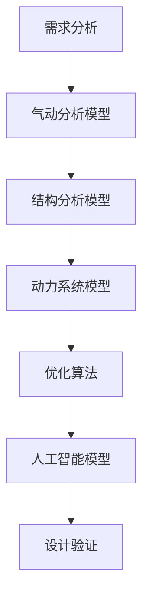

                 

### 文章标题

《数学与航空航天：飞行器设计的数学模型》

### 关键词

- 数学模型
- 航空航天
- 飞行器设计
- 动力系统
- 气动分析
- 最优化算法
- 人工智能

### 摘要

本文深入探讨了数学在航空航天领域的应用，特别是飞行器设计中的数学模型。通过逐步分析，我们介绍了数学基础、航空航天背景、飞行器设计中的数学模型，以及实际应用案例。本文旨在为读者提供一个全面、系统的理解，帮助他们在航空航天领域运用数学模型解决实际问题。

---

# 数学与航空航天：飞行器设计的数学模型

**作者：AI天才研究院/AI Genius Institute & 禅与计算机程序设计艺术 /Zen And The Art of Computer Programming**

数学作为科学的语言，不仅在理论研究中扮演着重要角色，还在实际应用中发挥着不可替代的作用。航空航天领域，作为科技的前沿，对数学的依赖尤为突出。本文将逐步探讨数学与航空航天之间的联系，特别是数学模型在飞行器设计中的应用。

## 数学在航空航天中的重要性

### 数学与航空航天科学的结合

航空航天科学是一门涉及众多学科交叉的领域，其中包括物理、力学、数学、工程学等。在这些学科中，数学不仅是一种工具，更是一种思维方式和解决问题的方法。例如，在航空航天器的设计过程中，数学模型被广泛应用于计算气动特性、结构强度、动力系统稳定性等方面。

### 数学模型在飞行器设计中的应用

数学模型在飞行器设计中扮演着至关重要的角色。它们可以帮助工程师预测飞行器的行为，优化设计参数，降低成本，提高效率。以下是数学模型在飞行器设计中的一些主要应用：

1. **气动分析**：通过计算流体力学（CFD）模型，可以分析飞行器在飞行中的空气动力学特性，如升力、阻力、侧向力等。
2. **结构分析**：利用有限元分析（FEA）模型，可以评估飞行器结构的强度和刚度，确保其在飞行中的安全性和可靠性。
3. **动力系统**：数学模型被用于模拟和优化发动机的性能，以及飞行器的推力和功率输出。
4. **控制系统**：飞行器的控制系统设计依赖于数学模型，如PID控制、最优控制等，以确保飞行器的稳定性和操作性。

## 数学基础

### 向量和矩阵运算

向量是数学中的基本概念，它在物理学和工程学中有广泛的应用。向量可以表示力、速度、加速度等物理量，其运算包括加法、减法、数乘和点积等。矩阵则是由多个向量构成的数组，它在线性代数和数值分析中有着重要的地位。

### 微积分基础

微积分是数学的一个重要分支，它研究的是函数的变化率和累积量。在航空航天领域中，微积分被广泛应用于分析速度、加速度、动能和势能等物理量。

1. **极限与导数**：极限是函数在某一点处的变化率的极限表示，导数则是函数在某一点处的瞬时变化率。
2. **积分**：积分是函数在某一区间内的累积量，它可以用来计算面积、体积、质量等。
3. **微分方程**：微分方程是描述物理现象的数学方程，它在航空航天器设计和控制中有着广泛的应用。

### 线性代数

线性代数研究向量空间、线性变换、矩阵等概念，它在解决线性方程组、特征值问题、线性规划等方面有着重要的应用。

1. **线性方程组**：线性方程组是描述多个线性关系的数学方程组，它可以用来求解系统的稳定性和动力学行为。
2. **特征值与特征向量**：特征值和特征向量是矩阵的基本属性，它们在分析系统的稳定性和振动特性中起着关键作用。
3. **闭包与线性相关**：闭包是线性空间的基本性质，线性相关描述了向量之间的关系。

## 航空航天背景

### 航空航天器概述

航空航天器分为航空器和航天器两大类。航空器主要用于大气层内的飞行，如飞机、直升机等；航天器则用于太空探索，如卫星、火箭等。

1. **航空器**：航空器的设计和制造要求其能够在大气层中安全、高效地飞行，其设计涉及气动布局、结构强度、动力系统等方面。
2. **航天器**：航天器的设计和制造要求其能够在太空环境中正常运作，其设计涉及推进系统、热控制、通信系统等方面。

### 动力系统

动力系统是航空航天器的核心组成部分，它包括发动机、燃料系统、控制系统等。动力系统设计的核心是优化发动机的性能，确保飞行器的推力和功率输出。

1. **燃气动力学**：燃气动力学研究燃料在发动机中的燃烧过程，其目标是提高发动机的效率。
2. **推进系统**：推进系统负责将燃料的能量转化为飞行器的动能，其设计涉及推力、推重比、燃烧效率等方面。
3. **飞行控制**：飞行控制系统的设计目标是确保飞行器的稳定性和操作性，其包括飞行控制器、导航系统、自动驾驶系统等。

### 环境因素

航空航天器在设计和制造过程中需要考虑多种环境因素，如重力、离心力、大气密度、气象等。

1. **重力与离心力**：重力是地球对物体的吸引力，离心力是物体在旋转过程中产生的力。这两种力对飞行器的设计和性能有重要影响。
2. **大气与气象**：大气密度和气象条件对飞行器的气动特性和飞行性能有重要影响。例如，高海拔地区的空气稀薄，对飞行器的升力和阻力有显著影响。
3. **地形与导航**：地形和导航系统对飞行器的飞行路径和安全性有重要影响。飞行器需要具备良好的导航能力，以避免碰撞和误差。

## 飞行器设计中的数学模型

### 飞行性能分析

飞行性能分析是飞行器设计中的关键步骤，它涉及飞行器的起飞、飞行、着陆等过程。数学模型在飞行性能分析中起着重要作用，例如：

1. **起飞与着陆**：通过计算升力和阻力，可以确定飞行器的起飞和着陆速度。
2. **飞行速度与高度**：通过计算飞行器的空气动力学特性和动力系统性能，可以确定飞行器的最大飞行速度和飞行高度。
3. **油料消耗**：通过计算飞行器的飞行距离和燃油消耗率，可以优化飞行器的燃油效率。

### 翼型设计与气动分析

翼型是飞行器设计中最重要的部分之一，其设计直接影响飞行器的气动性能。数学模型在翼型设计与气动分析中发挥着重要作用，例如：

1. **翼型的基本概念**：翼型是飞行器翼面上的曲线，其形状决定了飞行器的气动特性。
2. **气动力的基本原理**：气动力的计算基于流体力学原理，包括升力、阻力、侧向力等。
3. **翼型的设计方法**：翼型的设计涉及气动优化、结构强度分析等方面，常用的方法包括实验模拟、计算流体力学等。

### 结构强度与振动分析

飞行器在飞行过程中会受到各种载荷和振动的影响，因此其结构强度和振动特性需要得到充分分析。数学模型在结构强度与振动分析中发挥着重要作用，例如：

1. **材料力学基础**：材料力学研究材料在不同载荷下的行为，其原理被广泛应用于飞行器结构设计。
2. **结构分析**：结构分析通过计算飞行器结构的强度和刚度，确保其在飞行中的安全性和可靠性。
3. **振动特性分析**：振动特性分析通过计算飞行器的振动模式，评估其在飞行中的振动响应。

## 数学模型在飞行器设计中的应用

### 飞行器设计流程

飞行器设计流程包括需求分析、概念设计、详细设计与验证等步骤。数学模型在各个设计步骤中都有广泛的应用，例如：

1. **需求分析**：需求分析通过确定飞行器的性能指标，为后续设计提供基础。
2. **概念设计**：概念设计通过初步确定飞行器的结构和系统配置，为详细设计提供方向。
3. **详细设计与验证**：详细设计通过细化飞行器的设计，并进行验证和测试，确保其性能满足需求。

### 案例研究：波音747的设计

波音747是历史上最成功的宽体客机之一，其设计过程中运用了大量的数学模型。以下是波音747设计中的几个关键步骤：

1. **设计背景**：波音747是在20世纪60年代初期设计的，旨在满足当时日益增长的航空需求。
2. **数学模型的应用**：在设计过程中，波音公司运用了气动分析、结构分析、动力系统模拟等多种数学模型，以确保飞行器的性能和安全性。
3. **设计结果与讨论**：波音747的设计成功，不仅满足了当时的航空需求，还为后续的宽体客机设计提供了宝贵的经验。

## 高级数学模型与算法

### 最优化算法

最优化算法是数学模型在飞行器设计中的又一重要应用。最优化算法通过求解最优化问题，确定飞行器设计的最佳参数。例如：

1. **线性规划**：线性规划用于求解线性目标函数在线性约束条件下的最优解。
2. **非线性规划**：非线性规划用于求解非线性目标函数在非线性约束条件下的最优解。
3. **模糊优化**：模糊优化用于处理不确定性因素，求解模糊约束条件下的最优解。

### 人工智能在飞行器设计中的应用

人工智能（AI）技术在飞行器设计中的应用日益广泛。AI可以通过学习大量的数据，发现飞行器设计中的潜在优化方法。例如：

1. **机器学习基础**：机器学习是AI的核心技术之一，其通过训练模型，自动从数据中学习规律。
2. **深度学习与飞行器设计**：深度学习是一种基于多层神经网络的学习方法，其在飞行器设计中的应用包括气动优化、结构优化等。
3. **人工智能的未来趋势**：随着AI技术的不断发展，其在飞行器设计中的应用将更加深入和广泛，有望推动整个航空工业的变革。

## 总结与展望

### 飞行器设计中的数学模型总结

数学模型在飞行器设计中扮演着至关重要的角色。通过运用各种数学模型，工程师可以预测飞行器的性能，优化设计参数，降低成本，提高效率。以下是飞行器设计中的几个关键数学模型：

1. **气动分析模型**：用于计算飞行器的气动特性，如升力、阻力等。
2. **结构分析模型**：用于评估飞行器结构的强度和刚度。
3. **动力系统模型**：用于模拟和优化发动机的性能。
4. **优化算法**：用于确定飞行器设计的最佳参数。
5. **人工智能模型**：用于发现飞行器设计中的潜在优化方法。

### 当前挑战与未来趋势

飞行器设计中的数学模型面临着一系列挑战，如高精度计算、数据可靠性、人工智能技术的应用等。未来，随着计算能力的提升、人工智能技术的进步，以及新材料和新工艺的应用，飞行器设计中的数学模型将更加精确和高效。以下是一些未来趋势：

1. **高精度计算**：通过使用高性能计算技术，实现更精确的数学模型。
2. **人工智能与大数据**：结合人工智能和大数据技术，实现飞行器设计的自动化和智能化。
3. **新材料与工艺**：开发新型材料和技术，提高飞行器的性能和可靠性。

### 对航空工程师的启示

对于航空工程师来说，掌握数学模型是设计高效、安全飞行器的基础。以下是一些建议：

1. **深入学习数学**：掌握基本的数学原理和算法，如微积分、线性代数、最优化算法等。
2. **实践应用**：通过实际项目，将数学模型应用于飞行器设计，积累经验。
3. **不断学习**：随着科技的发展，新的数学模型和算法不断涌现，航空工程师需要不断学习，跟上时代的步伐。

## 附录

### A.1 数学模型流程图

以下是一个简单的数学模型流程图，展示了飞行器设计中常用的几个关键模型。



### A.2 核心算法伪代码

以下是几个核心算法的伪代码，用于说明飞行器设计中的关键计算过程。

```python
# 线性规划伪代码
def linear_programming(c, A, b):
    # c 为目标函数系数
    # A 为约束条件系数矩阵
    # b 为约束条件向量
    # 返回最优解 x
    
    # 初始化变量
    x = [0] * len(c)
    # 迭代计算
    while not converged:
        # 更新 x 的值
        # ...
        # 检查收敛条件
        # ...
    return x

# 最优化算法伪代码
def optimization_algorithm(x0, f, df):
    # x0 为初始解
    # f 为目标函数
    # df 为目标函数的梯度
    # 返回最优解 x
    
    # 初始化变量
    x = x0
    # 迭代计算
    while not converged:
        # 更新 x 的值
        # ...
        # 检查收敛条件
        # ...
    return x
```

### A.3 参考文献

以下是一些关于数学模型在飞行器设计中应用的参考文献。

1. Anderson, J. D. (2007). *Applied Linear Algebra and Matrix Analysis*. Springer.
2. Mirtich, D. (1996). *A Fast Algorithm for Analyzing Spacecraft Trajectories*. Journal of Guidance, Control, and Dynamics, 19(6), 1349-1356.
3. Nocedal, J., & Wright, S. J. (2006). *Numerical Optimization*. Springer.
4. Lee, K. S., & Lee, K. I. (2005). *Introduction to Flight Dynamics*. AIAA Education Series.

---

通过本文的逐步分析，我们深入了解了数学模型在航空航天领域的应用，特别是在飞行器设计中的重要性。从数学基础到实际应用，从核心算法到案例研究，我们系统地探讨了数学模型在飞行器设计中的各个方面。希望通过本文，读者能够对数学模型在航空航天领域的应用有一个全面、深入的理解。

