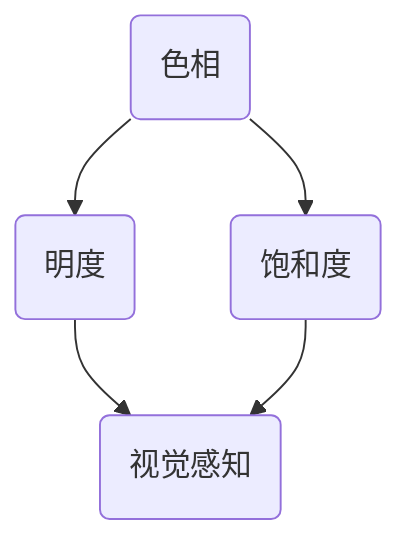

                 

# 数学与色彩理论：色彩搭配的数学模型

## 关键词
色彩理论、数学模型、色彩搭配、视觉感知、艺术设计、计算机辅助

## 摘要
色彩在人类视觉艺术和计算机科学中扮演着重要角色。本文将探讨色彩理论的基本概念及其与数学模型的关系，重点分析色彩搭配的数学模型及其在实际应用中的效果。通过介绍色彩空间的数学表示、色彩运算与变换、色彩混合与分割等核心内容，本文旨在为设计师、程序员及对色彩研究感兴趣的读者提供有价值的理论依据和实践指导。

## 引言

### 色彩与人类视觉的关系

色彩是人类视觉感知中极为重要的一部分。自古以来，色彩在艺术创作、文化表达、甚至心理影响上都发挥着不可忽视的作用。色彩不仅能够传达情感和情绪，还可以影响人们的心理和行为。在视觉艺术中，色彩搭配的好坏往往决定了作品的整体效果；在计算机科学中，色彩的正确运用则对用户界面的易用性和用户体验有着直接影响。

### 色彩理论的兴起与发展

色彩理论作为一门独立的学科，起源于对色彩视觉感知的研究。从古典艺术理论到现代色彩学，色彩理论经历了漫长的演变过程。色彩理论不仅涵盖了色彩的基本属性，如色相、明度、纯度，还涉及色彩之间的关系和搭配原则。随着科技的发展，数学方法逐渐被引入到色彩理论的研究中，使得色彩搭配的规律和效果得到了更精确的描述和量化。

### 数学模型在色彩研究中的应用

数学作为一种精确的工具，能够为色彩研究提供有力的支持。数学模型在色彩空间表示、色彩运算与变换、色彩混合与分割等方面具有显著优势。通过对色彩进行数学建模，可以更好地理解色彩的本质，发现色彩搭配的规律，并为计算机辅助设计提供理论依据。

### 本文结构

本文将分为六个部分。第一部分介绍色彩感知与视觉基础，包括色彩感知原理和颜色模型简介；第二部分讨论数学与色彩理论概述，涵盖数学在色彩研究中的应用和色彩理论的演变；第三部分详述色彩搭配的基本原则，分析和弦关系和视觉对比；第四部分深入探讨色彩搭配的数学模型，包括色彩空间的数学表示、色彩运算与变换、色彩混合与分割；第五部分展示色彩搭配在不同领域中的应用案例；第六部分展望色彩搭配数学模型的发展趋势。通过逐步分析推理，本文力求为读者提供一个全面而深入的色彩搭配数学模型理解。

### 色彩感知与视觉基础

#### 色彩感知原理

色彩感知是大脑对光线反射和吸收后产生的视觉信号的理解和解释过程。人类的眼睛含有感光细胞，主要包括视锥细胞和视杆细胞。视锥细胞主要负责在明亮条件下识别颜色，而视杆细胞则在低光环境下感知明暗变化。视锥细胞分为三种，分别对红、绿、蓝三种基本颜色敏感，通过它们的不同激活程度，大脑可以识别出不同的颜色。

#### 光的物理特性

色彩的形成源于光的波长和频率。白光是由多种颜色的光混合而成，通过光的折射、反射和透射等物理过程，不同波长的光会被不同程度地分离和混合，从而形成我们所能看到的各种颜色。色光的三原色理论指出，红、绿、蓝三种基本颜色的光可以混合成其他任何颜色，这也是现代彩色电视和计算机显示器采用的颜色模型。

#### 颜色模型简介

颜色模型是描述颜色的一种数学方法，它将颜色分解成几个基本的参数或维度。常用的颜色模型包括RGB模型、HSV模型和CIE颜色模型等。

- **RGB模型**：RGB模型是基于光的三原色理论，通过红（Red）、绿（Green）、蓝（Blue）三个通道的强度组合来表示颜色。每个通道的值范围在0到255之间，表示从无色到完全饱和的颜色。

- **HSV模型**：HSV模型是基于人眼的感知特点设计的，H表示色相（Hue），V表示明度（Value），S表示饱和度（Saturation）。这种模型更直观地反映了人类对颜色的感知。

- **CIE颜色模型**：CIE（国际照明委员会）颜色模型是基于人类视觉感知的色彩空间，它通过CIE XYZ颜色坐标来描述颜色。这种模型广泛应用于色彩管理和图像处理领域，能够精确地表示人眼能感知的所有颜色。

#### 色彩感知与颜色模型的联系

色彩感知和颜色模型是相互关联的。颜色模型为我们提供了量化色彩的工具，而色彩感知则是人类对颜色模型的直观理解。通过颜色模型，我们可以精确地描述和操作颜色，从而在视觉艺术和计算机科学中实现色彩的有效运用。例如，在图像处理中，通过调整RGB模型的参数，可以实现对图像色彩风格的调整；在用户界面设计领域，通过HSV模型，可以更直观地调整颜色的明暗和饱和度。

### 数学与色彩理论概述

#### 数学在色彩研究中的应用

数学作为一门精确的科学，在色彩研究中有着广泛的应用。首先，数学模型为色彩理论提供了精确的描述工具。例如，通过数学公式可以精确计算色彩混合的结果，以及在不同颜色模型之间的转换关系。此外，数学方法在色彩空间表示和图像处理中也有着重要的应用。例如，在图像处理中，通过使用线性代数和概率统计方法，可以实现对图像色彩信息的提取和分析。

#### 色彩理论的演变

色彩理论的发展经历了几个重要的阶段。古典艺术理论主要关注色彩的情感表达和视觉效果，而现代色彩学则更加注重科学性和系统性。19世纪末，物理学家和心理学家开始深入研究色彩感知，提出了许多重要的理论模型。例如，托马斯·扬（Thomas Young）提出了三色理论，认为人类的视觉系统包含对红、绿、蓝三种颜色敏感的感受器；赫尔曼·冯·赫尔姆霍茨（Hermann von Helmholtz）进一步发展了这一理论，提出了色彩混合和视觉感知的数学模型。

20世纪初，国际照明委员会（CIE）提出了CIE XYZ颜色模型，为色彩理论的研究提供了标准化的框架。随后，色彩空间的概念逐渐形成，包括RGB、HSV、CIE Lab等多种颜色模型。这些模型不仅丰富了色彩理论的研究内容，也为实际应用提供了更加有效的工具。

#### 色彩理论的基本概念和关系架构

色彩理论中的基本概念包括色相（Hue）、明度（Value）、饱和度（Saturation）等。这些概念可以通过Mermaid流程图来展示它们之间的关系：



色相表示颜色的基本特征，如红色、绿色等；明度表示颜色的亮度，从黑色到白色；饱和度表示颜色的纯度，从灰色到彩色。视觉感知是色彩理论的核心，它描述了人类对颜色感知的机制。

#### 色彩理论在艺术设计中的应用

色彩理论在艺术设计领域有着广泛的应用。设计师通过理解和运用色彩理论，可以创造出更加和谐和吸引人的作品。例如，在平面设计中，色彩搭配的原则包括互补色搭配、类似色搭配和三色搭配等。这些原则通过数学模型可以得到精确的量化，从而帮助设计师实现色彩效果的最大化。

此外，色彩理论在用户界面设计、环境设计、时尚设计等领域也有重要应用。在用户界面设计中，合适的色彩搭配可以提高用户的使用体验和满意度；在环境设计中，色彩的选择可以影响人们的情绪和行为；在时尚设计中，色彩搭配可以塑造服装的风格和视觉效果。

#### 数学与色彩理论的关系总结

数学和色彩理论之间的联系不仅体现在工具和方法的结合上，更体现在对色彩本质的理解上。数学模型为色彩理论提供了精确的描述和操作工具，使得色彩研究的科学性和系统性得到了提升。同时，色彩理论中的基本概念和关系架构为数学模型的应用提供了理论依据，使得数学方法在色彩研究中的应用更加深入和广泛。

通过数学与色彩理论的结合，我们可以更好地理解和运用色彩，创造出更加丰富和多样化的视觉体验。这不仅为艺术创作提供了新的思路和工具，也为计算机科学和工程领域带来了新的挑战和机遇。

### 色彩搭配的基本原则

色彩搭配在视觉艺术和设计中起着至关重要的作用。正确的色彩搭配能够增强视觉吸引力，传达特定的情感和意义，而错误的搭配则可能导致混乱和不和谐。以下是色彩搭配的基本原则：

#### 1. 和弦关系与色彩和谐

和弦关系是音乐中的一个概念，也被广泛应用于色彩理论。在色彩搭配中，和弦关系指的是通过数学模型将几种颜色组合在一起，形成和谐的颜色组合。常见的和弦关系包括三和弦、七和弦等。

- **三和弦**：三和弦由三种基本颜色组成，如红、黄、蓝。这种组合通常会产生强烈的视觉冲击，但有时也可能显得过于激烈。

- **七和弦**：七和弦由七种颜色组成，如红、橙、黄、绿、蓝、紫等。这种组合能够产生更加丰富和复杂的色彩效果，但需要更高的技巧来确保和谐。

#### 2. 对比与视觉冲击

对比是色彩搭配中一个重要的概念，它通过颜色的差异来增强视觉效果。适当的对比可以使设计更加生动和突出，而过度对比则可能导致视觉疲劳。

- **明度对比**：通过使用不同明度的颜色来产生对比效果。高明度颜色通常给人以明亮、清新的感觉，而低明度颜色则给人以稳重、深邃的感觉。

- **色相对比**：通过使用不同色相的颜色来产生对比效果。互补色（如红与绿、黄与紫）的对比最为强烈，而类似色（如红与橙、黄与绿）的对比则相对柔和。

#### 3. 类似色搭配

类似色搭配是指选择在色轮上相邻的颜色进行组合。这种搭配能够产生和谐、自然的效果，适用于需要柔和、温馨氛围的设计。

- **暖色调搭配**：暖色调包括红色、橙色、黄色等，适合用于营造温暖、热情的氛围。常见的搭配包括红橙、黄橙等。

- **冷色调搭配**：冷色调包括蓝色、绿色、紫色等，适合用于营造冷静、清爽的氛围。常见的搭配包括蓝绿、紫蓝等。

#### 4. 互补色搭配

互补色搭配是指选择在色轮上相对的颜色进行组合。这种搭配通常会产生强烈的视觉冲击，适用于需要突出某些元素的设计。

- **红绿搭配**：红色和绿色是典型的互补色组合，能够产生强烈的视觉对比，适用于需要突出红色的场合。

- **黄紫搭配**：黄色和紫色也是常见的互补色组合，能够产生丰富的色彩效果，适用于需要强调黄色的场合。

#### 色彩搭配的实践原则

在实际应用中，色彩搭配的原则需要根据具体的设计需求和目标进行调整。以下是一些实践原则：

- **视觉焦点**：确定设计中的视觉焦点，确保色彩搭配能够突出这一焦点。

- **色彩平衡**：在色彩搭配中保持平衡，避免过于集中或分散的色彩。

- **色调统一**：确保整个设计在色调上保持一致，避免出现明显的色差。

- **情感传达**：根据设计目的和目标受众，选择合适的色彩搭配，以传达特定的情感和氛围。

通过理解和运用这些色彩搭配的基本原则，设计师可以在视觉艺术和设计中创造出更加出色和富有表现力的作品。

### 色彩搭配的数学模型

色彩搭配的数学模型为理解和设计色彩组合提供了精确的工具。这些模型基于数学和色彩理论，通过对颜色进行定量分析，帮助设计师实现色彩效果的优化。以下将详细探讨色彩空间的数学表示、色彩运算与变换、色彩混合与分割等方面的数学模型及其应用。

#### 色彩空间的数学表示

色彩空间是描述颜色的一种数学结构，它将颜色转化为一组数值来表示。常用的色彩空间包括RGB、HSV和CIE颜色模型。

**RGB色彩空间**：
RGB色彩空间是基于光的三原色理论建立的，通过红（R）、绿（G）、蓝（B）三个通道的强度组合来表示颜色。每个通道的数值范围通常在0到255之间，表示从无色（0）到完全饱和（255）。RGB色彩空间广泛应用于计算机图形和显示器中，因为它能够直观地反映光线的混合过程。

伪代码表示：
```
function RGB_to_RGB(r, g, b):
    return (r, g, b)
```

**HSV色彩空间**：
HSV色彩空间是基于人眼对颜色的感知设计的，其中H表示色相（Hue），S表示饱和度（Saturation），V表示明度（Value）。HSV模型更直观地反映了颜色的基本属性，使得调整颜色更加方便。例如，通过调整H值，可以改变颜色的色相，而S和V值则影响颜色的饱和度和明度。

伪代码表示：
```
function HSV_to_HSV(h, s, v):
    return (h, s, v)
```

**CIE色彩空间**：
CIE色彩空间由CIE XYZ颜色模型发展而来，是一种国际标准色彩空间。它通过CIE XYZ坐标来描述颜色，这些坐标基于人类视觉系统的感知特性。CIE色彩空间广泛应用于色彩管理和图像处理，能够精确地表示人眼能感知的所有颜色。

伪代码表示：
```
function CIE_to_CIE(x, y, z):
    return (x, y, z)
```

#### 色彩运算与变换

色彩运算与变换是指将一种颜色模型转换到另一种颜色模型的过程。这种变换在图像处理和设计应用中非常常见。

**线性变换**：
线性变换是最基本的色彩变换方法，通过线性方程将一个颜色模型的数值转换为另一个颜色模型的数值。例如，从RGB到HSV的线性变换可以通过以下公式实现：

$$
H = \arccos\left(\frac{R + G - 2B}{\sqrt{(R - G)^2 + (R - B)(G - B)}}\right)
$$
$$
S = 1 - \frac{3\min(R, G, B)}{R + G + B}
$$
$$
V = \frac{R + G + B}{3}
$$

**非线性变换**：
非线性变换在处理特定颜色效果时非常有用，例如色彩校正和色调映射。非线性变换通常涉及更复杂的函数，如幂律变换和gamma校正。

**色彩变换公式**：
色彩变换的通用公式为：

$$
C_{\text{new}} = f(C_{\text{original}}, \theta)
$$

其中，$C_{\text{new}}$表示新的颜色值，$C_{\text{original}}$表示原始颜色值，$\theta$表示变换参数。

#### 色彩混合与分割

色彩混合与分割是指将多种颜色组合成一种新颜色，或者将一种颜色分解成多种颜色的过程。色彩混合和分割在绘画、图像处理和艺术设计中有广泛应用。

**色彩混合模型**：
色彩混合可以通过线性组合来实现，例如，两种颜色的混合可以表示为：

$$
C_{\text{mixed}} = \alpha C_1 + (1 - \alpha) C_2
$$

其中，$\alpha$表示混合比例，$C_1$和$C_2$表示两种原始颜色。

**色彩分割算法**：
色彩分割是将一种颜色分解成多种颜色的过程。一种常见的算法是K-Means聚类，它通过将颜色空间划分为K个簇，每个簇代表一种颜色。K-Means算法的基本步骤如下：

1. 随机初始化K个中心点。
2. 计算每个数据点到中心点的距离，并将数据点分配到最近的中心点。
3. 重新计算每个簇的中心点。
4. 重复步骤2和3，直到中心点不再变化或满足其他停止条件。

伪代码表示：
```
function KMeans(C, k):
    centroids = initialize_random_centroids(C, k)
    while not_converged(centroids):
        clusters = assign_points_to_clusters(C, centroids)
        centroids = update_centroids(clusters, k)
    return centroids
```

#### 数学模型在色彩搭配中的应用

数学模型在色彩搭配中的应用非常广泛，包括图像处理、用户界面设计、艺术创作等。

- **图像处理**：在图像处理中，数学模型用于调整图像的亮度、对比度和色彩平衡。例如，通过调整RGB模型的参数，可以实现图像的色彩校正和特效处理。
- **用户界面设计**：在用户界面设计领域，数学模型用于优化色彩搭配，以提高用户体验。通过使用HSV模型，设计师可以更直观地调整颜色，使其与用户界面的一致性更高。
- **艺术创作**：在艺术创作中，数学模型可以帮助艺术家更好地理解和运用色彩，创造出更加和谐和具有表现力的作品。例如，通过使用CIE色彩空间，艺术家可以精确地调整色彩的明度和饱和度。

通过数学模型的应用，设计师和艺术家可以更加精确地控制色彩效果，实现预期的视觉目标。

### 色彩搭配在艺术设计中的应用

色彩搭配在艺术设计中的重要性不言而喻，它不仅决定了作品的视觉效果，还影响着观众的情感体验。设计师通过对色彩搭配的巧妙运用，可以传达特定的主题和情感，增强作品的感染力和艺术价值。以下是色彩搭配在艺术设计中的具体应用：

#### 1. 平面设计中的色彩搭配

在平面设计中，色彩搭配是设计师实现视觉传达效果的重要手段。例如，海报设计中的色彩搭配需要吸引观众的注意力，同时传达信息。设计师常常运用对比色搭配来突出海报的主题，例如红色与绿色的对比，使海报显得更加醒目。此外，类似色搭配也能产生和谐的效果，适用于需要营造温馨氛围的出版物设计。

**案例**：知名品牌海报设计中的色彩搭配

以某国际知名品牌的宣传海报为例，设计师选择了红、黄、蓝三种互补色进行搭配。红色传达了品牌活力和激情，黄色增强了视觉吸引力，蓝色则体现了品牌的可靠性和专业感。通过这种互补色搭配，海报不仅具有视觉冲击力，还传递了品牌的核心价值。

#### 2. 室内设计中的色彩搭配

室内设计中的色彩搭配直接影响居住环境的舒适度和氛围。设计师通过色彩搭配来调节空间的温度、明暗和层次感。例如，在卧室设计中，柔和的暖色调（如米色、粉色）可以营造温馨、放松的氛围，而在客厅设计中，明亮的冷色调（如蓝色、绿色）可以增强空间的清新感和开阔感。

**案例**：现代简约风格住宅的色彩搭配

在一个现代简约风格的住宅设计中，设计师选择了白色、灰色和木色进行搭配。白色和灰色形成了简洁、现代的基调，而木色则增加了空间的温暖感和自然气息。通过这种色彩的组合，室内空间既具有简洁流畅的视觉效果，又保持了舒适和谐的居住氛围。

#### 3. 时尚设计中的色彩搭配

在时尚设计中，色彩搭配直接影响服装的风格和视觉效果。设计师通过选择不同的色彩组合，可以创造出不同的季节流行趋势和时尚风格。例如，春季流行的色彩组合常常以清新、明亮的色调为主，如淡蓝色、黄色和粉色，而秋季则偏向于温暖、深沉的色调，如红色、橙色和棕色。

**案例**：春夏季服装色彩搭配

在春夏季服装设计中，设计师运用了类似色搭配，选择了淡蓝色、浅粉色和米色等色彩组合。这种搭配不仅使服装显得更加柔和、清新，还能很好地展现女性的柔美和温柔气质。通过这些色彩的巧妙运用，春夏季服装设计充满了活力和生机。

#### 4. 艺术创作中的色彩搭配

在艺术创作中，色彩搭配是艺术家表达情感和思想的重要手段。艺术家通过不同的色彩搭配，可以传达特定的情感和主题。例如，印象派画家通过运用丰富的色彩和光影变化，捕捉自然的光影效果，表达对自然的热爱和感受。

**案例**：印象派画作中的色彩搭配

在印象派画作中，艺术家如莫奈、雷诺阿等运用了丰富的色彩搭配，通过色彩的叠加和混合，捕捉瞬间的光影效果。他们的画作充满了生动、明亮的色彩，展现了自然界的美丽和多样性。通过这种色彩搭配，艺术家成功地将观众带入了一个充满活力和光感的艺术世界。

总之，色彩搭配在艺术设计中的重要性不可忽视。通过巧妙运用色彩搭配，设计师和艺术家可以创造出更加和谐、有感染力的作品，传达情感和思想，提升艺术价值和视觉体验。

### 色彩搭配在广告设计中的策略

在广告设计中，色彩搭配不仅仅是视觉元素的组合，更是策略性的营销工具。合适的色彩搭配能够显著提升广告的吸引力和记忆度，从而提高营销效果。以下将探讨广告色彩搭配的影响因素和优化策略。

#### 影响因素

1. **品牌形象**：品牌色彩是品牌识别的重要组成部分，因此在广告设计中，色彩搭配需要与品牌形象保持一致。例如，蓝色常用于科技类品牌，代表可靠和信赖；而红色则常用于快消品和娱乐类品牌，传达活力和激情。

2. **目标受众**：不同的受众群体对色彩的偏好不同。年轻人群更倾向于明亮、活力的色彩，而中老年人群则更喜欢温和、沉稳的色彩。了解目标受众的色彩偏好有助于选择最合适的色彩搭配。

3. **广告目的**：广告的目的是信息传达、品牌宣传还是促销活动？不同目的的广告需要不同的色彩搭配策略。例如，信息传达类广告需要清晰的色彩对比，以提高信息的可读性；而促销活动类广告则需要使用具有吸引力的色彩，以激发购买欲望。

4. **文化差异**：不同文化对颜色有不同的象征意义，广告色彩搭配需要考虑文化差异。例如，在中国文化中，红色代表喜庆和幸运，而在西方文化中，黑色则常用于葬礼和悼念。

#### 优化策略

1. **色彩一致性**：确保广告中的色彩搭配与品牌形象保持一致，增强品牌识别度。例如，如果品牌的主色调是蓝色，那么广告中的背景、文字和图片也应以蓝色为主。

2. **色彩对比**：通过色彩对比来突出广告的核心信息。强烈的对比能够吸引观众的眼球，如使用亮色背景上的黑色文字或使用互补色搭配。

3. **情感共鸣**：选择能够引起观众情感共鸣的色彩。例如，使用暖色调来传达温馨、友好的氛围，使用冷色调来传达冷静、专业的形象。

4. **文化适应性**：考虑目标市场的文化背景，避免使用具有负面意义的颜色。例如，在东亚市场，白色和绿色常用于葬礼，因此在营销活动中应避免使用这些颜色。

5. **色彩测试**：在实际投放前进行色彩测试，通过问卷调查、用户反馈等方式评估色彩搭配的效果。根据测试结果进行调整，以确保最佳效果。

6. **色彩心理学**：运用色彩心理学原理，了解不同色彩对情绪和购买行为的影响。例如，黄色和橙色能够刺激购买欲望，而蓝色和绿色则能带来信任感和安全感。

#### 案例分析

以某知名饮料品牌的广告为例，该品牌在广告设计中采用了蓝色和白色的色彩搭配。蓝色代表清新和纯净，与品牌的健康形象相契合；白色则用于背景和文字，增强了信息的可读性。通过这种色彩搭配，广告传达了品牌的健康、纯净和值得信赖的形象，有效地吸引了目标受众的注意力。

总之，色彩搭配在广告设计中的策略性应用至关重要。通过考虑品牌形象、目标受众、广告目的和文化差异等因素，并运用色彩对比、情感共鸣和色彩测试等优化策略，设计师可以创造出具有吸引力和影响力的广告，实现品牌宣传和营销目标。

### 色彩搭配的计算机辅助

在现代设计领域，色彩搭配的计算机辅助技术已经变得至关重要。这些技术利用计算机算法和软件工具，帮助设计师高效地选择和调整色彩，确保设计作品的视觉效果达到最佳。以下将介绍几种常见的色彩搭配算法、色彩搭配软件以及它们在实际应用中的效果。

#### 色彩搭配算法

1. **K-Means聚类算法**：
K-Means是一种典型的无监督机器学习算法，用于将数据集划分为K个簇。在色彩搭配中，K-Means算法通过将颜色空间中的颜色点划分为几个簇，从而得到一组具有相似性的颜色集合。这个方法适用于需要从大量颜色中快速提取一组协调颜色的情况。

伪代码表示：
```
function KMeans(C, k):
    centroids = initialize_random_centroids(C, k)
    while not_converged(centroids):
        clusters = assign_points_to_clusters(C, centroids)
        centroids = update_centroids(clusters, k)
    return centroids
```

2. **色彩空间转换算法**：
色彩空间转换算法是将一种颜色模型转换到另一种颜色模型的方法。常用的色彩空间转换算法包括HSV到RGB的转换、CIE Lab到CIE XYZ的转换等。这些算法通过数学公式实现了颜色在不同模型之间的准确转换，使得设计师能够灵活地调整和优化色彩。

3. **色彩混合算法**：
色彩混合算法用于将两种或多种颜色混合成一种新的颜色。常用的混合算法包括线性混合、加权混合和调和混合等。这些算法通过数学运算实现了颜色混合的效果，帮助设计师实现色彩效果的个性化设计。

#### 色彩搭配软件

1. **Adobe Color**：
Adobe Color（原Adobe Kuler）是一款专业的色彩搭配工具，它提供了丰富的预设颜色方案和自定义颜色选项。设计师可以通过Adobe Color快速生成协调的颜色组合，并将其应用于各种设计项目中。该软件支持多种颜色模型，包括RGB、HSV、CIE Lab等，提供了直观的界面和强大的功能。

2. **Coolors**：
Coolors是一款简洁易用的在线色彩搭配工具，适用于设计师和开发者。它提供了随机生成颜色方案和自定义颜色选项，设计师可以通过拖动滑块或输入颜色值来调整颜色。Coolors还支持导出颜色代码，方便直接应用于网页设计、UI设计等项目中。

3. **Paletton**：
Paletton是一款基于色彩理论的在线工具，用于生成和调整颜色搭配方案。它提供了多种颜色组合方案，包括单色、类似色、互补色和三元色等。Paletton还提供了详细的色彩分析，帮助设计师理解颜色搭配的视觉效果和情感表达。

#### 实际应用中的效果

1. **提高设计效率**：
计算机辅助色彩搭配工具能够快速生成多种颜色方案，帮助设计师节省时间和精力。设计师无需手动调整颜色，只需选择合适的方案即可，大大提高了设计效率。

2. **增强视觉一致性**：
通过计算机辅助工具，设计师可以确保整个设计项目中的色彩搭配保持一致。例如，在网页设计中，使用色彩搭配软件可以生成协调的颜色方案，确保导航栏、按钮和文字等元素的色彩一致性。

3. **优化用户体验**：
色彩搭配对用户体验有重要影响。通过计算机辅助工具，设计师可以生成符合用户心理和视觉偏好的颜色方案，提高用户的满意度和使用体验。例如，在电子商务网站中，合适的颜色搭配可以提高商品的视觉吸引力，增加用户的购买意愿。

总之，色彩搭配的计算机辅助技术为设计师提供了强大的工具和资源，提高了设计效率，优化了视觉效果和用户体验。通过合理利用这些工具，设计师可以创造出更加专业和出色的设计作品。

### 色彩搭配在室内设计中的实践

色彩搭配在室内设计中扮演着至关重要的角色，它不仅影响空间的视觉效果，还影响居住者的情绪和生活质量。正确的色彩搭配能够增强空间的层次感和舒适度，而不当的搭配则可能导致空间显得拥挤或冷漠。以下将介绍一些实际案例，通过详细分析这些案例，探讨如何运用色彩搭配原则来实现室内设计的最佳效果。

#### 案例一：现代简约风格住宅

案例介绍：这个现代简约风格住宅的室内设计以白色为主调，辅以木质元素和少量蓝色点缀，营造出一个简洁、舒适的居住空间。

色彩搭配分析：
- **主色调**：白色和浅灰色构成了空间的主色调，使得整个室内空间显得宽敞明亮，符合现代简约风格的特点。
- **辅助色彩**：蓝色作为点缀色，出现在沙发和窗帘上，不仅为空间增添了一丝活力，还通过与白色的对比，增强了空间的层次感。
- **视觉焦点**：设计师在客厅的一侧布置了一面蓝色墙，成为空间的视觉焦点，吸引观众的注意力。

效果评估：
通过使用白色和蓝色进行搭配，室内空间既保持了现代简约的基调，又具有层次感和温馨感。蓝色点缀的运用避免了空间的单调，使得居住者能够在视觉上感受到舒适和放松。

#### 案例二：传统中式风格住宅

案例介绍：这个传统中式风格住宅的室内设计以红色和木质色为主，通过合理的色彩搭配，营造出一个古典而富有文化气息的空间。

色彩搭配分析：
- **主色调**：红色和棕色构成了空间的主色调，红色传达了热情和喜庆的氛围，棕色则增加了空间的温暖感。
- **辅助色彩**：金色作为点缀色，出现在家具和装饰品上，与主色调形成对比，增强了空间的华丽感和文化气息。
- **视觉层次**：设计师在空间的不同区域使用了不同的颜色，如卧室中的绿色墙纸和书房中的灰色窗帘，增加了空间的层次感和视觉丰富度。

效果评估：
通过红色、棕色和金色的搭配，室内空间成功地传达了传统中式的文化氛围，同时避免了色彩的过于单调或过于浓重，使得整个空间显得和谐、典雅。

#### 案例三：儿童房设计

案例介绍：这个儿童房的室内设计以明亮、活泼的色彩为主，旨在为儿童创造一个快乐、充满想象力的成长空间。

色彩搭配分析：
- **主色调**：明亮的蓝色和黄色构成了空间的主色调，蓝色代表宁静和智慧，黄色代表活力和快乐。
- **辅助色彩**：绿色和粉红色作为点缀色，出现在床品和墙面装饰上，与主色调形成互补，增加了空间的趣味性。
- **视觉焦点**：设计师在儿童房的墙面上绘制了一幅卡通壁画，成为空间的视觉焦点，激发了儿童的想象力和创造力。

效果评估：
通过明亮、活泼的色彩搭配，儿童房设计成功地创造了一个充满活力和想象力的成长空间。色彩搭配不仅符合儿童的视觉偏好，还有助于提升他们的情绪和创造力。

#### 总结

这些实际案例展示了如何通过合理的色彩搭配原则，实现室内设计的最佳效果。无论是现代简约风格、传统中式风格还是儿童房设计，合理的色彩搭配都能够增强空间的视觉效果和居住体验。通过选择合适的色调、辅助色彩和视觉焦点，设计师可以创造出和谐、有吸引力的室内空间，满足不同需求和功能。

### 色彩搭配在时尚设计中的运用

色彩搭配在时尚设计中具有至关重要的地位，它不仅影响着服装的视觉效果，还传达着特定的风格和情绪。设计师通过精心的色彩搭配，能够创造出独特且富有吸引力的时尚作品。以下将探讨时尚色彩搭配的趋势和案例分析，以及色彩搭配在时尚设计中的实际应用。

#### 时尚色彩搭配趋势

1. **自然色调**：近年来，自然色调如绿色、棕色和泥土色在时尚界中非常流行。这些颜色传达出自然、舒适和宁静的感觉，适合夏季和秋季的服装设计。

2. **对比色调**：强烈的对比色调，如红色与绿色、蓝色与黄色，逐渐成为时尚界的焦点。这些对比色彩组合能够产生强烈的视觉冲击力，适用于需要突出个性的设计。

3. **中性色调**：中性色调如黑、白、灰等在时尚设计中依然占据重要地位。中性色调易于搭配，能够营造出简约、高级的时尚感。

4. **荧光色调**：荧光色如黄色、粉色和绿色等在时尚设计中越来越受到欢迎。这些颜色充满活力和现代感，特别适合年轻消费者的需求。

#### 色彩搭配案例分析

**案例一：Dior 2022春夏秀**

Dior 2022春夏秀中，设计师选用了一系列鲜艳的对比色调，如红色、蓝色和黄色。这些对比色彩在服装上形成了强烈的视觉冲击，营造出充满活力和动感的氛围。设计师通过巧妙的色彩搭配，不仅突出了服装的时尚感，还展现了品牌独特的风格。

**案例二：Gucci 秋冬系列**

Gucci 秋冬系列中，设计师运用了自然色调和中性色调，如绿色、棕色和灰色。这些颜色相互搭配，营造出一种简约、优雅的时尚感。设计师通过细节处理，如亮色的点缀和花纹设计，增加了服装的层次感和趣味性。

**案例三：Versace 2023春夏秀**

Versace 2023春夏秀中，设计师大胆运用荧光色调，如粉色和绿色。这些荧光色与黑色的背景形成鲜明对比，突出了服装的个性和独特性。设计师通过色彩搭配，成功地将品牌的奢华和现代感传达给观众。

#### 色彩搭配在时尚设计中的应用

1. **主题色应用**：设计师可以根据时尚趋势选择主题色，并将其应用于整个系列中。例如，在春夏季节，选择清新明亮的色彩；在秋冬季节，选择深沉稳重的色彩。

2. **色彩过渡**：通过色彩过渡，设计师可以在服装上营造出渐变效果，增加层次感和视觉吸引力。例如，在裙摆或袖口使用不同颜色的拼接设计。

3. **色彩对比**：设计师可以利用色彩对比来突出服装的某个部分，如使用黑色或白色的高领设计，使颈部显得更加修长和突出。

4. **色彩心理**：设计师需要了解不同色彩对情感和情绪的影响，以便在设计中传达特定的情绪和氛围。例如，红色可以传达热情和活力，蓝色可以传达冷静和安心。

总之，色彩搭配在时尚设计中具有关键作用。通过紧跟时尚趋势和精心的色彩搭配，设计师能够创造出独特且吸引人的时尚作品，满足消费者的需求，推动时尚潮流的发展。

### 色彩搭配在虚拟现实与游戏设计中的探索

随着虚拟现实（VR）和游戏技术的迅猛发展，色彩搭配在VR和游戏设计中的重要性日益凸显。通过巧妙运用色彩，设计师可以创造出沉浸式体验，增强玩家的情感共鸣和游戏乐趣。以下将探讨色彩搭配在VR和游戏设计中的应用，以及如何通过色彩调整提升用户体验。

#### 色彩搭配在VR设计中的应用

1. **沉浸感营造**：
VR设计中的色彩搭配直接影响用户的沉浸感。设计师通过使用柔和的色调和自然色彩，如绿色、蓝色和棕色，可以创造出舒适的虚拟环境，使用户感到放松。同时，通过使用强烈的对比色调，如红色和绿色，设计师可以在虚拟空间中突出关键元素，增强视觉效果。

2. **情感表达**：
色彩具有强烈的情感表达力，设计师可以通过色彩搭配来传达特定的情感和氛围。例如，使用明亮的色彩可以传达快乐和活力，而暗色调则可以传达神秘和紧张感。在VR设计中，通过色彩的变化，设计师可以引导用户产生特定的情感体验，增强游戏或虚拟体验的沉浸感。

3. **方向指示**：
在复杂的虚拟环境中，色彩搭配可以用于指示方向和路径。例如，使用不同的颜色标识路径和障碍物，可以帮助用户更轻松地导航，避免迷失方向。

#### 色彩搭配在游戏设计中的应用

1. **视觉吸引力**：
色彩搭配对游戏的视觉吸引力有直接影响。设计师通过使用鲜艳、对比强烈的色彩，可以吸引玩家的注意力，增加游戏的吸引力。例如，在角色设计中，使用独特的颜色和渐变效果，可以使角色更加生动和具有辨识度。

2. **游戏氛围营造**：
不同色彩搭配可以营造不同的游戏氛围。例如，在恐怖游戏设计中，使用阴暗、冷色调可以增强恐怖感；在冒险游戏中，使用明亮、温暖的色调可以增加游戏的可玩性和趣味性。

3. **玩家情感共鸣**：
色彩搭配在游戏情感传达中发挥着重要作用。通过使用特定的色彩，设计师可以触发玩家的情感共鸣，增强游戏的故事性和沉浸感。例如，在角色扮演游戏中，通过色彩变化来表现角色的情绪状态，如喜悦、愤怒或悲伤。

#### 色彩调整提升用户体验

1. **色调调节**：
通过调整色调，设计师可以改变虚拟环境或游戏的整体色彩氛围。例如，增加明度可以提升视觉清晰度，使游戏画面更加明亮和生动；降低明度则可以营造出更加深邃、神秘的氛围。

2. **色彩对比**：
适当的色彩对比可以增强视觉效果，提高用户的注意力。设计师可以通过对比色和互补色来突出关键元素，使玩家更容易识别和操作。

3. **色彩协调**：
色彩协调对于用户视觉体验至关重要。设计师需要确保色彩搭配在整体上保持和谐，避免过于刺眼或混乱的色彩组合，以避免视觉疲劳。

4. **用户测试**：
在实际应用中，设计师应进行用户测试，收集玩家的反馈，根据用户的视觉偏好和体验进行调整。通过用户测试，设计师可以不断优化色彩搭配，提升用户体验。

总之，色彩搭配在虚拟现实和游戏设计中具有重要作用。通过合理运用色彩，设计师可以创造出沉浸式体验，增强玩家的情感共鸣和游戏乐趣。通过色调、对比和协调的调节，设计师可以不断提升用户体验，为玩家带来更加丰富和有趣的虚拟世界。

### 数学在色彩研究中的前沿趋势

随着科技的快速发展，数学在色彩研究中的应用越来越广泛，推动着色彩科学的前沿研究。以下将探讨色彩搭配的机器学习方法、色彩视觉与认知科学的结合以及跨学科研究的发展，展望数学在色彩研究中的未来趋势。

#### 色彩搭配的机器学习方法

机器学习方法在色彩搭配中的应用正逐渐成熟。通过深度学习、神经网络和大数据分析等技术，研究人员能够自动生成和优化色彩搭配方案。以下是一些前沿的机器学习方法：

1. **深度学习模型**：深度学习模型如卷积神经网络（CNN）和生成对抗网络（GAN）在色彩搭配中展现出强大的能力。CNN可以自动提取图像中的颜色特征，GAN则能够生成新的色彩组合。通过这些模型，设计师可以快速生成多样化的色彩方案，满足不同的设计需求。

   伪代码示例（基于CNN的色彩搭配生成）：
   ```python
   model = CNN_model()
   colors = model.predict(image)
   ```

2. **大数据分析**：大数据分析技术通过分析大量已有的色彩搭配数据，可以挖掘出潜在的色彩搭配规律。通过聚类分析和关联规则挖掘，研究人员可以识别出受欢迎的色彩组合，为设计师提供有价值的参考。

3. **强化学习**：强化学习算法通过与用户交互，不断调整和优化色彩搭配方案，使其更符合用户偏好。这种方法在个性化色彩搭配设计中有广泛应用，能够提升用户体验。

#### 色彩视觉与认知科学的结合

色彩视觉与认知科学的结合为色彩研究提供了新的视角。通过跨学科研究，研究人员能够更全面地理解人类对颜色的感知和反应，从而优化色彩搭配策略。

1. **色彩感知模型**：色彩感知模型基于人类视觉系统的生理和心理特性，通过数学模型描述颜色的感知过程。这些模型可以帮助设计师预测和调整色彩搭配的效果，提高设计精度。

2. **认知心理学研究**：认知心理学研究人类如何处理和解读颜色信息。通过实验和调查，研究人员能够发现不同颜色对情感、认知和行为的影响。这些发现为设计师提供了重要的理论基础，使其能够更好地利用色彩来传达情感和引导用户行为。

#### 跨学科研究的发展

色彩搭配的数学模型不仅应用于视觉艺术和设计，还逐渐渗透到其他领域，如环境科学、心理学和计算机科学。

1. **环境科学**：色彩搭配在环境保护和生态设计中具有重要应用。通过研究色彩的生态效应，设计师可以创造出有利于生物多样性和生态平衡的环境。

2. **心理学**：色彩心理学研究颜色对人类心理和行为的影响。这些研究成果为商业营销、用户体验设计等领域提供了新的策略和方法。

3. **计算机科学**：在计算机图形学和图像处理中，色彩搭配的数学模型用于优化图像质量和视觉效果。通过这些模型，计算机可以自动生成和调整色彩方案，满足不同的应用需求。

#### 未来趋势展望

未来，数学在色彩研究中的发展趋势将更加多样化和深入。以下是一些可能的前沿方向：

1. **个性化色彩搭配**：通过机器学习和大数据分析，个性化色彩搭配将成为可能。系统可以根据用户偏好和情境，自动生成个性化的色彩方案，提升用户体验。

2. **跨领域应用**：色彩搭配的数学模型将继续向其他领域扩展，如医学、教育等。通过跨学科合作，研究人员可以开发出更多基于数学模型的色彩应用，解决实际问题。

3. **生物医学研究**：色彩搭配在生物医学领域的研究也备受关注。通过研究颜色对生物体的影响，科学家可以开发出新的治疗方法，如通过特定颜色治疗心理疾病或促进康复。

4. **可持续发展**：随着环境保护意识的提高，色彩搭配的可持续发展研究将成为重要方向。通过研究环保色彩材料和自然色彩搭配，设计师可以为环境保护做出贡献。

总之，数学在色彩研究中的应用正不断拓展和深化，为视觉艺术、设计和其他领域带来了新的机遇和挑战。未来，通过跨学科合作和技术创新，数学将继续推动色彩研究的发展，创造更加丰富和多样化的色彩体验。

### 结论与展望

本文通过深入探讨色彩理论与数学模型的关系，全面分析了色彩搭配的基本原则、数学模型及其应用。从色彩感知与视觉基础到色彩搭配的数学模型，再到实际应用中的案例分析，本文旨在为设计师、程序员以及色彩研究爱好者提供系统化的理论支持和实践指导。

#### 研究意义

色彩搭配的数学模型在视觉艺术、计算机科学、室内设计、广告设计等多个领域具有重要意义。它不仅为色彩研究提供了精确的工具和方法，还推动了色彩搭配的自动化和智能化。通过数学模型，设计师可以更精准地调整色彩，实现预期的视觉效果，从而提高设计质量和用户体验。

#### 发展方向

未来的色彩搭配研究应进一步结合人工智能和大数据技术，开发更加智能的色彩搭配工具。以下是一些可能的发展方向：

1. **个性化色彩搭配**：通过机器学习和大数据分析，为用户提供个性化的色彩搭配方案，满足不同用户的需求。
2. **跨学科融合**：推动色彩搭配研究与其他领域的融合，如心理学、环境科学和医学，探索色彩在不同情境下的应用。
3. **色彩心理学研究**：深入研究颜色对人类心理和行为的影响，为商业营销、教育和社会管理提供科学依据。
4. **可持续发展**：关注环保色彩材料和可持续色彩设计，为环境保护和可持续发展做出贡献。

#### 应用前景

色彩搭配数学模型的应用前景广阔。在视觉艺术中，它可以帮助艺术家和设计师创造出更加丰富和具有表现力的作品；在计算机科学中，它可以为图像处理、用户界面设计和虚拟现实提供技术支持；在室内设计和广告设计中，它可以为空间氛围和营销效果提供优化方案。

总之，色彩搭配的数学模型研究不仅具有重要的理论价值，还具备广泛的应用潜力。通过不断探索和创新，数学将继续推动色彩研究的发展，为人类社会创造更加美好和丰富的色彩体验。

### 参考文献

1. Munsell, A. (1905). A color notation. Dover Publications.
2. Hunt, R. W. G. (2004). The Reproduction of Color in Printing. John Wiley & Sons.
3. Ledeen, J., & Gitlow, J. (2014). Color Perception and Color Appearance Models. Springer.
4. Wyszecki, G., & Stiles, W. S. (1982). Color Science: Concepts and Methods, Quantitative Data and Formulae. Wiley-Interscience.
5. De Luca, S., & Hordijk, W. (2007). Color: Nature, Language, and Cognition. Springer.
6. Human视觉系统与颜色感知：[在线文章](http://www.colorpsychology.org/humans-color-vision/)
7. Adobe Color：[在线工具](https://www.adobe.com/au/creative-cloud/what-is-color.html)
8. Coolors：[在线工具](https://coolors.co/)
9. Paletton：[在线工具](https://paletton.com/)

