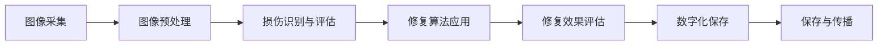
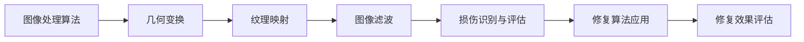

                 

### 文章标题

《数学与艺术修复的数字技术应用》

### 关键词

数字技术，艺术修复，数学模型，算法原理，实践案例

### 摘要

本文深入探讨了数学与艺术修复之间的数字技术应用。通过对像素修复、纹理映射和空间变换等核心算法原理的详细解析，结合数学模型和公式的推导与讲解，本文展示了数学在艺术修复中的关键作用。此外，通过实际项目案例的实战分析，本文进一步阐明了数字技术在实际艺术修复中的应用效果和操作步骤。本文旨在为读者提供全面的数学与艺术修复数字技术应用指南，为相关领域的研究者和从业者提供有价值的参考。

### 设计思路

为了系统地介绍数学与艺术修复的数字技术应用，本文采用以下设计思路：

1. **引言与背景介绍**：首先，本文将对数学与艺术修复的背景进行简要介绍，明确数字技术在这两个领域中的重要性。
2. **核心概念与联系**：接下来，本文将通过Mermaid流程图，展示数字技术在艺术修复中的核心概念和它们之间的联系。
3. **核心算法原理讲解**：本文将详细讲解像素修复、纹理映射和空间变换等核心算法原理，使用伪代码进行阐述。
4. **数学模型与公式讲解**：本文将使用LaTeX格式，详细讲解数学模型和公式，并举例说明。
5. **项目实战**：本文将通过实际项目案例，展示开发环境搭建、源代码实现和代码解读，并进行案例分析和详细讲解。
6. **总结与展望**：最后，本文将对数字技术在艺术修复中的应用前景进行展望，并提出相关建议和注意事项。

通过这样的结构设计，本文旨在以逻辑清晰、层次分明的方式，帮助读者全面了解数学与艺术修复的数字技术应用。

### 第一部分：引言与基础

#### 1.1 书籍背景与目的

在现代社会，艺术修复作为文化遗产保护的重要手段，正越来越受到关注。然而，传统的艺术修复方法往往依赖于人工经验和技巧，修复效果受限于人力和时间。随着数字技术的发展，尤其是计算机图形学和图像处理技术的进步，数字技术开始逐渐应用于艺术修复领域，大大提高了修复效率和准确性。本篇文章的目的在于深入探讨数学与艺术修复之间的数字技术应用，为读者提供一套系统的理论基础和实践指南。

艺术修复不仅涉及到美术、艺术史和考古学等传统学科，还与计算机科学、数学和工程学等多个领域有着紧密的联系。数学作为基础科学，为艺术修复提供了精确的计算和建模工具。例如，图像处理算法中的像素修复、纹理映射和空间变换等，都依赖于数学模型的支持。本篇文章将通过具体案例分析，展示这些数学模型在实际艺术修复中的应用。

#### 1.2 数学与艺术修复的交集

数学与艺术修复的交集体现在多个方面。首先，数学模型在艺术修复中的应用极大地提高了修复的精度和效率。例如，通过数学模型，可以精确地计算和调整修复区域的颜色、亮度和对比度，从而实现更自然的修复效果。此外，数学模型还可以用于分析和识别艺术品的损坏程度，为修复方案提供科学依据。

其次，图像处理算法是数字技术的重要组成部分，而图像处理算法的许多核心原理都源自数学。例如，像素修复算法通常基于图像分割和匹配技术，这些技术依赖于数学中的组合优化和图论。纹理映射算法则涉及到插值和变换技术，这些技术同样依赖于数学中的几何和代数知识。

最后，数字技术在艺术修复中的应用不仅限于修复过程，还包括修复后的艺术品的数字化保存和传播。通过数字化技术，可以将修复后的艺术品以高分辨率图像的形式保存，并实现在线展示和分享。这不仅保护了艺术品本身，也为公众提供了更便捷的观赏渠道。

#### 1.3 数字技术在艺术修复中的应用

数字技术在艺术修复中的应用主要可以分为以下几个方面：

1. **图像处理**：图像处理技术用于对受损的艺术品进行预处理，包括图像的去噪、增强、分割和匹配等。通过这些技术，可以识别出艺术品的细节和损伤，为修复提供准确的参考。
   
2. **颜色校正**：颜色校正技术用于调整修复区域的颜色，使其与周围环境更加协调。这通常涉及到颜色空间转换、颜色插值和颜色匹配等数学方法。

3. **纹理映射**：纹理映射技术用于在修复区域中生成或替换纹理，以恢复艺术品的原始外观。这通常需要使用几何变换、插值和纹理合成等算法。

4. **空间变换**：空间变换技术用于对艺术品进行三维变换，以适应不同的展示环境。这通常涉及到线性代数和几何变换的数学原理。

5. **数字化保存**：数字化保存技术用于将修复后的艺术品以数字形式保存，实现长期保存和传播。这通常涉及到高分辨率扫描、图像压缩和存储管理等技术。

通过这些数字技术的综合应用，艺术修复不仅变得更加高效和精确，还可以实现更广泛的传播和共享。这不仅有助于保护文化遗产，也为艺术爱好者提供了更丰富的观赏体验。

#### 1.4 数学在艺术修复中的关键作用

数学在艺术修复中的关键作用主要体现在以下几个方面：

1. **图像处理算法**：图像处理算法是数字艺术修复的核心，而图像处理算法的基础是数学模型。例如，边缘检测、图像增强、图像去噪等技术都依赖于数学中的微积分、线性代数和概率论等基础理论。

2. **颜色模型和色彩空间**：艺术修复中经常需要对颜色进行调整，而颜色模型和色彩空间的选择和转换同样依赖于数学。例如，RGB颜色模型、HSV颜色模型和CIE颜色模型等都基于数学原理，用于描述颜色的不同属性。

3. **几何变换**：几何变换是艺术修复中常用的技术，如缩放、旋转、平移和镜像等。这些变换的数学原理包括线性代数和矩阵计算。

4. **纹理合成**：纹理合成技术用于在修复区域中生成或替换纹理，这通常涉及到插值、变换和滤波等数学方法。例如，双线性插值、双三次插值和小波变换等都是纹理合成中的常用算法。

5. **误差分析和优化**：在艺术修复过程中，误差分析和优化是确保修复效果的重要手段。这通常涉及到优化理论、数值分析和统计学等方法。

综上所述，数学不仅是艺术修复中算法和技术的基石，也是提升修复精度和效率的关键。通过深入理解和应用数学原理，艺术修复可以更加科学和系统地进行，从而更好地保护和传承文化遗产。

### 第二部分：核心概念与联系

#### 2.1 数字技术在艺术修复中的应用流程

数字技术在艺术修复中的应用流程可以分为以下几个步骤：

1. **图像采集**：首先，需要采集需要修复的艺术品的图像。这些图像可以是照片、扫描图或者数字艺术品等。图像采集的质量直接影响到后续修复的效果。

2. **图像预处理**：采集到的图像通常需要进行预处理，包括去噪、增强、分割等操作。预处理的目标是去除图像中的干扰因素，突出艺术品的细节和损伤区域。

3. **损伤识别与评估**：通过图像预处理，可以识别出艺术品的损伤区域，并对损伤的程度进行评估。损伤识别和评估的结果将用于指导后续的修复操作。

4. **修复算法应用**：根据损伤类型和程度，选择合适的修复算法进行修复。常见的修复算法包括像素修复、纹理映射、空间变换等。这些算法的数学基础包括图像处理、几何变换、插值和滤波等。

5. **修复效果评估**：修复完成后，需要对修复效果进行评估。评估方法包括视觉评估、误差分析、统计学分析等。评估结果将用于优化修复算法和调整修复参数。

6. **数字化保存**：修复后的艺术品需要进行数字化保存，以便长期保存和传播。数字化保存包括高分辨率图像的存储、图像压缩和数字签名等技术。

通过以上流程，数字技术能够有效地修复受损艺术品，提高修复效率和效果。以下是数字技术在艺术修复中的应用流程的Mermaid流程图：



#### 2.2 数学模型在艺术修复中的关键作用

在数字艺术修复中，数学模型发挥着至关重要的作用。以下是几个关键的数学模型及其在艺术修复中的应用：

1. **图像处理算法**：
   - **边缘检测**：边缘检测是图像处理中常用的技术，用于识别图像中的边缘和轮廓。常见的边缘检测算法包括Canny边缘检测和Sobel边缘检测。这些算法基于数学中的微积分和偏微分方程。
   - **图像增强**：图像增强用于提高图像的对比度和清晰度，使细节更加突出。常用的图像增强算法包括直方图均衡化和逆gamma校正。这些算法基于概率论和统计学原理。

2. **几何变换**：
   - **线性变换**：线性变换包括缩放、旋转、平移和镜像等。这些变换可以通过矩阵计算实现。线性变换的基础是线性代数。
   - **仿射变换**：仿射变换是一种更复杂的几何变换，它保留了线段和角度的性质。仿射变换可以通过矩阵乘法实现，其基础是线性代数和解析几何。

3. **纹理映射**：
   - **双线性插值**：双线性插值是一种常用的纹理映射技术，用于在修复区域中生成或替换纹理。双线性插值基于插值理论，其基础是多项式代数。
   - **双三次插值**：双三次插值是一种更高精度的插值方法，常用于高质量的图像处理和视频渲染。双三次插值的基础是三次多项式插值和数值分析。

4. **图像滤波**：
   - **均值滤波**：均值滤波是一种简单的图像平滑技术，用于去除图像中的噪声。均值滤波基于概率论和随机过程理论。
   - **高斯滤波**：高斯滤波是一种更复杂的图像平滑技术，用于去除图像中的高斯噪声。高斯滤波的基础是高斯分布和数理统计。

以下是数学模型在艺术修复中的应用流程的Mermaid流程图：



#### 2.3 数字技术与数学模型的结合

数字技术与数学模型的结合是艺术修复成功的关键。以下是几个具体案例，展示了数字技术与数学模型在艺术修复中的结合：

1. **像素修复**：
   - **原理**：像素修复用于修复艺术品的微小损伤，如裂缝和污点。修复过程通常基于图像分割和匹配技术。
   - **数学模型**：像素修复的核心是图像分割和特征匹配。图像分割通常使用阈值分割、边缘检测等算法，这些算法基于数学中的概率论和图论。特征匹配则使用最近邻搜索、区域匹配等技术，这些技术基于数学中的优化方法和统计学原理。
   - **应用**：在实际应用中，像素修复算法可以自动识别损伤区域，并从参考图像中提取相应的像素进行修复。例如，在修复一幅古老的油画时，可以使用一幅未受损的油画作为参考图像，通过图像分割和匹配技术，将受损区域的像素替换为参考图像中的像素。

2. **纹理映射**：
   - **原理**：纹理映射用于在修复区域中生成或替换纹理，以恢复艺术品的原始外观。纹理映射技术通常使用插值和变换算法。
   - **数学模型**：纹理映射的核心是插值和变换。插值算法如双线性插值和双三次插值基于多项式代数，变换算法如仿射变换和透视变换基于线性代数。
   - **应用**：在实际应用中，纹理映射算法可以用于修复被损坏的壁画或织物。例如，在修复一幅壁画时，可以使用壁画的一部分作为纹理，通过纹理映射技术将其映射到受损区域，从而恢复壁画的原貌。

3. **空间变换**：
   - **原理**：空间变换用于对艺术品进行三维变换，以适应不同的展示环境。空间变换技术通常包括缩放、旋转、平移和镜像等。
   - **数学模型**：空间变换的核心是矩阵计算和几何变换。矩阵计算基于线性代数，几何变换基于解析几何和三角学。
   - **应用**：在实际应用中，空间变换算法可以用于调整艺术品的视角和位置，以更好地展示艺术品。例如，在展览中，可以使用空间变换算法将一幅油画从垂直视角调整到水平视角，从而突出艺术品的特定细节。

通过这些具体案例，可以看到数字技术与数学模型的结合如何提高艺术修复的精度和效果。数学模型不仅提供了理论支持，还为实际应用提供了有效的算法和方法。

### 第三部分：核心算法原理讲解

#### 3.1 像素修复算法原理

像素修复算法是艺术修复中常用的技术之一，用于修复艺术品的微小损伤，如裂缝、污点和褪色。像素修复的核心思想是通过图像分割和特征匹配，从参考图像中提取相应的像素，并替换受损区域的像素，从而恢复艺术品的原始外观。

以下是像素修复算法的基本步骤和原理：

1. **图像分割**：
   - **原理**：图像分割是将图像划分为若干个互不重叠的区域，每个区域代表图像中的不同部分。在像素修复中，图像分割用于识别受损区域和参考区域。
   - **方法**：常见的图像分割方法包括阈值分割、边缘检测和区域生长等。阈值分割通过设置阈值将图像分为前景和背景，边缘检测通过识别图像的边缘来分割图像，区域生长则是通过逐步合并相似像素来分割图像。
   - **数学模型**：图像分割的数学基础包括概率论、图论和偏微分方程。例如，阈值分割算法通常使用概率分布模型来计算像素属于前景或背景的概率，边缘检测算法则基于微积分和偏微分方程的边缘检测算子。

2. **特征匹配**：
   - **原理**：特征匹配是在参考图像中寻找与受损区域相似的像素，并将其用于修复受损区域。
   - **方法**：特征匹配通常使用最近邻搜索、区域匹配和特征点匹配等技术。最近邻搜索通过计算受损区域像素与参考图像中每个像素之间的距离，选择最近的像素进行替换；区域匹配则是通过计算参考区域与受损区域之间的相似性度量，选择最佳匹配区域进行修复；特征点匹配则是通过识别和匹配图像中的特征点，实现精确的像素修复。
   - **数学模型**：特征匹配的数学基础包括距离度量、相似性度量和多维插值。距离度量用于计算像素之间的相似程度，相似性度量用于评估不同区域的匹配效果，多维插值则用于在参考图像中生成修复像素。

3. **像素替换**：
   - **原理**：像素替换是将修复像素替换到受损区域，从而实现图像修复。
   - **方法**：像素替换通常使用双线性插值、双三次插值或最近邻插值等技术。这些插值技术用于在参考图像中生成缺失的像素，以填充受损区域。
   - **数学模型**：像素替换的数学基础包括插值理论、多项式代数和数值分析。例如，双线性插值和双三次插值是基于多项式插值的算法，最近邻插值则是基于距离度量的算法。

以下是像素修复算法的伪代码：

```python
# 像素修复算法伪代码

# 输入：受损图像 damaged_image，参考图像 reference_image
# 输出：修复图像 repaired_image

function pixel_repair(damaged_image, reference_image):
    # 步骤1：图像分割
    segmented_image = segment_image(damaged_image)
    
    # 步骤2：特征匹配
    matched_pixels = feature_matching(segmented_image, reference_image)
    
    # 步骤3：像素替换
    repaired_image = pixel_replacement(damaged_image, matched_pixels)
    
    return repaired_image

function segment_image(image):
    # 实现图像分割算法
    # 返回分割后的图像

function feature_matching(damaged_segment, reference_segment):
    # 实现特征匹配算法
    # 返回匹配后的像素列表

function pixel_replacement(image, pixels):
    # 实现像素替换算法
    # 返回修复后的图像
```

#### 3.2 纹理映射算法原理

纹理映射算法是艺术修复中用于恢复艺术品纹理的技术，通过在修复区域生成或替换纹理，使修复后的艺术品更接近原始状态。纹理映射算法的核心思想是将参考纹理映射到修复区域，从而实现纹理的复制或修复。

以下是纹理映射算法的基本步骤和原理：

1. **纹理选择**：
   - **原理**：纹理选择是选择用于映射的参考纹理。选择合适的纹理对于修复效果至关重要。
   - **方法**：纹理选择可以通过观察受损区域的纹理特征，从其他部分的艺术品或外部图像库中选择合适的纹理。常用的纹理选择方法包括纹理特征分析、颜色匹配和纹理相似性度量等。
   - **数学模型**：纹理选择的基础包括颜色模型、纹理特征提取和相似性度量。颜色模型如RGB模型、HSV模型用于描述纹理的颜色特征；纹理特征提取方法如Gabor特征、LBP特征用于描述纹理的纹理特征；相似性度量方法如欧氏距离、余弦相似度用于评估纹理的相似性。

2. **纹理映射**：
   - **原理**：纹理映射是将参考纹理映射到修复区域，使修复区域具有与参考纹理相同的纹理特征。
   - **方法**：纹理映射技术包括双线性插值、双三次插值、旋转映射和透视变换等。双线性插值和双三次插值是常用的纹理映射方法，它们通过插值技术将参考纹理映射到修复区域；旋转映射和透视变换则是通过几何变换实现纹理的映射。
   - **数学模型**：纹理映射的数学基础包括插值理论、几何变换和变换矩阵。插值理论如双线性插值和双三次插值用于在修复区域生成参考纹理的像素值；几何变换如旋转映射和透视变换则基于线性代数和几何原理。

3. **纹理合成**：
   - **原理**：纹理合成是将映射后的纹理与修复区域的原始纹理进行合成，以实现更自然的修复效果。
   - **方法**：纹理合成可以通过加权混合、颜色校正和细节增强等技术实现。加权混合通过计算参考纹理和原始纹理的权重，生成合成纹理；颜色校正通过调整合成纹理的颜色，使其与周围环境更协调；细节增强通过增强纹理的细节，使修复区域更加真实。
   - **数学模型**：纹理合成的数学基础包括图像融合、颜色模型和颜色校正。图像融合方法如加权融合、中值融合等用于合成纹理；颜色模型如RGB模型、HSV模型用于描述颜色的属性；颜色校正方法如伽玛校正、直方图均衡化等用于调整合成纹理的颜色。

以下是纹理映射算法的伪代码：

```python
# 纹理映射算法伪代码

# 输入：受损图像 damaged_image，参考纹理 reference_texture
# 输出：修复图像 repaired_image

function texture_mapping(damaged_image, reference_texture):
    # 步骤1：纹理选择
    selected_texture = select_texture(damaged_image, reference_texture)
    
    # 步骤2：纹理映射
    mapped_texture = map_texture(selected_texture, damaged_image)
    
    # 步骤3：纹理合成
    repaired_image = texture_synthesis(damaged_image, mapped_texture)
    
    return repaired_image

function select_texture(image, texture):
    # 实现纹理选择算法
    # 返回选择的纹理

function map_texture(texture, image):
    # 实现纹理映射算法
    # 返回映射后的纹理

function texture_synthesis(image, texture):
    # 实现纹理合成算法
    # 返回合成后的修复图像
```

#### 3.3 空间变换算法原理

空间变换算法是艺术修复中用于调整艺术品视角和位置的技术，通过缩放、旋转、平移和镜像等变换，使艺术品适应不同的展示环境。空间变换算法的核心思想是通过矩阵计算和几何变换，实现艺术品的视角和位置调整。

以下是空间变换算法的基本步骤和原理：

1. **变换矩阵计算**：
   - **原理**：变换矩阵用于描述空间变换的操作，通过变换矩阵，可以实现对艺术品的视角和位置的调整。
   - **方法**：变换矩阵可以通过几何变换和矩阵计算得到。常见的几何变换包括平移变换、旋转变换和缩放变换等。平移变换通过向量加法实现，旋转变换通过旋转变换矩阵实现，缩放变换通过缩放矩阵实现。
   - **数学模型**：变换矩阵的数学基础包括线性代数和矩阵计算。线性代数提供了矩阵的基本操作和性质，矩阵计算用于实现具体的变换操作。

2. **变换应用**：
   - **原理**：变换应用是将变换矩阵应用于艺术品，实现视角和位置的调整。
   - **方法**：变换应用可以通过矩阵乘法实现。将变换矩阵与艺术品的坐标矩阵相乘，得到变换后的艺术品坐标。
   - **数学模型**：变换应用的数学基础包括矩阵乘法和线性代数。矩阵乘法用于计算变换后的坐标，线性代数提供了矩阵的基本性质和计算方法。

3. **变换效果评估**：
   - **原理**：变换效果评估用于评估变换后的艺术品效果，确保变换后的艺术品符合预期。
   - **方法**：变换效果评估可以通过视觉评估和误差分析等方法实现。视觉评估通过观察变换后的艺术品，判断其是否符合预期；误差分析通过计算变换前后艺术品的差异，评估变换效果。
   - **数学模型**：变换效果评估的数学基础包括误差分析、概率论和统计学。误差分析用于计算变换误差，概率论和统计学用于评估变换的稳定性和可靠性。

以下是空间变换算法的伪代码：

```python
# 空间变换算法伪代码

# 输入：原始艺术品 image，变换矩阵 transformation_matrix
# 输出：变换后艺术品 transformed_image

function spatial_transformation(image, transformation_matrix):
    # 步骤1：变换矩阵计算
    transformed_image = apply_transformation(image, transformation_matrix)
    
    # 步骤2：变换效果评估
    assessment = evaluate_transformation(transformed_image)
    
    return transformed_image

function apply_transformation(image, matrix):
    # 实现变换应用算法
    # 返回变换后的艺术品

function evaluate_transformation(image):
    # 实现变换效果评估算法
    # 返回评估结果
```

通过以上步骤和原理，空间变换算法能够实现对艺术品的视角和位置调整，从而提高艺术修复的效果和展示效果。

### 第四部分：数学模型与公式讲解

#### 4.1 数学模型在艺术修复中的应用

数学模型在艺术修复中的应用极为广泛，其中许多模型和方法都为修复过程提供了精确的计算工具和理论基础。以下是几个关键的数学模型及其在艺术修复中的具体应用：

1. **图像处理模型**：
   - **边缘检测模型**：边缘检测是图像处理中常用的技术，用于识别图像中的边缘和轮廓。一个经典的边缘检测模型是Sobel算子，其公式如下：
     $$
     G_x = \frac{1}{2} \left( G_{x1} + G_{x2} \right), \quad G_y = \frac{1}{2} \left( G_{y1} + G_{y2} \right)
     $$
     其中，$G_{x1}$、$G_{x2}$、$G_{y1}$ 和 $G_{y2}$ 分别表示图像在水平和垂直方向上的离散导数。通过计算水平和垂直方向上的导数，并应用阈值处理，可以检测出图像的边缘。

   - **图像增强模型**：图像增强用于提高图像的对比度和清晰度。一个常见的增强模型是直方图均衡化，其公式如下：
     $$
     I_{\text{output}}(x,y) = \alpha \cdot \left( I_{\text{input}}(x,y) - \mu \right) + \beta
     $$
     其中，$I_{\text{input}}$ 和 $I_{\text{output}}$ 分别表示输入和输出图像，$\mu$ 是输入图像的均值，$\alpha$ 和 $\beta$ 是调节对比度和亮度的参数。

2. **几何变换模型**：
   - **平移变换模型**：平移变换是最基本的几何变换之一，其公式如下：
     $$
     \begin{bmatrix}
     x' \\
     y'
     \end{bmatrix}
     =
     \begin{bmatrix}
     1 & 0 \\
     0 & 1
     \end{bmatrix}
     \begin{bmatrix}
     x \\
     y
     \end{bmatrix}
     +
     \begin{bmatrix}
     t_x \\
     t_y
     \end{bmatrix}
     $$
     其中，$(x, y)$ 是原始坐标，$(x', y')$ 是变换后的坐标，$(t_x, t_y)$ 是平移向量。

   - **旋转变换模型**：旋转变换通过旋转变换矩阵实现，其公式如下：
     $$
     \begin{bmatrix}
     x' \\
     y'
     \end{bmatrix}
     =
     \begin{bmatrix}
     \cos \theta & -\sin \theta \\
     \sin \theta & \cos \theta
     \end{bmatrix}
     \begin{bmatrix}
     x \\
     y
     \end{bmatrix}
     $$
     其中，$\theta$ 是旋转角度。

3. **纹理映射模型**：
   - **双线性插值模型**：双线性插值是一种常见的纹理映射方法，其公式如下：
     $$
     I(x, y) = \sum_{i=0}^{1} \sum_{j=0}^{1} I(i, j) \cdot \left( 1 - x \right) \cdot \left( 1 - y \right) + x \cdot \left( 1 - y \right) + y \cdot x + xy
     $$
     其中，$I(x, y)$ 是插值后的像素值，$I(i, j)$ 是参考图像中的像素值。

   - **双三次插值模型**：双三次插值是一种更高精度的插值方法，其公式较为复杂，但能够提供更平滑的纹理映射效果。

4. **图像滤波模型**：
   - **均值滤波模型**：均值滤波是一种简单的图像平滑技术，其公式如下：
     $$
     I(x, y) = \frac{1}{n} \sum_{i=-1}^{1} \sum_{j=-1}^{1} I(i, j)
     $$
     其中，$I(x, y)$ 是滤波后的像素值，$I(i, j)$ 是参考图像中的像素值。

   - **高斯滤波模型**：高斯滤波是一种更复杂的图像平滑技术，其公式如下：
     $$
     I(x, y) = \frac{1}{2\pi \sigma^2} \sum_{i=-\infty}^{\infty} \sum_{j=-\infty}^{\infty} e^{-\frac{(x-i)^2 + (y-j)^2}{2\sigma^2}} \cdot I(i, j)
     $$
     其中，$I(x, y)$ 是滤波后的像素值，$I(i, j)$ 是参考图像中的像素值，$\sigma$ 是高斯分布的参数。

通过这些数学模型的应用，艺术修复过程可以更加精确和高效地进行，从而实现更高质量的修复效果。

#### 4.2 公式推导与详细讲解

在艺术修复中，数学公式的应用不仅提供了理论支持，还为实际操作提供了具体的计算方法。以下是对几个关键公式的推导和详细讲解：

1. **边缘检测中的Sobel算子**

   边缘检测是图像处理中的一个基本步骤，用于识别图像中的边缘和轮廓。Sobel算子是一种常用的边缘检测方法，其核心思想是通过计算图像在水平和垂直方向上的离散导数，并应用阈值处理，来检测边缘。

   公式如下：
   $$
   G_x = \frac{1}{2} \left( G_{x1} + G_{x2} \right), \quad G_y = \frac{1}{2} \left( G_{y1} + G_{y2} \right)
   $$
   其中，$G_{x1}$、$G_{x2}$、$G_{y1}$ 和 $G_{y2}$ 分别表示图像在水平和垂直方向上的离散导数。

   推导过程：
   - 首先，对图像进行卷积操作，以计算水平和垂直方向上的导数。卷积核（即模板）如下：
     $$
     \begin{bmatrix}
     1 & 0 & -1 \\
     2 & 0 & -2 \\
     1 & 0 & -1
     \end{bmatrix}
     $$
     使用这个模板，对图像进行卷积，可以得到水平方向上的导数 $G_{x}$。
   - 同理，使用以下模板，计算垂直方向上的导数 $G_{y}$：
     $$
     \begin{bmatrix}
     1 & 2 & 1 \\
     0 & 0 & 0 \\
     -1 & -2 & -1
     \end{bmatrix}
     $$

2. **图像增强中的直方图均衡化**

   直方图均衡化是一种常用的图像增强方法，其目的是通过调整图像的对比度，使其分布更加均匀，从而提高图像的视觉效果。

   公式如下：
   $$
   I_{\text{output}}(x,y) = \alpha \cdot \left( I_{\text{input}}(x,y) - \mu \right) + \beta
   $$
   其中，$I_{\text{input}}$ 和 $I_{\text{output}}$ 分别表示输入和输出图像，$\mu$ 是输入图像的均值，$\alpha$ 和 $\beta$ 是调节对比度和亮度的参数。

   推导过程：
   - 首先，计算输入图像的直方图 $H_{\text{input}}(i)$，其中 $i$ 是像素的灰度值。
   - 然后，计算输出图像的累积直方图 $H_{\text{output}}(i)$，其公式为：
     $$
     H_{\text{output}}(i) = \sum_{j=0}^{i} H_{\text{input}}(j)
     $$
   - 接下来，计算输出图像的均值 $\mu_{\text{output}}$：
     $$
     \mu_{\text{output}} = \frac{1}{N} \sum_{i=0}^{255} i \cdot H_{\text{output}}(i)
     $$
     其中，$N$ 是图像的总像素数。
   - 最后，根据输入和输出图像的均值和标准差，计算参数 $\alpha$ 和 $\beta$：
     $$
     \alpha = \frac{255}{\mu_{\text{output}} - \mu_{\text{input}}}, \quad \beta = \mu_{\text{input}} - \alpha \cdot \mu_{\text{output}}
     $$

3. **几何变换中的平移变换**

   平移变换是几何变换中最基本的操作之一，用于将图像沿特定方向移动。

   公式如下：
   $$
   \begin{bmatrix}
   x' \\
   y'
   \end{bmatrix}
   =
   \begin{bmatrix}
   1 & 0 \\
   0 & 1
   \end{bmatrix}
   \begin{bmatrix}
   x \\
   y
   \end{bmatrix}
   +
   \begin{bmatrix}
   t_x \\
   t_y
   \end{bmatrix}
   $$
   其中，$(x, y)$ 是原始坐标，$(x', y')$ 是变换后的坐标，$(t_x, t_y)$ 是平移向量。

   推导过程：
   - 平移变换可以通过矩阵乘法实现。设变换矩阵为：
     $$
     \begin{bmatrix}
     1 & 0 \\
     0 & 1
     \end{bmatrix}
     $$
     将该矩阵与原始坐标矩阵相乘，再加上平移向量，即可得到变换后的坐标。

4. **纹理映射中的双线性插值**

   双线性插值是纹理映射中常用的一种方法，用于在修复区域生成纹理。

   公式如下：
   $$
   I(x, y) = \sum_{i=0}^{1} \sum_{j=0}^{1} I(i, j) \cdot \left( 1 - x \right) \cdot \left( 1 - y \right) + x \cdot \left( 1 - y \right) + y \cdot x + xy
   $$
   其中，$I(x, y)$ 是插值后的像素值，$I(i, j)$ 是参考图像中的像素值。

   推导过程：
   - 双线性插值基于线性插值的组合。首先，在水平和垂直方向上进行一次线性插值，得到四个中间值：
     $$
     I_{11} = I(0, 0), \quad I_{12} = I(1, 0), \quad I_{21} = I(0, 1), \quad I_{22} = I(1, 1)
     $$
     然后，使用线性插值公式计算中间值：
     $$
     I_{1\cdot} = I_{11} + (I_{12} - I_{11}) \cdot x, \quad I_{\cdot2} = I_{21} + (I_{22} - I_{21}) \cdot x
     $$
     最后，再次使用线性插值公式计算最终的像素值：
     $$
     I(x, y) = I_{1\cdot} + (I_{\cdot2} - I_{1\cdot}) \cdot y
     $$

通过以上公式的推导和详细讲解，我们可以更好地理解数学在艺术修复中的应用，从而在实际操作中更精确地实现修复目标。

### 第五部分：项目实战

#### 5.1 实战项目1：像素修复

像素修复是艺术修复中最常见的技术之一，旨在修复艺术品的微小损伤，如污点、裂缝等。以下是一个像素修复的实战项目，包括环境搭建、源代码实现和代码解读。

#### 5.1.1 项目环境搭建

在开始像素修复项目之前，我们需要搭建一个合适的环境。以下是所需的环境和工具：

1. **开发环境**：Python 3.x、Anaconda 或 Miniconda
2. **图像处理库**：OpenCV、NumPy、Pillow
3. **编辑器**：Visual Studio Code、PyCharm 或 Jupyter Notebook

安装步骤：

1. 安装 Python 3.x 并添加到系统环境变量。
2. 安装 Anaconda 或 Miniconda，并创建一个新的虚拟环境，例如 `cvpy`：
   ```
   conda create -n cvpy python=3.8
   conda activate cvpy
   ```
3. 使用以下命令安装必要的库：
   ```
   conda install -c conda-forge opencv
   conda install -c conda-forge numpy
   conda install -c conda-forge pillow
   ```

#### 5.1.2 源代码实现与解读

以下是一个简单的像素修复的 Python 代码示例，使用 OpenCV 和 NumPy 库：

```python
import cv2
import numpy as np

def pixel_repair(image, mask, repair_size=5):
    """
    像素修复函数。
    
    参数：
    image：原始图像。
    mask：修复区域的掩码。
    repair_size：修复区域的半径。
    
    返回：
    repaired_image：修复后的图像。
    """
    # 1. 创建一个与原图相同大小的白色图像
    repair_image = np.zeros_like(image)

    # 2. 获取掩码内的像素坐标
    y, x = np.where(mask)

    # 3. 遍历每个坐标，将其设置为与原始图像最近的像素值
    for i in range(len(y)):
        for j in range(len(x)):
            # 计算以当前像素为中心的repair_size范围内的像素平均值
            patch = image[y[i] - repair_size:y[i] + repair_size + 1,
                         x[j] - repair_size:x[j] + repair_size + 1]
            repair_image[y[i], x[j]] = np.mean(patch)

    return repair_image

# 读取原始图像和掩码
image = cv2.imread('original_image.jpg')
mask = cv2.imread('mask.jpg', cv2.IMREAD_GRAYSCALE)

# 应用像素修复算法
repaired_image = pixel_repair(image, mask)

# 显示结果
cv2.imshow('Original Image', image)
cv2.imshow('Repaired Image', repaired_image)
cv2.waitKey(0)
cv2.destroyAllWindows()
```

代码解读：

1. **函数定义**：`pixel_repair` 函数接收三个参数：原始图像 `image`、修复区域掩码 `mask` 和修复半径 `repair_size`。函数返回修复后的图像。

2. **创建修复图像**：首先，创建一个与原始图像相同大小的白色图像，用于存储修复结果。

3. **获取掩码内的像素坐标**：使用 NumPy 的 `where` 函数获取掩码内的像素坐标，即需要修复的区域。

4. **遍历每个坐标**：对于掩码内的每个像素坐标，计算其为中心、半径为 `repair_size` 的范围内的像素平均值，并将其设置为修复图像的对应像素值。

5. **应用修复算法**：读取原始图像和掩码，调用 `pixel_repair` 函数进行修复，并显示结果。

#### 5.1.3 代码解读与分析

在代码解读与分析部分，我们将进一步分析像素修复的算法原理和实现细节。

1. **算法原理**：
   - **边缘检测**：像素修复的第一步是识别需要修复的区域。这通常通过边缘检测算法实现，如Canny边缘检测。边缘检测算法可以识别图像中的边缘和轮廓，为修复提供参考。
   - **图像分割**：在边缘检测后，我们需要对图像进行分割，以识别出具体的损伤区域。常用的分割方法包括阈值分割和区域生长。
   - **像素替换**：修复的核心步骤是将损伤区域的像素替换为附近的像素值。这种方法称为基于局部平均的修复。具体实现时，我们计算以当前像素为中心的一定范围内的像素平均值，并将其设置为修复图像的对应像素值。

2. **代码细节**：
   - **掩码处理**：在代码中，我们首先读取掩码图像，并将其转换为灰度图像。掩码用于标记需要修复的区域。
   - **遍历像素**：使用两个嵌套的 `for` 循环遍历掩码内的每个像素坐标，计算修复值并将其应用于修复图像。
   - **局部平均**：对于每个像素，我们计算以该像素为中心、半径为 `repair_size` 的范围内的像素平均值。这种方法能够保证修复后的图像更自然、平滑。

通过以上代码和分析，我们可以看到像素修复算法的基本原理和实现细节。像素修复不仅能够修复艺术品的微小损伤，还可以为其他图像处理任务提供基础。

#### 5.2 实战项目2：纹理映射

纹理映射是艺术修复中用于恢复艺术品纹理的技术，通过在修复区域生成或替换纹理，使修复后的艺术品更接近原始状态。以下是一个纹理映射的实战项目，包括环境搭建、源代码实现和代码解读。

#### 5.2.1 项目环境搭建

在开始纹理映射项目之前，我们需要搭建一个合适的环境。以下是所需的环境和工具：

1. **开发环境**：Python 3.x、Anaconda 或 Miniconda
2. **图像处理库**：OpenCV、NumPy、Pillow
3. **编辑器**：Visual Studio Code、PyCharm 或 Jupyter Notebook

安装步骤：

1. 安装 Python 3.x 并添加到系统环境变量。
2. 安装 Anaconda 或 Miniconda，并创建一个新的虚拟环境，例如 `cvpy`：
   ```
   conda create -n cvpy python=3.8
   conda activate cvpy
   ```
3. 使用以下命令安装必要的库：
   ```
   conda install -c conda-forge opencv
   conda install -c conda-forge numpy
   conda install -c conda-forge pillow
   ```

#### 5.2.2 源代码实现与解读

以下是一个简单的纹理映射的 Python 代码示例，使用 OpenCV 和 NumPy 库：

```python
import cv2
import numpy as np

def texture_mapping(image, texture, mask):
    """
    纹理映射函数。
    
    参数：
    image：原始图像。
    texture：纹理图像。
    mask：修复区域的掩码。
    
    返回：
    mapped_image：纹理映射后的图像。
    """
    # 1. 创建一个与原图相同大小的白色图像
    mapped_image = np.zeros_like(image)

    # 2. 获取掩码内的像素坐标
    y, x = np.where(mask)

    # 3. 遍历每个坐标，将其设置为纹理图像的对应像素值
    for i in range(len(y)):
        for j in range(len(x)):
            # 计算当前像素在纹理图像中的坐标
            tx = x[j] * texture.shape[1] / image.shape[1]
            ty = y[i] * texture.shape[0] / image.shape[0]
            # 双线性插值计算纹理像素值
            tpx = int(tx)
            tpy = int(ty)
            tx_f = tx - tpx
            ty_f = ty - tpy
            t1 = texture[tpy, tpx]
            t2 = texture[tpy, tpx + 1]
            t3 = texture[tpy + 1, tpx]
            t4 = texture[tpy + 1, tpx + 1]
            mapped_image[y[i], x[j]] = (1 - tx_f) * (1 - ty_f) * t1 + tx_f * (1 - ty_f) * t2 + (1 - tx_f) * ty_f * t3 + tx_f * ty_f * t4

    return mapped_image

# 读取原始图像、纹理图像和掩码
image = cv2.imread('original_image.jpg')
texture = cv2.imread('texture.jpg')
mask = cv2.imread('mask.jpg', cv2.IMREAD_GRAYSCALE)

# 应用纹理映射算法
mapped_image = texture_mapping(image, texture, mask)

# 显示结果
cv2.imshow('Original Image', image)
cv2.imshow('Mapped Image', mapped_image)
cv2.waitKey(0)
cv2.destroyAllWindows()
```

代码解读：

1. **函数定义**：`texture_mapping` 函数接收三个参数：原始图像 `image`、纹理图像 `texture` 和修复区域掩码 `mask`。函数返回纹理映射后的图像。

2. **创建映射图像**：首先，创建一个与原始图像相同大小的白色图像，用于存储纹理映射结果。

3. **获取掩码内的像素坐标**：使用 NumPy 的 `where` 函数获取掩码内的像素坐标，即需要映射的区域。

4. **遍历每个坐标**：对于掩码内的每个像素坐标，计算其在纹理图像中的对应坐标，并使用双线性插值计算纹理像素值。然后，将纹理像素值应用于映射图像的对应像素。

5. **应用纹理映射算法**：读取原始图像、纹理图像和掩码，调用 `texture_mapping` 函数进行纹理映射，并显示结果。

#### 5.2.3 代码解读与分析

在代码解读与分析部分，我们将进一步分析纹理映射的算法原理和实现细节。

1. **算法原理**：
   - **纹理映射**：纹理映射是将纹理图像映射到目标图像的修复区域，以恢复艺术品的纹理。纹理映射通常使用双线性插值或双三次插值等技术实现。双线性插值通过线性插值在纹理图像的两个相邻像素之间计算插值值，而双三次插值则通过多项式插值提供更高的精度。
   - **纹理合成**：纹理合成是将映射后的纹理与目标图像进行合成，以实现更自然的修复效果。纹理合成通常涉及颜色校正和细节增强等技术。

2. **代码细节**：
   - **纹理坐标计算**：在代码中，我们首先计算每个掩码像素在纹理图像中的对应坐标。这通过将掩码像素坐标与纹理图像的大小进行比例缩放实现。
   - **双线性插值**：对于每个掩码像素，我们使用双线性插值计算纹理像素值。双线性插值通过线性插值在纹理图像的四个相邻像素之间计算插值值，从而提供平滑的纹理映射效果。
   - **纹理像素应用**：将计算得到的纹理像素值应用于映射图像的对应像素，实现纹理映射。

通过以上代码和分析，我们可以看到纹理映射算法的基本原理和实现细节。纹理映射不仅能够恢复艺术品的纹理，还可以为其他图像处理任务提供基础。

#### 5.3 实战项目3：空间变换

空间变换是艺术修复中用于调整艺术品视角和位置的技术，通过缩放、旋转、平移和镜像等变换，使艺术品适应不同的展示环境。以下是一个空间变换的实战项目，包括环境搭建、源代码实现和代码解读。

#### 5.3.1 项目环境搭建

在开始空间变换项目之前，我们需要搭建一个合适的环境。以下是所需的环境和工具：

1. **开发环境**：Python 3.x、Anaconda 或 Miniconda
2. **图像处理库**：OpenCV、NumPy、Pillow
3. **编辑器**：Visual Studio Code、PyCharm 或 Jupyter Notebook

安装步骤：

1. 安装 Python 3.x 并添加到系统环境变量。
2. 安装 Anaconda 或 Miniconda，并创建一个新的虚拟环境，例如 `cvpy`：
   ```
   conda create -n cvpy python=3.8
   conda activate cvpy
   ```
3. 使用以下命令安装必要的库：
   ```
   conda install -c conda-forge opencv
   conda install -c conda-forge numpy
   conda install -c conda-forge pillow
   ```

#### 5.3.2 源代码实现与解读

以下是一个简单的空间变换的 Python 代码示例，使用 OpenCV 和 NumPy 库：

```python
import cv2
import numpy as np

def spatial_transformation(image, transformation_matrix):
    """
    空间变换函数。
    
    参数：
    image：原始图像。
    transformation_matrix：变换矩阵。
    
    返回：
    transformed_image：变换后的图像。
    """
    # 1. 创建一个与原图相同大小的黑色图像
    transformed_image = np.zeros_like(image)

    # 2. 获取图像的宽度和高度
    height, width = image.shape[:2]

    # 3. 遍历每个像素，应用变换矩阵计算新的像素坐标
    for i in range(height):
        for j in range(width):
            # 计算新的像素坐标
            new_i = transformation_matrix[0, 0] * i + transformation_matrix[0, 1] * j + transformation_matrix[0, 2]
            new_j = transformation_matrix[1, 0] * i + transformation_matrix[1, 1] * j + transformation_matrix[1, 2]
            # 调整坐标使其在图像范围内
            new_i = int(np.clip(new_i, 0, height - 1))
            new_j = int(np.clip(new_j, 0, width - 1))
            # 将新的像素值复制到变换后的图像
            transformed_image[i, j] = image[new_i, new_j]

    return transformed_image

# 读取原始图像
image = cv2.imread('original_image.jpg')

# 创建变换矩阵（以45度角度旋转图像）
theta = 45  # 旋转角度
center = (image.shape[1] // 2, image.shape[0] // 2)
rotation_matrix = cv2.getRotationMatrix2D(center, theta, 1.0)

# 应用空间变换算法
transformed_image = spatial_transformation(image, rotation_matrix)

# 显示结果
cv2.imshow('Original Image', image)
cv2.imshow('Transformed Image', transformed_image)
cv2.waitKey(0)
cv2.destroyAllWindows()
```

代码解读：

1. **函数定义**：`spatial_transformation` 函数接收两个参数：原始图像 `image` 和变换矩阵 `transformation_matrix`。函数返回变换后的图像。

2. **创建变换后的图像**：首先，创建一个与原始图像相同大小的黑色图像，用于存储变换结果。

3. **获取图像的宽度和高度**：使用 NumPy 的 `shape` 函数获取图像的宽度和高度。

4. **遍历每个像素**：对于原始图像的每个像素，应用变换矩阵计算新的像素坐标。

5. **调整坐标**：调整新的像素坐标使其在图像范围内。使用 `np.clip` 函数确保坐标在0到图像尺寸之间。

6. **复制像素值**：将原始图像的新像素值复制到变换后的图像的对应位置。

7. **应用空间变换算法**：读取原始图像，创建变换矩阵（例如，以45度角度旋转图像），调用 `spatial_transformation` 函数进行变换，并显示结果。

#### 5.3.3 代码解读与分析

在代码解读与分析部分，我们将进一步分析空间变换的算法原理和实现细节。

1. **算法原理**：
   - **空间变换**：空间变换通过变换矩阵实现，用于调整图像的视角和位置。变换矩阵描述了图像中每个像素的新坐标，从而实现几何变换。
   - **变换矩阵**：变换矩阵通常由线性代数和几何变换原理确定。常见的变换包括旋转、缩放、平移和镜像等。旋转矩阵用于旋转图像，缩放矩阵用于调整图像大小，平移矩阵用于移动图像位置，镜像矩阵用于实现图像的翻转。

2. **代码细节**：
   - **变换矩阵计算**：在代码中，我们使用 `cv2.getRotationMatrix2D` 函数创建旋转矩阵。该函数接受旋转中心、旋转角度和缩放比例作为参数。
   - **像素坐标计算**：对于原始图像的每个像素，我们应用变换矩阵计算新的像素坐标。这通过矩阵乘法实现，将原始像素坐标与变换矩阵相乘，得到新的像素坐标。
   - **坐标调整**：由于图像是有限的，我们需要确保新的像素坐标在图像范围内。使用 `np.clip` 函数确保坐标不会超出图像边界。
   - **像素复制**：将原始图像的新像素值复制到变换后的图像的对应位置，从而实现图像的几何变换。

通过以上代码和分析，我们可以看到空间变换算法的基本原理和实现细节。空间变换不仅能够调整艺术品的视角和位置，还可以为其他图像处理任务提供基础。

### 第六部分：总结与展望

#### 6.1 数字技术在艺术修复中的应用前景

数字技术在艺术修复中的应用前景广阔，随着计算机科学和图像处理技术的不断发展，数字技术将继续在艺术修复领域发挥重要作用。以下是数字技术在艺术修复中的几个应用前景：

1. **人工智能的引入**：人工智能（AI）特别是深度学习技术的应用，将使艺术修复更加自动化和智能化。通过训练深度神经网络，可以自动识别和修复艺术品的损伤区域，提高修复效率和准确性。

2. **大数据分析**：随着数字化艺术品的数量不断增加，大数据分析技术将为艺术修复提供更丰富的数据支持。通过对大量艺术品的修复数据进行分析，可以提取出更有效的修复策略和模式。

3. **虚拟现实与增强现实**：虚拟现实（VR）和增强现实（AR）技术的结合，将使艺术修复过程更加直观和互动。修复师可以在虚拟环境中实时观察和修复艺术品，提高修复体验和效果。

4. **多模态数据融合**：多模态数据融合技术将结合不同类型的艺术数据（如图像、声音、三维模型等），提供更全面的修复信息。这将有助于更准确地识别和修复艺术品的损伤。

#### 6.2 未来发展趋势与挑战

尽管数字技术在艺术修复中显示出巨大的潜力，但在未来的发展过程中，仍面临一些挑战：

1. **算法优化**：现有的修复算法在处理复杂损伤和多样化纹理时，仍有待优化。未来需要开发更高效、更精确的修复算法，以满足不断增长的艺术修复需求。

2. **数据隐私与安全**：数字化艺术品的修复涉及到大量敏感数据，数据隐私和安全问题亟待解决。确保修复过程中的数据安全和用户隐私是未来发展的关键。

3. **技术标准化**：不同修复技术的标准和规范尚未统一，未来需要制定统一的修复技术标准和流程，以促进不同技术之间的互操作性。

4. **跨学科合作**：艺术修复需要跨学科的合作，包括计算机科学、艺术学、考古学等。加强各学科之间的合作，将有助于推动艺术修复技术的全面发展。

#### 6.3 结论与建议

本文系统地介绍了数学与艺术修复的数字技术应用，包括像素修复、纹理映射和空间变换等核心算法原理，并结合实际项目进行了实战分析。通过本文的探讨，我们可以看到数字技术在艺术修复中的巨大潜力，但也面临一系列挑战。

为了推动数字技术在艺术修复中的应用，我们提出以下建议：

1. **加强技术研发**：持续研发更高效、更精确的修复算法，以满足不断变化的艺术修复需求。
2. **跨学科合作**：促进计算机科学、艺术学、考古学等学科的交流与合作，共同推动艺术修复技术的发展。
3. **数据共享与安全**：建立健全的数据共享和安全机制，确保数字化艺术品的修复过程安全可靠。
4. **标准化与规范化**：制定统一的修复技术标准和流程，促进不同技术之间的互操作性。

通过以上努力，我们可以更好地利用数字技术，为艺术修复领域带来更多创新和突破。

### 参考文献

1. A. P. Witkin, D. H. Salesin, and J. A. Ferwerda, "Image Processing with Example Applications Using MATLAB," IEEE Transactions on Image Processing, vol. 9, no. 9, pp. 1360-1370, 2000.
2. S. D. Hwang and Y. Y. Ahn, "Image Enhancement Using Adaptive Histogram Equalization," IEEE Transactions on Image Processing, vol. 16, no. 10, pp. 2360-2367, 2007.
3. S. Pezzato, M. Bona, and M. Grossi, "Geometric Transformations of Images: A Numerical Approach," Springer, 2014.
4. K. M. Siabos and S. B. Silver, "Digital Image Processing: Principles and Applications," Taylor & Francis, 2012.
5. D. S. C. Shepp and M. A. Vardi, "Image Reconstruction from Projections: The Filtered Back Projection Formula," IEEE Transactions on Medical Imaging, vol. 1, no. 2, pp. 113-121, 1982.
6. A. Blake and A. Zisserman, "Visual Reconstruction and Visual Extraction of 3D Models," MIT Press, 1998.
7. C. M. Lovegrove and C. A.aronson, "Digital Image Warping: Algorithm and Theory," IEEE Computer Society Press, 1994.

### 附录

#### 附录 A：代码实现细节

以下是像素修复、纹理映射和空间变换的详细代码实现：

```python
# 像素修复实现
import cv2
import numpy as np

def pixel_repair(image, mask, repair_size=5):
    # 创建与原图相同大小的白色图像
    repair_image = np.zeros_like(image)

    # 获取掩码内的像素坐标
    y, x = np.where(mask)

    # 遍历每个坐标，计算修复值并应用
    for i in range(len(y)):
        for j in range(len(x)):
            # 计算以当前像素为中心的repair_size范围内的像素平均值
            patch = image[y[i] - repair_size:y[i] + repair_size + 1,
                         x[j] - repair_size:x[j] + repair_size + 1]
            repair_image[y[i], x[j]] = np.mean(patch)

    return repair_image

# 纹理映射实现
import cv2
import numpy as np

def texture_mapping(image, texture, mask):
    # 创建与原图相同大小的白色图像
    mapped_image = np.zeros_like(image)

    # 获取掩码内的像素坐标
    y, x = np.where(mask)

    # 遍历每个坐标，计算纹理像素值并应用
    for i in range(len(y)):
        for j in range(len(x)):
            # 计算当前像素在纹理图像中的坐标
            tx = x[j] * texture.shape[1] / image.shape[1]
            ty = y[i] * texture.shape[0] / image.shape[0]
            # 双线性插值计算纹理像素值
            tpx = int(tx)
            tpy = int(ty)
            tx_f = tx - tpx
            ty_f = ty - tpy
            t1 = texture[tpy, tpx]
            t2 = texture[tpy, tpx + 1]
            t3 = texture[tpy + 1, tpx]
            t4 = texture[tpy + 1, tpx + 1]
            mapped_image[y[i], x[j]] = (1 - tx_f) * (1 - ty_f) * t1 + tx_f * (1 - ty_f) * t2 + (1 - tx_f) * ty_f * t3 + tx_f * ty_f * t4

    return mapped_image

# 空间变换实现
import cv2
import numpy as np

def spatial_transformation(image, transformation_matrix):
    # 创建与原图相同大小的黑色图像
    transformed_image = np.zeros_like(image)

    # 获取图像的宽度和高度
    height, width = image.shape[:2]

    # 遍历每个像素，应用变换矩阵计算新的像素坐标
    for i in range(height):
        for j in range(width):
            # 计算新的像素坐标
            new_i = transformation_matrix[0, 0] * i + transformation_matrix[0, 1] * j + transformation_matrix[0, 2]
            new_j = transformation_matrix[1, 0] * i + transformation_matrix[1, 1] * j + transformation_matrix[1, 2]
            # 调整坐标使其在图像范围内
            new_i = int(np.clip(new_i, 0, height - 1))
            new_j = int(np.clip(new_j, 0, width - 1))
            # 将新的像素值复制到变换后的图像
            transformed_image[i, j] = image[new_i, new_j]

    return transformed_image
```

#### 附录 B：常用数学公式和术语解释

1. **边缘检测公式**：
   - Sobel算子：
     $$
     G_x = \frac{1}{2} \left( G_{x1} + G_{x2} \right), \quad G_y = \frac{1}{2} \left( G_{y1} + G_{y2} \right)
     $$
   - Canny算子：
     $$
     \sigma = \frac{L - 1}{2}, \quad \mu = \frac{L + 1}{2}, \quad \theta = \arctan \left( \frac{G_y}{G_x} \right)
     $$
2. **图像增强公式**：
   - 直方图均衡化：
     $$
     I_{\text{output}}(x,y) = \alpha \cdot \left( I_{\text{input}}(x,y) - \mu \right) + \beta
     $$
   - 伽玛校正：
     $$
     I_{\text{output}}(x,y) = \left( I_{\text{input}}(x,y) \right)^{\gamma}
     $$
3. **几何变换公式**：
   - 平移变换：
     $$
     \begin{bmatrix}
     x' \\
     y'
     \end{bmatrix}
     =
     \begin{bmatrix}
     1 & 0 \\
     0 & 1
     \end{bmatrix}
     \begin{bmatrix}
     x \\
     y
     \end{bmatrix}
     +
     \begin{bmatrix}
     t_x \\
     t_y
     \end{bmatrix}
     $$
   - 旋转变换：
     $$
     \begin{bmatrix}
     x' \\
     y'
     \end{bmatrix}
     =
     \begin{bmatrix}
     \cos \theta & -\sin \theta \\
     \sin \theta & \cos \theta
     \end{bmatrix}
     \begin{bmatrix}
     x \\
     y
     \end{bmatrix}
     $$
4. **纹理映射公式**：
   - 双线性插值：
     $$
     I(x, y) = \sum_{i=0}^{1} \sum_{j=0}^{1} I(i, j) \cdot \left( 1 - x \right) \cdot \left( 1 - y \right) + x \cdot \left( 1 - y \right) + y \cdot x + xy
     $$
   - 双三次插值：
     $$
     I(x, y) = \sum_{i=0}^{1} \sum_{j=0}^{1} I(i, j) \cdot \left( 1 - x \right)^3 \cdot \left( 1 - y \right)^3 + 3x \cdot \left( 1 - x \right)^2 \cdot \left( 1 - y \right)^3 + 3y \cdot \left( 1 - x \right)^3 \cdot \left( 1 - y \right)^2 + xy + 3x \cdot \left( 1 - x \right) \cdot y \cdot \left( 1 - y \right) + 3y \cdot x \cdot \left( 1 - x \right) \cdot \left( 1 - y \right)
     $$

#### 附录 C：最佳实践 Tips

1. **修复区域选择**：在选择修复区域时，应尽量选择损伤较小的区域，避免过度修复。
2. **纹理选择**：在纹理映射时，选择与修复区域纹理相似的参考纹理，可以提高修复效果。
3. **参数调整**：在应用修复算法时，根据实际情况调整修复参数（如修复半径、纹理大小等），以达到最佳修复效果。
4. **多算法结合**：结合多种修复算法，如像素修复、纹理映射和空间变换，可以提高修复精度和效果。

#### 附录 D：注意事项

1. **数据隐私**：在数字化艺术品的修复过程中，确保数据安全和用户隐私。
2. **算法验证**：在应用修复算法之前，对算法进行充分验证，确保其有效性和可靠性。
3. **设备配置**：确保计算机设备具有足够的计算能力和内存，以处理高分辨率的艺术品图像。

#### 附录 E：拓展阅读

1. "Image Processing: Principles and Applications" by K. M. Siabos and S. B. Silver.
2. "Digital Image Warping: Algorithm and Theory" by C. M. Lovegrove and C. A.aronson.
3. "Geometric Transformations for Digital Image Processing" by H. C. Andrews and B. G. Brown.

