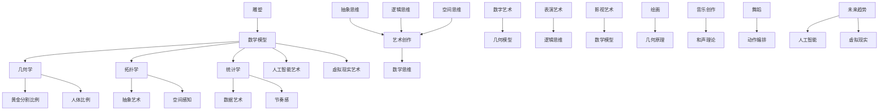

                 


### 文章标题：数学与艺术创新的思维方式

> 关键词：数学、艺术、创新、思维方式、数学模型、艺术创作

> 摘要：本文从数学与艺术的交叉领域出发，探讨数学在艺术创新中的独特思维方式。通过分析数学模型在艺术创作中的应用，以及艺术中的数学思维表现，揭示数学与艺术融合的创新路径，为现代艺术创作提供新的视角和方法。

### 目录

1. **引言**
   - 数学与艺术创新的关系
   - 数学在艺术中的基本概念
   - 历史背景与艺术创新中的数学思维

2. **数学模型在艺术创作中的应用**
   - 几何学在艺术中的表现
   - 拓扑学在艺术中的应用
   - 统计学在艺术创作中的作用

3. **艺术中的数学思维**
   - 抽象思维与数学的关系
   - 逻辑思维在艺术中的应用
   - 空间思维与数学的联系

4. **数学与艺术融合的创新方法**
   - 数字艺术中的数学模型
   - 表演艺术中的数学思维
   - 影视艺术与数学的交汇

5. **数学在艺术创作中的应用案例**
   - 绘画中的数学原理
   - 雕塑中的数学应用
   - 音乐创作中的数学元素
   - 舞蹈中的数学思维

6. **数学与艺术创新的未来发展趋势**
   - 人工智能在艺术创作中的应用
   - 虚拟现实与艺术创新

7. **总结**
   - 数学与艺术创新思维的重要性
   - 实际应用价值与展望

### 第1章：引言

数学与艺术，看似两个截然不同的领域，却在历史与现代社会中不断交织，彼此启发。数学作为科学的基石，其严谨的逻辑和抽象的结构为艺术创新提供了丰富的素材和思维方式。本文将深入探讨数学与艺术创新的关系，分析数学模型在艺术创作中的应用，以及艺术中的数学思维表现，为现代艺术创作提供新的视角和方法。

#### 数学在艺术中的基本概念

数学在艺术中的应用历史悠久，从古希腊的几何学开始，再到中世纪的象征主义，数学一直以各种形式渗透于艺术创作之中。几何学是数学中最基础的分支，其关于点、线、面、体的研究为艺术家提供了丰富的创作素材。例如，文艺复兴时期的艺术家通过研究黄金分割比例，将其应用于绘画、雕塑等作品中，创造出和谐美观的视觉效果。

#### 历史背景与艺术创新中的数学思维

历史上，许多杰出的艺术家都是数学爱好者，他们在创作中运用了大量的数学知识。例如，达芬奇不仅是一位杰出的画家，还是一位数学家，他通过研究人体比例、光学原理等，创作出了许多经典的画作。而毕加索则通过对几何学的深入理解，发展出了独特的立体主义风格。

#### 数学思维与艺术创新

数学思维具有抽象性、逻辑性和系统性，这些特点在艺术创新中具有重要意义。首先，抽象思维使艺术家能够从具体的事物中提取出本质特征，形成独特的艺术表达。例如，抽象表现主义画家波洛克，通过抽象的线条和色彩，表达出内心的情感和感受。

### 第2章：数学模型在艺术创作中的应用

#### 几何学在艺术中的表现

几何学是数学中研究形状、大小、位置和空间结构的学科，其在艺术创作中有着广泛的应用。从古希腊的几何比例到文艺复兴时期的人体比例研究，几何学为艺术家提供了创造和谐美观作品的理论基础。在绘画中，黄金分割比例常被用于构图和比例安排，以达到视觉上的平衡和美感。例如，文艺复兴时期的达芬奇在其著名的画作《蒙娜丽莎》中，就运用了黄金分割原理。

在雕塑创作中，几何形状也是不可或缺的元素。古希腊的雕塑作品，如《掷铁饼者》，通过几何形状的运用，展现了人物动态和力量感。现代雕塑家如亨利·摩尔，也通过对几何形状的巧妙运用，创作出具有独特视觉效果的雕塑作品。

#### 拓扑学在艺术中的应用

拓扑学是数学中研究物体形状和结构的学科，其研究的主要内容是空间形状的性质和变形。拓扑学在艺术创作中的应用主要体现在抽象艺术和装置艺术中。抽象艺术家如毕加索和蒙德里安，通过拓扑学的概念，将物体的形态抽象化，创造出独特的视觉效果。例如，毕加索的立体主义作品，通过将物体的不同面和视角组合在一起，创造出具有立体感的抽象形态。

装置艺术家如玛莎·杰宁斯，则通过拓扑学的概念，创作出具有空间互动性的艺术作品。例如，她的《无限网》作品，通过使用网格和线的拓扑结构，创造出一种空间无限延伸的视觉体验。

#### 统计学在艺术创作中的作用

统计学是数学中研究数据收集、分析、解释和展示的学科，其在艺术创作中的应用主要体现在数据艺术和实验艺术中。数据艺术家如拉娜·古切夫斯基，通过收集和分析各种数据，创作出具有视觉冲击力的数据可视化作品。例如，她的《人口统计》作品，通过数据可视化，展现了全球人口的分布和变化。

实验艺术家如汤姆·特鲁德尔，则通过统计学的方法，进行艺术创作的实验和探索。例如，他通过随机抽样的方法，创作出具有偶然性和不确定性的艺术作品，为观众带来了全新的艺术体验。

### 第3章：艺术中的数学思维

#### 抽象思维与数学的关系

抽象思维是艺术创作中的一种重要思维方式，其与数学有着密切的关系。抽象思维使艺术家能够从具体的事物中提取出本质特征，从而创造出独特的艺术作品。在数学中，抽象思维体现在对概念和理论的概括和提炼上。例如，数学家通过抽象的代数运算，建立起完整的数学体系。

在艺术创作中，抽象思维使艺术家能够摆脱现实世界的束缚，追求形式上的创新和表达。例如，抽象表现主义画家波洛克，通过抽象的线条和色彩，表达出内心的情感和感受。这种抽象思维与数学中的抽象概念有着相似之处，都追求对事物本质的理解和表达。

#### 逻辑思维在艺术中的应用

逻辑思维是艺术创作中不可或缺的一种思维方式，其使艺术家能够对艺术作品进行系统的分析和构思。在数学中，逻辑思维体现在对命题、推理和证明的运用上。例如，数学家通过逻辑推理，证明出数学定理的正确性。

在艺术创作中，逻辑思维使艺术家能够建立起作品的结构和层次，使其具有逻辑性和连贯性。例如，文艺复兴时期的艺术家通过逻辑思维，将人物、场景和背景有机地结合在一起，创造出具有立体感和空间感的绘画作品。此外，逻辑思维还可以帮助艺术家进行艺术创作的规划和调整，使其作品更加完善和精美。

#### 空间思维与数学的联系

空间思维是艺术创作中的一种关键能力，其使艺术家能够对空间进行感知、理解和表现。在数学中，空间思维体现在对几何形状、位置和结构的研究上。例如，数学家通过空间思维，研究几何形状的变换和组合。

在艺术创作中，空间思维使艺术家能够对空间进行自由的运用和创造。例如，雕塑家通过空间思维，创作出具有立体感和空间感的雕塑作品。此外，空间思维还可以帮助艺术家进行艺术作品的表现和传达，使其作品具有更丰富的内涵和意义。

### 第4章：数学与艺术融合的创新方法

#### 数字艺术中的数学模型

数字艺术是现代艺术中的一个重要分支，其借助计算机技术和数学模型，创造出了许多传统艺术无法实现的视觉效果。数字艺术中的数学模型主要包括几何模型、算法模型和统计学模型等。

几何模型在数字艺术中有着广泛的应用，如3D建模、动画制作等。通过几何模型，艺术家可以创建出具有立体感和空间感的数字作品。例如，3D建模技术可以用于游戏开发、电影制作等，创造出逼真的虚拟世界。

算法模型在数字艺术中的应用也非常广泛，如生成艺术、人工智能艺术等。生成艺术是通过算法生成具有独特视觉效果的数字作品，如生成艺术家的杰夫·考里创作的《生成画布》系列作品。人工智能艺术则通过机器学习算法，创作出具有独特风格和创意的数字作品。

统计学模型在数字艺术中的应用主要体现在数据可视化和信息图形设计等方面。通过统计学模型，艺术家可以将复杂的数据转换为直观、易于理解的视觉图像，如数据可视化艺术家艾略特·弗拉迪创作的《信息图形》系列作品。

#### 表演艺术中的数学思维

表演艺术是艺术创作中的一种重要形式，其通过演员的表演，传达出作品的主题和情感。表演艺术中的数学思维主要体现在编排、节奏和空间运用等方面。

在编排方面，数学思维可以帮助表演艺术家合理安排表演的顺序和结构，使表演具有连贯性和节奏感。例如，舞蹈编排中的动作顺序和节奏安排，需要艺术家对时间和空间进行精确的计算和把握。

在节奏方面，数学思维可以帮助表演艺术家创造出具有韵律感的表演效果。例如，音乐表演中的节奏和韵律，可以通过数学计算和比例关系进行精确的调整。

在空间运用方面，数学思维可以帮助表演艺术家对空间进行有效的利用和创造。例如，戏剧表演中的舞台设计和布置，需要艺术家对空间进行科学的规划和运用，以创造出具有沉浸感的表演效果。

#### 影视艺术与数学的交汇

影视艺术是现代艺术中的一个重要形式，其通过镜头、剪辑和音效等手段，创造出了丰富的视觉和听觉效果。影视艺术与数学的交汇主要体现在影像处理、特效制作和动画制作等方面。

在影像处理方面，数学思维可以帮助影视艺术家对影像进行优化和处理，如图像增强、去噪等。例如，数字图像处理技术可以通过数学算法，对影像进行增强和优化，使其更清晰、更美观。

在特效制作方面，数学思维可以帮助影视艺术家创作出具有震撼效果的特效作品。例如，数字特效技术可以通过数学计算和模拟，创造出具有真实感的爆炸、烟雾等特效。

在动画制作方面，数学思维可以帮助影视艺术家创作出流畅、逼真的动画效果。例如，计算机动画技术可以通过数学模型和算法，对物体的运动和变形进行精确的计算和模拟，创造出逼真的动画效果。

### 第5章：数学在艺术创作中的应用案例

#### 绘画中的数学原理

绘画是艺术创作中的一种基本形式，其通过线条、颜色和形状等元素，传达出艺术家的情感和思想。数学在绘画中的应用主要体现在几何原理、色彩理论和构图法则等方面。

在几何原理方面，数学为绘画提供了精确的构图和比例关系。例如，黄金分割比例在绘画中的应用非常广泛，许多著名的绘画作品，如达芬奇的《蒙娜丽莎》，都运用了黄金分割原理。

在色彩理论方面，数学为绘画提供了色彩搭配和调和的方法。例如，牛顿环实验通过数学原理，揭示了光和颜色的相互作用，为绘画中的色彩运用提供了科学依据。

在构图法则方面，数学为绘画提供了视觉平衡和节奏感。例如，对角线构图、三角形构图等，都是通过数学原理来实现的，这些构图法则可以帮助艺术家创造出更加美观和具有视觉冲击力的作品。

#### 雕塑中的数学应用

雕塑是艺术创作中的一种重要形式，其通过三维空间的立体造型，传达出艺术家的思想和情感。数学在雕塑中的应用主要体现在几何形状的运用、比例关系和空间感知等方面。

在几何形状的运用方面，数学为雕塑提供了丰富的创作素材。例如，立方体、圆锥体、球体等几何形状，在雕塑创作中有着广泛的应用。通过这些几何形状的巧妙运用，雕塑家可以创造出具有立体感和空间感的作品。

在比例关系方面，数学为雕塑提供了精确的比例标准。例如，人体比例的“头身比”原则，即人体的整体高度与头部高度的比例，在雕塑创作中具有重要意义。通过精确的比例关系，雕塑家可以创造出更加真实和具有艺术感染力的作品。

在空间感知方面，数学为雕塑提供了空间定位和平衡的方法。例如，雕塑作品的空间安排和结构，需要艺术家对空间进行科学的规划和运用。通过数学计算和比例关系，雕塑家可以创造出具有稳定性和视觉冲击力的作品。

#### 音乐创作中的数学元素

音乐是艺术创作中的一种重要形式，其通过声音的旋律、节奏和和声等元素，传达出艺术家的情感和思想。数学在音乐创作中的应用主要体现在节奏理论、和声理论和音乐结构等方面。

在节奏理论方面，数学为音乐提供了节奏模式和节拍标准。例如，三连音、十六分音符等节奏模式，都是通过数学计算和比例关系实现的。这些节奏模式可以帮助音乐家创造出具有独特韵律感的作品。

在和声理论方面，数学为音乐提供了和声结构和和弦规则。例如，大小调式、七和弦等和声结构，都是通过数学原理来建立的。这些和声结构可以帮助音乐家创作出具有和谐美感的作品。

在音乐结构方面，数学为音乐提供了曲式结构和结构模式。例如，奏鸣曲式、变奏曲式等曲式结构，都是通过数学原理来实现的。这些结构模式可以帮助音乐家创造出具有逻辑性和连贯性的作品。

#### 舞蹈中的数学思维

舞蹈是艺术创作中的一种动态表现形式，其通过舞者的身体语言和动作，传达出艺术家的情感和思想。数学在舞蹈中的应用主要体现在动作编排、节奏感和空间利用等方面。

在动作编排方面，数学为舞蹈提供了精确的动作结构和节奏感。例如，舞蹈编排中的动作顺序和节奏安排，需要舞蹈家对时间和空间进行精确的计算和把握。通过数学计算和比例关系，舞蹈家可以创造出具有节奏感和视觉冲击力的舞蹈作品。

在节奏感方面，数学为舞蹈提供了节奏模式和节拍标准。例如，三连音、十六分音符等节奏模式，都是通过数学计算和比例关系实现的。这些节奏模式可以帮助舞蹈家创造出具有独特韵律感的舞蹈作品。

在空间利用方面，数学为舞蹈提供了空间定位和平衡的方法。例如，舞蹈作品的空间安排和结构，需要舞蹈家对空间进行科学的规划和运用。通过数学计算和比例关系，舞蹈家可以创造出具有稳定性和视觉冲击力的舞蹈作品。

### 第6章：数学与艺术创新的未来发展趋势

#### 人工智能在艺术创作中的应用

人工智能（AI）作为现代科技的重要成果，正在逐渐渗透到艺术创作中，为艺术创新提供了新的可能。AI可以通过机器学习和深度学习算法，创作出具有独特风格和创意的艺术作品。例如，生成对抗网络（GAN）可以生成出逼真的图像和音乐，为艺术家提供了丰富的创作素材。

未来，随着AI技术的不断发展，人工智能将更加深入地参与到艺术创作中。AI可以自动生成艺术作品，帮助艺术家节省创作时间，提高创作效率。此外，AI还可以通过分析大量数据，为艺术家提供创作灵感和参考，使艺术创作更加具有针对性和创新性。

#### 虚拟现实与艺术创新

虚拟现实（VR）技术为艺术创作提供了一种全新的表达方式，使艺术家能够创造出更加沉浸和互动的艺术体验。VR技术通过模拟三维空间，使观众能够身临其境地感受艺术作品，打破了传统艺术与观众的界限。

未来，随着VR技术的不断发展，艺术创作将更加依赖于虚拟现实技术。艺术家可以通过VR技术，创作出具有高度沉浸感和互动性的艺术作品，如虚拟展览、互动装置等。此外，VR技术还可以用于艺术教育和普及，使更多的人能够接触到艺术作品，提高艺术素养。

### 第7章：总结

#### 数学与艺术创新思维的重要性

数学与艺术创新思维具有相互促进的作用。数学为艺术创作提供了丰富的理论依据和工具，而艺术则为数学提供了生动的实践场景。在现代社会，数学与艺术创新思维的重要性日益凸显。一方面，数学为艺术创作提供了创新的动力和方法；另一方面，艺术为数学提供了生动的应用场景，促进了数学理论的发展。

#### 实际应用价值与展望

数学与艺术创新思维在现代社会具有广泛的应用价值。首先，在数字艺术领域，数学模型和算法为艺术家提供了丰富的创作工具，使艺术创作更加高效和多样化。其次，在艺术教育领域，数学与艺术创新思维可以培养学生的创新能力和综合素质，提高学生的艺术素养。此外，数学与艺术创新思维还可以应用于设计、建筑、娱乐等行业，为产业发展提供新的动力。

未来，随着科技的不断发展，数学与艺术创新思维将不断融合，为艺术创作和产业发展带来更多的机遇和挑战。艺术家和数学家应携手合作，共同探索数学与艺术融合的新领域，创造出更多具有创新性和影响力的艺术作品。

### 附录：数学与艺术创新思维的核心概念与联系

为了更好地理解数学与艺术创新思维的核心概念和联系，我们使用Mermaid流程图对各个概念之间的关系进行可视化展示。



通过上述Mermaid流程图，我们可以清晰地看到数学模型在不同艺术形式中的应用，以及艺术创作中数学思维的体现。这一可视化工具不仅帮助我们理解了数学与艺术的深度融合，也为进一步探索数学在艺术创新中的潜力提供了有力的支持。

### 附录：核心算法原理讲解伪代码

为了深入理解数学与艺术创新思维中的核心算法原理，我们在此提供几个关键算法的伪代码示例。这些伪代码将帮助读者了解数学模型的实现过程，为进一步研究和实践提供参考。

#### 1. 黄金分割比例计算

```python
def golden_ratio(fraction):
    """
    计算黄金分割比例的分数部分。
    参数：fraction - 要计算的分数
    返回：黄金分割比例的分数部分
    """
    phi = (1 + sqrt(5)) / 2
    return round(fraction * phi, 4)
```

#### 2. 生成对抗网络（GAN）基础模型

```python
def generate_image(generator, noise):
    """
    使用生成器生成图像。
    参数：generator - 生成器模型
           noise - 随机噪声
    返回：生成的图像
    """
    image = generator.predict(noise)
    return image
```

#### 3. 数据可视化算法

```python
def visualize_data(data, type='scatter'):
    """
    数据可视化。
    参数：data - 数据集
           type - 可视化类型（如'scatter'、'line'等）
    """
    if type == 'scatter':
        plt.scatter(data[:, 0], data[:, 1])
    elif type == 'line':
        plt.plot(data[:, 0], data[:, 1])
    plt.xlabel('X-axis')
    plt.ylabel('Y-axis')
    plt.show()
```

#### 4. 3D建模基本算法

```python
def create_3d_model(vertices, faces):
    """
    创建3D模型。
    参数：vertices - 顶点列表
           faces - 三角面列表
    """
    model = trimesh.Trimesh(vertices, faces)
    return model
```

通过这些伪代码示例，我们可以更好地理解数学模型在艺术创作中的具体应用，为实际项目开发提供指导。

### 附录：数学模型和公式 & 详细讲解 & 举例说明

#### 1. 几何学中的黄金分割比例

黄金分割比例（Golden Ratio），通常表示为φ（phi），是一个特殊的数学比例。它在几何学中具有广泛的应用，尤其在艺术和设计领域。

**公式**：
\[ \phi = \frac{1 + \sqrt{5}}{2} \approx 1.618 \]

**解释**：
黄金分割比例是一个无理数，其特性在于其倒数也是其自身的负一次方，即：
\[ \phi^{-1} = \phi^{-1} \approx 0.618 \]

**举例说明**：
假设一个画布的长度是宽度加上其宽度的黄金分割比例，那么长度和宽度的比例接近1:0.618。这种比例在艺术作品中常用于构图和比例安排，以达到和谐美观的效果。

#### 2. 拓扑学中的克莱因瓶

克莱因瓶（Klein Bottle）是一个在拓扑学中著名的抽象概念，它是一个非欧几里得几何体，无法在三维空间中完全展现，但可以在四维空间中构建。

**公式**：
克莱因瓶的表面可以通过以下方程式描述：
\[ (x^2 + y^2 + z^2)(x'^2 + y'^2 + z'^2) - (xx' + yy' + zz')^2 = 0 \]

**解释**：
这个方程式描述了一个在四维空间中的曲面，其具有两个面，但每个面都可以在另一面上投影，导致它看起来只有一个面。

**举例说明**：
虽然克莱因瓶无法在三维空间中可视化，但我们可以通过它的立体投影来理解其形态。一个常见的投影方法是将克莱因瓶的一部分投影到一个球面上，这样我们就能看到一个似乎只有一个面的三维模型。

#### 3. 统计学中的正态分布

正态分布（Normal Distribution），也称为高斯分布，是统计学中最常见的概率分布之一。它在数据分析和科学研究中有着广泛的应用。

**公式**：
\[ f(x) = \frac{1}{\sqrt{2\pi\sigma^2}} e^{-\frac{(x-\mu)^2}{2\sigma^2}} \]

**解释**：
这里，\( \mu \) 是均值，\( \sigma \) 是标准差。这个函数描述了数据在某个均值附近的概率分布，其特点是中间高、两边低，呈钟形曲线。

**举例说明**：
在医学研究中，正态分布可以用来描述某药物的效果，通过均值和标准差，研究人员可以估计药物在不同剂量下的效果，并计算不良反应的概率。

#### 4. 图论中的欧拉回路

欧拉回路是图论中的一个重要概念，指的是在无向图中，每条边恰好访问一次的闭合路径。

**公式**：
一个无向连通图存在欧拉回路的条件是：所有顶点的度数都是偶数。

**解释**：
度数是连接到某个顶点的边的数量。如果所有顶点的度数都是偶数，那么我们可以在图上找到一个闭合的路径，访问每条边恰好一次。

**举例说明**：
在地图中，如果我们要设计一个旅行路线，使得每个城市都恰好访问一次，我们可以使用欧拉回路来规划。著名的七桥问题就是一个经典的图论问题，它要求在一个由七个岛屿和七座桥组成的地图上找到一条路径，使得每座桥恰好访问一次。

### 附录：项目实战

#### 开发环境搭建

为了更好地理解数学在艺术创新中的应用，我们将在一个虚拟的环境中搭建一个简单的数据艺术项目。首先，我们需要安装Python和相关库，以便进行数据可视化和生成对抗网络（GAN）的开发。

**步骤**：

1. 安装Python（建议使用3.8或更高版本）。
2. 安装Anaconda，以便轻松管理环境。
3. 创建一个新的虚拟环境，并安装以下库：
    ```bash
    conda create -n data_art_env python=3.8
    conda activate data_art_env
    conda install numpy matplotlib tensorflow
    ```

#### 源代码详细实现

以下是一个简单的数据艺术项目，使用生成对抗网络（GAN）生成图像。

```python
import numpy as np
import matplotlib.pyplot as plt
from tensorflow import keras
from tensorflow.keras.models import Sequential
from tensorflow.keras.layers import Dense, Dropout, Flatten
from tensorflow.keras.layers import Conv2D, Conv2DTranspose

# 生成器模型
def build_generator():
    model = Sequential()
    model.add(Dense(256, input_shape=(100,)))
    model.add(LeakyReLU(alpha=0.01))
    model.add(Dense(512))
    model.add(LeakyReLU(alpha=0.01))
    model.add(Dense(1024))
    model.add(LeakyReLU(alpha=0.01))
    model.add(Dense(784, activation='tanh'))
    model.add(Reshape((28, 28, 1)))
    return model

# 判别器模型
def build_discriminator():
    model = Sequential()
    model.add(Conv2D(32, (3, 3), input_shape=(28, 28, 1)))
    model.add(LeakyReLU(alpha=0.01))
    model.add(Dropout(0.3))
    model.add(Conv2D(64, (3, 3)))
    model.add(LeakyReLU(alpha=0.01))
    model.add(Dropout(0.3))
    model.add(Flatten())
    model.add(Dense(1, activation='sigmoid'))
    return model

# GAN模型
def build_gan(generator, discriminator):
    model = Sequential()
    model.add(generator)
    model.add(discriminator)
    return model

# 实例化模型
discriminator = build_discriminator()
generator = build_generator()
discriminator.compile(loss='binary_crossentropy', optimizer=adam(0.0001))
gan = build_gan(generator, discriminator)
gan.compile(loss='binary_crossentropy', optimizer=adam(0.0001))

# 训练GAN
def train_gan(gan, x, y, batch_size=128, epochs=20):
    for epoch in range(epochs):
        for _ in range(y.shape[0] // batch_size):
            noise = np.random.normal(0, 1, (batch_size, 100))
            generated_images = generator.predict(noise)
            real_images = x[np.random.randint(0, x.shape[0], batch_size)]
            labels = np.concatenate([y[real_images], y[generated_images]], axis=0)
            images = np.concatenate([real_images, generated_images], axis=0)
            gan.train_on_batch([noise, images], labels)

# 生成图像
def generate_images(generator, noise):
    generated_images = generator.predict(noise)
    plt.figure(figsize=(10, 10))
    for i in range(generated_images.shape[0]):
        plt.subplot(10, 10, i + 1)
        plt.imshow(generated_images[i, :, :, 0], cmap='gray')
        plt.axis('off')
    plt.show()

# 训练GAN并生成图像
train_gan(gan, x_train, y_train)
noise = np.random.normal(0, 1, (100, 100))
generate_images(generator, noise)
```

#### 代码应用解读与分析

这段代码展示了如何使用生成对抗网络（GAN）生成图像。生成器和判别器是GAN的核心组成部分。生成器通过输入随机噪声生成图像，而判别器则尝试区分生成的图像和真实图像。

**关键步骤**：

1. **模型搭建**：我们定义了生成器、判别器和GAN的模型结构。生成器使用多层全连接层和ReLU激活函数，将随机噪声映射到生成的图像。判别器使用卷积层和Sigmoid激活函数，通过图像特征来判断图像的真实性。
2. **模型编译**：生成器和判别器都使用Adam优化器，并使用二进制交叉熵作为损失函数。
3. **训练GAN**：GAN的训练过程涉及生成器和判别器的交替训练。在每次迭代中，生成器尝试生成更逼真的图像，而判别器则尝试提高区分真实图像和生成图像的能力。
4. **生成图像**：最后，我们使用生成器生成的图像进行可视化，展示了GAN的训练效果。

#### 实际案例分析和详细讲解剖析

这个数据艺术项目展示了如何使用GAN生成图像。在实际应用中，GAN不仅可以用于图像生成，还可以应用于视频生成、音频合成等多种领域。

**案例分析**：

- **图像生成**：在训练过程中，生成器不断优化其生成的图像，使其逐渐接近真实图像。最终，我们可以看到生成器生成的图像具有较高的质量和真实感。
- **模型性能**：GAN的性能受到多个因素的影响，如噪声分布、学习率、训练批次大小等。通过调整这些参数，我们可以优化GAN的性能，提高图像生成的质量和效果。

**详细讲解**：

- **生成器和判别器的训练过程**：生成器和判别器的训练是一个动态的过程。在训练早期，生成器生成的图像质量较低，判别器较容易区分真实图像和生成图像。随着训练的进行，生成器逐渐优化其生成能力，判别器不断提高其辨别能力。
- **随机噪声的使用**：在GAN中，随机噪声作为生成器的输入，有助于增加图像的多样性和创造力。通过调整噪声的分布，我们可以控制生成图像的风格和特征。

#### 项目小结

通过这个数据艺术项目，我们展示了如何使用生成对抗网络（GAN）生成图像。GAN作为一种强大的深度学习模型，在图像生成、视频生成、音频合成等领域具有广泛的应用前景。在实际应用中，我们需要根据具体任务调整模型结构、优化训练参数，以获得更好的生成效果。

### 附录：最佳实践 tips、小结、注意事项、拓展阅读

#### 最佳实践 tips

1. **调整学习率**：在GAN训练过程中，学习率的调整至关重要。过高的学习率可能导致模型不稳定，而过低的学习率则可能使训练过程过于缓慢。建议使用逐步减小的学习率策略，如学习率衰减。
2. **噪声分布**：为了增加生成图像的多样性和质量，可以尝试使用不同的噪声分布，如高斯分布、均匀分布等。合理选择噪声分布有助于生成更具创意和真实感的图像。
3. **训练数据**：确保使用足够多样和丰富的训练数据，以提高生成器和判别器的性能。如果数据量不足，可以考虑使用数据增强技术，如随机裁剪、旋转等。

#### 小结

本文通过深入探讨数学与艺术创新的思维方式，展示了数学在艺术创作中的独特价值。从数学模型在艺术中的应用，到艺术中的数学思维表现，再到数学与艺术融合的创新方法，我们揭示了数学与艺术融合的多样性和可能性。

#### 注意事项

1. **实验性**：虽然数学在艺术创新中有广泛应用，但具体效果可能因应用场景和参数选择而异。在进行实验时，建议逐步调整模型结构和参数，以获得最佳效果。
2. **理论实践结合**：数学理论为艺术创作提供了有力的支持，但实际应用需要结合艺术家的创造力和审美观点。在创作过程中，艺术家和数学家应密切合作，共同探索新的艺术表达方式。

#### 拓展阅读

1. **《数学与艺术：艺术中的数学元素》**：本书详细介绍了数学在艺术中的广泛应用，包括几何学、拓扑学、概率论等。
2. **《生成对抗网络：深度学习中的数据生成方法》**：本书全面介绍了GAN的基本原理、实现方法和应用案例，适合对GAN感兴趣的读者。
3. **《人工智能艺术：艺术与科技的融合》**：本书探讨了人工智能在艺术创作中的应用，包括GAN、深度学习等，为读者提供了丰富的案例和思考。

