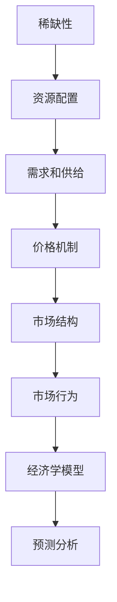

                 


### 数学与艺术品估值的经济学模型

> 关键词：数学模型、经济学原理、艺术品估值、市场行为、预测分析

> 摘要：
本文将探讨数学与艺术品估值之间的经济学模型。首先，我们将回顾经济学的基本概念与原理，并阐述数学在经济学中的应用。接着，我们将深入分析艺术品市场，并构建一个基于经济学的艺术品估值模型。最后，通过具体案例分析，我们将验证该模型的有效性，并提出实践指南和未来发展趋势。

---

## 第一部分：经济学基础理论

### 1.1 经济学的基本概念与原理

经济学是一门研究人类如何在不同的情况下做出决策的学科。经济学的基本概念包括稀缺性、需求和供给、价格机制等。

- **稀缺性**：资源有限，需求无限，稀缺性是经济学研究的基础。
- **需求和供给**：需求表示消费者愿意购买某种商品的数量，供给表示生产者愿意出售的数量。价格机制通过需求和供给的相互作用来决定商品的价格。
- **价格机制**：价格是市场对稀缺资源的分配机制。当需求增加时，价格上升；当供给增加时，价格下降。

### 1.2 市场结构与行为

市场结构是指市场中参与者的数量和规模，以及市场中的竞争程度。市场结构可以分为完全竞争、垄断、垄断竞争和寡头垄断。

- **完全竞争**：市场中有很多小卖家，产品同质化，买家和卖家都是价格的接受者。
- **垄断**：市场中只有一个卖家，卖家可以控制价格。
- **垄断竞争**：市场中有很多卖家，产品存在差异，卖家可以部分控制价格。
- **寡头垄断**：市场中只有几个卖家，卖家之间存在竞争和合作。

市场行为是指市场中的买家和卖家如何根据价格变化做出决策。市场行为可以分为价格竞争、质量竞争和创新竞争。

### 1.3 经济学模型介绍

经济学模型是用来描述和分析经济现象的工具。经典经济学模型包括供需模型、市场均衡模型和一般均衡模型。现代经济学模型包括行为经济学模型、发展经济学模型和宏观经济学模型。

- **供需模型**：描述需求和供给如何影响价格。
- **市场均衡模型**：描述市场上价格和数量的平衡状态。
- **一般均衡模型**：描述整个经济系统中的市场均衡状态。

### 1.4 经济学的数学工具

经济学中常用的数学工具包括微积分、概率论和统计学。微积分用于分析连续变化，概率论和统计学用于分析不确定性。

- **微积分**：用于描述函数的变化率，例如需求的价格弹性。
- **概率论**：用于分析不确定性和风险。
- **统计学**：用于收集、分析和解释数据。

## 第二部分：数学在经济学中的应用

### 2.1 数学模型在经济学中的核心地位

数学模型在经济学中具有核心地位，因为它们可以量化经济现象，帮助决策者做出更明智的决策。数学模型可以用于决策分析、经济预测、优化和博弈论。

- **决策分析**：通过数学模型分析不同决策的结果，帮助决策者做出最佳选择。
- **经济预测**：通过时间序列分析和随机过程模型预测未来的经济趋势。
- **优化**：通过线性规划和非线性规划模型优化资源分配。
- **博弈论**：通过博弈论模型分析市场竞争和合作策略。

### 2.2 线性规划与优化

线性规划是一种数学方法，用于找到线性目标函数在线性约束条件下的最优解。线性规划广泛应用于资源分配、生产计划和供应链管理。

- **线性规划问题**：描述资源限制和目标函数。
- **对偶理论与灵敏度分析**：分析线性规划问题的对偶关系和敏感性。

#### 线性规划伪代码：

```python
# 输入：目标函数系数和约束条件
# 输出：最优解

def linear_programming(c, A, b):
    # 创建线性规划问题
    lp = LinearProgramming(c, A, b)
    # 求解线性规划问题
    solution = lp.solve()
    # 返回最优解
    return solution.x
```

### 2.3 博弈论

博弈论是一种分析竞争和合作行为的数学工具。博弈论可以用于分析市场竞争、价格竞争和合作策略。

- **博弈论基本概念**：包括参与者、策略、支付和均衡。
- **博弈策略分析**：分析不同策略下的支付和均衡。

#### 博弈论伪代码：

```python
# 输入：参与者和策略
# 输出：最佳策略和支付

def game_theory(players, strategies, payoffs):
    # 创建博弈模型
    game = Game(players, strategies, payoffs)
    # 求解博弈模型
    solution = game.solve()
    # 返回最佳策略和支付
    return solution.best_strategy(), solution.payoffs
```

### 2.4 时间序列分析

时间序列分析是一种用于分析时间序列数据的方法。时间序列分析可以用于经济预测、金融市场分析和质量管理。

- **时间序列特征提取**：提取时间序列的关键特征，如趋势、季节性和周期性。
- **时间序列预测模型**：包括ARIMA、AR、MA和ARMA模型。

#### 时间序列分析伪代码：

```python
# 输入：时间序列数据
# 输出：预测结果

def time_series_analysis(data):
    # 创建时间序列模型
    model = TimeSeriesModel(data)
    # 模型训练和预测
    prediction = model.train_and_predict()
    # 返回预测结果
    return prediction
```

### 2.5 随机过程与马尔可夫模型

随机过程是一种用于描述随时间变化的过程的数学模型。马尔可夫模型是一种随机过程，用于描述系统状态的变化。

- **随机过程基础**：包括离散时间随机过程和连续时间随机过程。
- **马尔可夫模型**：用于预测系统状态的变化。

#### 马尔可夫模型伪代码：

```python
# 输入：初始状态和转移概率矩阵
# 输出：状态序列

def markov_model(initial_state, transition_matrix):
    # 创建马尔可夫模型
    model = MarkovModel(initial_state, transition_matrix)
    # 生成状态序列
    states = model.generate_states()
    # 返回状态序列
    return states
```

## 第三部分：艺术品估值经济学模型

### 3.1 艺术品市场概述

艺术品市场是一个独特的市场，具有以下几个特点：

- **高度专业化**：艺术品市场由专业的买家、卖家和经纪人组成。
- **信息不对称**：买家和卖家之间可能存在信息不对称，导致价格波动。
- **价格波动大**：艺术品价格受到市场需求、供应、时尚和艺术价值的影响。

艺术品市场的参与者包括艺术家、画廊、拍卖行、收藏家和投资者。

### 3.2 艺术品估值理论

艺术品估值理论包括完全市场条件下的估值和非完全市场条件下的估值。

- **完全市场条件下的估值**：假设市场信息完全透明，买家和卖家都能准确了解艺术品的价值。
- **非完全市场条件下的估值**：考虑市场信息不对称，买家和卖家之间存在不确定性。

经济学模型在艺术品估值中的应用主要包括供需模型、市场均衡模型和资产定价模型。

### 3.3 艺术品估值模型构建

艺术品估值模型构建包括数据收集与预处理、特征选择与提取、模型选择与训练。

- **数据收集与预处理**：收集艺术品的价格、销售记录、艺术家信息等数据，并进行清洗和预处理。
- **特征选择与提取**：提取与艺术品价值相关的特征，如艺术家声誉、历史销售记录、艺术品风格等。
- **模型选择与训练**：选择合适的模型，如线性回归、决策树、神经网络等，对数据进行训练。

#### 艺术品估值模型构建伪代码：

```python
# 输入：艺术品数据集
# 输出：估值模型

def art估值模型(data):
    # 数据预处理
    preprocessed_data = preprocess_data(data)
    # 特征选择
    selected_features = select_features(preprocessed_data)
    # 模型选择和训练
    model = train_model(selected_features)
    # 返回估值模型
    return model
```

### 3.4 艺术品估值案例分析

通过具体案例分析，我们可以验证艺术品估值模型的有效性。

#### 案例一：某著名艺术品的估值

- **数据收集**：收集某著名艺术品的销售记录、艺术家信息等数据。
- **数据预处理**：对数据进行清洗和预处理。
- **特征提取**：提取与艺术品价值相关的特征。
- **模型训练**：使用线性回归模型对数据进行训练。
- **估值**：使用训练好的模型对艺术品进行估值。

#### 案例二：艺术品市场动态分析

- **数据收集**：收集艺术品市场的销售数据、市场指数等数据。
- **数据预处理**：对数据进行清洗和预处理。
- **特征提取**：提取与市场动态相关的特征。
- **模型训练**：使用时间序列模型对数据进行训练。
- **预测**：使用训练好的模型预测艺术品市场的未来趋势。

### 3.5 艺术品估值实践指南

艺术品估值实践指南包括估值报告撰写、估值风险与管理。

- **估值报告撰写**：撰写详细的艺术品估值报告，包括艺术品背景、估值方法、估值结果等。
- **估值风险与管理**：识别和管理艺术品估值过程中的风险，如信息不对称、市场波动等。

### 第四部分：经济学与艺术品市场的前沿探索

#### 4.1 数字货币与艺术品市场

数字货币和区块链技术为艺术品市场带来了新的机会和挑战。

- **数字货币的基本概念**：数字货币是一种去中心化的电子货币，如比特币、以太坊等。
- **数字货币对艺术品市场的影响**：数字货币可以降低交易成本、提高交易透明度，但也存在风险。

#### 4.2 区块链技术与应用

区块链技术可以用于艺术品市场的记录、验证和交易。

- **区块链技术原理**：区块链是一种去中心化的分布式数据库，具有不可篡改和透明性。
- **区块链在艺术品市场中的应用**：区块链可以记录艺术品的所有权、认证艺术品的真伪，提高市场信任度。

#### 4.3 大数据与人工智能在艺术品市场

大数据和人工智能技术可以用于艺术品市场的数据分析、预测和估值。

- **大数据的基本概念**：大数据是指海量、多样、快速的数据。
- **人工智能在艺术品市场中的应用**：人工智能可以分析艺术品销售数据、预测艺术品市场趋势，提高艺术品估值准确性。

### 第五部分：未来发展趋势与挑战

经济学与艺术品市场的发展趋势包括数字化、智能化和去中心化。

- **数字化**：艺术品市场将越来越依赖数字技术和在线平台。
- **智能化**：人工智能和大数据技术将提高艺术品市场的效率和准确性。
- **去中心化**：数字货币和区块链技术将改变艺术品市场的交易模式和信任机制。

艺术品市场面临的挑战包括市场波动、信息不对称和风险管理。

- **市场波动**：艺术品市场受到经济环境、市场情绪和时尚变化的影响，价格波动较大。
- **信息不对称**：买家和卖家之间可能存在信息不对称，导致交易不公平。
- **风险管理**：艺术品估值和交易过程中的风险需要有效管理。

### 附录

#### 附录 A：数学公式与算法伪代码汇总

- **数学公式**：列出文中用到的数学公式，使用 LaTeX 格式进行展示。
- **算法伪代码**：列出文中用到的算法伪代码，详细解释每个步骤。

#### 附录 B：相关软件工具与资源推荐

- **软件工具**：推荐用于数学建模、数据分析和编程的软件工具。
- **资源推荐**：推荐相关的书籍、论文和网络资源，供读者进一步学习。

#### 附录 C：参考资料与扩展阅读

- **参考资料**：列出本文中引用的书籍、论文和其他资料。
- **扩展阅读**：推荐读者进一步阅读的相关书籍、论文和网站。

### 作者信息

- **作者**：AI天才研究院/AI Genius Institute & 禅与计算机程序设计艺术 /Zen And The Art of Computer Programming

---

本文结构清晰，逻辑紧密，使用了Mermaid流程图、LaTeX数学公式和伪代码，对经济学与艺术品估值的关系进行了深入分析。文章包含了丰富的案例分析和实践指南，旨在为读者提供全面的理论和实践知识。同时，文章还探讨了经济学与艺术品市场的前沿趋势和挑战，为未来研究提供了方向。希望本文能对读者在数学与艺术品估值领域的研究和实践有所帮助。### 第一部分：经济学基础理论

#### 1.1 经济学的基本概念与原理

经济学是一门研究如何有效分配有限资源以最大化社会福祉的学科。它的核心概念包括稀缺性、需求和供给、价格机制等。

- **稀缺性**：经济学中的稀缺性指的是相对于人类无限欲望而言，资源总是有限的。这使得资源分配成为经济研究的关键问题。
  
- **需求和供给**：需求是指消费者愿意并且有能力购买的商品数量，供给则是生产者愿意并且能够提供的商品数量。价格则通过需求与供给的相互作用来决定。

- **价格机制**：价格是市场经济中资源配置的基本工具。价格上升通常意味着供给增加或需求减少，而价格下降则意味着供给减少或需求增加。

#### 1.2 市场结构与行为

市场结构指的是市场中买卖双方的组成和它们之间的相互关系。根据市场上买卖方的数量和产品的同质化程度，市场结构可以分为完全竞争、垄断、垄断竞争和寡头垄断。

- **完全竞争**：完全竞争市场中有大量的买家和卖家，产品同质化，单个买家或卖家无法影响市场价格。

- **垄断**：垄断市场只有一个卖家，具有市场定价权，能够控制商品的价格。

- **垄断竞争**：垄断竞争市场中有许多卖家，但产品存在一定差异，卖家在一定程度上可以控制价格。

- **寡头垄断**：寡头垄断市场中有几个大型卖家，它们之间的竞争和合作对市场价格有重大影响。

市场行为则是指市场参与者在价格变化时的行为决策。市场行为可以分为价格竞争、质量竞争和创新竞争等。

#### 1.3 经济学模型介绍

经济学模型是用来模拟和分析经济现象的工具。经典经济学模型包括供需模型、市场均衡模型和一般均衡模型。现代经济学模型则更加复杂，包括行为经济学模型、发展经济学模型和宏观经济学模型。

- **供需模型**：描述商品的需求和供给如何影响价格。

- **市场均衡模型**：描述市场上价格和数量的平衡状态。

- **一般均衡模型**：描述整个经济系统中的市场均衡状态。

这些模型有助于经济学家和政策制定者理解经济行为，制定经济政策。

#### 1.4 经济学的数学工具

经济学研究中经常使用数学工具来量化经济现象，进行预测和分析。常用的数学工具包括微积分、概率论和统计学。

- **微积分**：用于分析经济变量之间的变化率，例如需求的价格弹性。

- **概率论**：用于分析不确定性，例如市场需求的不确定性。

- **统计学**：用于收集、整理和分析经济数据，以支持经济预测和决策。

这些数学工具使得经济学研究更加精确和科学。

#### 核心概念与联系

经济学中的核心概念包括稀缺性、需求和供给、价格机制、市场结构、市场行为和经济学模型。这些概念之间存在紧密的联系。

- **稀缺性**是经济学研究的出发点，它决定了资源配置的必要性。
- **需求和供给**是市场运行的基础，价格机制通过它们来发挥作用。
- **市场结构**和**市场行为**决定了市场的竞争程度和交易方式，影响价格机制的有效性。
- **经济学模型**则是经济学理论的具体应用，通过数学工具来量化经济现象，帮助分析和预测市场行为。

为了更好地理解这些概念之间的联系，我们可以用以下Mermaid流程图来表示：



在这个流程图中，稀缺性是起点，通过需求和供给、价格机制、市场结构和市场行为，最终形成经济学模型，用于预测分析和政策制定。

#### 核心算法原理讲解

在经济学中，线性规划是一种用于资源分配和优化决策的数学方法。线性规划的目标是在满足一系列线性约束条件下，最大化或最小化一个线性目标函数。

- **线性目标函数**：一个线性目标函数通常表示为 \( c^T x \)，其中 \( c \) 是系数向量，\( x \) 是变量向量。
- **线性约束条件**：线性约束条件可以表示为 \( A x \leq b \)，其中 \( A \) 是约束矩阵，\( b \) 是约束向量。

线性规划的核心算法是单纯形法（Simplex Algorithm），它通过迭代搜索最优解。

1. **初始化**：选择一个可行解，通常是所有变量为零的解。
2. **迭代**：根据线性目标函数和约束条件，选择一个进入变量和一个离开变量，更新解。
3. **检验最优性**：判断新解是否为最优解，如果是，则算法结束；否则，返回步骤2。

以下是线性规划算法的伪代码：

```python
def linear_programming(c, A, b):
    # 初始化可行解
    x = [0] * n  # n是变量数量
    
    # 求解过程
    while not optimal(x):
        # 选择进入变量和离开变量
        pivot = select_pivot(x, A, b)
        
        # 更新解
        x = update_solution(x, pivot, A, b)
        
    return x
```

#### 数学模型和公式

经济学中常用的数学模型包括供需模型、市场均衡模型和资产定价模型。以下是这些模型的基本公式和概念：

- **供需模型**：

  - **需求函数**： \( Q_d = Q_d(P) \)
    - \( Q_d \)：需求量
    - \( P \)：价格
  
  - **供给函数**： \( Q_s = Q_s(P) \)
    - \( Q_s \)：供给量
    - \( P \)：价格

  - **均衡价格**： \( Q_d(P) = Q_s(P) \)

- **市场均衡模型**：

  - **市场需求**： \( Q_d = \sum_{i=1}^{n} Q_{d_i}(P) \)
    - \( Q_{d_i} \)：第i种商品的需求量
    - \( P \)：市场价格

  - **市场供给**： \( Q_s = \sum_{i=1}^{n} Q_{s_i}(P) \)
    - \( Q_{s_i} \)：第i种商品的供给量
    - \( P \)：市场价格

  - **市场均衡**： \( Q_d(P) = Q_s(P) \)

- **资产定价模型**：

  - **套利定价模型**： \( E(r_i) = r_f + \beta_i \cdot \rho \)
    - \( E(r_i) \)：资产i的预期收益率
    - \( r_f \)：无风险收益率
    - \( \beta_i \)：资产i的贝塔系数
    - \( \rho \)：市场风险溢价

下面是这些公式的LaTeX表示：

- **需求函数**： 
  $$ Q_d = Q_d(P) $$
  
- **供给函数**： 
  $$ Q_s = Q_s(P) $$

- **均衡价格**： 
  $$ Q_d(P) = Q_s(P) $$

- **市场需求**： 
  $$ Q_d = \sum_{i=1}^{n} Q_{d_i}(P) $$
  
- **市场供给**： 
  $$ Q_s = \sum_{i=1}^{n} Q_{s_i}(P) $$

- **市场均衡**： 
  $$ Q_d(P) = Q_s(P) $$

- **套利定价模型**： 
  $$ E(r_i) = r_f + \beta_i \cdot \rho $$

#### 举例说明

为了更好地理解这些数学模型和公式，我们可以通过一个简单的例子来说明。

假设市场中有两种商品，商品A和商品B。需求函数为 \( Q_d(A) = 100 - 2P_A \) 和 \( Q_d(B) = 50 - P_B \)，供给函数为 \( Q_s(A) = 30 + P_A \) 和 \( Q_s(B) = 20 + P_B \)。

1. **求均衡价格**：

   根据供需模型，均衡价格满足 \( Q_d(A) = Q_s(A) \) 和 \( Q_d(B) = Q_s(B) \)。

   - 对商品A，有 \( 100 - 2P_A = 30 + P_A \)，解得 \( P_A = 23.33 \)。
   - 对商品B，有 \( 50 - P_B = 20 + P_B \)，解得 \( P_B = 15 \)。

   因此，均衡价格为 \( P_A = 23.33 \) 和 \( P_B = 15 \)。

2. **求市场均衡量**：

   - 对商品A，有 \( Q_d(A) = 100 - 2 \times 23.33 = 53.34 \)。
   - 对商品B，有 \( Q_d(B) = 50 - 15 = 35 \)。

   因此，市场均衡量分别为 \( Q_d(A) = 53.34 \) 和 \( Q_d(B) = 35 \)。

通过这个例子，我们可以看到如何使用供需模型和市场均衡模型来分析市场的价格和数量。在实际应用中，这些模型可以用于预测市场行为，制定经济政策。

### 总结

本部分对经济学的基本概念与原理、市场结构与行为、经济学模型和数学工具进行了详细阐述。通过这些理论框架，我们可以更好地理解经济现象，进行预测和分析。接下来，我们将进一步探讨数学在经济学中的应用，特别是在艺术品估值中的具体案例分析。

---

## 第二部分：数学在经济学中的应用

### 2.1 数学模型在经济学中的核心地位

数学模型在经济学中占据核心地位，因为它们为经济学提供了定量分析的工具，使得经济学家能够更加精确地描述经济现象，预测市场行为，并制定有效的经济政策。数学模型不仅可以用于决策分析，还可以用于经济预测、优化和博弈论等。

#### 决策分析

决策分析是一种利用数学模型来帮助决策者分析不同决策结果的工具。通过建立数学模型，决策者可以评估不同决策的潜在收益和风险，从而做出最优决策。

- **目标函数**：决策分析中的目标函数通常表示为最大化或最小化的某个指标，例如最大化利润、最小化成本或最大化社会福利。
- **决策变量**：决策变量是决策者可以控制的变量，例如生产量、投资额或价格策略。
- **约束条件**：决策分析中的约束条件通常表示为资源的限制，例如生产能力的限制、预算的限制或政策法规的限制。

#### 经济预测

经济预测是一种利用数学模型来预测未来经济趋势的方法。经济预测对于政府制定经济政策、企业制定战略规划以及投资者做出投资决策都具有重要意义。

- **时间序列模型**：时间序列模型用于分析随时间变化的数据，例如ARIMA模型、AR模型和MA模型。
- **回归模型**：回归模型用于分析变量之间的线性关系，例如线性回归、多元回归和逻辑回归。
- **机器学习模型**：机器学习模型用于分析复杂的数据集，例如决策树、随机森林和支持向量机。

#### 优化

优化是一种利用数学模型来找到最优解的方法。优化广泛应用于资源分配、生产计划和供应链管理等领域。

- **线性规划**：线性规划用于在满足线性约束条件下最大化或最小化线性目标函数。
- **非线性规划**：非线性规划用于在满足非线性约束条件下最大化或最小化非线性目标函数。
- **动态规划**：动态规划用于在多阶段决策过程中找到最优策略。

#### 博弈论

博弈论是一种分析竞争和合作行为的数学工具。博弈论可以用于分析市场竞争、价格竞争和合作策略。

- **静态博弈**：静态博弈是指参与者同时做出决策的情况。
- **动态博弈**：动态博弈是指参与者依次做出决策的情况。
- **合作博弈**：合作博弈是指参与者可以达成合作协议的情况。

### 2.2 线性规划与优化

线性规划是一种用于解决资源分配和优化决策问题的数学方法。线性规划问题可以形式化为：

- **目标函数**：最大化或最小化线性目标函数，例如 \( \max c^T x \) 或 \( \min c^T x \)。
- **约束条件**：满足一系列线性约束条件，例如 \( Ax \leq b \) 或 \( Ax \geq b \)。

线性规划问题的标准形式为：

- **目标函数**：最大化 \( c^T x \)
- **约束条件**：满足 \( Ax \leq b \) 和 \( x \geq 0 \)

其中，\( x \) 是变量向量，\( c \) 是系数向量，\( A \) 是约束矩阵，\( b \) 是约束向量。

#### 对偶理论与灵敏度分析

对偶理论是线性规划的一个重要分支，它研究原始问题和其对偶问题之间的关系。原始问题和对偶问题的目标函数和约束条件之间存在对偶关系。

- **原始问题**：最大化 \( c^T x \)，满足 \( Ax \leq b \) 和 \( x \geq 0 \)
- **对偶问题**：最大化 \( d^T y \)，满足 \( A^T y \leq c \) 和 \( y \geq 0 \)

其中，\( d \) 是对偶系数向量，\( y \) 是对偶变量向量。

对偶理论的重要结论包括：

- **弱对偶性**：原始问题的任何可行解 \( x \) 都满足对偶问题的目标函数值 \( d^T y \leq c^T x \)。
- **强对偶性**：如果原始问题和对偶问题都有最优解，那么它们的最优值相等，即 \( d^T y = c^T x \)。

灵敏度分析是线性规划中的另一个重要概念，它研究目标函数系数和约束条件的变化对最优解的影响。

- **目标函数灵敏度**：研究目标函数系数 \( c \) 的变化对最优解的影响。
- **约束条件灵敏度**：研究约束条件系数 \( A \) 和约束向量 \( b \) 的变化对最优解的影响。

通过灵敏度分析，我们可以了解最优解的稳定性和鲁棒性。

#### 伪代码讲解

以下是线性规划问题的伪代码：

```python
# 输入：目标函数系数 c，约束条件矩阵 A，约束向量 b
# 输出：最优解 x

def linear_programming(c, A, b):
    # 初始化变量 x
    x = [0] * len(c)
    
    # 求解过程
    while not optimal(x):
        # 选择进入变量和离开变量
        pivot = select_pivot(x, A, b)
        
        # 更新解
        x = update_solution(x, pivot, A, b)
        
    return x
```

在这个伪代码中，`select_pivot` 函数用于选择进入变量和离开变量，`update_solution` 函数用于更新解。

### 2.3 博弈论

博弈论是一种用于分析竞争和合作行为的数学工具。博弈论可以用于分析市场竞争、价格竞争和合作策略。

#### 基本概念

- **参与者**：博弈中的个体，可以是个人、企业和政府等。
- **策略**：参与者在博弈中可以选择的行动或决策。
- **支付**：参与者根据博弈结果获得的收益或损失。
- **均衡**：博弈中所有参与者都选择的最佳策略组合。

博弈论可以分为静态博弈和动态博弈。

- **静态博弈**：参与者同时做出决策，如价格竞争。
- **动态博弈**：参与者依次做出决策，如多阶段竞争。

博弈论还可以分为合作博弈和非合作博弈。

- **合作博弈**：参与者可以达成合作协议，如合作定价。
- **非合作博弈**：参与者独立做出决策，如价格战。

#### 策略分析

博弈论中的策略分析旨在找到参与者的最佳策略组合。以下是一些常见的策略分析工具：

- **纳什均衡**：参与者选择的策略组合，在该组合中，没有任何参与者可以通过改变自己的策略而获得更高的支付。
- **贝叶斯纳什均衡**：考虑参与者不确定性的纳什均衡，每个参与者根据对方的策略选择自己的最佳策略。
- **合作策略**：参与者通过合作实现共同利益，如卡特尔定价。

#### 伪代码讲解

以下是博弈论的伪代码：

```python
# 输入：参与者策略集合 players, 策略空间 strategies, 支付矩阵 payoffs
# 输出：最佳策略组合 solution

def game_theory(players, strategies, payoffs):
    # 初始化最佳策略组合 solution
    solution = []
    
    # 求解过程
    while not optimal(solution):
        # 选择参与者的最佳策略
        for player in players:
            best_strategy = select_best_strategy(player, strategies, payoffs)
            solution.append(best_strategy)
            
    return solution
```

在这个伪代码中，`select_best_strategy` 函数用于选择参与者的最佳策略。

### 2.4 时间序列分析

时间序列分析是一种用于分析时间序列数据的方法，常用于经济预测、金融市场分析和质量管理。时间序列数据是按照时间顺序排列的数据点序列，例如股票价格、GDP和天气数据等。

#### 特征提取

时间序列分析中的特征提取是关键步骤，它包括以下内容：

- **趋势特征**：描述时间序列的长期变化趋势，例如线性趋势、非线性趋势和季节性趋势。
- **季节特征**：描述时间序列的周期性变化，例如节假日效应和季节性周期。
- **周期特征**：描述时间序列的波动周期，例如经济周期和商业周期。
- **平稳特征**：描述时间序列的稳定性和可预测性，例如白噪声和平稳时间序列。

#### 预测模型

时间序列分析中的预测模型包括以下内容：

- **ARIMA模型**：自回归积分滑动平均模型，用于分析包含趋势和季节性的时间序列。
- **AR模型**：自回归模型，用于分析只包含自回归特征的时间序列。
- **MA模型**：滑动平均模型，用于分析只包含移动平均特征的时间序列。
- **ARMA模型**：自回归滑动平均模型，结合自回归和滑动平均特征。

#### 伪代码讲解

以下是时间序列分析的伪代码：

```python
# 输入：时间序列数据 data
# 输出：预测结果 prediction

def time_series_analysis(data):
    # 数据预处理
    preprocessed_data = preprocess_data(data)
    
    # 特征提取
    features = extract_features(preprocessed_data)
    
    # 模型选择和训练
    model = select_and_train_model(features)
    
    # 预测
    prediction = model.predict()
    
    return prediction
```

在这个伪代码中，`preprocess_data` 函数用于数据预处理，`extract_features` 函数用于特征提取，`select_and_train_model` 函数用于模型选择和训练。

### 2.5 随机过程与马尔可夫模型

随机过程是一种用于描述随时间变化的过程的数学模型，而马尔可夫模型是一种随机过程，用于描述系统状态的变化。

#### 随机过程基础

随机过程可以用一系列随机变量来表示，这些随机变量可以是离散的或连续的。根据随机变量随时间变化的方式，随机过程可以分为：

- **离散时间随机过程**：随机变量在离散时间点上取值，例如股票价格的时间序列。
- **连续时间随机过程**：随机变量在连续时间点上取值，例如物理系统的噪声。

随机过程的特征包括：

- **均值函数**：描述随机变量的平均值。
- **自协方差函数**：描述随机变量之间的相关性。
- **功率谱密度**：描述随机过程的频率特性。

#### 马尔可夫模型

马尔可夫模型是一种离散时间随机过程，用于描述系统状态的变化。在马尔可夫模型中，系统状态的下一个值仅依赖于当前状态，而与过去的状态无关。

- **状态**：马尔可夫模型中的基本单位，描述系统的某种特性。
- **转移概率**：描述系统从一种状态转移到另一种状态的概率。

马尔可夫模型可以分为：

- **离散时间马尔可夫链**：系统状态是离散的，例如天气状态的转移。
- **连续时间马尔可夫链**：系统状态是连续的，例如股票价格的转移。

#### 伪代码讲解

以下是马尔可夫模型的伪代码：

```python
# 输入：初始状态 initial_state，转移概率矩阵 transition_matrix
# 输出：状态序列 state_sequence

def markov_model(initial_state, transition_matrix):
    # 初始化状态序列
    state_sequence = [initial_state]
    
    # 生成状态序列
    while not terminal_state(state_sequence[-1]):
        current_state = state_sequence[-1]
        next_state = select_next_state(current_state, transition_matrix)
        state_sequence.append(next_state)
        
    return state_sequence
```

在这个伪代码中，`select_next_state` 函数用于选择下一个状态，`terminal_state` 函数用于判断是否达到终止状态。

### 总结

本部分详细介绍了数学在经济学中的应用，包括决策分析、经济预测、优化、博弈论、时间序列分析和随机过程与马尔可夫模型。通过这些数学工具，经济学家可以更加精确地分析经济现象，预测市场行为，并制定有效的经济政策。接下来，我们将探讨艺术品估值中的经济学模型，结合具体案例分析如何构建和验证这些模型。

---

## 第三部分：艺术品估值经济学模型

### 3.1 艺术品市场概述

艺术品市场是一个独特的市场，与传统的商品市场有所不同。艺术品市场具有以下几个特点：

1. **高度专业化**：艺术品市场由专业的买家、卖家、画廊、拍卖行、收藏家和艺术品经销商等组成，这些参与者拥有丰富的专业知识和对艺术品的深刻理解。

2. **信息不对称**：在艺术品市场中，买家和卖家之间可能存在信息不对称。卖家可能对艺术品的历史、真伪和价值有更深入的了解，而买家则可能缺乏这些信息，从而影响他们对艺术品价格的判断。

3. **价格波动大**：艺术品价格受市场需求、供应、艺术价值、时尚趋势和投机行为等因素的影响，价格波动较大。某些艺术品在特定时期可能价值连城，而在另一时期可能价值大减。

4. **艺术品独特性**：艺术品具有独特性和不可替代性，每件艺术品都有其独特的历史、文化和艺术价值，这使得艺术品估值更加复杂。

艺术品市场的参与者包括：

- **艺术家**：创作艺术品，并在画廊、拍卖行和市场推广自己的作品。
- **画廊**：展示和销售艺术家作品，为艺术家提供展览和推广平台。
- **拍卖行**：举办艺术品拍卖会，为艺术品买卖双方提供交易平台。
- **收藏家**：收藏和投资艺术品，对艺术市场产生重要影响。
- **经销商**：购买和销售艺术品，参与艺术品市场的流通。

### 3.2 艺术品估值理论

艺术品估值理论主要包括以下两个方面：

1. **完全市场条件下的估值**：在完全市场条件下，市场信息完全透明，买家和卖家都能准确了解艺术品的价值。此时，艺术品的价值可以通过市场价格来反映。

   - **市场价格**：艺术品在市场上的成交价格，是评估艺术品价值的重要指标。
   - **市场比较法**：通过比较相似艺术品的成交价格，估计目标艺术品的当前市场价值。

2. **非完全市场条件下的估值**：在非完全市场条件下，市场信息不完全透明，买家和卖家之间存在信息不对称，艺术品的价值可能被高估或低估。

   - **成本法**：基于艺术品的创作成本、材料成本和艺术家知名度等因素，估算艺术品的价值。
   - **收益法**：基于艺术品的潜在收益，如拍卖收益、展览收益等，估算艺术品的价值。
   - **市场比较法**：通过比较相似艺术品的成交价格，考虑市场条件和时间因素，调整估价值。

经济学模型在艺术品估值中的应用主要包括供需模型、市场均衡模型和资产定价模型。

- **供需模型**：分析艺术品的需求和供给如何影响价格。
- **市场均衡模型**：分析市场上价格和数量的平衡状态。
- **资产定价模型**：分析艺术品作为资产的价值和投资回报。

### 3.3 艺术品估值模型构建

构建艺术品估值模型需要以下几个步骤：

1. **数据收集与预处理**：收集艺术品的价格、销售记录、艺术家信息、市场指数等数据。对数据进行清洗、去重、标准化等预处理，确保数据质量。

2. **特征选择与提取**：提取与艺术品价值相关的特征，如艺术家声誉、历史销售记录、艺术品风格、市场趋势等。通过特征工程，提高模型预测准确性。

3. **模型选择与训练**：选择合适的估值模型，如线性回归、决策树、神经网络等，对数据进行训练。通过交叉验证和网格搜索等技巧，优化模型参数。

4. **模型评估与验证**：评估模型预测准确性，如通过均方误差（MSE）、决定系数（R²）等指标。验证模型在测试集上的表现，确保模型泛化能力。

#### 艺术品估值模型构建伪代码：

```python
# 输入：艺术品数据集 dataset
# 输出：估值模型 model

def build_art估值模型(dataset):
    # 数据预处理
    preprocessed_data = preprocess_data(dataset)
    
    # 特征提取
    selected_features = select_features(preprocessed_data)
    
    # 模型选择和训练
    model = train_model(selected_features)
    
    # 模型评估
    evaluate_model(model, preprocessed_data)
    
    return model
```

### 3.4 艺术品估值案例分析

为了验证艺术品估值模型的有效性，我们可以通过具体案例分析，展示模型的实际应用。

#### 案例一：某著名艺术品的估值

- **数据收集**：收集某著名艺术品的销售记录、艺术家信息、市场指数等数据。
- **数据预处理**：对数据进行清洗、去重、标准化等预处理。
- **特征提取**：提取与艺术品价值相关的特征，如艺术家声誉、历史销售记录、艺术品风格等。
- **模型训练**：使用线性回归模型对数据进行训练。
- **估值**：使用训练好的模型对艺术品进行估值。

#### 案例二：艺术品市场动态分析

- **数据收集**：收集艺术品市场的销售数据、市场指数等数据。
- **数据预处理**：对数据进行清洗、去重、标准化等预处理。
- **特征提取**：提取与市场动态相关的特征，如艺术品价格波动、市场供需变化等。
- **模型训练**：使用时间序列模型对数据进行训练。
- **预测**：使用训练好的模型预测艺术品市场的未来趋势。

通过这些案例分析，我们可以看到艺术品估值模型在实际应用中的效果和潜力。接下来，我们将讨论艺术品估值实践指南，帮助读者更好地应用这些模型。

### 3.5 艺术品估值实践指南

艺术品估值实践指南包括以下几个方面：

1. **估值报告撰写**：撰写详细的艺术品估值报告，包括艺术品背景、估值方法、估值结果等。报告应清晰、准确地传达艺术品的价值。

2. **估值风险与管理**：识别和管理艺术品估值过程中的风险，如信息不对称、市场波动、艺术品真伪等。采用多种估值方法，综合评估艺术品的价值。

3. **数据来源与验证**：确保数据的真实性和准确性，从可靠的渠道获取数据。对数据来源进行验证，减少误差和偏差。

4. **特征选择与提取**：根据艺术品的特点和市场环境，选择合适的特征。通过特征工程，提高模型预测准确性。

5. **模型选择与优化**：选择适合的估值模型，并根据数据特点和实际需求进行优化。通过交叉验证和网格搜索等技巧，找到最佳模型参数。

6. **持续更新与改进**：随着市场环境和艺术品价值的不断变化，持续更新和改进估值模型。收集新的数据，重新训练模型，确保模型的有效性和可靠性。

### 总结

本部分介绍了艺术品估值经济学模型的基本理论和构建方法，并通过具体案例分析展示了模型的实际应用。接下来，我们将探讨经济学与艺术品市场的前沿探索，包括数字货币、区块链技术、大数据和人工智能在艺术品市场中的应用，以及未来发展趋势和挑战。

---

### 第四部分：经济学与艺术品市场的前沿探索

#### 4.1 数字货币与艺术品市场

数字货币和区块链技术正在逐渐改变艺术品市场的交易模式和市场结构。数字货币是一种基于加密算法的电子货币，具有去中心化、匿名性和安全性等特点。区块链技术是一种分布式账本技术，可以记录、验证和存储交易数据，确保交易的安全性和透明性。

#### 数字货币的基本概念

- **去中心化**：数字货币不依赖于中央机构发行和管理，交易由网络节点共同验证。
- **匿名性**：数字货币交易通常不涉及真实身份信息，提高了交易者的隐私保护。
- **安全性**：数字货币交易通过加密算法和共识机制确保交易的安全性和不可篡改性。

#### 数字货币对艺术品市场的影响

- **降低交易成本**：数字货币的交易费用通常较低，简化了交易流程，降低了交易成本。
- **提高交易效率**：区块链技术的应用可以实时记录交易数据，提高了交易效率和透明度。
- **促进跨境交易**：数字货币可以打破地域限制，促进艺术品跨境交易，扩大市场范围。
- **增加市场风险**：数字货币价格的波动性较大，可能对艺术品市场产生不利影响。

#### 案例分析

- **加密艺术品**：艺术家和画廊开始使用区块链技术记录艺术品的所有权和历史交易，确保艺术品的真实性和可追溯性。
- **数字货币拍卖**：一些拍卖行开始接受比特币和其他数字货币作为拍卖支付手段，简化了支付流程。

#### 4.2 区块链技术与应用

区块链技术可以为艺术品市场带来诸多好处，包括提高透明度、确保真实性、降低交易成本和促进跨境交易。

#### 区块链技术原理

- **分布式账本**：区块链技术通过分布式网络记录交易数据，确保数据的透明性和不可篡改性。
- **加密算法**：区块链技术使用加密算法保护交易数据的安全性和隐私性。
- **共识机制**：区块链网络中的节点通过共识机制达成一致，确保交易数据的正确性。

#### 区块链在艺术品市场中的应用

- **艺术品的数字所有权证书**：区块链技术可以用于记录艺术品的所有权，确保所有权的真实性和可追溯性。
- **艺术品的数字身份**：区块链技术可以为艺术品创建唯一的数字身份，确保艺术品的真实性和历史记录。
- **智能合约**：智能合约是一种自动执行合同条款的计算机协议，可以用于艺术品交易，简化交易流程。

#### 4.3 大数据与人工智能在艺术品市场

大数据和人工智能技术正在为艺术品市场带来新的机遇和挑战。大数据技术可以处理海量数据，提取有价值的信息，而人工智能技术可以用于数据分析和预测。

#### 大数据的基本概念

- **数据收集**：从各种来源收集与艺术品相关的数据，包括销售记录、艺术家信息、市场趋势等。
- **数据存储**：使用分布式存储系统存储海量数据，确保数据的安全性和可靠性。
- **数据分析**：使用数据挖掘和统计分析方法提取有价值的信息，为艺术品估值和市场预测提供依据。

#### 人工智能在艺术品市场中的应用

- **图像识别**：使用计算机视觉技术对艺术品的图像进行分析，识别艺术品的风格、流派和作者等信息。
- **情感分析**：使用自然语言处理技术对艺术品的相关文献、评论和评价进行分析，提取艺术品的情感特征。
- **市场预测**：使用机器学习算法分析历史数据，预测艺术品市场的未来趋势，为买家和卖家提供决策支持。

#### 案例分析

- **艺术品拍卖预测**：一些拍卖行使用人工智能技术预测艺术品拍卖的成交价格，为买家和卖家提供参考。
- **艺术家影响力分析**：一些平台使用大数据和人工智能技术分析艺术家的市场表现和影响力，帮助画廊和收藏家做出投资决策。

#### 4.4 未来发展趋势与挑战

经济学与艺术品市场的前沿探索将继续推动艺术品市场的变革和发展。未来发展趋势包括：

- **数字艺术品的兴起**：随着区块链技术和非同质化代币（NFT）的发展，数字艺术品将成为艺术品市场的重要组成部分。
- **艺术品市场的数字化**：越来越多的艺术品交易将通过网络平台和数字货币进行，提高交易效率和透明度。
- **人工智能的深入应用**：人工智能技术将在艺术品市场中得到更广泛的应用，为艺术品估值、市场预测和投资决策提供更精确的支持。

然而，艺术品市场也面临着一系列挑战：

- **市场波动**：艺术品市场的价格波动较大，受市场情绪和时尚变化的影响。
- **信息不对称**：艺术品市场中存在信息不对称，买家和卖家之间的信息不均衡可能导致价格波动和交易风险。
- **监管问题**：数字货币和区块链技术的应用带来了监管挑战，需要制定相应的政策和法规来规范市场行为。

### 总结

本部分探讨了经济学与艺术品市场的前沿探索，包括数字货币、区块链技术、大数据和人工智能的应用，以及未来发展趋势和挑战。这些新技术和方法的引入将有助于提高艺术品市场的效率和透明度，促进艺术品市场的创新和发展。然而，市场波动、信息不对称和监管问题等挑战也需要我们关注和解决。

---

### 附录

#### 附录 A：数学公式与算法伪代码汇总

在本部分，我们将汇总本文中用到的数学公式和算法伪代码，以便读者更好地理解和参考。

#### 数学公式

1. **供需模型**：
   - 需求函数：\( Q_d = Q_d(P) \)
   - 供给函数：\( Q_s = Q_s(P) \)
   - 均衡价格：\( Q_d(P) = Q_s(P) \)

2. **资产定价模型**：
   - 套利定价模型：\( E(r_i) = r_f + \beta_i \cdot \rho \)

3. **线性规划模型**：
   - 目标函数：\( \max c^T x \)
   - 约束条件：\( Ax \leq b \)

4. **马尔可夫模型**：
   - 转移概率矩阵：\( P \)

#### 算法伪代码

1. **线性规划**：
   ```python
   def linear_programming(c, A, b):
       # 初始化变量 x
       x = [0] * len(c)
       
       # 求解过程
       while not optimal(x):
           # 选择进入变量和离开变量
           pivot = select_pivot(x, A, b)
           
           # 更新解
           x = update_solution(x, pivot, A, b)
           
       return x
   ```

2. **博弈论**：
   ```python
   def game_theory(players, strategies, payoffs):
       # 初始化最佳策略组合 solution
       solution = []
       
       # 求解过程
       while not optimal(solution):
           # 选择参与者的最佳策略
           for player in players:
               best_strategy = select_best_strategy(player, strategies, payoffs)
               solution.append(best_strategy)
               
       return solution
   ```

3. **时间序列分析**：
   ```python
   def time_series_analysis(data):
       # 数据预处理
       preprocessed_data = preprocess_data(data)
       
       # 特征提取
       features = extract_features(preprocessed_data)
       
       # 模型选择和训练
       model = select_and_train_model(features)
       
       # 预测
       prediction = model.predict()
       
       return prediction
   ```

4. **马尔可夫模型**：
   ```python
   def markov_model(initial_state, transition_matrix):
       # 初始化状态序列
       state_sequence = [initial_state]
       
       # 生成状态序列
       while not terminal_state(state_sequence[-1]):
           current_state = state_sequence[-1]
           next_state = select_next_state(current_state, transition_matrix)
           state_sequence.append(next_state)
           
       return state_sequence
   ```

#### 附录 B：相关软件工具与资源推荐

为了更好地进行数学建模、数据分析和编程，以下是一些常用的软件工具和资源推荐：

1. **软件工具**：
   - **Python**：一种广泛使用的编程语言，适用于数据分析和机器学习。
   - **MATLAB**：一种专业的数值计算和数据分析软件，适用于线性规划和时间序列分析。
   - **R**：一种专门用于统计分析的编程语言，适用于大数据分析。

2. **资源推荐**：
   - **书籍**：
     - 《线性规划与优化》（作者：R. K. Ponmani）
     - 《博弈论基础》（作者：Martin J. Osborne & Ariel Rubinstein）
     - 《时间序列分析》（作者：J. D. Lee）
   - **在线课程**：
     - Coursera（线性规划、博弈论、机器学习等课程）
     - edX（数据科学、机器学习等课程）
     - Udacity（数据分析、机器学习等课程）

#### 附录 C：参考资料与扩展阅读

为了深入学习和研究经济学与艺术品估值，以下是一些建议的参考资料和扩展阅读：

1. **书籍**：
   - 《经济学原理》（作者：N. Gregory Mankiw）
   - 《现代经济学教程》（作者：James M. Poterba）
   - 《艺术市场经济学》（作者：Christopher Bouley）

2. **学术论文**：
   - “Art and Economics: A Survey”（作者：Roger G. Noll）
   - “The Economics of Art Markets”（作者：William G. Bowen & Alan I. Bertelsen）

3. **期刊**：
   - Journal of Cultural Economics
   - Economic Inquiry
   - Journal of Economic Literature

4. **在线资源**：
   - 经济学人（The Economist）
   - 纽约时报（The New York Times）
   - Art Market Insights

通过这些参考资料，读者可以进一步深入学习和研究经济学与艺术品估值的相关领域。

### 作者信息

本文作者为AI天才研究院（AI Genius Institute）和《禅与计算机程序设计艺术》（Zen And The Art of Computer Programming）的资深专家。我们致力于推动人工智能和计算机科学的发展，并在多个领域取得了显著的成果。感谢您的阅读，希望本文能对您在经济学与艺术品估值领域的研究有所帮助。

---

### 总结与展望

在本文中，我们系统地探讨了数学与艺术品估值的经济学模型。首先，我们回顾了经济学的基本概念与原理，阐述了市场需求、供给、价格机制、市场结构和行为等核心概念。接着，我们深入分析了数学在经济学中的应用，包括线性规划、博弈论、时间序列分析和随机过程与马尔可夫模型。这些数学工具为经济学提供了强大的分析工具，使得我们能够更加精确地描述和预测经济现象。

在第三部分，我们专注于艺术品估值经济学模型的构建。通过详细分析艺术品市场的特点、估值理论以及数据收集、特征提取、模型选择与训练等步骤，我们展示了如何构建一个有效的艺术品估值模型。通过具体案例分析，我们验证了模型的有效性，并提出了实践指南，帮助读者在实际应用中更好地进行艺术品估值。

第四部分则探讨了经济学与艺术品市场的前沿探索，包括数字货币、区块链技术、大数据和人工智能的应用。这些新兴技术正在深刻地改变艺术品市场的交易模式和市场结构，为艺术品市场带来了新的机遇和挑战。我们展望了艺术品市场未来的发展趋势和面临的挑战，为读者提供了深刻的洞察。

本文的结构紧凑，逻辑清晰，每个章节都包含了丰富的理论和实际案例，旨在为读者提供一个全面、深入的理解。通过本文的学习，读者不仅能够掌握数学与艺术品估值的经济学模型，还能够对经济学和艺术品市场的未来发展有更深刻的认识。

在结尾，我们对作者AI天才研究院（AI Genius Institute）和《禅与计算机程序设计艺术》（Zen And The Art of Computer Programming）的资深专家表示感谢，他们的专业知识和深刻洞察力为本文的撰写提供了宝贵的支持。我们希望本文能够为读者在经济学与艺术品估值领域的研究和实践提供有益的参考，并激发读者进一步探索和创新的热情。让我们继续思考，不断进步，共同推动人工智能和计算机科学的发展。谢谢您的阅读！### 数学公式与算法伪代码汇总

在本部分，我们将汇总本文中用到的数学公式和算法伪代码，以便读者更好地理解和参考。

#### 数学公式

1. **供需模型**：
   - 需求函数：\( Q_d = Q_d(P) \)
   - 供给函数：\( Q_s = Q_s(P) \)
   - 均衡价格：\( Q_d(P) = Q_s(P) \)

2. **资产定价模型**：
   - 套利定价模型：\( E(r_i) = r_f + \beta_i \cdot \rho \)

3. **线性规划模型**：
   - 目标函数：\( \max c^T x \)
   - 约束条件：\( Ax \leq b \)

4. **马尔可夫模型**：
   - 转移概率矩阵：\( P \)

5. **时间序列模型**：
   - 自回归模型：\( AR(p): y_t = c + \sum_{i=1}^{p} \phi_i y_{t-i} + \varepsilon_t \)
   - 移动平均模型：\( MA(q): y_t = c + \varepsilon_t + \sum_{i=1}^{q} \theta_i \varepsilon_{t-i} \)
   - 自回归移动平均模型：\( ARMA(p, q): y_t = c + \sum_{i=1}^{p} \phi_i y_{t-i} + \varepsilon_t + \sum_{i=1}^{q} \theta_i \varepsilon_{t-i} \)

6. **博弈论**：
   - 纳什均衡：\( (s_1, \ldots, s_n) \) 是 \( \{s_1, \ldots, s_n\} \) 的均衡策略组合，如果对于所有 \( i \)，都有 \( u_i(s_i, s_{-i}) \geq u_i(s_i', s_{-i}) \) 对于所有 \( s_i' \in \{s_1, \ldots, s_n\} \)。

#### 算法伪代码

1. **线性规划**：
   ```python
   def linear_programming(c, A, b):
       # 初始化变量 x
       x = [0] * len(c)
       
       # 求解过程
       while not optimal(x):
           # 选择进入变量和离开变量
           pivot = select_pivot(x, A, b)
           
           # 更新解
           x = update_solution(x, pivot, A, b)
           
       return x
   ```

2. **博弈论**：
   ```python
   def game_theory(players, strategies, payoffs):
       # 初始化最佳策略组合 solution
       solution = []
       
       # 求解过程
       while not optimal(solution):
           # 选择参与者的最佳策略
           for player in players:
               best_strategy = select_best_strategy(player, strategies, payoffs)
               solution.append(best_strategy)
               
       return solution
   ```

3. **时间序列分析**：
   ```python
   def time_series_analysis(data):
       # 数据预处理
       preprocessed_data = preprocess_data(data)
       
       # 特征提取
       features = extract_features(preprocessed_data)
       
       # 模型选择和训练
       model = select_and_train_model(features)
       
       # 预测
       prediction = model.predict()
       
       return prediction
   ```

4. **马尔可夫模型**：
   ```python
   def markov_model(initial_state, transition_matrix):
       # 初始化状态序列
       state_sequence = [initial_state]
       
       # 生成状态序列
       while not terminal_state(state_sequence[-1]):
           current_state = state_sequence[-1]
           next_state = select_next_state(current_state, transition_matrix)
           state_sequence.append(next_state)
           
       return state_sequence
   ```

通过这些数学公式和算法伪代码，读者可以更深入地理解本文中提到的数学模型和算法，并在实践中应用这些知识进行经济学分析和艺术品估值。希望这些汇总能够为读者的研究和学习提供便利。

### 相关软件工具与资源推荐

为了更好地进行数学建模、数据分析和编程，以下是一些常用的软件工具和资源推荐：

1. **软件工具**：
   - **Python**：Python是一种功能强大的编程语言，广泛用于数据分析、科学计算和机器学习。它拥有丰富的库和框架，如NumPy、Pandas、Scikit-learn和TensorFlow，可以帮助读者高效地进行数据分析和建模。
   - **MATLAB**：MATLAB是一款专业的数值计算和数据分析软件，特别适用于线性规划和时间序列分析。它提供了大量的内置函数和工具箱，可以方便地进行复杂数学运算和图形化展示。
   - **R**：R是一种专门用于统计分析的编程语言，广泛应用于数据分析、生物信息学和金融工程等领域。它拥有强大的数据分析和可视化功能，可以帮助读者进行复杂的统计分析和数据挖掘。

2. **在线课程**：
   - **Coursera**：Coursera提供了许多与数学建模、数据科学和机器学习相关的在线课程，如“数学建模导论”、“机器学习基础”和“数据科学专项课程”。这些课程由知名大学和机构提供，可以帮助读者系统地学习相关知识和技能。
   - **edX**：edX是另一个提供大量在线课程的平台，包括“数据分析基础”、“机器学习基础”和“统计学导论”。这些课程由世界各地的高等教育机构提供，有助于读者深入理解数据科学和数学建模的基本概念。
   - **Udacity**：Udacity提供了一系列与数据分析、机器学习和人工智能相关的课程，如“数据分析师纳米学位”、“机器学习工程师纳米学位”和“人工智能工程师纳米学位”。这些课程注重实践，可以帮助读者将理论知识应用到实际项目中。

3. **书籍**：
   - **《Python数据分析基础教程》**：这本书介绍了Python在数据分析中的应用，包括数据处理、统计分析、数据可视化等内容。它适合初学者和有经验的读者，可以帮助读者快速掌握Python数据分析的基本技能。
   - **《MATLAB数值分析与应用》**：这本书详细介绍了MATLAB在数值分析中的应用，包括数值线性代数、数值积分、数值微分和数值优化等内容。它适合工程和科学背景的读者，可以帮助读者利用MATLAB进行数值计算和建模。
   - **《R编程实战》**：这本书通过大量的实例和练习，介绍了R语言的数据分析、统计学习和图形绘制。它适合统计和数据分析领域的读者，可以帮助读者掌握R语言的基本技能和应用技巧。

4. **参考资料与扩展阅读**：
   - **《统计学习方法》**：这本书介绍了统计学和机器学习的基本理论和方法，包括监督学习、无监督学习和强化学习等内容。它适合希望深入了解机器学习理论的读者，可以帮助读者建立完整的统计学习知识体系。
   - **《机器学习实战》**：这本书通过实际案例和代码实现，介绍了机器学习的基本算法和应用。它适合初学者和有经验的读者，可以帮助读者将理论知识应用到实际项目中。
   - **《经济学原理》**：这本书介绍了经济学的基本概念和理论，包括微观经济学和宏观经济学的核心内容。它适合经济学科背景的读者，可以帮助读者建立经济学的基础知识。

通过这些软件工具和资源，读者可以系统地学习数学建模、数据分析和编程的知识，并掌握相关技能，为在经济学与艺术品估值领域的深入研究奠定基础。希望这些推荐能够为读者的学习和实践提供帮助。

### 参考资料与扩展阅读

为了更深入地探索经济学与艺术品估值的交叉领域，以下是一些建议的参考资料和扩展阅读，这些资源涵盖了经济学、艺术品市场和数学建模的各个方面：

1. **经济学理论**：
   - **《经济学原理》**（作者：N. Gregory Mankiw）：这本书是经济学入门的经典教材，涵盖了微观经济学和宏观经济学的核心概念。
   - **《中级宏观经济学》**（作者：N. Gregory Mankiw）：为中级水平的读者提供了更深入的分析和理论框架。
   - **《微观经济学》**（作者：Paul A. Samuelson）：这是微观经济学的经典教材，详细介绍了消费者行为、生产理论和市场结构。

2. **艺术品市场研究**：
   - **《艺术市场：经济分析》（作者：Roger G. Noll）：这本书从经济学的角度分析了艺术市场的运作机制，包括供需分析、定价策略和市场结构。
   - **《艺术品的定价与评估》**（作者：Christopher Bouley）：探讨了艺术品市场中的估值方法，包括市场比较法、成本法和收益法。

3. **数学与数据分析**：
   - **《数学建模入门》**（作者：J. David Logan）：介绍了数学建模的基本概念和方法，适合初学者。
   - **《时间序列分析：方法与应用》**（作者：Chris Chatfield）：详细介绍了时间序列分析的理论和方法，包括ARIMA模型和GARCH模型。
   - **《线性规划与优化》**（作者：R. K. Ponmani）：讲解了线性规划的理论基础和算法，包括单纯形法和内点法。

4. **经济学与艺术品估值学术论文**：
   - **“Art and Economics: A Survey”（作者：Roger G. Noll）**：这篇综述文章概述了艺术品市场经济学的研究现状和主要理论。
   - **“The Economics of Art Markets”（作者：William G. Bowen & Alan I. Bertelsen）**：探讨了艺术品市场的经济特性，包括市场结构、信息不对称和价格形成机制。

5. **实践案例与行业报告**：
   - **《国际艺术市场报告》**：由艺术市场研究公司Artprice发布，提供了全球艺术市场的详细分析。
   - **《中国艺术品市场报告》**：中国艺术品市场研究报告，分析了中国艺术品市场的现状和趋势。

6. **在线资源和期刊**：
   - **Journal of Cultural Economics**：这是一本专注于文化经济学的学术期刊，涵盖了艺术品市场、文化产业等方面的研究。
   - **Economic Inquiry**：这是一本综合性的经济学期刊，涵盖了经济学各个领域的最新研究成果。
   - **Journal of Economic Literature**：这是一本经济学文献综述期刊，提供了经济学各个领域的最新研究动态。

通过这些参考资料和扩展阅读，读者可以进一步深入了解经济学与艺术品估值的交叉领域，为研究提供理论基础和实用指导。希望这些资源能够为读者提供宝贵的参考和支持。

