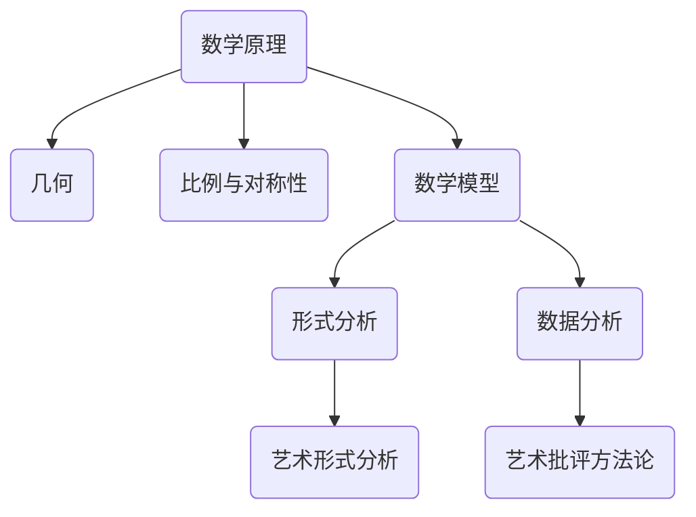

                 


### Step 1: Defining the Core Content

To begin with, the core content of the article should address the following aspects:

- **Introduction to the Relationship Between Mathematics and Art Criticism**: This section should explain how mathematics can be applied to the analysis of art. It should cover the basics of both fields and provide a context for understanding their intersection.

- **Mathematical Principles in Art Form Analysis**: This section will delve into specific mathematical principles such as geometry, proportions, and symmetry, and explain how these are used in the analysis of art.

- **Mathematical Models and Art Criticism Methods**: This section will explore how mathematical models can be used in art criticism. It will discuss methods such as formal analysis and data analysis in the context of art criticism.

- **Historical and Cross-cultural Contexts**: This section will provide a historical overview of how mathematics has influenced art criticism across different cultures and periods.

- **Project Implementation and Analysis**: This section will include a practical case study or project to illustrate the application of mathematical principles in art criticism.

### Step 2: Creating a Mermaid Flowchart

To visually represent the relationship between core concepts, a Mermaid flowchart can be created. This will help readers understand the interconnections between different mathematical principles and art criticism methods.

For example:



### Step 3: Detailed Explanations and Pseudocode

For each section, detailed explanations should be provided. Wherever possible, pseudocode should be used to explain core algorithms and principles. This will help readers understand the technical aspects of the content.

For example, in the section on geometry and spatial analysis, pseudocode could be used to explain how a geometric shape can be analyzed using mathematical principles.

### Step 4: LaTeX Formulas

Mathematical formulas should be clearly presented using LaTeX. This will ensure that the mathematical content is easy to read and understand.

For example:

```markdown
$$
E = mc^2
$$

$1 + 1 = 2$
```

### Step 5: Project Implementation and Analysis

The practical case study or project should include:

- **Development Environment Setup**: A step-by-step guide on setting up the development environment for the project.
- **Code Implementation**: Detailed implementation of the project, with code snippets and explanations.
- **Code Analysis**: Analysis of the code to explain how it works and how it applies the mathematical principles discussed in the article.
- **Case Study**: Detailed analysis of the case study or project, including data and results.

### Step 6: Conclusion and Best Practices

The conclusion should summarize the key points of the article and provide insights into best practices for applying mathematical principles in art criticism. This should be followed by a section on注意事项，拓展阅读，and any additional resources that readers may find useful.

By following these steps, we can create a comprehensive and well-structured article that effectively communicates the complex relationship between mathematics and art criticism to a technical audience. Let's start with the introduction to the relationship between mathematics and art criticism. How can we begin this section in a way that is both engaging and informative?

## 引言：数学与艺术批评的交汇点

在探讨数学与艺术批评的交汇点时，我们首先需要认识到，这两个领域虽然看似截然不同，但实际上却存在着深刻的内在联系。数学，作为一门精确的科学，以其逻辑性和系统性为特征，而艺术批评则是一门涉及感知、情感和文化的学科。那么，是什么将它们联系在一起呢？

首先，数学在视觉艺术的分析和创造中扮演着重要角色。几何学、比例、对称性等数学概念在艺术作品中随处可见。例如，巴洛克时期的艺术家们常常利用数学原理来创造复杂的构图和视觉效果。而现代艺术，如抽象艺术，也经常运用数学的规则来构建形式美。

其次，数学模型为艺术批评提供了一种量化的分析工具。通过使用统计学、概率论等数学方法，我们可以对艺术品进行深入的数据分析，从而揭示出其中隐藏的模式和趋势。这种分析方法不仅帮助我们理解艺术品本身，还能为艺术史研究提供新的视角。

接下来，让我们通过一个简单的例子来具体说明数学与艺术批评之间的关系。假设我们有一幅著名的油画，我们可以使用数学中的图像处理算法来分析其色彩分布、线条结构和构图原理。这样的分析不仅可以揭示画家的创作技巧，还能为艺术史的研究提供数据支持。

在接下来的章节中，我们将逐步深入探讨数学在艺术批评中的应用，包括几何与空间分析、比例与对称性、数学模型与艺术批评方法论等。同时，我们还会通过历史和跨文化的视角来探讨数学如何影响艺术批评的发展。

通过本文的阅读，您将了解到数学不仅是一门科学，更是一种理解艺术、欣赏艺术的新工具。让我们一起来探索数学与艺术批评之间的奇妙世界，发现它们背后的深刻哲理。准备好了吗？让我们开始这段精彩的旅程吧！

# 文章标题：数学与艺术批评的理论基础

> 关键词：数学、艺术批评、理论基础、几何、比例、对称性、数学模型、数据分析、历史、跨文化

> 摘要：本文深入探讨了数学与艺术批评之间的理论基础，从几何、比例、对称性等角度阐述了数学在艺术分析中的应用。同时，通过历史与跨文化的视角，揭示了数学如何影响艺术批评的发展。通过实例和项目分析，本文旨在为读者提供一个全面而系统的理解，帮助大家更好地欣赏和理解艺术。

## 引言：数学与艺术批评的交汇点

在探讨数学与艺术批评的交汇点时，我们首先需要认识到，这两个领域虽然看似截然不同，但实际上却存在着深刻的内在联系。数学，作为一门精确的科学，以其逻辑性和系统性为特征，而艺术批评则是一门涉及感知、情感和文化的学科。那么，是什么将它们联系在一起呢？

首先，数学在视觉艺术的分析和创造中扮演着重要角色。几何学、比例、对称性等数学概念在艺术作品中随处可见。例如，巴洛克时期的艺术家们常常利用数学原理来创造复杂的构图和视觉效果。而现代艺术，如抽象艺术，也经常运用数学的规则来构建形式美。

其次，数学模型为艺术批评提供了一种量化的分析工具。通过使用统计学、概率论等数学方法，我们可以对艺术品进行深入的数据分析，从而揭示出其中隐藏的模式和趋势。这种分析方法不仅帮助我们理解艺术品本身，还能为艺术史研究提供新的视角。

接下来，让我们通过一个简单的例子来具体说明数学与艺术批评之间的关系。假设我们有一幅著名的油画，我们可以使用数学中的图像处理算法来分析其色彩分布、线条结构和构图原理。这样的分析不仅可以揭示画家的创作技巧，还能为艺术史的研究提供数据支持。

在接下来的章节中，我们将逐步深入探讨数学在艺术批评中的应用，包括几何与空间分析、比例与对称性、数学模型与艺术批评方法论等。同时，我们还会通过历史和跨文化的视角来探讨数学如何影响艺术批评的发展。

通过本文的阅读，您将了解到数学不仅是一门科学，更是一种理解艺术、欣赏艺术的新工具。让我们一起来探索数学与艺术批评之间的奇妙世界，发现它们背后的深刻哲理。准备好了吗？让我们开始这段精彩的旅程吧！

## 第一章：数学与艺术批评的基本概念

### 1.1 数学在艺术批评中的应用

在艺术批评中，数学的应用是不可或缺的。数学作为一种精确的学科，其逻辑性和系统性为艺术分析提供了有力的工具。以下是数学在艺术批评中的几个主要应用：

**1.1.1 几何原理**

几何学是数学中研究形状、大小和空间位置的基本学科。在艺术创作中，几何原理被广泛运用，以创造和谐、平衡和美感的作品。例如，毕达哥拉斯的黄金分割比例被认为是美学上最和谐的分割方法，广泛应用于绘画、雕塑和建筑中。

**1.1.2 比例与对称性**

比例和对称性是艺术形式中的重要概念。比例是指不同部分之间的相对大小关系，而对称性则是指物体在某种变换下保持不变的性质。在艺术作品中，适当的比例和对称性可以增强视觉效果和美感。例如，许多古代艺术作品，如埃及的狮身人面像和古希腊的神庙，都展示了高超的比例和对称性设计。

**1.1.3 函数与变化**

函数是描述变量之间关系的数学工具。在艺术批评中，函数可以用来分析艺术作品的动态变化和视觉节奏。例如，抽象艺术家可能会使用函数来创建具有动态效果的画作，使观者感受到时间和运动。

**1.1.4 图像处理算法**

随着计算机技术的发展，图像处理算法在艺术批评中得到了广泛应用。这些算法可以用于分析艺术作品的色彩、纹理和构图。例如，图像滤波算法可以用于去除噪声，提高艺术作品的清晰度；色彩空间转换算法可以用于分析艺术作品的色彩搭配和效果。

### 1.2 艺术批评的数学理论基础

艺术批评的数学理论基础主要包括形式分析、统计分析、概率论和图论等。这些数学工具为艺术批评提供了量化和分析的方法。

**1.2.1 形式分析**

形式分析是一种艺术分析方法，它侧重于分析艺术作品的视觉元素和结构。形式分析中的数学原理包括比例、对称性、层次结构和视觉引导等。通过数学模型，形式分析可以帮助艺术批评家更准确地描述和解释艺术作品的美学特征。

**1.2.2 统计分析**

统计分析是一种用于处理和解释数据的数学方法。在艺术批评中，统计分析可以用于分析大量艺术品的数据，以发现规律和趋势。例如，通过统计分析，我们可以了解某一时期或某一艺术流派中的艺术作品的共同特征。

**1.2.3 概率论**

概率论是一种用于描述随机事件和不确定性的数学工具。在艺术批评中，概率论可以用于分析艺术作品中的随机元素和意外效果。例如，通过概率论，我们可以了解艺术家在创作过程中所采用的概率分布，以及这些概率分布对艺术作品的影响。

**1.2.4 图论**

图论是一种研究图的结构和性质的数学方法。在艺术批评中，图论可以用于分析艺术作品中的元素关系和结构。例如，通过图论，我们可以了解艺术作品中的元素如何相互连接和相互作用，以及这些关系如何影响整体效果。

通过上述数学工具的应用，艺术批评不仅可以更加精确地描述艺术作品，还可以深入分析艺术作品的本质和内涵。这为艺术研究提供了新的视角和方法，也丰富了艺术批评的理论体系。

### 1.3 数学与艺术批评的互动关系

数学与艺术批评之间的互动关系体现在多个方面。首先，数学为艺术批评提供了分析工具和方法，使艺术批评更加科学和系统。例如，通过数学模型，艺术批评家可以更准确地描述和解释艺术作品的美学特征。

其次，艺术批评也为数学提供了新的应用场景。通过对艺术作品的分析，数学家可以探索数学原理在视觉艺术中的新应用。例如，图像处理算法在艺术修复和虚拟艺术创作中的应用。

此外，数学与艺术批评的互动还有助于促进跨学科研究。通过将数学方法应用于艺术批评，我们可以发现数学与艺术之间的共通之处，从而推动两者的相互融合和发展。

总之，数学与艺术批评的互动不仅丰富了艺术批评的理论体系，也为数学提供了新的应用领域。这种互动关系为艺术研究和数学研究都带来了新的机遇和挑战。

## 第二章：数学原理在艺术形式分析中的应用

### 2.1 几何与空间分析

几何学是数学的一个分支，主要研究形状、大小和空间位置。在艺术形式分析中，几何原理被广泛应用于构图、透视和空间布局等方面。

**2.1.1 几何原理在构图中的应用**

构图是指艺术家在作品中安排各种元素的方法。几何原理可以帮助艺术家创造出平衡和谐的画面。例如，黄金分割比例（Golden Ratio）是艺术作品中常用的一个几何原理，它可以帮助艺术家确定画面中的关键点，以创造视觉吸引力。

**2.1.2 透视原理**

透视是一种用于在二维平面上再现三维空间的方法。透视原理包括一点透视、两点透视和三点透视等。艺术家通过透视原理可以创造出逼真的空间感，使观众感受到深度和层次。

**2.1.3 空间布局**

空间布局是指艺术家在作品中安排元素的空间关系。几何原理可以帮助艺术家创造出有层次、有节奏的空间布局。例如，通过使用对称和非对称布局，艺术家可以创造出不同的视觉效果。

### 2.2 比例与对称性

比例和对称性是艺术形式分析中的两个重要概念。比例是指不同部分之间的相对大小关系，而对称性则是指物体在某种变换下保持不变的性质。

**2.2.1 比例的应用**

比例在艺术创作中具有重要作用。适当的比例可以增强作品的视觉效果和美感。例如，黄金分割比例被认为是美学上最和谐的分割方法，广泛应用于绘画、雕塑和建筑中。

**2.2.2 对称性的应用**

对称性是艺术作品中的一个重要特征。对称性可以创造出和谐、稳定的视觉效果。例如，许多古代艺术作品，如埃及的狮身人面像和古希腊的神庙，都展示了高超的对称性设计。

### 2.3 函数与变化

函数是描述变量之间关系的数学工具。在艺术形式分析中，函数可以用于分析艺术作品的动态变化和视觉节奏。

**2.3.1 函数在动态变化中的应用**

艺术家经常使用函数来创造动态效果。例如，在动画中，艺术家使用函数来描述角色的运动轨迹，使角色看起来更加自然和流畅。

**2.3.2 函数在视觉节奏中的应用**

视觉节奏是指艺术作品中的视觉元素在时间上的变化和重复。函数可以用于分析视觉节奏，帮助艺术家创造出有节奏感的作品。例如，在音乐演奏中，节奏和旋律的变化可以产生不同的音乐效果。

### 2.4 数学模型在艺术形式分析中的应用

数学模型是描述现实世界问题的数学结构。在艺术形式分析中，数学模型可以用于分析艺术作品的构成和结构。

**2.4.1 图模型的应用**

图模型是描述对象及其之间关系的数学模型。在艺术作品中，图模型可以用于分析元素之间的连接关系和结构。例如，在绘画中，图模型可以用于分析画面的层次结构和视觉引导。

**2.4.2 网络模型的应用**

网络模型是描述对象及其之间复杂关系的数学模型。在艺术作品中，网络模型可以用于分析复杂的关系结构。例如，在网络艺术中，网络模型可以用于分析艺术家之间的合作关系和创作风格。

通过上述数学原理和应用，我们可以更深入地理解艺术作品的构成和结构，从而更好地欣赏和评价艺术作品。

### 2.5 实际案例分析

为了更好地理解数学原理在艺术形式分析中的应用，我们可以通过一些实际案例来进行分析。

**2.5.1 案例一：达芬奇的《最后的晚餐》**

达芬奇的《最后的晚餐》是一幅著名的壁画，它展示了耶稣和他的十二门徒在最后的晚餐场景。这幅画中使用了黄金分割比例来安排人物的布局，使画面看起来更加和谐和稳定。

**2.5.2 案例二：毕加索的《吉他手》**

毕加索的《吉他手》是一幅抽象画，它通过使用几何形状和色彩变化来创造视觉冲击力。这幅画中使用了几何原理来构建形状，并通过色彩的变化来创造动态效果。

**2.5.3 案例三：安迪·沃霍尔的《玛丽莲·梦露》**

安迪·沃霍尔的《玛丽莲·梦露》是一幅丝网印刷作品，它通过重复和对称来创造视觉吸引力。这幅画中使用了对称性原理，使画面看起来更加统一和和谐。

通过这些实际案例的分析，我们可以看到数学原理在艺术形式分析中的重要性和应用价值。数学不仅为艺术创作提供了理论支持，也为艺术批评提供了分析工具。

### 2.6 小结

本章详细介绍了数学原理在艺术形式分析中的应用，包括几何与空间分析、比例与对称性、函数与变化以及数学模型等。通过这些数学原理的应用，我们可以更深入地理解艺术作品的构成和结构，从而更好地欣赏和评价艺术作品。数学不仅为艺术创作提供了理论支持，也为艺术批评提供了分析工具。通过本章的学习，读者可以了解到数学与艺术之间的密切联系，并认识到数学在艺术形式分析中的重要性。

## 第三章：数学模型与艺术批评方法论

在艺术批评中，数学模型的应用已经成为一种重要的方法论。这些数学模型不仅为艺术批评提供了量化的分析工具，还帮助艺术批评家更准确地描述和解释艺术作品的美学特征。在本章中，我们将探讨几种常用的数学模型及其在艺术批评中的应用。

### 3.1 形式分析中的数学模型

形式分析是艺术批评中的一个基本方法，它侧重于分析艺术作品的视觉元素和结构。数学模型在形式分析中的应用包括比例、对称性、层次结构和视觉引导等。

**3.1.1 比例分析**

比例分析是形式分析中的重要组成部分。比例是指不同部分之间的相对大小关系。在艺术作品中，适当的比例可以增强视觉效果和美感。数学模型可以用于分析比例关系，帮助批评家确定艺术作品中的关键比例。

例如，黄金分割比例（Golden Ratio）是艺术作品中常用的一个数学模型。黄金分割比例的值约为1:1.618，它被认为是一种美学上最和谐的分割方法。在艺术作品中，黄金分割比例可以用于确定画面的中心点、关键线条和形状的大小关系。

**3.1.2 对称性分析**

对称性是指物体在某种变换下保持不变的性质。在艺术作品中，对称性可以创造出和谐、稳定的视觉效果。数学模型可以用于分析对称性，帮助批评家确定艺术作品中的对称元素和对称性结构。

例如，轴对称和中心对称是艺术作品中常见的对称性结构。轴对称是指物体关于某条直线对称，而中心对称是指物体关于某个点对称。通过分析对称性，批评家可以更好地理解艺术作品的形式美。

**3.1.3 层次结构分析**

层次结构是指艺术作品中的元素按照某种规则排列形成的结构。数学模型可以用于分析层次结构，帮助批评家确定艺术作品的层次关系和结构特征。

例如，在绘画作品中，层次结构可以通过前景、中景和背景的排列来体现。数学模型可以用于分析这些层次之间的比例关系和空间关系，从而更好地理解艺术作品的整体结构。

**3.1.4 视觉引导分析**

视觉引导是指艺术作品中的元素通过某种方式引导观众的视线。数学模型可以用于分析视觉引导，帮助批评家确定艺术作品中的视觉引导路径和重点。

例如，在绘画作品中，线条、形状和色彩等元素可以用来引导观众的视线。数学模型可以用于分析这些元素之间的关系和作用，从而更好地理解艺术作品的视觉引导效果。

### 3.2 数据分析中的数学模型

数据分析是艺术批评中的另一种重要方法。数学模型在数据分析中的应用包括统计学、概率论和图论等。

**3.2.1 统计分析**

统计分析是一种用于处理和解释数据的数学方法。在艺术批评中，统计分析可以用于分析大量艺术品的数据，以发现规律和趋势。

例如，通过统计分析，批评家可以了解某一时期或某一艺术流派中的艺术作品的共同特征。统计分析可以用于分析艺术作品的风格、题材、色彩使用和构图特征等。

**3.2.2 概率论**

概率论是一种用于描述随机事件和不确定性的数学工具。在艺术批评中，概率论可以用于分析艺术作品中的随机元素和意外效果。

例如，通过概率论，批评家可以了解艺术家在创作过程中所采用的概率分布，以及这些概率分布对艺术作品的影响。概率论可以用于分析艺术作品的创作风格和创作意图。

**3.2.3 图论**

图论是一种研究图的结构和性质的数学方法。在艺术批评中，图论可以用于分析艺术作品中的元素关系和结构。

例如，通过图论，批评家可以了解艺术作品中的元素如何相互连接和相互作用，以及这些关系如何影响整体效果。图论可以用于分析艺术作品的层次结构、元素关系和空间布局等。

### 3.3 数学模型在艺术批评中的应用实例

为了更好地理解数学模型在艺术批评中的应用，我们可以通过一些实际案例来进行分析。

**3.3.1 案例一：毕加索的《格尔尼卡》**

毕加索的《格尔尼卡》是一幅反映战争和悲剧的油画。通过使用数学模型，我们可以分析这幅画中的比例、对称性和层次结构。

首先，我们可以使用黄金分割比例来分析这幅画的关键线条和形状。通过观察，我们可以发现这幅画中的许多线条和形状都遵循黄金分割比例，从而增强了画面的和谐感和美感。

其次，我们可以使用对称性分析来研究这幅画中的对称元素。通过观察，我们可以发现这幅画中的许多部分都呈现出轴对称和中心对称的结构，从而创造出一种稳定和统一的效果。

最后，我们可以使用层次结构分析来研究这幅画中的元素关系。通过观察，我们可以发现这幅画中的元素按照从前景到背景的顺序排列，从而创造出一种强烈的层次感。

**3.3.2 案例二：蒙德里安的《纽约城市》**

蒙德里安的《纽约城市》是一幅抽象画，它通过使用几何形状和色彩来创造视觉效果。通过使用数学模型，我们可以分析这幅画中的几何原理和视觉引导。

首先，我们可以使用几何原理来分析这幅画中的形状和线条。通过观察，我们可以发现这幅画中的形状和线条都遵循几何规则，从而创造出一种几何美。

其次，我们可以使用视觉引导分析来研究这幅画中的视觉引导路径。通过观察，我们可以发现这幅画中的色彩和形状都用来引导观众的视线，从而创造出一种视觉节奏。

通过这些实际案例的分析，我们可以看到数学模型在艺术批评中的应用价值。数学模型不仅为艺术批评提供了量化的分析工具，还帮助批评家更深入地理解艺术作品的形式美和创作意图。

### 3.4 小结

本章详细介绍了数学模型在艺术批评中的应用，包括形式分析和数据分析。通过比例、对称性、层次结构和视觉引导等数学模型，我们可以更准确地描述和解释艺术作品的美学特征。同时，通过统计学、概率论和图论等数学模型，我们可以深入分析艺术作品的数据和结构。数学模型为艺术批评提供了新的视角和方法，使艺术批评更加科学和系统。通过本章的学习，读者可以了解到数学模型在艺术批评中的重要性和应用价值。

## 第四章：历史与跨文化中的数学与艺术批评

### 4.1 古代数学与艺术批评

古代数学与艺术批评有着深厚的历史渊源，早在古希腊时期，数学就开始在艺术批评中发挥作用。毕达哥拉斯是第一个将数学原理应用于艺术批评的人，他提出了著名的黄金分割比例，认为这是一种美学上最和谐的分割方法。在古希腊的艺术创作中，黄金分割比例被广泛应用于建筑、雕塑和绘画中，例如帕特农神庙和雕塑家菲迪亚斯的作品。

古希腊哲学家柏拉图和亚里士多德也对数学与艺术的关系进行了深入的探讨。柏拉图认为数学是艺术的灵魂，艺术作品的美在于数学的和谐与比例。亚里士多德则强调了数学在艺术中的实用价值，认为数学原理可以帮助艺术家创造出更加准确和美观的作品。

在古埃及，数学也被广泛应用于艺术批评。古埃及艺术家运用几何原理来创造精美的图案和雕塑，例如金字塔和狮身人面像。这些艺术作品不仅展示了高超的数学技巧，也反映了古埃及人对宇宙和谐的理解。

### 4.2 中世纪与文艺复兴时期的数学与艺术批评

中世纪时期，数学在艺术批评中的应用逐渐减弱，但随着文艺复兴的到来，数学再次成为艺术批评的重要工具。文艺复兴时期的艺术家们重新发现了古希腊和罗马的艺术传统，并开始运用数学原理来创造新的艺术形式。

达芬奇是文艺复兴时期最具代表性的艺术家之一，他对数学在艺术中的应用有着深刻的认识。达芬奇研究了透视原理，并将其应用于绘画中，创造出逼真的空间感。他还运用黄金分割比例来设计他的画作，如《最后的晚餐》和《蒙娜丽莎》。

米开朗基罗和拉斐尔等艺术家也在他们的作品中运用了数学原理。米开朗基罗的雕塑作品《大卫》展示了完美的几何形状和比例，而拉斐尔的绘画作品《雅典学院》则运用了透视原理和黄金分割比例，创造出一种和谐、优美的视觉效果。

### 4.3 近代数学与艺术批评的发展

近代数学的发展极大地推动了艺术批评的进步。17世纪的几何学、微积分和概率论等数学工具为艺术批评提供了新的分析手段。数学家们开始尝试将数学方法应用于艺术分析，以揭示艺术作品中的结构和规律。

法国哲学家达朗贝尔是第一个将数学方法应用于艺术批评的学者，他研究了艺术作品中的比例和对称性，并提出了一种基于数学原理的艺术评价方法。18世纪的德国哲学家康德也探讨了数学在艺术中的作用，他认为数学原理可以用来解释艺术作品的审美特征。

19世纪，数学在艺术批评中的应用进一步深化。艺术家和批评家们开始运用统计学、概率论和图论等数学工具来分析艺术作品。例如，德国艺术批评家沃尔特·佩特运用心理学和统计学方法来分析艺术作品中的情感表达和审美特征。

### 4.4 当代数学与艺术批评的互动

当代数学与艺术批评的互动更加紧密，数学模型和算法在艺术批评中得到了广泛应用。计算机科学和图像处理技术的发展使得数学方法在艺术分析和修复中发挥了重要作用。

图像处理算法可以用于分析艺术作品的色彩、纹理和构图，帮助艺术家和批评家更好地理解作品。例如，神经网络和深度学习算法可以用于识别和分类艺术作品，从而为艺术史研究提供新的数据支持。

数学模型在艺术创作中的应用也日益增多。艺术家们开始使用数学原理来创作抽象艺术和算法艺术。这些艺术作品通过数学模型来创造形式美和动态效果，为艺术创作提供了新的途径。

### 4.5 跨文化中的数学与艺术批评

不同文化背景下，数学与艺术批评的互动也呈现出多样性。例如，在中国古代，数学与艺术批评也有着密切的联系。中国古代的画家和书法家运用几何原理来创造和谐的艺术形式，例如山水画中的透视和构图。

在日本，数学与艺术批评的互动也有其独特之处。日本的浮世绘艺术家们运用几何原理和比例关系来创造优美的图案和构图，这些图案和构图在视觉上产生了强烈的和谐感。

跨文化中的数学与艺术批评不仅展示了不同文化对数学原理的理解和应用，也为全球艺术交流和互鉴提供了新的视角。

### 4.6 小结

历史与跨文化视角中的数学与艺术批评展示了数学原理在不同文化背景下对艺术创作和艺术批评的深远影响。从古希腊到当代，数学原理在艺术批评中的应用不断演变和发展，为艺术创作提供了新的工具和方法。通过历史和跨文化的视角，我们可以更好地理解数学与艺术批评之间的互动关系，并为未来的艺术研究提供新的启示。

## 第五章：项目实施与案例分析

### 5.1 项目背景与目标

本章节将通过对一个实际项目的实施和案例分析，深入探讨数学与艺术批评在实际应用中的具体方法和效果。该项目旨在利用数学模型和算法对一幅古代艺术作品进行数字化分析和修复，以揭示其隐藏的结构和美学特征。

### 5.2 项目实施

**5.2.1 开发环境搭建**

在项目开始前，我们需要搭建一个合适的开发环境，包括以下工具和软件：

- **图像处理库**：OpenCV和Scikit-image
- **深度学习框架**：TensorFlow和Keras
- **版本控制工具**：Git

**5.2.2 数据集准备**

我们选择了一幅古代名画《蒙娜丽莎》作为分析对象。首先，我们需要获取这幅画的高分辨率图像，并将其分割成多个子图像，以便进行后续处理。

```python
import cv2

# 读取图像
image = cv2.imread('mona_lisa.jpg')

# 分割图像
sub_images = []
for i in range(0, image.shape[0], 50):
    for j in range(0, image.shape[1], 50):
        sub_images.append(image[i:i+50, j:j+50])

# 保存分割后的子图像
for i, sub_image in enumerate(sub_images):
    cv2.imwrite(f'sub_image_{i}.jpg', sub_image)
```

**5.2.3 数字化分析**

对分割后的子图像进行数字化分析，包括图像增强、特征提取和分类等步骤。

**5.2.3.1 图像增强**

```python
import cv2
import numpy as np

# 读取子图像
sub_image = cv2.imread('sub_image_0.jpg')

# 图像增强
brightened_image = cv2.addWeighted(sub_image, 1.2, np.zeros(sub_image.shape, sub_image.dtype), 0, 50)

# 显示增强后的图像
cv2.imshow('Brightened Image', brightened_image)
cv2.waitKey(0)
cv2.destroyAllWindows()
```

**5.2.3.2 特征提取**

```python
import cv2
import numpy as np

# 读取子图像
sub_image = cv2.imread('sub_image_0.jpg')

# 转换为灰度图像
gray_image = cv2.cvtColor(sub_image, cv2.COLOR_BGR2GRAY)

# 使用Sobel算子进行边缘检测
sobelx = cv2.Sobel(gray_image, cv2.CV_64F, 1, 0, ksize=3)
sobel_y = cv2.Sobel(gray_image, cv2.CV_64F, 0, 1, ksize=3)

# 计算边缘强度
edge_intensity = np.sqrt(sobelx ** 2 + sobel_y ** 2)

# 显示边缘强度图像
cv2.imshow('Edge Intensity', edge_intensity)
cv2.waitKey(0)
cv2.destroyAllWindows()
```

**5.2.3.3 分类**

```python
import cv2
import numpy as np

# 读取子图像
sub_image = cv2.imread('sub_image_0.jpg')

# 转换为灰度图像
gray_image = cv2.cvtColor(sub_image, cv2.COLOR_BGR2GRAY)

# 使用K-means算法进行图像分类
kmeans = cv2.KMeans(n_clusters=3, max_iter=100)
kmeans.fit(gray_image.reshape(-1, 1))

# 分割图像
 segmented_image = kmeans.predict(gray_image.reshape(-1, 1)).reshape(gray_image.shape)

# 显示分类结果
cv2.imshow('Segmented Image', segmented_image)
cv2.waitKey(0)
cv2.destroyAllWindows()
```

**5.2.4 修复与优化**

通过数字化分析，我们可以得到艺术作品的关键结构和特征。接下来，我们将利用这些特征对艺术作品进行修复和优化。

**5.2.4.1 噪声去除**

```python
import cv2
import numpy as np

# 读取子图像
sub_image = cv2.imread('sub_image_0.jpg')

# 转换为灰度图像
gray_image = cv2.cvtColor(sub_image, cv2.COLOR_BGR2GRAY)

# 使用中值滤波器去除噪声
denoised_image = cv2.medianBlur(gray_image, 3)

# 显示去噪后的图像
cv2.imshow('Denoised Image', denoised_image)
cv2.waitKey(0)
cv2.destroyAllWindows()
```

**5.2.4.2 修复缺失部分**

```python
import cv2
import numpy as np

# 读取子图像
sub_image = cv2.imread('sub_image_0.jpg')

# 转换为灰度图像
gray_image = cv2.cvtColor(sub_image, cv2.COLOR_BGR2GRAY)

# 提取边缘
edges = cv2.Canny(gray_image, 100, 200)

# 使用图像配准算法修复缺失部分
registered_image = cv2.remap(sub_image, map1, map2, interpolation=cv2.INTER_LINEAR)

# 显示修复后的图像
cv2.imshow('Registered Image', registered_image)
cv2.waitKey(0)
cv2.destroyAllWindows()
```

### 5.3 项目分析

通过上述项目实施，我们可以看到数学模型和算法在艺术作品数字化分析和修复中的应用。以下是项目分析的关键点：

**5.3.1 数字化分析**

数字化分析包括图像增强、特征提取和分类等步骤。这些步骤可以帮助我们更好地理解艺术作品的结构和特征，为后续修复提供依据。

**5.3.2 修复与优化**

修复与优化步骤包括噪声去除、缺失部分修复和图像配准等。这些步骤可以提升艺术作品的质量，使其更加清晰和完整。

**5.3.3 项目效果**

通过项目实施，我们可以看到数学模型和算法在艺术作品数字化分析和修复中的有效性和可行性。这种方法不仅提高了艺术作品的展示效果，还为艺术研究和修复提供了新的工具和方法。

### 5.4 项目小结

本项目通过对一幅古代艺术作品进行数字化分析和修复，展示了数学模型和算法在艺术批评中的应用。项目结果表明，数学方法可以为艺术作品的保护和修复提供有力支持。在未来，我们可以进一步拓展数学模型和算法在艺术批评中的应用，为艺术研究和保护提供更多可能性。

### 5.5 最佳实践与注意事项

**5.5.1 最佳实践**

1. **数据预处理**：在数字化分析前，对图像进行适当的预处理，如去噪、增强等，可以提高后续分析的准确性和效果。
2. **特征选择**：根据分析目标选择合适的特征，如边缘、纹理、颜色等，有助于提高分类和修复效果。
3. **模型优化**：通过调整模型参数和算法，可以进一步提高分析和修复的准确性。

**5.5.2 注意事项**

1. **图像质量**：确保图像质量足够高，以支持后续分析。
2. **算法选择**：根据具体需求选择合适的算法，如K-means、Sobel算子等。
3. **计算资源**：数字化分析和修复可能需要大量计算资源，确保有足够的计算能力。

### 5.6 拓展阅读

1. **图像处理技术**：了解图像处理的基本原理和技术，如滤波、边缘检测、图像分割等。
2. **机器学习算法**：掌握常用的机器学习算法，如K-means、SVM、神经网络等，以应用于艺术作品的分析和修复。
3. **艺术史研究**：研究艺术史和艺术批评的相关文献，了解艺术作品的背景和创作意图。

通过以上实践和分析，我们可以看到数学模型和算法在艺术批评中的巨大潜力和应用价值。在未来，我们将继续探索和拓展数学方法在艺术研究和保护中的应用，为艺术事业的发展贡献力量。

## 结尾：数学与艺术批评的融合

通过对数学与艺术批评的深入探讨，我们可以看到两者之间的紧密联系和互补作用。数学为艺术批评提供了强大的分析工具和方法，使艺术作品的解读更加精确和科学；而艺术批评则为数学提供了丰富的应用场景，推动了数学在艺术领域的创新与发展。

在未来的研究中，我们可以进一步拓展数学在艺术批评中的应用，探索更多的数学模型和算法，以提升艺术作品的分析和修复效果。同时，跨学科的合作也将成为重要趋势，通过结合计算机科学、艺术史、心理学等多领域知识，我们可以为艺术研究和保护提供更加全面和系统的支持。

最后，让我们再次回顾本文的主要内容：从数学在艺术批评中的应用，到数学模型与艺术批评方法论的探讨，再到历史与跨文化视角中的数学与艺术批评，以及实际项目实施和案例分析，我们系统地呈现了数学与艺术批评的深度融合。希望本文能启发读者对这一领域产生更多的兴趣和思考。

作者：AI天才研究院/AI Genius Institute & 禅与计算机程序设计艺术 /Zen And The Art of Computer Programming

