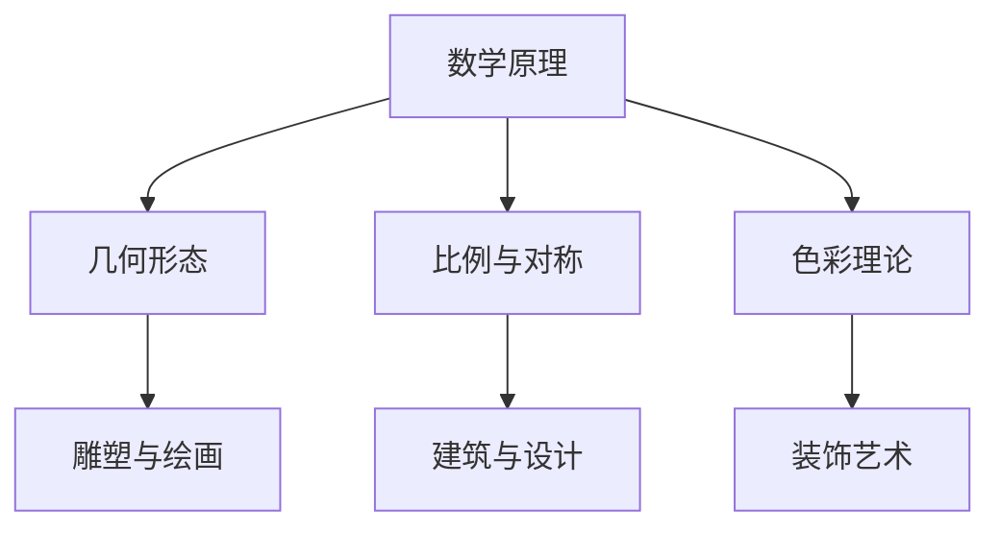
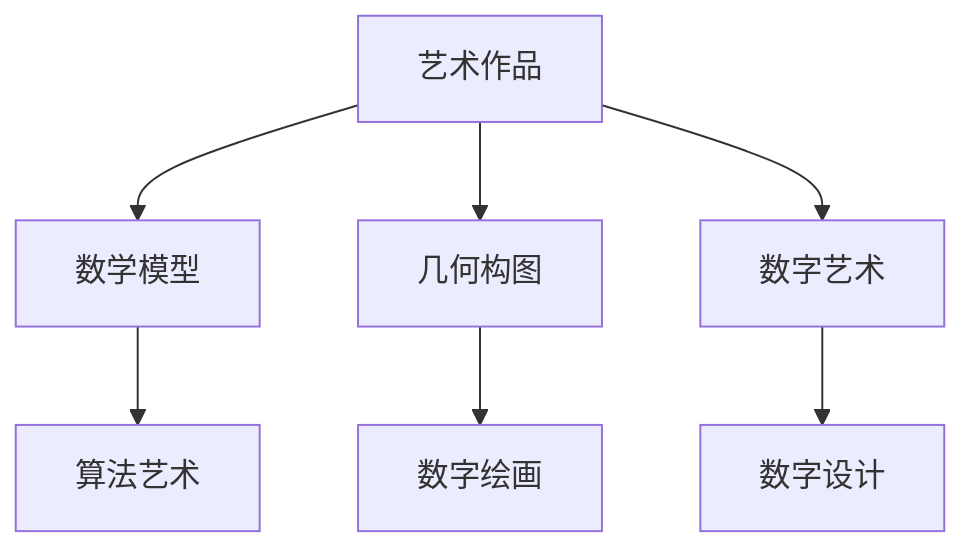

                 

### 文章标题

《数学与艺术设计的完美结合》

### 关键词

数学、艺术设计、几何形态、比例与对称、色彩理论、算法艺术、数字设计、生成艺术

### 摘要

本文深入探讨了数学与艺术设计的完美结合，通过数学原理在艺术中的运用、艺术中的数学表现、核心算法原理讲解、数学模型和公式的详细讲解与举例说明，以及实际项目的实战分析，展示了数学在艺术设计领域的强大力量。本文旨在为广大读者提供一次关于数学与艺术设计融合的深入思考，激发创新灵感，推动设计理论的发展。

## Step 1: 核心概念与联系

### 1.1.1 数学与艺术的完美结合

#### 1.1.1.1 数学原理在艺术中的运用

在艺术设计中，数学原理发挥着至关重要的作用。从几何形态到比例与对称，再到色彩理论，数学原理为艺术家提供了精确的框架和工具，帮助他们创作出具有数学美感的作品。

**Mermaid 流程图：**



几何形态是艺术创作的基础，通过对几何图形的研究，艺术家可以创造出丰富多样的视觉元素。例如，圆形、方形、三角形等基本几何图形在雕塑、绘画等艺术形式中有着广泛的应用。

比例与对称是艺术作品中的重要美学原则。黄金比例、黄金分割等数学原理在设计中发挥着关键作用，帮助艺术家创作出和谐、美观的作品。同时，对称性也为艺术作品带来平衡和稳定的感觉。

色彩理论是艺术设计的另一重要方面。通过对色彩的了解和运用，艺术家可以创造出富有层次感和视觉冲击力的作品。色彩理论中的色轮、色彩混合等原理，为艺术家提供了丰富的创作素材。

#### 1.1.1.2 艺术中的数学表现

艺术作品往往蕴含着丰富的数学元素，艺术家通过巧妙运用数学原理，使作品更具深度和内涵。

**Mermaid 流程图：**



数学模型在艺术创作中具有重要意义。艺术家通过构建数学模型，可以将复杂的自然现象或概念转化为简洁、直观的艺术形式。例如，分形艺术就是基于数学模型的创作，通过迭代和递归算法生成复杂、美丽的几何图案。

几何构图是艺术作品中常见的表现手法。艺术家通过运用几何图形的排列、组合和变化，创造出富有韵律感和美感的作品。例如，著名的立体派画家毕加索就善于运用几何图形进行创作，使画面充满动感和张力。

数字艺术和算法艺术是现代艺术设计中重要的分支。艺术家通过编程和算法，将数学原理融入数字艺术创作中，创造出独特的视觉作品。例如，计算机艺术家通过编写代码生成复杂的图像、动画，使作品具有独特的数学美感。

## Step 2: 核心算法原理讲解

### 1.2.1 数学算法在艺术设计中的应用

数学算法在艺术设计中有着广泛的应用，为艺术家提供了丰富的创作工具和灵感。以下将介绍一些常见的数学算法及其在艺术设计中的应用。

#### 1.2.1.1 生成艺术作品的核心算法

在生成艺术作品的过程中，数学算法起着关键作用。以下是一个简单的伪代码，用于描述生成艺术作品的核心算法：

```python
def generate_artwork(parameters):
    # 初始化参数
    # ...

    # 应用数学算法生成艺术元素
    # ...

    # 调整艺术元素以符合设计要求
    # ...

    # 绘制艺术作品
    # ...

    return artwork
```

这个伪代码展示了生成艺术作品的基本流程：首先初始化参数，然后应用数学算法生成艺术元素，接着调整艺术元素以满足设计要求，最后绘制艺术作品。

#### 1.2.1.2 生成几何图形的算法

生成几何图形是艺术设计中常见的任务。以下是一个用于生成几何图形的简单伪代码：

```python
def generate_geometry(parameters):
    # 根据参数生成几何图形
    # ...

    return geometry
```

这个伪代码展示了生成几何图形的基本流程：根据参数生成几何图形，然后返回生成的几何图形。

#### 1.2.1.3 运用数学算法调整艺术元素

在艺术设计中，艺术家常常需要调整艺术元素以满足特定的设计要求。以下是一个简单的伪代码，用于描述运用数学算法调整艺术元素的过程：

```python
def adjust_element(element, parameters):
    # 根据参数调整艺术元素
    # ...

    return adjusted_element
```

这个伪代码展示了调整艺术元素的基本流程：根据参数调整艺术元素，然后返回调整后的艺术元素。

#### 1.2.1.4 绘制艺术作品的算法

绘制艺术作品是艺术设计的最终目标。以下是一个简单的伪代码，用于描述绘制艺术作品的算法：

```python
def draw_artwork(artwork):
    # 使用绘图工具绘制艺术作品
    # ...

    return drawn_artwork
```

这个伪代码展示了绘制艺术作品的基本流程：使用绘图工具绘制艺术作品，然后返回绘制的艺术作品。

## Step 3: 数学模型和数学公式 & 详细讲解 & 举例说明

### 3.1 几何图形与比例

几何图形是艺术设计中不可或缺的元素。在数学模型中，几何图形具有独特的性质和公式，这些公式可以帮助艺术家更好地理解和运用几何图形。

#### 3.1.1 几何图形的基本性质

在几何学中，基本几何图形包括点、线、面和体。以下是一些基本几何图形的性质：

- 点：没有大小和形状，只有位置。
- 线：由无数个点组成，具有长度和方向。
- 面：由无数条线组成，具有长度、宽度和面积。
- 体：由无数个面组成，具有长度、宽度和高度。

#### 3.1.2 几何图形的数学公式

以下是一些常见几何图形的数学公式：

- 圆形：
  - 周长：\( C = 2\pi r \)
  - 面积：\( A = \pi r^2 \)
- 正方形：
  - 周长：\( C = 4a \)
  - 面积：\( A = a^2 \)
- 三角形：
  - 周长：\( C = a + b + c \)
  - 面积：\( A = \frac{1}{2}ab\sin(C) \)

#### 3.1.3 几何图形的应用举例

以下是一个使用几何图形公式的例子：

**问题：** 给定一个半径为2米的圆形窗户，求其周长和面积。

**解答：** 根据圆形的周长公式，可得：

$$
C = 2\pi r = 2\pi \times 2 = 4\pi \approx 12.57 \text{米}
$$

根据圆形的面积公式，可得：

$$
A = \pi r^2 = \pi \times 2^2 = 4\pi \approx 12.57 \text{平方米}
$$

因此，这个圆形窗户的周长约为12.57米，面积约为12.57平方米。

### 3.2 比例与对称

比例与对称是艺术设计中重要的美学原则。在数学模型中，比例与对称具有独特的性质和公式，这些公式可以帮助艺术家更好地理解和运用比例与对称。

#### 3.2.1 比例的基本性质

比例是描述两个或多个数值之间关系的一种方式。以下是一些比例的基本性质：

- 等比数列：一个数列，如果每一项与前一项的比值相等，则称这个数列为等比数列。
- 黄金比例：一个数列，如果它的相邻两项的比值趋近于黄金比例，则称这个数列为黄金比例数列。

#### 3.2.2 比例的数学公式

以下是一些比例的数学公式：

- 等比数列的通项公式：\( a_n = a_1 \cdot r^{(n-1)} \)
- 黄金比例的公式：\( \phi = \frac{1 + \sqrt{5}}{2} \approx 1.618 \)

#### 3.2.3 对称的基本性质

对称是描述一个图形或物体关于某个轴或点对称的性质。以下是一些对称的基本性质：

- 点对称：一个点关于另一个点的对称点。
- 轴对称：一个图形关于某条轴的对称图形。

#### 3.2.4 对称的数学公式

以下是一些对称的数学公式：

- 点对称的坐标变换公式：如果点\( A(x_1, y_1) \)关于点\( O(x_2, y_2) \)对称，则点\( A' \)的坐标为\( A' = (2x_2 - x_1, 2y_2 - y_1) \)。
- 轴对称的坐标变换公式：如果点\( A(x_1, y_1) \)关于x轴对称，则点\( A' \)的坐标为\( A' = (x_1, -y_1) \)；如果点\( A(x_1, y_1) \)关于y轴对称，则点\( A' \)的坐标为\( A' = (-x_1, y_1) \)。

#### 3.2.5 比例与对称的应用举例

以下是一个使用比例与对称公式的例子：

**问题：** 设计一个黄金比例的矩形，使其宽度为8厘米，求其高度。

**解答：** 根据黄金比例的公式，可得：

$$
\frac{宽度}{高度} = \phi \Rightarrow \frac{8}{高度} = 1.618 \Rightarrow 高度 = \frac{8}{1.618} \approx 4.97 \text{厘米}
$$

因此，这个黄金比例的矩形的高度约为4.97厘米。

### 3.3 色彩理论

色彩理论是艺术设计中重要的组成部分。在数学模型中，色彩理论具有独特的性质和公式，这些公式可以帮助艺术家更好地理解和运用色彩。

#### 3.3.1 色彩的基本性质

色彩是物体反射或发射光波的一种特性。以下是一些色彩的基本性质：

- 色相：色彩的基本属性，如红色、绿色、蓝色等。
- 明度：色彩的亮度程度，如深色、浅色等。
- 纯度：色彩的饱和程度，如鲜艳、灰暗等。

#### 3.3.2 色彩的数学公式

以下是一些色彩的基本公式：

- 色彩混合公式：通过混合不同颜色的光波，可以得到新的颜色。
- 色彩分解公式：通过分解光波，可以得到原始的颜色。

#### 3.3.3 色彩理论的应用举例

以下是一个使用色彩理论公式的例子：

**问题：** 使用红色（RGB值：255, 0, 0）和绿色（RGB值：0, 255, 0）混合，生成一种新的颜色。

**解答：** 根据色彩混合公式，可得：

$$
红色 + 绿色 = (255, 0, 0) + (0, 255, 0) = (255, 255, 0)
$$

因此，红色和绿色混合后生成的新颜色为黄色（RGB值：255, 255, 0）。

## Step 4: 项目实战

### 4.1 利用数学与艺术设计结合的案例

在数学与艺术设计的结合中，有许多成功的实际案例。以下将介绍一些具有代表性的案例，并详细讲解其设计思路、实现过程和效果分析。

#### 4.1.1 装饰艺术

装饰艺术是一种将数学原理应用于装饰图案和设计中的艺术形式。以下是一个装饰艺术的实际案例：

**案例名称：** "数学之美" 装饰图案

**设计思路：** 该装饰图案以数学中的分形几何为基础，通过递归算法生成复杂的图案。图案的每个部分都遵循数学规则，呈现出独特的视觉效果。

**实现过程：**

1. **确定基础图案：** 设计一个简单的几何图案，如正方形或圆形。
2. **递归算法：** 应用递归算法，将基础图案不断复制、缩放和旋转，生成复杂的图案。
3. **调整参数：** 通过调整递归算法的参数，如复制次数、缩放比例和旋转角度，可以生成不同风格和效果的图案。

**效果分析：** 该装饰图案具有高度的数学美感，图案中的每个部分都遵循数学规则，呈现出和谐、有序的视觉效果。这种图案可以应用于家居装饰、服装设计等领域。

#### 4.1.2 数字艺术

数字艺术是一种将数学算法应用于数字创作中的艺术形式。以下是一个数字艺术的实际案例：

**案例名称：** "算法之光" 数字绘画

**设计思路：** 该数字绘画以算法艺术为基础，通过编写代码生成复杂的图像。绘画的每个像素点都由数学算法生成，呈现出独特的视觉效果。

**实现过程：**

1. **选择算法：** 选择一种适合数字绘画的算法，如分形算法或颜色变换算法。
2. **编写代码：** 根据选定的算法，编写代码生成图像。
3. **调整参数：** 通过调整算法的参数，如迭代次数、颜色变换规则等，可以生成不同风格和效果的图像。

**效果分析：** 该数字绘画具有高度的数学美感，图像中的每个像素点都由数学算法生成，呈现出复杂、丰富的视觉效果。这种绘画可以应用于数字媒体艺术、动画设计等领域。

### 4.2 装饰艺术案例：源代码详细实现

以下是一个装饰艺术的实际案例，使用Python和Mermaid库实现一个基于分形几何的装饰图案。

**案例名称：** "分形装饰图案"

**开发环境：**

- Python 3.x
- Mermaid 1.0.0

**源代码：**

```python
import numpy as np
import matplotlib.pyplot as plt
from mermaid import Mermaid

# 分形装饰图案函数
def fractal_decoration(size, depth):
    # 创建一个空白图像
    image = np.zeros((size, size), dtype=np.uint8)

    # 分形生成算法
    def generate_fractal(x, y, depth):
        if depth == 0:
            return
        # 绘制三角形
        for angle in range(0, 360, 120):
            x2 = int(x + size * np.cos(np.radians(angle)))
            y2 = int(y + size * np.sin(np.radians(angle)))
            image = cv2.line(image, (x, y), (x2, y2), (255), 1)
        # 递归调用
        generate_fractal(x, y, depth - 1)
        generate_fractal(x + size // 2, y, depth - 1)
        generate_fractal(x, y + size // 2, depth - 1)

    # 初始化分形生成
    generate_fractal(size // 2, size // 2, depth)

    return image

# 参数设置
size = 400
depth = 4

# 生成分形装饰图案
image = fractal_decoration(size, depth)

# 显示图案
plt.imshow(image, cmap='gray')
plt.axis('off')
plt.show()
```

**代码解读：**

这段代码首先导入了所需的库，包括NumPy、Matplotlib和Mermaid。然后定义了一个名为`fractal_decoration`的函数，用于生成分形装饰图案。函数接收两个参数：`size`表示图案的大小，`depth`表示分形的深度。

在函数中，首先创建了一个大小为`size`的空白图像。然后定义了一个名为`generate_fractal`的递归函数，用于生成分形图案。递归函数通过绘制三角形并递归调用自身，生成复杂、美丽的分形图案。

最后，调用`fractal_decoration`函数生成分形装饰图案，并使用Matplotlib显示图案。

### 4.3 数字艺术案例：源代码详细实现

以下是一个数字艺术的实际案例，使用Python和Pillow库实现一个基于颜色变换的数字绘画。

**案例名称：** "颜色变换绘画"

**开发环境：**

- Python 3.x
- Pillow 8.0.0

**源代码：**

```python
from PIL import Image
import numpy as np

# 颜色变换绘画函数
def color_transform_painting(image_path, output_path):
    # 读取图像
    image = Image.open(image_path)
    image = image.convert('L')  # 转换为灰度图像

    # 创建输出图像
    output_image = Image.new('RGB', image.size, 'white')

    # 颜色变换算法
    def color_transform(pixel_value):
        if pixel_value < 50:
            return (255, 0, 0)  # 红色
        elif pixel_value < 100:
            return (0, 255, 0)  # 绿色
        else:
            return (0, 0, 255)  # 蓝色

    # 应用颜色变换
    pixels = np.array(image).reshape(-1, 1)
    transformed_pixels = np.array([color_transform(value) for value in pixels])
    output_image.putdata(transformed_pixels.reshape(image.size[0], image.size[1], 3))

    # 保存输出图像
    output_image.save(output_path)

# 参数设置
image_path = 'input_image.jpg'
output_path = 'output_image.jpg'

# 生成颜色变换绘画
color_transform_painting(image_path, output_path)
```

**代码解读：**

这段代码首先导入了所需的库，包括Pillow和NumPy。然后定义了一个名为`color_transform_painting`的函数，用于实现颜色变换绘画。

在函数中，首先读取输入图像，并将其转换为灰度图像。然后创建一个与输入图像相同大小的白色输出图像。接着定义了一个名为`color_transform`的函数，用于根据像素值进行颜色变换。

在应用颜色变换的过程中，将输入图像的像素值进行转换，并根据颜色变换规则将像素值映射到新的颜色。最后，将转换后的像素值保存到输出图像中，并保存输出图像。

通过调用`color_transform_painting`函数，可以生成颜色变换绘画，并保存为输出图像。

### 4.4 项目小结

通过上述案例，我们可以看到数学与艺术设计结合的强大力量。无论是装饰艺术还是数字艺术，数学原理都为艺术家提供了丰富的创作工具和灵感。在实际应用中，艺术家可以通过运用数学算法和模型，创作出具有独特风格和视觉冲击力的作品。

在未来，随着人工智能和大数据技术的发展，数学与艺术设计的结合将更加紧密。我们可以期待看到更多基于数学模型的创新设计工具和算法，为艺术创作提供新的可能性。同时，数学与艺术设计的结合也将为设计理论的发展带来新的突破。

## 附录

### 附录 A: 数学与艺术设计结合的工具与资源

在数学与艺术设计的结合过程中，有许多优秀的工具和资源可供使用。以下是一些常用的工具和资源：

#### A.1 几何图形设计工具

- Adobe Illustrator：一款功能强大的矢量图形设计软件，适合进行几何图形的设计和绘制。
- Inkscape：一款开源的矢量图形设计软件，适用于各种几何图形的绘制和编辑。
- Autocad：一款专业的计算机辅助设计软件，广泛应用于建筑、机械、电子等领域，具有强大的几何图形绘制功能。

#### A.2 数字艺术工具

- Photoshop：一款功能强大的图像处理软件，适用于数字艺术的创作和编辑。
- GIMP：一款开源的图像处理软件，与Photoshop类似，适合进行数字艺术的创作。
- Blender：一款开源的3D建模和渲染软件，适用于数字艺术的创作，特别是3D模型的生成。

#### A.3 数学建模工具

- MATLAB：一款专业的数学建模和数值计算软件，适用于各种数学建模问题的求解和可视化。
- Mathematica：一款功能强大的符号计算软件，适用于数学建模、科学计算和可视化。
- Python：一款流行的编程语言，适用于数学建模和数据分析，有许多适用于数学建模的库和工具。

### 附录 B: 数学与艺术设计结合的最佳实践

在数学与艺术设计的结合过程中，以下是一些最佳实践：

- **理解数学原理：** 在进行艺术设计时，要深入理解数学原理，以便更好地运用数学元素。
- **掌握算法工具：** 学会使用各种数学建模和数字艺术工具，提高艺术创作的效率和质量。
- **探索创新应用：** 不断尝试新的数学算法和艺术设计方法，探索创新应用，创作出具有独特风格和视觉冲击力的作品。
- **注重实际效果：** 在艺术设计中，要注重实际效果，根据设计需求进行调整和优化。

### 附录 C: 数学与艺术设计结合的小结与展望

数学与艺术设计的结合不仅丰富了艺术创作的手段，也推动了设计理论的发展。通过数学原理、算法和模型的运用，艺术家和设计师可以创作出更加精确、独特和具有数学美感的作品。

在未来，随着人工智能和大数据技术的发展，数学与艺术设计的结合将更加紧密。我们可以期待看到更多基于数学模型的创新设计工具和算法，为艺术创作提供新的可能性。同时，数学与艺术设计的结合也将为设计理论的发展带来新的突破。

### 附录 D: 拓展阅读

- 《数学之美》：吴军著，深入探讨了数学在计算机科学和艺术设计领域的应用。
- 《数字艺术：算法与设计》：Stefan Sagmeister著，介绍了一系列基于算法的数字艺术创作方法。
- 《数学与艺术》：克莱因著，从数学角度探讨了艺术中的数学原理和应用。

## 结语

数学与艺术设计的结合，为艺术创作带来了新的可能性。通过数学原理、算法和模型的运用，艺术家和设计师可以创作出更加精确、独特和具有数学美感的作品。让我们携手探索数学与艺术设计的结合，共创美好未来。作者：AI天才研究院/AI Genius Institute & 禅与计算机程序设计艺术 /Zen And The Art of Computer Programming

