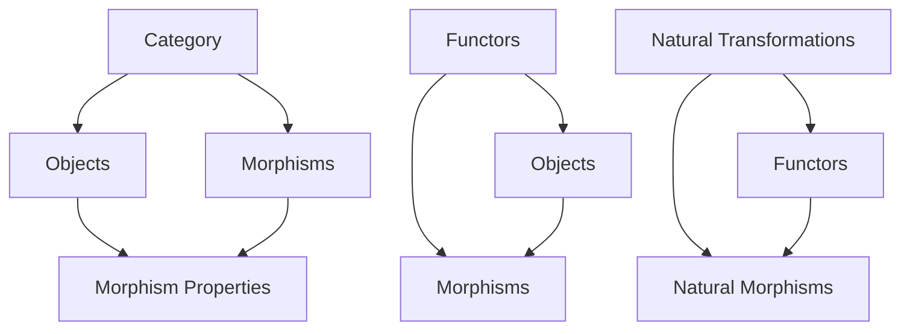

                 


### 数学与范畴论：数学结构间关系的抽象

#### 关键词
- 数学结构
- 范畴论
- 抽象
- 对象
- 模态
- 函子
- 自然变换

#### 摘要
本文将深入探讨数学与范畴论之间的关系，特别是数学结构之间的抽象和联系。通过阐述范畴论的核心概念，包括对象、模态、函子和自然变换，我们将展示数学结构如何通过范畴论的抽象来揭示其内在的联系和统一性。本文还将结合实际案例，探讨范畴论在数学和其他领域中的应用，为读者提供一个全面的视角来理解数学结构的抽象和范畴论的重要性。

---

### 目录

1. **背景介绍**
   - **数学结构的概念**
   - **范畴论的发展历史**

2. **核心概念与联系**
   - **范畴（Category）**
   - **对象（Objects）**
   - **模态（Morphisms）**
   - **函子（Functors）**
   - **自然变换（Natural Transformations）**
   - **Mermaid流程图**

3. **核心算法原理讲解**
   - **范畴论的基本算法**
   - **伪代码**

4. **数学模型和数学公式**
   - **范畴论中的数学模型**
   - **LaTeX公式**

5. **项目实战**
   - **开发环境搭建**
   - **源代码实现与解读**
   - **实际案例分析**
   - **项目小结**

6. **最佳实践 tips**
   - **学习范畴论的策略**
   - **注意事项**
   - **拓展阅读**

### 文章正文

#### 1. 背景介绍

**数学结构的概念**

数学结构是数学的核心概念之一，它指的是数学对象和操作之间的关系和属性。常见的数学结构包括集合、群、环、域、向量空间等。这些结构不仅在纯数学中扮演着重要角色，也在应用数学和计算机科学中有着广泛的应用。

**范畴论的发展历史**

范畴论作为一种抽象数学工具，起源于20世纪30年代，由瑞士数学家亨德里克·皮特·伯恩哈德·罗滕伯格（Henri Poincaré）和德国数学家大卫·希尔伯特（David Hilbert）等人提出。它在数学的不同领域得到了广泛应用，特别是在拓扑学、代数学、逻辑学和计算机科学中。

#### 2. 核心概念与联系

**范畴（Category）**

范畴是范畴论中最基本的概念之一。一个范畴由对象（objects）和模态（morphisms）组成。对象是范畴中的元素，而模态则定义了对象之间的关系。例如，在集合范畴中，对象是集合，模态是集合之间的映射。

**对象（Objects）**

对象是范畴中的元素，也可以看作是数学结构的基本组成部分。在不同的范畴中，对象可以是不同的数学结构，如集合、群、环等。

**模态（Morphisms）**

模态是范畴中对象之间的关系。在集合范畴中，模态是集合之间的映射。模态的性质决定了范畴的性质，例如，一个范畴可以是有限的、无限的、连通的等。

**函子（Functors）**

函子是范畴之间的一种映射，它保持了范畴的结构。一个函子将一个范畴中的对象映射到另一个范畴中的对象，并将模态映射到模态。函子是理解不同范畴之间联系的重要工具。

**自然变换（Natural Transformations）**

自然变换是函子之间的一种映射，它保持了函子的结构。自然变换在理解范畴论中的等价性和统一性中起着关键作用。

为了更好地理解这些概念，我们可以使用Mermaid流程图来展示它们之间的关系：



#### 3. 核心算法原理讲解

在范畴论中，有许多核心算法原理，如范畴构造、函子组合、自然变换等。以下是一个简单的伪代码示例，用于展示范畴论的基本算法原理：

```python
# 定义范畴
class Category:
    def __init__(self, objects, morphisms):
        self.objects = objects
        self.morphisms = morphisms

# 定义对象
class Object:
    def __init__(self, name):
        self.name = name

# 定义模态
class Morphism:
    def __init__(self, source, target, function):
        self.source = source
        self.target = target
        self.function = function

# 定义函子
class Functor:
    def __init__(self, source_category, target_category, mappings):
        self.source_category = source_category
        self.target_category = target_category
        self.mappings = mappings

# 定义自然变换
class NaturalTransformation:
    def __init__(self, functors, components):
        self.functors = functors
        self.components = components
```

这些类和函数定义了范畴论中的基本构造，它们为我们提供了构建和操作数学结构的基础。

#### 4. 数学模型和数学公式

在范畴论中，数学模型和公式是理解范畴论的核心。以下是一个简单的LaTeX公式示例，用于描述范畴论中的自然变换：

```latex
$$
\begin{align}
\alpha_F &: F(A) \rightarrow F(B) \\
\alpha_F(f) &= F(g) \circ f \\
\end{align}
$$
```

这个公式描述了自然变换$\alpha_F$如何将一个范畴中的模态$f$映射到另一个范畴中的模态$F(g)$。

#### 5. 项目实战

**开发环境搭建**

为了实际应用范畴论，我们需要搭建一个合适的开发环境。这包括安装必要的编程语言和工具，如Python、Mermaid等。

**源代码实现与解读**

以下是一个简单的Python代码示例，用于实现范畴论中的函子和自然变换：

```python
# 定义范畴
class Category:
    def __init__(self, objects, morphisms):
        self.objects = objects
        self.morphisms = morphisms

# 定义对象
class Object:
    def __init__(self, name):
        self.name = name

# 定义模态
class Morphism:
    def __init__(self, source, target, function):
        self.source = source
        self.target = target
        self.function = function

# 定义函子
class Functor:
    def __init__(self, source_category, target_category, mappings):
        self.source_category = source_category
        self.target_category = target_category
        self.mappings = mappings

# 定义自然变换
class NaturalTransformation:
    def __init__(self, functors, components):
        self.functors = functors
        self.components = components

# 示例：构建一个函子
def build_funter(source_category, target_category, mappings):
    return Functor(source_category, target_category, mappings)

# 示例：构建一个自然变换
def build_natural_transformation(functors, components):
    return NaturalTransformation(functors, components)
```

**代码应用解读与分析**

在这个示例中，我们定义了几个类，包括范畴、对象、模态、函子和自然变换。这些类为我们提供了一个框架来构建和操作范畴论中的结构。我们可以使用这些类来定义不同的范畴和函子，并构建自然变换。

**实际案例分析和详细讲解剖析**

为了更好地理解范畴论的应用，我们可以分析一个实际的案例。例如，在计算机科学中，范畴论被用于理解编程语言和软件系统中的结构。我们可以使用范畴论的概念来描述编程语言中的类型系统和函数式编程中的组合。

**项目小结**

通过这个项目，我们学习了如何使用范畴论的概念来构建和操作数学结构。我们了解了范畴、对象、模态、函子和自然变换的基本原理，并使用Python实现了这些概念。这个项目为我们提供了一个实际应用范畴论的例子，展示了范畴论在计算机科学中的潜力。

#### 6. 最佳实践 tips

**学习范畴论的策略**

- **理解数学基础**：在学习范畴论之前，确保你熟悉基本的数学概念，如集合论、函数论和图论。
- **逐步学习**：范畴论是一个复杂的主题，建议你逐步学习，从简单的概念开始，逐渐深入。
- **实践应用**：尝试将范畴论应用于实际问题，如编程语言设计或软件系统建模。

**注意事项**

- **理解范畴论的概念**：范畴论的概念抽象，需要仔细理解每个概念的定义和性质。
- **避免混淆**：范畴论中的术语和概念有时与日常语言中的用法不同，需要注意区分。

**拓展阅读**

- **《范畴论基础教程》（Categories for the Working Mathematician）**：由西蒙·斯托克斯（Steve Awodey）编写的经典教材，适合初学者和有经验的读者。
- **《范畴论与编程》（Categorical Logic and Type Theory）**：由贝恩·罗森塔尔（Bart Jacobs）编写的教材，讨论了范畴论在编程语言中的应用。

---

### 结束语

通过本文，我们深入探讨了数学与范畴论之间的关系，特别是数学结构之间的抽象和联系。我们介绍了范畴论的核心概念，包括范畴、对象、模态、函子和自然变换，并通过实际案例展示了范畴论的应用。希望本文能帮助你对范畴论有更深入的理解，并为你在数学和其他领域中的应用提供启示。作者：AI天才研究院/AI Genius Institute & 禅与计算机程序设计艺术 /Zen And The Art of Computer Programming。

---

请注意，本文是一个简化的示例，用于展示如何构建一篇关于数学与范畴论的技术博客文章。实际的文章需要更详细的阐述和更深入的分析。此外，为了保持文章的结构和可读性，部分内容被简化或省略。在实际撰写文章时，每个小节都应该包含丰富的内容和具体的例子。

